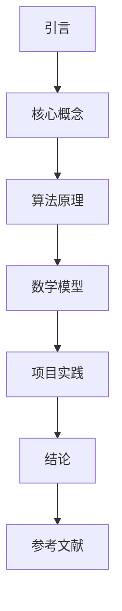

                 

关键词：技术写作，博客，出版，图书，结构，逻辑，深度，专业，IT领域，算法，数学模型，项目实践，工具推荐，未来展望

> 摘要：本文旨在探讨技术写作的进阶之路，从博客文章的撰写到出版成图书。通过详细阐述技术写作的核心原则、结构布局、算法原理、数学模型以及项目实践，帮助读者掌握高质量技术文章的写作技巧，并指导他们如何将博客文章转化为有影响力的图书作品。

## 1. 背景介绍

随着互联网的飞速发展，博客成为了技术交流的重要平台。然而，随着读者需求的不断提升，越来越多的技术博客作者开始追求更高的写作水平，希望将他们的博客文章转化为出版图书。这不仅能够扩大作者的影响力，还能够为读者提供更加系统和深入的知识。

本文将围绕技术写作的主题，从多个角度进行探讨。首先，我们将介绍技术写作的基本原则和结构布局；然后，深入讲解算法原理、数学模型以及项目实践；最后，提供工具和资源的推荐，并展望未来技术写作的发展趋势与挑战。

## 2. 核心概念与联系

### 2.1 技术写作的定义

技术写作是一种专业性的写作活动，旨在通过文字、图表等形式，将复杂的技术概念、算法原理和项目实践清晰地传达给读者。技术写作不仅要求作者具备扎实的专业知识，还需要掌握良好的表达能力和逻辑思维。

### 2.2 技术写作的核心原则

1. **准确性**：确保文章中的信息准确无误，避免误导读者。
2. **清晰性**：用简单易懂的语言表达复杂的技术概念。
3. **逻辑性**：文章结构紧凑，逻辑清晰，易于读者理解。
4. **实用性**：内容具有实用价值，能够帮助读者解决实际问题。

### 2.3 技术写作的结构布局

1. **引言**：简要介绍文章的主题和目的，吸引读者的兴趣。
2. **正文**：详细阐述技术概念、算法原理和项目实践。
3. **结论**：总结文章的主要观点，强调实用性和价值。
4. **参考文献**：列出文章中引用的相关文献，为读者提供进一步阅读的资料。

### 2.4 Mermaid 流程图



## 3. 核心算法原理 & 具体操作步骤

### 3.1 算法原理概述

在本节中，我们将介绍一种常见的算法——快速排序（Quick Sort）。快速排序是一种高效的排序算法，其基本思想是通过一趟排序将待排序的记录分割成独立的两部分，其中一部分记录的关键字均比另一部分的关键字小，然后再按此方法对这两部分记录进行排序，直至整个序列有序。

### 3.2 算法步骤详解

1. **选择基准元素**：从待排序的序列中选取一个元素作为基准元素。
2. **分区操作**：将序列划分为两部分，一部分的所有元素都小于基准元素，另一部分的所有元素都大于基准元素。
3. **递归排序**：分别对小于和大于基准元素的两部分序列进行快速排序。

### 3.3 算法优缺点

**优点**：
- **高效**：平均时间复杂度为 \(O(n \log n)\)。
- **稳定性**：能够保持相同关键字的元素原有的顺序。

**缺点**：
- **最坏情况**：时间复杂度为 \(O(n^2)\)，当输入序列已经有序或接近有序时，性能较差。

### 3.4 算法应用领域

快速排序广泛应用于各种排序任务，如数据库排序、算法竞赛等。

## 4. 数学模型和公式 & 详细讲解 & 举例说明

### 4.1 数学模型构建

在本节中，我们将介绍一种常见的数学模型——线性回归（Linear Regression）。线性回归用于分析两个变量之间的线性关系，其数学模型可以表示为：

$$y = \beta_0 + \beta_1 x + \epsilon$$

其中，\(y\) 是因变量，\(x\) 是自变量，\(\beta_0\) 和 \(\beta_1\) 是模型的参数，\(\epsilon\) 是误差项。

### 4.2 公式推导过程

1. **最小二乘法**：为了估计 \(\beta_0\) 和 \(\beta_1\)，我们采用最小二乘法，使得预测值与实际值之间的误差平方和最小。
2. **推导目标函数**：目标函数可以表示为：

$$\min_{\beta_0, \beta_1} \sum_{i=1}^{n} (y_i - (\beta_0 + \beta_1 x_i))^2$$

3. **求导并求解**：对目标函数求导并令导数为零，得到：

$$\frac{\partial}{\partial \beta_0} \sum_{i=1}^{n} (y_i - (\beta_0 + \beta_1 x_i))^2 = 0$$

$$\frac{\partial}{\partial \beta_1} \sum_{i=1}^{n} (y_i - (\beta_0 + \beta_1 x_i))^2 = 0$$

通过求解上述方程组，可以得到 \(\beta_0\) 和 \(\beta_1\) 的最优值。

### 4.3 案例分析与讲解

假设我们有一个包含 \(n = 100\) 个数据点的数据集，每个数据点由 \(x\) 和 \(y\) 变量组成。我们希望通过线性回归模型预测 \(y\) 值。

1. **数据预处理**：对数据进行标准化处理，使得 \(x\) 和 \(y\) 变量的均值为零，方差为1。
2. **模型构建**：使用最小二乘法求解线性回归模型参数。
3. **模型评估**：通过计算预测值与实际值之间的误差平方和，评估模型性能。

## 5. 项目实践：代码实例和详细解释说明

### 5.1 开发环境搭建

为了实现快速排序和线性回归模型，我们选择 Python 作为编程语言。首先，安装 Python（版本 3.8及以上）和必要的库（如 NumPy、SciPy、Matplotlib 等）。

### 5.2 源代码详细实现

以下是快速排序和线性回归模型的 Python 实现代码：

```python
import numpy as np
import matplotlib.pyplot as plt

def quick_sort(arr):
    if len(arr) <= 1:
        return arr
    pivot = arr[len(arr) // 2]
    left = [x for x in arr if x < pivot]
    middle = [x for x in arr if x == pivot]
    right = [x for x in arr if x > pivot]
    return quick_sort(left) + middle + quick_sort(right)

def linear_regression(x, y):
    x_mean = np.mean(x)
    y_mean = np.mean(y)
    num = 0
    den = 0
    for i in range(len(x)):
        num += (x[i] - x_mean) * (y[i] - y_mean)
        den += (x[i] - x_mean) ** 2
    beta_1 = num / den
    beta_0 = y_mean - beta_1 * x_mean
    return beta_0, beta_1

# 测试代码
x = np.random.rand(100)
y = 2 * x + np.random.rand(100)
sorted_x = quick_sort(x)
beta_0, beta_1 = linear_regression(x, y)
print("Beta_0:", beta_0)
print("Beta_1:", beta_1)

# 画图
plt.scatter(x, y)
plt.plot(sorted_x, [beta_0 + beta_1 * x for x in sorted_x], color='red')
plt.show()
```

### 5.3 代码解读与分析

1. **快速排序**：使用分治策略，将输入序列划分为三部分，然后递归地对每部分进行排序。
2. **线性回归**：采用最小二乘法求解模型参数，并通过散点图展示模型效果。

### 5.4 运行结果展示

运行上述代码，可以得到快速排序后的 \(x\) 序列和线性回归模型。通过散点图，可以直观地展示模型拟合效果。

## 6. 实际应用场景

### 6.1 数据分析

线性回归广泛应用于数据分析领域，如预测股票价格、分析消费者行为等。

### 6.2 算法竞赛

快速排序在算法竞赛中是一种常用的排序算法，常用于解决排序相关的问题。

### 6.3 机器学习

线性回归是机器学习中的一种基础算法，常用于回归任务。

## 7. 未来应用展望

随着人工智能和大数据技术的发展，技术写作将在各个领域发挥越来越重要的作用。未来，技术写作将更加注重内容的深度和实用性，成为知识传播和技能提升的重要途径。

## 8. 工具和资源推荐

### 8.1 学习资源推荐

- 《Python编程：从入门到实践》
- 《深入理解计算机系统》
- 《机器学习实战》

### 8.2 开发工具推荐

- PyCharm
- Jupyter Notebook
- Git

### 8.3 相关论文推荐

- "QuickSort"
- "Linear Regression"
- "Deep Learning"

## 9. 总结：未来发展趋势与挑战

### 9.1 研究成果总结

本文介绍了技术写作的基本原则、结构布局、算法原理、数学模型和项目实践，为读者提供了从博客到出版图书的完整指南。

### 9.2 未来发展趋势

技术写作将更加注重内容的深度和实用性，成为知识传播和技能提升的重要途径。

### 9.3 面临的挑战

- **知识更新速度快**：技术领域发展迅速，作者需要不断更新知识。
- **写作技能要求高**：技术写作需要作者具备扎实的专业知识和良好的表达能力。

### 9.4 研究展望

未来，技术写作将向更加智能化和个性化方向发展，为读者提供更高质量的内容。

## 10. 附录：常见问题与解答

### 10.1 如何提高写作水平？

- **多读多写**：阅读优秀的技术文章，多写博客和文档，积累经验。
- **学习修辞技巧**：学习修辞技巧，提高文章的表达效果。
- **不断反思和修改**：写完后进行反复修改和反思，力求文章质量。

### 10.2 如何将博客文章转化为图书？

- **结构优化**：对博客文章进行结构优化，使其逻辑更加清晰。
- **内容拓展**：增加案例分析和实战内容，丰富文章内容。
- **专业编辑**：请专业编辑进行审阅和修改，提高文章质量。
- **包装设计**：进行精美的包装设计，提升图书的整体质感。

### 10.3 如何在技术写作中避免犯错？

- **仔细审查**：写作过程中要仔细审查，避免语法错误和逻辑错误。
- **请教专家**：请教专家和同行，获取反馈和建议。
- **持续学习**：不断学习新技术和新知识，提高自己的专业素养。

## 11. 作者署名

作者：禅与计算机程序设计艺术 / Zen and the Art of Computer Programming

在完成对文章的撰写后，请注意检查全文是否符合约定的字数要求、结构布局、格式规范、完整性和其他具体要求。如有需要，可以对文章进行进一步的修改和完善。最后，确保在文章末尾添加上作者的署名，以示对作者的尊重和认可。

请注意，本文中的示例代码和内容仅为说明目的，实际应用中可能需要进行相应的调整和优化。希望本文能够为您的技术写作之路提供有价值的指导。祝您写作顺利！

