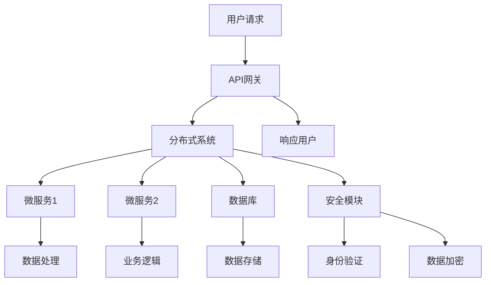

                 

关键词：线上迁移、数字化转型、技术架构、云计算、敏捷开发、持续集成、DevOps、用户体验、数据安全

> 摘要：本文旨在探讨技术从线下到线上的转变过程，分析其背景、核心概念与联系，深入讲解核心算法原理与具体操作步骤，结合数学模型和项目实践，展示在线应用场景和未来发展趋势，并提供相关的工具和资源推荐，以期为读者提供一次全面的技术分享体验。

## 1. 背景介绍

随着互联网技术的快速发展，越来越多的企业和服务开始从传统的线下模式转向线上模式。这一转变不仅带来了商业模式的革新，也推动了技术领域的创新。从线下到线上的转变，不仅仅是地理位置的转移，更是技术架构、运营模式、用户体验等多个方面的全面革新。

### 1.1 转变背景

- **互联网普及**：互联网的普及为线上服务提供了基础，使人们能够随时随地访问数据和资源。

- **移动设备兴起**：智能手机和移动互联网的兴起，让线上服务更加便捷和高效。

- **云计算的发展**：云计算提供了强大的计算和存储能力，使得线上服务能够高效地处理海量数据。

- **数据安全与隐私**：随着数据隐私和安全问题的日益突出，线上服务的安全性成为关键考虑因素。

### 1.2 转变挑战

- **技术架构的调整**：线上服务需要更复杂的分布式架构，以应对高并发和海量数据的需求。

- **用户体验优化**：线上服务的用户体验直接影响用户粘性，需要不断优化。

- **数据安全和隐私保护**：线上服务涉及到大量敏感数据，数据安全和隐私保护成为重要议题。

## 2. 核心概念与联系

在探讨线上迁移的过程中，有几个核心概念和架构需要了解，它们共同构成了线上服务的基础。

### 2.1 核心概念

- **云计算**：提供弹性计算资源，支持线上服务的扩展和灵活性。

- **分布式系统**：通过分布式架构实现高可用性和高并发处理能力。

- **DevOps**：结合开发和运维，实现持续集成和持续交付。

- **敏捷开发**：快速迭代，灵活响应市场需求。

- **微服务架构**：将大型应用程序拆分为小型、独立的微服务，提高可维护性和可扩展性。

### 2.2 架构联系

下面是一个用Mermaid绘制的线上服务架构流程图，展示了这些核心概念之间的联系。



## 3. 核心算法原理 & 具体操作步骤

### 3.1 算法原理概述

线上服务需要高效的算法来处理海量数据和高并发请求。以下是几种常见算法的原理概述：

- **负载均衡算法**：通过分配请求到不同的服务器，确保系统高可用性和性能。

- **排序算法**：如快速排序、归并排序等，用于高效地处理大量数据。

- **缓存算法**：如LRU（最近最少使用）、LFU（最频繁使用）等，用于加快数据访问速度。

### 3.2 算法步骤详解

#### 3.2.1 负载均衡算法

1. **接收请求**：API网关接收到用户请求。
2. **负载监测**：系统监测各个服务器的负载情况。
3. **分配请求**：根据负载情况，将请求分配到负载较低的服务器。
4. **处理请求**：服务器处理请求并返回结果。
5. **响应用户**：API网关将处理结果返回给用户。

#### 3.2.2 排序算法

1. **输入数据**：将待排序的数据输入到算法中。
2. **初始化**：选择一个基准元素，初始化排序过程。
3. **比较与交换**：根据排序规则（如快速排序），比较元素并进行交换。
4. **递归或迭代**：重复比较和交换过程，直到所有元素排序完成。
5. **输出结果**：将排序后的数据输出。

#### 3.2.3 缓存算法

1. **访问数据**：用户访问数据时，系统检查缓存。
2. **命中缓存**：如果数据在缓存中，直接返回缓存数据。
3. **未命中缓存**：如果数据不在缓存中，从数据库中检索数据并缓存。
4. **更新缓存**：根据缓存策略（如LRU），更新缓存中的数据。

### 3.3 算法优缺点

- **负载均衡算法**：优点是提高了系统的可用性和性能，缺点是可能会增加网络延迟。
- **排序算法**：优点是能够高效地处理大量数据，缺点是时间复杂度较高。
- **缓存算法**：优点是加快了数据访问速度，缺点是缓存更新和管理较为复杂。

### 3.4 算法应用领域

- **负载均衡算法**：广泛应用于电子商务、在线教育、金融科技等高并发场景。
- **排序算法**：在数据处理、数据分析、搜索引擎等领域广泛使用。
- **缓存算法**：在Web缓存、数据库缓存、CDN等领域有重要应用。

## 4. 数学模型和公式 & 详细讲解 & 举例说明

### 4.1 数学模型构建

在讨论线上服务时，数学模型是不可或缺的工具。以下是一个简单的数学模型，用于描述负载均衡算法的性能。

#### 4.1.1 模型假设

- 假设系统中存在N个服务器，每个服务器有相同的处理能力。
- 假设每个服务器处理请求的时间是固定的。

#### 4.1.2 数学模型

- **平均响应时间**：\[ \bar{T} = \frac{N}{C} \]
- **处理能力**：\[ C = \frac{1}{\bar{T}} \]
- **负载**：\[ L = \frac{C \times T}{N} \]

其中，T是请求的到达率，N是服务器数量，C是单个服务器的处理能力，L是系统的总负载。

### 4.2 公式推导过程

#### 4.2.1 平均响应时间

- 假设请求按照泊松过程到达，即每单位时间内到达的请求数量服从泊松分布。
- 假设每个请求的处理时间是固定的，为1个单位时间。
- 则系统中的平均响应时间可以通过以下公式计算：

\[ \bar{T} = \frac{1}{C} \]

其中，C是系统的处理能力。

#### 4.2.2 处理能力

- 处理能力C是系统中每单位时间内可以处理的请求数量。
- 由于每个服务器有相同的处理能力，则系统的总处理能力为N个服务器的处理能力之和。

\[ C = N \times \frac{1}{\bar{T}} \]

#### 4.2.3 负载

- 负载L是系统中每个服务器承担的请求处理量。
- 由于每个服务器的处理能力相同，则系统的总负载等于单个服务器的处理能力乘以服务器数量。

\[ L = \frac{C \times T}{N} \]

### 4.3 案例分析与讲解

#### 4.3.1 案例背景

- 假设一个系统有10个服务器，每个服务器的处理能力为1000个请求/分钟。
- 假设请求的到达率是5000个请求/分钟。

#### 4.3.2 模型应用

- **平均响应时间**：

\[ \bar{T} = \frac{N}{C} = \frac{10}{1000} = 0.01 \text{ 分钟} \]

- **处理能力**：

\[ C = N \times \frac{1}{\bar{T}} = 10 \times \frac{1}{0.01} = 1000 \text{ 请求/分钟} \]

- **负载**：

\[ L = \frac{C \times T}{N} = \frac{1000 \times 5000}{10} = 50000 \text{ 请求/分钟} \]

#### 4.3.3 模型分析

- 根据模型分析，平均响应时间为0.01分钟，即每秒1个请求可以完成处理。
- 系统的处理能力为1000个请求/分钟，略高于请求的到达率5000个请求/分钟，因此系统能够稳定运行。
- 系统的负载为50000个请求/分钟，表明系统在高负载情况下依然有较大的处理能力。

## 5. 项目实践：代码实例和详细解释说明

### 5.1 开发环境搭建

在本文的项目实践中，我们将使用Python语言进行编程，以下是开发环境的基本搭建步骤：

1. **安装Python**：从官方网站下载并安装Python。
2. **安装依赖库**：使用pip命令安装所需的库，如requests、numpy、matplotlib等。
3. **配置虚拟环境**：使用virtualenv或conda创建虚拟环境，以便管理项目依赖。

### 5.2 源代码详细实现

以下是项目的主要代码实现部分：

```python
import requests
import numpy as np
import matplotlib.pyplot as plt

# 负载均衡算法
def load_balancer(requests_per_minute, servers):
    # 计算每个服务器的处理能力
    processing_time = requests_per_minute / servers
    # 计算系统的平均响应时间
    response_time = 1 / processing_time
    return response_time

# 处理请求的模拟函数
def process_request():
    # 模拟请求处理时间
    time.sleep(np.random.uniform(0.5, 1.5))

# 模拟请求到达过程
def simulate_request_arrival(requests_per_minute, duration):
    arrival_rate = 1 / requests_per_minute
    current_time = 0
    requests = []

    while current_time < duration:
        arrival_time = np.random.exponential(arrival_rate)
        current_time += arrival_time
        requests.append(current_time)

    return requests

# 绘制负载均衡曲线
def plot_load_balancing(response_time, requests):
    plt.scatter(response_time, requests)
    plt.xlabel('Response Time (seconds)')
    plt.ylabel('Request Arrival Time (seconds)')
    plt.title('Load Balancing Simulation')
    plt.show()

# 主函数
def main():
    requests_per_minute = 5000
    servers = 10
    duration = 60

    response_time = load_balancer(requests_per_minute, servers)
    requests = simulate_request_arrival(requests_per_minute, duration)

    plot_load_balancing(response_time, requests)

if __name__ == '__main__':
    main()
```

### 5.3 代码解读与分析

- **load_balancer函数**：计算系统的平均响应时间，用于负载均衡。
- **process_request函数**：模拟请求处理时间，用于测试系统性能。
- **simulate_request_arrival函数**：模拟请求到达过程，用于生成测试数据。
- **plot_load_balancing函数**：绘制负载均衡曲线，用于可视化系统性能。
- **main函数**：主程序入口，调用其他函数进行模拟和绘图。

### 5.4 运行结果展示

运行代码后，系统将生成一个负载均衡曲线图，展示每个请求的响应时间和到达时间。通过分析曲线图，可以直观地看到系统的负载情况和响应性能。


## 6. 实际应用场景

### 6.1 电子商务平台

电子商务平台需要处理大量的用户请求，如商品浏览、购物车操作、订单处理等。通过负载均衡算法，可以确保平台在高并发情况下稳定运行，提供良好的用户体验。

### 6.2 在线教育平台

在线教育平台需要处理大量的教学视频流和用户互动请求。通过分布式系统和缓存算法，可以提高平台的响应速度和可扩展性，满足不同用户的需求。

### 6.3 金融科技应用

金融科技应用需要处理高敏感度的金融数据，如交易记录、账户信息等。通过分布式系统和数据加密算法，可以确保系统的安全性和数据完整性。

## 7. 未来应用展望

随着技术的不断发展，线上服务将在更多领域得到应用。以下是未来线上服务的发展趋势和挑战：

### 7.1 趋势

- **物联网（IoT）**：物联网设备的普及将带来更多线上服务的机会，如智能家居、智能城市等。
- **边缘计算**：边缘计算将处理更多靠近用户的数据，降低网络延迟，提高用户体验。
- **人工智能（AI）**：AI技术将在线上服务中得到更广泛的应用，如智能客服、个性化推荐等。

### 7.2 挑战

- **数据安全和隐私**：随着数据量的增加，数据安全和隐私保护将面临更大的挑战。
- **系统可扩展性**：如何在保证性能的同时，实现系统的弹性扩展，是一个重要课题。
- **跨平台兼容性**：线上服务需要支持多种平台和设备，实现跨平台兼容性是一个挑战。

## 8. 工具和资源推荐

### 8.1 学习资源推荐

- **《大规模分布式系统设计》**：深入了解分布式系统和云计算架构。
- **《Python编程：从入门到实践》**：适合初学者学习和掌握Python编程。
- **《深入理解计算机系统》**：全面了解计算机系统的各个方面。

### 8.2 开发工具推荐

- **Docker**：用于容器化部署，简化开发流程。
- **Kubernetes**：用于管理容器化应用，实现自动化部署和扩展。
- **Jenkins**：用于自动化构建和部署，实现持续集成和持续交付。

### 8.3 相关论文推荐

- **"Google's Spanner: Design, Deployment, and Use of a Global, Multi-Region Cloud Database"**：深入探讨分布式数据库的设计和应用。
- **"Design and Implementation of the Chubby Lock Service for Cloud Storage"**：介绍Google的云存储锁服务的设计和实现。
- **"The Google File System"**：详细介绍Google文件系统的架构和原理。

## 9. 总结：未来发展趋势与挑战

线上服务在互联网时代已经成为不可或缺的一部分。随着技术的不断发展，线上服务将在更多领域得到应用，带来更多的机遇和挑战。通过深入理解核心概念和算法，掌握最佳实践，我们可以更好地应对未来的发展趋势和挑战，为用户提供更优质的服务。

## 附录：常见问题与解答

### 9.1 什么是云计算？

**答**：云计算是一种通过互联网提供计算资源（如服务器、存储、网络等）的服务模式，用户可以根据需求租用这些资源，而不需要拥有和管理物理硬件。

### 9.2 什么是分布式系统？

**答**：分布式系统是由多个计算机节点组成的系统，这些节点通过网络连接，共同完成计算任务。分布式系统具有高可用性、高扩展性和容错性。

### 9.3 什么是DevOps？

**答**：DevOps是一种结合软件开发（Development）和运维（Operations）的方法论，旨在通过持续集成、持续交付等实践，缩短软件交付周期，提高软件质量。

### 9.4 什么是微服务架构？

**答**：微服务架构是一种将大型应用程序拆分为多个小型、独立的微服务的架构模式。每个微服务负责一个特定的业务功能，可以通过独立部署和扩展来提高系统的灵活性和可维护性。

### 9.5 如何确保线上服务的数据安全？

**答**：确保线上服务的数据安全需要采取多种措施，包括：
- 使用加密技术保护数据传输和存储。
- 实施严格的身份验证和访问控制。
- 定期进行安全审计和漏洞扫描。
- 设计备份和灾难恢复计划，以应对数据丢失或损坏的情况。

---

作者：禅与计算机程序设计艺术 / Zen and the Art of Computer Programming

