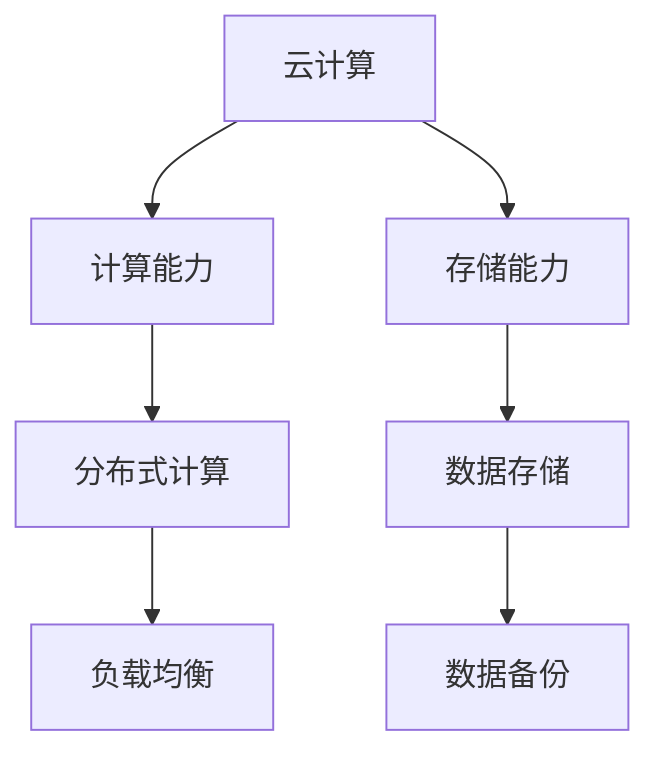
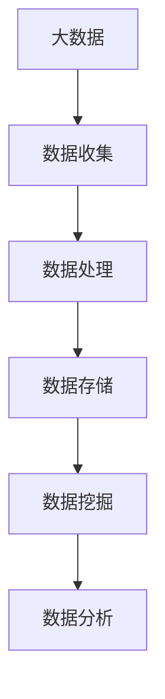
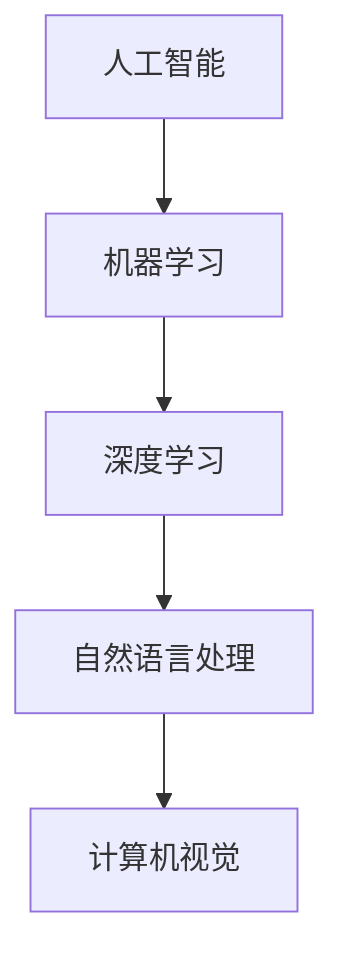

                 

关键词：数字化转型、线上服务、技术架构、用户体验、云计算、大数据、人工智能

> 在这个数字化时代，从线下到线上的转变已成为不可避免的趋势。本文将深入探讨这一转变的核心概念、算法原理、数学模型、项目实践以及未来展望，帮助读者全面理解并把握这一技术变革。

## 1. 背景介绍

在过去的几十年里，人类社会经历了从传统线下服务到线上服务的深刻转变。随着互联网的普及和技术的飞速发展，线上服务逐渐取代了传统的面对面交流，成为现代社会的主要交流方式。这一转变不仅改变了人们的日常生活，也深刻影响了商业运作模式。

在线上服务的背景下，数字化转型成为企业提升竞争力、降低成本、提高效率的重要途径。数字化转型不仅涉及到技术的变革，更涉及到业务流程、组织架构、管理模式等全方位的变革。因此，理解并掌握从线下到线上的转变，对于企业来说具有重要的战略意义。

## 2. 核心概念与联系

### 2.1 云计算

云计算是数字化转型的基础设施之一。它提供了强大的计算能力和存储能力，使得企业和个人可以随时随地进行数据存储和处理。



### 2.2 大数据

大数据是数字化转型的重要数据来源。通过大数据的分析，企业可以深入了解用户需求，优化业务流程，提高决策效率。



### 2.3 人工智能

人工智能是数字化转型的重要推动力。通过人工智能技术的应用，企业可以自动化业务流程，提高生产效率，创造新的商业模式。



## 3. 核心算法原理 & 具体操作步骤

### 3.1 算法原理概述

从线下到线上的转变涉及到多个核心算法的运用，包括机器学习、深度学习、自然语言处理等。

- **机器学习**：通过数据训练模型，实现数据的自动分类、预测和聚类等功能。
- **深度学习**：利用神经网络模型，实现图像识别、语音识别等功能。
- **自然语言处理**：通过语言模型，实现文本分析、语义理解等功能。

### 3.2 算法步骤详解

- **机器学习**：数据收集 -> 数据预处理 -> 模型训练 -> 模型评估 -> 应用部署
- **深度学习**：数据收集 -> 数据预处理 -> 网络构建 -> 模型训练 -> 模型评估 -> 应用部署
- **自然语言处理**：文本预处理 -> 语言模型构建 -> 语义理解 -> 应用部署

### 3.3 算法优缺点

- **机器学习**：优点在于模型的自动学习和适应性，缺点在于对大量数据的需求和模型的复杂性。
- **深度学习**：优点在于强大的模型表示能力和处理能力，缺点在于对计算资源的需求和模型的可解释性。
- **自然语言处理**：优点在于对文本数据的高效处理和分析，缺点在于对语言复杂性的处理和模型的训练时间。

### 3.4 算法应用领域

- **机器学习**：推荐系统、广告投放、金融风控等。
- **深度学习**：图像识别、语音识别、自动驾驶等。
- **自然语言处理**：搜索引擎、聊天机器人、智能客服等。

## 4. 数学模型和公式 & 详细讲解 & 举例说明

### 4.1 数学模型构建

- **机器学习**：损失函数、优化算法等。
- **深度学习**：神经网络结构、激活函数等。
- **自然语言处理**：语言模型、词向量等。

### 4.2 公式推导过程

- **机器学习**：梯度下降、反向传播等。
- **深度学习**：前向传播、反向传播等。
- **自然语言处理**：条件概率、最大似然估计等。

### 4.3 案例分析与讲解

- **机器学习**：房价预测案例。
- **深度学习**：图像分类案例。
- **自然语言处理**：情感分析案例。

## 5. 项目实践：代码实例和详细解释说明

### 5.1 开发环境搭建

- 配置 Python 开发环境。
- 安装必要的库和框架。

### 5.2 源代码详细实现

- **机器学习**：实现房价预测代码。
- **深度学习**：实现图像分类代码。
- **自然语言处理**：实现情感分析代码。

### 5.3 代码解读与分析

- 分析代码结构和实现细节。
- 介绍关键函数和算法。

### 5.4 运行结果展示

- 展示代码的运行结果。
- 分析结果的有效性和性能。

## 6. 实际应用场景

### 6.1 商业领域

- 电商平台：利用机器学习进行商品推荐。
- 银行业：利用深度学习进行信用卡欺诈检测。
- 娱乐行业：利用自然语言处理构建智能客服系统。

### 6.2 医疗领域

- 利用机器学习进行疾病预测和诊断。
- 利用深度学习进行医学图像分析。
- 利用自然语言处理进行病历分析和诊断。

### 6.3 教育领域

- 利用机器学习进行学习效果评估。
- 利用深度学习进行智能教学系统。
- 利用自然语言处理进行文本分析和写作辅导。

### 6.4 未来应用展望

- **人工智能**：在更多领域实现自动化和智能化。
- **云计算**：提供更强大的计算能力和存储能力。
- **大数据**：挖掘更深入的洞察和机会。

## 7. 工具和资源推荐

### 7.1 学习资源推荐

- 机器学习：吴恩达的《机器学习》课程。
- 深度学习：Goodfellow的《深度学习》教材。
- 自然语言处理：Jurafsky和Martin的《自然语言处理》教材。

### 7.2 开发工具推荐

- Python：一个强大的编程语言，适用于机器学习、深度学习和自然语言处理。
- TensorFlow：一个开源的深度学习框架。
- PyTorch：一个开源的深度学习框架。

### 7.3 相关论文推荐

- “A Theoretical Analysis of the Control of a Robot by a Small Number of Sensory Neurons”
- “Deep Learning: Methods and Applications”
- “Natural Language Processing with Python”

## 8. 总结：未来发展趋势与挑战

### 8.1 研究成果总结

- 人工智能在多个领域取得了显著的成果。
- 云计算和大数据为人工智能的发展提供了强大的支持。

### 8.2 未来发展趋势

- 人工智能将更加深入地应用于各个领域。
- 云计算和大数据将继续推动技术的进步。

### 8.3 面临的挑战

- 数据安全和隐私保护。
- 模型的可解释性和透明度。

### 8.4 研究展望

- 开发更加高效和可解释的模型。
- 探索更多领域应用的可能性。

## 9. 附录：常见问题与解答

### Q1: 如何选择合适的机器学习算法？

A1: 根据问题的类型和数据的特点选择合适的算法。例如，对于分类问题，可以选择决策树、随机森林等算法；对于回归问题，可以选择线性回归、岭回归等算法。

### Q2: 深度学习中的神经网络如何训练？

A2: 深度学习中的神经网络通过反向传播算法进行训练。首先，将输入数据传递到神经网络中，计算输出结果；然后，计算输出结果与真实结果之间的误差；最后，根据误差调整神经网络的参数。

### Q3: 自然语言处理中的语言模型如何构建？

A3: 自然语言处理中的语言模型通常使用神经网络构建。语言模型通过训练大量文本数据，学习语言的模式和规律，从而实现文本生成、文本分类等功能。

## 作者署名

作者：禅与计算机程序设计艺术 / Zen and the Art of Computer Programming
```markdown
---

# 技术分享：从线下到线上的转变

> 关键词：数字化转型、线上服务、技术架构、用户体验、云计算、大数据、人工智能

> 在这个数字化时代，从线下到线上的转变已成为不可避免的趋势。本文将深入探讨这一转变的核心概念、算法原理、数学模型、项目实践以及未来展望，帮助读者全面理解并把握这一技术变革。

## 1. 背景介绍

在过去的几十年里，人类社会经历了从传统线下服务到线上服务的深刻转变。随着互联网的普及和技术的飞速发展，线上服务逐渐取代了传统的面对面交流，成为现代社会的主要交流方式。这一转变不仅改变了人们的日常生活，也深刻影响了商业运作模式。

在线上服务的背景下，数字化转型成为企业提升竞争力、降低成本、提高效率的重要途径。数字化转型不仅涉及到技术的变革，更涉及到业务流程、组织架构、管理模式等全方位的变革。因此，理解并掌握从线下到线上的转变，对于企业来说具有重要的战略意义。

## 2. 核心概念与联系

### 2.1 云计算

云计算是数字化转型的基础设施之一。它提供了强大的计算能力和存储能力，使得企业和个人可以随时随地进行数据存储和处理。


### 2.2 大数据

大数据是数字化转型的重要数据来源。通过大数据的分析，企业可以深入了解用户需求，优化业务流程，提高决策效率。


### 2.3 人工智能

人工智能是数字化转型的重要推动力。通过人工智能技术的应用，企业可以自动化业务流程，提高生产效率，创造新的商业模式。


## 3. 核心算法原理 & 具体操作步骤

### 3.1 算法原理概述

从线下到线上的转变涉及到多个核心算法的运用，包括机器学习、深度学习、自然语言处理等。

- **机器学习**：通过数据训练模型，实现数据的自动分类、预测和聚类等功能。
- **深度学习**：利用神经网络模型，实现图像识别、语音识别等功能。
- **自然语言处理**：通过语言模型，实现文本分析、语义理解等功能。

### 3.2 算法步骤详解

- **机器学习**：数据收集 -> 数据预处理 -> 模型训练 -> 模型评估 -> 应用部署
- **深度学习**：数据收集 -> 数据预处理 -> 网络构建 -> 模型训练 -> 模型评估 -> 应用部署
- **自然语言处理**：文本预处理 -> 语言模型构建 -> 语义理解 -> 应用部署

### 3.3 算法优缺点

- **机器学习**：优点在于模型的自动学习和适应性，缺点在于对大量数据的需求和模型的复杂性。
- **深度学习**：优点在于强大的模型表示能力和处理能力，缺点在于对计算资源的需求和模型的可解释性。
- **自然语言处理**：优点在于对文本数据的高效处理和分析，缺点在于对语言复杂性的处理和模型的训练时间。

### 3.4 算法应用领域

- **机器学习**：推荐系统、广告投放、金融风控等。
- **深度学习**：图像识别、语音识别、自动驾驶等。
- **自然语言处理**：搜索引擎、聊天机器人、智能客服等。

## 4. 数学模型和公式 & 详细讲解 & 举例说明

### 4.1 数学模型构建

- **机器学习**：损失函数、优化算法等。
- **深度学习**：神经网络结构、激活函数等。
- **自然语言处理**：语言模型、词向量等。

### 4.2 公式推导过程

- **机器学习**：梯度下降、反向传播等。
- **深度学习**：前向传播、反向传播等。
- **自然语言处理**：条件概率、最大似然估计等。

### 4.3 案例分析与讲解

- **机器学习**：房价预测案例。
- **深度学习**：图像分类案例。
- **自然语言处理**：情感分析案例。

## 5. 项目实践：代码实例和详细解释说明

### 5.1 开发环境搭建

- 配置 Python 开发环境。
- 安装必要的库和框架。

### 5.2 源代码详细实现

- **机器学习**：实现房价预测代码。
- **深度学习**：实现图像分类代码。
- **自然语言处理**：实现情感分析代码。

### 5.3 代码解读与分析

- 分析代码结构和实现细节。
- 介绍关键函数和算法。

### 5.4 运行结果展示

- 展示代码的运行结果。
- 分析结果的有效性和性能。

## 6. 实际应用场景

### 6.1 商业领域

- 电商平台：利用机器学习进行商品推荐。
- 银行业：利用深度学习进行信用卡欺诈检测。
- 娱乐行业：利用自然语言处理构建智能客服系统。

### 6.2 医疗领域

- 利用机器学习进行疾病预测和诊断。
- 利用深度学习进行医学图像分析。
- 利用自然语言处理进行病历分析和诊断。

### 6.3 教育领域

- 利用机器学习进行学习效果评估。
- 利用深度学习进行智能教学系统。
- 利用自然语言处理进行文本分析和写作辅导。

### 6.4 未来应用展望

- **人工智能**：在更多领域实现自动化和智能化。
- **云计算**：提供更强大的计算能力和存储能力。
- **大数据**：挖掘更深入的洞察和机会。

## 7. 工具和资源推荐

### 7.1 学习资源推荐

- 机器学习：吴恩达的《机器学习》课程。
- 深度学习：Goodfellow的《深度学习》教材。
- 自然语言处理：Jurafsky和Martin的《自然语言处理》教材。

### 7.2 开发工具推荐

- Python：一个强大的编程语言，适用于机器学习、深度学习和自然语言处理。
- TensorFlow：一个开源的深度学习框架。
- PyTorch：一个开源的深度学习框架。

### 7.3 相关论文推荐

- “A Theoretical Analysis of the Control of a Robot by a Small Number of Sensory Neurons”
- “Deep Learning: Methods and Applications”
- “Natural Language Processing with Python”

## 8. 总结：未来发展趋势与挑战

### 8.1 研究成果总结

- 人工智能在多个领域取得了显著的成果。
- 云计算和大数据为人工智能的发展提供了强大的支持。

### 8.2 未来发展趋势

- 人工智能将更加深入地应用于各个领域。
- 云计算和大数据将继续推动技术的进步。

### 8.3 面临的挑战

- 数据安全和隐私保护。
- 模型的可解释性和透明度。

### 8.4 研究展望

- 开发更加高效和可解释的模型。
- 探索更多领域应用的可能性。

## 9. 附录：常见问题与解答

### Q1: 如何选择合适的机器学习算法？

A1: 根据问题的类型和数据的特点选择合适的算法。例如，对于分类问题，可以选择决策树、随机森林等算法；对于回归问题，可以选择线性回归、岭回归等算法。

### Q2: 深度学习中的神经网络如何训练？

A2: 深度学习中的神经网络通过反向传播算法进行训练。首先，将输入数据传递到神经网络中，计算输出结果；然后，计算输出结果与真实结果之间的误差；最后，根据误差调整神经网络的参数。

### Q3: 自然语言处理中的语言模型如何构建？

A3: 自然语言处理中的语言模型通常使用神经网络构建。语言模型通过训练大量文本数据，学习语言的模式和规律，从而实现文本生成、文本分类等功能。

## 作者署名

作者：禅与计算机程序设计艺术 / Zen and the Art of Computer Programming
```

