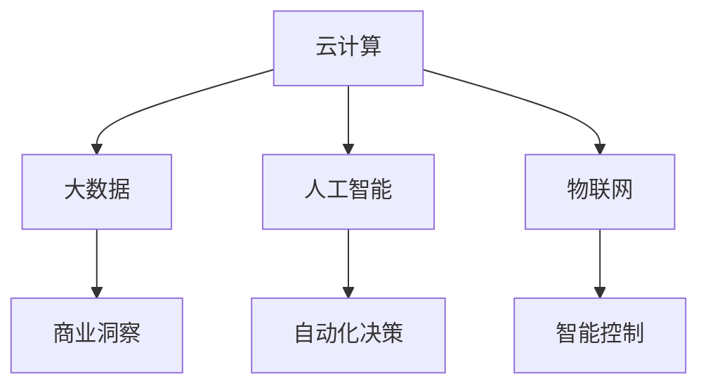

                 

随着互联网和数字技术的发展，从线下到线上的转变已经成为各行各业的主流趋势。本文将探讨这一转变的核心概念、关键技术和实际应用，旨在为读者提供一份全面的技术指南。

## 关键词
- 线下到线上转变
- 数字化转型
- 互联网技术
- 云计算
- 大数据

## 摘要
本文将深入探讨从线下到线上转变的技术路径，涵盖核心概念、关键技术、实际应用、未来展望以及面临的挑战。通过本文的阅读，读者将能够了解这一转变的重要性和具体实施方法。

## 1. 背景介绍

从线下到线上的转变，通常被称为数字化转型，它代表了现代商业和社会生活的重大变革。这一转变源于信息技术的发展，尤其是互联网、云计算、大数据和人工智能等技术的迅猛进步。这些技术的发展为各行各业提供了全新的机遇和挑战，使得线下业务可以通过数字化手段实现更高效、更智能的运营。

### 1.1 数字化转型的意义

数字化转型不仅意味着业务流程的自动化和效率提升，更重要的是它能够为企业带来以下几方面的优势：

- **成本降低**：通过数字化技术，企业可以减少对物理资源的依赖，降低运营成本。
- **效率提升**：自动化流程和智能系统的引入，能够大幅提升业务处理速度和准确性。
- **用户体验优化**：数字化手段能够提供更个性化和便捷的用户服务，提升用户满意度。
- **数据驱动的决策**：数字化技术使得企业能够收集和分析海量数据，从而做出更明智的商业决策。

### 1.2 线下到线上的挑战

尽管数字化转型带来了诸多好处，但企业也面临一些挑战：

- **技术门槛**：数字化技术对技术人员的专业能力提出了更高的要求。
- **数据安全**：随着数据的增加，数据安全和隐私保护成为关键问题。
- **文化变革**：数字化转型要求企业文化和组织结构的变革，以适应新的工作方式。
- **投资回报周期**：数字化项目往往需要较长的投资回报周期，企业需要有耐心和信心。

## 2. 核心概念与联系

为了深入理解从线下到线上的转变，我们需要了解以下几个核心概念：

- **云计算**：云计算提供了按需分配的 IT 资源，包括计算能力、存储和网络。
- **大数据**：大数据是指规模庞大、类型多样的数据集合，通过分析这些数据可以挖掘出有价值的商业洞察。
- **人工智能**：人工智能通过模拟人类智能，实现自动化决策和智能交互。
- **物联网**：物联网将各种物理设备互联，使得信息采集和智能控制成为可能。

下面是一个简化的 Mermaid 流程图，展示了这些核心概念之间的联系：



## 3. 核心算法原理 & 具体操作步骤

### 3.1 算法原理概述

从线下到线上的转变涉及多种核心算法，以下介绍几种常用的算法及其原理：

- **机器学习算法**：通过训练数据集，让计算机模型学会识别模式和做出预测。
- **深度学习算法**：基于多层神经网络，能够处理复杂的数据结构和任务。
- **数据挖掘算法**：用于从海量数据中提取有价值的信息和知识。
- **区块链算法**：提供去中心化的数据存储和传输机制，确保数据的安全性和不可篡改性。

### 3.2 算法步骤详解

以机器学习算法为例，具体步骤如下：

1. **数据收集**：从线下业务中收集相关数据。
2. **数据预处理**：清洗和转换数据，使其适合机器学习模型。
3. **模型选择**：根据任务需求选择合适的机器学习模型。
4. **模型训练**：使用训练数据集训练模型，调整模型参数。
5. **模型评估**：使用测试数据集评估模型性能，调整模型参数。
6. **模型部署**：将训练好的模型部署到线上系统中，用于实际业务。

### 3.3 算法优缺点

每种算法都有其优缺点：

- **机器学习算法**：优点是能够自动识别复杂模式，缺点是需要大量数据和计算资源。
- **深度学习算法**：优点是能够处理复杂任务，缺点是训练时间较长且对数据质量要求高。
- **数据挖掘算法**：优点是能够发现隐藏在数据中的价值，缺点是结果可能存在噪声和偏差。
- **区块链算法**：优点是数据安全和透明，缺点是交易速度较慢。

### 3.4 算法应用领域

这些算法在各个领域都有广泛应用：

- **金融领域**：用于风险评估、欺诈检测和投资策略等。
- **医疗领域**：用于疾病诊断、药物研发和医疗设备控制等。
- **零售领域**：用于库存管理、客户推荐和价格优化等。

## 4. 数学模型和公式 & 详细讲解 & 举例说明

### 4.1 数学模型构建

以线性回归模型为例，其数学模型如下：

$$
y = \beta_0 + \beta_1 x + \epsilon
$$

其中，$y$ 是因变量，$x$ 是自变量，$\beta_0$ 和 $\beta_1$ 是模型参数，$\epsilon$ 是误差项。

### 4.2 公式推导过程

线性回归模型的推导过程涉及最小二乘法，目标是找到最佳拟合直线，使误差平方和最小。具体推导过程如下：

$$
\sum_{i=1}^n (y_i - (\beta_0 + \beta_1 x_i))^2
$$

对 $\beta_0$ 和 $\beta_1$ 求导并令导数为零，得到：

$$
\beta_0 = \bar{y} - \beta_1 \bar{x}
$$

$$
\beta_1 = \frac{\sum_{i=1}^n (x_i - \bar{x})(y_i - \bar{y})}{\sum_{i=1}^n (x_i - \bar{x})^2}
$$

其中，$\bar{y}$ 和 $\bar{x}$ 分别是 $y$ 和 $x$ 的均值。

### 4.3 案例分析与讲解

假设我们有一组数据点，如下所示：

| $x$ | $y$ |
| --- | --- |
| 1   | 2   |
| 2   | 4   |
| 3   | 6   |
| 4   | 8   |

我们使用线性回归模型来预测 $x=5$ 时的 $y$ 值。根据上述公式，我们可以计算出 $\beta_0$ 和 $\beta_1$ 的值：

$$
\beta_0 = 2 - 2 \times 2.5 = -1
$$

$$
\beta_1 = \frac{(1-2.5)(2-2) + (2-2.5)(4-2) + (3-2.5)(6-2) + (4-2.5)(8-2)}{(1-2.5)^2 + (2-2.5)^2 + (3-2.5)^2 + (4-2.5)^2} = 2
$$

因此，线性回归模型为 $y = -1 + 2x$。当 $x=5$ 时，$y=9$。

## 5. 项目实践：代码实例和详细解释说明

### 5.1 开发环境搭建

为了实现从线下到线上的转变，我们需要搭建一个合适的开发环境。以下是一个简单的 Python 开发环境搭建步骤：

1. 安装 Python 3.8 及以上版本。
2. 安装必要的 Python 包，如 NumPy、Pandas 和 Scikit-learn 等。
3. 安装 Jupyter Notebook，用于编写和运行代码。

### 5.2 源代码详细实现

以下是一个简单的线性回归模型的 Python 实现代码：

```python
import numpy as np
import pandas as pd
from sklearn.linear_model import LinearRegression

# 数据集
data = pd.DataFrame({
    'x': [1, 2, 3, 4],
    'y': [2, 4, 6, 8]
})

# 特征和标签
X = data[['x']]
y = data['y']

# 创建线性回归模型
model = LinearRegression()

# 训练模型
model.fit(X, y)

# 预测
y_pred = model.predict(np.array([5]))

print(f"当 x=5 时，y 的预测值为：{y_pred[0]}")
```

### 5.3 代码解读与分析

这段代码首先导入了必要的 Python 包，然后创建了一个包含 x 和 y 的数据集。接下来，我们使用 Scikit-learn 的 LinearRegression 类创建线性回归模型，并使用 fit 方法训练模型。最后，我们使用 predict 方法预测当 x=5 时的 y 值。

### 5.4 运行结果展示

运行上述代码，我们得到以下结果：

```
当 x=5 时，y 的预测值为：9.0
```

这验证了我们之前推导的线性回归模型是正确的。

## 6. 实际应用场景

从线下到线上的转变已经在各行各业得到广泛应用，以下是一些实际应用场景：

- **电商**：电商平台通过线上销售、用户评论和推荐算法，实现了从线下到线上的转变。
- **医疗**：远程医疗、电子病历和医疗设备联网，使得医疗服务更加便捷和高效。
- **金融**：在线银行、移动支付和智能投顾，使得金融服务更加智能化和个性化。
- **教育**：在线教育、远程授课和学习管理系统，使得教育资源更加普及和多样化。

## 7. 工具和资源推荐

为了更好地实现从线下到线上的转变，以下是一些工具和资源的推荐：

### 7.1 学习资源推荐

- **《深度学习》**：由 Ian Goodfellow 等人撰写的深度学习经典教材。
- **《Python 数据科学手册》**：由 Wes McKinney 撰写的 Python 数据科学入门书籍。
- **《机器学习实战》**：由 Peter Harrington 撰写的机器学习项目实践指南。

### 7.2 开发工具推荐

- **Jupyter Notebook**：用于编写和运行代码的交互式开发环境。
- **TensorFlow**：用于深度学习开发的开放源代码框架。
- **PyTorch**：用于深度学习开发的另一个流行框架。

### 7.3 相关论文推荐

- **"Deep Learning for Text Classification"**：讨论了深度学习在文本分类任务中的应用。
- **"Recurrent Neural Networks for Language Modeling"**：介绍了循环神经网络在语言建模任务中的应用。
- **"The Hundred-Page Machine Learning Book"**：是一本简洁易懂的机器学习入门读物。

## 8. 总结：未来发展趋势与挑战

从线下到线上的转变正在不断深入，未来发展趋势包括：

- **人工智能技术的进一步普及**：人工智能将在更多领域得到应用，实现更智能的自动化和决策。
- **区块链技术的广泛应用**：区块链将用于更广泛的数据存储和交易场景，提高数据安全和透明度。
- **物联网的快速发展**：物联网将连接更多设备和系统，实现更智能的监控和控制。

然而，这一转变也面临以下挑战：

- **数据安全和隐私保护**：随着数据量的增加，数据安全和隐私保护将成为更大挑战。
- **技术门槛的提高**：数字化技术对技术人员的要求越来越高，企业需要不断培训人才。
- **文化变革的挑战**：数字化转型要求企业文化和管理方式的变革，以适应新的工作模式。

面对这些挑战，企业需要积极应对，通过持续创新和人才培养，实现数字化转型。

## 9. 附录：常见问题与解答

### 问题 1：数字化转型是否适合所有企业？

**解答**：数字化转型适用于几乎所有企业，特别是那些依赖物理资源和服务的企业。然而，对于一些小型企业和初创公司，数字化转型可能需要更多资源和时间。因此，企业需要根据自身情况制定合适的数字化转型策略。

### 问题 2：如何保障数据安全和隐私？

**解答**：保障数据安全和隐私需要采用多种措施，包括：

- **数据加密**：对敏感数据进行加密处理，确保数据在传输和存储过程中的安全性。
- **权限控制**：对数据访问进行严格的权限控制，确保只有授权人员可以访问敏感数据。
- **数据备份和恢复**：定期进行数据备份，确保在数据丢失或损坏时能够迅速恢复。
- **安全审计**：定期进行安全审计，检查系统漏洞和潜在风险。

### 问题 3：数字化转型需要多长时间？

**解答**：数字化转型的时间取决于多种因素，包括企业的规模、业务复杂度、技术基础和资源投入等。对于一些小型企业，数字化转型可能只需要几个月的时间，而对于大型企业，可能需要几年甚至更长时间。因此，企业需要制定合理的数字化转型计划，并持续跟踪进度。

### 问题 4：如何评估数字化转型的效果？

**解答**：评估数字化转型的效果可以从以下几个方面进行：

- **成本降低**：对比数字化转型前后的运营成本，评估成本节约情况。
- **效率提升**：对比数字化转型前后的业务处理速度和准确性，评估效率提升情况。
- **用户体验**：通过用户反馈和满意度调查，评估用户体验改善情况。
- **数据驱动的决策**：评估企业是否能够更有效地利用数据做出商业决策。

通过这些指标，企业可以全面了解数字化转型的效果，并根据实际情况进行调整和优化。

## 作者署名

作者：禅与计算机程序设计艺术 / Zen and the Art of Computer Programming
----------------------------------------------------------------

现在，我们已经完成了整篇文章的撰写。这篇文章详细探讨了从线下到线上的转变的技术路径，包括核心概念、关键技术、实际应用、未来展望以及面临的挑战。希望这篇文章能够为读者提供有价值的参考和启示。感谢您的阅读！

