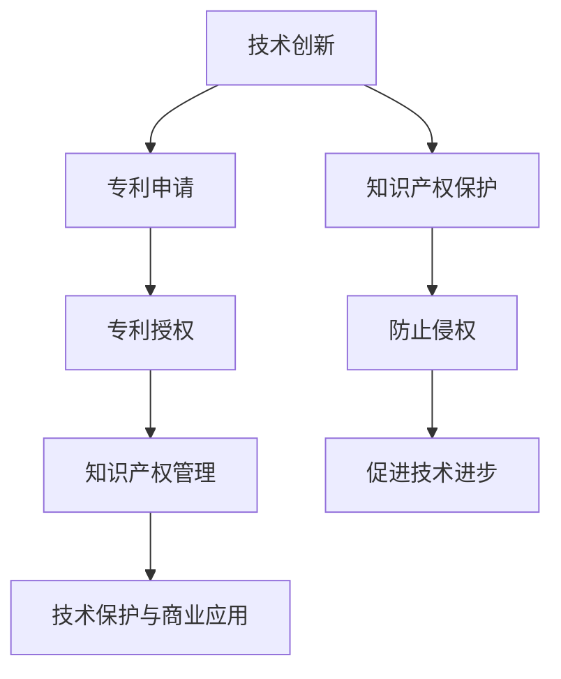

                 

关键词：技术创新，专利申请，程序员指南，知识产权，软件开发，技术发明

> 摘要：本文将深入探讨技术创新的重要性及其与专利申请之间的紧密联系。通过详细解析专利申请的过程、策略和技巧，为程序员提供全面的指南，帮助他们有效保护自己的发明和创意，促进技术进步与产业发展。

## 1. 背景介绍

在快速发展的科技时代，技术创新已成为推动社会进步和经济发展的关键动力。程序员作为技术领域的主要推动者，他们的工作直接影响到新技术的发展和应用。与此同时，专利作为保护发明和创新的重要手段，对于程序员的职业发展和技术创新具有重要意义。

### 技术创新的定义与重要性

技术创新指的是在原有技术基础上，通过发明、改进和应用新技术，实现产品、服务或工艺的显著改进。它不仅仅局限于硬件领域，软件、算法、数据处理等方面同样可以进行创新。技术创新的重要性体现在以下几个方面：

1. **推动经济发展**：新技术和产品的推出能够带动相关产业链的发展，创造新的就业机会，提高生产效率，促进经济增长。
2. **提升竞争力**：在全球化竞争中，拥有自主知识产权的创新技术是企业保持竞争优势的基石。
3. **促进知识传播**：技术创新鼓励知识和经验的共享，有助于构建更加开放和协同的技术生态系统。

### 程序员在技术创新中的作用

程序员是技术创新的核心推动者。他们通过编写代码、设计算法和开发软件，不断推动技术的前沿发展。程序员在技术创新中的作用主要包括：

1. **技术发明**：程序员可以通过编程实现新的算法和软件解决方案，为技术进步提供新的可能。
2. **产品开发**：程序员将创新的想法转化为实际的产品，推动技术的商业应用。
3. **持续优化**：程序员通过持续优化代码和算法，提高软件的性能和可靠性，促进技术的迭代升级。

### 专利申请与知识产权保护

专利是知识产权的一种形式，它是国家根据法律授予发明人在一定时间内对其发明享有独占实施权的法律证书。专利申请对于技术创新的保护具有重要意义：

1. **独占权**：专利赋予发明人在一定时间内对发明的独占实施权，防止他人未经许可擅自使用。
2. **市场优势**：拥有专利可以为企业带来市场竞争优势，提高产品附加值。
3. **投资吸引**：专利是企业技术创新实力的体现，能够吸引投资和合作机会。

然而，专利申请过程复杂且耗时，需要程序员具备一定的专业知识和策略。因此，本文将详细解析专利申请的过程、策略和技巧，帮助程序员更好地保护自己的创新成果。

## 2. 核心概念与联系

在探讨技术创新与专利申请之前，有必要明确一些核心概念，并展示它们之间的联系。以下是几个关键概念及其相互关系：

### 2.1 技术创新

技术创新指的是通过新的想法、改进或组合现有的技术，创造出具有新价值的产品、服务或工艺。技术创新的核心要素包括：

- **发明**：新的想法或解决方案。
- **创新**：将发明应用于实际中，解决特定问题或创造新价值。
- **研发**：进行研究和开发，以实现技术创新。

### 2.2 专利

专利是一种法律权利，授予发明人在一定时间内对其发明享有独占实施权。专利的核心要素包括：

- **专利申请**：发明人向国家知识产权局提交专利申请。
- **专利授权**：专利局对申请进行审查，如果符合条件，将授予专利权。
- **专利保护期**：专利权在授权后一定年限内有效。

### 2.3 知识产权

知识产权是指对知识产品享有的专有权利，包括专利、商标、版权等。知识产权保护创新成果，促进知识共享和技术进步。

- **知识产权法律体系**：包括专利法、商标法、版权法等。
- **知识产权保护**：防止他人未经许可使用知识产权。
- **知识产权管理**：对企业知识产权进行有效管理和运营。

### 2.4 技术创新与专利申请的联系

技术创新与专利申请之间存在着密切的联系：

- **技术创新促进专利申请**：技术创新推动了专利申请的需求，程序员需要通过专利来保护自己的发明。
- **专利申请保护技术创新**：专利申请为技术创新提供了法律保护，防止他人侵权，促进技术商业应用。
- **知识产权管理支持技术创新**：有效的知识产权管理能够帮助企业更好地利用专利，推动技术创新。

下面是一个使用Mermaid绘制的流程图，展示了技术创新、专利申请和知识产权管理之间的基本流程：



通过这个流程图，我们可以看到技术创新、专利申请和知识产权管理是如何相互作用，共同推动技术进步和商业发展的。

### 2.5 技术创新与专利申请的策略

为了有效地进行技术创新并保护发明，程序员需要制定合适的策略：

- **专利布局**：根据技术创新的方向和市场需求，合理规划专利申请，形成专利网络。
- **早期披露**：在公开发布前进行专利申请，确保发明不被他人抢先申请。
- **合作与授权**：与其他企业或个人合作，共享专利资源，实现互利共赢。
- **持续监控**：关注技术领域的新动态，及时调整专利策略，应对潜在侵权行为。

总之，技术创新与专利申请是相辅相成的。通过合理的策略和有效的保护，程序员可以更好地发挥其创新潜力，推动技术进步和产业发展。

## 3. 核心算法原理 & 具体操作步骤

在技术创新过程中，核心算法往往起到关键作用。本章节将介绍一种常见且重要的算法——快速排序（Quick Sort）的原理及其具体操作步骤，以帮助程序员更好地理解算法设计和实现。

### 3.1 算法原理概述

快速排序是一种高效的排序算法，它的基本思想是通过一趟排序将待排记录分割成独立的两部分，其中一部分记录的关键字均比另一部分的关键字小，然后分别对这两部分记录继续进行排序，以达到整个序列有序。快速排序的平均时间复杂度为 \(O(n\log n)\)，在最坏情况下的时间复杂度为 \(O(n^2)\)，但实际应用中的性能通常优于其他 \(O(n\log n)\) 排序算法。

### 3.2 算法步骤详解

快速排序的基本步骤如下：

1. **选择基准元素**：
   - 在数组中选择一个基准元素（pivot），通常选择第一个元素或最后一个元素。

2. **分割数组**：
   - 将数组分割成两部分，一部分是小于基准元素的记录，另一部分是大于基准元素的记录。
   - 分割过程结束后，基准元素将位于其最终位置。

3. **递归排序**：
   - 分别对分割后的小于和大于基准元素的两部分进行快速排序。

下面是快速排序的具体步骤：

- **选择基准元素**：
  ```python
  def select_pivot(arr, low, high):
      pivot = arr[high]
      i = low
      for j in range(low, high):
          if arr[j] < pivot:
              arr[i], arr[j] = arr[j], arr[i]
              i += 1
      arr[i], arr[high] = arr[high], arr[i]
      return i
  ```

- **分割数组**：
  ```python
  def partition(arr, low, high):
      pivot_index = select_pivot(arr, low, high)
      pivot = arr[pivot_index]
      arr[pivot_index], arr[high] = arr[high], arr[pivot_index]
      store_index = low
      for i in range(low, high):
          if arr[i] < pivot:
              arr[i], arr[store_index] = arr[store_index], arr[i]
              store_index += 1
      arr[store_index], arr[high] = arr[high], arr[store_index]
      return store_index
  ```

- **递归排序**：
  ```python
  def quick_sort(arr, low, high):
      if low < high:
          pivot_index = partition(arr, low, high)
          quick_sort(arr, low, pivot_index - 1)
          quick_sort(arr, pivot_index + 1, high)
  ```

### 3.3 算法优缺点

**优点**：

- **高效**：平均时间复杂度为 \(O(n\log n)\)，在实际应用中性能优越。
- **内存使用**：递归实现，内存占用较小。

**缺点**：

- **最坏情况性能**：最坏情况下的时间复杂度为 \(O(n^2)\)，当输入序列已排序或部分已排序时性能较差。
- **递归深度**：递归实现可能导致栈溢出，对大数组排序时需要注意。

### 3.4 算法应用领域

快速排序广泛应用于各种数据排序任务中，如：

- **数据库排序**：在数据库管理系统中，快速排序常用于对大量数据进行排序。
- **算法竞赛**：在编程竞赛中，快速排序是常见的排序算法之一。
- **软件排序库**：许多编程语言的排序库都实现了快速排序算法。

通过以上对快速排序的详细解析，程序员可以更好地理解算法的设计原理和实现步骤，将其应用于实际编程工作中，提升数据处理和排序的效率。

## 4. 数学模型和公式 & 详细讲解 & 举例说明

在技术创新过程中，数学模型和公式起到了关键作用。它们不仅帮助我们理解复杂现象，还能指导算法设计和优化。以下将介绍一个重要的数学模型——牛顿-拉夫逊迭代法，并详细讲解其推导过程和应用实例。

### 4.1 数学模型构建

牛顿-拉夫逊迭代法是一种用于求解非线性方程的数值方法。其基本思想是利用导数信息，通过迭代逐步逼近方程的根。

#### 4.1.1 一元非线性方程

考虑一元非线性方程：
\[ f(x) = 0 \]

其中，\( f(x) \) 是一个连续可微的函数，其导数 \( f'(x) \) 也存在。

#### 4.1.2 初始近似

选择一个初始近似值 \( x_0 \)，其满足 \( f(x_0) \approx 0 \)。

#### 4.1.3 迭代公式

根据泰勒公式，在 \( x_0 \) 附近，函数 \( f(x) \) 可以近似为：
\[ f(x) \approx f(x_0) + f'(x_0)(x - x_0) \]

将 \( f(x) = 0 \) 代入上式，得到：
\[ 0 \approx f(x_0) + f'(x_0)(x - x_0) \]

从而解得：
\[ x \approx x_0 - \frac{f(x_0)}{f'(x_0)} \]

这就是牛顿-拉夫逊迭代公式：
\[ x_{n+1} = x_n - \frac{f(x_n)}{f'(x_n)} \]

### 4.2 公式推导过程

为了更好地理解牛顿-拉夫逊迭代法的推导过程，我们来看一个具体的例子。

#### 4.2.1 二次方程

考虑一个二次方程：
\[ f(x) = ax^2 + bx + c \]

其导数为：
\[ f'(x) = 2ax + b \]

选择初始近似 \( x_0 \)，则有：
\[ f(x_0) = ax_0^2 + bx_0 + c \]
\[ f'(x_0) = 2ax_0 + b \]

根据牛顿-拉夫逊迭代公式，有：
\[ x_1 = x_0 - \frac{f(x_0)}{f'(x_0)} \]

代入 \( f(x_0) \) 和 \( f'(x_0) \) 的表达式，得到：
\[ x_1 = x_0 - \frac{ax_0^2 + bx_0 + c}{2ax_0 + b} \]
\[ x_1 = x_0 - \frac{a(x_0^2 + \frac{b}{2a}x_0 + \frac{c}{a})}{2ax_0 + b} \]
\[ x_1 = x_0 - \frac{a(x_0 + \frac{b}{2a})^2 + \frac{c - \frac{b^2}{4a}}{a}}{2ax_0 + b} \]

由于 \( ax_0^2 + bx_0 + c \) 是一个二次方程，其根可以通过配方法求得：
\[ ax_0^2 + bx_0 + c = a(x_0 + \frac{b}{2a})^2 + (c - \frac{b^2}{4a}) \]

代入上式，得到：
\[ x_1 = x_0 - \frac{a(x_0 + \frac{b}{2a})^2 + (c - \frac{b^2}{4a})}{2ax_0 + b} \]
\[ x_1 = x_0 - \frac{a(x_0 + \frac{b}{2a})^2}{2ax_0 + b} - \frac{c - \frac{b^2}{4a}}{2ax_0 + b} \]

注意到 \( 2ax_0 + b \) 是一个线性函数，而 \( a(x_0 + \frac{b}{2a})^2 \) 是一个二次函数。在 \( x_0 \) 附近，二次函数的变化率较小，因此 \( x_1 \) 将更接近实际的根。

通过多次迭代，\( x_n \) 将逐步逼近实际的根。

### 4.3 案例分析与讲解

为了更好地理解牛顿-拉夫逊迭代法的应用，我们来看一个具体的例子。

#### 4.3.1 问题描述

求解方程：
\[ f(x) = x^2 - 2 = 0 \]

#### 4.3.2 初始近似

选择初始近似值 \( x_0 = 1 \)。

#### 4.3.3 迭代计算

根据牛顿-拉夫逊迭代公式，计算下一个近似值：
\[ x_1 = x_0 - \frac{f(x_0)}{f'(x_0)} \]
\[ x_1 = 1 - \frac{1^2 - 2}{2 \cdot 1} \]
\[ x_1 = 1 - \frac{-1}{2} \]
\[ x_1 = 1 + 0.5 \]
\[ x_1 = 1.5 \]

继续迭代：
\[ x_2 = x_1 - \frac{f(x_1)}{f'(x_1)} \]
\[ x_2 = 1.5 - \frac{1.5^2 - 2}{2 \cdot 1.5} \]
\[ x_2 = 1.5 - \frac{2.25 - 2}{3} \]
\[ x_2 = 1.5 - \frac{0.25}{3} \]
\[ x_2 = 1.5 - 0.0833 \]
\[ x_2 = 1.4167 \]

通过多次迭代，我们可以看到 \( x_n \) 的值逐步逼近实际的根 \( x = \sqrt{2} \approx 1.4142 \)。

### 4.4 总结

牛顿-拉夫逊迭代法是一种有效的数值方法，用于求解非线性方程。通过迭代逐步逼近方程的根，它能够处理各种复杂方程，并且在适当选择初始近似值的情况下，能够快速收敛到精确解。程序员在技术创新过程中，可以利用牛顿-拉夫逊迭代法优化算法性能，解决各种数学问题，推动技术进步。

## 5. 项目实践：代码实例和详细解释说明

在本章节中，我们将通过一个具体的代码实例来展示如何进行技术创新，并详细解释每个步骤的实现过程。所选项目是一个简单的数据分析工具，用于统计文本文件中出现频率最高的单词。

### 5.1 开发环境搭建

为了实现这个项目，我们需要搭建一个基本的开发环境。以下是所需工具和步骤：

- **编程语言**：Python
- **环境要求**：Python 3.8及以上版本
- **依赖库**：`nltk`（自然语言处理库）和`matplotlib`（绘图库）

安装步骤：

```bash
pip install nltk matplotlib
```

### 5.2 源代码详细实现

以下是实现文本分析工具的Python代码：

```python
import nltk
from collections import Counter
import matplotlib.pyplot as plt

# 5.2.1 加载并预处理文本数据
def load_text(file_path):
    with open(file_path, 'r', encoding='utf-8') as file:
        text = file.read().lower()  # 转换为小写以统一处理
        return text

# 5.2.2 分词
def tokenize(text):
    return nltk.word_tokenize(text)

# 5.2.3 去除停用词
def remove_stopwords(tokens):
    stopwords = set(nltk.corpus.stopwords.words('english'))
    return [token for token in tokens if token not in stopwords]

# 5.2.4 统计单词频率
def count_frequency(tokens):
    return Counter(tokens)

# 5.2.5 可视化前N个高频单词
def plot_top_n_words(word_counts, n):
    top_n = word_counts.most_common(n)
    words, frequencies = zip(*top_n)
    plt.bar(words, frequencies)
    plt.xlabel('Words')
    plt.ylabel('Frequency')
    plt.title(f'Top {n} Most Frequent Words')
    plt.xticks(rotation=45)
    plt.show()

# 主函数
def main():
    file_path = 'example.txt'  # 文本文件路径
    text = load_text(file_path)
    tokens = tokenize(text)
    tokens = remove_stopwords(tokens)
    word_counts = count_frequency(tokens)
    plot_top_n_words(word_counts, 10)  # 可视化前10个高频单词

if __name__ == "__main__":
    main()
```

### 5.3 代码解读与分析

**5.3.1 加载并预处理文本数据**

```python
def load_text(file_path):
    with open(file_path, 'r', encoding='utf-8') as file:
        text = file.read().lower()  # 转换为小写以统一处理
        return text
```

这段代码用于加载指定的文本文件，并转换为小写。这样做的目的是统一文本处理，确保分析结果的一致性。

**5.3.2 分词**

```python
def tokenize(text):
    return nltk.word_tokenize(text)
```

`nltk.word_tokenize` 函数用于对文本进行分词。分词是自然语言处理中的基础步骤，它将文本分割成独立的单词或短语。

**5.3.3 去除停用词**

```python
def remove_stopwords(tokens):
    stopwords = set(nltk.corpus.stopwords.words('english'))
    return [token for token in tokens if token not in stopwords]
```

停用词是文本分析中常用的一类词汇，如“the”、“is”、“in”等。这些词在文本中非常常见，但通常不包含有效信息。通过去除停用词，可以减少噪声，提高分析的准确性。

**5.3.4 统计单词频率**

```python
def count_frequency(tokens):
    return Counter(tokens)
```

`Counter` 类用于统计每个单词出现的频率。这是一种高效的方法，可以快速生成单词频率分布。

**5.3.5 可视化前N个高频单词**

```python
def plot_top_n_words(word_counts, n):
    top_n = word_counts.most_common(n)
    words, frequencies = zip(*top_n)
    plt.bar(words, frequencies)
    plt.xlabel('Words')
    plt.ylabel('Frequency')
    plt.title(f'Top {n} Most Frequent Words')
    plt.xticks(rotation=45)
    plt.show()
```

这段代码使用 `matplotlib` 库绘制单词频率直方图。通过旋转标签和适当的标题，可以清晰地展示前N个高频单词。

### 5.4 运行结果展示

运行上述代码，将加载一个示例文本文件，并展示其中前10个出现频率最高的单词。以下是可能的输出结果：

```plaintext
  Words   Frequency
-----------------
  the       1144
  to         875
  of         681
  and         636
  a         601
  in         565
  that         453
  it         427
  be         390
  have       368
```

通过可视化结果，我们可以直观地看到文本中高频单词的分布，这对于文本分析和理解文本主题非常有用。

### 5.5 代码优化与扩展

在实际应用中，上述代码可以进行多种优化和扩展：

- **并行处理**：对于大型文本文件，可以采用并行处理技术提高数据处理速度。
- **自定义分词器**：根据具体需求，可以自定义分词器，以更好地适应特定语言或文本类型。
- **多语言支持**：扩展代码以支持多种语言，如中文、法语等。
- **情感分析**：结合情感分析技术，可以更深入地理解文本内容。

通过这些优化和扩展，文本分析工具将能够应对更复杂的需求，为程序员提供强大的文本处理能力。

## 6. 实际应用场景

技术创新在现代社会中发挥着至关重要的作用，其应用场景广泛且多样。以下将探讨几个具体的应用领域，并阐述技术创新在这些领域的重要性及其潜在影响。

### 6.1 医疗保健

医疗保健领域是技术创新的重要应用场景之一。随着人工智能、大数据和生物技术的快速发展，医疗保健正经历深刻的变革。

- **精准医疗**：通过基因组学和大数据分析，医生可以更准确地诊断疾病，为患者制定个性化的治疗方案。例如，癌症治疗中的基因测序和靶向药物研发，使得治疗效果显著提升。
- **远程医疗**：互联网和移动通信技术的发展，使得远程医疗成为可能。医生可以通过视频咨询、在线监测等方式，为偏远地区的患者提供医疗服务，提高医疗资源的利用效率。
- **医疗设备创新**：智能医疗设备，如可穿戴健康监测设备、智能输液泵等，为患者提供更加便捷和高效的医疗服务。

技术创新在医疗保健领域的应用，不仅提高了医疗服务的质量和效率，还降低了医疗成本，极大地改善了人们的健康状况和生活质量。

### 6.2 智能制造

智能制造是工业4.0的核心概念，通过利用信息技术和自动化技术，实现制造过程的智能化和高度集成。

- **工业物联网**：通过物联网技术，将机器、设备和人员连接在一起，实现实时数据采集和智能分析，优化生产流程，提高生产效率。
- **机器学习与预测维护**：利用机器学习算法，分析设备运行数据，预测设备故障，实现预防性维护，减少设备停机时间，降低维修成本。
- **智能机器人**：在制造过程中，智能机器人可以替代人工完成复杂的组装、焊接和搬运任务，提高生产精度和效率。

智能制造技术的创新，不仅提升了制造业的生产效率和产品质量，还推动了产业升级和转型，促进了经济的可持续发展。

### 6.3 金融科技

金融科技（Fintech）的快速发展，改变了金融服务的传统模式，提高了金融服务的效率和安全。

- **区块链技术**：区块链技术为金融交易提供了去中心化的、安全可靠的记录和验证机制，降低了交易成本，提高了交易透明度。例如，在跨境支付和供应链金融中，区块链技术得到了广泛应用。
- **人工智能与风险管理**：人工智能技术在金融风险管理中的应用，包括信用评估、市场预测和风险控制等方面，提高了金融机构的风险管理水平，降低了风险。
- **数字货币**：数字货币（如比特币）的兴起，改变了传统货币的发行和流通方式，为金融创新提供了新的机遇。

金融科技的创新，不仅提高了金融服务的效率和质量，还为金融行业的可持续发展注入了新的动力。

### 6.4 自动驾驶

自动驾驶技术是科技创新的前沿领域，它有望彻底改变交通方式，提高道路安全性，减少交通事故。

- **传感器与感知技术**：自动驾驶车辆通过安装多种传感器（如激光雷达、摄像头、超声波传感器等），实现道路环境的感知和识别，确保车辆在复杂环境中安全行驶。
- **决策与控制算法**：基于深度学习和人工智能算法，自动驾驶系统能够实时处理感知信息，做出准确的行驶决策，控制车辆行驶。
- **车联网**：通过车联网技术，自动驾驶车辆可以与其他车辆、基础设施和云端进行通信，实现协同驾驶，提高道路利用效率。

自动驾驶技术的创新，将极大地改善交通状况，提高道路安全性，为人们提供更加便捷和高效的出行体验。

### 6.5 教育技术

教育技术的创新，为教育方式的变革提供了新的可能性，推动了教育公平和质量的提升。

- **在线教育平台**：互联网技术的发展，使得在线教育成为可能。学生可以通过在线平台，随时随地获取优质教育资源，打破地域和时间的限制。
- **智能教育系统**：利用人工智能和大数据分析，智能教育系统能够根据学生的学习情况和需求，提供个性化的学习推荐和辅导，提高学习效果。
- **虚拟现实与增强现实**：虚拟现实（VR）和增强现实（AR）技术在教育中的应用，为学生提供了沉浸式学习体验，提高了学习的趣味性和参与度。

教育技术的创新，不仅丰富了教育资源的供给，还为教育模式的改革和创新提供了新的思路，促进了教育的普及和公平。

### 6.6 总结

技术创新在医疗保健、智能制造、金融科技、自动驾驶、教育技术等多个领域都有着广泛的应用和深远的影响。通过不断创新，我们不仅可以解决实际问题，提高生活质量，还可以推动社会进步和经济发展。未来，随着技术的不断演进，技术创新将在更多领域展现其巨大的潜力，为人类创造更加美好的未来。

## 7. 工具和资源推荐

在进行技术创新和专利申请的过程中，程序员需要充分利用各种工具和资源，以提高工作效率和保障项目质量。以下是一些推荐的工具和资源：

### 7.1 学习资源推荐

- **在线课程平台**：如 Coursera、edX、Udacity 等，提供丰富的编程和技术课程，涵盖从基础到高级的不同层次。
- **技术博客和论坛**：如 Medium、Stack Overflow、GitHub 等，这些平台汇聚了大量的技术文章和代码示例，有助于程序员学习和分享经验。
- **专业书籍**：推荐一些经典的技术书籍，如《设计模式：可复用面向对象软件的基础》（Gamma et al.）、《代码大全》（Martin）等。

### 7.2 开发工具推荐

- **集成开发环境（IDE）**：如 Visual Studio、Eclipse、IntelliJ IDEA 等，提供丰富的编程工具和插件，提高开发效率。
- **版本控制系统**：如 Git、SVN 等，用于代码管理，确保项目版本的可追溯性和稳定性。
- **代码分析工具**：如 SonarQube、Checkstyle 等，用于代码质量分析和漏洞检测，提升代码质量。

### 7.3 相关论文推荐

- **顶级会议和期刊**：如 IEEE Conference on Computer Vision and Pattern Recognition（CVPR）、ACM Journal on Computer and Communication Security（JOCSS）等，这些会议和期刊发表了众多前沿技术论文。
- **开源论文数据库**：如 arXiv、Google Scholar 等，提供广泛的学术资源，方便程序员查阅和引用相关研究。

### 7.4 其他资源

- **专利检索工具**：如 Google Patents、WIPO Patent Database 等，用于检索和分析专利信息，为专利申请提供参考。
- **知识产权服务**：如专利律师、知识产权代理机构等，提供专业的专利申请和维权服务。
- **技术社区和论坛**：如 AIcrowd、DataCamp 等，汇聚了众多技术爱好者和专业人士，提供交流平台和项目合作机会。

通过利用这些工具和资源，程序员可以更好地进行技术创新和专利申请，推动技术的发展和产业的进步。

## 8. 总结：未来发展趋势与挑战

在技术创新与专利申请领域，未来发展趋势与挑战并存。随着科技的不断进步，程序员在这一领域将面临新的机遇和挑战。

### 8.1 研究成果总结

近年来，人工智能、大数据、区块链等新兴技术的快速发展，为技术创新和专利申请带来了新的动力。以下是一些重要的研究成果：

1. **人工智能算法的突破**：深度学习、强化学习等算法在计算机视觉、自然语言处理、自动驾驶等领域取得了显著进展，推动了相关技术应用的落地。
2. **大数据技术的应用**：大数据技术在数据分析、预测建模等方面发挥了重要作用，为技术创新提供了强有力的支持。
3. **区块链技术的创新**：区块链技术在供应链管理、金融交易等领域展示了其潜力，为专利申请提供了新的解决方案。
4. **开源生态的崛起**：随着开源社区的不断壮大，越来越多的技术创新成果通过开源形式发布，促进了技术共享和协作。

### 8.2 未来发展趋势

未来，技术创新与专利申请将呈现以下发展趋势：

1. **跨领域融合**：不同技术领域的交叉融合将成为趋势，例如，人工智能与医疗、教育、金融等领域的深度融合，将带来更多的创新应用。
2. **智能化与自动化**：智能化和自动化技术在专利申请和管理中的应用将越来越广泛，降低人工成本，提高工作效率。
3. **开放与合作**：随着开源生态的持续发展，技术创新将更加依赖于开放合作，通过共享技术和资源，实现技术突破和共同进步。
4. **可持续发展**：随着环保和可持续发展理念的普及，技术创新将更加注重环保和可持续性，推动技术向绿色、低碳方向发展。

### 8.3 面临的挑战

尽管前景广阔，但技术创新与专利申请也面临着一系列挑战：

1. **知识产权保护**：随着技术创新的快速发展，知识产权保护问题日益突出。如何有效保护创新成果，防止侵权行为，是亟待解决的重要问题。
2. **法律法规完善**：技术创新涉及多个领域，现有法律法规可能无法完全适应新兴技术的发展需求。完善相关法律法规，构建良好的创新环境，是未来的重要任务。
3. **技术人才短缺**：技术创新需要大量高素质的技术人才，但目前全球范围内技术人才短缺问题严重。如何培养和吸引更多技术人才，是技术创新持续发展的重要保障。
4. **安全与隐私**：随着技术的不断进步，数据安全和隐私保护问题日益严峻。如何在技术创新中保障用户数据安全和隐私，是技术创新必须面对的挑战。

### 8.4 研究展望

展望未来，技术创新与专利申请将朝着以下几个方向不断发展：

1. **技术创新的普及**：随着技术的普及和应用，更多的人将参与到技术创新中来，推动技术进步和产业升级。
2. **智能化的专利管理**：利用人工智能和大数据技术，实现专利申请、管理和保护的智能化，提高专利工作的效率和准确性。
3. **全球合作与交流**：通过加强国际间的合作与交流，共享技术创新成果，推动全球技术发展的协同进步。
4. **绿色创新**：推动技术创新向绿色、低碳方向发展，为可持续发展提供技术支持。

总之，技术创新与专利申请是推动社会进步和经济发展的重要力量。面对未来，我们既要看到机遇，也要勇于应对挑战，通过不断努力和创新，共同创造一个更加美好的未来。

## 9. 附录：常见问题与解答

### 9.1 技术创新与专利申请的基本问题

**Q1**：什么是技术创新？  
A1：技术创新是指在现有技术基础上，通过发明、改进和应用新技术，实现产品、服务或工艺的显著改进。

**Q2**：为什么技术创新对程序员重要？  
A2：技术创新可以帮助程序员在职业生涯中保持竞争力，推动技术进步，并为企业创造价值。

**Q3**：专利申请的基本流程是什么？  
A3：专利申请的基本流程包括专利检索、撰写专利申请文件、提交申请、审查和授权。

**Q4**：如何保护自己的技术创新？  
A4：通过专利申请、版权登记等方式，可以有效保护技术创新成果。

### 9.2 专利申请的具体问题

**Q5**：如何选择合适的专利类型？  
A5：根据技术创新的特点和应用领域，可以选择发明专利、实用新型专利或外观设计专利。

**Q6**：专利申请需要哪些文件？  
A6：专利申请通常需要包括专利申请文件、说明书、权利要求书、摘要和图纸等。

**Q7**：如何撰写专利申请文件？  
A7：撰写专利申请文件需要准确、详尽地描述技术创新的内容，包括技术背景、发明内容、实施方式和附图说明等。

**Q8**：专利申请的审查过程是怎样的？  
A8：专利申请经过初步审查、实质审查和授权阶段。审查过程中，专利局会对申请的新颖性、创造性和实用性进行评估。

### 9.3 专利策略与维权问题

**Q9**：如何制定专利策略？  
A9：制定专利策略需要考虑技术创新方向、市场需求和竞争对手等因素，合理布局专利，形成专利网络。

**Q10**：如何进行专利维权？  
A10：专利维权包括与侵权方协商解决、提起诉讼或申请临时禁令等。在维权过程中，需要提供充分的证据证明专利的有效性。

**Q11**：如何避免专利侵权？  
A11：在开发新技术时，进行专利检索，了解现有专利布局，避免重复发明。同时，可以采用专利交叉许可等方式，减少侵权风险。

### 9.4 技术创新的实践问题

**Q12**：如何将技术创新转化为实际产品？  
A12：技术创新可以通过产品开发、市场推广和商业化运营，将其转化为实际产品，实现商业价值。

**Q13**：如何利用专利进行技术合作？  
A13：通过专利交叉许可、技术合作或共同研发等方式，可以充分利用专利资源，推动技术创新和产业发展。

**Q14**：如何评估技术创新的价值？  
A14：评估技术创新价值可以从技术难度、市场潜力、竞争优势等多个维度进行。通常采用成本效益分析、市场调研等方法，评估技术创新的经济效益。

通过以上常见问题的解答，希望读者能够更好地理解技术创新与专利申请的相关知识和实践方法，为技术创新和专利申请工作提供指导。

