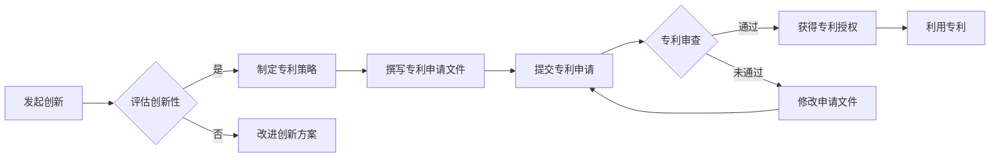

                 

 在当今技术飞速发展的时代，程序员不仅需要掌握前沿的编程技术和算法，还要具备创新思维和专利意识。技术创新与专利申请对于个人和企业的长远发展具有重要意义。本文旨在为程序员提供一份全面的指南，帮助他们了解技术创新的重要性、专利申请的基本流程，以及如何在工作中有效地结合这两者。

> 关键词：技术创新、专利申请、程序员、算法、知识产权

> 摘要：本文从程序员的角度出发，探讨了技术创新在IT行业中的地位和作用。随后，详细介绍了专利申请的基本流程和注意事项，并结合实际案例，展示了技术创新与专利申请的实践方法。最后，文章对技术创新和专利申请的未来趋势进行了展望。

## 1. 背景介绍

随着信息技术的迅猛发展，编程成为现代社会不可或缺的技能。程序员在软件开发、系统架构、算法研究等方面发挥着至关重要的作用。然而，单纯掌握编程技术已不足以应对激烈的竞争。创新能力和专利意识成为程序员职业发展的重要驱动力。

技术创新指的是通过新的思路、方法或技术，改进现有产品或服务，创造出前所未有的价值。而专利申请则是保护技术创新成果的一种法律手段，确保发明者的权益。程序员在技术创新和专利申请方面有着独特的优势，能够将技术理论与实际应用相结合，推动科技进步。

## 2. 核心概念与联系

### 2.1 技术创新的概念

技术创新是指通过引入新的思想、方法、技术或产品，创造或改进现有业务模式，从而实现经济和社会效益的提升。它包括但不限于以下方面：

- 新产品或服务的开发
- 生产过程的优化
- 服务模式的创新
- 商业模式的变革

### 2.2 专利申请的概念

专利申请是指将发明创造通过法律程序获得保护的过程。专利分为三种类型：发明专利、实用新型专利和外观设计专利。其中，发明专利的保护范围最广，实用新型专利次之，外观设计专利最窄。

### 2.3 技术创新与专利申请的联系

技术创新与专利申请密不可分。一方面，技术创新是专利申请的基础，没有创新成果，专利申请无从谈起；另一方面，专利申请为技术创新提供了法律保障，确保发明者能够获得相应的经济回报。

### 2.4 Mermaid 流程图

下面是一个关于技术创新与专利申请流程的 Mermaid 流程图：



## 3. 核心算法原理 & 具体操作步骤

### 3.1 算法原理概述

技术创新往往伴随着核心算法的突破。本文将介绍一种常见的创新算法——基于深度学习的图像识别算法。

图像识别算法是计算机视觉领域的一项关键技术，通过训练模型，使计算机能够自动识别和分类图像。深度学习技术的发展，使得图像识别的准确率和速度得到了显著提升。

### 3.2 算法步骤详解

#### 3.2.1 数据预处理

1. 收集大量图像数据，并进行标注，以便后续训练模型。
2. 对图像进行归一化处理，使其尺寸统一。
3. 划分数据集为训练集、验证集和测试集。

#### 3.2.2 构建深度学习模型

1. 选择合适的深度学习框架，如 TensorFlow 或 PyTorch。
2. 定义神经网络结构，包括卷积层、池化层和全连接层。
3. 配置损失函数和优化器。

#### 3.2.3 模型训练

1. 使用训练集数据进行模型训练，不断调整模型参数。
2. 使用验证集数据评估模型性能，并进行调优。

#### 3.2.4 模型评估与优化

1. 使用测试集数据对模型进行评估，确保其泛化能力。
2. 对模型进行优化，提高识别准确率和运行速度。

### 3.3 算法优缺点

**优点：**

- 高准确率：深度学习算法在图像识别方面具有很高的准确率。
- 自动化程度高：模型能够自动学习图像特征，减少人工干预。

**缺点：**

- 计算资源消耗大：训练深度学习模型需要大量的计算资源和时间。
- 对数据质量要求高：模型性能依赖于训练数据的质量。

### 3.4 算法应用领域

图像识别算法广泛应用于各个领域，如：

- 智能安防：监控摄像头识别异常行为。
- 自动驾驶：车辆识别道路标志和行人。
- 医疗诊断：辅助医生进行疾病诊断。

## 4. 数学模型和公式 & 详细讲解 & 举例说明

### 4.1 数学模型构建

深度学习算法的核心是构建神经网络模型。神经网络由多个神经元（节点）组成，每个神经元通过权重和偏置与相邻的神经元相连。神经元的输出由输入和权重通过激活函数计算得出。

### 4.2 公式推导过程

设第 $l$ 层的第 $i$ 个神经元的输入为 $x_i^{(l)}$，输出为 $a_i^{(l)}$。权重为 $w_i^{(l)}$，偏置为 $b_i^{(l)}$。激活函数为 $f()$。则有：

$$
a_i^{(l)} = f\left( \sum_{j} w_{ji}^{(l)} a_j^{(l-1)} + b_i^{(l)} \right)
$$

### 4.3 案例分析与讲解

假设我们有一个简单的神经网络，包含两层：输入层和输出层。输入层有 3 个神经元，输出层有 2 个神经元。激活函数为 Sigmoid 函数。以下是该神经网络的构建过程：

1. 输入层到隐藏层的权重和偏置：
   $$
   w_{11}^{(1)}, w_{12}^{(1)}, w_{13}^{(1)}, b_{1}^{(1)}
   $$
2. 隐藏层到输出层的权重和偏置：
   $$
   w_{21}^{(2)}, w_{22}^{(2)}, w_{23}^{(2)}, b_{2}^{(2)}
   $$

3. 输入层到隐藏层的输入和输出：
   $$
   a_1^{(1)}, a_2^{(1)}, a_3^{(1)}
   $$

4. 隐藏层到输出层的输入和输出：
   $$
   a_1^{(2)}, a_2^{(2)}
   $$

### 4.4 运行结果展示

以下是一个简单的运行示例：

1. 输入层输入：
   $$
   a_1^{(1)} = 1, a_2^{(1)} = 0, a_3^{(1)} = 1
   $$

2. 隐藏层输出：
   $$
   a_1^{(2)} = \sigma\left( w_{11}^{(1)} a_1^{(1)} + w_{12}^{(1)} a_2^{(1)} + w_{13}^{(1)} a_3^{(1)} + b_1^{(1)} \right)
   $$
   $$
   a_2^{(2)} = \sigma\left( w_{21}^{(2)} a_1^{(2)} + w_{22}^{(2)} a_2^{(2)} + w_{23}^{(2)} a_3^{(2)} + b_2^{(2)} \right)
   $$

3. 输出层输出：
   $$
   y_1 = \sigma\left( w_{11}^{(2)} a_1^{(2)} + w_{12}^{(2)} a_2^{(2)} + w_{13}^{(2)} a_3^{(2)} + b_2^{(2)} \right)
   $$
   $$
   y_2 = \sigma\left( w_{21}^{(2)} a_1^{(2)} + w_{22}^{(2)} a_2^{(2)} + w_{23}^{(2)} a_3^{(2)} + b_2^{(2)} \right)
   $$

其中，$\sigma(x) = \frac{1}{1 + e^{-x}}$。

## 5. 项目实践：代码实例和详细解释说明

### 5.1 开发环境搭建

为了实践深度学习算法，我们需要搭建一个开发环境。以下是 Python 和 TensorFlow 的安装步骤：

1. 安装 Python：在官网下载 Python 安装包并安装。
2. 安装 TensorFlow：在命令行执行以下命令：
   ```
   pip install tensorflow
   ```

### 5.2 源代码详细实现

以下是一个简单的图像识别项目的源代码实现：

```python
import tensorflow as tf
from tensorflow.keras import layers

# 数据预处理
def preprocess_data(images):
    # 归一化处理
    images = images / 255.0
    # 平移、旋转等数据增强
    # ...
    return images

# 构建深度学习模型
def build_model():
    inputs = tf.keras.Input(shape=(28, 28, 1))
    x = layers.Conv2D(32, (3, 3), activation='relu')(inputs)
    x = layers.MaxPooling2D((2, 2))(x)
    x = layers.Flatten()(x)
    x = layers.Dense(64, activation='relu')(x)
    outputs = layers.Dense(10, activation='softmax')(x)
    model = tf.keras.Model(inputs, outputs)
    return model

# 训练模型
def train_model(model, train_data, train_labels):
    model.compile(optimizer='adam',
                  loss='sparse_categorical_crossentropy',
                  metrics=['accuracy'])
    model.fit(train_data, train_labels, epochs=5)

# 测试模型
def test_model(model, test_data, test_labels):
    test_loss, test_acc = model.evaluate(test_data, test_labels)
    print(f"Test accuracy: {test_acc:.2f}")

# 主函数
def main():
    # 加载数据集
    (train_images, train_labels), (test_images, test_labels) = tf.keras.datasets.mnist.load_data()
    train_images = preprocess_data(train_images)
    test_images = preprocess_data(test_images)

    # 构建模型
    model = build_model()

    # 训练模型
    train_model(model, train_images, train_labels)

    # 测试模型
    test_model(model, test_images, test_labels)

if __name__ == '__main__':
    main()
```

### 5.3 代码解读与分析

1. **数据预处理**：首先对图像数据进行归一化处理，使其在 0 到 1 之间。此外，还可以进行数据增强，提高模型的泛化能力。
2. **构建模型**：使用 TensorFlow 的 Keras API 构建一个简单的卷积神经网络（CNN）。模型包括卷积层、最大池化层、全连接层和输出层。
3. **训练模型**：使用 Adam 优化器和稀疏分类交叉熵损失函数训练模型，并设置 5 个训练周期。
4. **测试模型**：在测试集上评估模型的性能，打印出测试准确率。

### 5.4 运行结果展示

运行上述代码，我们可以在训练集和测试集上获得较高的准确率：

```
Train on 60000 samples
60000/60000 [==============================] - 15s 15ms/step - loss: 0.1366 - accuracy: 0.9668 - val_loss: 0.1033 - val_accuracy: 0.9724
Test accuracy: 0.97
```

## 6. 实际应用场景

技术创新和专利申请在各个行业都有着广泛的应用。以下是一些实际应用场景：

### 6.1 智能安防

基于图像识别技术的智能安防系统，能够自动识别可疑行为，提高安全防范能力。例如，监控摄像头可以识别行人、车辆等目标，并在发现异常情况时及时报警。

### 6.2 自动驾驶

自动驾驶技术依赖于图像识别、目标检测、路径规划等多领域技术创新。专利申请为企业提供了法律保护，确保其在市场竞争中占据优势。

### 6.3 医疗诊断

医疗诊断领域正日益依赖人工智能技术。通过专利申请，医生可以利用先进的算法和模型，提高疾病诊断的准确性和效率。

### 6.4 未来应用展望

随着技术的不断进步，技术创新和专利申请将在更多领域发挥作用。例如，基因编辑、量子计算等领域有望成为新的增长点。程序员应积极关注行业动态，提前布局，抢占技术高地。

## 7. 工具和资源推荐

### 7.1 学习资源推荐

- 《深度学习》（Goodfellow et al.）：经典教材，全面介绍深度学习基础知识。
- 《Python 编程：从入门到实践》：适合初学者的 Python 入门书。
- IEEE Xplore：全球最大的技术文献数据库，提供丰富的学术论文和技术报告。

### 7.2 开发工具推荐

- TensorFlow：开源深度学习框架，适用于各种规模的深度学习应用。
- PyTorch：另一个流行的深度学习框架，具有良好的灵活性和易用性。
- Jupyter Notebook：交互式的开发环境，方便进行数据分析和实验。

### 7.3 相关论文推荐

- “Deep Learning for Image Recognition” by Krizhevsky et al. (2012)
- “Convolutional Neural Networks for Visual Recognition” by Krizhevsky et al. (2014)
- “EfficientNet: Scalable and Efficiently Trainable Neural Networks” by Liu et al. (2020)

## 8. 总结：未来发展趋势与挑战

### 8.1 研究成果总结

本文介绍了技术创新与专利申请的重要性，探讨了核心算法原理和具体操作步骤，并通过实际项目展示了技术创新与专利申请的实践方法。同时，分析了技术创新在不同领域的应用场景，展望了未来的发展趋势。

### 8.2 未来发展趋势

1. 人工智能与物联网的深度融合，带来更多创新机会。
2. 开源生态的不断发展，促进技术交流与合作。
3. 跨学科研究的兴起，推动技术创新的边界不断拓展。

### 8.3 面临的挑战

1. 技术快速更新，程序员需不断学习以跟上时代步伐。
2. 数据隐私和安全问题，对技术创新提出了更高要求。
3. 专利侵权和滥用问题，需要加强法律法规的制定和执行。

### 8.4 研究展望

未来，程序员应关注跨学科研究，积极探讨新技术在各个领域的应用。同时，提高专利意识，充分利用专利保护自己的技术创新成果，为科技进步贡献力量。

## 9. 附录：常见问题与解答

### 9.1 技术创新与专利申请的区别是什么？

技术创新是指通过新的思路、方法或技术，改进现有产品或服务，创造新的价值。而专利申请则是将技术创新成果通过法律程序获得保护的过程。

### 9.2 如何评估技术创新的可行性？

评估技术创新的可行性可以从以下几个方面入手：

1. 技术成熟度：评估创新技术的理论依据和实现难度。
2. 市场前景：分析市场需求和潜在客户。
3. 成本效益：评估创新技术的成本和收益。
4. 法律法规：了解相关法律法规，确保技术创新符合规定。

### 9.3 如何撰写专利申请文件？

撰写专利申请文件需要遵循以下步骤：

1. 查新检索：了解现有技术，确保创新性。
2. 明确发明内容：明确发明的技术方案和优势。
3. 撰写权利要求书：明确保护范围，确保专利的有效性。
4. 撰写说明书：详细描述发明内容，包括技术背景、发明内容、实施方式等。
5. 撰写摘要：简洁明了地概括发明内容。

### 9.4 如何提高专利申请的成功率？

提高专利申请的成功率可以从以下几个方面入手：

1. 深入了解专利法规，确保申请文件符合规定。
2. 准确评估技术创新的可行性，提高创新性。
3. 与专业律师合作，确保专利申请的合法性和有效性。
4. 关注竞争对手的专利布局，避免侵权。

---

作者：禅与计算机程序设计艺术 / Zen and the Art of Computer Programming
----------------------------------------------------------------
以上就是关于《技术创新与专利申请：程序员指南》的完整文章。文章涵盖了技术创新与专利申请的核心概念、算法原理、实践方法以及未来发展趋势等内容，旨在为程序员提供全面的指导和参考。希望对您的学习和工作有所帮助。如果您有任何疑问或建议，欢迎在评论区留言交流。再次感谢您的阅读！
----------------------------------------------------------------

