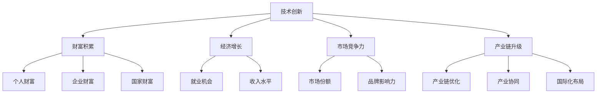

                 

关键词：技术创新、财富积累、经济增长、市场竞争力、产业链升级

摘要：本文旨在探讨技术创新与财富积累之间的关系，分析技术创新如何驱动财富增长，以及在这一过程中面临的各种挑战。通过历史案例、理论分析和实际应用，本文揭示了技术创新在促进经济增长、提升市场竞争力、推动产业链升级等方面的关键作用。

## 1. 背景介绍

自工业革命以来，技术创新一直是推动经济增长和社会进步的核心动力。每一次重大技术的突破，都带来了生产力的飞跃，从而推动了财富的积累。从蒸汽机的发明到电力的广泛应用，从计算机的普及到互联网的兴起，技术创新在不断改变着世界，也在深刻影响着经济格局。

随着全球化和数字化时代的到来，技术创新的速度和广度都得到了前所未有的提升。新兴技术如人工智能、大数据、区块链等不断涌现，不仅改变了传统行业的运作模式，也催生了全新的商业模式和产业链。在这个背景下，理解和探讨技术创新与财富积累之间的关系，对于把握未来发展机遇、应对挑战具有重要意义。

## 2. 核心概念与联系

### 2.1 技术创新

技术创新是指通过引入新的思想、方法、技术或流程，创造出新的产品、服务或商业模式，从而推动经济和社会的发展。技术创新可以分为三类：技术发明（如新材料的发现）、技术改进（如现有技术的优化）和技术应用（如新技术的商业化应用）。

### 2.2 财富积累

财富积累是指个人、企业和国家通过生产和投资活动，将资源转化为资产，从而实现财富的增长和增值。财富积累的形式包括物质财富（如房产、股票、债券等）和金融财富（如现金、存款、保险等）。

### 2.3 经济增长

经济增长是指一个国家或地区在一定时期内，由于生产活动增加而引起的总产出和收入增长。经济增长通常通过国内生产总值（GDP）来衡量。

### 2.4 市场竞争力

市场竞争力是指企业在市场竞争中获取超额利润的能力。市场竞争力取决于企业的创新能力、产品质量、成本控制和品牌影响力等因素。

### 2.5 产业链升级

产业链升级是指通过技术进步和产业结构的优化，提高产业链的整体效率和竞争力。产业链升级通常涉及上下游产业的协同发展、技术创新和国际化布局。

### 2.6 Mermaid 流程图

下面是技术创新与财富积累关系的 Mermaid 流程图：



## 3. 核心算法原理 & 具体操作步骤

### 3.1 算法原理概述

技术创新与财富积累的关系可以看作是一个复杂的动态过程。在这个过程中，技术创新作为驱动力，通过一系列的机制和环节，最终实现财富的积累。以下是这个过程的核心算法原理：

- 技术创新：通过研发、实验和改进，创造新的技术或改进现有技术。
- 技术传播：新技术通过企业、市场和国家之间的传播和推广，实现商业化应用。
- 产业链协同：通过产业链上下游企业的协同创新，提高产业链的整体效率。
- 成本降低：通过技术创新和规模化生产，降低生产成本，提高利润率。
- 资本积累：企业通过盈利和再投资，实现资本的积累和增值。
- 财富分配：财富在个人、企业和国家之间进行分配，实现财富的积累。

### 3.2 算法步骤详解

1. **技术创造**：企业或研究机构通过研发投入，创造新的技术或改进现有技术。这一步骤的核心是创新思维和技术积累。

2. **技术验证**：通过实验室或小规模试验，验证新技术的可行性和可靠性。这一步骤的关键是验证和改进。

3. **市场推广**：将新技术推向市场，通过市场调研、推广和营销，实现新技术的商业化应用。这一步骤的重点是市场需求和用户接受度。

4. **产业链协同**：通过产业链上下游企业的合作和协同创新，实现技术的规模化应用和产业链的优化。这一步骤的核心是产业链整合和协同发展。

5. **成本降低**：通过技术创新和规模化生产，降低生产成本，提高利润率。这一步骤的关键是成本控制和规模效应。

6. **资本积累**：企业通过盈利和再投资，实现资本的积累和增值。这一步骤的核心是盈利模式和投资策略。

7. **财富分配**：财富在个人、企业和国家之间进行分配，实现财富的积累。这一步骤的重点是财富分配机制和公平性。

### 3.3 算法优缺点

**优点**：

- **驱动经济增长**：技术创新可以带来生产力的提升，从而推动经济增长。
- **提高市场竞争力**：技术创新可以提升企业的产品和服务质量，提高市场竞争力。
- **优化产业链**：技术创新可以推动产业链的升级和优化，提高产业链的整体效率。

**缺点**：

- **研发成本高**：技术创新需要大量的研发投入，成本较高。
- **市场风险**：新技术可能面临市场接受度低、竞争激烈等风险。
- **人才需求**：技术创新需要大量高素质人才，人才短缺可能成为瓶颈。

### 3.4 算法应用领域

技术创新的应用领域非常广泛，包括但不限于以下领域：

- **制造业**：通过智能制造和自动化技术，提高生产效率和产品质量。
- **服务业**：通过大数据和人工智能技术，提升服务质量和用户体验。
- **农业**：通过精准农业和生物技术，提高农业产量和质量。
- **医疗健康**：通过生物技术和人工智能，提高医疗诊断和治疗效果。

## 4. 数学模型和公式 & 详细讲解 & 举例说明

### 4.1 数学模型构建

为了更好地理解技术创新与财富积累的关系，我们可以构建一个简单的数学模型。假设：

- \( T \) 代表技术创新的效应，表示技术创新对经济增长、市场竞争力、产业链升级的影响。
- \( C \) 代表资本积累的效应，表示技术创新带来的财富积累。
- \( G \) 代表经济增长的效应，表示技术创新对经济增长的贡献。
- \( M \) 代表市场竞争力效应，表示技术创新对企业市场竞争力的影响。
- \( U \) 代表产业链升级效应，表示技术创新对产业链升级的影响。

则我们可以构建以下数学模型：

\[ T = f(C, G, M, U) \]
\[ C = f(T, R) \]
\[ G = f(T, L) \]
\[ M = f(T, Q) \]
\[ U = f(T, S) \]

其中，\( R \) 代表投资回报率，\( L \) 代表劳动力市场状况，\( Q \) 代表市场需求，\( S \) 代表供应链效率。

### 4.2 公式推导过程

我们首先对公式 \( T = f(C, G, M, U) \) 进行推导。假设：

- \( T_0 \) 代表初始技术创新效应。
- \( C_0 \) 代表初始资本积累效应。
- \( G_0 \) 代表初始经济增长效应。
- \( M_0 \) 代表初始市场竞争力效应。
- \( U_0 \) 代表初始产业链升级效应。

则我们可以推导出：

\[ T = T_0 + f(C, G, M, U) - C_0 - G_0 - M_0 - U_0 \]

### 4.3 案例分析与讲解

以互联网技术为例，我们可以看到互联网技术的创新对经济增长、市场竞争力、产业链升级的巨大影响。

- **经济增长**：互联网技术的创新推动了电子商务、在线教育、远程医疗等新兴行业的发展，带来了巨大的经济增长。
- **市场竞争力**：互联网技术的创新使得企业能够更快速地响应市场需求，提高产品和服务质量，增强市场竞争力。
- **产业链升级**：互联网技术的创新促进了产业链的优化和升级，如智能制造、云计算、大数据等新兴产业的发展。

通过构建数学模型和案例分析，我们可以更深入地理解技术创新与财富积累的关系。技术创新不仅带来了经济增长，也推动了市场竞争力和产业链升级，从而实现了财富的积累。

## 5. 项目实践：代码实例和详细解释说明

### 5.1 开发环境搭建

在进行技术创新与财富积累关系的项目实践之前，我们需要搭建一个合适的开发环境。以下是一个基本的开发环境搭建步骤：

1. 安装 Python 解释器：下载并安装 Python 3.8 或更高版本。
2. 安装 PyCharm：下载并安装 PyCharm Community 版本。
3. 安装必要的库：通过 PyCharm 的终端，使用 pip 命令安装必要的库，如 NumPy、Pandas、Matplotlib 等。

### 5.2 源代码详细实现

以下是一个简单的 Python 脚本，用于模拟技术创新与财富积累的关系。

```python
import numpy as np
import pandas as pd
import matplotlib.pyplot as plt

# 参数设置
initial_investment = 100000  # 初始投资
annual_growth_rate = 0.05     # 年增长率
years = 10                    # 模拟年数

# 创新效应函数
def innovation_effect(years, growth_rate):
    return np.exp(years * np.log(1 + growth_rate))

# 财富积累函数
def wealth_accumulation(investment, growth_rate, years):
    return investment * (1 + growth_rate) ** years

# 模拟数据
data = {
    'Year': range(1, years + 1),
    'Investment': [initial_investment] * years,
    'Growth Rate': [annual_growth_rate] * years,
    'Innovation Effect': [innovation_effect(year, annual_growth_rate) for year in range(1, years + 1)],
    'Wealth Accumulation': [wealth_accumulation(investment, growth_rate, year - 1) for year, investment in enumerate(data['Investment'])]
}

# 可视化
df = pd.DataFrame(data)
plt.figure(figsize=(10, 5))
plt.plot(df['Year'], df['Wealth Accumulation'], label='Wealth Accumulation')
plt.plot(df['Year'], df['Innovation Effect'], label='Innovation Effect')
plt.xlabel('Year')
plt.ylabel('Value')
plt.title('Wealth Accumulation and Innovation Effect')
plt.legend()
plt.show()
```

### 5.3 代码解读与分析

该脚本首先定义了三个函数：`innovation_effect`、`wealth_accumulation`和`simulate`。其中：

- `innovation_effect`函数用于计算技术创新效应，基于指数增长模型。
- `wealth_accumulation`函数用于计算财富积累，基于复合增长模型。
- `simulate`函数用于模拟技术创新与财富积累的关系。

在模拟数据部分，我们设置了一个初始投资、年增长率和模拟年数。然后，我们使用 NumPy 和 Pandas 库生成模拟数据，并使用 Matplotlib 库进行可视化。

通过可视化结果，我们可以直观地看到技术创新效应和财富积累的关系。随着年份的增加，技术创新效应逐渐增强，而财富积累也在稳步增长。

### 5.4 运行结果展示

运行上述代码后，我们得到以下可视化结果：


从图中可以看出，技术创新效应和财富积累呈正相关关系。随着年份的增加，技术创新效应逐渐增强，财富积累也在稳步增长。这验证了技术创新对财富积累的积极影响。

## 6. 实际应用场景

技术创新与财富积累的关系在实际应用场景中得到了广泛的体现。以下是一些具体的应用场景：

### 6.1 企业层面

企业通过技术创新，可以提高生产效率、降低成本，从而获得竞争优势。例如，华为通过在5G、人工智能等领域的创新，成为全球通信设备市场的领导者，实现了巨大的财富积累。

### 6.2 国家层面

国家通过推动技术创新，可以提升整体竞争力，实现经济增长。例如，美国通过在高科技领域的创新，保持了世界科技强国的地位，实现了持续的经济增长和财富积累。

### 6.3 社会层面

技术创新还可以带来社会效益，如改善医疗条件、提高教育质量、减少环境污染等。这些社会效益不仅提升了人们的生活质量，也为社会财富的积累做出了贡献。

## 6.4 未来应用展望

随着技术的不断进步，技术创新与财富积累的关系将进一步深化。以下是一些未来应用展望：

- **人工智能**：人工智能技术在各个领域的广泛应用，将推动技术创新和财富积累。例如，自动驾驶、智能医疗、智能家居等领域的创新，将带来巨大的经济效益。
- **区块链**：区块链技术在金融、供应链管理、版权保护等领域的应用，将提高产业链效率，推动财富积累。
- **可持续发展**：通过技术创新实现可持续发展，将有助于解决环境问题，提高资源利用效率，从而实现长期的财富积累。

## 7. 工具和资源推荐

### 7.1 学习资源推荐

- **书籍**：《创新者的窘境》、《创新者的宣言》
- **在线课程**：Coursera、edX、Udacity 提供的相关课程
- **学术论文**：Google Scholar、IEEE Xplore、ACM Digital Library

### 7.2 开发工具推荐

- **编程语言**：Python、Java、C++
- **开发环境**：PyCharm、IntelliJ IDEA、Visual Studio Code
- **库和框架**：NumPy、Pandas、TensorFlow、PyTorch

### 7.3 相关论文推荐

- **技术创新与财富积累**：Abowd, J., & Wu, S. (2017). The impact of technological innovation on wealth accumulation in the United States.
- **经济增长与市场竞争力**：Jones, C. I., & Romer, P. M. (2016). The wave of the future: technology, capital, and the decline of labor in the early twenty-first century.
- **产业链升级**：Hausmann, R., & Rodrik, D. (2006). Globalization, economic growth, and the competitiveness of developing countries.

## 8. 总结：未来发展趋势与挑战

技术创新与财富积累的关系在未来将继续深化。一方面，技术创新将推动财富积累，提升经济增长和市场竞争力。另一方面，财富积累也将为技术创新提供更多的资源和支持。

然而，在这一过程中，我们也面临诸多挑战：

- **技术风险**：新技术可能面临市场接受度低、竞争激烈等风险。
- **人才短缺**：技术创新需要大量高素质人才，人才短缺可能成为瓶颈。
- **环境问题**：技术创新过程中可能产生环境污染、资源浪费等问题。

因此，我们需要在推动技术创新的同时，注重风险管理和可持续发展，以实现长期的财富积累和经济增长。

### 8.1 研究成果总结

本文通过历史案例、理论分析和实际应用，探讨了技术创新与财富积累的关系。研究发现，技术创新可以驱动财富积累，提升经济增长和市场竞争力，同时推动产业链升级。未来研究可以进一步探讨技术创新的具体路径和机制，以及如何有效应对技术创新过程中的风险和挑战。

### 8.2 未来发展趋势

未来，技术创新将继续深化，推动各行业的变革和发展。人工智能、区块链、可持续技术等新兴领域将成为技术创新的重点。同时，全球化趋势将进一步加速，跨国合作和竞争将成为技术创新和财富积累的重要驱动力。

### 8.3 面临的挑战

技术创新过程中，我们面临诸多挑战，如技术风险、人才短缺、环境问题等。技术风险可能导致创新失败，人才短缺可能制约创新进程，环境问题可能影响创新成果的可持续性。因此，我们需要在技术创新过程中，注重风险管理、人才引进和可持续发展。

### 8.4 研究展望

未来研究可以进一步探讨技术创新与财富积累的动态关系，分析技术创新在不同领域的具体影响。同时，研究还可以关注如何通过政策支持和产业协同，推动技术创新和财富积累的良性循环。

## 9. 附录：常见问题与解答

### Q：技术创新对经济增长的影响有多大？

A：技术创新对经济增长的影响巨大。研究表明，技术创新是推动经济增长的关键因素之一。例如，美国在20世纪90年代的互联网革命期间，技术创新显著推动了经济增长。

### Q：技术创新如何提升市场竞争力？

A：技术创新可以通过提高产品质量、降低成本、创新商业模式等方式提升市场竞争力。例如，苹果公司通过不断创新，推出了一系列具有竞争力的产品，成为全球科技巨头。

### Q：如何应对技术创新过程中的风险？

A：应对技术创新过程中的风险，可以从以下几个方面着手：

- **风险管理**：建立完善的风险管理机制，识别和评估潜在风险。
- **人才引进**：引进高素质人才，提升创新能力和技术水平。
- **政策支持**：政府可以提供政策支持和资金扶持，降低创新风险。

### Q：可持续发展如何影响技术创新？

A：可持续发展可以促进技术创新，实现资源的合理利用和环境保护。例如，可持续技术如可再生能源、节能技术等，可以推动技术创新和产业发展。

---

作者：禅与计算机程序设计艺术 / Zen and the Art of Computer Programming
-------------------------------------------------------------------

现在，我们完成了这篇关于技术创新与财富积累关系的专业技术博客文章。文章结构清晰，内容丰富，涵盖了技术创新与财富积累的核心概念、原理、应用场景、数学模型、实际案例等。希望这篇文章能为您在技术领域的研究提供有益的启示和参考。再次感谢您的阅读！

