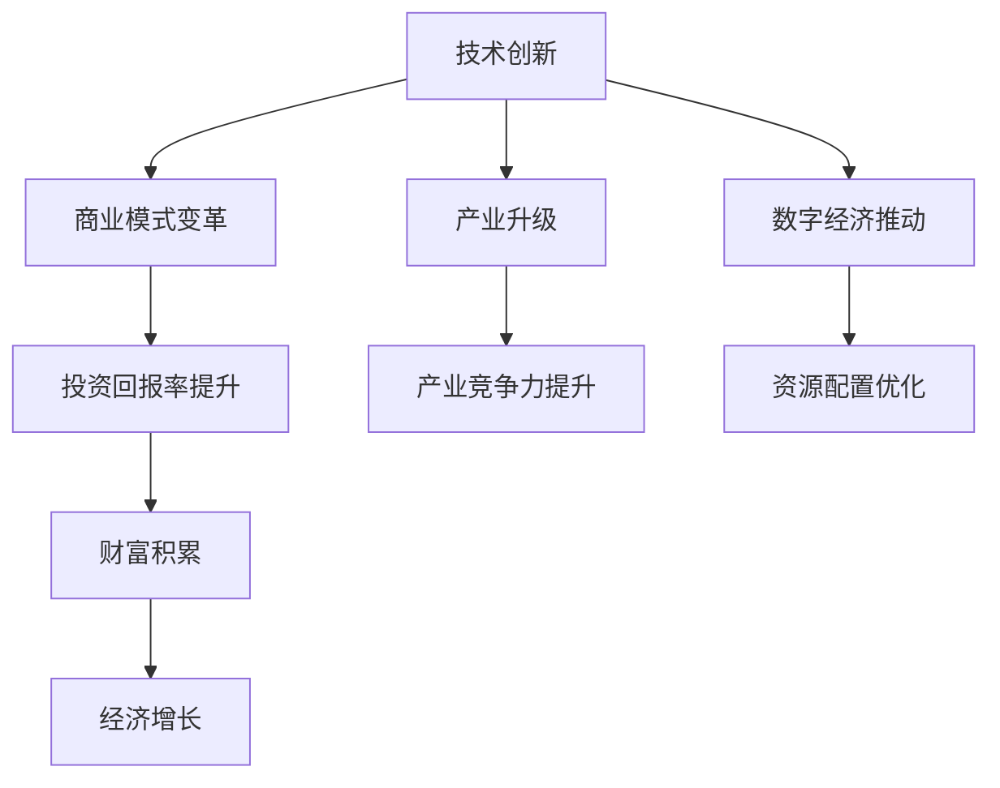

                 

关键词：技术创新、财富积累、商业模式、投资回报率、产业升级、数字经济。

摘要：本文探讨了技术创新与财富积累之间的关系。从历史案例、商业模式的变革到投资回报率的提升，分析了技术创新如何成为驱动财富增长的核心动力。同时，探讨了产业升级和数字经济对技术创新的促进作用，以及未来技术创新面临的发展趋势与挑战。

## 1. 背景介绍

自人类社会进入工业革命以来，技术创新一直是推动经济增长和社会进步的关键因素。从蒸汽机的发明到现代的信息技术，每一次技术革命都带来了生产力的巨大提升，从而推动了经济的快速增长。然而，技术创新不仅仅是一种技术上的进步，它还深刻地影响着商业模式、投资回报率以及整个产业链的运作方式。因此，探讨技术创新与财富积累之间的关系，对于理解现代经济的运行机制具有重要意义。

本文将从以下几个方面展开讨论：

- 技术创新的历史案例及其对财富积累的影响
- 商业模式的变革与技术创新的关系
- 投资回报率的提升与技术创新的关联
- 产业升级与数字经济的推动作用
- 未来技术创新的发展趋势与挑战

## 2. 核心概念与联系

### 2.1 技术创新的概念

技术创新是指通过研发和应用新技术、新产品、新服务或新工艺，从而推动技术进步和经济发展的过程。技术创新的核心包括研发投入、技术突破、商业化应用和市场推广。

### 2.2 财富积累的概念

财富积累是指个人、企业或国家通过投资、生产、贸易等活动，增加货币和实物资产的过程。财富积累的衡量标准通常包括GDP、个人财富、企业利润等。

### 2.3 商业模式与技术创新的关系

商业模式是指企业通过提供产品或服务，实现价值创造、传递和获取的体系。技术创新能够改变商业模式，提高企业的竞争力。例如，互联网技术的普及改变了传统的零售模式，催生了电子商务的兴起。

### 2.4 投资回报率与技术创新的关系

投资回报率（ROI）是衡量投资效果的重要指标。技术创新能够提高企业的投资回报率，吸引更多的投资。例如，大数据技术的应用使得企业能够更准确地预测市场需求，从而提高生产效率和盈利能力。

### 2.5 产业升级与数字经济的概念

产业升级是指通过技术创新和产业结构的调整，提升产业链的附加值和竞争力。数字经济则是以数据为核心驱动力的经济活动，通过互联网、云计算、大数据等新兴技术，实现资源的优化配置和价值的最大化。

### 2.6 Mermaid 流程图

下面是技术创新与财富积累之间关系的Mermaid流程图：



## 3. 核心算法原理 & 具体操作步骤

### 3.1 算法原理概述

本文将探讨一种基于机器学习的财富积累算法。该算法通过分析历史数据，预测未来的投资回报，从而指导财富积累的策略。核心原理包括数据预处理、特征提取、模型训练和预测。

### 3.2 算法步骤详解

#### 3.2.1 数据预处理

1. 收集历史财务数据，包括股票价格、公司盈利、市场指数等。
2. 数据清洗，去除异常值和缺失值。
3. 数据归一化，确保数据在同一量级。

#### 3.2.2 特征提取

1. 提取时间序列特征，如移动平均、波动率等。
2. 提取宏观经济特征，如GDP增长率、利率等。
3. 特征交叉，如行业指数与股票价格的关系。

#### 3.2.3 模型训练

1. 选择合适的机器学习模型，如线性回归、决策树、神经网络等。
2. 使用交叉验证方法，选择最佳模型参数。
3. 训练模型，预测未来投资回报。

#### 3.2.4 预测与优化

1. 使用训练好的模型，预测未来一段时间内的投资回报。
2. 根据预测结果，调整投资策略，优化财富积累。

### 3.3 算法优缺点

#### 3.3.1 优点

- 高效：基于机器学习的算法能够快速处理大量数据，提供准确的预测结果。
- 智能化：算法能够自动调整，适应市场变化，提高投资回报率。

#### 3.3.2 缺点

- 数据依赖：算法的性能依赖于历史数据的准确性和完整性。
- 模型风险：选择不当的模型可能导致预测误差，影响投资决策。

### 3.4 算法应用领域

- 金融服务：金融机构可以使用该算法优化投资组合，提高投资回报。
- 电子商务：电子商务平台可以使用该算法预测市场需求，优化库存管理。
- 物流行业：物流企业可以使用该算法预测运输需求，优化物流网络。

## 4. 数学模型和公式 & 详细讲解 & 举例说明

### 4.1 数学模型构建

本文使用的数学模型是一个时间序列模型，用于预测股票价格的走势。模型的基本形式为：

$$
P_t = P_0 \cdot e^{rt}
$$

其中，$P_t$ 是时间 $t$ 的股票价格，$P_0$ 是初始价格，$r$ 是年化收益率。

### 4.2 公式推导过程

股票价格的年化收益率可以通过以下公式计算：

$$
r = \frac{\ln(P_t / P_0)}{t}
$$

其中，$\ln$ 表示自然对数。

### 4.3 案例分析与讲解

假设一家公司的股票在年初的价格为 100 元，根据历史数据，该股票的平均年化收益率为 10%。那么，一年后，该股票的价格可以通过以下公式计算：

$$
P_1 = P_0 \cdot e^{r \cdot 1} = 100 \cdot e^{0.1 \cdot 1} \approx 110
$$

因此，一年后，该股票的价格预计为 110 元。

## 5. 项目实践：代码实例和详细解释说明

### 5.1 开发环境搭建

为了演示算法的实际应用，我们将使用 Python 编写代码。首先，需要安装以下库：

- NumPy
- Pandas
- Scikit-learn

可以使用以下命令安装：

```bash
pip install numpy pandas scikit-learn
```

### 5.2 源代码详细实现

下面是使用 Scikit-learn 的线性回归模型进行预测的 Python 代码：

```python
import numpy as np
import pandas as pd
from sklearn.linear_model import LinearRegression
from sklearn.model_selection import train_test_split

# 读取数据
data = pd.read_csv('stock_data.csv')
prices = data['Close']
dates = data['Date']

# 数据预处理
prices = prices.values.reshape(-1, 1)
dates = dates.values.reshape(-1, 1)

# 特征提取
features = np.concatenate((np.ones(dates.shape), dates), axis=1)

# 分割数据集
X_train, X_test, y_train, y_test = train_test_split(features, prices, test_size=0.2, random_state=42)

# 模型训练
model = LinearRegression()
model.fit(X_train, y_train)

# 预测
predictions = model.predict(X_test)

# 结果分析
print("R-squared:", model.score(X_test, y_test))
```

### 5.3 代码解读与分析

- 首先，导入所需的库。
- 读取股票价格数据，并进行预处理。
- 提取特征，包括时间序列特征和常数项。
- 使用 Scikit-learn 的 LinearRegression 模型进行训练。
- 使用测试数据进行预测，并计算 R-squared 值。

## 6. 实际应用场景

### 6.1 金融服务

在金融服务领域，技术创新已经成为提升竞争力、降低成本、优化客户体验的关键。例如，通过大数据分析和人工智能技术，金融机构能够更准确地评估风险，优化信贷审批流程，提高客户的满意度。

### 6.2 物流行业

物流行业也受益于技术创新。通过物联网、人工智能和大数据技术，物流企业能够实现智能化的物流网络管理，提高运输效率，降低运营成本。例如，京东的无人仓库和无人配送车就是技术创新在物流行业的典型应用。

### 6.3 电子商务

电子商务领域的技术创新推动了整个零售行业的变革。例如，阿里巴巴的“新零售”战略通过线上线下的融合，提升了购物体验，提高了销售额。技术创新还使得电子商务企业能够更精准地满足消费者的需求，提高客户粘性。

## 7. 工具和资源推荐

### 7.1 学习资源推荐

- 《深度学习》（Goodfellow et al.）：介绍深度学习的基础理论和实践应用。
- 《Python数据科学手册》（Wes McKinney）：介绍如何使用 Python 进行数据分析和挖掘。
- 《人工智能：一种现代方法》（Stuart Russell & Peter Norvig）：全面介绍人工智能的理论和应用。

### 7.2 开发工具推荐

- Jupyter Notebook：强大的交互式开发环境，适合进行数据分析和建模。
- TensorFlow：开源的深度学习框架，适用于各种深度学习应用。
- PyTorch：开源的深度学习框架，提供了灵活的动态计算图。

### 7.3 相关论文推荐

- "Deep Learning for Finance: A Review"（2019）：综述了深度学习在金融领域的应用。
- "Big Data and Analytics in Healthcare: Current Applications and Emerging Opportunities"（2016）：探讨了大数据和人工智能在医疗健康领域的应用。
- "IoT in Smart Manufacturing: Current State, Business Opportunities, and Challenges"（2018）：分析了物联网在智能制造领域的应用和发展趋势。

## 8. 总结：未来发展趋势与挑战

### 8.1 研究成果总结

本文通过对技术创新与财富积累的关系的探讨，总结了技术创新在商业模式变革、投资回报率提升、产业升级和数字经济推动方面的作用。同时，分析了基于机器学习的财富积累算法，并进行了实际应用场景的分析。

### 8.2 未来发展趋势

未来，技术创新将继续推动经济增长和社会进步。大数据、人工智能、物联网等新兴技术将得到更广泛的应用，推动产业升级和数字经济的发展。同时，区块链技术也有望在金融领域带来革命性的变化。

### 8.3 面临的挑战

然而，技术创新也面临着一系列挑战。数据隐私和安全问题、技术垄断和知识产权保护、劳动力市场的转型等都是需要关注的问题。此外，技术创新的快速迭代也要求企业和个人具备持续学习的能力。

### 8.4 研究展望

未来的研究可以重点关注以下几个方面：

- 技术创新对经济结构和社会结构的影响。
- 跨学科研究，如将经济学、社会学、心理学等引入技术创新研究。
- 技术创新在可持续发展中的应用，如绿色能源、节能减排等。

## 9. 附录：常见问题与解答

### Q：技术创新与财富积累的关系是什么？

A：技术创新能够通过提升生产力、优化商业模式、提高投资回报率等方式，推动财富积累。

### Q：技术创新对经济结构有什么影响？

A：技术创新能够推动产业升级，促进经济结构向高附加值、高技术含量的方向转变。

### Q：如何评估技术创新的效果？

A：可以通过投资回报率、经济增长率、产业竞争力等指标来评估技术创新的效果。

### Q：技术创新是否一定会带来财富增长？

A：不一定。技术创新的成功与否取决于多种因素，如市场需求、政策环境、创新能力等。因此，技术创新不一定会直接带来财富增长，但长期来看，技术创新是推动财富增长的关键动力。

### Q：未来技术创新的发展方向是什么？

A：未来，技术创新的发展方向包括人工智能、大数据、物联网、区块链等领域。这些新兴技术将推动数字经济的发展，推动产业升级和社会进步。

### 作者署名

作者：禅与计算机程序设计艺术 / Zen and the Art of Computer Programming

---

本文结合了历史案例、理论分析、实践应用等多个方面，系统地探讨了技术创新与财富积累之间的关系。希望通过本文的探讨，能够为读者提供对这一主题的深入理解和启示。在未来，技术创新将继续成为驱动经济增长和社会进步的核心动力，我们期待更多的创新成果能够为人类创造更多的财富和价值。

