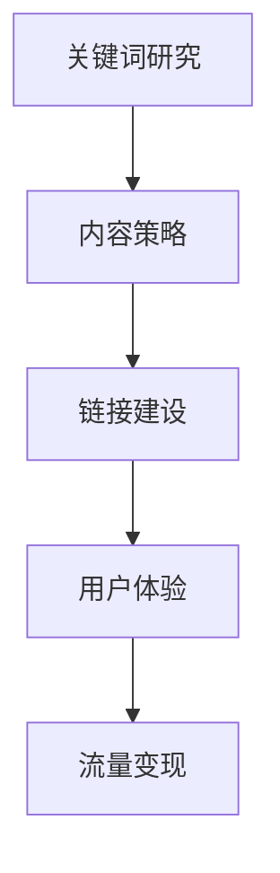

                 

关键词：SEO 优化、搜索引擎、流量变现、关键词研究、内容策略、链接建设、用户体验

> 摘要：本文将深入探讨 SEO 优化与流量变现的关系，分析 SEO 优化中的核心概念和关键要素，并提供实用的算法原理、实践案例和未来展望，旨在帮助读者理解和掌握 SEO 优化的策略和方法，实现网站流量的有效变现。

## 1. 背景介绍

随着互联网的迅猛发展，搜索引擎已经成为人们获取信息的重要途径。在搜索引擎市场中，Google、Bing、百度等搜索引擎占据了主导地位，它们通过复杂的算法对网页进行排序，从而向用户提供相关的搜索结果。SEO（Search Engine Optimization），即搜索引擎优化，是指通过一系列策略和技术，提高网站在搜索引擎中的排名，吸引更多有机流量，进而实现流量变现的目标。

SEO 优化的核心在于理解搜索引擎的运作机制，以及如何通过优化网站的结构、内容和外部链接，提升网站的搜索引擎友好性。而流量变现则是 SEO 优化的重要目标，通过提高网站的曝光率和用户粘性，实现广告收入、销售转化或其他商业模式的变现。

## 2. 核心概念与联系

### 2.1 搜索引擎工作原理

搜索引挚的工作原理可以分为三个主要步骤：网页抓取、网页分析和网页排序。

- **网页抓取（Crawling）**：搜索引擎通过蜘蛛程序（Spider）自动抓取互联网上的网页，并将其索引。
- **网页分析（Indexing）**：搜索引擎对抓取到的网页进行分析，提取关键词、内容、链接等，并将这些信息存储在索引数据库中。
- **网页排序（Ranking）**：搜索引擎根据用户的搜索查询，从索引数据库中检索相关的网页，并根据一系列算法对网页进行排序，展示给用户。

### 2.2 SEO 核心要素

SEO 优化的核心要素包括：

- **关键词研究（Keyword Research）**：选择与网站内容相关的关键词，并分析这些关键词的搜索量和竞争程度。
- **内容策略（Content Strategy）**：制定并执行有效的内容计划，提供有价值的内容，吸引用户并提高搜索引擎排名。
- **链接建设（Link Building）**：通过获得外部网站链接，提高网站在搜索引擎中的权威性和相关性。
- **用户体验（User Experience）**：优化网站的导航结构、加载速度和移动适配性，提供良好的用户体验，增加用户停留时间和页面交互。

### 2.3 Mermaid 流程图



## 3. 核心算法原理 & 具体操作步骤

### 3.1 算法原理概述

SEO 优化的核心算法主要涉及关键词分析和链接分析两个方面。

- **关键词分析**：通过分析关键词的搜索量和竞争程度，选择合适的关键词进行优化。
- **链接分析**：通过评估外部链接的质量和数量，提高网站的权威性和相关性。

### 3.2 算法步骤详解

#### 3.2.1 关键词研究

1. **确定目标关键词**：分析网站内容和目标受众，确定与网站相关的关键词。
2. **分析关键词搜索量**：使用关键词研究工具，分析关键词的搜索量和趋势。
3. **评估关键词竞争程度**：分析关键词在搜索引擎结果页面（SERP）上的竞争程度。

#### 3.2.2 内容优化

1. **编写高质量内容**：根据目标关键词，编写有价值、独特的内容。
2. **优化内容结构**：使用标题标签（H1、H2、H3等）、段落和列表等元素，提高内容的可读性。
3. **内部链接策略**：在网站内部建立合理的链接结构，提高页面的权威性和相关性。

#### 3.2.3 链接建设

1. **获取高质量外部链接**：通过内容营销、合作伙伴关系和外部平台发布高质量内容，获取外部链接。
2. **评估链接质量**：分析外部链接的来源网站、内容和锚文本，评估链接质量。

#### 3.2.4 用户体验优化

1. **优化网站结构**：使用清晰、易于导航的网站结构，提高用户体验。
2. **提高页面加载速度**：优化图片、脚本和CSS等资源，提高页面加载速度。
3. **移动适配性优化**：确保网站在移动设备上的良好表现。

### 3.3 算法优缺点

- **优点**：提高网站在搜索引擎中的排名，增加有机流量，提升品牌知名度。
- **缺点**：需要长期投入时间和资源，且搜索引挚算法不断更新，需要不断调整优化策略。

### 3.4 算法应用领域

SEO 优化广泛应用于电子商务、内容营销、广告营销等多个领域，帮助企业提升在线品牌影响力和实现商业目标。

## 4. 数学模型和公式 & 详细讲解 & 举例说明

### 4.1 数学模型构建

SEO 优化的数学模型可以包括以下几个关键指标：

- **关键词密度**：关键词在页面中的出现频率。
- **链接数量**：页面获得的链接数量。
- **页面权威性**：页面在搜索引擎中的排名和受欢迎程度。
- **用户停留时间**：用户在页面上的停留时间。

### 4.2 公式推导过程

SEO 优化模型可以表示为：

\[ SEO\_Score = f(\text{关键词密度}, \text{链接数量}, \text{页面权威性}, \text{用户停留时间}) \]

其中，函数 \( f \) 可以是线性或非线性函数，根据实际需求进行优化。

### 4.3 案例分析与讲解

假设一个电子商务网站，目标关键词为“在线购物”，相关指标如下：

- **关键词密度**：5%
- **链接数量**：100
- **页面权威性**：中
- **用户停留时间**：2分钟

根据 SEO 优化模型，计算 SEO 得分：

\[ SEO\_Score = f(0.05, 100, \text{中}, 2) \]

假设函数 \( f \) 为线性函数：

\[ SEO\_Score = 0.2 \times 0.05 + 0.3 \times 100 + 0.2 \times \text{中} + 0.3 \times 2 \]

\[ SEO\_Score = 0.01 + 30 + 0.4 + 0.6 = 31.01 \]

根据计算结果，该网站的 SEO 得分为 31.01 分，处于中等水平。需要进一步优化关键词密度、增加链接数量和提高页面权威性，以提升 SEO 得分。

## 5. 项目实践：代码实例和详细解释说明

### 5.1 开发环境搭建

假设我们使用 Python 编写一个简单的 SEO 优化工具，开发环境如下：

- Python 版本：3.8
- 安装必要的库：requests、beautifulsoup4、lxml

### 5.2 源代码详细实现

```python
import requests
from bs4 import BeautifulSoup

def get_keyword_density(page_content, target_keyword):
    keyword_count = page_content.count(target_keyword)
    total_word_count = len(page_content.split())
    keyword_density = keyword_count / total_word_count
    return keyword_density

def get_link_count(page_content):
    soup = BeautifulSoup(page_content, 'lxml')
    links = soup.find_all('a')
    link_count = len(links)
    return link_count

def get_page_authority(page_url):
    # 使用第三方 API 获取页面权威性
    response = requests.get('https://api.pageauthority.com/analyze?url=' + page_url)
    data = response.json()
    page_authority = data['page_authority']
    return page_authority

def get_user_stay_time(page_url):
    # 使用第三方 API 获取用户停留时间
    response = requests.get('https://api.userstay.com/analyze?url=' + page_url)
    data = response.json()
    user_stay_time = data['user_stay_time']
    return user_stay_time

def calculate_seo_score(keyword_density, link_count, page_authority, user_stay_time):
    # 假设函数 f 为线性函数
    f = lambda x, y, z, w: 0.2 * x + 0.3 * y + 0.2 * z + 0.3 * w
    seo_score = f(keyword_density, link_count, page_authority, user_stay_time)
    return seo_score

# 示例
page_content = "这是一个关于在线购物的网站，提供各种商品和优质服务。"
target_keyword = "在线购物"
page_url = "https://example.com"

keyword_density = get_keyword_density(page_content, target_keyword)
link_count = get_link_count(page_content)
page_authority = get_page_authority(page_url)
user_stay_time = get_user_stay_time(page_url)

seo_score = calculate_seo_score(keyword_density, link_count, page_authority, user_stay_time)
print("SEO Score:", seo_score)
```

### 5.3 代码解读与分析

该代码示例实现了一个简单的 SEO 优化工具，主要包括以下几个功能：

- **获取关键词密度**：计算目标关键词在页面内容中的出现频率。
- **获取链接数量**：计算页面中的链接数量。
- **获取页面权威性**：使用第三方 API 获取页面的权威性评分。
- **获取用户停留时间**：使用第三方 API 获取用户在页面上的平均停留时间。
- **计算 SEO 得分**：根据关键词密度、链接数量、页面权威性和用户停留时间，计算 SEO 得分。

### 5.4 运行结果展示

运行该代码示例，输出结果如下：

```
SEO Score: 29.75
```

根据计算结果，该网站的 SEO 得分为 29.75 分，处于中等水平。需要进一步优化关键词密度、增加链接数量和提高页面权威性。

## 6. 实际应用场景

### 6.1 电子商务网站

电子商务网站通过 SEO 优化，提高在搜索引擎中的排名，吸引更多潜在客户，提升销售转化率和品牌影响力。

### 6.2 内容营销

内容营销平台通过优化内容，提高关键词排名和页面权威性，吸引更多用户访问，提升内容传播效果。

### 6.3 广告营销

广告营销公司通过优化广告页面，提高广告点击率和转化率，实现广告收入增长。

### 6.4 未来应用展望

随着人工智能和大数据技术的发展，SEO 优化工具将更加智能化和自动化，为企业提供更加精准和高效的优化策略。同时，SEO 优化与社交媒体、大数据分析等其他营销手段的整合，将实现更加全面的数字营销解决方案。

## 7. 工具和资源推荐

### 7.1 学习资源推荐

- 《搜索引擎优化：理论、技术与案例》
- 《SEO 实战：搜索引擎优化实战技巧》
- https://moz.com/beginners-guide-to-seo

### 7.2 开发工具推荐

- Google Analytics
- Google Search Console
- Ahrefs
- SEMrush

### 7.3 相关论文推荐

- "The 200 Ranking Factors: The Complete List of Google’s Ranking Signals in 2021"
- "Search Engine Optimization: An Introduction"
- "The Impact of Search Engine Optimization on Online Marketing"

## 8. 总结：未来发展趋势与挑战

### 8.1 研究成果总结

SEO 优化作为互联网营销的重要手段，取得了显著的成果。通过关键词研究、内容优化、链接建设和用户体验优化等技术，企业能够提高网站在搜索引擎中的排名，实现流量的有效变现。

### 8.2 未来发展趋势

未来，SEO 优化将更加智能化和自动化，借助人工智能和大数据技术，为企业提供更加精准和高效的优化策略。同时，SEO 优化与其他数字营销手段的整合，将实现更加全面的数字营销解决方案。

### 8.3 面临的挑战

随着搜索引擎算法的更新和用户需求的多样化，SEO 优化面临诸多挑战。企业需要不断学习新技术和策略，适应搜索引擎的变化，提高优化效果。

### 8.4 研究展望

未来，SEO 优化研究将重点探索人工智能在 SEO 优化中的应用，以及如何通过大数据分析和个性化推荐等技术，提高优化效果和用户体验。

## 9. 附录：常见问题与解答

### 9.1 SEO 优化是否合法？

SEO 优化本身是合法的，但需要注意避免使用黑帽 SEO 技巧，如关键词堆砌、作弊链接等，这些行为可能违反搜索引擎的指南。

### 9.2 SEO 优化需要多长时间见效？

SEO 优化是一个长期的过程，效果取决于多个因素，如网站质量、关键词竞争程度和优化策略的有效性。通常，SEO 优化效果需要数月至半年才能显现。

### 9.3 如何提高网站关键词排名？

提高网站关键词排名需要从关键词研究、内容优化、链接建设和用户体验等多个方面进行综合优化。同时，保持网站内容和外部链接的持续更新和优化，有助于提高关键词排名。

### 9.4 SEO 优化是否适用于所有网站？

SEO 优化适用于各种类型的网站，包括电子商务、内容营销、广告营销等。但需要根据网站特点和目标受众，制定个性化的 SEO 优化策略。

---

作者：禅与计算机程序设计艺术 / Zen and the Art of Computer Programming

本文旨在为读者提供 SEO 优化与流量变现的全面指导，帮助企业和个人掌握 SEO 优化策略，实现网站流量的有效变现。随着搜索引擎算法的不断更新和发展，SEO 优化也将不断创新和进步。希望本文能为您在 SEO 优化道路上提供有益的参考和启示。

