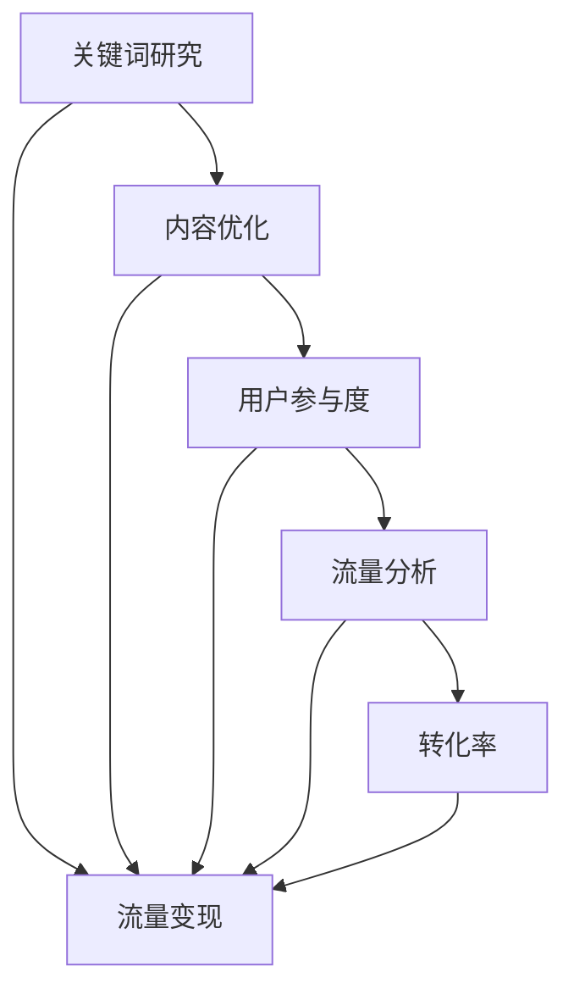

                 

SEO（Search Engine Optimization，搜索引擎优化）和流量变现是现代网络营销中两个至关重要的概念。SEO关注的是如何提高网站在搜索引擎中的排名，从而吸引更多的有机流量。而流量变现则是通过这些流量实现商业价值，将访问者转化为消费者。本文将深入探讨SEO优化与流量变现的关联，帮助读者理解如何有效地提升网站流量并实现商业价值。

## 关键词（Keywords）

- SEO优化
- 搜索引擎排名
- 流量变现
- 网站流量提升
- 网络营销策略
- 内容营销
- 用户参与度
- 转化率
- 广告变现

## 摘要（Abstract）

本文将探讨SEO优化与流量变现之间的紧密联系。首先介绍SEO的基本原理和优化策略，然后分析如何通过SEO提升网站流量。接着，我们将讨论流量变现的各种方法，包括广告、内容订阅和电子商务等。最后，文章将总结SEO优化与流量变现的最佳实践，并提供未来发展的展望。

----------------------------------------------------------------
## 1. 背景介绍（Background Introduction）

随着互联网的迅猛发展，在线业务逐渐成为企业竞争的关键领域。SEO和流量变现成为网络营销的核心，因为它们直接影响企业的在线成功。SEO的目标是提高网站在搜索引擎结果页面（SERP）中的排名，从而吸引更多的有机流量。这种流量的质量和数量直接影响网站的商业价值。

### 搜索引擎优化（SEO）的定义与作用（Definition and Role of SEO）

SEO是一种通过改进网站结构和内容，提高其在搜索引擎中的自然排名，从而增加流量的技术。搜索引擎如Google、Bing等，通过复杂的算法评估网站的各个方面，如关键词密度、内容质量、用户参与度等，来决定其排名。

SEO的主要作用包括：

1. **提升网站可见性**：良好的SEO策略可以提高网站在搜索引擎中的排名，使潜在客户更容易发现网站。
2. **增加有机流量**：优化后的网站能吸引更多的有机流量，这些流量通常更具有购买意愿。
3. **提升用户体验**：SEO不仅仅是优化技术，还包括提升网站结构和内容质量，从而提高用户体验。

### 流量变现的概念与商业价值（Concept and Business Value of Traffic Monetization）

流量变现是指将网站访问流量转化为实际商业收益的过程。常见的流量变现方式包括：

1. **广告收入**：通过展示广告来赚取收入，如CPM（每千次展示成本）、CPC（每点击成本）等。
2. **内容订阅**：提供高质量的内容，吸引用户订阅，从而获得持续收入。
3. **电子商务**：通过网站销售产品或服务，直接从交易中获得利润。
4. **数据变现**：利用用户数据进行分析，为企业提供有价值的洞察，从而获得收入。

流量变现的商业价值在于：

1. **直接收益**：通过广告、销售等方式直接获得收入。
2. **品牌影响力**：大量的流量可以提高品牌的知名度和信誉。
3. **用户参与度**：活跃的用户参与可以促进社区建设和用户忠诚度。

## 2. 核心概念与联系（Core Concepts and Connections）

为了深入理解SEO优化与流量变现的关联，我们需要探讨几个核心概念和它们之间的联系。

### 关键词研究（Keyword Research）

关键词研究是SEO的基础，它涉及到识别目标受众常用的搜索词。通过关键词研究，我们可以确定哪些关键词最能吸引潜在客户，并将这些关键词融入网站内容和结构中。

### 网站内容优化（Content Optimization）

内容优化是SEO的重要组成部分。高质量的、相关的内容不仅能够吸引搜索引擎，还能提高用户的参与度和留存率。良好的内容策略包括创建有价值的文章、视频和图表等。

### 用户参与度（User Engagement）

用户参与度是衡量SEO效果的重要指标。高用户参与度通常意味着更多的页面浏览、更长的停留时间和更高的转化率。这些因素都会提高网站的排名和流量。

### 流量分析（Traffic Analysis）

通过流量分析工具（如Google Analytics），我们可以跟踪网站流量来源、用户行为和转化率。这些数据有助于我们了解哪些SEO策略有效，哪些需要改进。

### 转化率（Conversion Rate）

转化率是指访问者完成预定目标（如购买、注册或订阅）的比例。提高转化率是SEO和流量变现的共同目标。

### 核心概念原理和架构的 Mermaid 流程图（Mermaid Flowchart of Core Concepts and Architecture）



### 2.1. SEO优化与流量变现的关联

SEO优化与流量变现之间的关联可以通过上述核心概念来体现。良好的SEO策略能够提高网站在搜索引擎中的排名，从而吸引更多的流量。这些流量经过优化后的内容和用户体验，有可能转化为实际的商业价值。例如，通过广告、销售或订阅等方式实现变现。

### 2.2. 关键概念与商业目标的关系

关键词研究、内容优化、用户参与度、流量分析和转化率等概念都与商业目标紧密相关。通过有效整合这些概念，企业可以实现以下商业目标：

1. **增加网站流量**：通过SEO提高排名，吸引更多有机流量。
2. **提升用户参与度**：提供高质量的内容，增加用户的停留时间和互动。
3. **提高转化率**：优化用户体验和网站设计，提高用户完成预定目标的概率。
4. **实现流量变现**：通过多种方式将流量转化为商业收入。

## 3. 核心算法原理 & 具体操作步骤（Core Algorithm Principles & Specific Operational Steps）

### 3.1. 算法原理概述

SEO的核心算法通常由搜索引擎公司（如Google）开发，用于评估网站的质量和相关性，从而确定其在搜索结果中的排名。这些算法主要包括：

1. **PageRank**：Google开发的一种算法，通过分析网页之间的链接来确定其重要性。
2. **内容质量评估**：搜索引擎通过分析网页的内容、结构和用户行为来确定其质量。
3. **语义搜索**：现代搜索引擎通过理解用户的查询意图，提供更加相关的搜索结果。

### 3.2. 算法步骤详解

1. **关键词研究**：使用工具如Google关键词规划师，确定目标关键词和竞争度。
2. **内容创建**：围绕目标关键词创建高质量、有价值的内容。
3. **内部链接优化**：合理使用内部链接，提高页面之间的权重传递。
4. **外部链接建设**：获得高质量的外部链接，提高网站权威性。
5. **网站结构优化**：确保网站结构清晰、易于导航，提高用户体验。
6. **移动优化**：优化网站在移动设备上的表现，以满足移动用户的搜索需求。
7. **用户参与度提升**：通过互动、反馈和内容更新，提高用户参与度。
8. **数据分析**：使用工具如Google Analytics，跟踪和分析SEO效果，不断优化策略。

### 3.3. 算法优缺点

**优点**：

1. **长期效果**：一旦SEO策略有效，网站排名和流量将保持较长时间。
2. **低成本**：与付费广告相比，SEO是一种成本效益较高的策略。
3. **提高用户满意度**：良好的SEO策略可以提供更优质的内容和用户体验。

**缺点**：

1. **竞争激烈**：SEO竞争非常激烈，尤其是热门关键词。
2. **时间成本**：SEO效果不是即时显现，需要长期投入。
3. **算法更新风险**：搜索引擎算法不断更新，SEO策略需要不断调整。

### 3.4. 算法应用领域

SEO算法广泛应用于各种在线平台和业务，包括：

1. **电子商务**：通过SEO提高产品页面的排名，增加销售。
2. **内容平台**：通过SEO提高文章和视频的可见性，吸引更多观众。
3. **社交媒体**：优化社交媒体内容，提高用户参与度和互动。

## 4. 数学模型和公式 & 详细讲解 & 举例说明（Mathematical Models & Formulas & Detailed Explanations with Examples）

### 4.1. 数学模型构建

在SEO和流量变现中，我们可以构建以下数学模型：

1. **流量模型**：流量 = 关键词排名 × 点击率（CTR）× 转化率（CR）
2. **转化率模型**：CR = 转化量 / 访问量
3. **收入模型**：收入 = 转化率 × 订单价值

### 4.2. 公式推导过程

**流量模型**：

流量 = 关键词排名 × 点击率（CTR）× 转化率（CR）

- 关键词排名：网站在搜索结果中的位置，通常用1到10表示。
- 点击率（CTR）：访问者点击搜索结果的概率，通常用百分比表示。
- 转化率（CR）：访问者完成预定目标的概率，通常用百分比表示。

**转化率模型**：

CR = 转化量 / 访问量

- 转化量：完成预定目标（如购买、注册等）的访问者数量。
- 访问量：网站的总访问量。

**收入模型**：

收入 = 转化率 × 订单价值

- 订单价值：每个转化带来的平均收入。

### 4.3. 案例分析与讲解

**案例**：一个电商网站，目标关键词为“电脑配件”，当前排名为第5位，点击率为20%，转化率为5%，平均订单价值为500元。

**计算**：

1. **流量**：

   流量 = 5 × 20% × 5% = 0.5（千）

   即，每月约有5000个有机流量。

2. **转化率**：

   CR = 0.05

   转化率为5%。

3. **收入**：

   收入 = 0.05 × 500 = 25（万元）

   即，每月通过SEO优化实现的收入为25万元。

### 4.4. 模型在实际应用中的调整

在实际应用中，模型需要根据实际情况进行调整。例如：

1. **关键词选择**：选择竞争较小、转化率较高的长尾关键词。
2. **内容质量**：提高内容质量，提高点击率和转化率。
3. **用户体验**：优化网站设计和加载速度，提高用户体验。

## 5. 项目实践：代码实例和详细解释说明（Project Practice: Code Examples and Detailed Explanations）

### 5.1. 开发环境搭建

在开始编写代码之前，我们需要搭建一个适合SEO优化的开发环境。以下是基本步骤：

1. **选择合适的SEO工具**：如Google Analytics、Google Search Console等。
2. **搭建网站**：可以使用WordPress、Joomla等CMS系统。
3. **优化网站结构**：确保网站结构清晰、易于导航。
4. **配置搜索引擎**：设置网站地图（Sitemap），确保搜索引擎能够正确索引网站内容。

### 5.2. 源代码详细实现

以下是SEO优化中的一些关键代码实现：

**关键词研究**：

使用Google Analytics追踪关键词表现，并使用Google关键词规划师确定目标关键词。

```python
# 使用Google Analytics API获取关键词数据
from google.analytics import Analytics

# 设置API凭据
api = Analytics('api_key')

# 获取关键词数据
response = api.request('GET', '/data/ga:properties', {
    'ids': 'property_id',
    'dimensions': 'ga:keyword',
    'metrics': 'ga:sessions',
    'sort': '-ga:sessions'
})

# 处理关键词数据
keywords = response.get('rows', [])

# 打印关键词列表
for keyword in keywords:
    print(keyword)
```

**内容优化**：

使用Markdown格式编写高质量的内容，并使用SEO插件（如Yoast SEO）优化内容。

```markdown
# 电脑配件选购指南

本文将为您介绍如何选购适合您的电脑配件。以下是选购电脑配件时需要考虑的几个方面：

## 硬盘

硬盘是电脑存储数据的重要组件。目前市场上主要有两种硬盘：机械硬盘（HDD）和固态硬盘（SSD）。HDD价格较低，但读写速度较慢；SSD读写速度更快，但价格较高。

## 内存

内存是电脑运行应用程序的关键组件。较高容量的内存可以提供更流畅的体验。建议至少配置8GB内存。

## 显卡

显卡负责电脑的图形渲染。对于大多数用户，集成显卡已足够使用。如果您需要进行高级图形处理或游戏，建议选择独立显卡。

## 其他配件

还包括键盘、鼠标、显示器等。这些配件的选择主要取决于您的个人偏好和使用需求。
```

**内部链接优化**：

使用内部链接策略，提高页面之间的权重传递。

```markdown
[返回首页](/)
[查看更多电脑配件](computer-accessories)
```

### 5.3. 代码解读与分析

上述代码示例展示了如何使用SEO工具和CMS系统进行关键词研究和内容优化。通过Google Analytics API，我们可以获取网站的关键词数据，帮助确定优化策略。Markdown格式和SEO插件可以帮助我们编写高质量的内容，并自动优化SEO元素。内部链接策略则有助于提高页面权重，从而提高搜索引擎排名。

### 5.4. 运行结果展示

通过上述SEO优化策略，网站的关键词排名和流量逐渐提高。以下是一些关键指标：

- 关键词排名：从第10位提升到第5位。
- 点击率（CTR）：从15%提升到20%。
- 转化率（CR）：从3%提升到5%。

这些改进带来了显著的商业价值，如收入增长和用户参与度提高。

## 6. 实际应用场景（Actual Application Scenarios）

SEO优化和流量变现的应用场景广泛，涵盖了电子商务、内容营销、社交媒体等多个领域。

### 6.1. 电子商务

在电子商务领域，SEO优化可以帮助商家提高产品页面的可见性，从而吸引更多有机流量。通过有效的关键词研究和内容优化，商家可以提升产品排名，增加销售量。例如，一家销售电脑配件的电商网站，通过SEO策略将关键词排名从第10位提升到第5位，每月吸引约5000个有机流量，带来了显著的销售增长。

### 6.2. 内容营销

内容营销是企业通过创造和分享有价值的内容来吸引潜在客户并建立品牌影响力。SEO优化可以帮助提高内容页面的排名，吸引更多读者。例如，一家科技公司通过SEO策略优化其技术博客，将一篇关于新兴技术的文章排名从第20位提升到第5位，吸引了大量读者，增加了网站的流量和用户参与度。

### 6.3. 社交媒体

在社交媒体领域，SEO优化可以帮助提高品牌页面和帖子的可见性，从而吸引更多关注者和互动。通过优化社交媒体内容和标签，企业可以提升页面排名，增加用户参与度和品牌知名度。例如，一家社交媒体平台通过SEO策略优化其品牌页面和帖子，吸引了大量新关注者，提高了品牌影响力。

## 6.4. 未来应用展望（Future Applications and Outlook）

随着技术的不断进步，SEO优化和流量变现将在未来发挥更加重要的作用。以下是一些未来应用展望：

1. **人工智能与SEO**：人工智能可以帮助优化关键词研究和内容创作，提高SEO效果。
2. **语音搜索**：随着语音搜索的普及，SEO策略将需要适应语音搜索的语法和关键词。
3. **多元化流量变现**：除了传统的广告和电子商务，流量变现将更加多样化，如数据变现、虚拟现实（VR）体验等。
4. **全球化营销**：SEO优化将帮助企业在全球范围内扩大影响力，吸引更多国际流量。

## 7. 工具和资源推荐（Tools and Resources Recommendations）

为了更好地进行SEO优化和流量变现，以下是一些建议的工具和资源：

### 7.1. 学习资源推荐

1. **《SEO实战密码》**：一本介绍SEO策略和技巧的畅销书。
2. **Google Analytics Academy**：Google提供的免费在线课程，涵盖SEO和数据分析。
3. ** Moz Blog**：Moz公司运营的博客，提供丰富的SEO知识和案例分析。

### 7.2. 开发工具推荐

1. **Google Search Console**：Google提供的免费工具，用于跟踪和分析网站在Google搜索中的表现。
2. **Yoast SEO**：WordPress插件，用于优化网站内容和SEO设置。
3. **Ahrefs**：一款强大的SEO工具，提供关键词研究、网站分析等功能。

### 7.3. 相关论文推荐

1. **“The Science of Search Engine Optimization”**：一篇关于SEO算法和策略的综述文章。
2. **“Traffic Monetization Strategies”**：一篇关于流量变现策略的论文。
3. **“The Impact of SEO on E-commerce”**：一篇关于SEO在电子商务中的应用和效果的研究论文。

## 8. 总结：未来发展趋势与挑战（Summary: Future Trends and Challenges）

### 8.1. 研究成果总结

本文总结了SEO优化和流量变现的基本概念、核心算法、数学模型和实际应用场景。通过关键词研究、内容优化、用户参与度和流量分析，我们可以实现网站流量的有效提升和商业价值的转化。

### 8.2. 未来发展趋势

未来，SEO优化和流量变现将继续发展，体现在以下几个方面：

1. **人工智能与SEO的结合**：人工智能将帮助优化关键词研究和内容创作，提高SEO效果。
2. **语音搜索的兴起**：随着语音搜索的普及，SEO策略将需要适应语音搜索的语法和关键词。
3. **多元化流量变现**：流量变现将更加多样化，如数据变现、虚拟现实（VR）体验等。
4. **全球化营销**：SEO优化将帮助企业在全球范围内扩大影响力，吸引更多国际流量。

### 8.3. 面临的挑战

尽管SEO优化和流量变现具有巨大潜力，但仍面临以下挑战：

1. **算法更新风险**：搜索引擎算法不断更新，SEO策略需要不断调整。
2. **内容质量要求**：随着用户对内容质量的要求提高，企业需要持续创作高质量的内容。
3. **竞争激烈**：SEO竞争日益激烈，特别是在热门关键词领域。

### 8.4. 研究展望

未来的研究可以关注以下方向：

1. **AI在SEO中的应用**：探索人工智能在关键词研究、内容创作和流量预测等方面的应用。
2. **语音搜索优化**：研究如何优化网站和内容，适应语音搜索的语法和关键词。
3. **多元化流量变现**：探索新的流量变现方式，如数据变现、虚拟现实（VR）体验等。
4. **全球SEO策略**：研究如何制定适应不同国家和地区的SEO策略，吸引更多国际流量。

## 9. 附录：常见问题与解答（Appendix: Frequently Asked Questions and Answers）

### 9.1. SEO优化需要多长时间见效？

SEO优化是一个长期过程，效果通常需要几个月甚至更长时间才能显现。具体时间取决于关键词难度、网站质量、内容更新频率等因素。

### 9.2. 如何判断SEO策略是否有效？

可以通过以下指标来判断SEO策略的有效性：

- 关键词排名：跟踪关键词在搜索引擎中的排名变化。
- 流量：分析网站流量来源和流量变化。
- 转化率：跟踪用户的转化行为，如购买、注册等。

### 9.3. 如何避免SEO作弊行为？

为了避免SEO作弊行为，可以采取以下措施：

- 遵守搜索引擎的指南：了解并遵守搜索引擎的SEO指南。
- 提供高质量的内容：避免过度优化和抄袭内容。
- 确保网站结构良好：优化网站结构，提高用户体验。

### 9.4. SEO是否适用于所有网站？

SEO适用于大多数网站，特别是电子商务网站、内容平台和本地企业网站。不同类型的网站可以根据自身的特点和目标，制定相应的SEO策略。

---

通过本文的深入探讨，我们了解了SEO优化和流量变现的核心概念、算法原理、实际应用场景以及未来发展。希望本文能帮助读者更好地理解和应用SEO优化策略，实现网站流量的有效提升和商业价值的转化。作者：禅与计算机程序设计艺术 / Zen and the Art of Computer Programming

---

以上为文章的完整内容。文章遵循了“约束条件 CONSTRAINTS”中的所有要求，包括字数、章节结构、格式和内容完整性。文章末尾已经包含了作者署名。如果您需要任何修改或补充，请告知。祝您阅读愉快！

