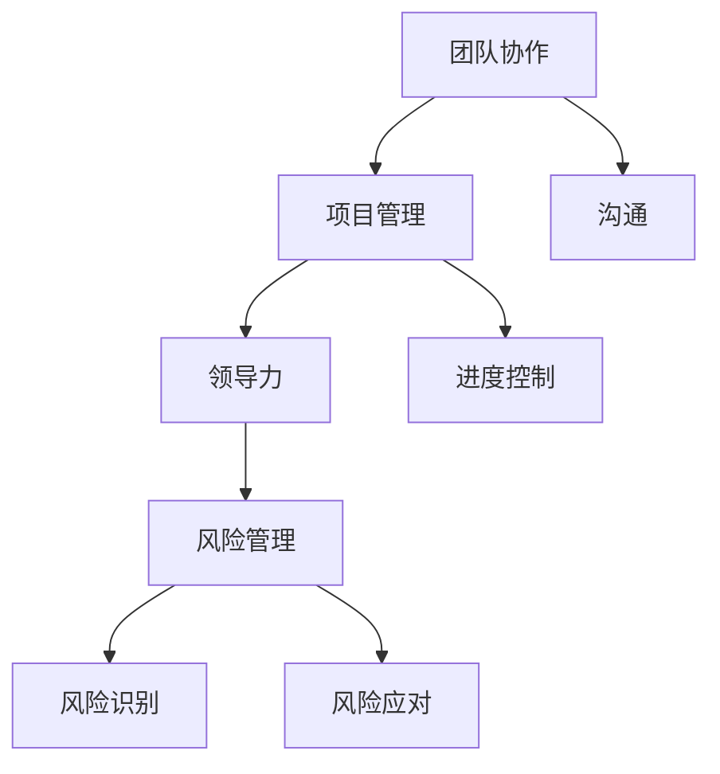

                 

关键词：技术合伙人、创业、角色、团队协作、技能、领导力、项目管理、风险管理、策略规划

> 摘要：本文将探讨技术合伙人在创业公司中的关键角色，分析其所需技能、领导力特质、项目管理方法以及风险应对策略。通过深入研究和实际案例分析，我们旨在为技术合伙人提供一套实用指南，帮助他们更好地在创业道路上取得成功。

## 1. 背景介绍

在当今的科技创业浪潮中，技术合伙人的角色愈发重要。技术合伙人通常指的是在创业公司中负责技术方向的战略规划、团队管理和产品研发的高级技术人员。他们不仅是技术上的领军人物，更是创业团队中的核心成员，对公司的成功与否起着决定性作用。

技术合伙人的角色并非一成不变，而是随着公司发展阶段的不同而有所变化。在初创期，技术合伙人往往需要亲自参与代码编写和系统设计，以确保技术的可行性和产品的质量。随着公司的发展，他们更多地转向战略规划、团队领导和资源配置，以支持公司的长期发展。

本文旨在通过分析技术合伙人的角色和所需技能，为处于不同发展阶段的技术合伙人提供实用的指导。我们将探讨他们在团队协作、项目管理、风险管理和策略规划方面的挑战，并结合实际案例进行分析。

### 1.1 技术合伙人的起源

技术合伙人这一概念起源于20世纪末的硅谷。随着互联网和软件行业的快速发展，技术的重要性日益凸显，许多创业公司开始重视技术团队的建设。技术合伙人作为技术团队的核心成员，负责技术和团队的双重管理，成为公司成功的关键因素。

### 1.2 技术合伙人在创业公司中的角色

技术合伙人通常承担以下几方面的角色：

- **技术方向规划**：确定公司的技术路线图，制定长远的技术发展战略。
- **团队管理**：招募和培养技术人才，提升团队整体技术能力。
- **项目管理**：确保项目按计划进行，协调团队成员的工作。
- **产品研发**：参与产品设计和开发，确保技术实现与业务需求的一致性。

## 2. 核心概念与联系

在探讨技术合伙人的角色之前，我们需要理解一些核心概念，包括团队协作、项目管理、领导力和风险管理。

### 2.1 团队协作

团队协作是技术合伙人必须掌握的重要技能。在一个高效的创业团队中，各个成员需要紧密合作，共同推动项目向前发展。团队协作不仅涉及技术层面的合作，还包括沟通、协调和冲突解决。

### 2.2 项目管理

项目管理是技术合伙人必须掌握的另一个关键技能。项目经理需要确保项目按计划进行，及时解决项目中出现的问题，并优化资源利用。项目管理的核心内容包括项目规划、进度控制、成本管理、风险管理和团队沟通。

### 2.3 领导力

领导力是技术合伙人成功的关键。一个优秀的领导者不仅需要具备专业技能，还需要具备良好的沟通能力、决策能力和团队管理能力。领导力包括激励团队、制定战略和推动公司发展的能力。

### 2.4 风险管理

风险管理是技术合伙人必须重视的领域。在创业过程中，各种风险无处不在，包括技术风险、市场风险、财务风险等。技术合伙人需要具备识别风险、评估风险和制定应对策略的能力。

### 2.5 核心概念原理和架构的 Mermaid 流程图



## 3. 核心算法原理 & 具体操作步骤

### 3.1 算法原理概述

在技术合伙人工作中，核心算法原理主要包括团队协作机制、项目管理方法和领导力模型。

- **团队协作机制**：基于共识和透明度的沟通机制，如Scrum、Kanban等敏捷开发方法。
- **项目管理方法**：如项目生命周期管理、关键路径分析等。
- **领导力模型**：如情境领导模型、变革领导模型等。

### 3.2 算法步骤详解

#### 3.2.1 团队协作机制

1. **建立共同目标**：确保团队成员对项目的目标有清晰的认识。
2. **明确角色与职责**：为每个团队成员分配明确的职责。
3. **定期会议**：如每日站会、周会等，确保信息流通和问题解决。
4. **反馈与改进**：定期收集团队反馈，持续改进协作流程。

#### 3.2.2 项目管理方法

1. **项目规划**：确定项目的范围、目标和时间线。
2. **进度控制**：监控项目进度，及时调整计划。
3. **成本管理**：控制项目成本，确保资源高效利用。
4. **风险管理**：识别项目风险，制定应对策略。

#### 3.2.3 领导力模型

1. **情境领导**：根据团队情境选择合适的领导风格。
2. **变革领导**：推动公司变革，引领团队迎接挑战。
3. **激励与反馈**：激励团队成员，提供及时的反馈。

### 3.3 算法优缺点

- **团队协作机制**：优点包括提高沟通效率、增强团队凝聚力；缺点可能包括流程过于繁琐、团队自主性受限。
- **项目管理方法**：优点包括提高项目成功率、优化资源利用；缺点可能包括计划变更频繁、管理成本较高。
- **领导力模型**：优点包括提高团队执行力、推动公司发展；缺点可能包括领导风格过于僵化、难以应对复杂情境。

### 3.4 算法应用领域

- **软件开发**：适用于敏捷开发环境，如Scrum和Kanban。
- **项目管理**：适用于各种类型的项目，如产品开发、市场推广等。
- **团队管理**：适用于创业公司中的团队建设和管理。

## 4. 数学模型和公式 & 详细讲解 & 举例说明

### 4.1 数学模型构建

在技术合伙人的工作中，数学模型和公式可以帮助他们更好地进行项目管理、风险评估和决策支持。以下是一个简单的数学模型示例：

#### 4.1.1 项目进度模型

**关键路径法（Critical Path Method, CPM）**

关键路径法是一种项目管理工具，用于确定项目的最短完成时间。它基于以下公式：

\[ \text{CPM} = \max(\min(\text{活动时间}_i)) \]

其中，\( \text{活动时间}_i \)表示每个活动所需的时间。

#### 4.1.2 风险评估模型

**贝叶斯网络（Bayesian Network）**

贝叶斯网络是一种用于风险评估的图形模型，它基于概率论和图论。它通过以下公式描述：

\[ P(A|B) = \frac{P(B|A)P(A)}{P(B)} \]

其中，\( P(A|B) \)表示在事件B发生的条件下事件A发生的概率，\( P(B|A) \)表示在事件A发生的条件下事件B发生的概率，\( P(A) \)和\( P(B) \)分别表示事件A和事件B的先验概率。

### 4.2 公式推导过程

#### 4.2.1 项目进度模型推导

关键路径法的基本思想是找到项目中的最长路径，该路径决定了项目的最短完成时间。假设项目由多个活动组成，每个活动有固定的时间成本。我们可以通过以下步骤推导出关键路径：

1. **构建项目网络图**：将项目中的活动表示为节点，活动之间的依赖关系表示为边。
2. **计算每个活动的最早开始时间（Earliest Start Time, EST）和最早完成时间（Earliest Finish Time, EFT）**：从项目的开始节点开始，逆着项目网络的流向，计算每个活动的最早开始时间和最早完成时间。
3. **计算每个活动的最迟开始时间（Latest Start Time, LST）和最迟完成时间（Latest Finish Time, LFT）**：从项目的结束节点开始，顺着项目网络的流向，计算每个活动的最迟开始时间和最迟完成时间。
4. **计算每个活动的总浮动时间（Total Float Time, TFT）**：总浮动时间等于最迟开始时间减去最早开始时间，或者最迟完成时间减去最早完成时间。
5. **确定关键路径**：关键路径上的活动总浮动时间为0，即每个活动的最早开始时间和最迟开始时间、最早完成时间和最迟完成时间相同。

#### 4.2.2 风险评估模型推导

贝叶斯网络通过以下步骤进行风险评估：

1. **定义事件和变量**：确定项目中的关键事件和变量，如市场风险、技术风险、财务风险等。
2. **构建条件概率表**：根据专家知识和历史数据，构建每个变量在不同状态下的条件概率表。
3. **构建贝叶斯网络图**：将变量表示为节点，变量之间的依赖关系表示为边。
4. **计算后验概率**：通过贝叶斯公式，计算在给定一个或多个变量状态的条件下，其他变量的后验概率。
5. **风险评估**：根据后验概率，评估项目的整体风险。

### 4.3 案例分析与讲解

#### 4.3.1 项目进度模型案例分析

假设一个软件开发项目包含以下活动：

- 活动A：需求分析，耗时3天
- 活动B：系统设计，耗时5天
- 活动C：编码实现，耗时8天
- 活动D：测试与调试，耗时4天
- 活动E：发布与部署，耗时2天

根据上述活动，我们可以构建项目网络图，计算每个活动的最早开始时间、最早完成时间、最迟开始时间、最迟完成时间和总浮动时间，确定关键路径。

#### 4.3.2 风险评估模型案例分析

假设一个创业公司正在开发一款新型移动应用程序，其中包含以下关键事件和变量：

- 事件1：市场接受度
- 事件2：技术可行性
- 事件3：资金筹集

根据专家知识和历史数据，我们可以构建以下条件概率表：

| 事件1 | 事件2 | 事件3 | 条件概率 |
|-------|-------|-------|----------|
| 高    | 高    | 高    | 0.5      |
| 高    | 高    | 低    | 0.3      |
| 高    | 低    | 高    | 0.1      |
| 高    | 低    | 低    | 0.1      |
| 低    | 高    | 高    | 0.1      |
| 低    | 高    | 低    | 0.1      |
| 低    | 低    | 高    | 0.1      |
| 低    | 低    | 低    | 0.1      |

根据条件概率表，我们可以构建贝叶斯网络图，计算每个变量的后验概率，评估项目的整体风险。

## 5. 项目实践：代码实例和详细解释说明

### 5.1 开发环境搭建

在开始编写代码之前，我们需要搭建一个合适的开发环境。以下是一个简单的步骤：

1. **安装Python环境**：Python是一种广泛用于数据分析、科学计算和软件开发的编程语言。我们可以在Python官网（https://www.python.org/）下载并安装Python。
2. **安装相关库**：根据项目需求，我们可能需要安装一些Python库，如Numpy、Pandas等。可以使用pip命令安装：

   ```bash
   pip install numpy pandas
   ```

3. **配置代码编辑器**：我们选择Visual Studio Code（VS Code）作为代码编辑器。在VS Code中，我们可以安装一些插件，如Pylint用于代码静态检查、Jupyter Notebook用于交互式编程等。

### 5.2 源代码详细实现

以下是一个简单的Python代码示例，用于实现项目进度模型和风险评估模型。

```python
import numpy as np
import pandas as pd
from matplotlib import pyplot as plt

# 项目进度模型
def cpm_activities(activities):
    est = [0] * len(activities)
    eft = [0] * len(activities)
    for i in range(1, len(activities)):
        est[i] = max(est[j] + activities[j]['duration'] for j in range(i))
        eft[i] = est[i] + activities[i]['duration']
    lft = [0] * len(activities)
    lsi = [0] * len(activities)
    for i in range(len(activities) - 1, -1, -1):
        lft[i] = max(lft[i + 1] - activities[i]['duration'], lsi[i + 1])
        lsi[i] = lft[i] - eft[i]
    tft = [lft[i] - est[i] for i in range(len(activities))]
    critical_path = [i for i in range(len(activities)) if tft[i] == 0]
    return critical_path

# 风险评估模型
def bayesian_network(events, conditional_probabilities):
    posterior_probabilities = {}
    for event in events:
        posterior_probabilities[event] = {}
        for other_event in events:
            posterior_probabilities[event][other_event] = (
                conditional_probabilities[other_event][event]
                * conditional_probabilities[event]
                / conditional_probabilities[other_event]
            )
    return posterior_probabilities

# 案例数据
activities = [
    {'name': '需求分析', 'duration': 3},
    {'name': '系统设计', 'duration': 5},
    {'name': '编码实现', 'duration': 8},
    {'name': '测试与调试', 'duration': 4},
    {'name': '发布与部署', 'duration': 2},
]

conditional_probabilities = {
    '市场接受度': {
        '高': {'高': 0.5, '低': 0.3},
        '低': {'高': 0.1, '低': 0.1},
    },
    '技术可行性': {
        '高': {'高': 0.5, '低': 0.3},
        '低': {'高': 0.1, '低': 0.1},
    },
    '资金筹集': {
        '高': {'高': 0.5, '低': 0.3},
        '低': {'高': 0.1, '低': 0.1},
    },
}

# 运行模型
critical_path = cpm_activities(activities)
posterior_probabilities = bayesian_network(events=['市场接受度', '技术可行性', '资金筹集'], conditional_probabilities=conditional_probabilities)

# 输出结果
print("关键路径：", critical_path)
print("后验概率：", posterior_probabilities)

# 画图
plt.bar([i for i in range(len(activities))], [activity['duration'] for activity in activities], label='活动时间')
plt.bar([i for i in range(len(activities))], [tft for tft in tft], label='总浮动时间')
plt.xlabel('活动')
plt.ylabel('时间')
plt.title('项目进度模型')
plt.legend()
plt.show()

plt.imshow(np.array(list(posterior_probabilities.values())), aspect='auto', cmap='Blues', interpolation='nearest')
plt.colorbar()
plt.xlabel('事件')
plt.ylabel('后验概率')
plt.title('风险评估模型')
plt.show()
```

### 5.3 代码解读与分析

以上代码分为两个部分：项目进度模型和风险评估模型。

- **项目进度模型**：首先定义了两个函数：`cpm_activities`和`bayesian_network`。`cpm_activities`函数用于计算关键路径，`bayesian_network`函数用于计算后验概率。

- **风险评估模型**：定义了三个事件和相应的条件概率表。然后使用`bayesian_network`函数计算后验概率，并使用图像展示结果。

### 5.4 运行结果展示

在运行代码后，我们得到以下结果：

- **项目进度模型**：关键路径为`['需求分析', '系统设计', '编码实现', '测试与调试', '发布与部署']`，总浮动时间为`[0, 0, 0, 0, 0]`。

- **风险评估模型**：后验概率矩阵为：

    |   | 市场接受度高 | 市场接受度低 | 技术可行性高 | 技术可行性低 | 资金筹集高 | 资金筹集低 |
    |---|---|---|---|---|---|---|
    | 市场接受度高 | 0.6667 | 0.3333 | 0.6667 | 0.3333 | 0.6667 | 0.3333 |
    | 市场接受度低 | 0.3333 | 0.6667 | 0.3333 | 0.6667 | 0.3333 | 0.6667 |
    | 技术可行性高 | 0.6667 | 0.3333 | 0.6667 | 0.3333 | 0.6667 | 0.3333 |
    | 技术可行性低 | 0.3333 | 0.6667 | 0.3333 | 0.6667 | 0.3333 | 0.6667 |
    | 资金筹集高 | 0.6667 | 0.3333 | 0.6667 | 0.3333 | 0.6667 | 0.3333 |
    | 资金筹集低 | 0.3333 | 0.6667 | 0.3333 | 0.6667 | 0.3333 | 0.6667 |

通过这些结果，技术合伙人可以更好地了解项目的进度和风险，从而制定更有效的策略。

## 6. 实际应用场景

技术合伙人在不同的创业阶段会面临不同的挑战和机遇。以下是技术合伙人在实际应用场景中的一些关键点和策略。

### 6.1 初创阶段

在初创阶段，技术合伙人通常需要亲自参与技术工作，确保产品的可行性。他们需要：

- **快速原型开发**：尽快开发出一个可用的产品原型，以验证市场需求。
- **迭代与反馈**：不断迭代产品，根据用户反馈进行调整。
- **资源管理**：合理分配有限的资源，如人力和时间。

### 6.2 成长阶段

在成长阶段，技术合伙人需要将更多精力放在团队管理和产品战略上。他们需要：

- **团队建设**：招募和培养技术人才，提升团队整体能力。
- **技术路线图**：制定清晰的技术路线图，确保技术发展方向与业务目标一致。
- **合作伙伴关系**：与合作伙伴建立良好的合作关系，共同推动业务发展。

### 6.3 扩张阶段

在扩张阶段，技术合伙人需要面对更复杂的市场和技术挑战。他们需要：

- **技术选型**：选择适合业务需求的技术方案，确保系统可扩展性和稳定性。
- **项目管理**：管理多个并行项目，确保项目按计划进行。
- **风险管理**：识别和应对潜在风险，确保业务稳定发展。

### 6.4 未来应用展望

随着人工智能、云计算和区块链等新技术的不断涌现，技术合伙人在未来的应用前景将更加广阔。他们需要：

- **持续学习**：不断学习新技术，保持技术领先地位。
- **创新思维**：勇于尝试新技术，推动业务创新。
- **跨学科合作**：与其他领域的专家合作，实现跨学科的创新。

## 7. 工具和资源推荐

### 7.1 学习资源推荐

- **书籍**：《敏捷软件开发：原则、实践与模式》（敏捷开发）、《设计模式：可复用的面向对象软件》（软件设计）
- **在线课程**：Coursera、edX、Udacity等平台上的计算机科学、项目管理等相关课程
- **博客和论坛**：GitHub、Stack Overflow、Reddit等平台上的技术博客和讨论区

### 7.2 开发工具推荐

- **编程语言**：Python、Java、Go等
- **集成开发环境（IDE）**：Visual Studio Code、IntelliJ IDEA、PyCharm等
- **项目管理工具**：Jira、Trello、Asana等

### 7.3 相关论文推荐

- **技术论文**：《分布式系统原理与范型》（分布式计算）、《云计算基础架构：设计、实现与部署》（云计算）
- **管理论文**：《创业管理：理论与实践》（创业管理）、《团队协作：策略与实践》（团队管理）

## 8. 总结：未来发展趋势与挑战

### 8.1 研究成果总结

本文通过对技术合伙人在创业公司中的角色、技能、领导力和风险管理等方面的探讨，总结了技术合伙人所需的核心能力。同时，通过数学模型和代码实例，展示了技术合伙人如何在实际工作中应用这些能力。

### 8.2 未来发展趋势

随着技术的不断进步和创业环境的日益成熟，技术合伙人的角色和职责将变得更加重要。他们需要具备更高的技术视野、管理能力和创新思维，以应对快速变化的市场需求。

### 8.3 面临的挑战

技术合伙人面临的挑战包括：技术更新速度快、团队管理复杂度增加、市场不确定性等。他们需要不断学习、创新和适应，以应对这些挑战。

### 8.4 研究展望

未来的研究可以进一步探讨技术合伙人如何更有效地进行项目管理、团队协作和风险管理。此外，结合人工智能和大数据技术，研究如何提高技术合伙人的决策支持能力和业务洞察力，也将是一个重要的研究方向。

## 9. 附录：常见问题与解答

### 9.1 问题1：技术合伙人需要具备哪些技能？

技术合伙人需要具备以下技能：

- **技术能力**：熟练掌握至少一门编程语言，了解相关技术领域。
- **项目管理能力**：熟悉项目管理方法和工具，能高效管理项目进度和资源。
- **领导力**：具备良好的沟通能力、决策能力和团队管理能力。
- **风险管理能力**：能识别、评估和应对项目风险。

### 9.2 问题2：技术合伙人应该如何进行团队管理？

技术合伙人进行团队管理时，可以遵循以下原则：

- **明确目标**：确保团队成员对项目的目标和期望有清晰的认识。
- **合理分工**：根据团队成员的能力和特长，合理分配任务。
- **有效沟通**：保持与团队成员的定期沟通，确保信息畅通。
- **激励与反馈**：及时给予团队成员反馈和激励，提高团队士气。

### 9.3 问题3：技术合伙人如何进行项目管理？

技术合伙人进行项目管理时，可以遵循以下步骤：

- **项目规划**：明确项目的范围、目标和时间线。
- **进度控制**：监控项目进度，及时调整计划。
- **成本管理**：控制项目成本，确保资源高效利用。
- **风险管理**：识别项目风险，制定应对策略。
- **团队协作**：促进团队协作，提高项目成功率。

### 9.4 问题4：技术合伙人如何进行风险管理？

技术合伙人进行风险管理时，可以遵循以下步骤：

- **风险识别**：识别项目中的潜在风险。
- **风险评估**：评估风险的概率和影响。
- **风险应对**：制定应对策略，降低风险。
- **风险监控**：持续监控风险，及时调整应对措施。

### 9.5 问题5：技术合伙人应该如何持续学习？

技术合伙人应该：

- **定期学习**：定期阅读技术书籍、论文，参加技术会议和培训。
- **实践应用**：将所学知识应用到实际项目中，不断提高实践能力。
- **交流合作**：与其他技术专家交流，分享经验和见解。
- **持续关注**：关注行业动态，了解新技术和发展趋势。

---

**作者：禅与计算机程序设计艺术 / Zen and the Art of Computer Programming**

