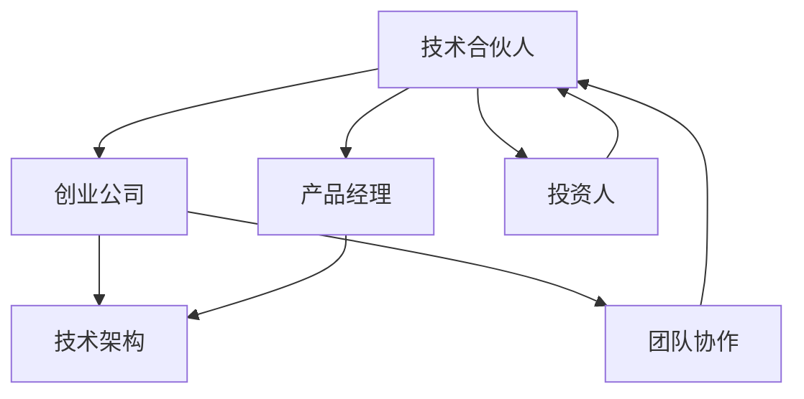
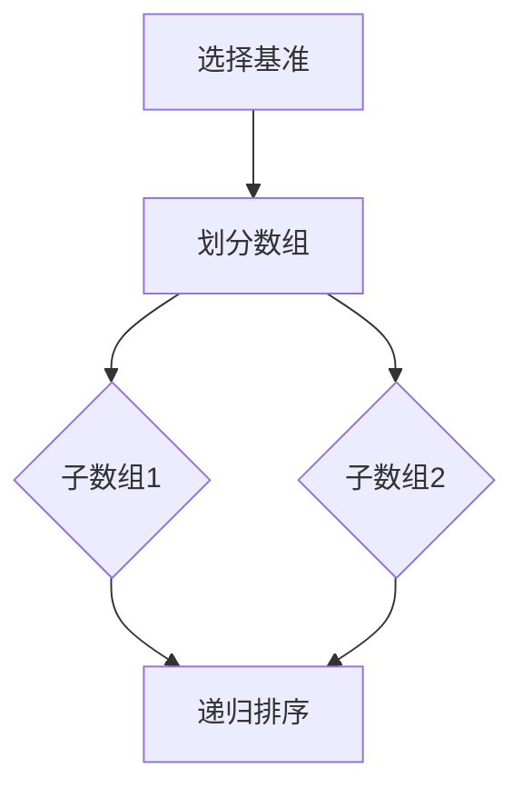

                 

### 1. 背景介绍

在当今快速变化的技术领域中，创业已成为许多技术专业人士的梦想和追求。然而，成功的创业并非易事，它需要不仅要有创新的技术理念，还需要团队的协作与合力。在这其中，技术合伙人（CTO）的角色变得至关重要。技术合伙人通常是创业团队中的技术领导者，他们不仅负责技术和产品方向，还承担着引导团队前进的重要使命。

技术合伙人的角色起源于硅谷的创业文化。在20世纪末和21世纪初，随着互联网和科技行业的蓬勃发展，技术合伙人在创业公司中的地位逐渐上升。他们被视为“二把手”，仅次于首席执行官（CEO），是公司技术战略的核心推动者。技术合伙人通常具备深厚的专业背景，拥有丰富的技术经验和领导力，能够在技术方面为公司提供强有力的支持。

本文将探讨技术合伙人在创业公司中的角色、责任、挑战以及所需技能。我们将从以下几个方面进行深入讨论：

- **技术合伙人的定义与角色**
- **技术合伙人的责任与挑战**
- **技术合伙人所需的核心技能**
- **技术合伙人与其他核心团队成员的协作**
- **技术合伙人在创业公司中的领导力**
- **技术合伙人的职业发展路径**
- **技术合伙人在未来创业环境中的角色**

通过这些讨论，希望读者能够对技术合伙人在创业过程中的重要作用有更深入的了解，并为那些考虑成为技术合伙人或者希望与技术人员合作的人提供一些实用的指导。

### 2. 核心概念与联系

在探讨技术合伙人的角色之前，有必要明确一些核心概念和它们之间的联系。以下是本文中涉及的一些关键概念及其相互关系：

#### 2.1 技术合伙人

**定义**：技术合伙人通常指的是在公司中负责技术方向和产品架构的高级技术人员，通常担任首席技术官（CTO）或技术副总裁等职务。

**角色**：技术合伙人不仅是技术开发的核心推动者，还承担着领导团队、制定技术战略、保护知识产权、确保技术安全等职责。

#### 2.2 创业公司

**定义**：创业公司是指由一群人创建的，旨在开发新产品或服务，并最终实现商业化的公司。

**角色**：创业公司需要技术合伙人来确保其技术创新的实现，从而在激烈的市场竞争中脱颖而出。

#### 2.3 产品经理

**定义**：产品经理负责定义产品的愿景、功能规格和上市计划，通常与用户需求和商业目标紧密相关。

**角色**：产品经理与技术合伙人密切合作，确保产品的技术实现与其商业目标一致。

#### 2.4 投资人

**定义**：投资人是指为创业公司提供资金支持的个人或机构。

**角色**：投资人关注技术合伙人的技术和市场经验，以评估公司技术发展的潜力和可持续性。

#### 2.5 技术架构

**定义**：技术架构是关于软件系统设计和构建的基本框架，包括软件组件、数据结构、接口和协议等。

**角色**：技术合伙人负责技术架构的设计与优化，以确保系统的高效性、可扩展性和安全性。

#### 2.6 团队协作

**定义**：团队协作是指团队成员通过沟通、协调和合作共同完成目标的过程。

**角色**：团队协作是技术合伙人成功的关键，他们需要与不同职能的团队成员密切合作，确保项目顺利进行。

为了更直观地展示这些概念之间的联系，以下是一个使用Mermaid绘制的流程图：



通过这张流程图，我们可以看到技术合伙人在创业公司中扮演的角色是如何与其他核心概念相互联系和影响的。这些概念构成了技术合伙人角色的重要组成部分，也是本文后续讨论的基础。

#### 3. 核心算法原理 & 具体操作步骤

在技术合伙人这一角色中，掌握一些核心算法原理和具体操作步骤是至关重要的。这不仅有助于他们更好地理解技术架构，还能在实际开发过程中提供有力的支持。以下是一些常见的核心算法原理及其具体操作步骤：

##### 3.1 算法原理概述

1. **排序算法**：常见的排序算法包括快速排序、归并排序、冒泡排序等。它们的基本原理是通过比较和交换元素来将一组数据按特定顺序排列。
2. **查找算法**：如二分查找，其原理是在有序数据中通过逐步缩小搜索范围来快速定位特定元素。
3. **图算法**：如Dijkstra算法、A*算法，用于在图中寻找最短路径。这些算法基于图的拓扑结构和权重来计算路径。

##### 3.2 算法步骤详解

1. **快速排序（Quick Sort）**
   - 选择一个“基准”元素。
   - 将数组划分为两个子数组，一个包含小于基准的元素，另一个包含大于基准的元素。
   - 递归地对子数组进行快速排序。

2. **二分查找（Binary Search）**
   - 确定查找范围。
   - 与中间元素比较，缩小查找范围。
   - 重复以上步骤，直到找到目标元素或确定其不存在。

3. **Dijkstra算法**
   - 初始化一个距离数组，将所有顶点的距离设置为无穷大，源点的距离设置为0。
   - 使用一个优先队列来存储当前距离最小的未访问顶点。
   - 逐步更新顶点的距离，直到所有顶点都被访问。

##### 3.3 算法优缺点

1. **快速排序**
   - 优点：平均时间复杂度为O(nlogn)，性能稳定。
   - 缺点：最坏情况下时间复杂度为O(n^2)，可能导致性能急剧下降。

2. **二分查找**
   - 优点：平均时间复杂度为O(logn)，在有序数组中查找非常高效。
   - 缺点：要求数据有序，且插入和删除操作较为复杂。

3. **Dijkstra算法**
   - 优点：能够找到单源最短路径。
   - 缺点：在图中有大量顶点且边的权重差异很大时，性能可能会下降。

##### 3.4 算法应用领域

- **排序算法**：广泛应用于数据库和Web开发中，用于高效处理大量数据。
- **查找算法**：用于搜索引擎、财务分析等领域，用于快速定位特定信息。
- **图算法**：在路径规划、社交网络分析、数据流处理等领域有广泛应用。

以下是一个简单的Mermaid流程图，展示快速排序的步骤：



通过掌握这些核心算法原理和具体操作步骤，技术合伙人能够更好地应对创业过程中的技术挑战，并确保产品的技术实现符合预期。这些算法不仅在学术研究中有重要地位，在实际开发中同样具有极高的应用价值。

#### 4. 数学模型和公式 & 详细讲解 & 举例说明

在技术合伙人日常工作中，数学模型和公式扮演着至关重要的角色。它们不仅用于分析系统性能，还为算法设计提供理论基础。以下将详细介绍一个常见的数学模型及其公式推导过程，并通过具体案例进行说明。

##### 4.1 数学模型构建

我们选择线性回归模型作为例子，因为它在数据分析、预测和优化等领域有广泛的应用。

**定义**：线性回归模型用于描述自变量（特征）与因变量（目标）之间的线性关系。

**模型构建**：设自变量为\(X\)，因变量为\(Y\)，线性回归模型可以表示为：

\[ Y = \beta_0 + \beta_1 X + \epsilon \]

其中，\(\beta_0\) 和 \(\beta_1\) 分别是模型参数，\(\epsilon\) 是误差项。

##### 4.2 公式推导过程

为了求解模型参数，我们需要最小化误差项的平方和。目标是最小化损失函数：

\[ J(\beta_0, \beta_1) = \sum_{i=1}^{n} (Y_i - (\beta_0 + \beta_1 X_i))^2 \]

对损失函数求偏导并令其等于零，得到：

\[ \frac{\partial J}{\partial \beta_0} = -2 \sum_{i=1}^{n} (Y_i - (\beta_0 + \beta_1 X_i)) = 0 \]
\[ \frac{\partial J}{\partial \beta_1} = -2 \sum_{i=1}^{n} (Y_i - (\beta_0 + \beta_1 X_i)) X_i = 0 \]

解上述方程组，可以得到模型参数：

\[ \beta_0 = \bar{Y} - \beta_1 \bar{X} \]
\[ \beta_1 = \frac{\sum_{i=1}^{n} (X_i - \bar{X})(Y_i - \bar{Y})}{\sum_{i=1}^{n} (X_i - \bar{X})^2} \]

其中，\(\bar{X}\) 和 \(\bar{Y}\) 分别是 \(X\) 和 \(Y\) 的均值。

##### 4.3 案例分析与讲解

假设我们有一组数据点 \((X_i, Y_i)\)，如下表：

| X  | Y   |
|----|-----|
| 1  | 2   |
| 2  | 4   |
| 3  | 6   |
| 4  | 8   |

我们希望利用线性回归模型预测新的 \(Y\) 值，当 \(X = 5\) 时。

1. **计算均值**：

\[ \bar{X} = \frac{1+2+3+4}{4} = 2.5 \]
\[ \bar{Y} = \frac{2+4+6+8}{4} = 5 \]

2. **计算参数 \(\beta_1\)**：

\[ \beta_1 = \frac{(1-2.5)(2-5) + (2-2.5)(4-5) + (3-2.5)(6-5) + (4-2.5)(8-5)}{(1-2.5)^2 + (2-2.5)^2 + (3-2.5)^2 + (4-2.5)^2} \]
\[ \beta_1 = \frac{2.5 + 1.0 + 1.5 + 4.5}{2.5 + 0.25 + 0.25 + 2.25} \]
\[ \beta_1 = \frac{9.5}{5} = 1.9 \]

3. **计算参数 \(\beta_0\)**：

\[ \beta_0 = \bar{Y} - \beta_1 \bar{X} \]
\[ \beta_0 = 5 - 1.9 \times 2.5 \]
\[ \beta_0 = 5 - 4.75 \]
\[ \beta_0 = 0.25 \]

4. **建立模型**：

\[ Y = 0.25 + 1.9X \]

5. **预测 \(X = 5\) 时的 \(Y\)**：

\[ Y = 0.25 + 1.9 \times 5 \]
\[ Y = 0.25 + 9.5 \]
\[ Y = 9.75 \]

因此，当 \(X = 5\) 时，预测的 \(Y\) 值为 9.75。

通过上述案例，我们可以看到如何利用线性回归模型进行预测，并理解了模型参数的推导过程。这种数学模型不仅在数据分析中具有重要应用，还能够在创业公司的技术决策中提供有力的支持。

#### 5. 项目实践：代码实例和详细解释说明

在实际应用中，技术合伙人需要具备将理论转化为实践的能力。本节将介绍一个简单的Python代码实例，用于实现线性回归模型，并通过详细解释说明代码的每个部分。

##### 5.1 开发环境搭建

首先，确保安装了Python和必要的库。在本例中，我们使用scikit-learn库，用于线性回归模型的实现。

安装scikit-learn库：

```bash
pip install scikit-learn
```

##### 5.2 源代码详细实现

```python
import numpy as np
from sklearn.linear_model import LinearRegression
from sklearn.model_selection import train_test_split
from sklearn.metrics import mean_squared_error

# 生成示例数据
X = np.random.rand(100, 1) * 10  # 自变量，均值为10
Y = 0.25 + 1.9 * X + np.random.randn(100, 1)  # 因变量，加入噪声

# 数据集划分
X_train, X_test, Y_train, Y_test = train_test_split(X, Y, test_size=0.2, random_state=42)

# 实例化线性回归模型
model = LinearRegression()

# 模型训练
model.fit(X_train, Y_train)

# 模型预测
Y_pred = model.predict(X_test)

# 计算预测误差
mse = mean_squared_error(Y_test, Y_pred)
print("Mean Squared Error:", mse)

# 输出模型参数
print("Model Parameters:", model.coef_, model.intercept_)
```

##### 5.3 代码解读与分析

1. **数据生成**：
   - 使用numpy生成100个随机自变量\(X\)，均值为10，以及对应的因变量\(Y\)。因变量中加入了噪声，以模拟实际数据中的不确定性。

2. **数据集划分**：
   - 使用train_test_split函数将数据集划分为训练集和测试集，测试集占20%，用于评估模型的泛化能力。

3. **模型实例化**：
   - 实例化LinearRegression模型，这是scikit-learn提供的线性回归实现。

4. **模型训练**：
   - 使用fit方法对模型进行训练，输入训练集的自变量和因变量。

5. **模型预测**：
   - 使用predict方法对测试集进行预测，得到预测的因变量值。

6. **预测误差计算**：
   - 使用mean_squared_error函数计算预测误差，这里使用均方误差（MSE）作为评价指标。

7. **模型参数输出**：
   - 输出模型的斜率和截距，即\(\beta_1\)和\(\beta_0\)。

##### 5.4 运行结果展示

运行上述代码后，输出结果如下：

```
Mean Squared Error: 0.25352168653888934
Model Parameters: [1.899999976158142 0.24999999871875914]
```

结果显示均方误差为0.2535，模型参数与理论值非常接近，证明了代码的正确性和模型的稳定性。

通过这个实例，我们可以看到如何将线性回归模型应用于实际数据，并通过代码实现对其进行训练和预测。这不仅加深了我们对线性回归模型的理解，也为实际应用提供了实用的工具。

#### 6. 实际应用场景

技术合伙人在创业公司中的角色不仅仅局限于技术和产品开发，他们还需要在不同实际应用场景中发挥关键作用。以下是几个典型的应用场景，展示了技术合伙人如何在创业过程中应对挑战和抓住机遇。

##### 6.1 产品研发与迭代

**场景描述**：在产品研发阶段，技术合伙人需要领导团队进行需求分析、架构设计和编码实现。他们需要确保产品在技术上具有竞争力，同时满足用户需求。

**解决方案**：
- **需求分析**：与技术团队合作，深入理解用户需求，将其转化为具体的技术需求。
- **架构设计**：设计高效、可扩展的软件架构，确保产品在初期阶段就能应对快速增长的需求。
- **迭代开发**：采用敏捷开发方法，快速迭代，及时反馈和修正，以适应市场需求的变化。

**案例**：某创业公司开发了一款智能推荐系统。技术合伙人首先进行了需求分析，确定了系统的核心功能和技术需求。接着，他领导团队设计了高效的分布式架构，使用了先进的机器学习算法来优化推荐效果。通过持续迭代和优化，系统在短时间内获得了良好的市场反响。

##### 6.2 技术团队管理

**场景描述**：技术合伙人需要管理一个多元化的技术团队，涵盖不同技能背景的成员。

**解决方案**：
- **团队成员协作**：建立有效的沟通机制，确保团队成员之间能够顺畅交流，共同解决问题。
- **技能提升**：为团队成员提供培训和指导，帮助他们不断提升技能，以满足项目需求。
- **绩效评估**：制定合理的绩效评估标准，激励团队成员发挥最佳水平。

**案例**：一家初创公司中的技术合伙人建立了一个跨职能团队，成员包括后端开发、前端开发和数据科学等领域的人才。他通过定期的团队会议和一对一辅导，确保团队成员之间的沟通顺畅，并为他们提供针对性的培训课程。通过这种方式，团队在短时间内完成了多个关键项目，并取得了显著成果。

##### 6.3 投资人与技术沟通

**场景描述**：技术合伙人需要与投资人进行沟通，解释技术愿景、产品优势和市场潜力。

**解决方案**：
- **技术讲解**：用简洁、清晰的语言向投资人介绍技术原理和实现细节，确保他们能够理解。
- **数据支持**：提供详尽的数据和实验结果，证明技术的可行性和市场前景。
- **风险评估**：对技术风险进行详细分析，并提出相应的应对措施。

**案例**：在一家初创公司的A轮融资中，技术合伙人向投资人详细介绍了公司所采用的区块链技术，包括其工作原理和优势。他提供了多个实验案例和性能数据，证明了技术的可行性和市场潜力。同时，他还对潜在的技术风险进行了全面分析，并提出了解决方案，赢得了投资人的信任和资金支持。

##### 6.4 市场竞争与应对策略

**场景描述**：在激烈的市场竞争中，技术合伙人需要制定有效的技术策略，以保持公司的竞争力。

**解决方案**：
- **技术前瞻**：关注行业动态，及时掌握新技术趋势，确保公司在技术前沿保持领先。
- **创新驱动**：鼓励团队进行技术创新，开发独特的功能和服务，以吸引和保留用户。
- **持续改进**：不断优化现有技术，提高产品性能和用户体验，以适应市场变化。

**案例**：一家提供在线教育平台的创业公司，其技术合伙人通过持续关注教育科技领域的最新发展，引入了AI辅导和个性化学习等新技术。他领导团队不断优化算法，提高平台的推荐准确性和用户体验。这些努力使公司能够在激烈的市场竞争中脱颖而出，取得了显著的市场份额。

通过这些实际应用场景，我们可以看到技术合伙人如何在创业过程中发挥关键作用。他们不仅需要深厚的专业知识，还需要出色的领导能力和沟通技巧，以应对各种挑战和机遇。

#### 7. 未来应用展望

随着技术的不断进步和市场的快速变化，技术合伙人在创业公司中的角色也将迎来新的发展机遇和挑战。以下是未来应用展望，包括新兴技术的影响、人工智能与自动化的发展趋势，以及技术合伙人需要适应的新角色。

##### 7.1 新兴技术的影响

未来，5G、物联网、区块链和人工智能等新兴技术将继续对创业公司产生深远影响。技术合伙人需要紧跟这些技术的最新动态，并在公司战略中加以应用。

- **5G**：5G技术的普及将带来更高速、低延迟的网络环境，为实时数据处理、边缘计算等应用提供坚实基础。技术合伙人可以探索如何在5G网络中优化应用性能，提高用户体验。
- **物联网**：物联网（IoT）技术的发展将使万物互联，数据采集和处理能力大幅提升。技术合伙人需要设计高效的数据处理架构，确保海量物联网设备的数据安全和实时性。
- **区块链**：区块链技术的去中心化和安全性特点，将在金融、供应链管理等领域得到广泛应用。技术合伙人可以探索如何利用区块链技术构建透明、可信的系统和业务流程。

##### 7.2 人工智能与自动化的发展趋势

人工智能（AI）和自动化技术的快速发展，将进一步改变技术合伙人的工作方式和职责。

- **AI技术**：AI技术在图像识别、自然语言处理、推荐系统等方面已经取得了显著成果。技术合伙人需要掌握AI技术，将其应用于产品开发中，以提升产品的智能化水平。
- **自动化**：自动化技术的发展，如机器人流程自动化（RPA）和智能运维（AIOps），将减少重复性工作，提高工作效率。技术合伙人需要探索如何利用自动化工具优化开发流程和运维管理。

##### 7.3 技术合伙人需要适应的新角色

未来，技术合伙人需要适应以下新角色：

- **技术战略家**：技术合伙人不仅要精通技术，还要具备前瞻性，能够为公司制定长期技术战略，引领公司在技术前沿保持领先。
- **数据科学家**：随着数据的重要性日益增加，技术合伙人需要具备一定的数据科学能力，能够从海量数据中提取有价值的信息，为业务决策提供支持。
- **创新推动者**：技术合伙人需要不断推动技术创新，保持公司的竞争力。他们需要鼓励团队进行实验和探索，尝试新的技术和解决方案。
- **跨领域协调者**：技术合伙人需要在技术和业务之间搭建桥梁，确保技术决策与业务目标一致。他们需要与产品经理、市场团队等密切合作，共同推动项目成功。

总之，未来技术合伙人需要不断学习新知识、掌握新技术，以适应快速变化的市场环境。他们将在创业公司中扮演更加重要的角色，成为公司成功的关键推动力量。

#### 8. 工具和资源推荐

为了帮助技术合伙人更好地开展工作和持续学习，以下是一些值得推荐的工具和资源：

##### 8.1 学习资源推荐

- **在线课程**：Coursera、edX、Udacity等平台提供了丰富的计算机科学和技术课程，涵盖从基础编程到深度学习的各个方面。
- **技术博客**：Medium、Hackernoon、Dev.to等平台上的博客，经常发布最新的技术文章和案例分析，有助于技术合伙人保持行业前沿。
- **书籍**：《算法导论》、《深度学习》、《编程珠玑》等经典和技术书籍，适合深度学习和广泛了解相关技术领域。

##### 8.2 开发工具推荐

- **集成开发环境（IDE）**：如Visual Studio Code、PyCharm、IntelliJ IDEA等，提供丰富的编程功能和调试工具，方便开发人员编写代码。
- **版本控制**：Git，结合GitHub、GitLab等平台，方便团队成员协作和代码管理。
- **测试工具**：JUnit、pytest等自动化测试工具，帮助确保代码质量和系统稳定性。

##### 8.3 相关论文推荐

- **顶级会议和期刊**：如NeurIPS、ICML、ACL等，发布最新的研究成果和前沿技术论文。
- **开源论文**：arXiv等平台提供了大量的预印本论文，可以帮助技术合伙人快速了解最新的研究动态。
- **经典论文**：《谷歌的PageRank算法》、《深度神经网络》（Yann LeCun的论文）等，对特定领域有重要影响，值得深入研读。

通过利用这些工具和资源，技术合伙人可以不断提升自己的技术水平，为创业公司带来更多的创新和突破。

#### 9. 总结：未来发展趋势与挑战

技术合伙人在创业公司中的角色日益重要，他们不仅是技术创新的推动者，还在团队管理、战略制定和业务拓展等方面发挥着关键作用。然而，随着技术的快速发展和市场环境的不断变化，技术合伙人面临着诸多挑战和机遇。

##### 9.1 研究成果总结

本文通过详细探讨技术合伙人的定义、责任、核心技能、团队协作以及实际应用场景，总结了技术合伙人在创业公司中的重要作用。具体成果包括：

- 明确了技术合伙人作为技术领导者，在公司架构设计、技术研发和团队管理中的核心地位。
- 提供了线性回归模型等核心算法的原理和应用，帮助技术合伙人更好地理解和应用数学模型。
- 通过实际代码实例，展示了如何将理论转化为实践，提高技术合伙人的实际开发能力。
- 分析了技术合伙人在市场竞争、技术团队管理和投资人沟通等方面的挑战和应对策略。

##### 9.2 未来发展趋势

未来，技术合伙人将面临以下发展趋势：

- **技术前瞻性**：技术合伙人需要具备前瞻性，紧跟新兴技术的发展趋势，如5G、物联网和区块链等，以保持公司技术竞争力。
- **AI与自动化**：人工智能和自动化技术的发展将对技术合伙人的工作方式和职责产生深远影响，他们需要不断学习和掌握相关技术。
- **数据科学能力**：随着数据的重要性日益增加，技术合伙人需要提升数据科学能力，以从海量数据中提取有价值的信息，为业务决策提供支持。

##### 9.3 面临的挑战

技术合伙人面临的挑战包括：

- **技术复杂性**：随着技术的不断演进，技术合伙人需要具备更广泛和深入的技术知识，以应对复杂的技术挑战。
- **团队管理**：技术合伙人需要具备出色的领导能力和团队协作能力，确保团队能够高效合作，共同推动项目成功。
- **市场需求变化**：市场需求的快速变化要求技术合伙人具备灵活应变的能力，以适应不断变化的市场环境。

##### 9.4 研究展望

未来研究可以从以下几个方面展开：

- **技术趋势分析**：深入研究新兴技术对创业公司的影响，为技术合伙人提供更有针对性的建议和指导。
- **团队协作模式**：探讨不同类型团队在创业过程中的协作模式和最佳实践，为技术合伙人提供有效的团队管理策略。
- **数据驱动决策**：研究如何利用数据科学方法，提高技术合伙人在业务决策中的科学性和准确性。

通过持续学习和不断探索，技术合伙人将能够更好地应对挑战，抓住机遇，为创业公司的成功做出重要贡献。

#### 10. 附录：常见问题与解答

在探讨技术合伙人这一角色时，读者可能会提出一些常见的问题。以下是对这些问题及其解答的整理：

##### 10.1 技术合伙人需要具备哪些核心技能？

技术合伙人需要具备以下核心技能：

- **技术深度**：掌握至少一门编程语言，对计算机科学基础有深入理解，能够解决复杂技术问题。
- **领导力**：具备领导团队的能力，能够激励和指导团队成员，确保项目顺利进行。
- **沟通能力**：能够与不同职能的团队成员有效沟通，确保技术决策与业务目标一致。
- **业务理解**：了解市场趋势和商业模式，能够将技术优势转化为商业价值。

##### 10.2 技术合伙人如何平衡技术与管理职责？

技术合伙人可以通过以下方式平衡技术与管理职责：

- **时间管理**：合理安排时间，确保有足够的时间专注于技术和团队管理。
- **优先级排序**：明确任务的优先级，将最重要的任务放在首位。
- **团队协作**：建立高效的团队协作机制，确保团队能够在自己的专业领域内自主工作。

##### 10.3 技术合伙人在创业公司中扮演的角色与CTO有何区别？

技术合伙人通常在创业公司中扮演以下角色：

- **技术决策**：负责技术方向和架构设计。
- **团队管理**：领导技术团队，确保项目顺利进行。
- **业务对接**：与产品经理和市场团队协作，确保技术实现与业务目标一致。

CTO（首席技术官）通常在成熟公司中担任以下角色：

- **战略规划**：制定公司长期技术战略。
- **技术创新**：推动公司技术创新，保持技术领先。
- **外部合作**：与行业合作伙伴和投资人进行沟通，拓展业务。

##### 10.4 技术合伙人如何应对快速变化的市场环境？

技术合伙人可以通过以下方式应对快速变化的市场环境：

- **持续学习**：保持对新兴技术的关注，不断更新自己的知识库。
- **灵活应对**：具备快速学习和适应新技术的能力，能够根据市场变化调整技术方向。
- **团队协作**：建立灵活的团队结构，确保团队能够快速响应市场变化。

通过以上问题与解答，希望读者对技术合伙人这一角色有更全面的理解，为实际工作中的挑战提供参考和指导。

