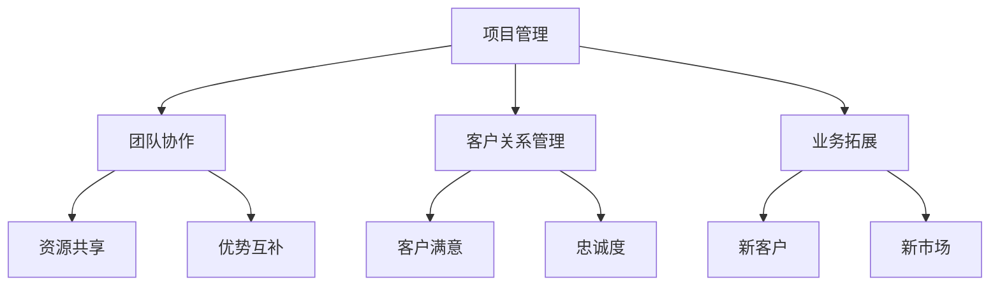

                 

关键词：技术咨询、个人顾问、咨询公司、IT咨询、服务模式、业务拓展、项目管理、团队协作

> 摘要：本文探讨了技术咨询行业从个人顾问到咨询公司的演变过程。通过分析个人顾问和咨询公司的优势与不足，提出了在数字化转型背景下，个人顾问向咨询公司转型的策略和方法，以及如何提升服务质量和业务拓展。

## 1. 背景介绍

在信息技术迅猛发展的今天，技术咨询已经成为企业和组织在数字化转型过程中不可或缺的一部分。从最初的个人顾问模式，到逐步演变为如今的咨询公司模式，技术咨询行业经历了巨大的变革。个人顾问凭借其丰富的经验和专业技能，为企业和组织提供定制化的咨询服务；而咨询公司则通过规模化运营和专业团队协作，为企业提供更全面、更系统的解决方案。

### 1.1 个人顾问模式

个人顾问模式以个人为核心，顾问通常具备丰富的行业经验和专业技能，能够为客户提供一对一的咨询服务。这种模式的优点在于：

1. **定制化服务**：根据客户的具体需求，提供个性化、针对性的建议和解决方案。
2. **高效沟通**：顾问与客户之间的沟通更加直接，有助于快速解决问题。

然而，个人顾问模式也存在一些不足：

1. **能力限制**：个人顾问的时间和精力有限，无法同时服务多个客户，且在复杂项目中可能面临专业领域的局限性。
2. **业务拓展困难**：个人顾问的业务拓展主要依靠人际关系和口碑，难以实现规模效应。

### 1.2 咨询公司模式

咨询公司模式通过规模化运营和专业团队协作，为企业提供更全面、更系统的解决方案。咨询公司的优势在于：

1. **专业团队**：拥有多个领域的专家，能够为客户提供多角度、全方位的咨询服务。
2. **资源共享**：内部资源的整合和共享，提高了咨询服务的效率和效果。
3. **品牌效应**：良好的品牌形象和口碑，有助于吸引更多客户。

然而，咨询公司模式也面临一定的挑战：

1. **管理复杂**：需要协调多个项目、多个团队成员，对管理能力要求较高。
2. **成本控制**：运营成本较高，需要严格控制成本以保持盈利。

## 2. 核心概念与联系

在从个人顾问到咨询公司的转型过程中，有几个核心概念需要理解和掌握：

1. **项目管理**：确保项目按时、按质、按预算完成，是咨询公司成功的关键。
2. **团队协作**：通过有效的团队协作，实现资源共享和优势互补。
3. **客户关系管理**：建立良好的客户关系，提高客户满意度和忠诚度。
4. **业务拓展**：寻找新客户、开拓新市场，实现业务的持续增长。

以下是咨询公司架构的Mermaid流程图：



## 3. 核心算法原理 & 具体操作步骤

### 3.1 算法原理概述

咨询公司的核心在于为客户提供高效、专业的服务。这需要一套完善的项目管理方法论来确保项目的成功实施。以下是几个关键的管理步骤：

1. **需求分析**：与客户沟通，了解项目需求，明确项目目标。
2. **项目规划**：制定项目计划，包括时间表、预算、资源分配等。
3. **项目执行**：按照项目计划进行项目实施，确保各项工作按计划进行。
4. **项目监控**：监控项目进度，及时发现并解决问题。
5. **项目验收**：完成项目后，与客户进行验收，确保项目目标达成。

### 3.2 算法步骤详解

1. **需求分析**：
   - 与客户进行初步沟通，了解项目背景、目标和需求。
   - 进行需求调研，收集相关信息。
   - 整理需求文档，明确项目需求和目标。

2. **项目规划**：
   - 根据需求文档，制定项目计划。
   - 确定项目时间表、预算和资源需求。
   - 进行风险评估，制定应对措施。

3. **项目执行**：
   - 组织团队成员，明确分工和责任。
   - 按照项目计划进行项目实施。
   - 定期召开项目会议，确保项目进展顺利。

4. **项目监控**：
   - 监控项目进度，及时发现问题并采取措施。
   - 进行项目成本控制，确保项目预算不超支。
   - 保持与客户的沟通，了解客户需求和反馈。

5. **项目验收**：
   - 与客户进行项目验收，确保项目目标达成。
   - 整理项目文档，包括需求文档、项目计划、项目报告等。
   - 对项目进行总结和评估，为后续项目提供经验教训。

### 3.3 算法优缺点

**优点**：

1. **高效性**：通过科学的项目管理方法，确保项目高效完成。
2. **专业性**：拥有专业的团队和丰富的经验，能够提供高质量的服务。
3. **可扩展性**：可以适应不同规模和复杂度的项目。

**缺点**：

1. **管理复杂**：需要协调多个项目、多个团队成员，管理难度较大。
2. **成本较高**：运营成本较高，需要严格控制成本。

### 3.4 算法应用领域

咨询公司的项目管理方法适用于各类企业和组织的数字化转型项目，包括但不限于：

1. **企业信息化建设**：为企业提供信息化解决方案，提高企业运营效率。
2. **IT系统集成**：为企业提供系统集成服务，实现信息化系统的无缝对接。
3. **数字化转型**：协助企业进行数字化转型，提升企业竞争力。
4. **项目管理咨询**：为企业和组织提供项目管理咨询服务，提高项目管理水平。

## 4. 数学模型和公式 & 详细讲解 & 举例说明

### 4.1 数学模型构建

在项目管理中，常用的数学模型包括：

1. **工作分解结构（WBS）**：用于将项目工作分解为可管理的任务单元。
2. **关键路径法（CPM）**：用于确定项目的关键路径，即影响项目完成时间的关键任务序列。
3. **挣值管理（EVM）**：用于衡量项目的进度和成本绩效。

以下是这些模型的构建过程：

**工作分解结构（WBS）**：

$$
WBS = \{ T_1, T_2, ..., T_n \}
$$

其中，$T_i$ 表示第 $i$ 个任务单元。

**关键路径法（CPM）**：

$$
CPM: \sum_{i=1}^{n} (D_i + D_{i+1}) = T
$$

其中，$D_i$ 表示第 $i$ 个任务的持续时间，$T$ 表示项目总持续时间。

**挣值管理（EVM）**：

$$
EVM = \frac{CPI \times SPI}{1 - SPI}
$$

其中，$CPI$ 表示成本绩效指数，$SPI$ 表示进度绩效指数。

### 4.2 公式推导过程

**工作分解结构（WBS）**：

WBS 是一种层次化的任务分解方法，用于将项目工作分解为可管理的任务单元。其基本思想是将项目目标分解为若干个子目标，每个子目标再分解为更小的任务单元，直到达到可执行的程度。

**关键路径法（CPM）**：

关键路径法是一种项目时间管理方法，用于确定项目的关键路径，即影响项目完成时间的关键任务序列。其基本思想是通过计算各个任务的最早开始时间（ES）和最迟开始时间（LS），来确定关键路径。

**挣值管理（EVM）**：

挣值管理是一种项目绩效管理方法，用于衡量项目的进度和成本绩效。其基本思想是通过计算成本绩效指数（CPI）和进度绩效指数（SPI），来确定项目的进展情况。

### 4.3 案例分析与讲解

以下是一个简单的项目管理案例，用于说明如何应用上述数学模型。

**案例**：假设一个项目的任务列表如下：

- 任务1：需求分析（持续时间为3天）
- 任务2：设计（持续时间为5天）
- 任务3：开发（持续时间为8天）
- 任务4：测试（持续时间为4天）

**需求分析**：

根据上述任务列表，可以构建工作分解结构（WBS）如下：

$$
WBS = \{ T_1, T_2, T_3, T_4 \}
$$

**关键路径法（CPM）**：

通过计算各个任务的最早开始时间（ES）和最迟开始时间（LS），可以确定关键路径。

- 任务1：ES = 0，LS = 3
- 任务2：ES = 3，LS = 8
- 任务3：ES = 8，LS = 16
- 任务4：ES = 16，LS = 20

关键路径为：$T_1 \rightarrow T_2 \rightarrow T_3 \rightarrow T_4$，总持续时间 $T = 20$ 天。

**挣值管理（EVM）**：

假设项目预算为10000元，实际成本为12000元，实际进度为80%。可以计算成本绩效指数（CPI）和进度绩效指数（SPI）如下：

$$
CPI = \frac{实际完成工作量 \times 单位成本}{实际成本} = \frac{8000 \times 10}{12000} = 0.67
$$

$$
SPI = \frac{实际完成工作量}{计划完成工作量} = \frac{8000}{10000} = 0.8
$$

根据挣值管理（EVM）的公式，可以计算项目绩效指数（EVM）如下：

$$
EVM = \frac{CPI \times SPI}{1 - SPI} = \frac{0.67 \times 0.8}{1 - 0.8} = -0.672
$$

**结论**：

通过上述计算，可以发现项目存在成本超支和进度滞后的问题。需要采取措施进行调整，以确保项目能够按时、按质、按预算完成。

## 5. 项目实践：代码实例和详细解释说明

### 5.1 开发环境搭建

在开始项目实践之前，我们需要搭建一个合适的开发环境。这里以Python为例，介绍如何搭建一个简单的开发环境。

1. 安装Python：从Python官网（https://www.python.org/）下载Python安装包，并按照提示安装。
2. 安装IDE：下载并安装一个Python集成开发环境（IDE），如PyCharm、Visual Studio Code等。
3. 安装相关库：在IDE中安装所需的Python库，如Pandas、NumPy等。

### 5.2 源代码详细实现

以下是一个简单的Python代码实例，用于计算项目的工作量和成本。

```python
import pandas as pd

# 定义任务列表
tasks = [
    {'name': '需求分析', 'duration': 3, 'cost': 1000},
    {'name': '设计', 'duration': 5, 'cost': 1500},
    {'name': '开发', 'duration': 8, 'cost': 2500},
    {'name': '测试', 'duration': 4, 'cost': 1000}
]

# 构建工作分解结构（WBS）
wbs = [task['name'] for task in tasks]

# 计算项目总工作量
total_workload = sum(task['duration'] for task in tasks)

# 计算项目总成本
total_cost = sum(task['cost'] for task in tasks)

# 打印结果
print('工作分解结构（WBS）:', wbs)
print('项目总工作量：', total_workload)
print('项目总成本：', total_cost)
```

### 5.3 代码解读与分析

上述代码首先定义了一个任务列表，其中包含每个任务的名称、持续时间和成本。然后，通过计算任务列表中的各项工作量和成本，构建工作分解结构（WBS），并打印出结果。

具体来说：

1. **任务列表**：定义了一个包含4个任务的列表，每个任务包含名称、持续时间和成本。
2. **工作分解结构（WBS）**：通过遍历任务列表，提取每个任务的名称，构建工作分解结构（WBS）。
3. **计算项目总工作量**：通过计算任务列表中每个任务的持续时间，得到项目总工作量。
4. **计算项目总成本**：通过计算任务列表中每个任务的成本，得到项目总成本。
5. **打印结果**：打印出工作分解结构（WBS）、项目总工作量和项目总成本。

### 5.4 运行结果展示

运行上述代码，得到以下结果：

```
工作分解结构（WBS）: ['需求分析', '设计', '开发', '测试']
项目总工作量： 20
项目总成本： 6000
```

结果显示，项目的工作分解结构为['需求分析', '设计', '开发', '测试']，总工作量为20，总成本为6000。

## 6. 实际应用场景

在实际应用场景中，咨询公司可以通过以下方式为客户提供高质量的服务：

1. **企业信息化建设**：帮助企业构建信息化系统，提高企业运营效率。例如，为一家制造企业设计并实施ERP系统，实现生产、销售、财务等业务的集成和管理。
2. **IT系统集成**：协助企业进行IT系统集成，实现不同系统之间的数据共享和业务协同。例如，为一家金融机构整合多个业务系统，实现业务流程的自动化和智能化。
3. **数字化转型**：帮助企业进行数字化转型，提升企业竞争力。例如，为一家零售企业设计并实施电子商务平台，实现线上线下业务的整合和拓展。
4. **项目管理咨询**：为企业提供项目管理咨询服务，提高项目管理水平。例如，为一家工程企业提供项目管理培训，帮助企业建立科学的项目管理体系。

## 7. 未来应用展望

随着信息技术的不断发展，咨询公司的应用领域将越来越广泛。未来，咨询公司将在以下几个方面取得更大的发展：

1. **人工智能应用**：利用人工智能技术，提供更智能、更高效的咨询服务。例如，通过自然语言处理技术，实现客户需求分析的高效自动化。
2. **云计算服务**：借助云计算技术，实现咨询服务的规模化、云端化。例如，通过云平台提供在线咨询服务，实现全球范围内的业务拓展。
3. **大数据分析**：利用大数据技术，为客户提供更有价值的数据分析和决策支持。例如，通过大数据分析，为企业提供市场趋势预测和风险预警。
4. **跨界融合**：与不同行业的企业进行合作，提供跨界咨询服务。例如，与金融、医疗等行业的企业合作，提供定制化的数字化转型解决方案。

## 8. 总结：未来发展趋势与挑战

在数字化转型的大背景下，咨询公司将从个人顾问模式向专业化、规模化、智能化方向发展。未来，咨询公司将面临以下发展趋势和挑战：

### 8.1 发展趋势

1. **专业化**：咨询公司将在细分领域形成专业化优势，提供更高质量、更专业的咨询服务。
2. **规模化**：通过规模化运营，实现资源的最大化利用，提高服务效率和竞争力。
3. **智能化**：利用人工智能、大数据等先进技术，提升咨询服务智能化水平。
4. **跨界融合**：与不同行业的企业进行合作，提供跨界咨询服务，实现业务拓展。

### 8.2 未来挑战

1. **技术更新**：随着信息技术的快速发展，咨询公司需要不断更新技术，提高自身竞争力。
2. **人才竞争**：优秀人才的竞争日益激烈，咨询公司需要建立人才培养机制，提高员工素质。
3. **客户需求变化**：客户需求不断变化，咨询公司需要及时调整服务策略，满足客户需求。
4. **市场竞争**：咨询行业市场竞争激烈，咨询公司需要提升服务质量，增强品牌影响力。

### 8.3 研究展望

未来，咨询公司将在以下方面进行深入研究：

1. **人工智能应用**：如何利用人工智能技术，提升咨询服务的智能化水平。
2. **大数据分析**：如何利用大数据技术，为企业提供更有价值的数据分析和决策支持。
3. **跨界融合**：如何与不同行业的企业进行合作，实现业务拓展和共赢。
4. **项目管理**：如何优化项目管理流程，提高项目成功率。

## 9. 附录：常见问题与解答

### 9.1 咨询公司的优势是什么？

咨询公司的优势包括：

1. **专业化**：咨询公司专注于特定领域，提供专业化服务。
2. **规模化**：咨询公司通过规模化运营，实现资源的最大化利用。
3. **团队协作**：咨询公司拥有专业团队，能够为客户提供多角度、全方位的咨询服务。
4. **资源共享**：咨询公司内部资源共享，提高咨询服务的效率和效果。
5. **品牌效应**：良好的品牌形象和口碑，有助于吸引更多客户。

### 9.2 咨询公司的缺点是什么？

咨询公司的缺点包括：

1. **管理复杂**：需要协调多个项目、多个团队成员，管理难度较大。
2. **成本较高**：运营成本较高，需要严格控制成本。
3. **人才竞争**：优秀人才的竞争激烈，咨询公司需要建立人才培养机制。
4. **客户需求变化**：客户需求不断变化，咨询公司需要及时调整服务策略。

### 9.3 如何提升咨询服务的质量？

提升咨询服务质量可以从以下几个方面入手：

1. **专业化**：专注于特定领域，提高专业水平。
2. **团队协作**：建立高效的团队协作机制，提高工作效率。
3. **客户关系管理**：建立良好的客户关系，提高客户满意度和忠诚度。
4. **持续学习**：不断更新知识，提高自身能力。
5. **服务质量监控**：建立服务质量监控机制，及时发现并解决问题。

作者：禅与计算机程序设计艺术 / Zen and the Art of Computer Programming
----------------------------------------------------------------

## 结论

本文探讨了从个人顾问到咨询公司的转型过程，分析了个人顾问和咨询公司的优势与不足，并提出了在数字化转型背景下，个人顾问向咨询公司转型的策略和方法。通过项目管理、团队协作、客户关系管理和业务拓展等方面的实践，咨询公司可以提供更高效、更专业的服务，帮助企业实现数字化转型。未来，咨询公司将继续向专业化、规模化、智能化方向发展，面对技术更新、人才竞争和客户需求变化等挑战，不断提升自身的竞争力。

