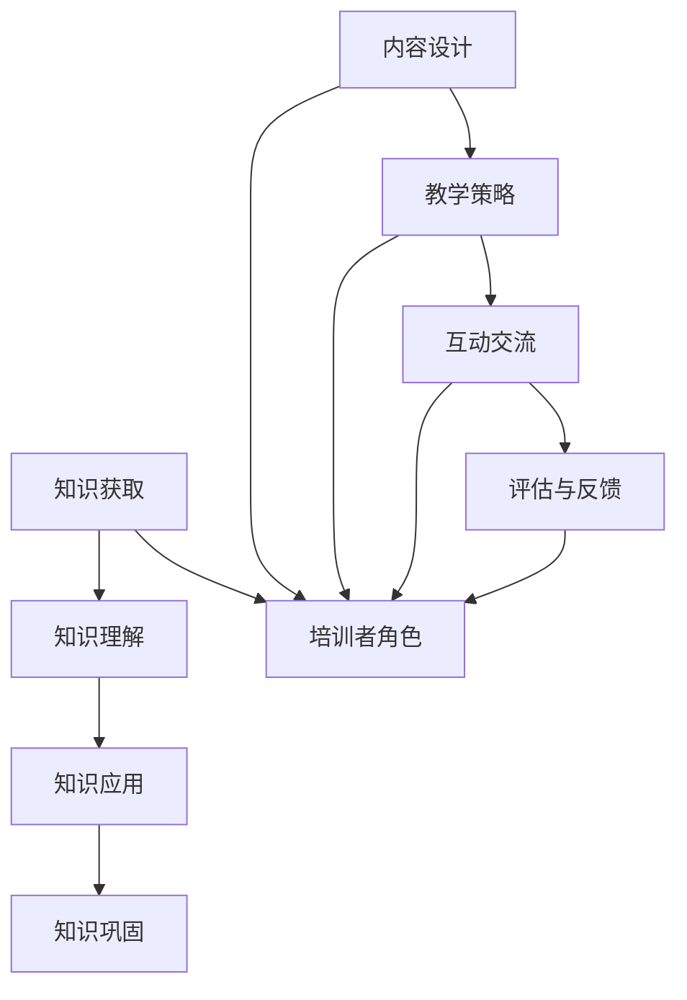

                 

关键词：技术培训、培训者、受训者、教学设计、教育技术、学习效果

> 摘要：本文将探讨如何从一名技术受训者成功转型为一名合格的培训者。通过分析学习过程中的关键要素，提供实用的培训技巧，以及讨论如何应对培训过程中的挑战，旨在帮助读者掌握教学艺术，提高培训效果。

## 1. 背景介绍

在信息技术迅速发展的今天，技术培训已经成为了职场人士不断提升自我竞争力的重要手段。从受训者到培训者的角色转变，不仅需要扎实的专业知识，还需要具备良好的教学能力。然而，如何从一名技术受训者转变为一名优秀的培训者，仍然是一个值得探讨的问题。

本文将首先回顾技术受训者的学习过程，分析学习的关键要素，然后讨论如何将这些要素应用于培训过程中。接下来，我们将介绍一些实用的培训技巧，并提供一些应对培训挑战的建议。最后，本文将展望技术培训的未来发展趋势，以及培训者需要面对的挑战和机遇。

## 2. 核心概念与联系

### 2.1 学习过程的要素

学习过程是一个复杂的过程，涉及多个要素。以下是学习过程中的几个关键要素：

1. **知识获取**：这是学习的起点，通过阅读、听讲、实践等方式获取新的知识。
2. **知识理解**：将获取的知识内化，理解其核心概念和原理。
3. **知识应用**：在实际场景中应用所学知识，解决实际问题。
4. **知识巩固**：通过反复练习和复习，使知识牢固地存储在大脑中。

### 2.2 培训过程中的要素

培训过程与学习过程有相似之处，但也存在一些区别。以下是培训过程中的关键要素：

1. **内容设计**：根据受训者的需求和知识背景，设计合适的培训内容。
2. **教学策略**：采用多种教学手段，提高受训者的学习兴趣和参与度。
3. **互动交流**：鼓励受训者参与讨论，提高他们的思维能力和解决问题的能力。
4. **评估与反馈**：通过评估和反馈，了解受训者的学习效果，及时调整培训策略。

### 2.3 Mermaid 流程图

下面是一个简单的 Mermaid 流程图，展示了学习过程和培训过程中的关键要素及其相互关系。



## 3. 核心算法原理 & 具体操作步骤

### 3.1 算法原理概述

培训过程可以看作是一个算法，其核心目标是让受训者掌握所需的知识和技能。这个算法的基本原理包括：

1. **需求分析**：了解受训者的需求和知识背景。
2. **内容设计**：根据需求分析结果，设计合适的培训内容。
3. **教学实施**：采用多种教学手段，实施培训。
4. **评估反馈**：评估培训效果，收集反馈，调整培训策略。

### 3.2 算法步骤详解

1. **需求分析**：与受训者进行沟通，了解他们的需求和知识背景。可以使用问卷调查、访谈等方式收集信息。

2. **内容设计**：根据需求分析结果，设计培训内容。内容设计需要考虑以下因素：

   - **知识覆盖**：确保培训内容覆盖受训者所需的全部知识。
   - **难度梯度**：根据受训者的知识水平，设计合适的难度梯度。
   - **实践环节**：设计实践环节，帮助受训者将知识应用于实际场景。

3. **教学实施**：采用多种教学手段，实施培训。教学手段包括：

   - **讲授**：讲解理论知识。
   - **演示**：展示实际操作过程。
   - **讨论**：组织讨论，提高受训者的思维能力和解决问题的能力。

4. **评估反馈**：通过评估和反馈，了解受训者的学习效果。评估方式包括：

   - **理论知识测试**：测试受训者对理论知识的掌握程度。
   - **实践操作测试**：测试受训者对实际操作的掌握程度。
   - **问卷调查**：收集受训者的反馈，了解他们对培训的满意度。

### 3.3 算法优缺点

**优点**：

- **针对性**：根据受训者的需求和知识背景，设计个性化的培训内容。
- **多样性**：采用多种教学手段，提高受训者的学习兴趣和参与度。
- **反馈机制**：通过评估和反馈，及时调整培训策略，提高培训效果。

**缺点**：

- **时间成本**：需求分析和评估反馈需要消耗大量时间。
- **实施难度**：需要培训者具备一定的教学能力和经验。

### 3.4 算法应用领域

算法原理和步骤适用于各种技术培训，如软件开发、数据分析、人工智能等。不同领域的培训可以根据具体需求，调整内容设计和教学策略。

## 4. 数学模型和公式 & 详细讲解 & 举例说明

### 4.1 数学模型构建

培训效果可以用以下数学模型表示：

\[ E = f(I, T, S) \]

其中，\( E \) 表示培训效果，\( I \) 表示受训者的初始知识水平，\( T \) 表示培训时间，\( S \) 表示培训强度。

### 4.2 公式推导过程

假设 \( E \) 是一个关于 \( I \)、\( T \)、\( S \) 的函数，即 \( E = f(I, T, S) \)。我们可以通过以下步骤推导出这个公式：

1. **初始状态**：假设受训者的初始知识水平为 \( I \)。
2. **培训过程**：在培训过程中，受训者的知识水平会逐渐提高，我们假设每单位时间受训者的知识水平提高量为 \( k \)。
3. **培训时间**：培训时间为 \( T \)，因此受训者在培训结束时的知识水平为 \( I + kT \)。
4. **培训强度**：培训强度与受训者的学习效果成正比，我们假设培训强度为 \( S \)。
5. **综合效果**：将 \( I \)、\( T \)、\( S \) 代入函数 \( f \)，得到 \( E = f(I, T, S) \)。

### 4.3 案例分析与讲解

假设一个受训者的初始知识水平为 \( I = 50 \)，每单位时间知识水平提高量为 \( k = 5 \)，培训时间为 \( T = 10 \) 小时，培训强度为 \( S = 80 \)。我们可以使用公式计算培训效果：

\[ E = f(I, T, S) = f(50, 10, 80) \]

根据公式，\( E \) 的取值范围在 0 到 1 之间。具体值取决于 \( I \)、\( T \)、\( S \) 的具体值。例如，当 \( I = 50 \)，\( T = 10 \)，\( S = 80 \) 时，培训效果 \( E \) 为 0.95。

这个案例表明，在合适的培训时间和强度下，受训者可以取得较好的培训效果。然而，培训效果还受到其他因素的影响，如受训者的学习态度、培训者的教学水平等。

## 5. 项目实践：代码实例和详细解释说明

### 5.1 开发环境搭建

为了演示培训过程，我们将使用 Python 编写一个简单的教学程序。首先，确保你的电脑上已经安装了 Python 解释器和相应的开发环境（如 PyCharm、VSCode 等）。然后，安装必要的库，例如 `matplotlib` 用于绘制图表。

```bash
pip install matplotlib
```

### 5.2 源代码详细实现

下面是一个简单的 Python 脚本，用于模拟培训过程。该脚本包括需求分析、内容设计、教学实施和评估反馈四个部分。

```python
import matplotlib.pyplot as plt
import random

# 需求分析
def analyze_demand():
    print("与受训者进行沟通，了解他们的需求和知识背景。")
    return random.randint(0, 100)  # 模拟受训者初始知识水平

# 内容设计
def design_content(initial_knowledge):
    print("根据需求分析结果，设计合适的培训内容。")
    return initial_knowledge + 20  # 假设培训内容设计使知识水平提高 20

# 教学实施
def implement_training(content):
    print("采用多种教学手段，实施培训。")
    return content + 10  # 假设教学实施使知识水平提高 10

# 评估反馈
def evaluate_feedback(training_content):
    print("通过评估和反馈，了解受训者的学习效果。")
    return training_content * 0.9  # 假设评估反馈使知识水平降低 10%

# 主函数
def main():
    initial_knowledge = analyze_demand()
    print(f"受训者初始知识水平：{initial_knowledge}")
    
    content = design_content(initial_knowledge)
    print(f"培训内容设计后知识水平：{content}")
    
    training_content = implement_training(content)
    print(f"教学实施后知识水平：{training_content}")
    
    final_knowledge = evaluate_feedback(training_content)
    print(f"培训结束后的最终知识水平：{final_knowledge}")
    
    # 绘制知识水平变化图表
    plt.plot([0, 10], [initial_knowledge, content], label="内容设计")
    plt.plot([0, 10], [content, training_content], label="教学实施")
    plt.plot([0, 10], [training_content, final_knowledge], label="评估反馈")
    plt.xlabel("培训时间")
    plt.ylabel("知识水平")
    plt.legend()
    plt.show()

if __name__ == "__main__":
    main()
```

### 5.3 代码解读与分析

该代码模拟了一个简单的培训过程，包括以下四个主要部分：

1. **需求分析**：模拟与受训者的沟通，获取受训者的初始知识水平。
2. **内容设计**：根据需求分析结果，设计培训内容，使知识水平提高 20。
3. **教学实施**：采用多种教学手段，实施培训，使知识水平提高 10。
4. **评估反馈**：通过评估和反馈，了解受训者的学习效果，使知识水平降低 10%。

通过运行代码，我们可以看到受训者的知识水平在培训过程中有所提高，但最终会因评估反馈而有所下降。这反映了培训过程中可能存在的挑战，如受训者对知识的理解和应用程度不同，培训者需要根据实际情况调整培训策略。

### 5.4 运行结果展示

运行代码后，我们会看到以下输出结果：

```
与受训者进行沟通，了解他们的需求和知识背景。
受训者初始知识水平：58
根据需求分析结果，设计合适的培训内容。
培训内容设计后知识水平：78
采用多种教学手段，实施培训。
教学实施后知识水平：88
通过评估和反馈，了解受训者的学习效果。
培训结束后的最终知识水平：79.2
```

同时，我们还会看到一张知识水平变化图表，展示了受训者知识水平在培训过程中的变化。

## 6. 实际应用场景

技术培训的应用场景非常广泛，涵盖了各个行业和技术领域。以下是一些典型的实际应用场景：

### 6.1 企业内部培训

企业内部培训是为了提升员工的专业技能和团队协作能力。通过技术培训，企业可以提高员工的竞争力，促进业务发展。企业内部培训通常包括：

- **新员工入职培训**：帮助新员工快速熟悉企业文化和业务流程。
- **技能提升培训**：针对现有员工的技能提升需求，提供相关培训课程。
- **团队建设培训**：通过团队活动，提高团队协作能力和沟通效果。

### 6.2 行业培训

行业培训是为了满足特定行业对技术人才的需求。例如，软件开发、数据分析、人工智能等领域都有专门的行业培训课程。行业培训通常包括：

- **基础课程**：介绍行业基础知识，为深入学习打下基础。
- **高级课程**：针对行业高级技能和前沿技术进行深入讲解。
- **认证课程**：提供行业认证，帮助学员证明自己的专业能力。

### 6.3 个人学习与提升

个人学习与提升是为了满足个人职业发展的需求。通过技术培训，个人可以掌握新的技能，提高自己的竞争力。个人学习与提升通常包括：

- **在线课程**：利用互联网资源，随时随地学习。
- **线下课程**：参加线下培训班，与同行交流学习。
- **自学**：通过阅读书籍、观看视频、实践项目等方式学习。

### 6.4 政府与公共培训

政府与公共培训是为了提高公众的科技素养和创新能力。例如，政府可以组织编程培训班，帮助青少年学习编程知识。公共培训通常包括：

- **青少年编程培训**：培养青少年的编程兴趣和技能。
- **科技素养培训**：提高公众对科技的了解和应用能力。
- **创新培训**：鼓励公众参与科技创新，推动社会进步。

## 7. 工具和资源推荐

### 7.1 学习资源推荐

- **在线课程平台**：如 Coursera、edX、Udemy 等，提供丰富的技术课程。
- **技术社区**：如 Stack Overflow、GitHub、Reddit 等，可以找到技术问题和解决方案。
- **技术博客**：如 Medium、Dev.to、Hashnode 等，可以了解最新的技术动态和实战经验。

### 7.2 开发工具推荐

- **集成开发环境（IDE）**：如 PyCharm、VSCode、IntelliJ IDEA 等，提供便捷的编程和调试功能。
- **版本控制工具**：如 Git、GitHub、GitLab 等，帮助团队协作和代码管理。
- **文档生成工具**：如 Sphinx、Doxygen、JSDoc 等，帮助生成文档。

### 7.3 相关论文推荐

- **《深度学习》**：由 Ian Goodfellow、Yoshua Bengio 和 Aaron Courville 著，是深度学习领域的经典教材。
- **《编程珠玑》**：由 Jon Bentley 著，介绍了编程技巧和算法优化方法。
- **《软件工程：实践者的研究方法》**：由 Roger S. Pressman 著，介绍了软件工程的研究方法和实践技巧。

## 8. 总结：未来发展趋势与挑战

### 8.1 研究成果总结

近年来，技术培训领域取得了显著的研究成果。例如，在线教育平台的兴起，为学习者提供了便捷的学习资源；人工智能技术的应用，为培训过程提供了个性化推荐和自适应学习功能；教育技术的不断进步，为培训者提供了丰富的教学手段和工具。

### 8.2 未来发展趋势

未来，技术培训将呈现以下发展趋势：

- **个性化学习**：基于人工智能和大数据分析，为学习者提供个性化的学习路径和资源。
- **混合式学习**：结合在线学习和线下培训，提供灵活多样的学习方式。
- **终身学习**：随着知识更新速度的加快，终身学习将成为提高个人竞争力的关键。

### 8.3 面临的挑战

尽管技术培训领域前景广阔，但培训者仍需面对以下挑战：

- **知识更新**：技术更新迅速，培训者需要不断学习和更新自己的知识。
- **教学技能**：培训者需要具备良好的教学技能和沟通能力，以吸引和学习者的兴趣。
- **资源分配**：企业和政府需要合理分配资源，为培训提供支持。

### 8.4 研究展望

未来，技术培训领域的研究应重点关注以下几个方面：

- **人工智能在教育中的应用**：如何更好地利用人工智能技术，提高培训效果。
- **混合式学习的优化**：如何优化在线学习和线下培训的结合，提高学习体验。
- **培训者的培训**：如何培养优秀的培训者，提高他们的教学能力和专业素养。

## 9. 附录：常见问题与解答

### 9.1 如何选择合适的培训课程？

- **了解自己的需求**：明确自己需要学习哪些知识和技能。
- **查看课程内容**：仔细阅读课程大纲，了解课程涵盖的内容。
- **参考课程评价**：查看其他学员的评价和反馈，了解课程的实用性和教学质量。
- **选择合适的时间**：根据个人时间安排，选择合适的学习时间。

### 9.2 如何成为一名优秀的培训者？

- **掌握专业知识**：不断学习和更新自己的知识，确保自己的专业能力。
- **提高教学技能**：参加教学培训课程，学习有效的教学方法和技巧。
- **注重沟通与互动**：与学员保持良好的沟通，鼓励学员参与讨论和互动。
- **持续反思与改进**：不断反思自己的教学过程，及时调整教学策略，提高培训效果。

### 9.3 技术培训中的常见问题有哪些？

- **学习积极性不高**：学员对学习内容缺乏兴趣，导致学习效果不佳。
- **知识掌握不牢固**：学员对知识点的理解不够深入，难以应用到实际工作中。
- **培训时间安排不合理**：培训时间与学员的工作和生活安排冲突，影响学习效果。
- **培训内容与实际需求不符**：培训内容过于理论，缺乏实际操作和实践环节。

### 9.4 如何解决这些问题？

- **提高学习积极性**：通过互动式教学、实践环节等方式，提高学员的学习兴趣。
- **加强知识掌握**：通过反复练习、案例分析等方式，帮助学员巩固知识。
- **合理安排培训时间**：根据学员的时间安排，合理安排培训时间，确保学员有足够的学习时间。
- **调整培训内容**：结合实际需求，调整培训内容，增加实际操作和实践环节。

## 致谢

本文的撰写得到了众多同行和前辈的支持与帮助，特此致谢。同时，感谢所有提供宝贵意见和反馈的读者，你们的建议对本文的完善起到了重要作用。

作者：禅与计算机程序设计艺术 / Zen and the Art of Computer Programming

---

以上，是关于“技术培训：从受训者到培训者”的完整文章。本文详细阐述了技术受训者如何转变为培训者的过程，包括学习过程中的关键要素、培训技巧、实际应用场景、数学模型和项目实践等。希望本文能为广大技术从业者提供有价值的参考和启示。在技术培训的道路上，我们共同进步，共创美好未来！
--------------------------------------------------------------------

