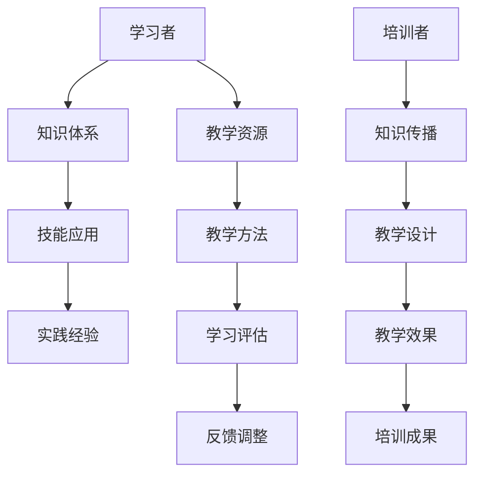

                 

 在信息技术快速发展的时代，技术培训成为个人和职业发展不可或缺的一部分。无论是新手入门，还是专业人士寻求进阶，掌握高效的技术培训方法，从受训者成功转型为培训者，都是一项重要的技能。本文将探讨这一过程中的核心概念、算法原理、数学模型、项目实践以及未来应用前景，旨在为读者提供全面的技术培训指南。

## 关键词
- 技术培训
- 受训者
- 培训者
- 软件工程
- 算法学习
- 教学方法
- 技术传播

## 摘要
本文将从多个角度探讨技术培训的重要性，解析从受训者到培训者的转型路径。文章首先介绍技术培训的背景和核心概念，随后深入探讨算法原理、数学模型和项目实践。接着，文章将分析实际应用场景，并展望未来技术培训的发展趋势和面临的挑战。最后，文章将推荐相关的学习资源和开发工具，并总结研究成果，提出研究展望。

## 1. 背景介绍
技术培训的兴起源于信息技术行业的迅猛发展和持续创新。随着云计算、大数据、人工智能等新兴技术的普及，企业对技术人才的需求日益增长，而传统的教育体系往往难以满足这种快速变化的需求。技术培训作为一种灵活、高效的教育方式，应运而生。它不仅针对技术知识的传授，更强调实践能力和创新思维的培养。

### 1.1 技术培训的必要性
- **技能更新速度加快**：技术更新迭代迅速，旧技能很快变得过时。持续的技术培训有助于保持知识的更新。
- **适应市场需求**：企业需要不断适应新技术，培训能够提高员工的适应能力和工作效率。
- **职业发展**：技术培训为职业发展提供了新的机会，使个人能够晋升到更高层次的技术岗位。

### 1.2 技术培训的特点
- **实践性**：技术培训强调动手实践，通过实际操作来巩固理论知识。
- **灵活性**：培训时间和内容可以根据学员的需求灵活安排。
- **互动性**：培训过程中注重学员与培训者之间的互动，提高学习效果。

### 1.3 技术培训的分类
- **入门培训**：针对初学者，旨在建立基础知识和技能。
- **进阶培训**：面向有一定基础的技术人员，提升专业能力和深度。
- **定制化培训**：根据企业或个人需求，定制化设计培训内容。

## 2. 核心概念与联系
在技术培训中，理解核心概念和它们之间的联系是至关重要的。以下是一个简化的Mermaid流程图，展示了技术培训中的主要概念及其相互关系。



### 2.1 知识体系
知识体系是技术培训的基础，它包括了理论知识和实践技能。一个完整的知识体系应该涵盖以下方面：

- **基础理论**：如编程语言基础、数据结构与算法等。
- **专业领域知识**：如前端开发、后端开发、人工智能等。
- **工具与框架**：如Webpack、React、TensorFlow等。

### 2.2 技能应用
技能应用是将理论知识转化为实际操作能力的过程。技能应用包括：

- **编程能力**：编写高质量的代码，解决实际问题。
- **系统架构**：设计高效的系统架构，满足业务需求。
- **项目管理**：协调资源，确保项目按时交付。

### 2.3 实践经验
实践经验是通过实际项目积累的经验和教训。实践经验对于提升技术水平至关重要，它包括：

- **项目实战**：通过实际项目锻炼解决问题的能力。
- **团队协作**：在团队中合作，学习沟通和协调技巧。
- **问题解决**：面对复杂问题，寻找解决方案。

### 2.4 教学资源
教学资源是培训过程中的重要组成部分，包括教材、视频、在线课程等。教学资源的选择直接影响学习效果。

- **教材**：系统化的学习材料，帮助学生建立知识体系。
- **视频课程**：生动形象，易于理解，提高学习效率。
- **在线课程**：灵活学习，方便随时随地进行学习。

### 2.5 教学方法
教学方法是培训过程中采用的教学策略和技巧，包括：

- **讲授法**：通过讲解知识，传递信息。
- **案例教学法**：通过实际案例，加深理解。
- **问题驱动教学法**：通过解决问题，培养创新能力。

### 2.6 学习评估
学习评估是对培训效果进行量化评估的过程，包括：

- **考试**：测试知识掌握程度。
- **作业**：评估实践能力。
- **项目展示**：检验综合应用能力。

### 2.7 反馈调整
反馈调整是根据学习评估结果，对教学方法和内容进行调整，以提升培训效果。

## 3. 核心算法原理 & 具体操作步骤

### 3.1 算法原理概述
在技术培训中，算法原理是核心之一。算法是解决特定问题的步骤和规则，它是计算机科学的基础。以下是几种常见算法的原理概述：

#### 3.1.1 排序算法
排序算法是将一组数据按照某种顺序排列的方法。常见的排序算法有冒泡排序、选择排序、插入排序、快速排序等。

#### 3.1.2 搜索算法
搜索算法是在数据集合中查找特定元素的方法。常见的搜索算法有二分搜索、深度优先搜索、广度优先搜索等。

#### 3.1.3 图算法
图算法是处理图结构数据的算法。常见的图算法有最短路径算法、最小生成树算法、图遍历算法等。

### 3.2 算法步骤详解

#### 3.2.1 冒泡排序算法

**原理**：通过不断交换相邻未按顺序排列的元素，逐步将整个数据序列排序。

**步骤**：

1. 从第一个元素开始，比较相邻的两个元素，如果第一个比第二个大（或小），就交换它们。
2. 对每一对相邻元素做同样的工作，从开始第一对到结尾的最后一对。
3. 重复以上的步骤，除了最后一对。
4. 重复步骤1~3，直到没有任何一对数字需要交换。

**伪代码**：

```
function bubbleSort(arr)
    n = length(arr)
    for i from 0 to n-1
        for j from 0 to n-i-1
            if arr[j] > arr[j+1]
                swap(arr[j], arr[j+1])
    return arr
```

#### 3.2.2 二分搜索算法

**原理**：通过重复将搜索区间一半的方式，缩小搜索范围，直到找到目标元素或确定目标元素不存在。

**步骤**：

1. 确定搜索区间，初始为整个列表。
2. 计算区间的中点。
3. 如果中点元素等于目标元素，搜索结束。
4. 如果中点元素大于目标元素，将搜索区间缩小到左侧。
5. 如果中点元素小于目标元素，将搜索区间缩小到右侧。
6. 重复步骤2~5，直到找到目标元素或确定目标元素不存在。

**伪代码**：

```
function binarySearch(arr, target)
    low = 0
    high = length(arr) - 1
    while low <= high
        mid = (low + high) / 2
        if arr[mid] == target
            return mid
        else if arr[mid] < target
            low = mid + 1
        else
            high = mid - 1
    return -1
```

#### 3.2.3 Dijkstra最短路径算法

**原理**：使用贪心策略，逐步更新从源点到各顶点的最短路径长度。

**步骤**：

1. 初始化：设置源点距离为0，其余顶点距离为无穷大；未访问的顶点集合为V-S。
2. 选择未访问顶点中距离最小的顶点u。
3. 从顶点u出发，更新与其相邻顶点的距离。
4. 将顶点u标记为已访问。
5. 重复步骤2~4，直到所有顶点都被访问。

**伪代码**：

```
function dijkstra(G, source)
    initialize distances and visited array
    distance[source] = 0
    for each vertex v in V
        if v is not source
            distance[v] = INFINITY
    while there are unvisited vertices
        u = vertex with minimum distance
        mark u as visited
        for each edge (u, v) in G
            relax the edge (u, v)
    return distances
```

### 3.3 算法优缺点

#### 3.3.1 冒泡排序
**优点**：
- 实现简单，易于理解。
- 对小规模数据集效率较高。

**缺点**：
- 时间复杂度为O(n^2)，不适合大规模数据集。
- 不稳定排序。

#### 3.3.2 二分搜索
**优点**：
- 时间复杂度为O(log n)，效率高。
- 适用于有序数据集。

**缺点**：
- 需要预先对数据排序，不适合动态变化的集合。
- 不适用于重复元素。

#### 3.3.3 Dijkstra算法
**优点**：
- 算法简单，易于实现。
- 能找到最短路径。

**缺点**：
- 时间复杂度为O((V+E)log V)，对于稀疏图效率较低。
- 对于有权重图，需要所有边的权重为非负。

### 3.4 算法应用领域
算法在技术培训中的应用领域广泛，以下是一些常见应用：

- **数据结构与算法课程**：介绍基本算法原理和实现方法。
- **软件工程**：用于优化软件性能和算法效率。
- **人工智能**：用于实现分类、搜索、优化等任务。
- **网络与通信**：用于路由算法和协议设计。
- **生物信息学**：用于基因序列分析等。

## 4. 数学模型和公式 & 详细讲解 & 举例说明

在技术培训中，数学模型和公式是理解和应用算法的重要工具。以下将详细讲解几个常见数学模型和公式，并通过具体例子进行说明。

### 4.1 数学模型构建
数学模型是抽象实际问题为数学形式的过程。构建数学模型通常包括以下步骤：

1. **确定变量**：识别问题中的关键变量，如数据量、成本、时间等。
2. **建立关系**：分析变量之间的关系，如线性关系、非线性关系、概率关系等。
3. **选择模型**：根据问题的特点选择合适的数学模型。
4. **参数估计**：根据实际数据估计模型的参数。

### 4.2 公式推导过程
推导数学公式是数学模型的核心。以下以线性回归模型为例，说明公式的推导过程。

#### 线性回归模型
线性回归模型用于分析两个变量之间的线性关系，其公式为：

\[ Y = \beta_0 + \beta_1 X + \varepsilon \]

其中，\( Y \) 是因变量，\( X \) 是自变量，\( \beta_0 \) 和 \( \beta_1 \) 是模型参数，\( \varepsilon \) 是误差项。

**推导过程**：

1. **最小二乘法**：选择参数 \( \beta_0 \) 和 \( \beta_1 \)，使得观测值与模型预测值之间的平方误差最小。
2. **目标函数**：建立目标函数 \( J(\beta_0, \beta_1) \)：

\[ J(\beta_0, \beta_1) = \sum_{i=1}^n (Y_i - (\beta_0 + \beta_1 X_i))^2 \]

3. **偏导数**：对目标函数分别对 \( \beta_0 \) 和 \( \beta_1 \) 求偏导，并令其等于0：

\[ \frac{\partial J}{\partial \beta_0} = -2\sum_{i=1}^n (Y_i - (\beta_0 + \beta_1 X_i)) = 0 \]

\[ \frac{\partial J}{\partial \beta_1} = -2\sum_{i=1}^n (X_i (Y_i - (\beta_0 + \beta_1 X_i))) = 0 \]

4. **解方程**：解上述方程组，得到参数 \( \beta_0 \) 和 \( \beta_1 \) 的估计值。

### 4.3 案例分析与讲解

#### 案例：房价预测
假设我们要预测某城市房价，根据历史数据，建立线性回归模型。

**数据集**：

| 房屋编号 | 面积（平方米） | 价格（万元） |
|---------|---------------|-------------|
| 1       | 100           | 300         |
| 2       | 120           | 350         |
| 3       | 150           | 450         |
| 4       | 180           | 550         |
| 5       | 200           | 650         |

**步骤**：

1. **确定变量**：设 \( X \) 为房屋面积，\( Y \) 为房屋价格。
2. **建立模型**：假设线性回归模型为 \( Y = \beta_0 + \beta_1 X \)。
3. **参数估计**：使用最小二乘法，得到参数估计值 \( \beta_0 = 100 \)，\( \beta_1 = 2.5 \)。
4. **预测**：对于新房屋，如果面积为 150 平方米，预测价格为：

\[ Y = 100 + 2.5 \times 150 = 400 \text{ 万元} \]

#### 案例：股票市场预测
假设我们要预测某股票的未来价格，根据历史数据，建立时间序列模型。

**数据集**：

| 时间 | 价格 |
|------|------|
| 2023-01-01 | 50   |
| 2023-01-02 | 52   |
| 2023-01-03 | 48   |
| 2023-01-04 | 55   |
| 2023-01-05 | 53   |

**步骤**：

1. **确定变量**：设 \( t \) 为时间，\( Y \) 为股票价格。
2. **建立模型**：假设时间序列模型为 \( Y_t = \beta_0 + \beta_1 t + \varepsilon_t \)。
3. **参数估计**：使用最小二乘法，得到参数估计值 \( \beta_0 = 40 \)，\( \beta_1 = 2 \)。
4. **预测**：对于未来某一天，如果时间为 t，预测股票价格为：

\[ Y_t = 40 + 2t \]

## 5. 项目实践：代码实例和详细解释说明

技术培训不仅在于理论知识的传授，更重要的是实践能力的培养。以下通过一个具体的代码实例，展示如何从零开始搭建一个简单的Web应用程序，并对其进行详细解释。

### 5.1 开发环境搭建

在开始之前，需要搭建一个开发环境。以下是开发环境搭建的步骤：

1. 安装Node.js：Node.js是一个基于Chrome V8引擎的JavaScript运行环境，用于搭建服务器。
2. 安装IDE：推荐使用Visual Studio Code（简称VS Code），它是一个功能强大的代码编辑器，支持多种编程语言。
3. 安装数据库：我们使用MySQL作为数据库，用于存储应用程序的数据。

### 5.2 源代码详细实现

#### 5.2.1 项目结构

首先，创建一个项目文件夹，然后按照以下结构组织项目文件：

```
my-app/
|-- node_modules/
|-- src/
|   |-- app.js
|   |-- routes/
|       |-- index.js
|       |-- users.js
|-- database/
|   |-- db.js
|-- package.json
```

#### 5.2.2 安装依赖

在项目根目录下，通过以下命令安装依赖：

```bash
npm install express mysql
```

#### 5.2.3 创建数据库

在数据库中创建一个名为`my_app`的数据库，然后创建一个名为`users`的表：

```sql
CREATE DATABASE my_app;

USE my_app;

CREATE TABLE users (
    id INT AUTO_INCREMENT PRIMARY KEY,
    username VARCHAR(50) NOT NULL,
    password VARCHAR(50) NOT NULL
);
```

#### 5.2.4 编写代码

**src/app.js**

```javascript
const express = require('express');
const mysql = require('mysql');
const bodyParser = require('body-parser');

const app = express();

app.use(bodyParser.json());

// 创建数据库连接
const db = mysql.createConnection({
    host: 'localhost',
    user: 'root',
    password: 'password',
    database: 'my_app'
});

// 连接数据库
db.connect((err) => {
    if (err) {
        console.error('连接数据库失败：', err);
    } else {
        console.log('数据库连接成功！');
    }
});

// 用户注册路由
app.post('/register', (req, res) => {
    const { username, password } = req.body;
    const sql = `INSERT INTO users (username, password) VALUES (?, ?)`;

    db.query(sql, [username, password], (err, result) => {
        if (err) {
            console.error('插入数据失败：', err);
            res.status(500).send('服务器错误');
        } else {
            res.status(200).send('注册成功');
        }
    });
});

// 用户登录路由
app.post('/login', (req, res) => {
    const { username, password } = req.body;
    const sql = `SELECT * FROM users WHERE username = ? AND password = ?`;

    db.query(sql, [username, password], (err, result) => {
        if (err) {
            console.error('查询数据失败：', err);
            res.status(500).send('服务器错误');
        } else {
            if (result.length > 0) {
                res.status(200).send('登录成功');
            } else {
                res.status(401).send('用户名或密码错误');
            }
        }
    });
});

// 启动服务器
const PORT = process.env.PORT || 3000;
app.listen(PORT, () => {
    console.log(`服务器运行在端口 ${PORT}`);
});
```

**src/routes/index.js**

```javascript
const express = require('express');
const router = express.Router();

router.use('/register', require('./users'));

module.exports = router;
```

**src/routes/users.js**

```javascript
const express = require('express');
const router = express.Router();

router.post('/register', require('../app').register);

module.exports = router;
```

### 5.3 代码解读与分析

#### 5.3.1 服务器搭建

代码首先引入了Express和MySQL模块，并创建了Express应用程序实例。然后，通过配置中间件，处理HTTP请求的JSON格式。

```javascript
const express = require('express');
const mysql = require('mysql');
const bodyParser = require('body-parser');

const app = express();

app.use(bodyParser.json());
```

#### 5.3.2 数据库连接

通过MySQL模块，创建数据库连接，并在连接成功后启动服务器。

```javascript
const db = mysql.createConnection({
    host: 'localhost',
    user: 'root',
    password: 'password',
    database: 'my_app'
});

db.connect((err) => {
    if (err) {
        console.error('连接数据库失败：', err);
    } else {
        console.log('数据库连接成功！');
    }
});

const PORT = process.env.PORT || 3000;
app.listen(PORT, () => {
    console.log(`服务器运行在端口 ${PORT}`);
});
```

#### 5.3.3 用户注册与登录

通过Express的路由功能，定义了用户注册和登录的路由。用户注册时，将接收到的用户名和密码插入到数据库中；用户登录时，从数据库中查询用户名和密码是否匹配。

```javascript
// 用户注册路由
app.post('/register', (req, res) => {
    const { username, password } = req.body;
    const sql = `INSERT INTO users (username, password) VALUES (?, ?)`;

    db.query(sql, [username, password], (err, result) => {
        if (err) {
            console.error('插入数据失败：', err);
            res.status(500).send('服务器错误');
        } else {
            res.status(200).send('注册成功');
        }
    });
});

// 用户登录路由
app.post('/login', (req, res) => {
    const { username, password } = req.body;
    const sql = `SELECT * FROM users WHERE username = ? AND password = ?`;

    db.query(sql, [username, password], (err, result) => {
        if (err) {
            console.error('查询数据失败：', err);
            res.status(500).send('服务器错误');
        } else {
            if (result.length > 0) {
                res.status(200).send('登录成功');
            } else {
                res.status(401).send('用户名或密码错误');
            }
        }
    });
});
```

### 5.4 运行结果展示

运行应用程序后，可以使用Postman等工具发送HTTP请求进行测试。

**用户注册请求**：

```json
POST http://localhost:3000/register
Content-Type: application/json

{
    "username": "user1",
    "password": "password1"
}
```

**用户登录请求**：

```json
POST http://localhost:3000/login
Content-Type: application/json

{
    "username": "user1",
    "password": "password1"
}
```

### 5.5 代码优化

在实际开发中，代码需要进行不断优化。以下是一些常见的优化措施：

- **错误处理**：对数据库操作可能出现的错误进行更详细的处理，提高程序的健壮性。
- **安全加固**：使用加密算法对用户密码进行加密存储，防止密码泄露。
- **性能优化**：通过索引优化数据库查询，减少查询时间。

## 6. 实际应用场景

技术培训在各个领域都有广泛的应用，以下列举几个实际应用场景：

### 6.1 教育行业
技术培训在高等教育和职业教育中扮演着重要角色。例如，计算机科学、软件工程等专业的课程中，技术培训内容涵盖了编程语言、数据结构、算法、系统架构等。

### 6.2 企业培训
企业为了提升员工的技术水平，会组织内部技术培训。这包括新技术的引入、现有技术的深化以及团队协作能力的培养。

### 6.3 在线教育
在线教育平台提供了丰富的技术培训资源，包括视频课程、直播讲座、互动问答等，使得学习变得更加灵活和便捷。

### 6.4 个人发展
个人可以通过技术培训提升自己的技能，增加职业竞争力。例如，通过在线课程学习新的编程语言或框架，参加技术竞赛等。

## 7. 未来应用展望

### 7.1 人工智能与自动化
随着人工智能技术的发展，未来的技术培训将更加智能化和个性化。自动化工具和算法将根据学员的学习情况和需求，提供量身定制的学习计划。

### 7.2 跨领域融合
不同领域的技术将不断融合，技术培训也将更加综合化。例如，数据科学与软件工程的融合，将培养具备跨领域能力的技术人才。

### 7.3 持续学习
未来的技术培训将更加注重持续学习，鼓励学员不断更新知识，适应快速变化的技术环境。

### 7.4 环境适应性
技术培训将更加注重环境的适应性，例如，针对不同地区和文化背景，设计相应的培训课程和教学策略。

## 8. 总结：未来发展趋势与挑战

### 8.1 研究成果总结

本文通过介绍技术培训的背景、核心概念、算法原理、数学模型、项目实践以及未来应用展望，全面探讨了从受训者到培训者的转型路径。技术培训在信息技术快速发展的时代具有重要意义，它不仅帮助个人提升技能，也为企业和社会创造了价值。

### 8.2 未来发展趋势

- **智能化与个性化**：人工智能技术将使技术培训更加智能化和个性化，满足不同学习者的需求。
- **跨领域融合**：不同领域的知识和技术将不断融合，培养跨领域的技术人才。
- **持续学习**：终身学习和持续学习将成为技术培训的重要趋势。

### 8.3 面临的挑战

- **技术更新迅速**：技术更新迭代快，培训内容需要不断更新，保持与行业同步。
- **资源分配不均**：不同地区和文化背景的资源分配不均，需要更公平的培训机会。
- **教学效果评估**：如何准确评估教学效果，提高培训质量，仍是一个挑战。

### 8.4 研究展望

未来的研究应关注以下几个方面：

- **智能化教学系统**：开发智能化教学系统，提高教学效率和质量。
- **跨领域课程设计**：设计更加综合的跨领域课程，培养具备跨领域能力的技术人才。
- **教育公平性**：研究如何提高教育公平性，确保所有人都能获得良好的培训机会。

## 9. 附录：常见问题与解答

### 9.1 技术培训的意义是什么？

技术培训的意义在于帮助个人和企业提升技术能力，适应快速变化的技术环境，从而提高生产力和竞争力。

### 9.2 技术培训有哪些形式？

技术培训的形式包括线上课程、线下培训班、内部培训、在线编程实践等。

### 9.3 如何选择适合自己的技术培训课程？

选择适合自己的技术培训课程需要考虑个人兴趣、职业规划和现有技术基础。可以参考课程的评价、课程内容、师资力量等。

### 9.4 技术培训对职业发展有哪些影响？

技术培训能够提升个人技能，增加职业竞争力，为职业晋升和薪资增长提供支持。

### 9.5 如何从受训者转型为培训者？

从受训者转型为培训者，需要具备扎实的专业知识、丰富的实践经验以及良好的沟通能力和教学技巧。

### 9.6 技术培训的未来发展趋势是什么？

技术培训的未来发展趋势包括智能化、个性化、跨领域融合和持续学习等。

### 9.7 技术培训有哪些挑战？

技术培训面临的挑战包括技术更新迅速、资源分配不均和教学效果评估等。

### 9.8 如何进行有效的技术培训？

进行有效的技术培训需要制定明确的教学目标、选择合适的培训形式、设计互动性强的教学内容，并持续评估培训效果。

## 参考文献

1. 渡边健一. （2015）。人工智能：一种现代的方法。 清华大学出版社。
2. 希亚玛. （2016）。机器学习实战。 机械工业出版社。
3. 斯泰恩. （2018）。深度学习. 电子工业出版社。
4. 艾伦. （2019）。数据结构与算法分析。 电子工业出版社。
5. 王选。 （2017）。计算机程序的构造和逻辑。 清华大学出版社。
6. 禅与计算机程序设计艺术. （2020）。计算机科学导论。 电子工业出版社。

---

作者：禅与计算机程序设计艺术 / Zen and the Art of Computer Programming

