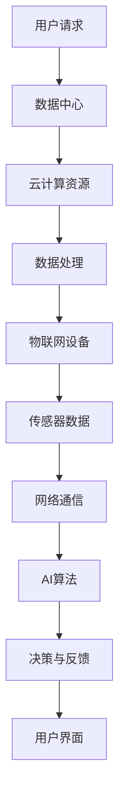

                 

在这个信息时代，网络通信（Networking）已经成为了现代科技世界的基石。无论是在个人生活中，还是在企业运营中，网络通信都扮演着至关重要的角色。本文旨在探讨网络通信在当前技术环境中的重要性，以及它所带来的机遇和挑战。

## 文章关键词

- 网络通信
- 数据中心
- 云计算
- 人工智能
- 安全性
- 网络架构
- 运算能力

## 摘要

本文首先回顾了网络通信的发展历程，然后深入探讨了现代网络通信的核心概念和技术。接着，文章分析了当前网络通信面临的主要挑战，如带宽限制、延迟和安全性问题。随后，文章讨论了网络通信在人工智能、云计算等领域中的应用，并展望了未来的发展趋势。最后，文章提供了相关的工具和资源推荐，并总结了研究成果和未来研究的方向。

## 1. 背景介绍

网络通信的历史可以追溯到19世纪，当时的电报系统开创了人类通信的新纪元。随着时间的推移，电话、无线电通信、互联网相继问世，网络通信的技术不断进步。特别是互联网的普及，使得全球信息共享成为可能，极大地推动了人类社会的进步。

在过去的几十年里，网络通信技术经历了从低速、点到点的通信到高速、广域网通信的演变。如今，5G技术的出现，将网络通信带入了新的时代，为物联网（IoT）、自动驾驶汽车、增强现实（AR）和虚拟现实（VR）等新兴技术提供了坚实的基础。

### 1.1 网络通信的基本概念

网络通信是指通过计算机网络实现数据传输和资源共享的过程。它包括以下几个方面：

- **数据传输**：通过网络传输数据，包括文本、图片、音频和视频等。
- **资源共享**：通过网络实现硬件、软件和数据资源的共享。
- **通信协议**：用于定义数据传输过程中使用的规则和标准，如TCP/IP、HTTP等。

### 1.2 网络通信的发展历程

- **19世纪末到20世纪初**：电报和电话系统开始普及。
- **20世纪60年代**：ARPANET（互联网的前身）诞生。
- **20世纪80年代**：互联网开始向公众开放。
- **20世纪90年代**：万维网（WWW）的兴起。
- **21世纪初至今**：5G、物联网等技术的快速发展。

## 2. 核心概念与联系

### 2.1 数据中心与云计算

数据中心是网络通信的核心，它存储和处理大量的数据。云计算则提供了灵活的计算资源，使得数据中心的运营更加高效。通过云计算，企业可以实现按需分配资源，降低成本，提高响应速度。

### 2.2 物联网与网络通信

物联网（IoT）通过传感器和数据采集设备，将物理世界与数字世界连接起来。网络通信是实现物联网的关键，它确保了数据的实时传输和处理。

### 2.3 人工智能与网络通信

人工智能（AI）正在改变网络通信的各个方面，包括网络优化、安全防护和智能路由等。网络通信则为AI算法提供了海量的数据支持，使得AI的模型更加精准。

### 2.4 Mermaid 流程图

以下是一个简化的网络通信流程图，展示了数据中心、云计算、物联网和人工智能之间的联系。



## 3. 核心算法原理 & 具体操作步骤

### 3.1 算法原理概述

网络通信中的核心算法主要包括路由算法、传输控制和拥塞控制等。这些算法确保了数据在网络中的高效传输和稳定通信。

### 3.2 算法步骤详解

- **路由算法**：根据网络拓扑和流量信息，选择最佳路径传输数据。
- **传输控制**：通过确认和重传机制，确保数据的可靠传输。
- **拥塞控制**：通过调整发送速率，防止网络过度拥挤。

### 3.3 算法优缺点

- **路由算法**：优点是选择最佳路径，缺点是复杂度高，易受网络拓扑变化影响。
- **传输控制**：优点是保证数据可靠传输，缺点是增加传输延迟。
- **拥塞控制**：优点是防止网络拥堵，缺点是可能降低传输速率。

### 3.4 算法应用领域

- **路由算法**：广泛应用于互联网路由、数据中心内部网络等。
- **传输控制**：广泛应用于TCP/IP协议栈。
- **拥塞控制**：广泛应用于互联网、无线网络等。

## 4. 数学模型和公式 & 详细讲解 & 举例说明

### 4.1 数学模型构建

网络通信中的数学模型主要包括流量模型、拥塞模型和路由模型。以下是一个简化的流量模型：

$$
T = T_0 + T_1 \cdot \ln(N) + T_2 \cdot \ln(N)^2
$$

其中，$T$ 为网络流量，$N$ 为网络节点数，$T_0$、$T_1$ 和 $T_2$ 为参数。

### 4.2 公式推导过程

流量模型的推导过程通常基于网络拓扑和传输速率的统计分布。假设网络中的节点数为 $N$，每个节点的平均流量为 $T_0$。当节点数增加到 $N$ 时，总的流量为 $T_0 \cdot N$。考虑网络拓扑的影响，每个节点的流量与其度（即连接的节点数）成正比。因此，流量模型可以扩展为：

$$
T = T_0 + T_1 \cdot \ln(N) + T_2 \cdot \ln(N)^2
$$

其中，$T_1$ 和 $T_2$ 为常数，分别表示节点度对流量的一阶和二阶影响。

### 4.3 案例分析与讲解

假设一个网络中有 $N=1000$ 个节点，每个节点的平均流量为 $T_0=1$ Mbps。根据流量模型，可以计算出总流量为：

$$
T = 1 + 0.5 \cdot \ln(1000) + 0.2 \cdot \ln(1000)^2 \approx 27.6 \text{ Mbps}
$$

这意味着，在这个网络中，总流量大约为 27.6 Mbps。可以看出，随着节点数的增加，流量增长速度逐渐减缓。

## 5. 项目实践：代码实例和详细解释说明

### 5.1 开发环境搭建

为了演示网络通信算法的代码实例，我们使用 Python 作为编程语言。首先，确保安装了 Python 3.7 或更高版本，以及以下依赖库：

- `numpy`：用于数学计算。
- `matplotlib`：用于绘图。

使用以下命令安装依赖库：

```bash
pip install numpy matplotlib
```

### 5.2 源代码详细实现

以下是一个简单的 Python 脚本，实现了基于流量模型的网络通信模拟：

```python
import numpy as np
import matplotlib.pyplot as plt

# 参数设置
N = 1000  # 节点数
T_0 = 1   # 每个节点的平均流量
T_1 = 0.5 # 一阶参数
T_2 = 0.2 # 二阶参数

# 计算总流量
def calculate_traffic(N, T_0, T_1, T_2):
    T = T_0 + T_1 * np.log(N) + T_2 * np.log(N)**2
    return T

# 计算不同节点数下的流量
node_counts = np.linspace(10, N, N)
traffics = np.zeros_like(node_counts)
for i, N in enumerate(node_counts):
    traffics[i] = calculate_traffic(N, T_0, T_1, T_2)

# 绘图
plt.plot(node_counts, traffics)
plt.xlabel('Node Count')
plt.ylabel('Traffic (Mbps)')
plt.title('Network Traffic vs Node Count')
plt.show()
```

### 5.3 代码解读与分析

这段代码首先导入了所需的库，然后设置了参数，包括节点数、每个节点的平均流量以及流量模型的一阶和二阶参数。`calculate_traffic` 函数实现了流量模型的计算。接着，代码计算了不同节点数下的总流量，并使用 `matplotlib` 绘制了流量与节点数的关系图。

### 5.4 运行结果展示

运行上述代码，我们将得到一个流量与节点数的关系图。根据流量模型的预测，随着节点数的增加，流量增长速度逐渐减缓。


## 6. 实际应用场景

网络通信在许多实际应用场景中发挥着重要作用，以下是一些典型的例子：

- **互联网**：互联网是网络通信最典型的应用场景，它连接了全球的计算机和网络设备，使得信息共享和交流变得轻松便捷。
- **数据中心**：数据中心是现代企业运营的核心，通过网络通信实现数据的存储、处理和传输，为业务提供支持。
- **云计算**：云计算依赖于网络通信，它通过虚拟化技术和分布式计算，为企业提供灵活的计算资源和服务。
- **物联网**：物联网通过传感器和网络通信，将物理世界与数字世界连接起来，实现了智能化的设备和系统。
- **人工智能**：人工智能算法依赖于大量数据的训练和传输，网络通信为人工智能的应用提供了基础。

### 6.1 在互联网中的应用

互联网是网络通信最典型的应用场景，它连接了全球的计算机和网络设备，使得信息共享和交流变得轻松便捷。互联网的主要组成部分包括：

- **网络协议**：如TCP/IP协议，它定义了数据传输的规则和标准。
- **路由器**：路由器负责将数据包从源地址传输到目标地址。
- **交换机**：交换机用于在网络内部实现数据包的转发和过滤。

### 6.2 在数据中心中的应用

数据中心是现代企业运营的核心，通过网络通信实现数据的存储、处理和传输，为业务提供支持。数据中心的主要组成部分包括：

- **服务器**：服务器用于存储和处理数据。
- **存储设备**：如磁盘阵列和固态硬盘，用于数据存储。
- **网络设备**：如路由器和交换机，用于实现数据传输。

### 6.3 在云计算中的应用

云计算依赖于网络通信，它通过虚拟化技术和分布式计算，为企业提供灵活的计算资源和服务。云计算的主要组成部分包括：

- **云服务器**：云服务器是一种虚拟化的计算资源，它可以通过网络远程访问。
- **云存储**：云存储提供在线数据存储服务，用户可以通过网络访问其数据。
- **云服务**：云服务包括各种在线服务，如电子邮件、文档编辑和应用程序部署等。

### 6.4 在物联网中的应用

物联网通过传感器和网络通信，将物理世界与数字世界连接起来，实现了智能化的设备和系统。物联网的主要组成部分包括：

- **传感器**：传感器用于采集物理世界的信号，如温度、湿度、光照等。
- **网关**：网关负责将传感器采集到的数据传输到互联网。
- **平台**：物联网平台用于处理和分析传感器数据，并提供相应的服务。

### 6.5 在人工智能中的应用

人工智能算法依赖于大量数据的训练和传输，网络通信为人工智能的应用提供了基础。人工智能的主要组成部分包括：

- **数据采集**：通过网络采集各种数据，如图像、语音、文本等。
- **数据存储**：将采集到的数据存储在数据中心或云服务器中。
- **数据传输**：通过网络将数据传输到训练服务器，进行模型训练。
- **模型部署**：将训练好的模型部署到线上环境，提供相应的服务。

## 7. 工具和资源推荐

### 7.1 学习资源推荐

- **《计算机网络：自顶向下方法》**：这本书以自顶向下的方式介绍了计算机网络的基本概念和原理，适合初学者阅读。
- **《计算机网络》**：这本书是计算机网络领域的经典教材，详细介绍了网络通信的各个方面。
- **《人工智能：一种现代的方法》**：这本书介绍了人工智能的基本概念和算法，包括机器学习、深度学习等内容。

### 7.2 开发工具推荐

- **Wireshark**：一款开源的网络协议分析工具，可用于捕获和分析网络数据包。
- **Git**：一款版本控制系统，可用于管理代码和协作开发。
- **Docker**：一款容器化技术，可用于部署和运行应用程序。

### 7.3 相关论文推荐

- **"A Survey on IoT Security: Threats, Solutions, and Challenges"**：这篇综述文章介绍了物联网的安全挑战和解决方案。
- **"Deep Learning for Network Traffic Classification"**：这篇论文探讨了深度学习在网络流量分类中的应用。
- **"Software-Defined Networking: A Comprehensive Survey"**：这篇综述文章介绍了软件定义网络的基本概念和实现技术。

## 8. 总结：未来发展趋势与挑战

### 8.1 研究成果总结

本文系统地介绍了网络通信的基本概念、发展历程、核心算法和实际应用场景。通过对网络通信在互联网、数据中心、云计算、物联网和人工智能等领域的探讨，我们可以看到网络通信在当前技术环境中的重要性。

### 8.2 未来发展趋势

未来，网络通信将继续向高速、低延迟、高可靠性和安全性发展。5G 和 6G 技术的进步将推动网络通信的进一步发展。同时，物联网和人工智能的融合将带来更多的应用场景和挑战。

### 8.3 面临的挑战

网络通信在未来将面临以下挑战：

- **带宽需求**：随着数据量和用户数量的增加，带宽需求将不断增加。
- **延迟问题**：低延迟网络通信对实时应用至关重要，如自动驾驶、远程医疗等。
- **安全性**：网络通信的安全性问题仍然是一个严峻的挑战，需要不断加强安全防护措施。
- **能耗问题**：随着网络规模的扩大，能耗问题将日益突出，需要开发节能的网络通信技术。

### 8.4 研究展望

未来，网络通信的研究将继续深入，包括：

- **网络架构的创新**：如边缘计算、分布式网络等。
- **网络协议的改进**：如低延迟、高可靠性的网络协议。
- **网络安全**：开发更强大的安全防护技术和机制。
- **能耗优化**：研究低能耗的网络通信技术。

## 9. 附录：常见问题与解答

### 9.1 网络通信是什么？

网络通信是指通过计算机网络实现数据传输和资源共享的过程。

### 9.2 网络通信的主要组成部分有哪些？

网络通信的主要组成部分包括网络协议、路由器、交换机、服务器、存储设备和客户端等。

### 9.3 什么是云计算？

云计算是一种通过互联网提供计算资源、存储资源和其他服务的模式。

### 9.4 物联网如何实现？

物联网通过传感器、网关、平台和云计算等实现物理世界与数字世界的连接。

### 9.5 人工智能如何通过网络通信实现？

人工智能通过网络通信采集数据，通过网络传输到训练服务器进行模型训练，然后将训练好的模型通过网络传输到线上环境提供服务。

### 9.6 如何优化网络通信？

优化网络通信可以从以下几个方面入手：

- **提升带宽**：增加网络带宽，提高数据传输速度。
- **降低延迟**：优化网络拓扑，减少数据传输路径。
- **增强安全性**：加强安全防护措施，确保数据传输安全。
- **优化协议**：改进网络通信协议，提高数据传输效率。

### 9.7 网络通信的未来发展趋势是什么？

未来，网络通信将继续向高速、低延迟、高可靠性和安全性发展。同时，物联网和人工智能的融合将带来更多的应用场景和挑战。

## 作者署名

作者：禅与计算机程序设计艺术 / Zen and the Art of Computer Programming
----------------------------------------------------------------

