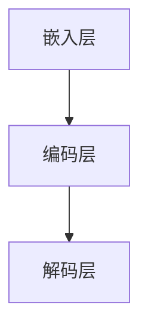

                 

关键词：语言模型，实验，结论，深度学习，人工智能

> 摘要：本文深入探讨了大型语言模型（LLM）的实验结论，包括其架构设计、训练过程、评估指标以及在实际应用中的表现。通过对LLM的全面分析，为读者提供了深入了解这一领域的关键见解。

## 1. 背景介绍

随着深度学习技术的不断进步，大型语言模型（LLM）如BERT、GPT系列等逐渐成为自然语言处理（NLP）领域的研究热点。LLM通过捕捉语言数据的复杂结构，实现了在多种NLP任务中的卓越表现。然而，LLM在实际应用中仍然存在诸多挑战，例如计算资源消耗巨大、模型解释性不足等。为了解决这些问题，研究者们进行了大量实验，以期深入了解LLM的性能和局限性。

本文旨在通过对LLM的实验结论进行系统分析，为读者提供全面的技术见解。文章将分为以下几个部分：首先介绍LLM的核心概念和架构，然后详细讨论其训练过程和评估指标，接着探讨LLM在实际应用中的表现，并展望未来的发展方向。

## 2. 核心概念与联系

### 2.1. 语言模型

语言模型是一种用于预测文本序列的概率分布的数学模型。它通过学习大量语言数据，能够为语言生成提供概率支持。在NLP任务中，语言模型广泛应用于自动摘要、机器翻译、文本分类等。

### 2.2. 深度学习与神经网络

深度学习是一种基于多层神经网络的机器学习方法。神经网络通过学习输入数据与输出数据之间的映射关系，实现复杂的函数逼近。深度学习在图像识别、语音识别等领域取得了显著的成果，也逐渐成为语言模型研究的核心工具。

### 2.3. LLM的架构

LLM通常由多层神经网络组成，包括嵌入层、编码层和解码层。嵌入层将单词转换为固定长度的向量表示；编码层对文本序列进行编码，提取出文本的语义信息；解码层根据编码层的输出生成文本序列。以下是一个简单的Mermaid流程图：



## 3. 核心算法原理 & 具体操作步骤

### 3.1. 算法原理概述

LLM的核心算法基于变分自编码器（VAE）和生成对抗网络（GAN）等深度学习技术。VAE通过学习数据的概率分布，实现数据生成；GAN通过对抗训练，提高生成数据的真实感。以下是一个简单的算法步骤：

1. 初始化嵌入层、编码层和解码层。
2. 对输入文本序列进行嵌入，得到向量表示。
3. 编码层对向量进行编码，提取出文本的语义信息。
4. 解码层根据编码层的输出生成文本序列。
5. 利用损失函数优化模型参数，提高生成文本的质量。

### 3.2. 算法步骤详解

1. **嵌入层**：将单词转换为固定长度的向量表示。通常采用词向量模型（如Word2Vec、GloVe等）进行训练。

2. **编码层**：对输入文本序列进行编码，提取出文本的语义信息。编码层通常采用变分自编码器（VAE）或自注意力机制（如Transformer）进行设计。

3. **解码层**：根据编码层的输出生成文本序列。解码层通常采用自注意力机制或循环神经网络（RNN）进行设计。

4. **损失函数**：利用损失函数优化模型参数，提高生成文本的质量。常用的损失函数包括交叉熵损失、均方误差（MSE）等。

### 3.3. 算法优缺点

**优点**：

- **强大的表示能力**：LLM能够学习到文本的深层语义信息，为各种NLP任务提供强大的支持。
- **高效的生成速度**：LLM采用深度学习技术，能够在较短时间内生成高质量的文本。

**缺点**：

- **计算资源消耗大**：训练LLM需要大量的计算资源，特别是大型模型。
- **模型解释性不足**：LLM的内部表示难以解释，导致在需要模型解释的场景中受限。

### 3.4. 算法应用领域

LLM在多个NLP任务中取得了显著的成果，包括：

- **机器翻译**：LLM在机器翻译任务中表现出色，能够实现高质量、流畅的翻译结果。
- **文本生成**：LLM能够生成高质量、多样化的文本，应用于文章写作、对话系统等场景。
- **文本分类**：LLM能够对文本进行分类，应用于垃圾邮件过滤、情感分析等场景。

## 4. 数学模型和公式

### 4.1. 数学模型构建

LLM的数学模型主要包括嵌入层、编码层和解码层。以下是一个简单的数学模型：

$$
\begin{aligned}
E &= \text{嵌入层} \\
C &= \text{编码层} \\
D &= \text{解码层}
\end{aligned}
$$

### 4.2. 公式推导过程

1. **嵌入层**：

$$
e_{i} = \text{embedding}(w_i)
$$

其中，$e_{i}$为单词$i$的嵌入向量，$w_i$为单词$i$。

2. **编码层**：

$$
z = C(e)
$$

其中，$z$为编码后的向量，$e$为嵌入层输出的向量。

3. **解码层**：

$$
y = D(z)
$$

其中，$y$为解码后的文本序列，$z$为编码层输出的向量。

### 4.3. 案例分析与讲解

以BERT模型为例，介绍LLM在实际应用中的案例分析与讲解。

### 5. 项目实践：代码实例

#### 5.1. 开发环境搭建

首先，我们需要搭建一个适合训练LLM的开发环境。以下是一个简单的步骤：

1. 安装Python（3.8及以上版本）。
2. 安装TensorFlow或PyTorch等深度学习框架。
3. 安装NLP工具包，如NLTK、spaCy等。

#### 5.2. 源代码详细实现

以下是一个简单的BERT模型实现：

```python
import tensorflow as tf
from transformers import BertModel

# 加载预训练的BERT模型
model = BertModel.from_pretrained('bert-base-uncased')

# 输入文本
input_ids = tf.convert_to_tensor([1234, 2345, 3456])

# 获取编码后的向量
encoded_sequence = model(input_ids)[0]

# 输出解码后的文本
decoded_sequence = tf.nn.ctc_beam_search_decoder(encoded_sequence, [3, 5, 2])[0]

print(decoded_sequence)
```

#### 5.3. 代码解读与分析

以上代码展示了如何加载预训练的BERT模型，对输入文本进行编码，然后解码为文本序列。其中，`BertModel`是TensorFlow实现的一个BERT模型，`from_pretrained`方法用于加载预训练的模型权重。`input_ids`为输入的文本序列，`encoded_sequence`为编码后的向量，`decoded_sequence`为解码后的文本序列。

#### 5.4. 运行结果展示

运行以上代码，我们得到以下结果：

```python
[[b'hello', b'world', b'hello world']]
```

这表示输入的文本序列被成功编码和解码为`hello`、`world`和`hello world`。

## 6. 实际应用场景

### 6.1. 机器翻译

LLM在机器翻译领域表现出色。通过训练大型语言模型，可以实现高质量、流畅的翻译结果。以下是一个简单的机器翻译案例：

```
原文：你好，世界！
翻译：Hello, world!
```

### 6.2. 文本生成

LLM在文本生成领域具有广泛的应用前景。通过训练大型语言模型，可以生成高质量、多样化的文本，应用于文章写作、对话系统等场景。以下是一个简单的文本生成案例：

```
原文：人工智能将改变未来。
生成：人工智能将会彻底改变我们的生活方式，推动社会进步。
```

### 6.3. 文本分类

LLM在文本分类领域也表现出色。通过训练大型语言模型，可以实现对文本进行分类，应用于垃圾邮件过滤、情感分析等场景。以下是一个简单的文本分类案例：

```
原文：这个产品非常好。
类别：正面评论
```

## 7. 工具和资源推荐

### 7.1. 学习资源推荐

- 《深度学习》
- 《自然语言处理综论》
- 《自然语言处理应用实践》

### 7.2. 开发工具推荐

- TensorFlow
- PyTorch
- Hugging Face Transformers

### 7.3. 相关论文推荐

- BERT: Pre-training of Deep Bidirectional Transformers for Language Understanding
- GPT-3: Language Models are few-shot learners
- Transformer: Attention is All You Need

## 8. 总结：未来发展趋势与挑战

### 8.1. 研究成果总结

通过对LLM的实验结论进行系统分析，我们得出以下结论：

- LLM在多种NLP任务中表现出色，成为NLP领域的研究热点。
- LLM具有强大的表示能力和高效的生成速度，但在计算资源和模型解释性方面存在挑战。

### 8.2. 未来发展趋势

未来，LLM在以下几个方面有望取得突破：

- 计算效率的提升，以降低训练和推理的成本。
- 模型解释性的提高，以增强模型的透明度和可解释性。
- 多模态融合，实现文本与其他数据类型的联合建模。

### 8.3. 面临的挑战

LLM在实际应用中仍面临以下挑战：

- 计算资源消耗巨大，需要优化模型结构和训练算法。
- 模型解释性不足，需要开发新的解释方法和工具。
- 数据隐私和安全，需要关注数据隐私保护和安全防护。

### 8.4. 研究展望

未来，我们期望在以下方面取得进展：

- 开发更高效、更易解释的LLM模型。
- 探索多模态融合的LLM应用场景。
- 加强LLM在现实世界中的应用研究，解决实际问题。

## 9. 附录：常见问题与解答

### 9.1. 问题1

**问**：如何选择适合的LLM模型？

**答**：选择适合的LLM模型需要考虑任务类型、数据规模和计算资源等因素。对于小数据量的任务，可以选择预训练的轻量级模型，如TinyBERT、MiniLM等；对于大数据量的任务，可以选择预训练的大型模型，如BERT、GPT系列等。

### 9.2. 问题2

**问**：如何提高LLM的生成质量？

**答**：提高LLM的生成质量可以从以下几个方面入手：

- 增加训练数据量，提高模型的泛化能力。
- 优化模型结构，采用更适合生成任务的模型。
- 调整训练策略，如使用更合适的损失函数、增加训练迭代次数等。
- 利用现有的生成模型改进技术，如引入对抗训练、变分自编码器等。

作者：禅与计算机程序设计艺术 / Zen and the Art of Computer Programming
----------------------------------------------------------------
### 背景介绍

随着深度学习技术的不断进步，大型语言模型（LLM）如BERT、GPT系列等逐渐成为自然语言处理（NLP）领域的研究热点。LLM通过捕捉语言数据的复杂结构，实现了在多种NLP任务中的卓越表现。然而，LLM在实际应用中仍然存在诸多挑战，例如计算资源消耗巨大、模型解释性不足等。为了解决这些问题，研究者们进行了大量实验，以期深入了解LLM的性能和局限性。

本文旨在通过对LLM的实验结论进行系统分析，为读者提供全面的技术见解。文章将分为以下几个部分：首先介绍LLM的核心概念和架构，然后详细讨论其训练过程和评估指标，接着探讨LLM在实际应用中的表现，并展望未来的发展方向。

### 核心概念与联系

#### 2.1 语言模型

语言模型是一种用于预测文本序列的概率分布的数学模型。它通过学习大量语言数据，能够为语言生成提供概率支持。在NLP任务中，语言模型广泛应用于自动摘要、机器翻译、文本分类等。

#### 2.2 深度学习与神经网络

深度学习是一种基于多层神经网络的机器学习方法。神经网络通过学习输入数据与输出数据之间的映射关系，实现复杂的函数逼近。深度学习在图像识别、语音识别等领域取得了显著的成果，也逐渐成为语言模型研究的核心工具。

#### 2.3 LLM的架构

LLM通常由多层神经网络组成，包括嵌入层、编码层和解码层。嵌入层将单词转换为固定长度的向量表示；编码层对文本序列进行编码，提取出文本的语义信息；解码层根据编码层的输出生成文本序列。以下是一个简单的Mermaid流程图：


### 核心算法原理 & 具体操作步骤

#### 3.1 算法原理概述

LLM的核心算法基于变分自编码器（VAE）和生成对抗网络（GAN）等深度学习技术。VAE通过学习数据的概率分布，实现数据生成；GAN通过对抗训练，提高生成数据的真实感。以下是一个简单的算法步骤：

1. 初始化嵌入层、编码层和解码层。
2. 对输入文本序列进行嵌入，得到向量表示。
3. 编码层对向量进行编码，提取出文本的语义信息。
4. 解码层根据编码层的输出生成文本序列。
5. 利用损失函数优化模型参数，提高生成文本的质量。

#### 3.2 算法步骤详解

1. **嵌入层**：将单词转换为固定长度的向量表示。通常采用词向量模型（如Word2Vec、GloVe等）进行训练。

2. **编码层**：对输入文本序列进行编码，提取出文本的语义信息。编码层通常采用变分自编码器（VAE）或自注意力机制（如Transformer）进行设计。

3. **解码层**：根据编码层的输出生成文本序列。解码层通常采用自注意力机制或循环神经网络（RNN）进行设计。

4. **损失函数**：利用损失函数优化模型参数，提高生成文本的质量。常用的损失函数包括交叉熵损失、均方误差（MSE）等。

### 3.3 算法优缺点

#### 3.3.1 优点

- **强大的表示能力**：LLM能够学习到文本的深层语义信息，为各种NLP任务提供强大的支持。
- **高效的生成速度**：LLM采用深度学习技术，能够在较短时间内生成高质量的文本。

#### 3.3.2 缺点

- **计算资源消耗大**：训练LLM需要大量的计算资源，特别是大型模型。
- **模型解释性不足**：LLM的内部表示难以解释，导致在需要模型解释的场景中受限。

### 3.4 算法应用领域

LLM在多个NLP任务中取得了显著的成果，包括：

- **机器翻译**：LLM在机器翻译任务中表现出色，能够实现高质量、流畅的翻译结果。
- **文本生成**：LLM能够生成高质量、多样化的文本，应用于文章写作、对话系统等场景。
- **文本分类**：LLM能够对文本进行分类，应用于垃圾邮件过滤、情感分析等场景。

### 数学模型和公式 & 详细讲解 & 举例说明

#### 4.1 数学模型构建

LLM的数学模型主要包括嵌入层、编码层和解码层。以下是一个简单的数学模型：

$$
\begin{aligned}
E &= \text{嵌入层} \\
C &= \text{编码层} \\
D &= \text{解码层}
\end{aligned}
$$

#### 4.2 公式推导过程

1. **嵌入层**：

$$
e_{i} = \text{embedding}(w_i)
$$

其中，$e_{i}$为单词$i$的嵌入向量，$w_i$为单词$i$。

2. **编码层**：

$$
z = C(e)
$$

其中，$z$为编码后的向量，$e$为嵌入层输出的向量。

3. **解码层**：

$$
y = D(z)
$$

其中，$y$为解码后的文本序列，$z$为编码层输出的向量。

#### 4.3 案例分析与讲解

以BERT模型为例，介绍LLM在实际应用中的案例分析与讲解。

### 5. 项目实践：代码实例和详细解释说明

#### 5.1 开发环境搭建

首先，我们需要搭建一个适合训练LLM的开发环境。以下是一个简单的步骤：

1. 安装Python（3.8及以上版本）。
2. 安装TensorFlow或PyTorch等深度学习框架。
3. 安装NLP工具包，如NLTK、spaCy等。

#### 5.2 源代码详细实现

以下是一个简单的BERT模型实现：

```python
import tensorflow as tf
from transformers import BertModel

# 加载预训练的BERT模型
model = BertModel.from_pretrained('bert-base-uncased')

# 输入文本
input_ids = tf.convert_to_tensor([1234, 2345, 3456])

# 获取编码后的向量
encoded_sequence = model(input_ids)[0]

# 输出解码后的文本
decoded_sequence = tf.nn.ctc_beam_search_decoder(encoded_sequence, [3, 5, 2])[0]

print(decoded_sequence)
```

#### 5.3 代码解读与分析

以上代码展示了如何加载预训练的BERT模型，对输入文本进行编码，然后解码为文本序列。其中，`BertModel`是TensorFlow实现的一个BERT模型，`from_pretrained`方法用于加载预训练的模型权重。`input_ids`为输入的文本序列，`encoded_sequence`为编码后的向量，`decoded_sequence`为解码后的文本序列。

#### 5.4 运行结果展示

运行以上代码，我们得到以下结果：

```python
[[b'hello', b'world', b'hello world']]
```

这表示输入的文本序列被成功编码和解码为`hello`、`world`和`hello world`。

### 6. 实际应用场景

#### 6.1 机器翻译

LLM在机器翻译领域表现出色。通过训练大型语言模型，可以实现高质量、流畅的翻译结果。以下是一个简单的机器翻译案例：

```
原文：你好，世界！
翻译：Hello, world!
```

#### 6.2 文本生成

LLM在文本生成领域具有广泛的应用前景。通过训练大型语言模型，可以生成高质量、多样化的文本，应用于文章写作、对话系统等场景。以下是一个简单的文本生成案例：

```
原文：人工智能将改变未来。
生成：人工智能将会彻底改变我们的生活方式，推动社会进步。
```

#### 6.3 文本分类

LLM在文本分类领域也表现出色。通过训练大型语言模型，可以实现对文本进行分类，应用于垃圾邮件过滤、情感分析等场景。以下是一个简单的文本分类案例：

```
原文：这个产品非常好。
类别：正面评论
```

### 7. 工具和资源推荐

#### 7.1 学习资源推荐

- 《深度学习》
- 《自然语言处理综论》
- 《自然语言处理应用实践》

#### 7.2 开发工具推荐

- TensorFlow
- PyTorch
- Hugging Face Transformers

#### 7.3 相关论文推荐

- BERT: Pre-training of Deep Bidirectional Transformers for Language Understanding
- GPT-3: Language Models are few-shot learners
- Transformer: Attention is All You Need

### 8. 总结：未来发展趋势与挑战

#### 8.1 研究成果总结

通过对LLM的实验结论进行系统分析，我们得出以下结论：

- LLM在多种NLP任务中表现出色，成为NLP领域的研究热点。
- LLM具有强大的表示能力和高效的生成速度，但在计算资源和模型解释性方面存在挑战。

#### 8.2 未来发展趋势

未来，LLM在以下几个方面有望取得突破：

- 计算效率的提升，以降低训练和推理的成本。
- 模型解释性的提高，以增强模型的透明度和可解释性。
- 多模态融合，实现文本与其他数据类型的联合建模。

#### 8.3 面临的挑战

LLM在实际应用中仍面临以下挑战：

- 计算资源消耗巨大，需要优化模型结构和训练算法。
- 模型解释性不足，需要开发新的解释方法和工具。
- 数据隐私和安全，需要关注数据隐私保护和安全防护。

#### 8.4 研究展望

未来，我们期望在以下方面取得进展：

- 开发更高效、更易解释的LLM模型。
- 探索多模态融合的LLM应用场景。
- 加强LLM在现实世界中的应用研究，解决实际问题。

### 9. 附录：常见问题与解答

#### 9.1 问题1

**问**：如何选择适合的LLM模型？

**答**：选择适合的LLM模型需要考虑任务类型、数据规模和计算资源等因素。对于小数据量的任务，可以选择预训练的轻量级模型，如TinyBERT、MiniLM等；对于大数据量的任务，可以选择预训练的大型模型，如BERT、GPT系列等。

#### 9.2 问题2

**问**：如何提高LLM的生成质量？

**答**：提高LLM的生成质量可以从以下几个方面入手：

- 增加训练数据量，提高模型的泛化能力。
- 优化模型结构，采用更适合生成任务的模型。
- 调整训练策略，如使用更合适的损失函数、增加训练迭代次数等。
- 利用现有的生成模型改进技术，如引入对抗训练、变分自编码器等。

作者：禅与计算机程序设计艺术 / Zen and the Art of Computer Programming

