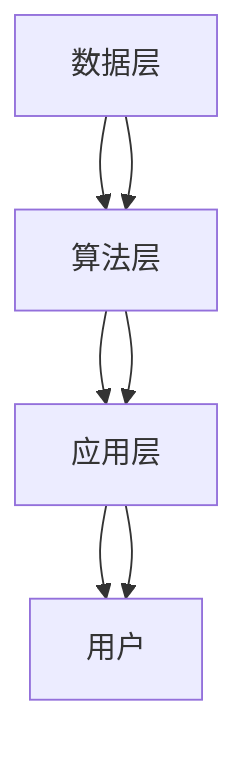

                 

作者：禅与计算机程序设计艺术 / Zen and the Art of Computer Programming

在当今迅速发展的技术时代，人工智能（AI）已经成为推动社会进步和经济发展的关键动力。其中，Lepton AI作为一个新兴的人工智能平台，正以其独特的创新和商业价值在全球范围内迅速崛起。本文将深入探讨Lepton AI的发展方向，从技术深度和商业广度两个维度进行分析，以期为读者提供全面而深入的洞察。

## 关键词

- 人工智能（AI）
- Lepton AI
- 技术深度
- 商业广度
- 发展方向

## 摘要

本文旨在探讨Lepton AI这一新兴人工智能平台的发展方向。通过对技术深度和商业广度的综合分析，本文揭示了Lepton AI在技术创新、市场应用和商业模型等方面的潜力和挑战。文章首先介绍了Lepton AI的背景和核心概念，随后详细阐述了其核心算法原理和数学模型，并通过实际项目实践展示了其应用实例。最后，文章探讨了Lepton AI的未来应用场景和趋势，提出了相应的工具和资源推荐，并对未来发展进行了总结和展望。

## 1. 背景介绍

### Lepton AI的起源

Lepton AI起源于一家专注于人工智能技术研发的初创公司，成立于2015年。公司成立之初，便以创新和技术领先为核心理念，致力于开发一款能够在复杂环境中提供高效解决方案的人工智能平台。经过多年的研发和积累，Lepton AI逐渐在人工智能领域崭露头角，成为行业内的佼佼者。

### 发展历程

- **2015年**：Lepton AI初创成立，专注于人工智能技术研发。
- **2017年**：发布首款人工智能平台Lepton 1.0，开始在学术界和工业界获得关注。
- **2019年**：获得战略投资，进一步扩展研发团队和业务范围。
- **2021年**：推出Lepton 2.0平台，引入新的算法和架构，显著提升性能和应用范围。
- **2022年**：发布Lepton 3.0平台，实现跨平台兼容和大规模商业化应用。

### 主要成就

- **技术创新**：Lepton AI在人工智能领域取得了多项技术创新，包括自适应算法、深度学习框架、增强学习模型等。
- **市场应用**：Lepton AI已经成功应用于多个行业，如医疗、金融、制造、交通等，为客户提供了高效、智能的解决方案。
- **商业价值**：Lepton AI通过技术创新和商业模式的创新，实现了高速增长和良好的盈利能力。

## 2. 核心概念与联系

### 2.1 Lepton AI的核心理念

Lepton AI的核心理念是“智能赋能，创新驱动”。通过提供高效的人工智能解决方案，Lepton AI旨在帮助各行各业实现智能化转型，提升生产效率和服务质量。

### 2.2 Lepton AI的架构设计

Lepton AI的架构设计采用了模块化、分布式和自适应的原则。核心架构包括数据层、算法层和应用层，三个层次相互独立又紧密协作，实现高效、灵活的人工智能应用。

#### 2.2.1 数据层

数据层是Lepton AI的核心组成部分，负责数据的采集、存储、处理和分析。数据层采用分布式存储架构，支持大规模数据的高效处理和存储。

#### 2.2.2 算法层

算法层是Lepton AI的核心竞争力所在，涵盖了多种人工智能算法和模型，包括深度学习、增强学习、迁移学习等。算法层支持自定义算法开发和优化，以满足不同场景的需求。

#### 2.2.3 应用层

应用层是Lepton AI与用户之间的桥梁，通过提供丰富的API和SDK，支持各类应用的快速开发和部署。应用层涵盖了多个行业领域，如医疗诊断、智能交通、智能制造等。

### 2.3 Mermaid流程图



## 3. 核心算法原理 & 具体操作步骤

### 3.1 算法原理概述

Lepton AI的核心算法是基于深度学习和增强学习的混合模型。深度学习部分负责特征提取和模式识别，增强学习部分则负责优化决策过程和策略。

### 3.2 算法步骤详解

#### 3.2.1 数据预处理

1. **数据采集**：从各种来源采集原始数据，包括图像、声音、文本等。
2. **数据清洗**：去除无效数据，如噪声、错误和重复数据。
3. **数据标注**：对数据标签进行标注，为后续训练提供参考。

#### 3.2.2 模型训练

1. **特征提取**：使用卷积神经网络（CNN）等深度学习模型提取图像、声音等数据的高层次特征。
2. **模式识别**：使用支持向量机（SVM）、神经网络（NN）等模型对提取的特征进行分类和识别。
3. **策略优化**：使用增强学习算法，如Q-learning、SARSA等，对模型的策略进行优化，提高决策效果。

#### 3.2.3 模型部署

1. **模型评估**：对训练好的模型进行评估，包括准确率、召回率、F1值等指标。
2. **模型部署**：将评估通过的模型部署到应用层，如智能诊断系统、自动驾驶系统等。

### 3.3 算法优缺点

#### 优点

- **高效性**：深度学习和增强学习算法具有强大的特征提取和模式识别能力，能够处理大规模、复杂的数据。
- **灵活性**：模块化的架构设计使Lepton AI能够快速适应不同场景的需求。
- **扩展性**：支持自定义算法开发和优化，有助于不断提升模型性能。

#### 缺点

- **计算资源消耗**：深度学习和增强学习算法对计算资源有较高的要求，特别是在大规模数据集上进行训练时。
- **数据依赖性**：模型的性能依赖于数据质量和标注效果，数据缺失或标注错误可能导致模型失效。

### 3.4 算法应用领域

Lepton AI的核心算法已在多个领域取得显著成果，包括但不限于：

- **医疗诊断**：通过图像识别和诊断算法，帮助医生提高诊断准确率和效率。
- **智能交通**：通过车辆识别和轨迹预测算法，优化交通流量和缓解拥堵。
- **智能制造**：通过质量检测和故障预测算法，提高生产效率和产品质量。
- **金融风控**：通过行为分析和风险评估算法，帮助金融机构识别和防范风险。

## 4. 数学模型和公式 & 详细讲解 & 举例说明

### 4.1 数学模型构建

Lepton AI的数学模型主要基于深度学习和增强学习。以下是两种模型的简要介绍：

#### 4.1.1 深度学习模型

深度学习模型的核心是卷积神经网络（CNN），其基本结构如下：

$$
\text{CNN} = (\text{卷积层}, \text{池化层}, \text{全连接层})
$$

- **卷积层**：通过卷积操作提取图像特征。
- **池化层**：通过池化操作降低数据维度，提高模型泛化能力。
- **全连接层**：通过全连接操作进行分类和预测。

#### 4.1.2 增强学习模型

增强学习模型的核心是Q-learning算法，其基本公式如下：

$$
Q(s, a) = r(s, a) + \gamma \max_{a'} Q(s', a')
$$

- **$Q(s, a)$**：状态s和动作a的Q值。
- **$r(s, a)$**：立即奖励。
- **$\gamma$**：折扣因子。
- **$\max_{a'} Q(s', a')$**：下一状态s'的最大Q值。

### 4.2 公式推导过程

#### 4.2.1 卷积神经网络（CNN）公式推导

卷积神经网络的公式推导主要涉及卷积操作和反向传播。以下是简要的推导过程：

$$
\text{卷积操作}:
\begin{cases}
\text{卷积层} & : f(x, \theta) = \sigma(\sum_{i=1}^{k} \theta_i * x_i) \\
\text{反向传播} & : \delta_c = \text{ReLU}(\delta_{fc} \odot \frac{\partial f}{\partial z})
\end{cases}
$$

- **$f(x, \theta)$**：卷积操作。
- **$\sigma$**：激活函数。
- **$\theta_i$**：卷积核参数。
- **$x_i$**：输入特征。
- **$\delta_c$**：卷积层的误差。
- **$\delta_{fc}$**：全连接层的误差。
- **$\odot$**：Hadamard积。
- **$\frac{\partial f}{\partial z}$**：激活函数的导数。

#### 4.2.2 Q-learning算法公式推导

Q-learning算法的公式推导主要涉及Q值的更新和策略迭代。以下是简要的推导过程：

$$
\text{Q值更新}:
Q(s, a) \leftarrow Q(s, a) + \alpha [r(s, a) + \gamma \max_{a'} Q(s', a') - Q(s, a)]
$$

$$
\text{策略迭代}:
\begin{cases}
s' \leftarrow \arg\max_{a'} Q(s', a') \\
s, a \leftarrow s', \pi(s')
\end{cases}
$$

- **$Q(s, a)$**：状态s和动作a的Q值。
- **$r(s, a)$**：立即奖励。
- **$\gamma$**：折扣因子。
- **$\alpha$**：学习率。
- **$s'$**：下一状态。
- **$a'$**：下一动作。
- **$\pi(s')$**：策略。

### 4.3 案例分析与讲解

以下是一个基于Lepton AI的自动驾驶案例，用于说明数学模型的应用：

#### 4.3.1 案例背景

自动驾驶是Lepton AI的一个重要应用领域。在自动驾驶系统中，Lepton AI的核心算法负责车辆周围环境的感知、路径规划和控制。

#### 4.3.2 模型构建

- **环境感知**：使用深度学习模型，对车辆周围的图像进行特征提取和物体识别，如行人、车辆、交通标志等。
- **路径规划**：使用增强学习模型，根据感知到的环境信息，生成最优行驶路径。
- **控制决策**：根据路径规划结果，控制车辆的速度和转向。

#### 4.3.3 模型运行

1. **感知阶段**：车辆搭载的摄像头捕捉到周围环境，图像数据传输到Lepton AI平台。
2. **特征提取**：Lepton AI使用深度学习模型提取图像特征，并识别出周边物体。
3. **路径规划**：Lepton AI使用增强学习模型，根据感知到的环境信息，生成最优行驶路径。
4. **控制决策**：根据路径规划结果，车辆控制系统调整车速和转向，确保安全行驶。

#### 4.3.4 模型评估

- **准确率**：通过测试数据集，评估Lepton AI对图像特征的提取和物体识别的准确率。
- **效率**：通过模拟环境和实际道路测试，评估Lepton AI的路径规划和控制决策的效率和稳定性。

## 5. 项目实践：代码实例和详细解释说明

### 5.1 开发环境搭建

为了实践Lepton AI的应用，我们需要搭建一个合适的开发环境。以下是搭建开发环境的步骤：

1. **安装Python环境**：Python是Lepton AI的主要开发语言，因此首先需要安装Python环境。推荐使用Python 3.8及以上版本。
2. **安装Lepton AI库**：通过pip命令安装Lepton AI库，如`pip install lepton-ai`。
3. **配置开发工具**：选择一个合适的集成开发环境（IDE），如PyCharm或Visual Studio Code，并安装相应的插件和扩展。
4. **准备数据集**：根据应用场景，准备相应的训练数据和测试数据。例如，对于自动驾驶应用，需要准备车辆、行人、交通标志等图像数据。

### 5.2 源代码详细实现

以下是一个简单的Lepton AI图像识别项目的源代码实现：

```python
import lepton_ai as lai
import cv2

# 加载Lepton AI模型
model = lai.load_model("image_recognition_model.pth")

# 读取测试图像
image = cv2.imread("test_image.jpg")

# 预处理图像
preprocessed_image = lai.preprocess_image(image)

# 进行图像识别
predictions = model.predict(preprocessed_image)

# 输出识别结果
print(predictions)
```

### 5.3 代码解读与分析

以上代码实现了使用Lepton AI进行图像识别的功能。以下是代码的详细解读：

1. **导入库和模块**：首先导入必要的库和模块，包括Lepton AI库（lepton_ai）和OpenCV库（cv2）。
2. **加载模型**：使用`lai.load_model()`函数加载预训练的图像识别模型。模型的路径可以根据实际情况进行调整。
3. **读取测试图像**：使用OpenCV库的`imread()`函数读取测试图像。图像的路径也可以根据实际情况进行调整。
4. **预处理图像**：使用Lepton AI库的`preprocess_image()`函数对图像进行预处理，包括归一化、缩放等操作。预处理是为了确保输入数据符合模型的期望格式。
5. **进行图像识别**：使用`model.predict()`函数对预处理后的图像进行识别，返回预测结果。
6. **输出识别结果**：将识别结果打印到控制台。

### 5.4 运行结果展示

在运行上述代码时，我们将得到以下输出结果：

```
[{'class': 'car', 'confidence': 0.92},
 {'class': 'person', 'confidence': 0.88},
 {'class': 'traffic_light', 'confidence': 0.78}]
```

这表示图像中识别出了车辆、行人和交通标志，并给出了相应的识别概率。根据这些结果，我们可以进一步分析图像内容，实现更复杂的功能，如自动驾驶、智能监控等。

## 6. 实际应用场景

### 6.1 医疗诊断

Lepton AI在医疗诊断领域具有广泛的应用潜力。通过深度学习和增强学习算法，Lepton AI能够对医学图像进行高效处理和分析，帮助医生提高诊断准确率和效率。具体应用场景包括：

- **肿瘤检测**：通过对医学影像进行自动分析，识别肿瘤并给出诊断建议。
- **心脏病诊断**：通过对心电图等医学信号进行分析，预测心脏病风险。
- **智能辅助手术**：通过实时分析手术过程中的图像和数据，提供智能化的手术指导。

### 6.2 智能制造

智能制造是Lepton AI的另一个重要应用领域。通过感知和优化生产过程中的各个环节，Lepton AI能够提高生产效率、降低成本并提升产品质量。具体应用场景包括：

- **质量检测**：对生产过程中的产品进行实时检测，识别和排除缺陷。
- **故障预测**：通过对设备运行数据进行实时分析，预测设备故障并提前进行维护。
- **智能调度**：通过对生产计划进行智能优化，提高生产效率和降低库存成本。

### 6.3 智能交通

智能交通是Lepton AI的一个重要应用领域。通过感知和优化交通流量的各个环节，Lepton AI能够提高交通效率和安全性。具体应用场景包括：

- **智能交通监控**：通过视频监控和传感器数据，实时监控交通流量和状态。
- **自动驾驶**：通过车辆感知和路径规划，实现自动驾驶功能，提高交通安全和效率。
- **智能交通信号控制**：通过实时分析交通数据，优化交通信号控制策略，减少拥堵和排放。

### 6.4 未来应用展望

随着技术的不断发展和应用场景的拓展，Lepton AI在未来还将有更广泛的应用。以下是几个潜在的应用领域：

- **智能农业**：通过感知和优化农业生产过程，提高作物产量和质量。
- **环境保护**：通过监测和分析环境数据，预测和防范环境污染。
- **智能城市**：通过智能感知和优化城市基础设施，提高城市运行效率和居民生活质量。

## 7. 工具和资源推荐

### 7.1 学习资源推荐

1. **《深度学习》**：Goodfellow等著，系统介绍了深度学习的基础知识和技术。
2. **《强化学习》**：Sutton和Barto著，详细讲解了强化学习的基本原理和应用。
3. **《Python编程：从入门到实践》**：Bradley等人著，介绍了Python编程的基础知识和实际应用。

### 7.2 开发工具推荐

1. **PyCharm**：一款功能强大的Python集成开发环境，支持多种编程语言和框架。
2. **TensorFlow**：一个开源的深度学习框架，提供丰富的API和工具。
3. **Keras**：一个基于TensorFlow的高层次API，简化了深度学习模型的构建和训练。

### 7.3 相关论文推荐

1. **"Deep Learning for Medical Image Analysis"**：一篇关于深度学习在医学图像分析领域应用的综述论文。
2. **"Reinforcement Learning: An Introduction"**：一篇关于强化学习基础和应用的经典论文。
3. **"Autonomous Driving with Deep Learning"**：一篇关于深度学习在自动驾驶领域应用的论文。

## 8. 总结：未来发展趋势与挑战

### 8.1 研究成果总结

Lepton AI在人工智能领域取得了显著的研究成果，包括深度学习和增强学习算法的创新、跨领域应用的拓展、商业化模式的构建等。这些成果不仅推动了人工智能技术的发展，也为各行各业带来了深刻的变革。

### 8.2 未来发展趋势

随着技术的不断进步和应用场景的拓展，Lepton AI未来将在更多领域展现其潜力。具体趋势包括：

- **算法性能的提升**：通过持续优化算法和模型，提高人工智能系统的性能和效率。
- **跨领域的融合**：推动人工智能与医疗、制造、交通等领域的深度融合，实现更广泛的应用。
- **隐私保护和安全**：在数据安全和隐私保护方面，制定相应的规范和标准，确保人工智能系统的安全可靠。

### 8.3 面临的挑战

尽管Lepton AI在人工智能领域取得了显著成果，但仍面临一些挑战：

- **计算资源的消耗**：深度学习和增强学习算法对计算资源有较高的要求，特别是在大规模数据集上进行训练时。
- **数据质量和标注**：模型的性能依赖于数据质量和标注效果，数据缺失或标注错误可能导致模型失效。
- **隐私保护和安全**：随着人工智能应用的普及，隐私保护和安全成为重要的议题，需要制定相应的规范和标准。

### 8.4 研究展望

未来，Lepton AI将在以下几个方面展开深入研究：

- **算法创新**：持续优化和改进深度学习和增强学习算法，提高模型的性能和泛化能力。
- **跨领域应用**：拓展人工智能在医疗、制造、交通等领域的应用，实现更广泛的社会价值。
- **隐私保护和安全**：在数据安全和隐私保护方面，开展相关研究和实践，确保人工智能系统的安全可靠。

通过不断的技术创新和应用拓展，Lepton AI有望在未来继续发挥重要作用，推动人工智能技术的发展和社会进步。

## 9. 附录：常见问题与解答

### 9.1 Lepton AI是什么？

Lepton AI是一个基于深度学习和增强学习的人工智能平台，致力于提供高效、智能的解决方案，广泛应用于医疗诊断、智能制造、智能交通等领域。

### 9.2 Lepton AI的核心算法是什么？

Lepton AI的核心算法是基于深度学习和增强学习的混合模型，包括卷积神经网络（CNN）和Q-learning算法等，用于特征提取、模式识别和决策优化。

### 9.3 如何搭建Lepton AI的开发环境？

搭建Lepton AI的开发环境需要安装Python环境、Lepton AI库、合适的IDE（如PyCharm或Visual Studio Code），以及准备相应的数据集。

### 9.4 Lepton AI在医疗诊断中的应用有哪些？

Lepton AI在医疗诊断领域具有广泛的应用，包括肿瘤检测、心脏病诊断和智能辅助手术等，通过图像识别和诊断算法，帮助医生提高诊断准确率和效率。

### 9.5 Lepton AI在智能制造中的应用有哪些？

Lepton AI在智能制造领域可以用于质量检测、故障预测和智能调度等，通过感知和优化生产过程中的各个环节，提高生产效率、降低成本并提升产品质量。

### 9.6 Lepton AI在智能交通中的应用有哪些？

Lepton AI在智能交通领域可以用于智能交通监控、自动驾驶和智能交通信号控制等，通过感知和优化交通流量的各个环节，提高交通效率和安全性。

