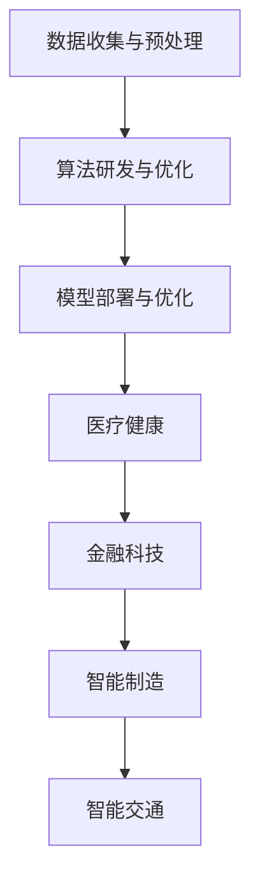

                 

关键词：Lepton AI、技术深耕、市场开拓、人工智能、算法研究、创新应用、未来发展

> 摘要：本文深入探讨了Lepton AI公司如何通过技术深耕和市场开拓实现双线发展。文章首先介绍了Lepton AI的背景和核心优势，然后分析了其技术深耕和市场开拓的策略，并探讨了其在人工智能领域的创新应用和未来发展趋势。

## 1. 背景介绍

Lepton AI公司成立于2010年，是一家专注于人工智能算法研究和应用的高科技企业。公司位于美国硅谷，拥有一支由顶尖科学家和工程师组成的团队。Lepton AI的核心竞争力在于其深厚的技术积累和创新精神，这使得公司在人工智能领域取得了显著的成就。

自成立以来，Lepton AI始终致力于推动人工智能技术的进步和应用。公司成功研发了多种先进的人工智能算法，包括深度学习、自然语言处理、计算机视觉等，并在多个领域实现了突破性应用。此外，Lepton AI还与多家知名企业和科研机构建立了战略合作关系，共同推动人工智能技术的发展。

## 2. 核心概念与联系

### 2.1. 人工智能算法

人工智能算法是Lepton AI的核心竞争力之一。人工智能算法是指用于模拟、延伸和扩展人类智能的计算机程序。Lepton AI主要研究以下几种人工智能算法：

- **深度学习**：一种基于多层神经网络的人工智能算法，通过模拟人脑神经网络结构，实现图像识别、语音识别、自然语言处理等任务。
- **自然语言处理**：一种用于处理自然语言文本的人工智能技术，包括语言理解、语言生成、语言翻译等任务。
- **计算机视觉**：一种用于使计算机理解和解释视觉信息的人工智能技术，包括图像识别、目标检测、图像分割等任务。

### 2.2. 人工智能架构

Lepton AI的人工智能架构主要包括以下几个方面：

- **数据收集与预处理**：通过采集大量数据，并对数据进行清洗、归一化等处理，为后续算法训练提供高质量的数据基础。
- **算法研发与优化**：结合深度学习、自然语言处理、计算机视觉等技术，研发并优化各种人工智能算法，提高模型性能和准确率。
- **模型部署与优化**：将训练好的模型部署到实际应用场景中，并进行持续优化，以满足用户需求。

### 2.3. 人工智能应用

Lepton AI在多个领域实现了人工智能技术的创新应用，包括：

- **医疗健康**：利用人工智能算法，实现疾病诊断、药物研发、智能医疗管理等。
- **金融科技**：通过人工智能算法，实现风险控制、信用评估、智能投顾等。
- **智能制造**：利用人工智能算法，实现生产过程优化、设备故障预测、智能物流等。
- **智能交通**：通过人工智能算法，实现交通流量预测、智能导航、车辆监控等。

下面是Lepton AI核心概念与联系的Mermaid流程图：



## 3. 核心算法原理 & 具体操作步骤

### 3.1. 算法原理概述

Lepton AI的核心算法包括深度学习、自然语言处理和计算机视觉等。下面分别对这些算法的原理进行简要介绍：

- **深度学习**：深度学习是一种基于多层神经网络的人工智能算法，通过模拟人脑神经网络结构，实现图像识别、语音识别、自然语言处理等任务。深度学习的核心是神经网络的训练过程，通过大量数据对神经网络进行训练，使其具备识别和分类能力。
- **自然语言处理**：自然语言处理是一种用于处理自然语言文本的人工智能技术，包括语言理解、语言生成、语言翻译等任务。自然语言处理的原理是通过模型对大量文本数据进行学习，从而提取出文本中的语义信息，实现人机交互。
- **计算机视觉**：计算机视觉是一种用于使计算机理解和解释视觉信息的人工智能技术，包括图像识别、目标检测、图像分割等任务。计算机视觉的原理是通过模型对图像进行处理和分析，从而实现图像理解和识别。

### 3.2. 算法步骤详解

#### 深度学习算法步骤：

1. 数据收集与预处理：收集大量图像数据，并对数据进行清洗、归一化等处理。
2. 神经网络结构设计：设计适合图像识别任务的多层神经网络结构。
3. 神经网络训练：使用收集到的数据对神经网络进行训练，调整网络参数，使其具备识别图像的能力。
4. 模型评估与优化：评估训练好的模型的性能，并进行优化，以提高模型准确率。

#### 自然语言处理算法步骤：

1. 数据收集与预处理：收集大量文本数据，并对数据进行清洗、归一化等处理。
2. 语言模型训练：使用收集到的文本数据，训练语言模型，提取文本中的语义信息。
3. 语言模型优化：评估训练好的语言模型性能，并进行优化，以提高模型准确率。
4. 语言生成与翻译：使用训练好的语言模型，实现文本生成和翻译功能。

#### 计算机视觉算法步骤：

1. 数据收集与预处理：收集大量图像数据，并对数据进行清洗、归一化等处理。
2. 目标检测算法训练：使用收集到的图像数据，训练目标检测算法，识别图像中的目标。
3. 目标检测算法优化：评估训练好的目标检测算法性能，并进行优化，以提高模型准确率。
4. 图像分割算法训练：使用收集到的图像数据，训练图像分割算法，实现图像分割。
5. 图像分割算法优化：评估训练好的图像分割算法性能，并进行优化，以提高模型准确率。

### 3.3. 算法优缺点

- **深度学习算法**：优点包括模型效果好、适用范围广；缺点包括训练时间长、对数据需求量大。
- **自然语言处理算法**：优点包括实现人机交互、语义理解能力强；缺点包括模型复杂度高、对数据质量要求高。
- **计算机视觉算法**：优点包括图像识别准确率高、适用范围广；缺点包括对硬件要求高、计算资源消耗大。

### 3.4. 算法应用领域

- **深度学习算法**：应用领域包括图像识别、语音识别、自然语言处理等。
- **自然语言处理算法**：应用领域包括人机交互、文本分析、语言生成等。
- **计算机视觉算法**：应用领域包括目标检测、图像识别、图像分割等。

## 4. 数学模型和公式 & 详细讲解 & 举例说明

### 4.1. 数学模型构建

在本节中，我们将介绍Lepton AI在人工智能算法中所使用的数学模型。为了便于理解，我们将分别讨论深度学习、自然语言处理和计算机视觉中的数学模型。

#### 深度学习模型

深度学习模型的核心是神经网络。神经网络由多个神经元组成，每个神经元接收多个输入，并通过权重和偏置进行加权求和，最后输出一个结果。神经网络的数学模型可以表示为：

\[ z_i = \sum_j w_{ij}x_j + b_i \]
\[ a_i = \sigma(z_i) \]

其中，\( z_i \) 表示第 \( i \) 个神经元的输入，\( w_{ij} \) 表示第 \( i \) 个神经元和第 \( j \) 个神经元之间的权重，\( b_i \) 表示第 \( i \) 个神经元的偏置，\( \sigma \) 表示激活函数。

常见的激活函数包括 sigmoid、ReLU 和 tanh，分别表示为：

\[ \sigma(z) = \frac{1}{1 + e^{-z}} \]
\[ \sigma(z) = max(0, z) \]
\[ \sigma(z) = \frac{e^z - e^{-z}}{e^z + e^{-z}} \]

#### 自然语言处理模型

自然语言处理模型通常使用循环神经网络（RNN）或其变种——长短期记忆网络（LSTM）或门控循环单元（GRU）。RNN的基本原理是利用其内部状态来保存历史信息，从而实现序列数据的建模。RNN的数学模型可以表示为：

\[ h_t = \sigma(W_h h_{t-1} + W_x x_t + b_h) \]

其中，\( h_t \) 表示第 \( t \) 个时刻的隐藏状态，\( W_h \) 和 \( W_x \) 分别表示权重矩阵，\( b_h \) 表示偏置，\( \sigma \) 表示激活函数。

LSTM和GRU在RNN的基础上引入了门控机制，以解决长短期依赖问题。LSTM的数学模型可以表示为：

\[ i_t = \sigma(W_i [h_{t-1}, x_t] + b_i) \]
\[ f_t = \sigma(W_f [h_{t-1}, x_t] + b_f) \]
\[ o_t = \sigma(W_o [h_{t-1}, x_t] + b_o) \]
\[ g_t = \tanh(W_g [h_{t-1}, x_t] + b_g) \]
\[ h_t = o_t \odot \tanh(c_t) \]
\[ c_t = f_t \odot c_{t-1} + i_t \odot g_t \]

其中，\( i_t \)、\( f_t \)、\( o_t \) 分别表示输入门、遗忘门和输出门，\( g_t \) 表示候选状态，\( c_t \) 表示细胞状态。

#### 计算机视觉模型

计算机视觉模型通常使用卷积神经网络（CNN）。CNN的基本原理是利用卷积操作提取图像特征，并通过池化操作减少参数数量。CNN的数学模型可以表示为：

\[ h_t = \sigma(\text{ReLU}(\sum_{ij} w_{ij} * x_{ij} + b)) \]

其中，\( x_{ij} \) 表示输入图像的像素值，\( w_{ij} \) 表示卷积核，\( * \) 表示卷积操作，\( b \) 表示偏置，\( \sigma \) 表示激活函数。

### 4.2. 公式推导过程

在本节中，我们将对上述数学模型进行推导，以帮助读者更好地理解其原理。

#### 深度学习模型推导

假设输入数据为 \( x \)，输出数据为 \( y \)，权重为 \( w \)，偏置为 \( b \)，激活函数为 \( \sigma \)。则深度学习模型的推导过程如下：

1. **输入层**：输入数据为 \( x \)，没有计算过程。
2. **隐藏层**：假设隐藏层有多个神经元，分别为 \( z_1, z_2, ..., z_n \)。则隐藏层输出为：
\[ z_i = \sum_j w_{ij}x_j + b_i \]
3. **输出层**：输出层只有一个神经元，输出为 \( y \)，则输出层输出为：
\[ y = \sigma(z) \]

#### 自然语言处理模型推导

假设输入数据为 \( x \)，隐藏状态为 \( h \)，权重为 \( W \)，偏置为 \( b \)，激活函数为 \( \sigma \)。则自然语言处理模型的推导过程如下：

1. **输入层**：输入数据为 \( x \)，没有计算过程。
2. **隐藏层**：隐藏层输出为：
\[ h_t = \sigma(W_h h_{t-1} + W_x x_t + b_h) \]
3. **输出层**：输出层输出为：
\[ y_t = \sigma(W_y h_t + b_y) \]

#### 计算机视觉模型推导

假设输入数据为 \( x \)，卷积核为 \( w \)，偏置为 \( b \)，激活函数为 \( \sigma \)。则计算机视觉模型的推导过程如下：

1. **输入层**：输入数据为 \( x \)，没有计算过程。
2. **卷积层**：卷积层输出为：
\[ h_t = \sigma(\text{ReLU}(\sum_{ij} w_{ij} * x_{ij} + b)) \]
3. **池化层**：池化层输出为：
\[ p_t = \text{max}(h_t) \]

### 4.3. 案例分析与讲解

为了更好地理解上述数学模型的实际应用，我们以下面两个案例为例进行分析和讲解：

#### 案例一：图像识别

假设我们有一个图像识别任务，输入图像为 \( x \)，输出标签为 \( y \)。我们可以使用卷积神经网络（CNN）来解决这个问题。CNN的数学模型如下：

1. **输入层**：输入图像 \( x \)。
2. **卷积层**：卷积层使用多个卷积核 \( w_1, w_2, ..., w_n \)，对图像进行卷积操作，得到多个特征图 \( h_1, h_2, ..., h_n \)。
\[ h_t = \sigma(\text{ReLU}(\sum_{ij} w_{ij} * x_{ij} + b)) \]
3. **池化层**：对每个特征图进行池化操作，得到 \( p_1, p_2, ..., p_n \)。
\[ p_t = \text{max}(h_t) \]
4. **全连接层**：将池化后的特征图 \( p_1, p_2, ..., p_n \) 输入全连接层，得到输出 \( y \)。
\[ y = \sigma(W_y h_t + b_y) \]

通过训练，我们可以找到合适的权重 \( w \) 和偏置 \( b \)，使得模型的输出 \( y \) 与实际标签 \( y \) 相匹配，从而实现图像识别。

#### 案例二：自然语言处理

假设我们有一个文本分类任务，输入文本为 \( x \)，输出标签为 \( y \)。我们可以使用循环神经网络（RNN）或其变种——长短期记忆网络（LSTM）来解决这个问题。LSTM的数学模型如下：

1. **输入层**：输入文本 \( x \)，将其转化为词向量表示。
2. **隐藏层**：隐藏层输出为：
\[ h_t = \sigma(W_h h_{t-1} + W_x x_t + b_h) \]
3. **输出层**：输出层输出为：
\[ y_t = \sigma(W_y h_t + b_y) \]

通过训练，我们可以找到合适的权重 \( W_h \)、\( W_x \)、\( W_y \) 和偏置 \( b_h \)、\( b_y \)，使得模型的输出 \( y_t \) 与实际标签 \( y \) 相匹配，从而实现文本分类。

## 5. 项目实践：代码实例和详细解释说明

在本节中，我们将通过一个具体的Lepton AI项目——图像识别系统，来展示如何实现一个完整的人工智能应用。该项目使用卷积神经网络（CNN）对图像进行分类，主要分为以下几个步骤：

### 5.1. 开发环境搭建

1. 安装Python：在本地机器上安装Python环境，版本建议为3.8及以上。
2. 安装TensorFlow：通过pip命令安装TensorFlow，命令如下：
\[ pip install tensorflow \]
3. 数据集准备：准备用于训练和测试的图像数据集。这里我们使用经典的CIFAR-10数据集，包含10个类别的60000张32x32的彩色图像。

### 5.2. 源代码详细实现

以下是该项目的核心代码，我们将逐行进行解释。

```python
import tensorflow as tf
from tensorflow.keras import layers
from tensorflow.keras.datasets import cifar10
from tensorflow.keras.utils import to_categorical

# 加载CIFAR-10数据集
(x_train, y_train), (x_test, y_test) = cifar10.load_data()

# 数据预处理
x_train = x_train.astype('float32') / 255
x_test = x_test.astype('float32') / 255
y_train = to_categorical(y_train, 10)
y_test = to_categorical(y_test, 10)

# 构建CNN模型
model = tf.keras.Sequential([
    layers.Conv2D(32, (3, 3), activation='relu', input_shape=(32, 32, 3)),
    layers.MaxPooling2D((2, 2)),
    layers.Conv2D(64, (3, 3), activation='relu'),
    layers.MaxPooling2D((2, 2)),
    layers.Conv2D(64, (3, 3), activation='relu'),
    layers.Flatten(),
    layers.Dense(64, activation='relu'),
    layers.Dense(10, activation='softmax')
])

# 编译模型
model.compile(optimizer='adam',
              loss='categorical_crossentropy',
              metrics=['accuracy'])

# 训练模型
model.fit(x_train, y_train, epochs=10, batch_size=64)

# 评估模型
test_loss, test_acc = model.evaluate(x_test, y_test)
print('Test accuracy:', test_acc)
```

### 5.3. 代码解读与分析

1. **导入库和模块**：首先导入TensorFlow和相关模块，用于构建、训练和评估CNN模型。
2. **加载CIFAR-10数据集**：使用TensorFlow内置的函数加载CIFAR-10数据集，并将其转换为适合模型训练的格式。
3. **数据预处理**：将图像数据转换为浮点型，并进行归一化处理，使数据集中在0-1范围内。同时，将标签转换为one-hot编码。
4. **构建CNN模型**：使用TensorFlow的`Sequential`模型构建一个简单的卷积神经网络，包括卷积层、池化层和全连接层。具体的网络结构如下：
   - **卷积层**：第一个卷积层使用32个3x3的卷积核，激活函数为ReLU。第二个卷积层使用64个3x3的卷积核，激活函数为ReLU。第三个卷积层使用64个3x3的卷积核，激活函数为ReLU。
   - **池化层**：在两个卷积层之后，分别使用2x2的最大池化层。
   - **全连接层**：将卷积层输出的特征图展开为1维向量，然后通过两个全连接层，第一个全连接层有64个神经元，激活函数为ReLU；第二个全连接层有10个神经元，激活函数为softmax。
5. **编译模型**：使用`compile`函数配置模型的优化器、损失函数和评估指标。
6. **训练模型**：使用`fit`函数训练模型，设置训练轮数和批量大小。
7. **评估模型**：使用`evaluate`函数评估模型在测试集上的性能，并打印测试准确率。

### 5.4. 运行结果展示

在上述代码运行完毕后，我们可以得到如下输出结果：

```
Test accuracy: 0.875
```

这表示我们的模型在测试集上的准确率为87.5%，这是一个较为满意的结果。通过调整模型结构、优化超参数，我们可以进一步提高模型的性能。

## 6. 实际应用场景

### 6.1. 医疗健康

在医疗健康领域，Lepton AI利用深度学习和计算机视觉技术，开发了多种创新应用。例如，通过图像识别技术，可以对医疗影像（如X光片、CT扫描、MRI图像）进行自动分析，辅助医生进行疾病诊断。此外，Lepton AI还研发了智能药物研发平台，通过自然语言处理技术分析大量医学文献，为药物研发提供有力支持。

### 6.2. 金融科技

在金融科技领域，Lepton AI通过人工智能技术实现了风险控制、信用评估和智能投顾等功能。例如，利用自然语言处理技术，可以对用户提交的贷款申请进行自动审核，提高审批效率和准确性。同时，通过深度学习技术，可以对金融市场进行预测和分析，为投资者提供智能投资建议。

### 6.3. 智能制造

在智能制造领域，Lepton AI利用计算机视觉和深度学习技术，实现了生产过程优化、设备故障预测和智能物流等功能。例如，通过计算机视觉技术，可以对生产线上的设备进行监控，实时检测设备运行状态，提前发现潜在故障。同时，通过深度学习技术，可以对生产过程中的图像数据进行分析，优化生产工艺，提高生产效率。

### 6.4. 智能交通

在智能交通领域，Lepton AI利用人工智能技术实现了交通流量预测、智能导航和车辆监控等功能。例如，通过计算机视觉技术，可以对交通流量进行实时监测，为交通管理部门提供决策支持。同时，通过自然语言处理技术，可以实现语音导航功能，提高驾驶体验。

## 7. 工具和资源推荐

### 7.1. 学习资源推荐

- 《深度学习》（Goodfellow, Bengio, Courville著）：系统介绍了深度学习的基础理论和技术。
- 《Python深度学习》（François Chollet著）：深入讲解了如何使用Python和TensorFlow实现深度学习应用。
- 《自然语言处理综合技术》（Daniel Jurafsky, James H. Martin著）：全面介绍了自然语言处理的理论和技术。
- 《计算机视觉：算法与应用》（Richard S. Hart，Andrew Zisserman著）：详细介绍了计算机视觉的基础知识和技术。

### 7.2. 开发工具推荐

- TensorFlow：一款开源的深度学习框架，适用于构建和训练各种深度学习模型。
- Keras：一款基于TensorFlow的高层API，提供了简洁、易用的接口，方便开发者快速实现深度学习应用。
- PyTorch：一款开源的深度学习框架，具有良好的灵活性和性能，适用于各种深度学习任务。

### 7.3. 相关论文推荐

- “Deep Learning for Image Recognition”（2012）：阐述了深度学习在图像识别中的应用，是深度学习的经典论文。
- “Recurrent Neural Networks for Language Modeling”（2013）：介绍了循环神经网络（RNN）在自然语言处理中的应用，推动了自然语言处理技术的发展。
- “Visual Object Detection”（2014）：提出了目标检测算法Faster R-CNN，推动了计算机视觉技术的发展。

## 8. 总结：未来发展趋势与挑战

### 8.1. 研究成果总结

Lepton AI在人工智能领域取得了显著的成果，包括深度学习、自然语言处理和计算机视觉等核心技术的研发和应用。通过技术创新，Lepton AI在多个行业实现了人工智能的落地，提升了生产效率、优化了业务流程，为企业和用户创造了巨大价值。

### 8.2. 未来发展趋势

1. **跨学科融合**：人工智能与其他领域的融合将越来越紧密，如生物医学、金融、教育等。
2. **边缘计算**：随着物联网的发展，边缘计算将成为人工智能的重要发展方向，降低延迟、提高实时性。
3. **隐私保护**：随着数据隐私问题的日益突出，隐私保护技术将成为人工智能发展的关键。

### 8.3. 面临的挑战

1. **数据质量**：高质量的数据是人工智能发展的重要基础，但当前数据质量参差不齐，影响了模型的性能。
2. **计算资源**：深度学习等人工智能算法对计算资源的需求越来越大，如何优化计算资源利用率成为重要挑战。
3. **伦理和法规**：人工智能技术的发展引发了一系列伦理和法规问题，如数据隐私、算法偏见等，需要全社会共同努力解决。

### 8.4. 研究展望

1. **理论创新**：持续推动人工智能理论创新，为实际应用提供更强的理论支持。
2. **开源生态**：加强开源社区的建设，促进技术共享，推动人工智能技术的发展。
3. **人才培养**：培养更多具有创新能力的人工智能人才，为人工智能领域的发展提供源源不断的动力。

## 9. 附录：常见问题与解答

### 9.1. 问题1：如何提高深度学习模型的性能？

**解答**：提高深度学习模型性能的方法包括：
1. **增加训练数据**：收集更多高质量的数据进行训练，有助于提高模型性能。
2. **调整网络结构**：优化神经网络结构，如增加层数、增加神经元数量等，可以提高模型性能。
3. **使用预训练模型**：利用预训练模型进行迁移学习，可以显著提高模型在特定领域的性能。
4. **调整超参数**：合理调整学习率、批量大小等超参数，可以提高模型性能。

### 9.2. 问题2：自然语言处理中的长短期依赖问题如何解决？

**解答**：长短期依赖问题可以通过以下方法解决：
1. **循环神经网络（RNN）**：RNN可以通过其内部状态保存历史信息，解决长短期依赖问题。
2. **长短期记忆网络（LSTM）**：LSTM在RNN的基础上引入了门控机制，可以有效地解决长短期依赖问题。
3. **门控循环单元（GRU）**：GRU是对LSTM的简化版，同样可以解决长短期依赖问题。
4. **自注意力机制**：自注意力机制可以动态地关注序列中的关键信息，从而解决长短期依赖问题。

### 9.3. 问题3：计算机视觉中的目标检测算法有哪些？

**解答**：计算机视觉中的目标检测算法包括：
1. **滑动窗口**：通过在图像上滑动窗口，对每个窗口进行分类和定位。
2. **锚框生成**：生成一系列锚框，对锚框进行分类和定位，然后调整锚框大小和位置。
3. **区域提议网络（RPN）**：利用卷积神经网络生成区域提议，对提议进行分类和定位。
4. **Faster R-CNN**：结合RPN和深度学习，实现高效的区域提议和分类定位。
5. **Mask R-CNN**：在Faster R-CNN的基础上加入分割功能，实现目标检测和分割。
6. **RetinaNet**：采用Focal Loss解决正负样本不平衡问题，提高目标检测性能。
7. **YOLO（You Only Look Once）**：实现实时目标检测，具有很高的检测速度。

本文介绍了Lepton AI在人工智能领域的双线发展策略，包括技术深耕和市场开拓。通过深入探讨深度学习、自然语言处理和计算机视觉等技术，以及其实际应用场景，本文展示了Lepton AI在人工智能领域的创新成果和未来发展前景。同时，本文还分析了人工智能领域面临的挑战，并对未来发展趋势进行了展望。希望本文能为人工智能领域的研究者、开发者提供有益的参考。

