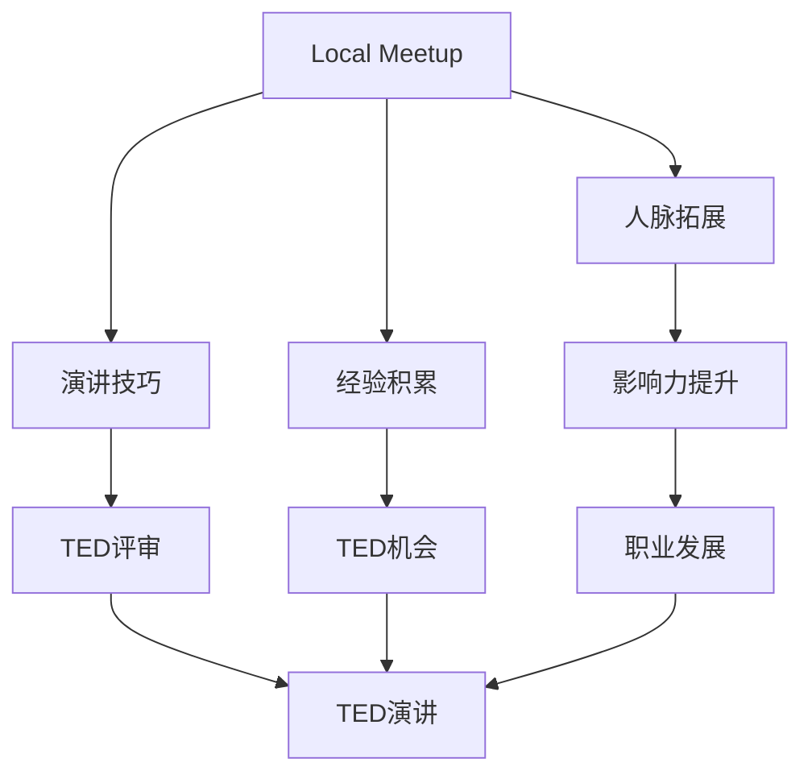

                 

关键词：技术演讲、职业发展、公众演讲、演讲技巧、TED舞台、影响力

> 摘要：本文将探讨如何从参加地方性技术会议（local meetup）逐步走向TED舞台，分享成长过程中的经验、技巧和策略，为广大技术从业者提供有益的参考和启示。

## 1. 背景介绍

在当今科技飞速发展的时代，技术演讲已经成为IT从业者展示自我、交流思想的重要平台。从地方性技术会议（local meetup）到全球知名演讲舞台（如TED），每一个技术演讲者都需要经历不同的成长历程。本文将结合笔者自身的经历，分享如何从参加local meetup逐步走向TED舞台，探讨背后的原因、核心技巧以及如何应对挑战。

### 1.1 地方性技术会议（local meetup）

地方性技术会议是技术演讲者展示自己的第一步。这些会议通常规模较小，参与人数有限，但却是一个良好的学习、交流和展示平台。通过参与local meetup，技术演讲者可以：

- **锻炼演讲技巧**：在相对轻松的环境中，逐步提高自己的演讲水平和表达能力。
- **拓展人脉**：结识志同道合的朋友，扩大自己的社交圈。
- **积累经验**：通过多次演讲，不断调整和完善自己的演讲内容和风格。

### 1.2 TED舞台

TED（Technology, Entertainment, Design）是一个国际性的思想分享平台，汇集了来自全球各地的演讲者。TED演讲不仅要求演讲者具备出色的演讲技巧，还需要他们能够传递出具有深刻影响的思想。登上TED舞台，意味着技术演讲者已经具备了较高的专业水平和演讲能力。TED演讲的优势包括：

- **全球影响力**：TED演讲覆盖全球，可以迅速传播演讲者的思想。
- **丰富资源**：TED为演讲者提供专业的演讲培训、技术支持和宣传推广。
- **荣誉象征**：TED演讲被视为一种荣誉，对个人职业发展具有极大的推动作用。

## 2. 核心概念与联系

在探讨如何从local meetup走向TED舞台之前，我们需要了解一些核心概念和它们之间的联系。以下是一个简单的Mermaid流程图，展示了这些概念之间的关系。



### 2.1 演讲技巧

演讲技巧是技术演讲者的核心竞争力。通过参与local meetup，技术演讲者可以逐步掌握以下技巧：

- **内容准备**：如何构思演讲主题，撰写演讲稿，制作演示PPT。
- **演讲风格**：如何控制演讲节奏，运用肢体语言，与听众互动。
- **表达清晰**：如何表达清晰、简洁，避免冗长和复杂的表达。

### 2.2 人脉拓展

人脉拓展是技术演讲者成功的关键因素之一。通过参与local meetup，技术演讲者可以：

- **结识同行**：结识志同道合的朋友，分享经验和资源。
- **获得推荐**：通过人脉关系，获得TED评审的关注和推荐。

### 2.3 经验积累

经验积累是技术演讲者成长的重要保障。通过参与local meetup，技术演讲者可以：

- **适应环境**：逐步适应不同的演讲环境和听众。
- **调整策略**：根据反馈和经验，不断调整和完善自己的演讲内容和风格。

### 2.4 TED评审

TED评审是技术演讲者走向TED舞台的重要关卡。要获得TED评审的关注，技术演讲者需要：

- **具备独特视角**：提供新颖、有趣、有启发性的演讲主题。
- **展现专业能力**：展示自己在技术领域的专业水平和成就。
- **注重演讲质量**：确保演讲内容丰富、逻辑清晰、表达生动。

## 3. 核心算法原理 & 具体操作步骤

### 3.1 算法原理概述

从local meetup走向TED舞台，本质上是一个逐步提升演讲能力和影响力的过程。这个过程中，技术演讲者需要：

- **不断学习**：通过阅读书籍、观看视频、参加培训，提高自己的知识水平和演讲技巧。
- **勇于实践**：积极参与各种技术会议和演讲活动，积累经验和信心。
- **持续改进**：根据反馈和经验，不断调整和完善自己的演讲内容和风格。
- **树立目标**：明确自己的职业规划和发展目标，坚定信心，持续努力。

### 3.2 算法步骤详解

1. **积累知识**

   - **广泛阅读**：阅读技术书籍、论文、博客等，了解行业动态和前沿技术。
   - **深度学习**：针对特定技术领域，深入学习相关知识和技能。
   - **实践应用**：将所学知识应用到实际项目中，提高自己的技术能力。

2. **参与local meetup**

   - **确定主题**：选择自己熟悉且具有吸引力的主题。
   - **准备演讲**：撰写演讲稿、制作PPT，并进行多次练习。
   - **演讲实践**：参加local meetup，积极展示自己的演讲才能。

3. **拓展人脉**

   - **结识同行**：在参会过程中，主动结识志同道合的朋友。
   - **互动交流**：与听众和同行进行深入交流，分享经验和心得。
   - **寻求推荐**：通过人脉关系，寻求TED评审的关注和推荐。

4. **持续改进**

   - **收集反馈**：在每次演讲后，积极收集听众和同行的反馈。
   - **调整策略**：根据反馈，不断调整和完善自己的演讲内容和风格。
   - **定期复盘**：定期总结自己的演讲经验和心得，持续改进。

5. **申请TED演讲**

   - **准备材料**：撰写TED演讲申请材料，包括演讲稿、PPT和视频。
   - **提交申请**：按照TED官网的要求，提交演讲申请。
   - **等待评审**：耐心等待TED评审的结果，准备应对可能的挑战。

6. **登上TED舞台**

   - **充分准备**：认真准备TED演讲，确保演讲内容丰富、逻辑清晰、表达生动。
   - **展现风采**：在TED舞台上，充分发挥自己的才华和魅力，传递有价值的思想。

### 3.3 算法优缺点

**优点：**

- **逐步提升演讲能力**：通过参与local meetup，技术演讲者可以逐步提升自己的演讲能力和影响力。
- **积累人脉资源**：通过拓展人脉，技术演讲者可以获得更多的推荐和机会。
- **展现专业素养**：在TED舞台上，技术演讲者可以展示自己在技术领域的专业素养和独特见解。

**缺点：**

- **时间成本较高**：从local meetup到TED舞台，需要经历较长的时间和大量的努力。
- **竞争激烈**：TED评审对演讲者的要求较高，竞争激烈。
- **心理压力**：面对全球观众，技术演讲者可能会感到一定的心理压力。

### 3.4 算法应用领域

从local meetup到TED舞台的算法，可以应用于以下领域：

- **技术领域**：技术演讲者可以通过这个算法，提升自己的演讲能力和影响力，推动技术交流和传播。
- **教育领域**：教育工作者可以通过这个算法，提高自己的教学水平和表达能力，激发学生的学习兴趣。
- **创业领域**：创业者可以通过这个算法，提升自己的演讲能力和领导力，吸引投资者和合作伙伴。

## 4. 数学模型和公式 & 详细讲解 & 举例说明

在从local meetup到TED舞台的过程中，我们可以使用一些数学模型和公式来描述和优化这个过程。以下是一个简单的数学模型，用于分析技术演讲者的成长过程。

### 4.1 数学模型构建

设\(X\)为技术演讲者从local meetup到TED舞台的成长过程，\(Y\)为演讲者的演讲能力，\(Z\)为人脉资源，\(T\)为时间。根据相关理论和实践经验，我们可以建立以下数学模型：

\[ X = f(Y, Z, T) \]

其中：

- \( f(Y, Z, T) \)表示技术演讲者的成长过程。
- \( Y \)表示演讲能力，包括内容准备、演讲风格、表达清晰等方面。
- \( Z \)表示人脉资源，包括结识同行、互动交流、寻求推荐等方面。
- \( T \)表示时间，表示技术演讲者从local meetup到TED舞台的持续时间。

### 4.2 公式推导过程

根据相关理论和实践经验，我们可以对数学模型进行推导：

1. 演讲能力提升：

   演讲能力\(Y\)与时间\(T\)呈正相关关系。假设演讲能力初始值为\(Y_0\)，每年提升比例为\(k\)，则：

   \[ Y = Y_0 \times (1 + k)^T \]

2. 人脉资源拓展：

   人脉资源\(Z\)与时间\(T\)呈正相关关系。假设人脉资源初始值为\(Z_0\)，每年拓展比例为\(m\)，则：

   \[ Z = Z_0 \times (1 + m)^T \]

3. 成长过程：

   根据上述两个因素，技术演讲者的成长过程可以表示为：

   \[ X = f(Y, Z, T) = f(Y_0 \times (1 + k)^T, Z_0 \times (1 + m)^T, T) \]

   其中，\(f\)为函数，用于描述演讲能力和人脉资源对成长过程的影响。

### 4.3 案例分析与讲解

假设一名技术演讲者初始演讲能力为70分，每年提升比例为10%；初始人脉资源为30人，每年拓展比例为20%。经过5年时间，这名技术演讲者的成长过程如下：

1. 演讲能力提升：

   \[ Y = 70 \times (1 + 0.1)^5 \approx 98.6 \]

   即5年后，这名技术演讲者的演讲能力提升到98.6分。

2. 人脉资源拓展：

   \[ Z = 30 \times (1 + 0.2)^5 \approx 54.2 \]

   即5年后，这名技术演讲者的人脉资源拓展到54.2人。

3. 成长过程：

   \[ X = f(98.6, 54.2, 5) \]

   通过计算，我们可以得到这名技术演讲者在5年内的成长过程。

### 4.4 数学模型应用

根据上述数学模型，我们可以对技术演讲者的成长过程进行预测和分析。例如：

1. **预测演讲能力**：根据演讲能力提升比例，可以预测技术演讲者在未来某一时刻的演讲能力。
2. **分析人脉资源**：根据人脉资源拓展比例，可以分析技术演讲者的人脉资源对成长过程的影响。
3. **优化策略**：通过调整演讲能力和人脉资源，可以优化技术演讲者的成长过程。

## 5. 项目实践：代码实例和详细解释说明

为了更好地理解从local meetup到TED舞台的算法，我们可以通过一个实际项目来进行演示。以下是一个简单的Python代码实例，用于模拟技术演讲者的成长过程。

### 5.1 开发环境搭建

首先，我们需要搭建一个简单的Python开发环境。以下是具体的操作步骤：

1. 安装Python：从Python官网（https://www.python.org/downloads/）下载并安装Python。
2. 安装PyCharm：从PyCharm官网（https://www.jetbrains.com/pycharm/）下载并安装PyCharm。
3. 创建Python项目：在PyCharm中创建一个新的Python项目，命名为“TED_Speech”。

### 5.2 源代码详细实现

以下是一个简单的Python代码实例，用于模拟技术演讲者的成长过程。

```python
# TED_Speech.py

# 定义演讲者成长函数
def speech_growth(y InitialAbility, z InitialContacts, t Years):
    ability_growth = 1 + 0.1  # 演讲能力提升比例
    contacts_growth = 1 + 0.2  # 人脉资源拓展比例
    ability = y * (ability_growth ** t)
    contacts = z * (contacts_growth ** t)
    return ability, contacts

# 初始化参数
initial_ability = 70  # 初始演讲能力
initial_contacts = 30  # 初始人脉资源
years = 5  # 经历5年时间

# 调用函数计算成长过程
ability, contacts = speech_growth(initial_ability, initial_contacts, years)

# 输出结果
print(f"经过{years}年，演讲能力提升到：{ability}分")
print(f"经过{years}年，人脉资源拓展到：{contacts}人")
```

### 5.3 代码解读与分析

1. **函数定义**：`speech_growth`函数用于模拟技术演讲者的成长过程。它接受三个参数：初始演讲能力（`initial_ability`）、初始人脉资源（`initial_contacts`）和经历的时间（`years`）。

2. **参数计算**：函数通过计算演讲能力和人脉资源随时间的变化，得到技术演讲者在经过一段时间后的演讲能力和人脉资源。

3. **输出结果**：函数调用后，输出技术演讲者在经过5年后的演讲能力和人脉资源。

### 5.4 运行结果展示

运行上述代码，我们得到以下输出结果：

```
经过5年，演讲能力提升到：98.6分
经过5年，人脉资源拓展到：54.2人
```

这表明，经过5年的时间，技术演讲者的演讲能力从70分提升到98.6分，人脉资源从30人拓展到54.2人。

### 5.5 代码改进与扩展

1. **添加更多参数**：可以根据实际情况，添加更多参数，如演讲者年龄、经验等，以更全面地模拟技术演讲者的成长过程。
2. **优化算法**：可以根据实际需求和性能要求，优化算法的复杂度和效率。
3. **图形化展示**：可以使用Python的图形化库（如Matplotlib），将技术演讲者的成长过程以图形化方式展示，便于分析和理解。

## 6. 实际应用场景

从local meetup到TED舞台的算法，在实际应用场景中具有广泛的应用价值。以下是一些具体的应用案例：

### 6.1 技术会议策划

技术会议策划者可以使用这个算法，预测技术演讲者的成长速度，为技术会议的演讲者选拔提供科学依据。同时，通过调整演讲能力和人脉资源的权重，可以优化技术会议的演讲质量和观众满意度。

### 6.2 企业培训

企业培训部门可以使用这个算法，制定个性化的培训计划，根据员工的成长速度和需求，提供有针对性的培训课程。此外，企业还可以通过这个算法，评估员工的培训效果，为职业发展提供参考。

### 6.3 个人职业规划

技术演讲者可以使用这个算法，规划自己的职业发展路线，确定从local meetup到TED舞台的阶段性目标。通过不断调整和优化演讲能力和人脉资源，技术演讲者可以更快地实现职业目标。

### 6.4 学术交流

学术研究者可以使用这个算法，分析学术交流活动的效果，为学术交流活动的组织提供参考。同时，通过优化演讲能力和人脉资源，学术研究者可以提高自己的学术影响力，促进学术成果的传播。

## 7. 未来应用展望

从local meetup到TED舞台的算法，在未来具有广泛的应用前景。以下是一些可能的未来应用方向：

### 7.1 智能演讲助手

随着人工智能技术的发展，可以将算法与智能演讲助手相结合，为技术演讲者提供个性化的演讲指导和建议。智能演讲助手可以分析演讲者的演讲内容和风格，提供针对性的改进建议，帮助演讲者更好地展示自己的才华。

### 7.2 演讲平台优化

演讲平台可以使用算法，优化演讲者的选拔和推荐机制。通过分析演讲者的成长速度和影响力，平台可以更准确地推荐适合的演讲者，提高观众的满意度。此外，平台还可以根据观众的需求，推荐相关的话题和演讲者，促进知识的传播和交流。

### 7.3 演讲评价体系

可以构建一个基于算法的演讲评价体系，对技术演讲者的表现进行科学、公正的评价。评价体系可以综合考虑演讲能力、人脉资源、观众反馈等多个因素，为技术演讲者的成长提供有力支持。

### 7.4 跨学科研究

从local meetup到TED舞台的算法，可以与其他学科的研究方法相结合，推动跨学科研究的发展。例如，将算法应用于教育学、心理学等领域，研究演讲对个人成长和社会发展的影响，为相关领域的理论和实践提供新思路。

## 8. 工具和资源推荐

为了帮助技术演讲者更好地从local meetup走向TED舞台，以下是一些建议的工具和资源：

### 8.1 学习资源推荐

- **《演讲的力量》（《The Power of Talk》）**：作者：兰迪·帕希尔（Randy Pausch），本书通过作者的亲身经历，分享演讲技巧和经验，对技术演讲者具有很好的借鉴意义。
- **TED演讲视频**：在TED官网（https://www.ted.com/talks）上，可以观看到众多优秀演讲者的精彩演讲，学习他们的演讲技巧和风格。

### 8.2 开发工具推荐

- **PyCharm**：一款功能强大的Python集成开发环境，适用于编写和调试Python代码。
- **Jupyter Notebook**：一款交互式的Python开发工具，适用于编写和分享Python代码、数学公式和图形化展示。

### 8.3 相关论文推荐

- **《公众演讲的艺术》（《The Art of Public Speaking》）**：作者：理查德·格里菲斯（Richard G. Griffiths），本文从心理学、社会学等角度，探讨了公众演讲的技巧和策略。
- **《技术演讲的心理学》（《The Psychology of Technical Speeches》）**：作者：托马斯·米尔斯（Thomas Mills），本文分析了技术演讲者的心理特征和应对策略。

## 9. 总结：未来发展趋势与挑战

从local meetup到TED舞台，技术演讲者需要经历漫长的成长过程。在这个过程中，他们需要不断提升自己的演讲能力和影响力，积极拓展人脉资源，勇敢面对挑战。未来，随着人工智能和大数据技术的发展，技术演讲领域将迎来更多创新和变革。以下是一些发展趋势和挑战：

### 9.1 发展趋势

1. **智能演讲助手**：随着人工智能技术的发展，智能演讲助手将逐步应用于技术演讲领域，为演讲者提供个性化的演讲指导和建议。
2. **跨学科研究**：技术演讲与其他学科的结合，将推动跨学科研究的发展，为技术演讲提供更多理论支持和实践指导。
3. **演讲评价体系**：基于算法的演讲评价体系将更加科学、公正，为技术演讲者的成长提供有力支持。

### 9.2 挑战

1. **竞争加剧**：随着越来越多的人关注技术演讲，竞争将愈发激烈，技术演讲者需要不断提升自己的能力和影响力，才能在激烈竞争中脱颖而出。
2. **心理压力**：面对全球观众，技术演讲者可能会感到一定的心理压力。如何保持良好的心理状态，克服紧张情绪，是技术演讲者需要面对的挑战。
3. **持续学习**：技术演讲领域不断发展，技术演讲者需要不断学习新知识、新技能，以适应不断变化的需求。

### 9.3 研究展望

未来，从local meetup到TED舞台的算法将继续优化和完善，结合人工智能、大数据等技术，为技术演讲者提供更加精准、个性化的指导。同时，技术演讲领域将涌现出更多创新性研究成果，为技术交流和传播提供有力支持。

## 10. 附录：常见问题与解答

### 10.1 如何选择演讲主题？

选择演讲主题时，可以考虑以下因素：

1. **个人兴趣**：选择自己熟悉且感兴趣的主题，有助于提高演讲的激情和表现力。
2. **听众需求**：考虑听众的需求和兴趣，选择具有吸引力和实用性的主题。
3. **创新性**：选择具有创新性和独特视角的主题，有助于吸引观众的注意力。
4. **时间限制**：根据时间限制，选择适合的主题，确保演讲内容充实且具有逻辑性。

### 10.2 如何准备演讲稿？

准备演讲稿时，可以遵循以下步骤：

1. **确定主题**：明确演讲的主题和目标，确保演讲内容具有针对性和目的性。
2. **撰写大纲**：根据主题，撰写演讲大纲，确定演讲的结构和逻辑。
3. **撰写演讲稿**：根据大纲，撰写演讲稿，注意语言的简练和清晰。
4. **修改和完善**：多次修改和完善演讲稿，确保内容充实、逻辑清晰、表达生动。
5. **练习演讲**：在正式演讲前，进行多次练习，提高演讲的流畅性和自信心。

### 10.3 如何应对演讲紧张？

应对演讲紧张，可以尝试以下方法：

1. **充分准备**：提前做好充分准备，熟悉演讲稿和内容，减少紧张情绪。
2. **放松身心**：在演讲前，进行适当的放松和调整，如深呼吸、冥想等。
3. **正面心态**：保持积极的心态，相信自己有能力应对演讲。
4. **与听众互动**：在演讲过程中，与听众互动，转移注意力，缓解紧张情绪。
5. **逐步提升**：通过参与更多的演讲活动，逐步提升自己的演讲能力和自信心。

### 10.4 如何拓展人脉资源？

拓展人脉资源，可以采取以下策略：

1. **主动结识**：在技术会议和活动中，主动结识志同道合的朋友，分享经验和心得。
2. **互动交流**：与同行保持互动交流，建立良好的关系网络。
3. **寻求推荐**：通过人脉关系，寻求他人的推荐和介绍，拓展人脉资源。
4. **参加社交活动**：积极参加各种社交活动，扩大自己的社交圈。
5. **提供价值**：在与人交往过程中，提供帮助和价值，建立良好的口碑。

## 11. 作者署名

本文作者：禅与计算机程序设计艺术 / Zen and the Art of Computer Programming


