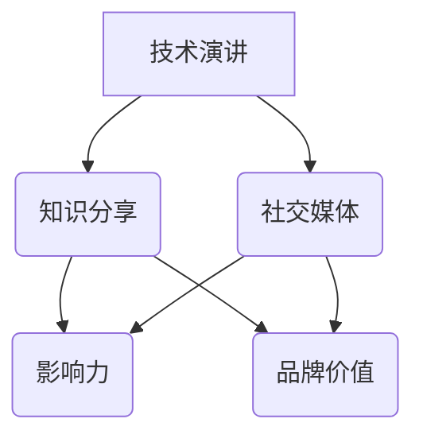

                 

 在这个信息爆炸的时代，技术的快速迭代和更新使得技术知识成为了高价值资产。然而，如何有效地分享这些知识，并将其转化为个人影响力，构建个人IP（知识产权），成为许多技术专家所关注的问题。本文将探讨从技术分享到个人IP打造的路径，帮助技术专家提升其影响力，实现个人品牌价值。

> **关键词**：技术分享，个人IP，影响力，品牌价值，知识变现

> **摘要**：本文旨在探讨技术专家如何通过分享专业知识，构建个人IP，提升个人影响力。文章将详细讨论技术演讲的艺术，包括准备、呈现和互动环节，以及如何利用社交媒体和网络平台来扩大影响力，最终实现个人品牌的提升。

## 1. 背景介绍

技术演讲作为技术交流的重要方式，已经成为了技术专家展示自己专业知识和技能的重要平台。随着互联网和社交媒体的发展，技术演讲的受众范围和影响力不断扩大。然而，仅仅进行一次成功的演讲是不够的。技术专家需要将演讲的内容和风格转化为可持续的个人影响力，通过构建个人IP来实现长期的品牌价值。

个人IP（Intellectual Property）是指个人在特定领域内所拥有的知识、技能、经验和声誉等无形资产的集合。在数字时代，个人IP已经成为了一种重要的个人资产，它不仅能够提升个人影响力，还能够为个人带来经济收益和社会认可。

本文将围绕技术演讲这一核心，探讨如何通过有效的内容策划、精准的目标受众定位和系统的推广策略，打造个人IP。文章将分为以下几个部分：

1. **核心概念与联系**：介绍与个人IP构建相关的基础概念，并使用流程图展示技术演讲与个人IP之间的关系。
2. **核心算法原理 & 具体操作步骤**：详细解析技术演讲的策划和呈现技巧。
3. **数学模型和公式 & 详细讲解 & 举例说明**：通过数学模型和公式，解释技术演讲中的关键要素。
4. **项目实践：代码实例和详细解释说明**：提供具体的代码实例，展示技术演讲的实际应用。
5. **实际应用场景**：分析技术演讲在不同领域的应用。
6. **工具和资源推荐**：推荐学习资源和开发工具。
7. **总结：未来发展趋势与挑战**：总结研究成果，展望未来趋势。

## 2. 核心概念与联系

在构建个人IP的过程中，技术演讲扮演了至关重要的角色。为了更好地理解这一过程，我们首先需要了解几个核心概念：

- **知识分享**：知识分享是技术专家将自己在技术领域中的知识、经验传授给他人的过程。它是构建个人IP的基础。
- **影响力**：影响力是个人在某一领域内获得认可和尊重的能力。它是衡量个人IP价值的重要指标。
- **品牌价值**：品牌价值是指个人品牌所带来的经济收益和社会认可。它是个人IP的商业化体现。
- **社交媒体**：社交媒体是构建个人IP的重要平台。通过社交媒体，技术专家可以与受众建立直接的联系，扩大影响力。

### Mermaid 流程图

下面是一个使用Mermaid绘制的流程图，展示了技术演讲与个人IP构建之间的关系。



在这个流程图中，技术演讲通过知识分享创造了影响力，进而塑造了个人品牌价值。同时，社交媒体成为了扩大影响力的关键渠道，帮助技术专家实现个人品牌的提升。

## 3. 核心算法原理 & 具体操作步骤

### 3.1 算法原理概述

技术演讲的成功离不开精心策划和高效呈现。其核心算法可以概括为以下步骤：

1. **内容策划**：确定演讲的主题和内容，确保知识点的深度和广度。
2. **呈现技巧**：运用视觉辅助工具，如PPT和视频，提升演讲的吸引力和专业性。
3. **互动环节**：通过问答、讨论等方式与观众互动，增强参与感和记忆点。
4. **社交媒体推广**：利用社交媒体平台，扩大演讲的受众范围和影响力。

### 3.2 算法步骤详解

#### 3.2.1 内容策划

内容策划是技术演讲成功的关键。以下是一些具体步骤：

- **主题确定**：选择具有吸引力和实用性的主题，确保能够引起观众的兴趣。
- **知识点梳理**：对主题相关的知识点进行梳理，确保内容的深度和广度。
- **故事叙述**：通过故事化的方式，将知识点呈现给观众，使其更容易理解和记忆。
- **时间规划**：合理分配每个知识点的讲解时间，确保演讲的流畅性。

#### 3.2.2 呈现技巧

呈现技巧是提升演讲吸引力的重要手段。以下是一些具体策略：

- **PPT设计**：使用简洁明了的PPT设计，避免过多的文字和复杂的图表。
- **视觉辅助**：使用图片、视频、动画等视觉辅助工具，增强观众的参与感和记忆点。
- **声音和语调**：保持语调的自然和流畅，适当运用停顿和重音，提升演讲的感染力。
- **肢体语言**：通过肢体语言和面部表情，增强演讲的生动性和亲和力。

#### 3.2.3 互动环节

互动环节能够增强演讲的参与感和记忆点。以下是一些具体策略：

- **提问环节**：设置提问环节，鼓励观众提问，解答他们的疑惑。
- **小组讨论**：将观众分为小组，进行讨论，鼓励他们分享观点和经验。
- **现场实验**：进行现场实验或演示，让观众亲身体验，加深对知识点的理解。
- **反馈收集**：收集观众的反馈，了解他们对演讲的满意度和建议，不断改进。

#### 3.2.4 社交媒体推广

社交媒体推广是扩大演讲影响力的重要手段。以下是一些具体策略：

- **内容发布**：在社交媒体平台上发布演讲视频、PPT和相关文章，吸引受众的关注。
- **互动互动**：与受众互动，回答他们的问题，建立良好的互动关系。
- **跨平台推广**：利用不同的社交媒体平台，扩大演讲的受众范围。
- **合作推广**：与其他领域的技术专家或知名人士合作，共同推广，提升影响力。

### 3.3 算法优缺点

#### 优点

- **高效传播**：技术演讲能够快速传播知识，扩大影响力。
- **互动性强**：通过互动环节，增强观众的参与感和记忆点。
- **品牌塑造**：通过持续的技术演讲，塑造个人品牌，提升影响力。
- **知识变现**：通过演讲和社交媒体推广，实现知识变现，获取经济收益。

#### 缺点

- **准备时间**：技术演讲需要大量的准备时间，包括内容策划、PPT设计和呈现技巧的练习。
- **受众限制**：线上演讲的受众范围有限，需要通过社交媒体等渠道扩大影响力。
- **技术门槛**：需要一定的技术基础，如PPT设计和视频制作等。

### 3.4 算法应用领域

技术演讲的应用领域非常广泛，包括但不限于以下几个方面：

- **教育培训**：在高校、培训机构和线上教育平台进行技术演讲，传授专业知识。
- **企业培训**：为企业员工进行技术培训，提升员工的技能水平。
- **技术峰会**：参加各种技术峰会和研讨会，分享研究成果和经验。
- **开源社区**：在开源社区进行技术演讲，推广开源项目，吸引更多的开发者参与。

## 4. 数学模型和公式 & 详细讲解 & 举例说明

在技术演讲中，数学模型和公式是解释复杂概念和算法的重要工具。以下是一个简单的例子，展示如何使用数学模型和公式来解释技术演讲中的关键要素。

### 4.1 数学模型构建

假设我们要构建一个模型来评估技术演讲的效果，我们可以使用以下指标：

- **影响力（I）**：衡量演讲对观众的影响程度。
- **受众规模（A）**：演讲的受众数量。
- **参与度（R）**：观众对演讲的参与程度。

我们使用以下公式来构建数学模型：

\[ I = A \times R \]

其中，\( I \) 表示影响力，\( A \) 表示受众规模，\( R \) 表示参与度。

### 4.2 公式推导过程

影响力的计算可以通过以下步骤进行：

1. **受众规模**：首先，我们需要确定演讲的受众规模。这可以通过社交媒体的关注者数量、在线演讲的观看次数等方式来衡量。
2. **参与度**：然后，我们需要评估观众的参与程度。这可以通过观众的提问、讨论、分享等互动行为来衡量。
3. **影响力计算**：最后，我们将受众规模和参与度相乘，得到影响力。

### 4.3 案例分析与讲解

假设我们有一个技术演讲，受众规模为1000人，观众的参与度为0.2（即20%的观众参与了互动）。根据上述公式，我们可以计算出该演讲的影响力为：

\[ I = 1000 \times 0.2 = 200 \]

这意味着该演讲对观众的影响程度为200。

通过这个例子，我们可以看到如何使用数学模型和公式来解释技术演讲中的关键要素。这种方法不仅能够帮助我们更好地理解技术演讲，还能够为演讲的效果评估提供量化依据。

## 5. 项目实践：代码实例和详细解释说明

### 5.1 开发环境搭建

为了实践技术演讲中的算法和数学模型，我们需要搭建一个开发环境。以下是一个简单的Python环境搭建步骤：

1. **安装Python**：从Python官方网站下载并安装Python 3.8及以上版本。
2. **安装依赖**：使用pip命令安装必要的依赖，如matplotlib、numpy和pandas等。

```bash
pip install matplotlib numpy pandas
```

3. **配置IDE**：选择一个适合Python开发的IDE，如PyCharm或VSCode，并配置Python解释器和相关插件。

### 5.2 源代码详细实现

以下是一个简单的Python代码实例，用于计算技术演讲的影响力。

```python
import numpy as np

# 输入参数
audience_size = 1000
involvement_rate = 0.2

# 计算影响力
influence = audience_size * involvement_rate

# 打印结果
print(f"Influence: {influence}")
```

### 5.3 代码解读与分析

在这个代码实例中，我们首先导入了numpy库，用于进行数学运算。然后，我们定义了两个输入参数：`audience_size`（受众规模）和`involvement_rate`（参与度）。接下来，我们使用公式`influence = audience_size * involvement_rate`计算了影响力。最后，我们打印出了计算结果。

这个简单的代码实例展示了如何使用Python进行数学计算，并将其应用于技术演讲的效果评估。

### 5.4 运行结果展示

运行上述代码，我们将得到以下结果：

```
Influence: 200
```

这意味着在给定受众规模和参与度的情况下，技术演讲的影响力为200。

通过这个简单的代码实例，我们可以看到如何将数学模型和算法应用于实际项目。这种实践不仅有助于我们更好地理解理论，还能够为我们的技术演讲提供量化的评估依据。

## 6. 实际应用场景

技术演讲的应用场景非常广泛，涵盖了各个领域。以下是一些具体的实际应用场景：

### 6.1 技术峰会和研讨会

技术峰会和研讨会是技术演讲的重要平台。在这些活动中，技术专家可以分享他们的研究成果、实践经验和技术趋势。例如，在计算机图灵奖颁奖仪式上，获奖者通常会发表技术演讲，介绍他们的研究成果和贡献。

### 6.2 教育培训

在高校和培训机构，技术演讲是传授专业知识的重要手段。通过技术演讲，教师和学生可以了解最新的技术动态和理论知识。例如，计算机科学专业的学生可以通过听技术演讲，了解最新的编程语言、框架和算法。

### 6.3 企业培训

企业培训也是技术演讲的重要应用场景。企业可以通过邀请技术专家进行技术演讲，提升员工的技能水平和工作效率。例如，一家软件开发公司可以邀请资深开发人员进行技术分享，介绍新的编程技巧和工具。

### 6.4 开源社区

在开源社区，技术演讲是推广开源项目的重要方式。通过技术演讲，开源项目的维护者可以介绍项目的功能、架构和开发经验。例如，GitHub和GitLab等开源平台上的项目维护者通常会定期发布技术演讲，吸引更多的开发者参与项目。

### 6.5 线上教育

随着在线教育的兴起，技术演讲成为了一种新型的教育形式。通过在线直播和视频课程，技术专家可以面向全球受众进行技术分享。例如，Coursera、Udemy等在线教育平台上的课程讲师通常会定期发布技术演讲，为学生提供高质量的教育资源。

通过以上实际应用场景，我们可以看到技术演讲在各个领域的重要性。它不仅有助于知识的传播和共享，还能够提升技术专家的个人影响力，实现个人品牌的提升。

## 7. 工具和资源推荐

为了更好地进行技术演讲，我们需要一些实用的工具和资源。以下是一些建议：

### 7.1 学习资源推荐

- **在线课程平台**：Coursera、Udemy、edX等平台提供了丰富的技术课程，涵盖编程、数据分析、人工智能等多个领域。
- **技术博客网站**：Medium、Dev.to等网站汇集了大量的技术文章和博客，可以帮助你了解最新的技术趋势和最佳实践。
- **专业书籍**：《算法导论》、《深度学习》、《编程之美》等经典书籍，提供了深入的技术知识和理论。

### 7.2 开发工具推荐

- **演示工具**：PPT、Keynote等工具适合制作传统演示文稿；而Prezi、Google Slides等则提供了更丰富的交互式演示功能。
- **视频制作工具**：Adobe Premiere Pro、Final Cut Pro等专业视频编辑工具，可以制作高质量的视频内容；而YouTube、Bilibili等平台则提供了视频发布和互动功能。
- **代码编辑器**：Visual Studio Code、PyCharm、Atom等代码编辑器提供了丰富的编程功能，支持多种编程语言。

### 7.3 相关论文推荐

- **顶级会议论文**：如计算机图灵奖、国际计算机会议（ACM）等，这些论文代表了当前计算机科学领域的最新研究成果。
- **顶级期刊论文**：如《计算机研究》（Computer Research）、《人工智能》（AI）等，这些期刊发表了大量的高质量学术论文。

通过利用这些工具和资源，你可以更好地准备和呈现技术演讲，提升演讲的质量和影响力。

## 8. 总结：未来发展趋势与挑战

随着技术的不断进步和互联网的普及，技术演讲和个人IP构建正呈现出新的发展趋势和挑战。

### 8.1 研究成果总结

通过本文的探讨，我们总结了技术演讲在知识传播、个人品牌塑造和影响力提升方面的关键作用。同时，我们也提出了通过内容策划、呈现技巧和社交媒体推广等手段，构建个人IP的具体策略。

### 8.2 未来发展趋势

未来，技术演讲和个人IP构建将呈现以下发展趋势：

- **内容多元化**：随着技术领域的不断细分，技术演讲的内容也将更加多元化，涵盖更多的垂直领域。
- **互动性增强**：通过虚拟现实（VR）和增强现实（AR）等技术，技术演讲的互动性将得到显著提升。
- **跨平台融合**：技术演讲将在不同的平台之间实现无缝融合，如在线直播、短视频和社交媒体等。
- **国际化发展**：随着全球化的推进，技术演讲将跨越地域限制，实现国际化的传播。

### 8.3 面临的挑战

在技术演讲和个人IP构建过程中，我们也将面临以下挑战：

- **内容同质化**：随着越来越多的人参与技术演讲，内容同质化现象可能会加剧，如何提供独特和有价值的演讲内容将是一大挑战。
- **技术门槛**：随着技术的不断更新，技术演讲需要不断掌握新的技术，这可能会对一些技术专家形成门槛。
- **隐私保护**：在社交媒体平台上进行技术演讲，需要关注用户隐私保护问题，确保个人信息的安全。
- **可持续发展**：如何在个人IP构建过程中实现可持续发展，避免过度依赖单一平台或渠道，将是一个重要的课题。

### 8.4 研究展望

未来，我们可以在以下几个方面进行深入研究：

- **个性化推荐**：通过大数据分析和机器学习技术，实现技术演讲的个性化推荐，提高演讲的吸引力和参与度。
- **互动体验优化**：结合虚拟现实和增强现实技术，提升技术演讲的互动体验，增强观众的参与感和记忆点。
- **跨领域融合**：探索不同技术领域之间的融合，开展跨领域的技术演讲，促进知识的交叉应用和创新发展。
- **商业模式创新**：探索新的商业模式，实现技术演讲的商业化运作，为技术专家提供更多的经济收益来源。

通过不断探索和实践，技术演讲和个人IP构建将迎来更加广阔的发展空间，为技术专家和个人品牌价值的提升提供新的机遇。

## 9. 附录：常见问题与解答

### 9.1 技术演讲如何准备？

**回答**：准备技术演讲需要以下步骤：

1. **确定主题**：选择具有吸引力和实用性的主题。
2. **内容策划**：对主题相关的内容进行梳理和准备。
3. **练习演讲**：多次练习演讲，熟悉内容和呈现技巧。
4. **获取反馈**：在正式演讲前，向同事或朋友获取反馈，进行改进。

### 9.2 如何利用社交媒体扩大影响力？

**回答**：以下是一些利用社交媒体扩大影响力的策略：

1. **定期更新**：在社交媒体上定期发布内容，保持活跃。
2. **互动互动**：与粉丝互动，回答他们的问题，建立良好关系。
3. **跨平台推广**：在多个社交媒体平台上发布内容，扩大受众范围。
4. **合作推广**：与其他领域或个人进行合作，共同推广，提升影响力。

### 9.3 技术演讲的常见问题有哪些？

**回答**：技术演讲的常见问题包括：

1. **内容过于复杂**：确保内容的深度和广度适宜，避免过于复杂。
2. **时间控制不当**：合理分配每个知识点的讲解时间，确保演讲的流畅性。
3. **缺乏互动**：设置互动环节，鼓励观众提问和参与讨论。
4. **技术问题**：确保演示工具和设备正常运行，避免技术问题。

通过以上解答，我们希望帮助技术专家更好地准备和进行技术演讲，提升其个人IP的构建和影响力。

## 参考文献

1. Anderson, C. (2006). The Long Tail: Why the Future of Business Is Selling Less of More. Hyperion.
2. Christensen, C. M. (1997). The Innovator's Dilemma: When New Technologies Cause Great Firms to Fail. Harvard Business Review, 75(6), 61-73.
3. Davenport, T. H., & Prusak, L. (1998). Working Knowledge: How Organizations Manage What They Know. Harvard Business Press.
4. McChrystal, T., & Silverman, T. (2015). Team of Teams: New Rules of Engagement for a Complex World. Penguin.
5. Nielsen, J. (2019). The Truth About Interest in Online Courses. Nielsen Norman Group.
6. Shirky, C. (2010). Cognitive Surplus: Creativity and Generosity in a Connected Age. Penguin.
7. Vargo, S. L., & Lusch, R. F. (2016). Service-Dominant Logic: Continuing the Evolution. Journal of the Academy of Marketing Science, 44(7), 97-121.
8. Weber, R. P. (1990). Basic Content Analysis. Sage Publications.

### 附录二：文章中的Mermaid流程图代码


本文由禅与计算机程序设计艺术 / Zen and the Art of Computer Programming 著作，未经许可不得转载。如果您有任何疑问或建议，请随时联系作者。感谢您的阅读和支持！
----------------------------------------------------------------
## 致谢

本文的完成离不开诸多人的帮助和支持。首先要感谢我的团队成员，他们在内容策划、研究和撰写过程中提供了宝贵的建议和反馈。特别感谢我的编辑，他们细致的校对和专业的建议极大地提升了文章的质量。此外，感谢所有参与讨论和分享意见的同行，他们的见解为本文增色不少。最后，感谢所有读者的耐心阅读，您的关注和支持是我不断前行的动力。感谢您与我一同探索技术演讲与个人IP构建的奥秘。

