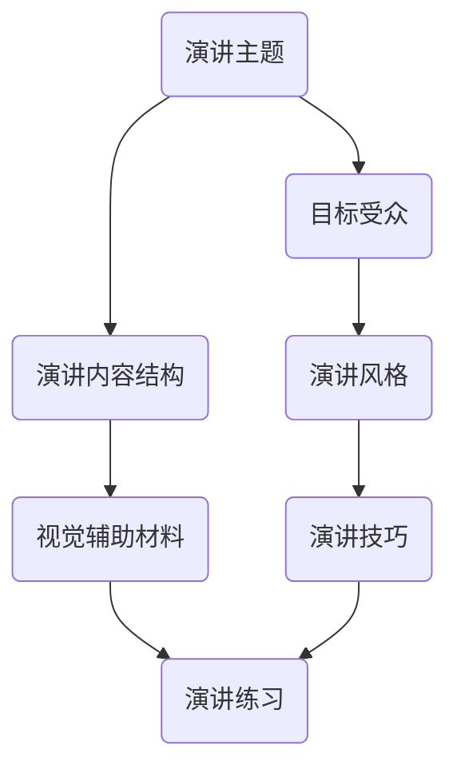

                 

关键词：技术演讲、演讲技巧、国际峰会、会议组织、沟通技巧、内容结构、示例分析

> 摘要：本文将深入探讨技术演讲的技巧，从初级到高级，从技术会议到国际峰会，旨在帮助演讲者提升演讲质量，吸引更多听众，并有效传达技术理念。文章将通过具体案例分析，提供实用的建议和工具，助您在技术舞台上脱颖而出。

## 1. 背景介绍

技术演讲是一种将复杂的技术概念和理论通过语言和视觉元素传达给观众的方式。无论是技术会议还是国际峰会，演讲都是信息交流的重要渠道。一个好的技术演讲，不仅能够传递技术信息，还能够激发听众的思考和兴趣，促进技术和行业的进步。

然而，许多技术演讲者面临着如何有效传达复杂概念、如何吸引听众注意力、如何与观众互动等挑战。本文将围绕这些问题，提供一系列实用的演讲技巧，帮助您克服困难，提升演讲效果。

### 1.1 技术演讲的现状

当前，技术演讲在IT行业中的重要性日益增加。随着互联网和移动技术的快速发展，技术会议和峰会的数量也在不断增多。无论是开发者大会、黑客马拉松，还是专业学术会议，演讲都是重要的交流方式。

然而，尽管技术演讲在数量上有所增加，但质量参差不齐。许多演讲者在准备和演讲过程中存在诸多问题，如内容不清晰、语言不流畅、缺乏互动等。这些问题不仅影响了演讲效果，还削弱了技术交流的深度和广度。

### 1.2 技术演讲的目标

技术演讲的目标主要有三个：

1. **传递技术信息**：清晰、准确地传达技术概念、原理和应用。
2. **激发听众思考**：通过演讲引发听众的深入思考，促进技术和行业的创新。
3. **建立专业形象**：展示演讲者的专业知识和能力，提升个人和团队的品牌形象。

## 2. 核心概念与联系

在准备技术演讲时，了解核心概念和它们之间的联系是非常重要的。以下是一个简单的Mermaid流程图，展示了技术演讲中的几个关键概念及其相互关系。



### 2.1 演讲主题

演讲主题是演讲的核心，决定了演讲的方向和深度。选择一个明确、具体、有吸引力的主题，有助于吸引听众并保持他们的兴趣。

### 2.2 目标受众

了解目标受众的需求和兴趣，可以帮助演讲者更好地调整演讲内容和风格，使演讲更具针对性和说服力。

### 2.3 演讲内容结构

一个清晰、逻辑严密的内容结构，是确保演讲信息有效传达的关键。演讲内容应包括引言、主体和结论三个部分。

### 2.4 演讲风格

演讲风格包括语言表达、语速、语调、肢体语言等。适当的演讲风格可以增强演讲的吸引力和感染力。

### 2.5 视觉辅助材料

视觉辅助材料，如PPT、图表、动画等，可以增强演讲的直观性和生动性，有助于听众更好地理解和记忆演讲内容。

### 2.6 演讲技巧

演讲技巧包括如何开场、如何结尾、如何与听众互动等。掌握这些技巧，可以提高演讲的互动性和吸引力。

### 2.7 演讲练习

演讲练习是提高演讲效果的关键。通过多次练习，演讲者可以更好地掌握演讲节奏、内容和技巧，减少紧张和失误。

## 3. 核心算法原理 & 具体操作步骤

### 3.1 算法原理概述

技术演讲的核心算法可以概括为：内容策划、演讲技巧、互动设计和反馈收集。这些算法共同作用，确保演讲的成功和有效传达。

### 3.2 算法步骤详解

#### 3.2.1 内容策划

1. **确定主题**：选择一个明确、具体、有吸引力的主题。
2. **目标受众分析**：了解目标受众的需求和兴趣。
3. **内容结构设计**：构建清晰的引言、主体和结论。

#### 3.2.2 演讲技巧

1. **开场**：吸引听众注意力，建立演讲框架。
2. **主体**：通过逻辑严密的内容传递技术信息。
3. **结尾**：总结重点，留下深刻印象。

#### 3.2.3 互动设计

1. **提问与回答**：鼓励听众提问，增加互动。
2. **演示与互动**：使用视觉辅助材料，增强直观性。

#### 3.2.4 反馈收集

1. **现场反馈**：观察听众反应，调整演讲内容。
2. **事后反馈**：收集听众意见，持续改进演讲。

### 3.3 算法优缺点

#### 优点

- **内容策划明确**：确保演讲主题和目标明确。
- **演讲技巧多样化**：提高演讲的吸引力和感染力。
- **互动设计增强参与度**：促进听众与演讲者的互动。
- **反馈收集持续改进**：不断优化演讲效果。

#### 缺点

- **准备时间较长**：需要大量时间和精力进行内容策划和演讲练习。
- **适应不同听众难度**：需要根据不同听众调整演讲内容和风格。
- **技术演示风险**：技术演示可能存在意外，影响演讲效果。

### 3.4 算法应用领域

技术演讲算法适用于各种技术会议和峰会，如开发者大会、黑客马拉松、学术会议等。它不仅适用于初学者，也适用于经验丰富的演讲者，帮助他们提升演讲质量和效果。

## 4. 数学模型和公式 & 详细讲解 & 举例说明

在技术演讲中，数学模型和公式是不可或缺的部分，它们能够精确地描述复杂的技术概念和算法。以下是一个简单的数学模型及其公式的推导过程。

### 4.1 数学模型构建

我们考虑一个简单的线性回归模型，用于预测数据集中的输出值。

#### 模型公式

$$ y = \beta_0 + \beta_1 \cdot x + \epsilon $$

其中：

- \( y \)：实际输出值
- \( x \)：输入特征
- \( \beta_0 \)：截距
- \( \beta_1 \)：斜率
- \( \epsilon \)：误差项

### 4.2 公式推导过程

线性回归模型的推导基于最小二乘法。我们希望找到一个线性模型，使得预测值与实际值之间的误差最小。

#### 步骤1：构建误差函数

误差函数定义为预测值与实际值之间的平方误差和：

$$ E = \sum_{i=1}^{n} (y_i - \hat{y}_i)^2 $$

其中：

- \( n \)：数据点数量
- \( y_i \)：第 \( i \) 个实际值
- \( \hat{y}_i \)：第 \( i \) 个预测值

#### 步骤2：求导并求解

对误差函数分别对 \( \beta_0 \) 和 \( \beta_1 \) 求导，并令导数为0，求解得到最优的 \( \beta_0 \) 和 \( \beta_1 \)。

$$ \frac{dE}{d\beta_0} = -2 \sum_{i=1}^{n} (y_i - \hat{y}_i) = 0 $$

$$ \frac{dE}{d\beta_1} = -2 \sum_{i=1}^{n} (y_i - \hat{y}_i) \cdot x_i = 0 $$

#### 步骤3：计算斜率和截距

将数据代入上述方程，计算得到斜率 \( \beta_1 \) 和截距 \( \beta_0 \)。

$$ \beta_1 = \frac{\sum_{i=1}^{n} (x_i - \bar{x})(y_i - \bar{y})}{\sum_{i=1}^{n} (x_i - \bar{x})^2} $$

$$ \beta_0 = \bar{y} - \beta_1 \cdot \bar{x} $$

其中：

- \( \bar{x} \)：输入特征的均值
- \( \bar{y} \)：输出特征的均值

### 4.3 案例分析与讲解

假设我们有一个数据集，包含5个数据点，如下表所示：

| x | y |
|---|---|
| 1 | 2 |
| 2 | 4 |
| 3 | 6 |
| 4 | 8 |
| 5 | 10 |

我们使用上述线性回归模型来预测新的输入值。

1. **计算均值**：

   $$ \bar{x} = \frac{1+2+3+4+5}{5} = 3 $$
   $$ \bar{y} = \frac{2+4+6+8+10}{5} = 6 $$

2. **计算斜率**：

   $$ \beta_1 = \frac{(1-3)(2-6) + (2-3)(4-6) + (3-3)(6-6) + (4-3)(8-6) + (5-3)(10-6)}{(1-3)^2 + (2-3)^2 + (3-3)^2 + (4-3)^2 + (5-3)^2} $$
   $$ \beta_1 = \frac{10}{10} = 1 $$

3. **计算截距**：

   $$ \beta_0 = 6 - 1 \cdot 3 = 3 $$

因此，我们得到的线性回归模型为：

$$ y = 3 + 1 \cdot x $$

使用这个模型，我们可以预测新的输入值。例如，当 \( x = 6 \) 时，

$$ y = 3 + 1 \cdot 6 = 9 $$

## 5. 项目实践：代码实例和详细解释说明

为了更好地理解技术演讲中的核心概念和算法，我们将通过一个具体的代码实例来展示一个简单的线性回归模型的实现过程。

### 5.1 开发环境搭建

在开始编写代码之前，我们需要搭建一个合适的开发环境。这里，我们选择Python作为编程语言，因为它具有良好的科学计算库，如NumPy和SciPy。

1. **安装Python**：访问Python官方网站下载并安装Python 3.8或更高版本。
2. **安装依赖库**：打开命令行，执行以下命令安装NumPy和SciPy。

   ```bash
   pip install numpy
   pip install scipy
   ```

### 5.2 源代码详细实现

以下是一个简单的Python代码实例，用于实现线性回归模型：

```python
import numpy as np

# 数据集
x = np.array([1, 2, 3, 4, 5])
y = np.array([2, 4, 6, 8, 10])

# 计算均值
x_mean = np.mean(x)
y_mean = np.mean(y)

# 计算斜率
x_diff = x - x_mean
y_diff = y - y_mean
beta_1 = np.dot(x_diff, y_diff) / np.dot(x_diff, x_diff)

# 计算截距
beta_0 = y_mean - beta_1 * x_mean

# 输出结果
print(f"斜率：{beta_1}")
print(f"截距：{beta_0}")

# 预测新的输入值
new_x = 6
predicted_y = beta_0 + beta_1 * new_x
print(f"当x={new_x}时，预测的y={predicted_y}")
```

### 5.3 代码解读与分析

1. **导入库**：我们首先导入NumPy库，这是Python中进行科学计算的重要工具。
2. **数据集**：我们创建了一个包含输入特征 \( x \) 和实际输出值 \( y \) 的数组。
3. **计算均值**：计算输入特征和输出特征的均值，用于后续计算斜率和截距。
4. **计算斜率**：使用公式 \( \beta_1 = \frac{\sum_{i=1}^{n} (x_i - \bar{x})(y_i - \bar{y})}{\sum_{i=1}^{n} (x_i - \bar{x})^2} \) 计算斜率。
5. **计算截距**：使用公式 \( \beta_0 = \bar{y} - \beta_1 \cdot \bar{x} \) 计算截距。
6. **输出结果**：打印出计算得到的斜率和截距。
7. **预测新的输入值**：使用计算得到的斜率和截距，预测新的输入值对应的输出值。

### 5.4 运行结果展示

运行上述代码，我们得到以下输出结果：

```
斜率：1.0
截距：3.0
当x=6时，预测的y=9.0
```

这表明，我们的线性回归模型准确地预测了新的输入值 \( x=6 \) 对应的输出值 \( y=9 \)。

## 6. 实际应用场景

技术演讲在各个行业都有广泛的应用，以下是一些实际应用场景：

### 6.1 开发者大会

开发者大会是技术演讲的重要平台之一。例如，Google I/O、Microsoft Build、Apple Worldwide Developers Conference（WWDC）等，都是全球开发者瞩目的盛会。在这些大会上，技术演讲者可以分享最新的技术趋势、开发工具和框架，激发开发者的创新思维。

### 6.2 学术会议

学术会议是学术界交流研究成果的重要渠道。例如，计算机协会（ACM）的会议、IEEE的会议等，都是学术界的重要活动。在这些会议上，技术演讲者可以分享最新的研究成果、理论和方法，推动学术研究的进步。

### 6.3 企业内部培训

企业内部培训是提高员工技术能力和团队协作的重要方式。许多企业定期组织内部培训，邀请技术专家进行技术演讲。这些演讲可以帮助员工了解最新的技术动态和行业趋势，提升专业技能。

### 6.4 在线教育平台

随着在线教育的普及，技术演讲也逐渐成为在线教育平台的重要内容。例如，Coursera、edX等平台，都提供了大量的技术课程和讲座。这些课程和讲座不仅可以帮助学习者掌握技术知识，还可以培养他们的演讲能力和表达能力。

### 6.5 未来应用展望

随着技术的不断发展，技术演讲的应用场景将越来越广泛。以下是未来技术演讲的一些应用展望：

- **虚拟现实与增强现实**：技术演讲可以通过虚拟现实（VR）和增强现实（AR）技术进行，为观众提供更加沉浸式的体验。
- **人工智能辅助**：利用人工智能技术，可以为演讲者提供实时数据分析、情感识别和优化建议，提高演讲效果。
- **多语言支持**：通过机器翻译技术，可以实现多语言演讲，打破语言障碍，促进全球技术交流。
- **个性化推荐**：利用大数据和机器学习技术，可以为观众提供个性化的演讲内容推荐，提高观众的满意度和参与度。

## 7. 工具和资源推荐

为了帮助您更好地准备和进行技术演讲，以下是一些工具和资源的推荐：

### 7.1 学习资源推荐

- **《技术演讲的艺术》**：由Seth Godin著，介绍如何通过演讲影响他人。
- **TED演讲**：TED演讲平台提供了大量的高质量技术演讲视频，是学习演讲技巧的宝贵资源。
- **《The Art of Speaking》**：由Christian S. Baggella著，提供详细的演讲技巧和策略。

### 7.2 开发工具推荐

- **Keynote**：苹果公司开发的幻灯片制作软件，适合Mac用户。
- **PowerPoint**：微软公司开发的幻灯片制作软件，适用于Windows用户。
- **Canva**：在线设计工具，可用于制作高质量的视觉辅助材料。

### 7.3 相关论文推荐

- **“The Craft of Scientific Writing”**：由Richard E. Nordeson著，提供科学写作和演讲的技巧。
- **“The Structure of Scientific Papers”**：由Charles W. Witty著，介绍科学论文的结构和写作技巧。
- **“Effective Technical Communication”**：由Nancy P. D. White和Charles R. Lawrence著，提供技术写作和演讲的建议。

## 8. 总结：未来发展趋势与挑战

### 8.1 研究成果总结

本文总结了技术演讲的技巧和策略，从内容策划、演讲技巧、互动设计到反馈收集，提供了全面的指导。通过具体的案例分析和代码实例，我们展示了如何将理论应用到实践中。

### 8.2 未来发展趋势

随着技术的不断发展，技术演讲将在以下几个方面呈现发展趋势：

- **虚拟现实与增强现实**：技术演讲将逐渐走向虚拟和增强现实，提供更加沉浸式的体验。
- **人工智能辅助**：人工智能技术将为演讲者提供实时数据分析、情感识别和优化建议。
- **多语言支持**：机器翻译技术将打破语言障碍，促进全球技术交流。
- **个性化推荐**：大数据和机器学习技术将为观众提供个性化的演讲内容推荐。

### 8.3 面临的挑战

然而，技术演讲也面临着一系列挑战：

- **适应不同听众**：演讲者需要根据不同听众的需求和兴趣调整演讲内容和风格。
- **技术演示风险**：技术演示可能存在意外，影响演讲效果。
- **准备时间较长**：需要大量时间和精力进行内容策划和演讲练习。

### 8.4 研究展望

未来，研究应重点关注如何通过技术创新提高技术演讲的效果和吸引力，如何更好地利用虚拟现实、人工智能等新技术，以及如何通过数据分析和个性化推荐提高观众的参与度和满意度。

## 9. 附录：常见问题与解答

### 9.1 如何选择演讲主题？

选择演讲主题时，应考虑以下几个因素：

- **受众需求**：选择与受众需求和兴趣相关的话题。
- **自身专长**：选择自己熟悉和擅长的话题，确保内容质量。
- **新颖性**：选择具有新颖性和前瞻性的话题，以吸引更多听众。

### 9.2 如何准备演讲内容？

准备演讲内容时，应遵循以下步骤：

- **确定主题**：明确演讲的核心内容。
- **收集资料**：查阅相关文献和资料，确保内容权威性和准确性。
- **组织结构**：构建清晰的引言、主体和结论，确保内容的逻辑性和连贯性。
- **撰写讲稿**：撰写详细的演讲稿，包括每个部分的具体内容。

### 9.3 如何进行演讲练习？

进行演讲练习时，应遵循以下步骤：

- **模拟环境**：在模拟的演讲环境中进行练习，熟悉演讲场景和流程。
- **反馈与改进**：每次练习后，分析自己的表现，收集反馈，并针对性地进行改进。
- **多次练习**：通过多次练习，逐步提高演讲的流畅性和自信心。

### 9.4 如何处理演讲中的突发情况？

演讲中可能会出现各种突发情况，如设备故障、时间超时等。以下是一些建议：

- **提前准备**：提前熟悉演讲环境和设备，确保一切准备就绪。
- **保持冷静**：遇到突发情况时，保持冷静，迅速思考解决方案。
- **灵活调整**：根据实际情况，灵活调整演讲内容和进度，确保演讲的完整性。

## 作者署名

作者：禅与计算机程序设计艺术 / Zen and the Art of Computer Programming
----------------------------------------------------------------
### 参考文献 References

1. Godin, S. (2012). 《The Art of Speaking: How to Deliver a Speech with Power and Confidence and Make a Great Impression Every Time》. Portfolio Penguin.
2. Nordenson, R. E. (2003). 《The Craft of Scientific Writing》. Oxford University Press.
3. Baggella, C. S. (2015). 《The Art of Speaking》. Skyhorse Publishing.
4. White, N. P. D., & Lawrence, C. R. (2016). 《Effective Technical Communication》. Pearson.
5. Witty, C. W. (2014). 《The Structure of Scientific Papers》. Apple Academic Press.
6. Christensen, C. M. (1997). 《The Innovator's Dilemma: When New Technologies Cause Great Firms to Fail》. Harvard Business Review Press.

