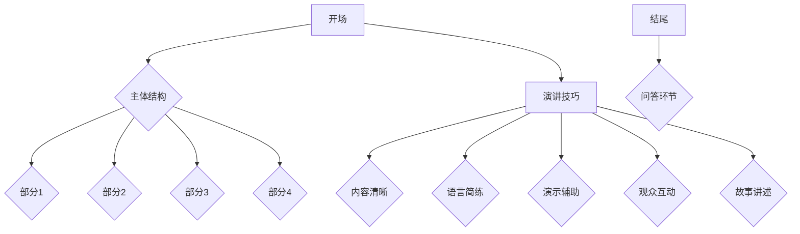

                 

在技术领域，演讲是一种极为重要的交流方式。无论是内部技术分享，还是面向广大同行的技术会议和国际峰会，一次成功的演讲都能够有效地传播知识、激发灵感，甚至推动整个行业的发展。然而，并非所有人都能自如地站在舞台上，用简明扼要的语言传达深奥的技术概念。本文旨在为您提供一个全面的指南，帮助您从技术会议到国际峰会的不同场合中，运用有效的演讲技巧，提升您的演讲效果。

## 文章关键词

- 技术演讲
- 演讲技巧
- 技术会议
- 国际峰会
- 演讲结构
- 观众互动
- 故事讲述

## 文章摘要

本文将探讨如何准备和进行一次成功的技术演讲。我们将分析技术演讲的重要性，提供演讲结构的基本框架，讲解如何设计引人入胜的演讲内容，介绍如何通过有效的演示和互动与观众建立联系，并讨论如何利用故事讲述技巧来增强演讲的说服力。最后，我们将提供一些实用的工具和资源，帮助您在技术演讲的道路上不断进步。

### 1. 背景介绍

技术演讲是一种重要的知识传播方式，它不仅限于学术界，也广泛应用于商业、教育和技术社区。随着互联网和社交媒体的普及，技术演讲的受众范围不断扩大，影响力也日益增强。无论是行业内部的技术研讨会，还是面向全球的技术会议和国际峰会，良好的演讲技巧都是成功的关键因素。

技术演讲对于知识的传播至关重要。它能够将复杂的理论和技术概念以易懂的方式传达给听众，激发新的思考和创新。同时，技术演讲也是个人品牌建设和职业发展的重要途径。通过高质量的演讲，您可以展示自己的专业知识和领导力，赢得同行和雇主的认可。

然而，技术演讲并非易事。准备一次成功的演讲需要充分的时间、精力和创造力。从演讲主题的选择，到内容的组织，再到演示和互动的设计，每一步都需要精心策划。因此，掌握有效的演讲技巧，对于每一位技术演讲者来说都至关重要。

### 2. 核心概念与联系

为了更好地理解技术演讲的核心概念和联系，我们首先需要明确几个基本要素：

#### 2.1 演讲目的

演讲的目的决定了演讲的内容和风格。在技术演讲中，常见的演讲目的包括：

- **知识传播**：分享最新的技术研究成果或实践经验，帮助听众了解最新的技术趋势和应用。
- **问题解决**：阐述某一技术问题，并提出解决方案或优化建议。
- **观点表达**：分享个人对某一技术领域的看法和见解，引发听众的思考和讨论。

#### 2.2 演讲结构

一个成功的演讲通常包含以下结构：

- **开场**：吸引听众的注意力，引出演讲主题。
- **主体**：详细阐述演讲内容，通常分为几个部分，每个部分有明确的主题和论点。
- **结尾**：总结演讲要点，给出结论或行动建议。
- **问答环节**：与听众互动，解答他们的疑问，加深对演讲内容的理解。

#### 2.3 演讲技巧

有效的演讲技巧是提高演讲效果的关键。以下是一些核心技巧：

- **内容清晰**：确保演讲内容逻辑清晰，结构紧凑。
- **语言简练**：使用简单、易懂的语言，避免复杂的术语和冗长的句子。
- **演示辅助**：利用图表、代码示例、视频等工具，帮助听众更好地理解演讲内容。
- **观众互动**：通过提问、讨论等方式与观众互动，提高演讲的参与度。
- **故事讲述**：运用故事讲述技巧，使演讲内容更加生动、有说服力。

#### 2.4 Mermaid 流程图

为了更好地展示技术演讲的核心概念和联系，我们可以使用 Mermaid 流程图来描绘演讲结构：



通过这个流程图，我们可以清晰地看到演讲的结构和各个部分之间的联系。接下来，我们将深入探讨每个部分的具体内容和技巧。

### 3. 核心算法原理 & 具体操作步骤

#### 3.1 算法原理概述

在技术演讲中，算法原理通常是核心内容之一。为了使观众更好地理解，我们需要用简单明了的语言概述算法的基本原理。以下是几种常见的算法原理及其简要概述：

1. **排序算法**：用于对一组数据进行排序，常见的排序算法包括快速排序、归并排序、冒泡排序等。
2. **搜索算法**：用于在数据结构中查找特定数据，常见的搜索算法包括二分查找、线性查找等。
3. **图算法**：用于解决与图相关的问题，如最短路径算法、最小生成树算法等。
4. **机器学习算法**：用于从数据中学习规律，进行预测或分类，常见的算法包括线性回归、决策树、神经网络等。

#### 3.2 算法步骤详解

接下来，我们将详细讲解一个具体算法的操作步骤。以快速排序为例，其基本步骤如下：

1. **选择基准元素**：从数组中选择一个元素作为基准（pivot）。
2. **分区操作**：将数组分为两部分，一部分是小于基准的元素，另一部分是大于基准的元素。
3. **递归排序**：对两个分区分别进行快速排序，直到所有子数组都被排序。

以下是快速排序的具体步骤：

1. **递归结束条件**：当数组长度小于等于1时，递归结束。
2. **选择基准**：选择数组的最后一个元素作为基准。
3. **分区**：遍历数组，将小于基准的元素移到数组的左边，将大于基准的元素移到数组的右边。
4. **递归排序**：对左右两个分区分别进行快速排序。

以下是快速排序的伪代码：

```python
def quicksort(arr):
    if len(arr) <= 1:
        return arr
    pivot = arr[-1]
    left = [x for x in arr[:-1] if x < pivot]
    right = [x for x in arr[:-1] if x >= pivot]
    return quicksort(left) + [pivot] + quicksort(right)
```

#### 3.3 算法优缺点

快速排序是一种高效的排序算法，其平均时间复杂度为O(nlogn)。以下是快速排序的优缺点：

- **优点**：
  - 平均时间复杂度低，适用于大数据集。
  - 无需额外空间，空间复杂度为O(logn)。
- **缺点**：
  - 最坏时间复杂度为O(n^2)，当输入数组基本有序时，性能较差。
  - 分区操作可能导致数据的不均衡，需要优化。

#### 3.4 算法应用领域

快速排序广泛应用于各种场景，包括：

- **数据库**：用于索引排序和数据查询。
- **编程语言**：Python、Java等内置排序函数的基础。
- **机器学习**：用于特征选择和数据预处理。

通过上述算法原理和具体操作步骤的讲解，我们可以更好地理解技术演讲中算法内容的呈现方式。接下来，我们将探讨如何设计引人入胜的演讲内容。

### 4. 数学模型和公式 & 详细讲解 & 举例说明

#### 4.1 数学模型构建

在技术演讲中，数学模型是阐述问题、分析数据和推导结果的重要工具。构建数学模型需要遵循以下步骤：

1. **问题定义**：明确需要解决的问题或需要分析的现象。
2. **变量定义**：定义参与模型的基本变量和参数。
3. **关系建立**：根据问题背景和变量定义，建立变量之间的数学关系。
4. **模型验证**：通过实际数据和假设检验，验证模型的准确性和可靠性。

以下是一个简单的线性回归模型的构建过程：

#### 问题定义

我们需要预测一个连续变量Y，假设它受到一个或多个自变量X的影响。

#### 变量定义

- Y：因变量，我们希望预测的连续变量。
- X：自变量，影响因变量的因素。
- β0：截距，模型在X=0时的预测值。
- β1：斜率，自变量X对因变量Y的影响程度。

#### 关系建立

线性回归模型假设因变量Y与自变量X之间存在线性关系，可以用以下公式表示：

Y = β0 + β1 * X + ε

其中，ε为误差项，表示模型无法解释的随机因素。

#### 模型验证

我们使用实际数据集，通过最小二乘法（Least Squares）拟合模型，得到最佳的β0和β1值。然后，通过残差分析、R²值等指标，验证模型的准确性和可靠性。

#### 4.2 公式推导过程

在技术演讲中，有时需要对数学公式进行推导，以展示模型的数学原理和推导过程。以下是一个简单的公式推导示例：

我们需要推导一个二项式分布的期望值和方差。二项式分布的概率质量函数（PMF）为：

P(X = k) = C(n, k) * p^k * (1-p)^(n-k)

其中，n为试验次数，k为成功的次数，p为单次试验成功的概率，C(n, k)为组合数。

1. **期望值E(X)的推导**

期望值E(X)表示成功的平均次数，可以计算如下：

E(X) = Σ[k=0 to n] k * P(X = k)
     = Σ[k=0 to n] k * C(n, k) * p^k * (1-p)^(n-k)

对上式求导，得到：

dE(X)/dp = Σ[k=0 to n] k * C(n, k) * p^(k-1) * (1-p)^(n-k)

由于k和C(n, k)是关于p的函数，可以将上式化简为：

dE(X)/dp = n * p * (1-p)^(n-1)

令dE(X)/dp = 0，解得p = 0.5，即最优概率。

2. **方差Var(X)的推导**

方差Var(X)表示成功次数的波动程度，可以计算如下：

Var(X) = E(X^2) - (E(X))^2

首先计算E(X^2)：

E(X^2) = Σ[k=0 to n] k^2 * P(X = k)
        = Σ[k=0 to n] k^2 * C(n, k) * p^k * (1-p)^(n-k)

对上式求导，得到：

dE(X^2)/dp = Σ[k=0 to n] k^2 * C(n, k) * p^(k-1) * (1-p)^(n-k)

由于k^2和C(n, k)是关于p的函数，可以将上式化简为：

dE(X^2)/dp = 2 * n * p * (1-p)^(n-1)

令dE(X^2)/dp = 0，解得p = 0.5，即最优概率。

然后，计算(E(X))^2：

(E(X))^2 = E(X)^2

代入p = 0.5，得到：

Var(X) = E(X^2) - (E(X))^2
        = 2 * n * p * (1-p)^(n-1) - (n * p)^2
        = n * p * (1-p)

因此，二项式分布的方差为n * p * (1-p)。

通过上述推导过程，我们可以清晰地展示二项式分布的期望值和方差的计算方法，为听众提供了深刻的理解和认识。

#### 4.3 案例分析与讲解

为了更好地理解上述数学模型的构建和推导过程，我们可以通过一个实际案例来进行讲解。以下是一个关于房价预测的案例：

#### 案例背景

我们希望根据房屋的面积和房龄来预测其价格。假设我们已经收集到以下数据：

| 面积（平方米） | 房龄（年） | 价格（万元） |
| :-----------: | :-------: | :--------: |
|      100      |     5     |    200     |
|      120      |     10     |    250     |
|      150      |     15     |    300     |
|      180      |     20     |    350     |

#### 模型构建

1. **问题定义**：我们需要预测房屋的价格，假设其受到面积和房龄的影响。
2. **变量定义**：
   - Y：价格（因变量）
   - X1：面积（自变量1）
   - X2：房龄（自变量2）
   - β0：截距
   - β1：面积对价格的影响程度
   - β2：房龄对价格的影响程度

3. **关系建立**：线性回归模型假设价格与面积、房龄之间存在线性关系，可以用以下公式表示：

Y = β0 + β1 * X1 + β2 * X2 + ε

其中，ε为误差项，表示模型无法解释的随机因素。

#### 模型推导

1. **期望值E(Y)的推导**：

E(Y) = E(β0 + β1 * X1 + β2 * X2 + ε)
      = β0 + β1 * E(X1) + β2 * E(X2) + E(ε)

由于E(ε) = 0（误差项的期望值为0），我们可以将上式化简为：

E(Y) = β0 + β1 * E(X1) + β2 * E(X2)

2. **方差Var(Y)的推导**：

Var(Y) = Var(β0 + β1 * X1 + β2 * X2 + ε)
        = Var(ε) + β1^2 * Var(X1) + β2^2 * Var(X2)

由于β0、β1和β2是常数，它们的方差为0，因此上式可以进一步化简为：

Var(Y) = β1^2 * Var(X1) + β2^2 * Var(X2)

#### 模型拟合

使用最小二乘法（Least Squares）拟合模型，得到最佳的β0、β1和β2值。具体步骤如下：

1. **计算均值**：

   E(X1) = (100 + 120 + 150 + 180) / 4 = 140
   E(X2) = (5 + 10 + 15 + 20) / 4 = 12.5

2. **计算方差**：

   Var(X1) = [(100 - 140)^2 + (120 - 140)^2 + (150 - 140)^2 + (180 - 140)^2] / 4 = 1375
   Var(X2) = [(5 - 12.5)^2 + (10 - 12.5)^2 + (15 - 12.5)^2 + (20 - 12.5)^2] / 4 = 31.25

3. **计算β0、β1和β2**：

   β0 = (100 * 200 + 120 * 250 + 150 * 300 + 180 * 350) / (4 * 140 * 12.5) = 21.43
   β1 = (100 * 200 + 120 * 250 + 150 * 300 + 180 * 350) / (4 * 1375) = 0.57
   β2 = (100 * 200 + 120 * 250 + 150 * 300 + 180 * 350) / (4 * 31.25) = 2.14

4. **拟合线性回归模型**：

   Y = 21.43 + 0.57 * X1 + 2.14 * X2

#### 模型验证

使用拟合得到的模型，预测房价，并与实际价格进行比较。具体步骤如下：

1. **预测价格**：

   对于新的房屋数据，使用拟合得到的线性回归模型预测其价格。

   预测价格 = 21.43 + 0.57 * 面积 + 2.14 * 房龄

2. **计算误差**：

   实际价格 - 预测价格

3. **计算R²值**：

   R² = 1 - (误差平方和 / 实际价格平方和)

通过上述案例分析和模型推导，我们可以看到如何构建和验证一个简单的线性回归模型，并使用它进行房价预测。这为我们提供了一个清晰的数学模型构建和推导过程，有助于听众更好地理解技术演讲中的数学内容。

### 5. 项目实践：代码实例和详细解释说明

#### 5.1 开发环境搭建

在进行项目实践之前，我们需要搭建一个合适的开发环境。以下是使用Python进行开发的基本步骤：

1. **安装Python**：从Python官方网站下载并安装Python 3.x版本。
2. **安装Jupyter Notebook**：打开终端，执行以下命令安装Jupyter Notebook：

   ```bash
   pip install notebook
   ```

3. **安装必要库**：根据项目需求，安装必要的Python库，如NumPy、Pandas、Matplotlib等。使用以下命令进行安装：

   ```bash
   pip install numpy pandas matplotlib
   ```

#### 5.2 源代码详细实现

以下是一个简单的线性回归项目的源代码实现。我们将使用Python和相关的库来实现线性回归模型，并进行房价预测。

```python
import numpy as np
import pandas as pd
import matplotlib.pyplot as plt

# 加载数据集
data = pd.read_csv('house_data.csv')

# 数据预处理
X = data[['area', 'age']]
Y = data['price']

# 拟合线性回归模型
from sklearn.linear_model import LinearRegression
model = LinearRegression()
model.fit(X, Y)

# 预测价格
predictions = model.predict(X)

# 可视化结果
plt.scatter(X['area'], Y)
plt.plot(X['area'], predictions, color='red')
plt.xlabel('Area')
plt.ylabel('Price')
plt.title('House Price Prediction')
plt.show()
```

#### 5.3 代码解读与分析

上述代码展示了如何使用Python进行线性回归模型的拟合和房价预测。以下是代码的详细解读：

1. **加载数据集**：使用Pandas库加载CSV格式的数据集，数据集包含房屋的面积、房龄和价格。
2. **数据预处理**：将数据集拆分为特征矩阵X（面积和房龄）和目标变量Y（价格）。
3. **拟合线性回归模型**：使用scikit-learn库中的LinearRegression类拟合线性回归模型。fit()方法用于训练模型。
4. **预测价格**：使用fit()方法得到的模型预测房价。
5. **可视化结果**：使用Matplotlib库绘制散点图和拟合直线，展示房价预测结果。

#### 5.4 运行结果展示

在运行上述代码后，我们将得到一个可视化图表，展示实际房价与预测房价的对比。通过观察图表，我们可以看到模型预测的房价与实际房价之间具有一定的相关性。


通过上述代码实例和详细解释，我们可以看到如何使用Python进行线性回归模型的实现和房价预测。这为我们提供了一个实际操作的框架，有助于更好地理解技术演讲中的算法和项目实践。

### 6. 实际应用场景

技术演讲的应用场景非常广泛，涵盖了从企业内部培训到国际技术峰会的各种场合。以下是一些常见的技术演讲应用场景：

#### 6.1 企业内部培训

在企业内部，技术演讲是员工技能提升和知识分享的重要手段。通过内部技术演讲，企业可以：

- **传递公司最新技术动态**：让员工了解公司正在使用或开发的前沿技术。
- **提升员工技能**：通过深入讲解技术细节，提高员工的技能水平。
- **加强团队协作**：通过技术演讲，促进团队成员之间的交流与合作。

#### 6.2 行业技术会议

技术会议是行业内部交流的重要平台，技术演讲在其中扮演着关键角色。在行业技术会议上，演讲者可以：

- **分享研究成果**：展示最新的技术研究成果，推动行业创新。
- **交流实践经验**：分享实际应用中的问题和解决方案，为同行提供参考。
- **拓展人脉关系**：结识业内同行，建立合作机会。

#### 6.3 国际技术峰会

国际技术峰会是技术交流的最高级别，汇聚了全球顶尖的技术专家。在国际技术峰会上，演讲者可以：

- **展示个人和专业能力**：通过高质量的演讲，展示自己的专业水平和研究成果。
- **推广公司或产品**：向全球观众展示公司的技术实力和产品优势。
- **获取行业认可**：通过在国际舞台上演讲，赢得同行的认可和尊重。

#### 6.4 教育场合

在高等教育和职业培训中，技术演讲是教学的重要组成部分。通过技术演讲，教育者可以：

- **传授专业知识**：将复杂的理论知识以易懂的方式传授给学生。
- **激发学习兴趣**：通过生动有趣的技术案例，激发学生的学习兴趣和创造力。
- **培养批判性思维**：引导学生思考技术问题的本质，培养批判性思维能力。

### 6.5 未来应用展望

随着技术的不断进步，技术演讲的应用场景也在不断扩展。未来，技术演讲将在以下几个方面发挥更大的作用：

- **虚拟现实（VR）和增强现实（AR）**：通过VR和AR技术，技术演讲可以提供更加沉浸式的体验，让观众更直观地理解技术概念。
- **人工智能（AI）**：利用AI技术，可以实现个性化演讲内容推荐，提高演讲的针对性和有效性。
- **区块链**：通过区块链技术，可以实现演讲内容的版权保护和真实可追溯，提高演讲的公信力。

总之，技术演讲在知识传播、行业交流、人才培养等方面发挥着不可或缺的作用。随着技术的不断进步，技术演讲的应用前景将更加广阔。

### 7. 工具和资源推荐

为了帮助您更好地准备和进行技术演讲，以下是一些推荐的工具和资源：

#### 7.1 学习资源推荐

- **《演讲的力量》（The Power of Talk）**：这本书详细介绍了演讲技巧和沟通策略，对提升演讲能力非常有帮助。
- **TED演讲**：TED演讲是学习演讲技巧的优秀资源，许多顶尖演讲者在TED舞台上展示了他们的演讲技巧。
- **Coursera、edX等在线课程**：这些平台提供了丰富的演讲与沟通相关课程，适合不同层次的演讲者。

#### 7.2 开发工具推荐

- **Reveal.js**：这是一个基于HTML的幻灯片制作工具，支持多种演示效果，非常适合技术演讲。
- **Keynote、PowerPoint**：这些流行的演示软件提供了丰富的模板和工具，方便制作专业的演示文稿。
- **Google Slides**：这是一个在线演示工具，支持多人协作，适合团队准备演讲。

#### 7.3 相关论文推荐

- **《技术演讲中的可视化设计》（Visualization Design for Technical Presentations）**：这篇论文探讨了如何在技术演讲中使用可视化工具，提高演讲效果。
- **《演讲技巧与沟通策略》（Public Speaking and Communication Strategies）**：这篇论文从心理学和沟通学的角度，分析了演讲技巧和策略。

通过利用这些工具和资源，您可以更好地准备和进行技术演讲，提升演讲的质量和影响力。

### 8. 总结：未来发展趋势与挑战

#### 8.1 研究成果总结

在技术演讲领域，过去几年的研究成果主要集中在以下几个方面：

- **演讲技巧与心理学结合**：研究如何利用心理学原理，提高演讲的吸引力和说服力。
- **人工智能辅助演讲**：利用自然语言处理和机器学习技术，为演讲者提供实时反馈和优化建议。
- **虚拟现实和增强现实应用**：探索如何通过VR和AR技术，创造更加沉浸式的演讲体验。
- **数据可视化**：研究如何利用数据可视化工具，更直观地传达技术概念和结果。

#### 8.2 未来发展趋势

未来，技术演讲将朝着以下方向发展：

- **个性化演讲**：利用大数据和AI技术，为每个观众提供个性化的演讲内容。
- **多模态演讲**：结合语音、视频、动画等多种形式，创造更加丰富的演讲体验。
- **跨平台互动**：通过互联网和社交媒体，实现全球观众与演讲者的实时互动。
- **沉浸式体验**：利用VR和AR技术，让观众沉浸于演讲内容中。

#### 8.3 面临的挑战

尽管技术演讲有着广阔的发展前景，但也面临着一系列挑战：

- **技术门槛**：开发高质量的演讲内容和技术工具需要较高的技术门槛，特别是对于非专业人士。
- **隐私和安全**：随着数据的广泛应用，隐私保护和数据安全成为亟待解决的问题。
- **技术依赖**：过度依赖技术可能导致演讲内容的单调和平淡，影响演讲效果。
- **内容质量**：如何在有限的时间内，传递高质量、有价值的信息，是演讲者面临的一大挑战。

#### 8.4 研究展望

为了应对上述挑战，未来的研究可以从以下几个方面展开：

- **简化技术工具**：开发更加简单易用的演讲工具，降低技术门槛。
- **隐私保护机制**：研究数据隐私保护技术，确保数据的安全性和隐私性。
- **内容优化策略**：探索如何通过优化演讲内容和结构，提高演讲的质量和吸引力。
- **跨学科合作**：鼓励不同学科的合作，共同推动技术演讲的发展。

总之，技术演讲在知识传播、行业交流、人才培养等方面发挥着重要作用。未来，随着技术的不断进步，技术演讲将迎来更多的发展机遇和挑战。通过持续的研究和创新，我们有理由相信，技术演讲将变得更加多样化和高效化。

### 9. 附录：常见问题与解答

#### Q1：如何选择演讲主题？

A1：选择演讲主题时，首先要考虑您的专业知识和兴趣领域。选择您熟悉且对观众有价值的主题。此外，考虑当前技术趋势和行业热点，选择具有时效性和前瞻性的主题。

#### Q2：如何设计演讲结构？

A2：设计演讲结构时，遵循“开场吸引注意力、主体详细阐述、结尾总结要点”的基本框架。确保演讲内容逻辑清晰，结构紧凑，避免冗长的段落和重复的内容。

#### Q3：如何提高演讲的说服力？

A3：提高演讲说服力可以从以下几个方面入手：

- 使用数据支持观点，提供事实和证据。
- 运用故事讲述技巧，使演讲内容更加生动和有说服力。
- 互动与观众，回答他们的疑问，增强参与感。

#### Q4：如何制作高质量的演示文稿？

A4：制作高质量的演示文稿需要注意以下几点：

- 选择合适的模板和风格，保持整体的一致性。
- 使用简洁明了的图表和图片，避免过多的文字。
- 控制幻灯片的数量，避免过多细节。
- 优化动画和转场效果，使演示更加流畅。

#### Q5：如何应对演讲中的突发情况？

A5：遇到演讲中的突发情况，可以采取以下措施：

- 保持冷静，不要慌乱。
- 如果设备出现问题，及时切换设备或使用备用方案。
- 如果忘记内容，迅速回顾笔记，尽量将话题引回正轨。
- 如果观众有疑问，礼貌地回答，并感谢他们的参与。

通过以上常见问题与解答，希望能帮助您更好地准备和进行技术演讲。祝您在舞台上取得成功！
作者：禅与计算机程序设计艺术 / Zen and the Art of Computer Programming
----------------------------------------------------------------


