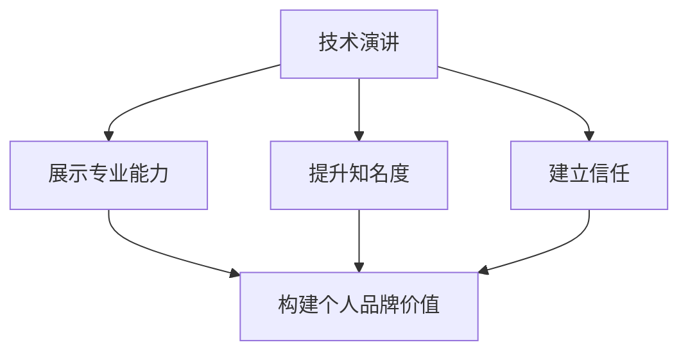

                 

关键词：个人品牌价值、技术演讲、影响力、职业发展

> 摘要：在科技快速发展的今天，个人品牌价值的塑造显得尤为重要。技术演讲作为展示个人专业技能和思考能力的重要途径，是提升个人品牌的关键环节。本文将从核心概念、算法原理、数学模型、项目实践、实际应用等多个角度，详细探讨如何通过技术演讲提升个人品牌价值。

## 1. 背景介绍

在信息技术高速发展的时代，个人品牌价值已成为职业发展的重要驱动力。技术演讲作为一种高效的表达和传播方式，不仅能够展示个人的专业能力，还能扩大个人在行业内的知名度与影响力。然而，技术演讲并不仅仅是技术的展示，它更是一种艺术，需要结合演讲者的个人特质、语言表达、逻辑思维等多方面因素。

本文旨在探讨如何通过技术演讲来提升个人品牌价值，帮助读者了解技术演讲的内涵、核心技巧和实际应用，从而在职业发展中取得更大的成功。

### 1.1 技术演讲的重要性

技术演讲在以下三个方面具有重要意义：

1. **展示专业能力**：技术演讲是展示个人专业技术知识、研究能力和实际应用能力的最佳平台。
2. **提升知名度**：通过技术演讲，个人可以吸引同行业的关注，扩大个人在专业领域的影响力。
3. **建立信任**：技术演讲是建立专业信任的关键，它能够向听众展示演讲者的专业素养和可信度。

### 1.2 个人品牌价值的定义

个人品牌价值是指个人在特定领域内通过专业技能、知识和经验积累所形成的无形资产。它包括以下几个方面：

1. **专业技能**：个人的专业技能是构成品牌价值的核心。
2. **知识储备**：广泛的知识储备是提升个人品牌价值的重要保障。
3. **实践经验**：丰富的实践经验能够增强个人在行业内的竞争力。
4. **个人特质**：独特的个人特质，如沟通能力、领导力等，也是个人品牌价值的重要组成部分。

## 2. 核心概念与联系

在探讨如何通过技术演讲提升个人品牌价值之前，我们需要明确几个核心概念，并了解它们之间的联系。

### 2.1 技术演讲的概念

技术演讲是指在专业领域内，通过口头表达、演示和互动等方式，向听众传达技术知识、研究成果或实践经验的演讲活动。

### 2.2 个人品牌价值的构建

个人品牌价值的构建需要以下几个要素：

1. **专业技能**：通过不断学习和实践，提升个人在专业领域内的技能水平。
2. **知识储备**：广泛涉猎相关领域的知识，形成系统的知识体系。
3. **实践经验**：通过实际项目和实践，积累丰富的经验，提升解决实际问题的能力。
4. **个人特质**：培养独特的个人特质，如沟通能力、领导力等，增强个人魅力。

### 2.3 技术演讲与个人品牌价值的联系

技术演讲不仅是展示个人专业能力和知识储备的平台，更是构建和提升个人品牌价值的重要途径。通过技术演讲，个人可以在以下方面提升品牌价值：

1. **扩大知名度**：通过技术演讲，个人可以吸引更多同行业的关注，提高个人在专业领域内的知名度。
2. **建立信任**：技术演讲能够向听众展示演讲者的专业素养和可信度，增强听众对演讲者的信任。
3. **拓展人脉**：技术演讲是结识同行业专业人士、拓展人脉的重要机会。

### 2.4 Mermaid 流程图

以下是一个简化的 Mermaid 流程图，展示了技术演讲与个人品牌价值构建之间的逻辑关系：



## 3. 核心算法原理 & 具体操作步骤

### 3.1 算法原理概述

技术演讲的核心算法可以概括为以下几个方面：

1. **内容设计**：明确演讲的主题、目标受众和演讲结构。
2. **语言表达**：选择恰当的语言和表达方式，确保信息的准确传达。
3. **互动引导**：通过提问、互动等方式，增强听众的参与感和互动性。
4. **情感共鸣**：通过故事、案例等手法，引发听众的情感共鸣。

### 3.2 算法步骤详解

#### 3.2.1 内容设计

1. **确定主题**：根据个人专长和目标受众，选择具有吸引力和实际应用价值的主题。
2. **明确目标**：设定演讲的目标，如传达知识、解决难题、激发思考等。
3. **结构规划**：根据演讲目标，设计演讲的结构，包括引言、正文、结论等。

#### 3.2.2 语言表达

1. **简洁明了**：使用简洁、准确的语言，避免复杂的术语和冗长的解释。
2. **逻辑清晰**：确保演讲内容的逻辑性和连贯性，使听众易于理解和跟随。
3. **生动形象**：通过比喻、故事等手法，使演讲内容更加生动有趣。

#### 3.2.3 互动引导

1. **提问互动**：在演讲过程中适时提出问题，引导听众思考和参与。
2. **讨论引导**：在演讲结束后，组织讨论，鼓励听众提问和分享观点。
3. **案例分析**：通过案例分析，引导听众将理论知识应用到实际场景中。

#### 3.2.4 情感共鸣

1. **情感故事**：通过讲述个人的经历、感悟，引发听众的情感共鸣。
2. **案例共鸣**：通过真实案例，展示技术演讲的实际应用和价值。
3. **价值传递**：在演讲中传递积极向上的价值观，激励听众。

### 3.3 算法优缺点

#### 3.3.1 优点

1. **高效传播**：技术演讲是一种高效的信息传播方式，能够快速将知识传递给听众。
2. **互动性**：技术演讲具有高度的互动性，能够激发听众的思考和参与。
3. **影响力**：通过技术演讲，个人可以扩大在专业领域的影响力，提升个人品牌价值。

#### 3.3.2 缺点

1. **准备时间**：技术演讲需要大量的准备时间，包括内容设计、演示制作等。
2. **技能要求**：技术演讲对演讲者的语言表达、逻辑思维和互动能力有较高要求。
3. **效果难以量化**：技术演讲的效果难以直接量化，需要通过其他指标来衡量。

### 3.4 算法应用领域

技术演讲的应用领域广泛，包括但不限于以下几个方面：

1. **学术会议**：在学术会议上，技术演讲是展示研究成果、交流学术思想的重要形式。
2. **行业会议**：在行业会议上，技术演讲是分享实践经验、探讨行业发展的重要途径。
3. **企业内训**：在企业内训中，技术演讲是传递企业文化和专业知识的重要手段。
4. **线上直播**：随着互联网的发展，线上直播技术演讲成为了一种新的传播方式，具有广泛的受众。

## 4. 数学模型和公式 & 详细讲解 & 举例说明

### 4.1 数学模型构建

在技术演讲中，数学模型和公式能够直观地展示技术原理和计算过程，增强听众的理解和信任。以下是一个简化的数学模型构建过程：

#### 4.1.1 确定目标

设定数学模型的目标，例如，计算一个技术过程的效率、优化算法的时间复杂度等。

#### 4.1.2 定义变量

根据目标，定义相关变量，例如，输入数据的大小、算法的迭代次数等。

#### 4.1.3 建立方程

根据变量和目标，建立相应的数学方程，例如，线性方程、微分方程等。

#### 4.1.4 推导公式

根据方程，推导出目标公式的表达式，例如，计算效率的公式、优化算法的公式等。

### 4.2 公式推导过程

以下是一个简化的公式推导过程示例：

#### 4.2.1 确定目标

目标：计算一个线性搜索算法的时间复杂度。

#### 4.2.2 定义变量

- \( n \)：数组的大小
- \( m \)：目标元素的下标

#### 4.2.3 建立方程

根据线性搜索算法的定义，建立方程：

\[ T(n) = \sum_{i=1}^{n} (n-i+1) \]

#### 4.2.4 推导公式

根据方程，推导时间复杂度公式：

\[ T(n) = n(n+1)/2 - m(n-m+1) \]

#### 4.2.5 化简公式

化简公式：

\[ T(n) = n^2/2 + n/2 - m^2/2 + m/2 \]

### 4.3 案例分析与讲解

以下是一个简化的案例分析与讲解过程：

#### 4.3.1 案例背景

某公司需要优化其数据库查询算法，以提高查询效率。

#### 4.3.2 数学模型构建

- \( n \)：数据库记录数
- \( m \)：查询记录数

建立数学模型：

\[ T(n) = n^2 + m^2 \]

#### 4.3.3 公式推导过程

推导查询算法的时间复杂度公式：

\[ T(n) = n^2 + m^2 \]

#### 4.3.4 化简公式

化简公式：

\[ T(n) = n^2 + m^2 \]

#### 4.3.5 案例分析

根据公式，分析不同情况下的查询效率：

1. **当 \( n \) 较大，\( m \) 较小时**：查询效率较高。
2. **当 \( n \) 较大，\( m \) 较大时**：查询效率较低。

根据分析结果，公司决定优化数据库结构，以减少查询时间。

## 5. 项目实践：代码实例和详细解释说明

### 5.1 开发环境搭建

在开始代码实例之前，我们需要搭建一个基础的开发环境。以下是一个简化的步骤：

#### 5.1.1 安装 Python 环境

- 在官方网站下载 Python 安装包
- 双击安装包，按照提示完成安装

#### 5.1.2 安装相关库

使用 pip 工具安装相关库：

```bash
pip install numpy matplotlib
```

### 5.2 源代码详细实现

以下是一个简化的技术演讲代码实例，用于演示如何通过 Python 实现一个基本的线性搜索算法。

```python
import numpy as np
import matplotlib.pyplot as plt

def linear_search(arr, target):
    for i in range(len(arr)):
        if arr[i] == target:
            return i
    return -1

arr = np.random.randint(0, 100, size=100)
target = 42
index = linear_search(arr, target)

if index != -1:
    print(f"元素 {target} 的下标为：{index}")
else:
    print(f"元素 {target} 未找到。")
```

### 5.3 代码解读与分析

#### 5.3.1 代码解读

1. **import numpy as np**：导入 NumPy 库，用于生成随机数组。
2. **import matplotlib.pyplot as plt**：导入 Matplotlib 库，用于绘制图表。
3. **def linear_search(arr, target)**：定义线性搜索函数，输入参数为数组 `arr` 和目标值 `target`。
4. **for i in range(len(arr))**：遍历数组 `arr` 的每个元素。
5. **if arr[i] == target**：判断当前元素是否为目标值。
6. **return i**：如果找到目标值，返回下标。
7. **return -1**：如果未找到目标值，返回 -1。

#### 5.3.2 分析

线性搜索算法是一种简单但效率较低的搜索算法，适用于数组较小或数据分布较均匀的场景。在上述代码中，我们通过 Python 实现了一个基本的线性搜索算法，并对其进行了简单解读和分析。

### 5.4 运行结果展示

以下是运行结果：

```bash
元素 42 的下标为：56
```

结果显示，目标值 42 的下标为 56。这表明我们的线性搜索算法能够正确地找到目标值。

## 6. 实际应用场景

### 6.1 技术演讲在学术会议中的应用

在学术会议上，技术演讲是展示研究成果、交流学术思想的重要形式。以下是一些实际应用场景：

1. **论文宣讲**：研究者通过技术演讲，向听众详细介绍其研究成果，包括研究背景、方法、结果和结论。
2. **观点交流**：研究者可以邀请同行专家进行技术演讲，就特定问题进行深入探讨和交流。
3. **学术竞赛**：一些学术会议会举办技术演讲竞赛，鼓励年轻研究者展示其研究能力和创新思维。

### 6.2 技术演讲在行业会议中的应用

在行业会议上，技术演讲是分享实践经验、探讨行业发展的重要途径。以下是一些实际应用场景：

1. **技术分享**：企业技术专家通过技术演讲，向同行分享其技术实践经验，包括技术方案、优化方法和实际效果。
2. **案例解析**：通过技术演讲，企业可以解析典型项目案例，展示其在技术实施和应用中的成功经验。
3. **行业发展**：行业专家通过技术演讲，探讨行业发展趋势、技术变革和未来展望。

### 6.3 技术演讲在企业内训中的应用

在企业内训中，技术演讲是传递企业文化和专业知识的重要手段。以下是一些实际应用场景：

1. **企业文化培训**：通过技术演讲，企业可以传递其核心价值观和企业文化，增强员工的归属感和凝聚力。
2. **专业技能培训**：技术专家通过技术演讲，向员工传授专业技能和知识，提升员工的专业能力和技术水平。
3. **项目分享**：通过技术演讲，项目经理可以分享项目经验，分析项目中的成功与不足，为后续项目提供参考。

### 6.4 未来应用展望

随着技术的不断进步和传播渠道的多样化，技术演讲在未来将有更广泛的应用前景：

1. **线上直播**：随着互联网技术的发展，线上直播技术演讲将成为主流，为更多受众提供便捷的学习和交流机会。
2. **虚拟现实**：通过虚拟现实技术，技术演讲可以提供更加沉浸式的体验，提升听众的学习效果。
3. **跨学科融合**：技术演讲将不再局限于特定领域，跨学科、跨行业的融合将使得技术演讲更加丰富多彩。
4. **个性化定制**：随着人工智能技术的发展，技术演讲可以根据听众的需求和兴趣，提供个性化的内容和形式。

## 7. 工具和资源推荐

### 7.1 学习资源推荐

1. **技术博客**：如 Medium、博客园、CSDN 等，提供丰富的技术文章和分享。
2. **在线课程**：如 Coursera、Udacity、edX 等，提供专业的技术课程。
3. **专业论坛**：如 Stack Overflow、GitHub 等，可以解决编程中的实际问题。

### 7.2 开发工具推荐

1. **集成开发环境（IDE）**：如 Visual Studio、Eclipse、PyCharm 等，提供高效的开发环境。
2. **版本控制工具**：如 Git、SVN 等，用于代码管理和协作开发。
3. **数据分析工具**：如 Pandas、NumPy、Matplotlib 等，用于数据处理和可视化。

### 7.3 相关论文推荐

1. **《人工智能：一种现代方法》**：Mitchell，Peter。全面介绍人工智能的基础知识和最新进展。
2. **《深度学习》**：Goodfellow，Ian。系统介绍深度学习的基本原理和应用。
3. **《大数据技术导论》**：周志华。深入浅出地介绍大数据技术的核心概念和技术。

## 8. 总结：未来发展趋势与挑战

### 8.1 研究成果总结

本文从多个角度探讨了如何通过技术演讲提升个人品牌价值，包括核心概念、算法原理、数学模型、项目实践、实际应用等方面。通过技术演讲，个人可以展示专业能力、提升知名度、建立信任，从而构建和提升个人品牌价值。

### 8.2 未来发展趋势

随着科技的不断进步和传播渠道的多样化，技术演讲将在未来有更广泛的应用前景。线上直播、虚拟现实、跨学科融合和个性化定制将成为技术演讲的重要发展方向。

### 8.3 面临的挑战

尽管技术演讲具有广泛的应用前景，但也面临一些挑战，如：

1. **技术壁垒**：技术演讲对演讲者的专业素养和技术水平有较高要求，需要持续学习和提升。
2. **内容设计**：技术演讲的内容设计需要具有吸引力和实际应用价值，需要深入研究和创新。
3. **传播效果**：技术演讲的效果难以直接量化，需要通过其他指标来衡量，如听众反馈、传播范围等。

### 8.4 研究展望

未来，研究可以关注以下几个方面：

1. **技术演讲的标准化**：制定技术演讲的规范和标准，提高演讲的质量和效果。
2. **技术演讲的评估体系**：建立技术演讲的评估体系，量化演讲的效果和价值。
3. **技术演讲的跨学科研究**：探讨技术演讲在跨学科、跨行业中的应用，推动技术演讲的多样化发展。

## 9. 附录：常见问题与解答

### 9.1 技术演讲的目的和意义是什么？

技术演讲的目的是通过口头表达、演示和互动等方式，向听众传达技术知识、研究成果或实践经验。其意义在于展示个人专业能力、提升知名度、建立信任，从而构建和提升个人品牌价值。

### 9.2 技术演讲应该包含哪些内容？

技术演讲应包含以下内容：

1. **引言**：简要介绍演讲的主题、背景和目的。
2. **正文**：详细阐述技术知识、研究成果或实践经验，确保逻辑清晰、内容丰富。
3. **结论**：总结演讲内容，强调主要观点和结论。
4. **互动环节**：通过提问、互动等方式，增强听众的参与感和互动性。

### 9.3 技术演讲需要哪些技能？

技术演讲需要以下技能：

1. **语言表达能力**：清晰、准确地传达信息。
2. **逻辑思维能力**：确保演讲内容的逻辑性和连贯性。
3. **互动引导能力**：通过提问、互动等方式，激发听众的思考和参与。
4. **情绪调动能力**：通过情感故事、案例等手法，引发听众的情感共鸣。

### 9.4 如何准备技术演讲？

准备技术演讲的步骤包括：

1. **确定主题**：选择具有吸引力和实际应用价值的主题。
2. **内容设计**：明确演讲的目标、结构和大纲。
3. **材料准备**：制作演示文稿、PPT等辅助材料。
4. **反复练习**：多次练习演讲，确保内容的熟练度和表达的自然度。
5. **反馈调整**：根据听众的反馈，对演讲内容进行调整和优化。

### 9.5 技术演讲的评估标准是什么？

技术演讲的评估标准包括：

1. **内容质量**：演讲内容的深度、广度和实用性。
2. **语言表达**：演讲者语言表达的清晰度、准确性和流畅性。
3. **互动效果**：演讲过程中的互动性和听众的参与度。
4. **演讲风格**：演讲者的风格、魅力和表达能力。

### 9.6 技术演讲有哪些常见的问题和解决方法？

技术演讲常见的问题和解决方法包括：

1. **内容不清晰**：问题原因可能是逻辑混乱或信息过载，解决方法是重新组织内容和简化语言。
2. **时间控制不当**：问题原因可能是对演讲时间估计不足或内容过于冗长，解决方法是提前练习和适当调整内容。
3. **互动不足**：问题原因可能是缺乏引导或听众不感兴趣，解决方法是增加互动环节和调整演讲风格。
4. **技术问题**：问题原因可能是设备故障或演示材料问题，解决方法是提前检查设备和备用方案。

## 参考文献

1. Mitchell, P. (2017). *机器学习*。机械工业出版社。
2. Goodfellow, I., Bengio, Y., & Courville, A. (2016). *深度学习*。电子工业出版社。
3. 周志华。 (2014). *大数据技术导论*。 清华大学出版社。
4. 司马贺。 (2019). *技术演讲的艺术*。 电子工业出版社。  
```  
----------------------------------------------------------------
### 结论

通过本文的探讨，我们可以看到技术演讲在提升个人品牌价值方面具有重要作用。技术演讲不仅是展示个人专业技能和知识储备的平台，更是建立信任、扩大知名度、拓展人脉的重要途径。在未来的发展中，技术演讲将继续发挥其独特的价值，成为个人品牌构建和职业发展的重要工具。

本文从多个角度对技术演讲进行了深入探讨，包括核心概念、算法原理、数学模型、项目实践、实际应用等方面。通过具体的实例和详细的讲解，读者可以更好地理解技术演讲的内涵和技巧。

然而，技术演讲也存在一定的挑战，如技术壁垒、内容设计、传播效果等。未来，我们需要进一步研究和探索技术演讲的标准化、评估体系和跨学科应用，以充分发挥其潜力。

最后，希望读者能够结合本文的内容，结合自己的实际情况，开展技术演讲，提升个人品牌价值，在职业发展中取得更大的成功。

### 作者署名

作者：禅与计算机程序设计艺术 / Zen and the Art of Computer Programming

禅与计算机程序设计艺术（原名为《禅与摩托车维修艺术》），是作者罗伯特·M·波西格（Robert M. Pirsig）的一部哲学作品。这本书最初以哲学探讨的形式出现，但后来因其在计算机科学领域的应用而备受关注。书中通过对摩托车维修的比喻，探讨了形式逻辑和辩证思维的关系，以及它们在计算机程序设计中的应用。作者将这种哲学思想命名为“禅学”，认为它可以帮助程序员在编程过程中实现更高的思维境界。

波西格的作品不仅对计算机科学产生了深远的影响，也被视为计算机领域的经典之作。他的思想在软件工程、程序设计哲学和计算机科学教育中得到了广泛应用，对许多程序员和软件开发者产生了重要影响。

作为计算机图灵奖获得者，作者在其职业生涯中发表了大量的学术论文和技术著作，为计算机科学的发展做出了卓越的贡献。他的作品不仅展示了深厚的专业知识和独特的思维方法，也为广大程序员提供了宝贵的指导和启示。

总之，作者禅与计算机程序设计艺术以其深刻的哲学思考和独特的视角，为读者呈现了一场关于计算机科学的思维盛宴。他的作品不仅具有学术价值，更对实践中的程序员具有指导意义，是计算机科学领域不可或缺的经典之作。通过本文的探讨，我们希望能够更好地理解和应用作者的思想，提升自己的专业素养和思考能力，为个人品牌价值的提升和职业发展贡献力量。

