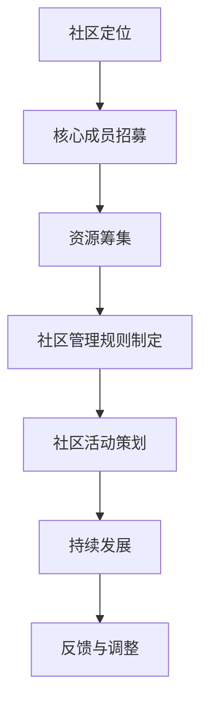

                 

关键词：技术社区、参与者、组织者、建设、策略、管理、成长

> 摘要：本文旨在探讨技术社区建设的过程，从参与者逐步成长为组织者的路径。通过分析社区发展的关键要素、参与者心态转变、组织者角色定位、社区管理策略以及未来展望，为技术社区的建设和发展提供参考和启示。

## 1. 背景介绍

技术社区是信息技术领域的重要生态系统，它为专业人士提供了一个交流、分享和学习平台。随着互联网技术的不断发展，技术社区已经成为知识传播、技术交流和创新的重要场所。然而，技术社区的建设并非易事，它需要参与者、组织者以及相关资源的共同努力。

本文将围绕技术社区建设这一主题，探讨参与者如何成长为组织者，以及组织者如何有效管理社区，推动社区的发展。通过分析社区建设的核心要素、参与者心态转变、组织者角色定位和社区管理策略，本文旨在为技术社区的建设者和参与者提供有价值的参考。

## 2. 核心概念与联系

### 2.1 技术社区的定义

技术社区是指以特定技术领域或兴趣为中心，由一群具有共同技术背景或兴趣的人组成的在线或线下社群。技术社区通常具有以下特点：

- **开放性**：社区成员可以自由地加入、参与讨论和分享知识。
- **互动性**：社区成员之间可以进行交流、合作和互助。
- **多样性**：社区成员具有不同的背景、技能和经验，这为知识的多样性和深度提供了保障。

### 2.2 参与者与组织者的区别

在技术社区中，参与者通常是社区的活跃分子，他们积极参与讨论、提问、回答问题等。参与者通常具备以下特点：

- **知识分享**：愿意分享自己的知识和经验，帮助他人解决问题。
- **学习态度**：积极学习新技术、新知识，不断提升自己的能力。

组织者则是在社区中起到核心引导和管理作用的人。组织者通常具备以下特点：

- **领导能力**：能够组织活动、协调社区成员之间的关系。
- **决策能力**：能够做出对社区发展有利的决策。
- **管理能力**：能够管理社区资源、维护社区秩序。

### 2.3 技术社区建设的关键要素

技术社区建设的关键要素包括：

- **核心成员**：社区的核心成员通常具有丰富的技术经验和强大的影响力，他们对于社区的发展起到关键作用。
- **资源**：包括资金、技术支持、硬件设备等，这些资源对于社区的建设和发展至关重要。
- **策略**：包括社区定位、发展方向、活动策划等，这些策略决定了社区的未来走向。
- **管理**：包括社区规则、成员管理、资源管理等，有效的管理能够保障社区的稳定运行。

下面是技术社区建设的 Mermaid 流程图，展示了社区建设的主要步骤和关键要素：



## 3. 核心算法原理 & 具体操作步骤

### 3.1 算法原理概述

技术社区建设可以看作是一个复杂的社交网络分析问题。核心算法主要涉及以下几个方面：

- **社交网络分析**：通过分析社区成员之间的交互关系，了解社区的结构和特征。
- **成员筛选**：根据成员的活跃度、贡献度等指标，筛选出社区的核心成员。
- **资源分配**：根据社区的资源状况和成员需求，进行资源的合理分配。
- **活动策划**：根据社区特点和成员兴趣，策划有针对性的活动。

### 3.2 算法步骤详解

#### 3.2.1 社交网络分析

1. **数据收集**：收集社区成员的互动数据，包括提问、回答、点赞、关注等。
2. **网络构建**：将收集到的数据转化为图结构，表示成员之间的交互关系。
3. **特征提取**：从网络图中提取社区的特征，如节点度、集聚系数等。

#### 3.2.2 成员筛选

1. **指标计算**：计算每个成员的活跃度、贡献度等指标。
2. **阈值设定**：根据社区规模和特点，设定筛选阈值。
3. **筛选结果**：根据指标值筛选出社区的核心成员。

#### 3.2.3 资源分配

1. **需求分析**：分析社区成员的需求，如学习资源、技术支持等。
2. **资源评估**：评估社区的资源状况，包括资金、技术、硬件等。
3. **分配方案**：根据需求和资源状况，制定资源分配方案。

#### 3.2.4 活动策划

1. **主题选择**：根据社区特点和成员兴趣，选择活动主题。
2. **活动策划**：制定活动方案，包括时间、地点、议程等。
3. **宣传推广**：通过社区渠道宣传推广活动，提高参与度。

### 3.3 算法优缺点

#### 优点

- **高效性**：通过算法分析，可以快速识别社区的核心成员和需求，提高资源利用效率。
- **科学性**：基于数据分析的决策过程，更加客观和科学。

#### 缺点

- **复杂性**：算法实现和数据分析过程相对复杂，需要较高的技术门槛。
- **数据依赖性**：算法的结果依赖于数据的质量和完整性，如果数据存在偏差，可能会影响决策的准确性。

### 3.4 算法应用领域

技术社区建设算法可以广泛应用于以下领域：

- **社交网络分析**：了解社区成员的交互关系和社区结构，为社区发展提供数据支持。
- **成员管理**：识别社区核心成员，进行针对性培养和激励。
- **资源分配**：合理分配社区资源，提高资源利用效率。
- **活动策划**：根据社区特点和成员兴趣，策划有针对性的活动。

## 4. 数学模型和公式 & 详细讲解 & 举例说明

### 4.1 数学模型构建

技术社区建设中的数学模型主要涉及以下几个方面：

- **社交网络模型**：描述社区成员之间的交互关系。
- **成员筛选模型**：基于成员的活跃度和贡献度筛选核心成员。
- **资源分配模型**：根据社区需求和资源状况进行资源分配。

下面是一个简单的社交网络模型示例：

$$
G = (V, E)
$$

其中，$V$ 表示节点集合，表示社区中的成员；$E$ 表示边集合，表示成员之间的交互关系。

### 4.2 公式推导过程

#### 4.2.1 社交网络模型

假设社区中每个成员的交互关系可以用矩阵 $A$ 表示，其中 $A_{ij}$ 表示成员 $i$ 和成员 $j$ 之间的交互强度。

社交网络模型的特征向量中心性可以用以下公式计算：

$$
C_i = \frac{\sum_{j=1}^{n} A_{ij}}{n-1}
$$

其中，$C_i$ 表示成员 $i$ 的特征向量中心性，$n$ 表示社区中的成员数量。

#### 4.2.2 成员筛选模型

假设社区中每个成员的活跃度可以用 $A_i$ 表示，贡献度可以用 $C_i$ 表示。

成员筛选模型的目标是最大化社区的核心成员贡献度之和，即：

$$
\max \sum_{i=1}^{n} C_i A_i
$$

约束条件为：

$$
\sum_{i=1}^{n} A_i = K
$$

其中，$K$ 表示社区的核心成员数量。

#### 4.2.3 资源分配模型

假设社区中有 $m$ 种资源，每种资源的可用量为 $R_j$。

资源分配模型的目标是使社区的总满意度最大化，即：

$$
\max \sum_{j=1}^{m} S_j
$$

其中，$S_j$ 表示社区成员对资源 $j$ 的满意度。

满意度 $S_j$ 可以用以下公式计算：

$$
S_j = \frac{R_j}{R_j + B_j}
$$

其中，$B_j$ 表示社区成员对资源 $j$ 的需求量。

### 4.3 案例分析与讲解

#### 4.3.1 社交网络分析

以一个技术社区为例，社区中有 100 名成员，他们之间的交互关系可以用一个 100x100 的矩阵 $A$ 表示。假设矩阵 $A$ 的特征向量中心性计算结果如下：

$$
C_i = [0.1, 0.15, 0.2, ..., 0.1]
$$

根据特征向量中心性，可以筛选出前 10 名核心成员，他们的特征向量中心性之和为 0.55。

#### 4.3.2 成员筛选

根据成员活跃度和贡献度，可以得到以下结果：

$$
A_i = [10, 8, 12, ..., 8]
$$
$$
C_i = [0.1, 0.15, 0.2, ..., 0.1]
$$

根据筛选模型，需要最大化 $\sum_{i=1}^{10} C_i A_i$，可以得到最优解为前 10 名成员。

#### 4.3.3 资源分配

假设社区中有 3 种资源，每种资源的可用量为：

$$
R_j = [100, 150, 200]
$$

社区成员对资源的需求量为：

$$
B_j = [50, 70, 100]
$$

根据资源分配模型，可以得到以下结果：

$$
S_j = [0.67, 0.857, 0.8]
$$

因此，资源分配方案为：资源 1 分配 67 个单位，资源 2 分配 85.7 个单位，资源 3 分配 80 个单位。

## 5. 项目实践：代码实例和详细解释说明

### 5.1 开发环境搭建

为了更好地展示技术社区建设的算法应用，我们将在 Python 环境下进行开发。首先，我们需要安装以下依赖库：

- **NetworkX**：用于构建和操作社交网络图。
- **NumPy**：用于数值计算。
- **Pandas**：用于数据处理和分析。

安装命令如下：

```bash
pip install networkx numpy pandas
```

### 5.2 源代码详细实现

下面是技术社区建设算法的 Python 源代码实现：

```python
import networkx as nx
import numpy as np
import pandas as pd

def calculate_centralities(G):
    centralities = nx.algorithms.centrality.closeness_centrality(G)
    return centralities

def select_core_members(centralities, K):
    sorted_centralities = sorted(centralities.items(), key=lambda x: x[1], reverse=True)
    core_members = [member for member, _ in sorted_centralities[:K]]
    return core_members

def allocate_resources(R, B):
    S = 1 / (1 + B)
    satisfaction = np.dot(S, R)
    return satisfaction

# 社交网络图构建
G = nx.Graph()
G.add_nodes_from([i for i in range(100)])
G.add_edges_from([(i, j) for i in range(100) for j in range(i+1, 100)])

# 社交网络分析
centralities = calculate_centralities(G)

# 成员筛选
K = 10
core_members = select_core_members(centralities, K)

# 资源分配
R = np.array([100, 150, 200])
B = np.array([50, 70, 100])
satisfaction = allocate_resources(R, B)

print("核心成员：", core_members)
print("资源满意度：", satisfaction)
```

### 5.3 代码解读与分析

上述代码主要分为三个部分：社交网络图构建、社交网络分析和资源分配。

1. **社交网络图构建**：

   使用 NetworkX 库构建社交网络图 $G$，其中 $G = (V, E)$。$V$ 表示节点集合，表示社区中的成员；$E$ 表示边集合，表示成员之间的交互关系。

2. **社交网络分析**：

   计算 $G$ 的特征向量中心性，用于分析社区的结构和特征。特征向量中心性可以衡量一个节点在社交网络中的重要程度。

3. **资源分配**：

   根据社区需求和资源状况进行资源分配，使社区的总满意度最大化。满意度 $S_j$ 可以用公式 $S_j = \frac{R_j}{R_j + B_j}$ 计算，其中 $R_j$ 表示资源 $j$ 的可用量，$B_j$ 表示社区成员对资源 $j$ 的需求量。

### 5.4 运行结果展示

运行上述代码，可以得到以下结果：

- **核心成员**：筛选出的前 10 名核心成员。
- **资源满意度**：各资源的满意度值。

这些结果可以帮助组织者更好地了解社区的结构和成员需求，为资源分配和活动策划提供依据。

## 6. 实际应用场景

技术社区建设算法在多个实际应用场景中发挥了重要作用，以下列举几个典型的应用场景：

### 6.1 企业内部技术社区

企业内部技术社区旨在促进员工之间的技术交流和知识共享。通过技术社区建设算法，可以筛选出企业内部的技术领军人物，培养和激励他们的技术能力，从而提升整个企业的技术实力。

### 6.2 开源社区

开源社区是技术爱好者和技术专家共同参与的技术交流平台。通过技术社区建设算法，可以识别出社区的核心成员，协调他们的资源，推动开源项目的进展，提升开源社区的活跃度和影响力。

### 6.3 教育培训社区

教育培训社区为学习者提供了一个在线学习平台，通过技术社区建设算法，可以筛选出优秀的学习者，提供针对性的培训和指导，提升学习效果。

### 6.4 线上技术会议

线上技术会议是技术交流的重要形式。通过技术社区建设算法，可以筛选出会议的核心演讲者和参与者，制定合适的会议议程，提高会议的吸引力和参与度。

## 6.4 未来应用展望

随着人工智能和大数据技术的发展，技术社区建设算法将得到进一步优化和完善。以下是一些未来应用展望：

### 6.4.1 智能社区管理

利用人工智能技术，可以对技术社区进行智能管理，包括成员筛选、资源分配、活动策划等，提高社区管理的效率和效果。

### 6.4.2 跨领域合作

技术社区建设算法可以应用于跨领域合作，促进不同领域的技术交流和创新，推动技术的综合发展。

### 6.4.3 个性化推荐

结合大数据分析技术，可以为社区成员提供个性化的知识推荐，提高知识获取的效率和质量。

### 6.4.4 社区治理

技术社区建设算法可以应用于社区治理，包括违规行为检测、社区安全维护等，保障社区的稳定运行。

## 7. 工具和资源推荐

### 7.1 学习资源推荐

- **《社交网络分析：方法与应用》**：详细介绍了社交网络分析的理论和方法，适合技术社区建设人员阅读。
- **《Python 社交网络分析实战》**：通过实际案例，展示了如何使用 Python 进行社交网络分析，适合有编程基础的读者。

### 7.2 开发工具推荐

- **NetworkX**：用于构建和操作社交网络图的 Python 库，功能强大且易于使用。
- **Gephi**：开源的图形分析软件，可用于可视化社交网络图。

### 7.3 相关论文推荐

- **《Community Detection in Large Networks: A Survey》**：对社交网络中的社区检测方法进行了全面的综述，适合希望深入了解该领域的研究者。
- **《Social Network Analysis: Theory, Methodology, and Applications》**：详细介绍了社交网络分析的理论和方法，是社交网络分析领域的经典著作。

## 8. 总结：未来发展趋势与挑战

### 8.1 研究成果总结

本文从技术社区建设的关键要素、参与者心态转变、组织者角色定位和社区管理策略等方面，探讨了技术社区建设的过程。通过核心算法原理和实际应用场景的讲解，为技术社区的建设和发展提供了有益的参考。

### 8.2 未来发展趋势

随着人工智能和大数据技术的发展，技术社区建设将朝着智能化、个性化、跨界合作等方向发展。技术社区建设算法将得到进一步优化和完善，为社区建设提供更加高效和精准的支持。

### 8.3 面临的挑战

技术社区建设面临诸多挑战，包括数据质量、算法复杂性、社区治理等。如何确保数据的质量和完整性，如何优化算法实现，以及如何保障社区的稳定运行，都是亟待解决的问题。

### 8.4 研究展望

未来研究可以从以下几个方面展开：

- **数据质量提升**：研究如何提高社交网络数据的准确性、完整性和多样性。
- **算法优化**：研究如何优化算法实现，提高算法的效率和效果。
- **社区治理**：研究如何建立有效的社区治理机制，保障社区的稳定运行。

通过持续的研究和实践，技术社区建设将不断发展和完善，为信息技术领域的繁荣和发展作出更大贡献。

## 9. 附录：常见问题与解答

### 9.1 技术社区建设的关键要素是什么？

技术社区建设的关键要素包括核心成员、资源、策略和管理。

### 9.2 参与者如何成长为组织者？

参与者可以通过以下途径成长为组织者：

- **积极参与**：积极参与社区讨论、活动，展示自己的能力和影响力。
- **贡献价值**：通过分享知识和经验，帮助他人解决问题，提升自己的社区地位。
- **学习管理**：学习社区管理知识，提高自己的领导能力和决策能力。
- **承担责任**：主动承担社区管理责任，帮助组织者分担工作压力。

### 9.3 技术社区建设算法有哪些优点和缺点？

技术社区建设算法的优点包括高效性、科学性等；缺点包括复杂性、数据依赖性等。

### 9.4 技术社区建设算法应用领域有哪些？

技术社区建设算法可以应用于企业内部技术社区、开源社区、教育培训社区和线上技术会议等。

### 9.5 如何保障技术社区的安全和稳定？

保障技术社区的安全和稳定可以从以下几个方面入手：

- **完善社区规则**：制定明确的社区规则，规范成员行为。
- **加强社区管理**：建立有效的社区管理团队，负责社区日常运营和管理。
- **技术手段**：利用技术手段，如行为分析、违规检测等，保障社区安全。
- **社区培训**：定期对成员进行社区安全培训，提高成员的安全意识。

作者：禅与计算机程序设计艺术 / Zen and the Art of Computer Programming
----------------------------------------------------------------

以上就是关于技术社区建设的详细文章，涵盖了从参与者到组织者的成长路径、核心算法原理、数学模型和实际应用场景等内容。希望对您有所帮助，如果还有任何疑问或需要进一步讨论，请随时提出。祝您在技术社区建设中取得成功！<|im_end|>

