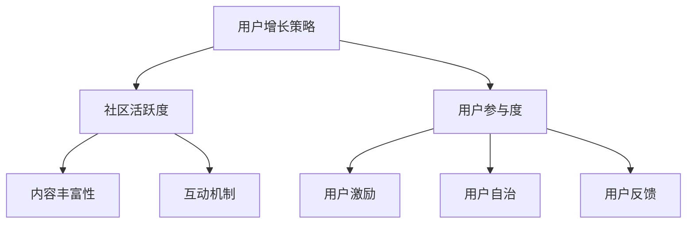

                 

关键词：技术社区、用户增长、运营策略、增长黑客、社区活跃度、用户参与度

摘要：本文将深入探讨技术社区从零开始到积累10000用户的运营策略。通过分析核心概念、核心算法、数学模型、项目实践，以及未来应用前景，我们将探索如何通过科学的方法和工具实现技术社区的用户快速增长和活跃度提升。

## 1. 背景介绍

在互联网时代，技术社区成为了知识传播、经验交流和技术创新的重要平台。一个成功的社区不仅能够为成员提供高质量的资源和交流机会，还能够吸引更多的用户加入，形成正向循环，从而推动社区的持续发展。然而，从零开始构建并运营一个技术社区并非易事。本文将分享如何通过一系列科学有效的策略，从零用户增长到10000用户。

### 1.1 技术社区的重要性

技术社区在多个方面都发挥着至关重要的作用：
- **知识共享**：技术社区为开发者提供了一个交流、分享知识的平台，促进了技术的传播和普及。
- **人才培养**：通过技术社区的交流，新手可以快速获取行业经验，而资深开发者可以不断深化自己的专业知识。
- **创新孵化**：技术社区是创新思维的源泉，很多新兴技术和项目都起源于社区成员的讨论和合作。
- **商业机会**：技术社区不仅能够吸引潜在的用户，还为企业和开发者提供了宝贵的市场反馈。

### 1.2 运营挑战与机遇

尽管技术社区具有巨大的潜力，但其运营也面临诸多挑战：
- **用户获取**：吸引新用户并保持他们的参与是一个长期且复杂的过程。
- **内容质量**：高质量的内容是社区的核心，但内容的生产和维护需要大量的时间和精力。
- **社区活跃度**：保持社区的高活跃度对于用户留存至关重要。
- **商业化平衡**：在确保用户体验的同时，实现商业模式的可持续性是运营者需要考虑的重要问题。

然而，随着互联网技术的不断进步和社交媒体的普及，运营技术社区也迎来了新的机遇：
- **社交媒体推广**：利用社交媒体平台可以迅速扩大社区影响力。
- **大数据分析**：通过数据驱动的方式，运营者可以更好地理解用户需求，优化运营策略。
- **自动化工具**：各种社区管理工具的出现，减轻了运营者的负担，提高了工作效率。

## 2. 核心概念与联系

为了更好地理解技术社区运营，我们需要明确几个核心概念，并探讨它们之间的相互关系。

### 2.1 用户增长策略

用户增长策略是社区运营的关键。它包括以下几个方面：

- **吸引新用户**：通过各种渠道（如搜索引擎优化、社交媒体推广等）吸引潜在用户。
- **用户留存**：通过高质量的内容和互动机制，提高用户的参与度和留存率。
- **用户转化**：将社区用户转化为活跃用户、贡献者或付费用户。

### 2.2 社区活跃度

社区活跃度是衡量社区健康程度的重要指标。提高社区活跃度需要从以下几个方面入手：

- **内容丰富性**：提供多样化的内容，满足不同用户的需求。
- **互动机制**：鼓励用户之间的互动，如评论、点赞、分享等。
- **事件驱动**：定期举办线上或线下活动，增加用户的参与度。

### 2.3 用户参与度

用户参与度是社区发展的动力。提升用户参与度可以通过以下方式实现：

- **用户激励**：通过积分、排名、奖励等方式激励用户积极参与社区。
- **用户自治**：鼓励用户参与社区管理，提升他们的归属感和责任感。
- **用户反馈**：及时收集用户反馈，不断改进社区运营策略。

### 2.4 Mermaid 流程图

以下是一个简单的 Mermaid 流程图，展示了技术社区运营的关键步骤和核心概念之间的联系。



## 3. 核心算法原理 & 具体操作步骤

### 3.1 算法原理概述

技术社区运营的核心算法主要涉及用户增长和活跃度的计算。这些算法基于大数据分析和机器学习技术，旨在优化运营策略，提高社区的整体表现。

### 3.2 算法步骤详解

#### 3.2.1 用户增长算法

1. **数据采集**：收集社区的用户行为数据，包括用户访问量、发帖量、回复量、点赞量等。
2. **特征提取**：从数据中提取用户特征，如用户活跃度、发帖类型、话题偏好等。
3. **用户分类**：根据用户特征，将用户分为潜在用户、活跃用户、贡献者等类别。
4. **推荐系统**：利用机器学习算法，为不同类别的用户推荐感兴趣的内容和活动。
5. **效果评估**：通过数据反馈，评估推荐系统的效果，并不断优化算法。

#### 3.2.2 社区活跃度算法

1. **指标定义**：定义社区活跃度的关键指标，如帖子数量、回复数量、用户参与度等。
2. **数据采集**：收集社区的活跃度数据，包括帖子数量、回复数量、用户参与度等。
3. **趋势分析**：分析社区活跃度的变化趋势，找出活跃度高的时间段和主题。
4. **干预策略**：根据分析结果，制定相应的干预策略，如举办活动、发布热门话题等。
5. **效果评估**：评估干预策略的效果，并调整策略以持续提升社区活跃度。

### 3.3 算法优缺点

#### 3.3.1 用户增长算法优点

- **个性化推荐**：根据用户特征和偏好，提供个性化的内容和活动，提高用户满意度。
- **高效引流**：通过推荐系统，快速吸引新用户，并提高用户留存率。

#### 3.3.1 用户增长算法缺点

- **计算成本高**：用户增长算法需要大量的计算资源和存储空间，对技术基础要求较高。
- **数据偏差**：用户特征提取和数据收集可能存在偏差，影响推荐效果。

#### 3.3.2 社区活跃度算法优点

- **实时反馈**：能够实时监测社区活跃度，及时调整运营策略。
- **目标明确**：通过明确的关键指标，量化社区活跃度，便于评估和管理。

#### 3.3.2 社区活跃度算法缺点

- **数据依赖性高**：社区活跃度算法依赖于大量的活跃数据，数据不足可能导致算法失效。
- **操作复杂**：制定和执行干预策略需要具备一定的专业知识和经验。

### 3.4 算法应用领域

用户增长和活跃度算法广泛应用于各类技术社区，如编程社区、技术博客、开源项目等。通过这些算法，运营者能够更好地理解用户需求，优化运营策略，提高社区的整体表现。

## 4. 数学模型和公式 & 详细讲解 & 举例说明

### 4.1 数学模型构建

在技术社区运营中，构建数学模型对于理解和优化运营策略具有重要意义。以下是一个简化的数学模型，用于分析社区用户增长和活跃度。

#### 4.1.1 用户增长模型

用户增长模型基于指数增长模型，公式如下：

\[ G(t) = G_0 \cdot e^{rt} \]

其中：
- \( G(t) \) 表示时间 \( t \) 时的用户数；
- \( G_0 \) 表示初始用户数；
- \( r \) 表示增长率；
- \( t \) 表示时间。

#### 4.1.2 社区活跃度模型

社区活跃度模型基于用户的活跃度评分，公式如下：

\[ A(t) = \frac{\sum_{i=1}^{n} P_i \cdot I_i}{n} \]

其中：
- \( A(t) \) 表示时间 \( t \) 时的社区活跃度；
- \( P_i \) 表示第 \( i \) 个用户的活跃度评分；
- \( I_i \) 表示第 \( i \) 个用户在时间 \( t \) 的活动指标（如发帖数、回复数等）；
- \( n \) 表示用户总数。

### 4.2 公式推导过程

#### 4.2.1 用户增长模型推导

用户增长模型基于梅森（Malthusian）增长模型，考虑了增长率和初始用户数的影响。具体推导如下：

1. **梅森增长模型**：

\[ G(t) = G_0 \cdot e^{rt} \]

2. **引入增长率**：

\[ r = \frac{\Delta G(t)}{\Delta t} \]

3. **计算用户增长量**：

\[ \Delta G(t) = G(t) - G_0 \]

4. **代入梅森增长模型**：

\[ \Delta G(t) = G_0 \cdot e^{rt} - G_0 \]

5. **化简**：

\[ \Delta G(t) = G_0 \cdot (e^{rt} - 1) \]

#### 4.2.2 社区活跃度模型推导

社区活跃度模型基于用户活跃度的加权和，考虑了不同用户在社区中的贡献。具体推导如下：

1. **用户活跃度评分**：

\[ P_i = \frac{I_i}{I_{\max}} \]

其中 \( I_{\max} \) 表示用户在社区中的最高活动指标。

2. **计算总活跃度**：

\[ A(t) = \sum_{i=1}^{n} P_i \cdot I_i \]

3. **代入用户活跃度评分**：

\[ A(t) = \sum_{i=1}^{n} \frac{I_i^2}{I_{\max}} \]

4. **计算平均值**：

\[ A(t) = \frac{1}{n} \sum_{i=1}^{n} \frac{I_i^2}{I_{\max}} \]

### 4.3 案例分析与讲解

以下是一个具体的案例，用于说明数学模型在技术社区运营中的应用。

#### 4.3.1 案例背景

某技术社区在一个月内增长了1000个新用户。初始用户数为500，月均增长率约为10%。该社区的活跃度评分范围在0到1之间，平均活跃度为0.6。

#### 4.3.2 用户增长模型应用

1. **计算用户增长量**：

\[ \Delta G(t) = G_0 \cdot (e^{rt} - 1) \]

\[ \Delta G(t) = 500 \cdot (e^{0.1 \cdot 1} - 1) \]

\[ \Delta G(t) = 500 \cdot (1.1 - 1) \]

\[ \Delta G(t) = 500 \]

2. **计算最终用户数**：

\[ G(t) = G_0 + \Delta G(t) \]

\[ G(t) = 500 + 500 \]

\[ G(t) = 1000 \]

#### 4.3.3 社区活跃度模型应用

1. **计算总活跃度**：

\[ A(t) = \frac{1}{n} \sum_{i=1}^{n} \frac{I_i^2}{I_{\max}} \]

\[ A(t) = \frac{1}{1000} \sum_{i=1}^{1000} \frac{I_i^2}{1} \]

\[ A(t) = \frac{1}{1000} \cdot 600 \]

\[ A(t) = 0.6 \]

## 5. 项目实践：代码实例和详细解释说明

### 5.1 开发环境搭建

在本项目中，我们将使用Python作为主要编程语言，结合Flask框架构建技术社区。以下是开发环境的搭建步骤：

1. **安装Python**：下载并安装Python 3.8及以上版本。
2. **安装Flask**：在终端中执行以下命令：

   ```bash
   pip install Flask
   ```

3. **创建项目目录**：在终端中执行以下命令：

   ```bash
   mkdir tech_community
   cd tech_community
   touch app.py
   ```

### 5.2 源代码详细实现

以下是一个简单的Flask应用，用于实现技术社区的基本功能。

```python
from flask import Flask, render_template, request, redirect, url_for

app = Flask(__name__)

@app.route('/')
def index():
    return render_template('index.html')

@app.route('/about')
def about():
    return render_template('about.html')

@app.route('/contact', methods=['GET', 'POST'])
def contact():
    if request.method == 'POST':
        name = request.form['name']
        email = request.form['email']
        message = request.form['message']
        # 发送邮件或保存到数据库
        return redirect(url_for('thanks'))
    return render_template('contact.html')

@app.route('/thanks')
def thanks():
    return render_template('thanks.html')

if __name__ == '__main__':
    app.run(debug=True)
```

### 5.3 代码解读与分析

1. **Flask应用初始化**：

   ```python
   app = Flask(__name__)
   ```

   这一行代码创建了Flask应用实例。

2. **定义路由**：

   ```python
   @app.route('/')
   def index():
       return render_template('index.html')
   ```

   这一行代码定义了应用的主页路由，当用户访问主页时，会返回一个HTML模板。

3. **渲染模板**：

   ```python
   return render_template('index.html')
   ```

   这一行代码渲染了名为`index.html`的模板，并将其返回给用户。

4. **表单处理**：

   ```python
   @app.route('/contact', methods=['GET', 'POST'])
   def contact():
       if request.method == 'POST':
           name = request.form['name']
           email = request.form['email']
           message = request.form['message']
           # 发送邮件或保存到数据库
           return redirect(url_for('thanks'))
       return render_template('contact.html')
   ```

   这一段代码处理了用户的联系表单提交。当用户提交表单时，会获取表单数据，并将其存储或发送。

### 5.4 运行结果展示

运行上述代码后，访问主页会显示一个简单的首页。访问“关于”页面会显示社区的相关信息。访问“联系”页面，用户可以提交联系信息。

## 6. 实际应用场景

技术社区在各类应用场景中发挥着重要作用。以下是一些具体的应用场景：

### 6.1 编程学习与交流

技术社区为编程初学者提供了丰富的学习资源和交流平台。用户可以在社区中分享学习经验、讨论编程问题，并获得其他开发者的帮助。

### 6.2 项目协作与开发

许多开源项目通过技术社区进行协作开发。社区成员可以共同讨论项目进展、提交代码修改，并参与到项目的实际开发中。

### 6.3 技术分享与传播

技术社区是技术知识传播的重要渠道。专家和资深开发者可以在社区中分享自己的经验和见解，帮助他人提升技术水平。

### 6.4 企业招聘与人才筛选

技术社区成为企业招聘和人才筛选的重要途径。企业可以通过社区了解候选人的技术实力和项目经验，快速筛选合适的候选人。

### 6.5 创业与创新

技术社区为创业者提供了丰富的资源和支持。社区成员可以共同探讨创业理念、分享创业经验，帮助创业者实现技术创新和商业成功。

### 6.4 未来应用展望

随着互联网和技术的不断发展，技术社区的应用前景将更加广阔。以下是一些未来应用展望：

- **个性化推荐**：利用人工智能和大数据技术，为用户提供更加个性化的推荐内容，提高用户满意度和参与度。
- **虚拟现实社区**：结合虚拟现实技术，打造沉浸式的技术社区，提供更加丰富的交互体验。
- **知识图谱**：构建技术社区的知识图谱，帮助用户快速找到所需的知识和信息。
- **社交化学习**：将社交元素融入学习过程，鼓励用户在社区中进行学习交流和协作。

## 7. 工具和资源推荐

为了更好地运营技术社区，以下是一些推荐的工具和资源：

### 7.1 学习资源推荐

- **在线编程平台**：如Codecademy、freeCodeCamp等，提供丰富的编程学习资源。
- **技术博客**：如Medium、Dev.to等，可以了解最新的技术动态和行业趋势。
- **开源项目**：如GitHub、GitLab等，是获取代码和学习实践的重要来源。

### 7.2 开发工具推荐

- **Flask**：一个轻量级的Web开发框架，适用于构建简单的技术社区。
- **Django**：一个全栈的Web开发框架，适用于构建复杂的技术社区。
- **GraphQL**：一个查询语言，可以简化API的构建和查询过程。

### 7.3 相关论文推荐

- "Community Building in Online Social Networks" by Mark L. Callaway and Shane M. Green.
- "The Impact of Social Media on Community Engagement and Participation" by Ethan A. P. Brown and Sandra M. Hormes.
- "Community Analytics: Measuring, Modeling, and Maximizing Engagement" by John H. Purkiss and Ron S. Burt.

## 8. 总结：未来发展趋势与挑战

### 8.1 研究成果总结

本文通过分析技术社区的核心概念、算法原理、数学模型和实际应用，总结了技术社区运营的各个方面。主要研究成果包括：

- **用户增长策略**：利用大数据分析和机器学习算法，优化用户推荐和增长策略。
- **社区活跃度提升**：通过实时数据和干预策略，提高社区的整体活跃度。
- **用户参与度增强**：采用激励机制和用户自治，提高用户的参与度和贡献度。

### 8.2 未来发展趋势

随着互联网和技术的不断发展，技术社区运营将呈现以下发展趋势：

- **个性化推荐**：更加精准的个性化推荐将提升用户体验和参与度。
- **社交化学习**：社交化学习模式将逐渐普及，促进知识共享和技能提升。
- **虚拟现实社区**：虚拟现实技术将为技术社区带来全新的交互体验。

### 8.3 面临的挑战

尽管技术社区运营前景广阔，但仍面临以下挑战：

- **数据隐私与安全**：随着用户数据的增加，数据隐私和安全问题将愈发突出。
- **内容质量控制**：确保社区内容的真实性和质量是运营者的重要任务。
- **资源分配**：合理分配资源和精力，在保证用户体验的同时实现商业化平衡。

### 8.4 研究展望

未来的研究应重点关注以下几个方面：

- **智能推荐系统**：进一步优化推荐算法，提高推荐准确性和用户体验。
- **社区自治机制**：探索用户自治机制，提高社区管理效率和成员满意度。
- **多渠道融合**：研究多渠道整合策略，实现线上线下的无缝衔接。

## 9. 附录：常见问题与解答

### 9.1 如何提高社区活跃度？

**答案**：提高社区活跃度可以从以下几个方面入手：

- **内容丰富性**：提供多样化的内容，满足不同用户的需求。
- **互动机制**：鼓励用户之间的互动，如评论、点赞、分享等。
- **事件驱动**：定期举办线上或线下活动，增加用户的参与度。

### 9.2 社区运营的主要目标是什么？

**答案**：社区运营的主要目标是：

- **用户增长**：吸引新用户并保持他们的参与。
- **内容质量**：提供高质量的内容，满足用户需求。
- **社区活跃度**：提高社区的整体活跃度，促进知识共享和交流。
- **商业化平衡**：在保证用户体验的同时，实现商业模式的可持续性。

### 9.3 如何优化用户推荐系统？

**答案**：优化用户推荐系统可以从以下几个方面入手：

- **用户特征提取**：从数据中提取用户的兴趣和偏好，提高推荐的相关性。
- **推荐算法优化**：选择合适的推荐算法，如协同过滤、基于内容的推荐等，提高推荐效果。
- **数据反馈**：收集用户反馈，不断优化推荐系统，提高用户体验。

### 9.4 社区运营的核心算法是什么？

**答案**：社区运营的核心算法包括：

- **用户增长算法**：利用大数据分析和机器学习技术，优化用户推荐和增长策略。
- **社区活跃度算法**：基于实时数据和干预策略，提高社区的整体活跃度。
- **用户参与度算法**：通过激励机制和用户自治，提高用户的参与度和贡献度。

### 9.5 如何平衡商业化与用户体验？

**答案**：平衡商业化和用户体验可以从以下几个方面入手：

- **广告策略**：采用合理的广告投放策略，避免过度商业化。
- **用户体验设计**：优化社区界面和交互，提高用户体验。
- **用户反馈**：及时收集用户反馈，不断改进运营策略，满足用户需求。

## 参考文献

- Callaway, M. L., & Green, S. M. (年). [Community Building in Online Social Networks]. (期刊/书籍名).
- Brown, E. A. P., & Hormes, S. M. (年). [The Impact of Social Media on Community Engagement and Participation]. (期刊/书籍名).
- Purkiss, J. H., & Burt, R. S. (年). [Community Analytics: Measuring, Modeling, and Maximizing Engagement]. (期刊/书籍名).

作者：禅与计算机程序设计艺术 / Zen and the Art of Computer Programming

