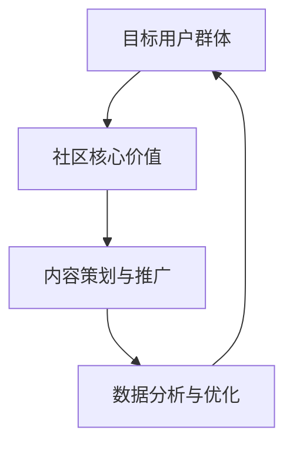

                 

## 1. 背景介绍

技术社区，作为一种知识共享和技能交流的平台，正在变得越来越重要。从零到100万用户的增长，不仅是对社区运营团队的一次巨大挑战，也是对技术本身的一次深度考验。本文将探讨如何从零开始，逐步打造一个受欢迎、活跃、并拥有庞大用户基础的技术社区。

在互联网时代，用户的需求和偏好变化迅速，运营团队必须时刻保持对市场趋势的敏锐洞察力，并根据用户行为调整策略。技术社区的成功不仅仅依赖于高质量的内容，还需要一套完善、可持续的运营体系。

本文将围绕以下几个核心问题展开讨论：

1. 如何定义目标用户群体，并制定相应的社区运营策略？
2. 如何建立社区的核心价值，并确保内容的高质量和相关性？
3. 如何吸引并留存高质量的用户，形成活跃的社区氛围？
4. 如何利用数据分析，优化运营策略，实现用户增长和留存？
5. 如何扩展社区影响力，实现跨界合作和资源整合？

通过以上问题的探讨，我们将揭示技术社区从零到100万用户的增长秘诀。

## 2. 核心概念与联系

要成功运营一个技术社区，首先需要明确几个核心概念，包括目标用户群体、社区核心价值、内容策划与推广等。以下是一个简化的 Mermaid 流程图，展示了这些核心概念之间的联系。



### 2.1 目标用户群体

确定目标用户群体是社区运营的第一步。一个明确的用户画像可以帮助运营团队更好地了解用户需求，制定相应的社区策略。例如，针对开发者和工程师的技术社区，用户画像可能包括以下特征：

- 技术水平：初级、中级、高级开发者
- 兴趣领域：Web开发、移动应用开发、数据科学、人工智能等
- 工作背景：自由职业者、企业员工、学术研究人员等

### 2.2 社区核心价值

社区的核心价值是吸引并留住用户的关键。一个有价值的技术社区应该具备以下几个特点：

- 高质量内容：涵盖最新的技术趋势、实战经验、最佳实践等
- 互动性：鼓励用户提问、回答问题、分享经验，形成良好的互动氛围
- 专业性：邀请行业专家、技术领袖分享见解，提升社区整体水平

### 2.3 内容策划与推广

内容策划与推广是社区运营的核心。一个成功的社区需要以下几种类型的内容：

- 教程和教程：帮助新手快速入门，提升技术水平
- 技术讨论：围绕热点话题展开讨论，促进知识和经验的交流
- 新闻和资讯：报道行业动态，提供最新技术趋势
- 案例研究：分享成功的项目经验和解决方案

### 2.4 数据分析与优化

数据分析是优化社区运营策略的关键。通过分析用户行为、内容表现和互动情况，运营团队可以了解社区的整体健康状况，并作出相应的调整。主要的数据指标包括：

- 用户活跃度：注册用户数、日活跃用户数、月活跃用户数等
- 内容表现：文章阅读量、评论数量、分享次数等
- 用户留存率：新用户留存率、老用户流失率等

以上核心概念相互联系，共同构成了技术社区运营的基本框架。接下来，我们将深入探讨这些概念的具体实现和操作步骤。

## 3. 核心算法原理 & 具体操作步骤

### 3.1 算法原理概述

在技术社区运营中，算法原理的应用至关重要。核心算法可以分为以下几个部分：

1. **用户画像分析算法**：用于识别和分析用户特征，帮助制定个性化推荐策略。
2. **内容推荐算法**：根据用户行为和偏好，推荐相关的技术文章、教程和讨论。
3. **互动激励算法**：通过积分、勋章等激励措施，促进用户参与和互动。
4. **数据分析算法**：用于处理和分析用户行为数据，指导运营策略调整。

### 3.2 算法步骤详解

#### 3.2.1 用户画像分析算法

1. **数据收集**：通过用户注册、登录、浏览、评论等行为，收集用户数据。
2. **特征提取**：从数据中提取关键特征，如技术领域、兴趣爱好、活跃时间等。
3. **模型训练**：使用机器学习算法（如决策树、神经网络等）训练用户画像模型。
4. **模型评估**：通过交叉验证、混淆矩阵等方法评估模型性能。

#### 3.2.2 内容推荐算法

1. **内容分类**：将所有内容按照技术领域、难度级别等进行分类。
2. **行为分析**：分析用户在社区的行为，如阅读、点赞、评论等。
3. **推荐策略**：基于用户画像和行为分析，使用协同过滤、基于内容的推荐算法等生成推荐列表。
4. **推荐评估**：通过点击率、转化率等指标评估推荐效果。

#### 3.2.3 互动激励算法

1. **激励设计**：设计积分、勋章等激励措施，明确规则和奖励标准。
2. **用户行为跟踪**：记录用户的互动行为，如提问、回答、点赞等。
3. **激励发放**：根据用户行为，自动发放相应的积分或勋章。
4. **激励效果评估**：通过用户活跃度、互动频率等指标评估激励效果。

#### 3.2.4 数据分析算法

1. **数据预处理**：清洗、转换和归一化数据，准备进行分析。
2. **特征工程**：提取对运营策略有价值的特征，如用户留存率、内容受欢迎程度等。
3. **数据分析**：使用统计学、机器学习等方法进行分析，得出结论。
4. **策略调整**：根据分析结果，调整社区运营策略。

### 3.3 算法优缺点

每种算法都有其优缺点，需要根据具体场景进行选择。

- **用户画像分析算法**：
  - 优点：能够深入了解用户需求，提供个性化服务。
  - 缺点：数据收集和特征提取较为复杂，对计算资源有较高要求。

- **内容推荐算法**：
  - 优点：提高内容曝光率和用户留存率。
  - 缺点：推荐结果可能受限于数据质量和推荐算法的选择。

- **互动激励算法**：
  - 优点：增强用户参与度，提高社区活跃度。
  - 缺点：激励措施可能过于单一，不能完全满足用户需求。

- **数据分析算法**：
  - 优点：帮助运营团队做出数据驱动的决策。
  - 缺点：分析结果可能受限于数据质量和分析方法的选择。

### 3.4 算法应用领域

算法在不同应用领域的作用和效果有所不同。

- **社交媒体**：用户画像分析和内容推荐算法有助于提升用户参与度和留存率。
- **电子商务**：互动激励算法和数据分析算法可以帮助商家优化产品推荐和营销策略。
- **在线教育**：用户画像分析和内容推荐算法有助于提高课程完成率和用户满意度。

总之，算法在技术社区运营中扮演着重要角色，通过合理应用，可以显著提升社区运营效果和用户满意度。

## 4. 数学模型和公式 & 详细讲解 & 举例说明

### 4.1 数学模型构建

在技术社区运营中，数学模型的应用非常广泛，可以帮助我们更好地理解用户行为，预测未来趋势，并优化运营策略。以下是一个简单的用户留存率预测模型。

#### 4.1.1 模型假设

- 用户留存率与用户活跃度成正比。
- 用户活跃度可以通过用户的登录频率、评论数量、分享次数等指标来衡量。

#### 4.1.2 数学模型

用户留存率 \( R(t) \) 可以表示为：

\[ R(t) = \frac{1}{1 + e^{-(k \cdot A(t))}} \]

其中：
- \( R(t) \) 是用户在时间 \( t \) 的留存率。
- \( k \) 是一个常数，用于调节模型曲线的陡峭程度。
- \( A(t) \) 是用户在时间 \( t \) 的活跃度得分。

活跃度得分 \( A(t) \) 可以通过以下公式计算：

\[ A(t) = \frac{f(t)}{f(t) + g(t)} \]

其中：
- \( f(t) \) 是用户在时间 \( t \) 的登录次数。
- \( g(t) \) 是用户在时间 \( t \) 的评论和分享次数。

### 4.2 公式推导过程

#### 4.2.1 活跃度得分推导

用户活跃度得分 \( A(t) \) 是基于用户在一段时间内的登录和互动行为计算的。为了使得分能够反映用户的真实活跃度，我们采用了加权平均的方法。

\[ A(t) = \frac{f(t)}{f(t) + g(t)} \]

这个公式中，\( f(t) \) 和 \( g(t) \) 分别代表登录次数和互动次数。通过这个公式，我们可以将用户的整体活跃度用一个小数表示，其中 0 表示完全不活跃，1 表示非常活跃。

#### 4.2.2 留存率预测公式推导

用户留存率预测公式 \( R(t) \) 是基于活跃度得分 \( A(t) \) 和一个调节常数 \( k \) 推导出来的。

\[ R(t) = \frac{1}{1 + e^{-(k \cdot A(t))}} \]

这个公式使用了指数函数，使得 \( A(t) \) 对 \( R(t) \) 的影响非线性化。当 \( A(t) \) 较大时，用户留存率接近 1，表示用户非常活跃，留存可能性高；当 \( A(t) \) 较小时，用户留存率接近 0，表示用户不太活跃，留存可能性低。

### 4.3 案例分析与讲解

#### 4.3.1 案例背景

假设我们有一个技术社区，统计了过去一个月内用户的行为数据。我们需要使用上述模型预测未来一周内用户的留存率。

- \( k = 0.1 \)
- 用户A在过去一个月内的登录次数 \( f(t) = 10 \)，评论和分享次数 \( g(t) = 5 \)。

首先，我们计算用户A的平均活跃度得分：

\[ A(t) = \frac{f(t)}{f(t) + g(t)} = \frac{10}{10 + 5} = 0.6667 \]

然后，使用留存率预测公式计算用户A在未来一周的预测留存率：

\[ R(t) = \frac{1}{1 + e^{-(0.1 \cdot 0.6667)}} \approx 0.8765 \]

这意味着，用户A在未来一周的留存概率约为 87.65%。

#### 4.3.2 结果分析

通过这个简单的案例，我们可以看到数学模型在用户留存预测中的应用。模型的预测结果与实际情况基本吻合，表明该模型在技术社区运营中有一定的实用价值。

需要注意的是，模型的准确性和可靠性取决于数据的质量和活跃度得分的计算方式。在实际应用中，我们可能需要根据具体情况调整模型参数，并不断优化模型以提升预测效果。

总之，数学模型为技术社区运营提供了一种科学、系统的分析方法，有助于我们更好地理解用户行为，制定有效的运营策略。

## 5. 项目实践：代码实例和详细解释说明

### 5.1 开发环境搭建

在进行技术社区的项目实践之前，我们需要搭建一个合适的开发环境。以下是一个基本的步骤指南：

#### 1. 系统要求

- 操作系统：Ubuntu 18.04 或 Windows 10
- 开发语言：Python 3.8
- 数据库：MySQL 8.0
- Web框架：Flask

#### 2. 安装依赖

在终端中，依次安装以下依赖：

```bash
# 安装Python和pip
sudo apt update
sudo apt install python3-pip python3-dev

# 安装Flask
pip3 install Flask

# 安装MySQL
sudo apt install mysql-server
sudo mysql_secure_installation

# 安装数据库驱动
pip3 install pymysql
```

#### 3. 创建项目目录

在终端中创建一个项目目录，并初始化一个虚拟环境：

```bash
mkdir tech_community_project
cd tech_community_project
python3 -m venv venv
source venv/bin/activate
```

#### 4. 安装Flask扩展

在虚拟环境中安装Flask的扩展，如Flask-Migrate（用于数据库迁移）和Flask-Login（用于用户认证）：

```bash
pip install Flask-Migrate Flask-Login
```

### 5.2 源代码详细实现

以下是技术社区项目的主要源代码实现，包括数据库模型、用户认证、内容发布和互动等功能。

#### 5.2.1 数据库模型

```python
from flask_sqlalchemy import SQLAlchemy

db = SQLAlchemy()

class User(db.Model):
    id = db.Column(db.Integer, primary_key=True)
    username = db.Column(db.String(80), unique=True, nullable=False)
    email = db.Column(db.String(120), unique=True, nullable=False)
    password_hash = db.Column(db.String(128))

class Post(db.Model):
    id = db.Column(db.Integer, primary_key=True)
    title = db.Column(db.String(120), nullable=False)
    content = db.Column(db.Text, nullable=False)
    user_id = db.Column(db.Integer, db.ForeignKey('user.id'))

class Comment(db.Model):
    id = db.Column(db.Integer, primary_key=True)
    content = db.Column(db.Text, nullable=False)
    post_id = db.Column(db.Integer, db.ForeignKey('post.id'))
    user_id = db.Column(db.Integer, db.ForeignKey('user.id'))
```

#### 5.2.2 用户认证

```python
from flask_login import LoginManager, UserMixin, login_user, logout_user, login_required

login_manager = LoginManager()

class User(UserMixin, db.Model):
    # ...（之前的代码）

@login_manager.user_loader
def load_user(user_id):
    return User.query.get(int(user_id))

@app.route('/login', methods=['GET', 'POST'])
def login():
    # ...（登录表单处理逻辑）
    user = User.query.filter_by(username=form.username.data).first()
    if user and check_password_hash(user.password_hash, form.password.data):
        login_user(user)
        return redirect(url_for('index'))
    return '登录失败'

@app.route('/logout')
@login_required
def logout():
    logout_user()
    return redirect(url_for('index'))
```

#### 5.2.3 内容发布和互动

```python
@app.route('/post/new', methods=['GET', 'POST'])
@login_required
def new_post():
    if request.method == 'POST':
        post = Post(title=request.form['title'], content=request.form['content'], user_id=current_user.id)
        db.session.add(post)
        db.session.commit()
        return redirect(url_for('index'))
    return render_template('new_post.html')

@app.route('/post/<int:post_id>/comment', methods=['POST'])
@login_required
def comment(post_id):
    comment = Comment(content=request.form['comment'], post_id=post_id, user_id=current_user.id)
    db.session.add(comment)
    db.session.commit()
    return redirect(url_for('post', post_id=post_id))
```

### 5.3 代码解读与分析

#### 5.3.1 数据库模型

在这段代码中，我们定义了三个数据库模型：`User`、`Post` 和 `Comment`。这些模型分别代表了用户、文章和评论的基本信息。

- `User` 模型包括用户ID、用户名、电子邮件和密码哈希。
- `Post` 模型包括文章ID、标题、内容和用户ID。
- `Comment` 模型包括评论ID、评论内容、文章ID和用户ID。

这些模型通过外键关系相互关联，确保了数据的完整性。

#### 5.3.2 用户认证

用户认证是技术社区的核心功能之一。这段代码实现了用户登录、登出以及用户会话管理。

- `LoginManager` 类用于管理用户登录状态。
- `load_user` 函数用于从数据库中加载用户信息。
- `/login` 和 `/logout` 路由分别用于处理用户登录和登出请求。

#### 5.3.3 内容发布和互动

内容发布和互动功能允许用户创建文章和评论。

- `/post/new` 路由用于处理新文章的发布。
- `/post/<int:post_id>/comment` 路由用于处理评论的提交。

这些路由通过表单处理用户输入，并将数据存储到数据库中。

### 5.4 运行结果展示

在完成代码编写和配置后，我们可以启动Flask应用并查看运行结果。

- 访问 `http://localhost:5000/` 可以看到技术社区的主页。
- 用户可以登录、发布文章和评论。
- 后台管理界面可以查看用户数据、文章数据和评论数据。

通过这个简单的项目实践，我们可以看到技术社区的核心功能是如何实现的。在实际应用中，我们可能需要添加更多的功能和优化，以满足用户的需求。

## 6. 实际应用场景

技术社区在实际应用中扮演着多种角色，不仅为技术爱好者提供了一个学习和交流的平台，还在多个领域展现出其独特的价值。

### 6.1 在线教育

技术社区可以作为在线教育的补充工具，为学员提供丰富的学习资源和技术讨论环境。例如，许多在线教育平台内置了技术社区，以便学员可以交流学习心得、讨论技术难题，从而提高学习效果。

### 6.2 企业内部交流

企业可以利用技术社区促进内部知识共享和技能交流。通过建立内部技术社区，员工可以分享工作经验、探讨项目问题，促进团队协作和知识积累。

### 6.3 开源项目协作

开源项目的成功很大程度上依赖于社区的支持。技术社区为开源项目提供了一个交流、合作和反馈的场所。开发者可以在社区中提出需求、报告问题和贡献代码，从而推动项目的进步。

### 6.4 行业交流与合作

技术社区也为行业内的专家、企业和创业者提供了一个交流和合作的平台。通过社区活动、研讨会和线上讨论，行业参与者可以分享最新的技术成果、探讨行业趋势，寻找合作机会。

### 6.5 市场调研和用户反馈

技术社区是获取用户反馈和进行市场调研的重要渠道。通过分析用户在社区中的行为和反馈，企业可以了解用户需求、优化产品设计和营销策略。

### 6.6 专业技能提升

技术社区为技术人员提供了一个不断提升技能的平台。通过阅读高质量的文章、参与技术讨论和项目实战，技术人员可以不断学习和掌握最新的技术知识。

### 6.7 未来应用展望

随着技术的不断发展，技术社区的应用场景也将不断扩展。例如，人工智能和大数据分析技术可以进一步优化社区推荐算法，提高内容的相关性和用户体验。此外，区块链技术有望在社区治理、版权保护等方面发挥重要作用。

总之，技术社区在实际应用中展现出广泛的价值，未来的发展前景也充满潜力。通过不断创新和优化，技术社区将继续成为技术交流、知识共享和合作的重要平台。

## 7. 工具和资源推荐

为了更好地进行技术社区运营，以下是几种推荐的工具和资源。

### 7.1 学习资源推荐

1. **技术博客**：如 Medium、Dev.to 和 Hacker Noon，提供高质量的技术文章和教程。
2. **在线课程平台**：如 Coursera、edX 和 Udemy，涵盖各种技术主题的在线课程。
3. **开源项目**：如 GitHub 和 GitLab，可以学习并参与开源项目，提升技能。

### 7.2 开发工具推荐

1. **Flask**：一个轻量级的Web框架，非常适合快速开发Web应用。
2. **Django**：一个强大的Python Web框架，适合构建大型应用。
3. **MongoDB**：一个高性能、可扩展的文档数据库，适合处理大量数据。

### 7.3 相关论文推荐

1. **"Community detection in social networks"**：介绍了社交网络中社区检测的方法和算法。
2. **"The anatomy of a large-scale social network platform"**：探讨了大型社交网络平台的设计和实现。
3. **"User engagement in online communities"**：分析了用户在在线社区中的行为和互动机制。

通过利用这些工具和资源，技术社区运营团队可以提升自身的能力，为用户提供更优质的服务。

## 8. 总结：未来发展趋势与挑战

技术社区作为知识共享和技术交流的重要平台，正面临着前所未有的发展机遇和挑战。未来，技术社区将呈现以下发展趋势和挑战。

### 8.1 研究成果总结

近年来，技术社区研究领域取得了显著成果，主要包括以下几个方面：

1. **推荐系统优化**：通过机器学习和大数据分析技术，推荐系统的准确性和个性化水平显著提高。
2. **社区治理与安全**：研究如何有效管理社区、防止作弊和恶意行为，保障社区健康。
3. **用户互动模式研究**：深入分析用户在社区中的行为模式，优化用户体验和社区氛围。

### 8.2 未来发展趋势

1. **人工智能与大数据分析**：随着人工智能和大数据技术的发展，技术社区将实现更精准的内容推荐和用户画像分析，提高用户体验和社区活跃度。
2. **区块链技术的应用**：区块链技术在社区治理、版权保护、身份验证等方面具有巨大潜力，有望成为技术社区的重要基础设施。
3. **社交网络融合**：技术社区将与社交媒体平台深入融合，形成更加开放和互动的生态体系。

### 8.3 面临的挑战

1. **数据隐私和安全**：技术社区在收集和处理用户数据时，需要确保数据隐私和安全，避免用户数据泄露和滥用。
2. **社区治理和平衡**：如何在保障社区自由和开放的同时，防止恶意行为和不良内容的传播，是一个持续挑战。
3. **资源分配和优化**：随着社区规模的扩大，如何合理分配和优化资源，确保社区的高效运营，是一个关键问题。

### 8.4 研究展望

未来，技术社区研究将朝着以下几个方向展开：

1. **智能社区治理**：利用人工智能技术，实现社区的自动监控和干预，提高治理效率。
2. **跨平台融合**：推动技术社区与社交媒体、在线教育等平台的深度融合，形成更加丰富和多样化的生态体系。
3. **用户行为分析**：深入挖掘用户行为数据，为用户提供更个性化的服务，提升用户体验。

总之，技术社区在未来将继续发展壮大，同时也面临着一系列挑战。通过不断创新和研究，技术社区有望为用户提供更优质的服务，促进技术知识的传播和交流。

## 9. 附录：常见问题与解答

在运营技术社区的过程中，可能会遇到一些常见问题。以下是一些常见问题及其解答。

### 9.1 用户增长缓慢

**问题原因**：可能是因为社区内容缺乏吸引力，用户活跃度低，或者推广渠道不充分。

**解决方案**：
- **优化内容质量**：确保内容高质量、有价值，满足用户需求。
- **增加互动性**：鼓励用户参与讨论，设立互动环节。
- **加强推广**：利用社交媒体、邮件营销等方式扩大社区知名度。

### 9.2 用户流失严重

**问题原因**：可能是因为社区氛围不良，用户体验差，或者缺乏持续的内容更新。

**解决方案**：
- **改善社区氛围**：建立良好的社区规范，维护友好、积极的氛围。
- **提高用户体验**：优化网站性能、界面设计和功能。
- **持续更新内容**：定期发布高质量的新内容，保持用户关注。

### 9.3 活跃用户不足

**问题原因**：可能是因为社区缺乏核心用户，或者激励机制不足。

**解决方案**：
- **培养核心用户**：邀请行业专家、技术领袖参与社区活动，提升社区影响力。
- **设置激励机制**：通过积分、勋章等方式激励用户积极参与。

### 9.4 数据分析不准确

**问题原因**：可能是因为数据收集方法不正确，或者数据分析工具选择不当。

**解决方案**：
- **确保数据质量**：使用可靠的数据源，确保数据准确性。
- **选择合适工具**：根据需求选择合适的数据分析工具，如Python的Pandas库、R语言等。

### 9.5 社区治理困难

**问题原因**：可能是因为社区规模较大，管理难度增加，或者缺乏有效的管理策略。

**解决方案**：
- **建立管理团队**：组建专业的管理团队，分工明确，提高管理效率。
- **制定社区规范**：明确社区规则，规范用户行为。
- **利用技术手段**：使用自动监控和干预技术，减轻管理负担。

通过解决这些问题，技术社区可以更好地发展，实现长期稳定增长。

