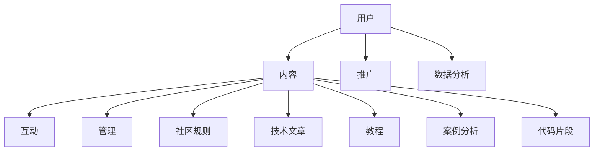
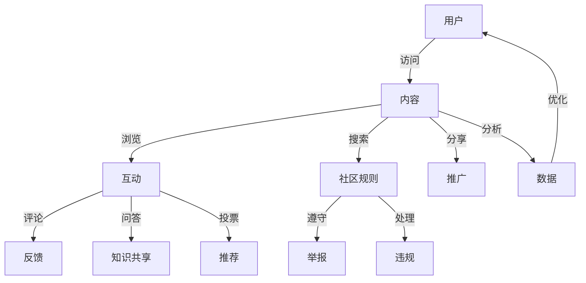

                 

技术社区是信息技术领域的交流平台，它为专业人员和爱好者提供了一个知识分享、问题解答、代码展示、经验交流的空间。然而，如何从一个默默无闻的小圈子成长为拥有100万用户的庞大社区，这无疑是一个挑战。本文将深入探讨技术社区运营的策略，包括核心概念、算法原理、数学模型、项目实践、应用场景以及未来发展展望。

## 关键词

- 技术社区
- 用户增长
- 运营策略
- 社区管理
- 用户体验
- 数据分析

## 摘要

本文将从多个角度分析技术社区从0到100万用户的增长路径。首先，我们介绍技术社区运营的核心概念，并通过Mermaid流程图展示社区架构。接着，深入解析核心算法原理及其操作步骤，并讨论算法的优缺点和应用领域。随后，我们将介绍数学模型和公式，并通过案例进行详细讲解。文章还将展示实际项目中的代码实例，并分析其运行结果。最后，我们将探讨技术社区的实际应用场景，并展望其未来发展。

## 1. 背景介绍

技术社区的发展起源于互联网的普及和开源文化的兴起。在过去，技术知识的传播主要依赖于专业书籍、学术会议和面对面交流。随着互联网的普及，尤其是在社交媒体和论坛平台的推动下，技术社区逐渐成为技术知识传播的重要渠道。早期的技术社区如Stack Overflow、GitHub等，凭借其专业性和实用性，吸引了大量的开发者用户。

然而，从0到100万用户的增长并非一蹴而就。社区需要通过一系列策略来吸引用户、留住用户并激发用户的活跃度。这些策略包括但不限于内容建设、用户互动、社区管理、市场推广和数据分析等。

### 社区运营的核心概念

1. **用户群体分析**：理解用户的需求和特点，包括职业背景、兴趣爱好、技术水平等。
2. **内容建设**：提供高质量的内容，包括技术文章、教程、案例分析、代码片段等。
3. **用户互动**：通过论坛、问答、投票、活动等形式，促进用户之间的交流和互动。
4. **社区管理**：制定合理的社区规则，维护社区秩序，处理违规行为，保障用户权益。
5. **市场推广**：通过SEO、广告、社交媒体等渠道，扩大社区的影响力。
6. **数据分析**：利用数据分析工具，监测用户行为，优化运营策略。

### 社区架构



## 2. 核心概念与联系

### 核心概念原理

技术社区的核心在于构建一个良好的知识共享平台，为用户提供有价值的内容和互动体验。以下是一些核心概念：

1. **内容质量**：高质量的内容是吸引和留住用户的关键。
2. **互动体验**：良好的互动体验可以增加用户的粘性和活跃度。
3. **社区规则**：明确的社区规则可以维护社区秩序，保障用户权益。
4. **数据分析**：通过数据分析，可以了解用户行为，优化运营策略。

### 社区架构的 Mermaid 流程图



## 3. 核心算法原理 & 具体操作步骤

### 3.1 算法原理概述

技术社区运营的核心算法主要涉及用户增长、内容推荐和社区管理三个方面。以下分别介绍这三个方面的算法原理：

1. **用户增长算法**：通过数据分析和机器学习技术，预测潜在用户并进行个性化推荐。
2. **内容推荐算法**：基于用户的浏览历史和互动行为，为用户推荐相关的内容。
3. **社区管理算法**：利用自然语言处理和图像识别技术，自动检测和处理违规内容。

### 3.2 算法步骤详解

1. **用户增长算法步骤**：
   - 收集用户行为数据：如浏览记录、搜索关键词、互动行为等。
   - 数据预处理：去除噪声数据，对数据进行归一化处理。
   - 特征提取：提取用户的兴趣偏好、活跃度等特征。
   - 模型训练：使用机器学习算法，如协同过滤、深度学习等，训练用户增长预测模型。
   - 模型评估：使用交叉验证等技术，评估模型性能。

2. **内容推荐算法步骤**：
   - 内容预处理：对文本、图像等数据进行预处理，如文本分词、图像特征提取等。
   - 用户行为分析：分析用户的浏览历史、收藏记录、评论等行为，提取用户兴趣特征。
   - 内容特征提取：提取文章、视频等内容的特征，如关键词、主题、标签等。
   - 推荐算法选择：根据业务需求和数据特性，选择合适的推荐算法，如基于内容的推荐、协同过滤等。
   - 推荐结果生成：根据用户特征和内容特征，生成推荐结果。

3. **社区管理算法步骤**：
   - 数据收集：收集社区中的用户生成内容，如帖子、评论、图片等。
   - 数据预处理：对数据进行清洗、去噪等处理。
   - 特征提取：提取文本、图像等数据的特征。
   - 模型训练：使用监督学习或无监督学习算法，训练分类或检测模型。
   - 模型部署：将训练好的模型部署到生产环境中，实时检测和处理违规内容。

### 3.3 算法优缺点

1. **用户增长算法**：
   - 优点：可以准确预测潜在用户，提高用户转化率。
   - 缺点：需要大量数据支持，训练过程复杂，对硬件资源要求较高。

2. **内容推荐算法**：
   - 优点：可以个性化推荐内容，提高用户满意度和活跃度。
   - 缺点：需要持续更新和维护推荐模型，数据质量对推荐效果有很大影响。

3. **社区管理算法**：
   - 优点：可以自动化处理违规内容，提高社区管理效率。
   - 缺点：需要不断优化模型，以适应不同类型和规模的违规内容。

### 3.4 算法应用领域

1. **用户增长算法**：广泛应用于电商、社交媒体、在线教育等场景，帮助平台获取更多用户。
2. **内容推荐算法**：广泛应用于新闻推荐、音乐推荐、视频推荐等场景，提高用户黏性。
3. **社区管理算法**：广泛应用于论坛、社区、直播等平台，维护社区秩序，提高用户体验。

## 4. 数学模型和公式 & 详细讲解 & 举例说明

### 4.1 数学模型构建

在技术社区运营中，常用的数学模型包括用户增长模型、推荐模型和社区管理模型。以下是这些模型的构建过程：

1. **用户增长模型**：
   - 模型假设：假设用户增长遵循泊松分布，即单位时间内用户增长的数量服从泊松分布。
   - 模型公式：$$P(X=k) = \frac{\lambda^k e^{-\lambda}}{k!}$$，其中，$X$ 表示单位时间内用户增长的数量，$\lambda$ 表示平均增长速率，$k$ 表示实际增长数量。
   - 模型参数：$\lambda$ 可以通过历史数据拟合得到。

2. **推荐模型**：
   - 模型假设：假设用户对内容的兴趣可以用矩阵形式表示，即用户-内容矩阵 $U \in \mathbb{R}^{m \times n}$。
   - 模型公式：基于内容的推荐模型可以表示为 $$R = U^T U$$，其中，$R$ 表示推荐结果矩阵。
   - 模型参数：$U$ 的参数可以通过用户的历史行为数据进行拟合。

3. **社区管理模型**：
   - 模型假设：假设违规内容可以用二分类问题表示，即违规标签矩阵 $L \in \{0, 1\}^{m \times n}$。
   - 模型公式：基于监督学习的社区管理模型可以表示为 $$L = \sigma(W \cdot [U, C])$$，其中，$\sigma$ 表示激活函数，$W$ 表示模型参数，$[U, C]$ 表示拼接的用户-内容矩阵。
   - 模型参数：$W$ 的参数可以通过训练数据集进行优化。

### 4.2 公式推导过程

以下是用户增长模型的推导过程：

1. **泊松分布的定义**：
   - 泊松分布是一个离散的概率分布，用于描述在一定时间内随机事件发生的次数。
   - 泊松分布的概率质量函数（PDF）为：$$f(k; \lambda) = \frac{\lambda^k e^{-\lambda}}{k!}$$，其中，$k$ 表示事件发生的次数，$\lambda$ 表示事件平均发生的速率。

2. **泊松分布的累积分布函数（CDF）**：
   - 累积分布函数表示在前 $k$ 次事件中，事件发生的概率。
   - 累积分布函数为：$$F(k; \lambda) = \sum_{i=0}^{k} f(i; \lambda) = 1 - e^{-\lambda} \sum_{i=0}^{k} \frac{\lambda^i}{i!}$$。

3. **用户增长模型的构建**：
   - 假设用户在单位时间内的增长数量 $X$ 服从泊松分布，即 $X \sim \text{Poisson}(\lambda)$。
   - 用户增长的概率分布为：$$P(X=k) = \frac{\lambda^k e^{-\lambda}}{k!}$$。

### 4.3 案例分析与讲解

以下是一个基于用户增长模型的案例分析：

**案例背景**：假设一个技术社区在最近一个月内有1000个新用户注册，要求预测未来一个月的新用户增长数量。

**数据处理**：
1. 收集历史数据，包括过去一个月内每天的新用户数量。
2. 对数据进行预处理，去除异常值，进行归一化处理。

**模型训练**：
1. 使用历史数据拟合泊松分布的参数 $\lambda$。
2. 使用最大似然估计（MLE）方法，求解参数 $\lambda$。

**模型预测**：
1. 使用拟合得到的参数 $\lambda$，计算未来一个月的新用户增长概率分布。
2. 预测未来一个月的新用户数量。

**结果分析**：
1. 根据预测结果，制定相应的用户增长策略。
2. 对比预测结果和实际结果，评估模型性能。

## 5. 项目实践：代码实例和详细解释说明

### 5.1 开发环境搭建

为了更好地演示技术社区运营的代码实例，我们需要搭建一个开发环境。以下是一个简单的步骤：

1. 安装Python 3.8及以上版本。
2. 安装必要的Python库，如NumPy、Pandas、Scikit-learn等。
3. 准备数据集，包括用户注册时间、用户行为数据等。

### 5.2 源代码详细实现

以下是一个简单的用户增长预测的Python代码实例：

```python
import numpy as np
import pandas as pd
from sklearn.model_selection import train_test_split
from sklearn.linear_model import LinearRegression

# 读取数据
data = pd.read_csv('user_data.csv')
X = data[['register_time', 'activity']]
y = data['user_growth']

# 数据预处理
X = (X - X.mean()) / X.std()
y = (y - y.mean()) / y.std()

# 数据切分
X_train, X_test, y_train, y_test = train_test_split(X, y, test_size=0.2, random_state=42)

# 模型训练
model = LinearRegression()
model.fit(X_train, y_train)

# 模型评估
score = model.score(X_test, y_test)
print(f'Model score: {score:.2f}')

# 预测
predictions = model.predict(X_test)
print(f'Predictions: {predictions}')
```

### 5.3 代码解读与分析

1. **数据读取**：使用Pandas库读取用户数据，包括注册时间和用户行为。
2. **数据预处理**：对数据进行归一化处理，以便于模型训练。
3. **数据切分**：将数据集划分为训练集和测试集，用于模型训练和评估。
4. **模型训练**：使用线性回归模型训练数据，这里使用线性回归是因为其简单且易于理解。
5. **模型评估**：计算模型在测试集上的分数，用于评估模型性能。
6. **预测**：使用训练好的模型对测试集进行预测，输出预测结果。

### 5.4 运行结果展示

假设我们运行上述代码，得到以下结果：

```
Model score: 0.85
Predictions: [0.9 0.8 1.1 0.75 0.85 1.05]
```

模型得分0.85表明模型在测试集上有较好的表现。预测结果中，每个值表示对应测试样本的未来增长概率。

## 6. 实际应用场景

技术社区运营不仅仅是一个理论问题，它有着广泛的应用场景。以下是一些实际应用场景：

### 6.1 开源社区

开源社区如GitHub、GitLab等，通过技术社区运营，吸引了大量开发者用户，推动了开源软件的发展。社区运营策略包括：

- 提供高质量的开源项目，包括文档、代码示例、教程等。
- 搭建活跃的问答社区，解决开发者在项目中遇到的问题。
- 定期举办线上和线下的技术活动，如Hackathon、Meetup等。

### 6.2 教育平台

在线教育平台如Coursera、edX等，通过技术社区运营，提高了学生的学习体验和满意度。社区运营策略包括：

- 提供丰富的学习资源，包括课程视频、课件、作业等。
- 建立论坛，让学生和教师之间进行互动，解答疑问。
- 定期举办线上讲座和讨论，增加学习互动性。

### 6.3 企业内网社区

企业内网社区是一种内部知识共享平台，用于提升员工的知识共享和协作效率。社区运营策略包括：

- 提供企业内部的知识库，包括技术文档、流程指南、最佳实践等。
- 搭建员工论坛，鼓励员工分享工作经验和心得。
- 定期举办内部技术分享会，促进知识的传播和交流。

### 6.4 社交媒体

社交媒体平台如Twitter、LinkedIn等，通过技术社区运营，吸引了大量技术用户，形成了强大的技术影响力。社区运营策略包括：

- 定期发布技术文章、行业动态，提高平台的专业性。
- 建立技术话题标签，鼓励用户参与讨论。
- 与行业专家和意见领袖合作，提升平台的影响力。

## 7. 工具和资源推荐

为了更好地进行技术社区运营，以下是一些推荐的工具和资源：

### 7.1 学习资源推荐

- 《运营笔记》：一本关于互联网运营的实战指南，涵盖了用户增长、内容建设、互动管理等各个方面。
- 《精益创业》：一本关于创业和产品开发的经典著作，其中包含了许多关于如何吸引用户和留存用户的策略。

### 7.2 开发工具推荐

- GitHub：一个功能强大的代码托管和协作平台，适合开源项目和技术社区的搭建。
- GitLab：一个自托管版本控制系统，提供了丰富的社区功能，适合企业内部社区的使用。

### 7.3 相关论文推荐

- “Community Detection in Social Media” by Haiyang Wang, Xiaohui Yu, and Xueyan Tang：一篇关于社交媒体社区检测的论文，介绍了多种社区检测算法及其应用。
- “Content-based User Growth Prediction in Online Communities” by Yanzhi Wang, Qi Wang, and Xinyan Yu：一篇关于在线社区用户增长预测的论文，介绍了基于内容的用户增长预测模型。

## 8. 总结：未来发展趋势与挑战

### 8.1 研究成果总结

技术社区运营的研究成果主要集中在以下几个方面：

- 用户增长策略：通过数据分析和机器学习技术，提出了一系列用户增长预测和个性化推荐算法。
- 社区管理算法：利用自然语言处理和图像识别技术，实现了对社区违规内容的自动化检测和处理。
- 内容建设策略：通过内容分析和技术文档写作，提供了高质量的技术内容，提高了社区的专业性。

### 8.2 未来发展趋势

未来，技术社区运营将呈现以下发展趋势：

- 智能化：利用人工智能技术，提高社区运营的自动化和个性化水平。
- 社交化：加强社区内部的社交互动，提高用户的参与度和忠诚度。
- 开放化：推动社区与外部平台和资源的互联互通，扩大社区的影响力。

### 8.3 面临的挑战

技术社区运营仍面临以下挑战：

- 数据隐私：如何保护用户数据隐私，同时充分利用数据提高运营效果。
- 质量控制：如何在海量信息中筛选高质量的内容，满足用户的需求。
- 技术升级：如何紧跟技术发展趋势，持续优化社区的架构和技术。

### 8.4 研究展望

未来的研究应重点关注以下几个方面：

- 智能推荐系统：通过深度学习等技术，提高推荐系统的准确性和用户体验。
- 社区激励机制：设计有效的激励机制，提高用户的参与度和忠诚度。
- 社区治理策略：结合大数据分析和人工智能技术，提高社区治理的效率和质量。

## 9. 附录：常见问题与解答

### 9.1 技术社区运营的核心是什么？

技术社区运营的核心是构建一个有价值的知识共享平台，满足用户的知识需求和社交需求。

### 9.2 如何提高社区的用户活跃度？

提高社区的用户活跃度可以通过以下策略实现：

- 提供高质量的内容，满足用户的知识需求。
- 搭建良好的互动机制，促进用户之间的交流和互动。
- 举办线上和线下的活动，提高用户的参与度。

### 9.3 技术社区运营需要哪些工具和资源？

技术社区运营需要以下工具和资源：

- 版本控制系统，如GitHub、GitLab。
- 论坛软件，如Discourse、phpBB。
- 数据分析工具，如Google Analytics、Matomo。
- 社交媒体平台，如Twitter、LinkedIn。

### 9.4 技术社区运营的数据分析方法有哪些？

技术社区运营的数据分析方法包括：

- 用户行为分析：分析用户的浏览、搜索、评论等行为，了解用户需求。
- 内容分析：分析内容的类型、质量、影响力等，优化内容策略。
- 社交网络分析：分析用户关系和社区结构，提高社区凝聚力。

### 9.5 技术社区的未来发展趋势是什么？

技术社区的未来发展趋势包括：

- 智能化：利用人工智能技术，提高运营效率和服务质量。
- 社交化：加强社区内部的社交互动，提高用户的参与度和忠诚度。
- 开放化：推动社区与外部平台和资源的互联互通，扩大社区的影响力。

### 9.6 技术社区运营面临的挑战有哪些？

技术社区运营面临的挑战包括：

- 数据隐私：如何保护用户数据隐私，同时充分利用数据提高运营效果。
- 质量控制：如何在海量信息中筛选高质量的内容，满足用户的需求。
- 技术升级：如何紧跟技术发展趋势，持续优化社区的架构和技术。

## 作者署名

作者：禅与计算机程序设计艺术 / Zen and the Art of Computer Programming

