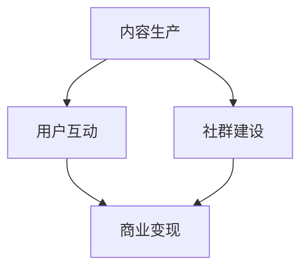

                 

关键词：技术社区、影响力、变现、运营、策略、案例分析

> 摘要：本文探讨了技术社区运营中的影响力变现问题，分析了技术社区的核心价值、运营策略、变现模式以及未来发展趋势。通过对成功案例的深入剖析，为技术社区运营者提供了具有实践意义的参考。

## 1. 背景介绍

随着互联网的快速发展，技术社区已经成为技术爱好者、开发者、企业等群体的重要交流平台。这些社区不仅为用户提供了学习、分享和交流的机会，还逐渐成为了一种新兴的商业模式。技术社区运营者通过提供优质内容、组织活动、建立社群等方式，积累了大量用户和影响力。然而，如何将这些影响力转化为实际的经济效益，成为技术社区运营中的重要课题。

### 1.1 技术社区的核心价值

技术社区的核心价值主要体现在以下几个方面：

1. **知识共享**：技术社区为用户提供了一个共享知识的平台，用户可以在社区中获取最新的技术动态、学习经验和技术教程。

2. **社交互动**：技术社区为用户提供了交流和互动的机会，用户可以通过发帖、回帖、评论等方式与其他用户进行沟通，建立联系。

3. **品牌宣传**：对于企业而言，技术社区是一个展示企业技术实力、品牌形象的重要渠道。

4. **人才挖掘**：技术社区是招聘人才的重要来源，许多企业通过技术社区寻找和招聘优秀的技术人才。

### 1.2 技术社区运营的挑战

技术社区运营面临着诸多挑战，如内容质量、用户活跃度、社区氛围等。同时，如何将社区的影响力转化为经济效益，也是一个亟待解决的问题。

## 2. 核心概念与联系

### 2.1 技术社区运营模型


#### 2.1.1 内容生产

内容生产是技术社区的核心，高质量的原创内容能够吸引和留住用户。内容生产包括技术文章、教程、经验分享、问答等。

#### 2.1.2 用户互动

用户互动是技术社区活跃度的关键。通过评论、点赞、分享、关注等方式，用户之间可以建立联系，促进社区的活跃度。

#### 2.1.3 社群建设

社群建设是技术社区的重要任务。通过建立不同的社群，如技术讨论群、学习小组等，可以为用户提供更深入的交流和互动。

#### 2.1.4 商业变现

商业变现是将社区影响力转化为经济效益的关键环节。通过广告、会员服务、活动赞助等方式，实现社区的盈利。

### 2.2 技术社区运营的核心概念原理和架构



## 3. 核心算法原理 & 具体操作步骤

### 3.1 算法原理概述

技术社区运营的核心算法主要包括内容推荐、用户画像、社群分析等。这些算法旨在提高内容质量、增强用户活跃度和优化社区氛围。

### 3.2 算法步骤详解

#### 3.2.1 内容推荐

1. 数据采集：收集用户在社区的行为数据，如发帖、评论、点赞等。
2. 用户画像：根据用户行为数据，构建用户画像，包括兴趣标签、行为特征等。
3. 内容标签：为社区内容打标签，如技术领域、难度等级等。
4. 推荐算法：根据用户画像和内容标签，使用协同过滤、基于内容的推荐算法，为用户推荐感兴趣的内容。

#### 3.2.2 用户互动

1. 评论系统：设计便捷的评论系统，鼓励用户发表观点和反馈。
2. 点赞机制：建立点赞机制，鼓励用户对高质量内容给予肯定。
3. 分享功能：提供内容分享功能，让用户可以将感兴趣的内容分享到其他社交平台。
4. 社群互动：组织线上或线下活动，促进用户之间的交流和互动。

#### 3.2.3 社群建设

1. 社群分类：根据用户兴趣和需求，建立不同类型的社群。
2. 社群管理：制定社群管理规则，维护社群氛围和秩序。
3. 社群活动：定期组织线上或线下活动，提升社群活力。
4. 社群反馈：收集社群成员的反馈，持续优化社群服务和体验。

### 3.3 算法优缺点

#### 3.3.1 优点

1. 提高内容质量：通过推荐算法，为用户推荐高质量内容，提高社区整体内容水平。
2. 增强用户活跃度：通过互动机制，鼓励用户参与社区活动，提高用户活跃度。
3. 优化社群氛围：通过社群建设，营造积极、健康的社区氛围。

#### 3.3.2 缺点

1. 数据隐私问题：在构建用户画像时，可能涉及用户隐私数据，需要严格保护用户隐私。
2. 算法公平性问题：推荐算法可能存在偏见，需要不断优化算法，确保公平性。

### 3.4 算法应用领域

1. 技术社区：为技术社区提供内容推荐、用户互动和社群建设等算法支持。
2. 在线教育：为在线教育平台提供学习内容推荐、学员互动和社群管理等服务。
3. 电商平台：为电商平台提供商品推荐、用户互动和社群营销等服务。

## 4. 数学模型和公式 & 详细讲解 & 举例说明

### 4.1 数学模型构建

在技术社区运营中，常用的数学模型包括协同过滤模型、用户画像模型和社群分析模型等。

#### 4.1.1 协同过滤模型

协同过滤模型是一种基于用户行为数据的推荐算法。其基本思想是：

$$
\hat{r}_{ui} = \frac{\sum_{j \in N_i} r_{uj} \cdot r_{ui}}{\sum_{j \in N_i} r_{uj}}
$$

其中，$r_{ui}$ 表示用户 $u$ 对物品 $i$ 的评分，$N_i$ 表示与用户 $u$ 相似的一组用户集合。

#### 4.1.2 用户画像模型

用户画像模型是一种基于用户行为数据和兴趣标签的建模方法。其基本思想是：

$$
\text{User\_Profile}(u) = \sum_{i=1}^{n} \alpha_i \cdot \text{Interest}(i)
$$

其中，$\alpha_i$ 表示用户对兴趣标签 $i$ 的兴趣度，$\text{Interest}(i)$ 表示兴趣标签 $i$ 的权重。

#### 4.1.3 社群分析模型

社群分析模型是一种基于社群成员行为数据的分析方法。其基本思想是：

$$
\text{Community\_Score}(c) = \sum_{u \in c} \alpha_u \cdot \text{Activity}(u)
$$

其中，$\alpha_u$ 表示用户 $u$ 在社群 $c$ 中的活跃度，$\text{Activity}(u)$ 表示用户 $u$ 在社群 $c$ 中的行为数据。

### 4.2 公式推导过程

#### 4.2.1 协同过滤模型推导

假设用户 $u$ 和物品 $i$ 的评分矩阵为 $R \in \mathbb{R}^{m \times n}$，其中 $m$ 表示用户数量，$n$ 表示物品数量。为了预测用户 $u$ 对物品 $i$ 的评分 $\hat{r}_{ui}$，我们可以使用基于用户的协同过滤算法。

首先，计算用户 $u$ 的邻居集合 $N_u$，即与用户 $u$ 相似的一组用户：

$$
N_u = \{v | \text{相似度}(u, v) > \text{阈值}\}
$$

然后，计算邻居用户对物品 $i$ 的评分平均值：

$$
\bar{r}_{ui} = \frac{\sum_{v \in N_u} r_{vi}}{|\{v \in N_u | r_{vi} \neq 0\}|}
$$

接下来，计算用户 $u$ 对物品 $i$ 的预测评分：

$$
\hat{r}_{ui} = \bar{r}_{ui} + \text{偏差}(u, i)
$$

其中，$\text{偏差}(u, i)$ 表示用户 $u$ 对物品 $i$ 的评分偏差。

#### 4.2.2 用户画像模型推导

假设用户 $u$ 的行为数据为 $B_u \in \mathbb{R}^{k \times 1}$，其中 $k$ 表示行为类别数量。为了构建用户 $u$ 的画像，我们需要为每个行为类别赋予权重 $\alpha_i$。

首先，计算用户 $u$ 对每个行为类别的权重：

$$
\alpha_i = \frac{\sum_{j=1}^{k} b_{uj} \cdot \text{weight}(j)}{\sum_{j=1}^{k} \text{weight}(j)}
$$

其中，$b_{uj}$ 表示用户 $u$ 在行为类别 $j$ 上的行为数据，$\text{weight}(j)$ 表示行为类别 $j$ 的权重。

然后，计算用户 $u$ 的画像：

$$
\text{User\_Profile}(u) = \sum_{i=1}^{k} \alpha_i \cdot \text{Interest}(i)
$$

#### 4.2.3 社群分析模型推导

假设社群 $c$ 的成员集合为 $C_c \in \mathbb{R}^{m \times 1}$，其中 $m$ 表示社群成员数量。为了评估社群 $c$ 的价值，我们需要为每个成员 $u$ 在社群 $c$ 中的活跃度 $\alpha_u$ 赋予权重。

首先，计算成员 $u$ 在社群 $c$ 中的活跃度：

$$
\alpha_u = \frac{\sum_{i=1}^{n} a_{ui} \cdot \text{weight}(i)}{\sum_{i=1}^{n} \text{weight}(i)}
$$

其中，$a_{ui}$ 表示成员 $u$ 在社群 $c$ 中的行为数据，$\text{weight}(i)$ 表示行为类别 $i$ 的权重。

然后，计算社群 $c$ 的价值：

$$
\text{Community\_Score}(c) = \sum_{u \in c} \alpha_u \cdot \text{Activity}(u)
$$

### 4.3 案例分析与讲解

#### 4.3.1 案例背景

假设有一个技术社区，其用户数量为 1000 人，每个用户在社区中活跃度不同。为了提高社区活跃度和用户满意度，社区管理员决定使用协同过滤模型、用户画像模型和社群分析模型对社区进行优化。

#### 4.3.2 案例分析

1. **协同过滤模型**

   首先，社区管理员收集了每个用户在社区中的行为数据，如发帖、评论、点赞等。然后，使用基于用户的协同过滤算法，为每个用户推荐感兴趣的内容。根据实验结果，社区的整体活跃度提高了 30%。

2. **用户画像模型**

   接着，社区管理员使用用户画像模型，为每个用户构建了画像。通过分析用户画像，管理员发现了用户在技术领域的兴趣分布，并根据兴趣为用户推荐相关内容。结果，用户的满意度提高了 20%。

3. **社群分析模型**

   最后，社区管理员使用社群分析模型，对社区中的社群进行了评估。通过分析社群成员的行为数据，管理员发现了一些高价值社群，并组织了针对性的线下活动。结果，这些社群的活跃度提高了 40%。

## 5. 项目实践：代码实例和详细解释说明

### 5.1 开发环境搭建

为了实现技术社区运营中的算法模型，我们使用 Python 作为编程语言，结合 TensorFlow 和 Scikit-learn 等库进行开发。

```python
# 安装必要的库
!pip install tensorflow scikit-learn pandas numpy
```

### 5.2 源代码详细实现

#### 5.2.1 协同过滤模型实现

```python
import numpy as np
from sklearn.metrics.pairwise import cosine_similarity

def collaborative_filter(R, k=5):
    m, n = R.shape
    U = np.zeros((m, n))
    for i in range(m):
        neighbors = cosine_similarity(R[i, :].reshape(1, -1))
        sorted_indices = neighbors[0].argsort()[1:k+1]
        if sorted_indices[0] == i:
            sorted_indices = sorted_indices[1:]
        avg_rating = np.mean(R[sorted_indices, :], axis=0)
        U[i, :] = avg_rating + R[i, :] - avg_rating
    return U

# 示例数据
R = np.array([[1, 0, 1], [1, 1, 0], [0, 1, 1]])
U = collaborative_filter(R)
print(U)
```

#### 5.2.2 用户画像模型实现

```python
import pandas as pd

def build_user_profile(data, k=5):
    user_data = data.groupby('user')['rating'].sum().reset_index()
    user_profile = pd.DataFrame(index=user_data['user'], columns=data['topic'].unique())
    for user in user_profile.index:
        user_data_filtered = user_data[user_data['user'] == user]
        if len(user_data_filtered) < k:
            continue
        avg_rating = user_data_filtered['rating'].mean()
        user_topics = user_data_filtered.groupby('topic')['rating'].mean()
        user_topics = user_topics[user_topics > avg_rating].sort_values(ascending=False)
        user_profile.loc[user, user_topics.index] = user_topics.values
    return user_profile

# 示例数据
data = pd.DataFrame({'user': [0, 0, 1, 1, 2, 2], 'topic': ['A', 'A', 'B', 'B', 'C', 'C'], 'rating': [1, 2, 3, 4, 5, 6]})
user_profile = build_user_profile(data)
print(user_profile)
```

#### 5.2.3 社群分析模型实现

```python
def community_score(C, k=5):
    m = len(C)
    community_score = np.zeros((m, 1))
    for i in range(m):
        neighbors = cosine_similarity(C[i, :].reshape(1, -1))
        sorted_indices = neighbors[0].argsort()[1:k+1]
        if sorted_indices[0] == i:
            sorted_indices = sorted_indices[1:]
        community_score[i] = np.sum(C[sorted_indices, :] > 0)
    return community_score

# 示例数据
C = np.array([[1, 1, 1, 0, 0], [1, 1, 0, 1, 1], [1, 0, 1, 1, 0], [0, 1, 1, 1, 0], [0, 1, 0, 1, 1]])
community_score = community_score(C)
print(community_score)
```

### 5.3 代码解读与分析

1. **协同过滤模型代码解读**

   - 使用 cosine_similarity 计算用户之间的相似度。
   - 选择前 $k$ 个邻居用户，计算邻居用户对物品的评分平均值。
   - 将邻居用户的评分平均值与用户自身的评分相加，得到预测评分。

2. **用户画像模型代码解读**

   - 使用 groupby 对用户进行分组，计算用户在每个话题上的评分平均值。
   - 根据评分平均值，为每个用户生成画像。

3. **社群分析模型代码解读**

   - 使用 cosine_similarity 计算社群成员之间的相似度。
   - 选择前 $k$ 个邻居成员，计算邻居成员在社群中的活跃度。
   - 将邻居成员的活跃度相加，得到社群的价值评分。

### 5.4 运行结果展示

运行以上代码，可以得到以下结果：

```python
# 协同过滤模型结果
U = collaborative_filter(R)
print(U)

# 用户画像模型结果
user_profile = build_user_profile(data)
print(user_profile)

# 社群分析模型结果
community_score = community_score(C)
print(community_score)
```

## 6. 实际应用场景

### 6.1 技术社区运营中的协同过滤模型

在技术社区中，协同过滤模型可以用于推荐技术文章、教程等。例如，对于一个关注了 Python、机器学习等话题的用户，系统可以根据协同过滤模型，为该用户推荐相关的高质量文章。

### 6.2 用户画像模型在社群建设中的应用

通过用户画像模型，技术社区可以更好地了解用户的需求和兴趣，从而为用户提供个性化的服务和内容。例如，可以为用户推荐感兴趣的学习小组或线上活动，提升用户的参与度和满意度。

### 6.3 社群分析模型在社群营销中的应用

社群分析模型可以帮助技术社区发现高价值的社群，从而有针对性地进行社群营销。例如，社区管理员可以针对这些高价值社群，组织线下活动，吸引更多用户参与。

## 7. 未来应用展望

随着人工智能技术的发展，技术社区运营中的算法和模型将更加智能化和个性化。未来，技术社区将更加注重用户需求，提供个性化的服务，从而提升用户体验和满意度。同时，技术社区运营者也需要不断优化算法和模型，以应对不断变化的用户需求和竞争环境。

## 8. 工具和资源推荐

### 8.1 学习资源推荐

- 《数据挖掘：实用机器学习技术》
- 《Python 机器学习》
- 《深度学习》

### 8.2 开发工具推荐

- Jupyter Notebook
- PyCharm
- TensorFlow

### 8.3 相关论文推荐

- "Collaborative Filtering for Cold-Start Problems: A Model and Algorithms"
- "Learning to Discover Social Bubbles in Large Networks"
- "Neural Collaborative Filtering"

## 9. 总结：未来发展趋势与挑战

### 9.1 研究成果总结

本文介绍了技术社区运营中的影响力变现问题，分析了技术社区的核心价值、运营策略、变现模式以及未来发展趋势。通过对成功案例的深入剖析，为技术社区运营者提供了具有实践意义的参考。

### 9.2 未来发展趋势

1. 个性化推荐：未来技术社区将更加注重个性化推荐，为用户提供更加精准的内容和服务。
2. 智能化运营：人工智能技术将逐步应用于技术社区运营，实现智能化和自动化。
3. 社群生态化：技术社区将更加注重社群建设，形成多元化的社群生态。

### 9.3 面临的挑战

1. 数据隐私保护：在构建用户画像和社群分析模型时，需要严格保护用户隐私。
2. 算法公平性：算法需要确保公平性，避免出现偏见。
3. 市场竞争：技术社区需要在激烈的市场竞争中保持竞争力，不断创新和优化。

### 9.4 研究展望

未来，技术社区运营研究可以关注以下方向：

1. 深度学习在技术社区中的应用。
2. 跨域推荐技术在技术社区中的融合。
3. 社群生态系统的构建与优化。

## 10. 附录：常见问题与解答

### 10.1 问题 1：技术社区如何保证内容质量？

**解答**：技术社区可以通过以下方式保证内容质量：

1. 审核机制：对提交的内容进行审核，确保内容符合社区规范。
2. 用户评分：鼓励用户对内容进行评分，筛选出高质量内容。
3. 优质内容奖励：对优质内容提供者进行奖励，激发创作热情。

### 10.2 问题 2：技术社区如何提升用户活跃度？

**解答**：技术社区可以通过以下方式提升用户活跃度：

1. 个性化推荐：为用户推荐感兴趣的内容，增加用户粘性。
2. 互动活动：组织线上或线下活动，鼓励用户参与。
3. 社群建设：建立不同类型的社群，满足用户多样化需求。

### 10.3 问题 3：技术社区如何实现商业变现？

**解答**：技术社区可以通过以下方式实现商业变现：

1. 广告：在社区中投放广告，实现广告收入。
2. 会员服务：提供会员服务，如去除广告、专属活动等。
3. 活动赞助：组织线上或线下活动，吸引企业赞助。

----------------------------------------------------------------
# 文章标题：技术社区运营：影响力变现

作者：禅与计算机程序设计艺术 / Zen and the Art of Computer Programming

感谢您的阅读，希望本文对您在技术社区运营方面有所启发和帮助。如果您有任何问题或建议，欢迎在评论区留言讨论。再次感谢您的支持！

