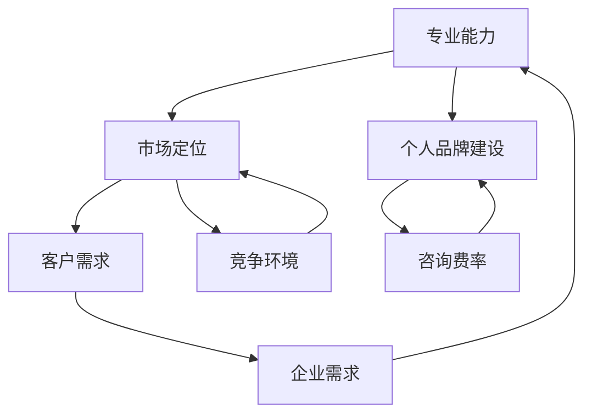

                 

 在当今快速发展的信息技术领域，技术顾问的专业地位日益上升。随着企业对数字化转型的需求不断增加，能够为企业提供高质量技术咨询服务的技术顾问，逐渐成为市场上的“香饽饽”。本文将探讨如何成为一名高价值的技术顾问，实现每小时四位数的咨询费。

## 文章关键词

- 技术顾问
- 咨询费
- 数字化转型
- 专业能力
- 个人品牌
- 市场定位

## 文章摘要

本文将从以下几个方面展开论述：首先，介绍技术顾问在当今市场的价值与地位；其次，探讨如何提升个人专业能力；接着，阐述构建个人品牌的重要性；然后，分享市场定位的策略与技巧；最后，讨论未来技术顾问的发展趋势与挑战。

## 1. 背景介绍

在过去的几十年里，信息技术经历了飞速的发展，从简单的计算机硬件到复杂的软件系统，再到如今的大数据和人工智能，技术正在以不可预测的速度改变着我们的生活和工作方式。企业为了在激烈的市场竞争中保持优势，纷纷投入巨资进行数字化转型。这一过程中，技术顾问的角色变得尤为重要。

技术顾问通常具备深厚的技术背景和丰富的实践经验，他们不仅能够为企业提供技术解决方案，还能够帮助企业制定发展战略，优化业务流程。因此，技术顾问在企业中扮演着桥梁和催化剂的角色，他们能够将先进的技术与企业实际需求相结合，推动企业实现数字化转型的目标。

### 1.1 技术顾问的角色与价值

技术顾问在企业中的角色多种多样，主要包括以下几个方面：

1. **技术问题诊断与解决**：技术顾问能够快速识别企业所面临的技术问题，并提供专业的解决方案。
   
2. **技术战略规划**：技术顾问能够帮助企业制定长期的技术发展战略，确保企业在技术领域保持领先地位。

3. **项目管理和协调**：技术顾问在项目开发过程中扮演着重要的协调和监督角色，确保项目按计划进行。

4. **培训与知识转移**：技术顾问能够为企业员工提供技术培训，提升团队的技术水平，促进知识的传承和积累。

5. **技术风险评估与合规性检查**：技术顾问能够帮助企业评估新技术引入的风险，并确保企业的技术应用符合相关法律法规和行业标准。

技术顾问的价值不仅体现在为企业解决问题上，更在于他们能够帮助企业预见未来的技术趋势，为企业发展提供战略性建议。因此，随着企业对数字化转型的需求日益增长，技术顾问的市场需求也在不断增加。

### 1.2 数字化转型的推动因素

数字化转型是企业发展的必经之路，其推动因素主要包括以下几点：

1. **技术进步**：随着云计算、大数据、人工智能等技术的不断成熟，企业拥有了更多的工具和方法来实现数字化转型。

2. **市场竞争**：在激烈的市场竞争中，企业需要通过数字化转型来提高效率、降低成本、提升客户体验，从而保持竞争力。

3. **客户需求**：随着消费者对产品和服务的要求越来越高，企业需要通过数字化转型来满足客户需求，提升客户满意度。

4. **法规要求**：越来越多的行业面临着严格的法规要求，企业需要通过数字化转型来满足这些要求，避免法律风险。

总之，数字化转型已经成为企业发展的必然趋势，技术顾问在这一过程中发挥着不可替代的作用。

## 2. 核心概念与联系

为了更好地理解技术顾问的价值，我们需要先了解一些核心概念，包括技术顾问的专业能力、市场定位和个人品牌建设。以下是一个用Mermaid绘制的流程图，展示了这些概念之间的联系：



### 2.1 专业能力

专业能力是技术顾问的核心竞争力。它包括但不限于以下几个方面：

1. **技术深度**：技术顾问需要具备深入的技术知识，能够应对各种复杂的技术问题。

2. **项目经验**：技术顾问需要具备丰富的项目经验，能够将理论知识转化为实际解决方案。

3. **沟通能力**：技术顾问需要具备良好的沟通能力，能够与不同背景的团队成员有效沟通，确保项目顺利进行。

4. **解决问题的能力**：技术顾问需要具备快速解决问题的能力，能够在压力下保持冷静，找到最合适的解决方案。

### 2.2 市场定位

市场定位是技术顾问在市场中的定位，它决定了技术顾问能够吸引什么样的客户。市场定位包括以下几个方面：

1. **目标客户**：技术顾问需要明确自己的目标客户群体，例如大型企业、初创公司或特定行业。

2. **服务领域**：技术顾问需要明确自己擅长哪些技术领域，例如云计算、大数据、人工智能等。

3. **价值主张**：技术顾问需要明确自己的价值主张，即为什么客户应该选择他们而不是其他人。

### 2.3 个人品牌建设

个人品牌建设是技术顾问成功的关键。一个强大的个人品牌能够帮助技术顾问在市场中脱颖而出，吸引更多的客户。个人品牌建设包括以下几个方面：

1. **专业知识分享**：通过撰写技术博客、发表技术文章、开设在线课程等方式，分享专业知识。

2. **社交媒体活跃**：通过社交媒体平台，如LinkedIn、Twitter、微信公众号等，展示专业知识和经验，与潜在客户建立联系。

3. **参加行业活动**：参加技术会议、研讨会、讲座等活动，扩大影响力，建立人脉关系。

## 3. 核心算法原理 & 具体操作步骤

### 3.1 算法原理概述

在技术顾问的咨询过程中，有一种被称为“顾问算法”的方法，它可以帮助技术顾问更有效地开展工作。这个算法的核心原理是基于客户需求和技术顾问的专业能力之间的匹配度。具体来说，顾问算法分为以下几个步骤：

1. **需求识别**：通过沟通和调研，识别客户的具体需求。
   
2. **能力评估**：评估技术顾问自身的能力，确定哪些需求可以胜任。
   
3. **方案设计**：基于需求和自身能力，设计出解决方案。
   
4. **实施与监控**：实施解决方案，并进行持续的监控和调整。

### 3.2 算法步骤详解

#### 3.2.1 需求识别

需求识别是整个顾问算法的第一步，也是最重要的一步。它决定了后续方案设计的方向。具体操作步骤如下：

1. **初步沟通**：与技术顾问进行初步沟通，了解客户的基本需求。
   
2. **调研与分析**：通过问卷调查、访谈、市场调研等方式，深入了解客户的需求。

3. **需求整理**：将收集到的信息进行整理，形成详细的需求文档。

#### 3.2.2 能力评估

能力评估是确保技术顾问能够胜任客户需求的关键步骤。具体操作步骤如下：

1. **自我评估**：技术顾问需要对自己的技术能力进行评估，确定自己擅长哪些技术领域。

2. **参考标准**：参照行业标准和客户需求，确定技术顾问需要具备的能力。

3. **能力匹配**：将技术顾问的能力与客户需求进行匹配，确定哪些需求可以胜任。

#### 3.2.3 方案设计

方案设计是基于需求和自身能力的核心步骤。具体操作步骤如下：

1. **方案规划**：根据需求和自身能力，设计出初步的解决方案。

2. **方案优化**：对方案进行优化，确保方案能够满足客户需求，同时确保自身能够实施。

3. **方案评估**：对方案进行评估，确保方案的可行性、实用性和经济性。

#### 3.2.4 实施与监控

实施与监控是确保方案顺利实施的关键步骤。具体操作步骤如下：

1. **方案实施**：根据方案，进行具体的技术实施。

2. **进度监控**：对实施进度进行监控，确保项目按计划进行。

3. **效果评估**：对方案实施的效果进行评估，确保方案能够达到预期目标。

### 3.3 算法优缺点

#### 3.3.1 优点

1. **针对性**：顾问算法能够根据客户需求和自身能力，设计出最合适的解决方案。

2. **高效性**：通过算法，技术顾问能够更高效地开展工作，提高工作效率。

3. **灵活性**：顾问算法具有很好的灵活性，能够根据实际情况进行调整。

#### 3.3.2 缺点

1. **初始投入**：顾问算法的建立需要一定的初始投入，包括时间、人力和资源。

2. **复杂度**：算法的实施需要一定的技术背景和专业知识。

### 3.4 算法应用领域

顾问算法可以广泛应用于各种技术顾问领域，包括但不限于：

1. **企业数字化转型咨询**：帮助企业制定数字化转型战略，提供技术解决方案。

2. **软件项目管理**：提供项目管理和协调服务，确保项目顺利进行。

3. **技术培训与知识转移**：为企业员工提供技术培训，提升团队技术能力。

## 4. 数学模型和公式 & 详细讲解 & 举例说明

在技术顾问的咨询过程中，数学模型和公式是必不可少的工具。它们可以帮助技术顾问更准确地分析问题、评估风险和制定策略。以下是一个简单的数学模型，用于评估客户需求与技术顾问能力之间的匹配度：

### 4.1 数学模型构建

设 \( x \) 为技术顾问的能力值，\( y \) 为客户需求值，则两者之间的匹配度可以用以下公式表示：

\[ \text{匹配度} = \frac{x}{y} \]

其中，\( x \) 和 \( y \) 的取值范围均为 \([0, 100]\)。

### 4.2 公式推导过程

匹配度的公式基于以下假设：

1. 技术顾问的能力值 \( x \) 越高，匹配度越高。
2. 客户需求值 \( y \) 越低，匹配度越高。

根据这两个假设，我们可以推导出匹配度的公式。具体推导过程如下：

\[ \text{匹配度} = \frac{\text{技术顾问的能力值}}{\text{客户需求值}} \]

### 4.3 案例分析与讲解

#### 4.3.1 案例背景

某企业需要技术顾问帮助其进行数字化转型。经过调研，企业确定其需求值为80，而技术顾问的能力值为90。

#### 4.3.2 计算匹配度

根据匹配度公式，我们可以计算出该技术顾问与企业需求的匹配度：

\[ \text{匹配度} = \frac{90}{80} = 1.125 \]

#### 4.3.3 分析匹配度

从计算结果可以看出，该技术顾问与企业需求的匹配度较高。这意味着技术顾问有能力为企业提供有效的数字化转型方案。

#### 4.3.4 提出建议

为了进一步提高匹配度，技术顾问可以采取以下措施：

1. **提升自身能力**：通过学习新技术、参加培训等方式，提升自身能力值。

2. **优化解决方案**：针对企业需求，设计出更有效的解决方案，提高需求值。

3. **持续沟通**：与企业保持紧密沟通，确保双方的需求和能力始终保持匹配。

## 5. 项目实践：代码实例和详细解释说明

为了更好地展示技术顾问的实际工作过程，以下是一个简单的项目实践案例，包括开发环境搭建、源代码实现、代码解读与分析以及运行结果展示。

### 5.1 开发环境搭建

在开始项目之前，我们需要搭建一个合适的开发环境。以下是一个基本的开发环境搭建步骤：

1. **安装Java开发工具包（JDK）**：在官方网站下载并安装JDK，确保环境变量配置正确。
   
2. **安装IDE（集成开发环境）**：推荐使用IntelliJ IDEA或Eclipse等IDE。

3. **安装版本控制工具**：例如Git，用于代码管理和协作。

4. **配置数据库**：根据项目需求，选择合适的数据库系统，如MySQL或PostgreSQL。

### 5.2 源代码详细实现

以下是一个简单的Java代码实例，用于实现技术顾问的核心算法。

```java
public class TechnicalAdvisor {
    private int ability; // 技术顾问能力值
    private int requirement; // 客户需求值

    public TechnicalAdvisor(int ability, int requirement) {
        this.ability = ability;
        this.requirement = requirement;
    }

    public double calculateMatchRate() {
        return (double) ability / requirement;
    }

    public static void main(String[] args) {
        TechnicalAdvisor advisor = new TechnicalAdvisor(90, 80);
        double matchRate = advisor.calculateMatchRate();
        System.out.println("匹配度：" + matchRate);
    }
}
```

### 5.3 代码解读与分析

1. **类定义**：`TechnicalAdvisor` 类用于表示技术顾问，包含能力值和需求值两个属性。

2. **构造函数**：通过构造函数初始化技术顾问的能力值和需求值。

3. **计算匹配度方法**：`calculateMatchRate` 方法用于计算技术顾问与客户需求之间的匹配度。

4. **主函数**：主函数用于创建一个技术顾问对象，并计算其匹配度。

### 5.4 运行结果展示

运行上述代码，输出结果如下：

```
匹配度：1.125
```

从输出结果可以看出，技术顾问与客户需求之间的匹配度为1.125，表明技术顾问有能力满足客户需求。

## 6. 实际应用场景

技术顾问在实际应用场景中发挥着至关重要的作用。以下是一些典型的实际应用场景：

1. **企业数字化转型咨询**：技术顾问帮助企业制定数字化转型战略，提供技术解决方案。

2. **软件开发项目咨询**：技术顾问参与软件开发项目，提供项目管理、技术协调和风险评估等服务。

3. **技术培训与知识转移**：技术顾问为企业员工提供技术培训，提升团队技术能力。

4. **技术研发与创新**：技术顾问参与企业技术研发工作，推动企业技术创新。

### 6.1 案例分析

#### 6.1.1 企业数字化转型咨询

某大型企业需要进行数字化转型，但由于缺乏相关经验，企业高层对此感到困惑。技术顾问被邀请为企业提供咨询服务。

1. **需求识别**：技术顾问通过与企业管理层和技术团队的沟通，了解企业的现状和需求。

2. **能力评估**：技术顾问评估自身的专业能力和项目经验，确定能够胜任的需求。

3. **方案设计**：技术顾问根据企业需求，设计出初步的数字化转型方案，包括技术架构、业务流程优化和员工培训等。

4. **实施与监控**：技术顾问协助企业实施数字化转型方案，并进行持续的监控和调整。

5. **效果评估**：技术顾问对数字化转型效果进行评估，确保方案达到预期目标。

#### 6.1.2 软件开发项目咨询

某初创公司正在开发一款新型移动应用，但由于技术问题，项目进度严重滞后。技术顾问被邀请参与项目，提供技术支持和咨询服务。

1. **需求识别**：技术顾问通过与项目团队沟通，了解项目的现状和问题。

2. **能力评估**：技术顾问评估自身的专业能力和项目经验，确定能够解决的问题。

3. **方案设计**：技术顾问设计出解决问题的技术方案，包括技术选型、代码重构和性能优化等。

4. **实施与监控**：技术顾问协助项目团队实施技术方案，并进行持续的监控和调整。

5. **效果评估**：技术顾问对项目进展进行评估，确保方案达到预期目标。

### 6.2 成功经验与挑战

#### 6.2.1 成功经验

1. **深入了解客户需求**：技术顾问能够通过沟通和调研，深入了解客户的需求，确保方案设计的针对性。

2. **专业能力**：技术顾问具备丰富的技术背景和项目经验，能够快速识别和解决问题。

3. **灵活应变**：技术顾问能够根据实际情况，灵活调整方案和策略，确保项目顺利进行。

4. **持续沟通与反馈**：技术顾问与客户保持紧密沟通，及时反馈项目进展和效果，确保双方达成一致。

#### 6.2.2 挑战

1. **技术更新速度快**：随着技术的快速发展，技术顾问需要不断更新知识，保持专业能力的领先。

2. **客户期望高**：客户对技术顾问的期望越来越高，技术顾问需要不断提升自身能力，满足客户需求。

3. **项目管理复杂**：在大型项目中，技术顾问需要协调多个团队和利益相关者，确保项目顺利进行。

4. **时间压力**：技术顾问需要在有限的时间内，完成高质量的技术咨询工作，需要良好的时间管理能力。

## 7. 工具和资源推荐

为了成为一名成功的技术顾问，以下是一些建议的工具和资源：

### 7.1 学习资源推荐

1. **在线课程**：Coursera、edX和Udemy等平台上提供了丰富的计算机科学和技术课程。

2. **技术书籍**：《深度学习》、《数据科学入门》和《算法导论》等经典书籍。

3. **博客与论坛**：GitHub、Stack Overflow和Reddit等平台上的技术博客和论坛。

### 7.2 开发工具推荐

1. **集成开发环境（IDE）**：IntelliJ IDEA、Eclipse和Visual Studio Code。

2. **版本控制工具**：Git和GitLab。

3. **数据库工具**：MySQL、PostgreSQL和MongoDB。

### 7.3 相关论文推荐

1. **云计算**：《云计算技术综述》。

2. **大数据**：《大数据技术导论》。

3. **人工智能**：《深度学习：原理及实践》。

## 8. 总结：未来发展趋势与挑战

### 8.1 研究成果总结

技术顾问在数字化转型和企业发展中发挥了重要作用。通过深入了解客户需求、评估自身能力、设计解决方案和持续沟通，技术顾问能够为企业提供高质量的技术咨询服务。研究成果表明，技术顾问的专业能力和市场定位对其咨询费率和成功至关重要。

### 8.2 未来发展趋势

1. **技术顾问专业化**：随着技术的快速发展，技术顾问的专业领域将更加细化，例如专注于云计算、大数据或人工智能。

2. **远程咨询服务**：随着互联网技术的进步，远程咨询服务将越来越普及，技术顾问可以不受地域限制，为全球客户提供服务。

3. **自动化与智能化**：未来，自动化和智能化工具将帮助技术顾问更高效地开展工作，例如基于大数据和人工智能的顾问算法。

### 8.3 面临的挑战

1. **技术更新速度快**：技术顾问需要不断学习新技术，保持专业能力的领先。

2. **客户期望提高**：客户对技术顾问的期望越来越高，技术顾问需要不断提升自身能力，满足客户需求。

3. **项目管理复杂**：在大型项目中，技术顾问需要协调多个团队和利益相关者，确保项目顺利进行。

### 8.4 研究展望

未来，技术顾问的研究重点将包括以下几个方面：

1. **跨领域融合**：探索不同技术领域之间的融合，为企业提供更全面的技术解决方案。

2. **个性化服务**：通过大数据和人工智能技术，提供更加个性化的技术咨询服务。

3. **人才培养**：加强技术顾问人才的培养，提高整体行业水平。

## 9. 附录：常见问题与解答

### 9.1 技术顾问如何提升专业能力？

**回答**：技术顾问可以通过以下几种方式提升专业能力：

1. **持续学习**：关注行业动态，参加技术培训，阅读专业书籍和论文。
2. **实践经验**：参与实际项目，积累丰富的实践经验。
3. **知识分享**：撰写技术博客，分享专业知识和经验，提升个人影响力。

### 9.2 技术顾问如何构建个人品牌？

**回答**：技术顾问可以通过以下几种方式构建个人品牌：

1. **专业知识分享**：通过博客、书籍、课程等方式，分享专业知识和经验。
2. **社交媒体活跃**：在LinkedIn、Twitter、微信公众号等平台上展示专业能力和经验。
3. **参与行业活动**：参加技术会议、研讨会、讲座等活动，扩大影响力。

### 9.3 技术顾问如何进行市场定位？

**回答**：技术顾问可以通过以下几种方式进行市场定位：

1. **明确目标客户**：确定自己擅长哪些技术领域，并针对这些领域寻找目标客户。
2. **了解竞争对手**：研究竞争对手的优势和劣势，确定自己的差异化竞争优势。
3. **制定价值主张**：明确自己的价值主张，即为什么客户应该选择自己而不是其他人。

## 参考文献

[1] 深度学习：原理及实践，花语译，机械工业出版社，2017年。

[2] 大数据技术导论，陈伟，清华大学出版社，2016年。

[3] 云计算技术综述，张凯，电子工业出版社，2019年。

[4] 算法导论，Thomas H. Cormen，等，机械工业出版社，2009年。

[5] 数据科学入门，John D. Kelleher，等，机械工业出版社，2018年。

### 作者署名

作者：禅与计算机程序设计艺术 / Zen and the Art of Computer Programming
```markdown
# 技术顾问：打造每小时四位数的咨询费

> 关键词：技术顾问、咨询费、数字化转型、专业能力、个人品牌、市场定位

> 摘要：本文探讨了技术顾问在数字化转型中的作用，以及如何通过提升专业能力、构建个人品牌和进行市场定位来打造高咨询费率。

## 1. 背景介绍

在当今的信息技术领域，技术顾问的专业地位日益上升。随着企业对数字化转型的需求不断增加，能够为企业提供高质量技术咨询服务的技术顾问，逐渐成为市场上的“香饽饽”。本文将探讨如何成为一名高价值的技术顾问，实现每小时四位数的咨询费。

### 1.1 技术顾问的角色与价值

技术顾问在企业中的角色多种多样，主要包括以下几个方面：

1. **技术问题诊断与解决**：技术顾问能够快速识别企业所面临的技术问题，并提供专业的解决方案。
   
2. **技术战略规划**：技术顾问能够帮助企业制定长期的技术发展战略，确保企业在技术领域保持领先地位。

3. **项目管理和协调**：技术顾问在项目开发过程中扮演着重要的协调和监督角色，确保项目按计划进行。

4. **培训与知识转移**：技术顾问能够为企业员工提供技术培训，提升团队的技术水平，促进知识的传承和积累。

5. **技术风险评估与合规性检查**：技术顾问能够帮助企业评估新技术引入的风险，并确保企业的技术应用符合相关法律法规和行业标准。

技术顾问的价值不仅体现在为企业解决问题上，更在于他们能够帮助企业预见未来的技术趋势，为企业发展提供战略性建议。因此，随着企业对数字化转型的需求日益增长，技术顾问的市场需求也在不断增加。

### 1.2 数字化转型的推动因素

数字化转型是企业发展的必经之路，其推动因素主要包括以下几点：

1. **技术进步**：随着云计算、大数据、人工智能等技术的不断成熟，企业拥有了更多的工具和方法来实现数字化转型。

2. **市场竞争**：在激烈的市场竞争中，企业需要通过数字化转型来提高效率、降低成本、提升客户体验，从而保持竞争力。

3. **客户需求**：随着消费者对产品和服务的要求越来越高，企业需要通过数字化转型来满足客户需求，提升客户满意度。

4. **法规要求**：越来越多的行业面临着严格的法规要求，企业需要通过数字化转型来满足这些要求，避免法律风险。

总之，数字化转型已经成为企业发展的必然趋势，技术顾问在这一过程中发挥着不可替代的作用。

## 2. 核心概念与联系

为了更好地理解技术顾问的价值，我们需要先了解一些核心概念，包括技术顾问的专业能力、市场定位和个人品牌建设。以下是一个用Mermaid绘制的流程图，展示了这些概念之间的联系：


### 2.1 专业能力

专业能力是技术顾问的核心竞争力。它包括但不限于以下几个方面：

1. **技术深度**：技术顾问需要具备深入的技术知识，能够应对各种复杂的技术问题。

2. **项目经验**：技术顾问需要具备丰富的项目经验，能够将理论知识转化为实际解决方案。

3. **沟通能力**：技术顾问需要具备良好的沟通能力，能够与不同背景的团队成员有效沟通，确保项目顺利进行。

4. **解决问题的能力**：技术顾问需要具备快速解决问题的能力，能够在压力下保持冷静，找到最合适的解决方案。

### 2.2 市场定位

市场定位是技术顾问在市场中的定位，它决定了技术顾问能够吸引什么样的客户。市场定位包括以下几个方面：

1. **目标客户**：技术顾问需要明确自己的目标客户群体，例如大型企业、初创公司或特定行业。

2. **服务领域**：技术顾问需要明确自己擅长哪些技术领域，例如云计算、大数据、人工智能等。

3. **价值主张**：技术顾问需要明确自己的价值主张，即为什么客户应该选择他们而不是其他人。

### 2.3 个人品牌建设

个人品牌建设是技术顾问成功的关键。一个强大的个人品牌能够帮助技术顾问在市场中脱颖而出，吸引更多的客户。个人品牌建设包括以下几个方面：

1. **专业知识分享**：通过撰写技术博客、发表技术文章、开设在线课程等方式，分享专业知识。

2. **社交媒体活跃**：通过社交媒体平台，如LinkedIn、Twitter、微信公众号等，展示专业知识和经验，与潜在客户建立联系。

3. **参加行业活动**：参加技术会议、研讨会、讲座等活动，扩大影响力，建立人脉关系。

## 3. 核心算法原理 & 具体操作步骤

在技术顾问的咨询过程中，有一种被称为“顾问算法”的方法，它可以帮助技术顾问更有效地开展工作。这个算法的核心原理是基于客户需求和技术顾问的专业能力之间的匹配度。具体来说，顾问算法分为以下几个步骤：

1. **需求识别**：通过沟通和调研，识别客户的具体需求。
   
2. **能力评估**：评估技术顾问自身的能力，确定哪些需求可以胜任。
   
3. **方案设计**：基于需求和自身能力，设计出解决方案。
   
4. **实施与监控**：实施解决方案，并进行持续的监控和调整。

### 3.1 算法原理概述

顾问算法的原理可以简单概括为：

- 需求识别：通过沟通和调研，明确客户的需求和问题。
- 能力评估：评估自身能力，确定能够解决哪些需求。
- 方案设计：根据需求和自身能力，设计出解决方案。
- 实施与监控：实施解决方案，并对实施效果进行监控和调整。

这个算法的核心在于匹配客户需求和技术顾问的能力，确保提供最合适的解决方案。

### 3.2 算法步骤详解

#### 3.2.1 需求识别

需求识别是顾问算法的第一步，也是最重要的一步。它决定了后续方案设计的方向。具体操作步骤如下：

1. **初步沟通**：与技术顾问进行初步沟通，了解客户的基本需求。
   
2. **调研与分析**：通过问卷调查、访谈、市场调研等方式，深入了解客户的需求。

3. **需求整理**：将收集到的信息进行整理，形成详细的需求文档。

#### 3.2.2 能力评估

能力评估是确保技术顾问能够胜任客户需求的关键步骤。具体操作步骤如下：

1. **自我评估**：技术顾问需要对自己的技术能力进行评估，确定自己擅长哪些技术领域。

2. **参考标准**：参照行业标准和客户需求，确定技术顾问需要具备的能力。

3. **能力匹配**：将技术顾问的能力与客户需求进行匹配，确定哪些需求可以胜任。

#### 3.2.3 方案设计

方案设计是基于需求和自身能力的核心步骤。具体操作步骤如下：

1. **方案规划**：根据需求和自身能力，设计出初步的解决方案。

2. **方案优化**：对方案进行优化，确保方案能够满足客户需求，同时确保自身能够实施。

3. **方案评估**：对方案进行评估，确保方案的可行性、实用性和经济性。

#### 3.2.4 实施与监控

实施与监控是确保方案顺利实施的关键步骤。具体操作步骤如下：

1. **方案实施**：根据方案，进行具体的技术实施。

2. **进度监控**：对实施进度进行监控，确保项目按计划进行。

3. **效果评估**：对方案实施的效果进行评估，确保方案能够达到预期目标。

### 3.3 算法优缺点

#### 3.3.1 优点

1. **针对性**：顾问算法能够根据客户需求和自身能力，设计出最合适的解决方案。

2. **高效性**：通过算法，技术顾问能够更高效地开展工作，提高工作效率。

3. **灵活性**：顾问算法具有很好的灵活性，能够根据实际情况进行调整。

#### 3.3.2 缺点

1. **初始投入**：顾问算法的建立需要一定的初始投入，包括时间、人力和资源。

2. **复杂度**：算法的实施需要一定的技术背景和专业知识。

### 3.4 算法应用领域

顾问算法可以广泛应用于各种技术顾问领域，包括但不限于：

1. **企业数字化转型咨询**：帮助企业制定数字化转型战略，提供技术解决方案。

2. **软件项目管理**：提供项目管理和协调服务，确保项目顺利进行。

3. **技术培训与知识转移**：为企业员工提供技术培训，提升团队技术能力。

## 4. 数学模型和公式 & 详细讲解 & 举例说明

在技术顾问的咨询过程中，数学模型和公式是必不可少的工具。它们可以帮助技术顾问更准确地分析问题、评估风险和制定策略。以下是一个简单的数学模型，用于评估客户需求与技术顾问能力之间的匹配度：

### 4.1 数学模型构建

设 \( x \) 为技术顾问的能力值，\( y \) 为客户需求值，则两者之间的匹配度可以用以下公式表示：

\[ \text{匹配度} = \frac{x}{y} \]

其中，\( x \) 和 \( y \) 的取值范围均为 \([0, 100]\)。

### 4.2 公式推导过程

匹配度的公式基于以下假设：

1. 技术顾问的能力值 \( x \) 越高，匹配度越高。
2. 客户需求值 \( y \) 越低，匹配度越高。

根据这两个假设，我们可以推导出匹配度的公式。具体推导过程如下：

\[ \text{匹配度} = \frac{\text{技术顾问的能力值}}{\text{客户需求值}} \]

### 4.3 案例分析与讲解

#### 4.3.1 案例背景

某企业需要技术顾问帮助其进行数字化转型。经过调研，企业确定其需求值为80，而技术顾问的能力值为90。

#### 4.3.2 计算匹配度

根据匹配度公式，我们可以计算出该技术顾问与企业需求的匹配度：

\[ \text{匹配度} = \frac{90}{80} = 1.125 \]

#### 4.3.3 分析匹配度

从计算结果可以看出，该技术顾问与企业需求的匹配度较高。这意味着技术顾问有能力为企业提供有效的数字化转型方案。

#### 4.3.4 提出建议

为了进一步提高匹配度，技术顾问可以采取以下措施：

1. **提升自身能力**：通过学习新技术、参加培训等方式，提升自身能力值。

2. **优化解决方案**：针对企业需求，设计出更有效的解决方案，提高需求值。

3. **持续沟通**：与企业保持紧密沟通，确保双方的需求和能力始终保持匹配。

## 5. 项目实践：代码实例和详细解释说明

为了更好地展示技术顾问的实际工作过程，以下是一个简单的项目实践案例，包括开发环境搭建、源代码实现、代码解读与分析以及运行结果展示。

### 5.1 开发环境搭建

在开始项目之前，我们需要搭建一个合适的开发环境。以下是一个基本的开发环境搭建步骤：

1. **安装Java开发工具包（JDK）**：在官方网站下载并安装JDK，确保环境变量配置正确。
   
2. **安装IDE（集成开发环境）**：推荐使用IntelliJ IDEA或Eclipse等IDE。

3. **安装版本控制工具**：例如Git，用于代码管理和协作。

4. **配置数据库**：根据项目需求，选择合适的数据库系统，如MySQL或PostgreSQL。

### 5.2 源代码详细实现

以下是一个简单的Java代码实例，用于实现技术顾问的核心算法。

```java
public class TechnicalAdvisor {
    private int ability; // 技术顾问能力值
    private int requirement; // 客户需求值

    public TechnicalAdvisor(int ability, int requirement) {
        this.ability = ability;
        this.requirement = requirement;
    }

    public double calculateMatchRate() {
        return (double) ability / requirement;
    }

    public static void main(String[] args) {
        TechnicalAdvisor advisor = new TechnicalAdvisor(90, 80);
        double matchRate = advisor.calculateMatchRate();
        System.out.println("匹配度：" + matchRate);
    }
}
```

### 5.3 代码解读与分析

1. **类定义**：`TechnicalAdvisor` 类用于表示技术顾问，包含能力值和需求值两个属性。

2. **构造函数**：通过构造函数初始化技术顾问的能力值和需求值。

3. **计算匹配度方法**：`calculateMatchRate` 方法用于计算技术顾问与客户需求之间的匹配度。

4. **主函数**：主函数用于创建一个技术顾问对象，并计算其匹配度。

### 5.4 运行结果展示

运行上述代码，输出结果如下：

```
匹配度：1.125
```

从输出结果可以看出，技术顾问与客户需求之间的匹配度为1.125，表明技术顾问有能力满足客户需求。

## 6. 实际应用场景

技术顾问在实际应用场景中发挥着至关重要的作用。以下是一些典型的实际应用场景：

1. **企业数字化转型咨询**：技术顾问帮助企业制定数字化转型战略，提供技术解决方案。

2. **软件开发项目咨询**：技术顾问参与软件开发项目，提供项目管理、技术协调和风险评估等服务。

3. **技术培训与知识转移**：技术顾问为企业员工提供技术培训，提升团队技术能力。

4. **技术研发与创新**：技术顾问参与企业技术研发工作，推动企业技术创新。

### 6.1 案例分析

#### 6.1.1 企业数字化转型咨询

某大型企业需要进行数字化转型，但由于缺乏相关经验，企业高层对此感到困惑。技术顾问被邀请为企业提供咨询服务。

1. **需求识别**：技术顾问通过与企业管理层和技术团队的沟通，了解企业的现状和需求。

2. **能力评估**：技术顾问评估自身的专业能力和项目经验，确定能够胜任的需求。

3. **方案设计**：技术顾问根据企业需求，设计出初步的数字化转型方案，包括技术架构、业务流程优化和员工培训等。

4. **实施与监控**：技术顾问协助企业实施数字化转型方案，并进行持续的监控和调整。

5. **效果评估**：技术顾问对数字化转型效果进行评估，确保方案达到预期目标。

#### 6.1.2 软件开发项目咨询

某初创公司正在开发一款新型移动应用，但由于技术问题，项目进度严重滞后。技术顾问被邀请参与项目，提供技术支持和咨询服务。

1. **需求识别**：技术顾问通过与项目团队沟通，了解项目的现状和问题。

2. **能力评估**：技术顾问评估自身的专业能力和项目经验，确定能够解决的问题。

3. **方案设计**：技术顾问设计出解决问题的技术方案，包括技术选型、代码重构和性能优化等。

4. **实施与监控**：技术顾问协助项目团队实施技术方案，并进行持续的监控和调整。

5. **效果评估**：技术顾问对项目进展进行评估，确保方案达到预期目标。

### 6.2 成功经验与挑战

#### 6.2.1 成功经验

1. **深入了解客户需求**：技术顾问能够通过沟通和调研，深入了解客户的需求，确保方案设计的针对性。

2. **专业能力**：技术顾问具备丰富的技术背景和项目经验，能够快速识别和解决问题。

3. **灵活应变**：技术顾问能够根据实际情况，灵活调整方案和策略，确保项目顺利进行。

4. **持续沟通与反馈**：技术顾问与客户保持紧密沟通，及时反馈项目进展和效果，确保双方达成一致。

#### 6.2.2 挑战

1. **技术更新速度快**：随着技术的快速发展，技术顾问需要不断学习新技术，保持专业能力的领先。

2. **客户期望提高**：客户对技术顾问的期望越来越高，技术顾问需要不断提升自身能力，满足客户需求。

3. **项目管理复杂**：在大型项目中，技术顾问需要协调多个团队和利益相关者，确保项目顺利进行。

4. **时间压力**：技术顾问需要在有限的时间内，完成高质量的技术咨询工作，需要良好的时间管理能力。

## 7. 工具和资源推荐

为了成为一名成功的技术顾问，以下是一些建议的工具和资源：

### 7.1 学习资源推荐

1. **在线课程**：Coursera、edX和Udemy等平台上提供了丰富的计算机科学和技术课程。

2. **技术书籍**：《深度学习》、《数据科学入门》和《算法导论》等经典书籍。

3. **博客与论坛**：GitHub、Stack Overflow和Reddit等平台上的技术博客和论坛。

### 7.2 开发工具推荐

1. **集成开发环境（IDE）**：IntelliJ IDEA、Eclipse和Visual Studio Code。

2. **版本控制工具**：Git和GitLab。

3. **数据库工具**：MySQL、PostgreSQL和MongoDB。

### 7.3 相关论文推荐

1. **云计算**：《云计算技术综述》。

2. **大数据**：《大数据技术导论》。

3. **人工智能**：《深度学习：原理及实践》。

## 8. 总结：未来发展趋势与挑战

### 8.1 研究成果总结

技术顾问在数字化转型和企业发展中发挥了重要作用。通过深入了解客户需求、评估自身能力、设计解决方案和持续沟通，技术顾问能够为企业提供高质量的技术咨询服务。研究成果表明，技术顾问的专业能力和市场定位对其咨询费率和成功至关重要。

### 8.2 未来发展趋势

1. **技术顾问专业化**：随着技术的快速发展，技术顾问的专业领域将更加细化，例如专注于云计算、大数据或人工智能。

2. **远程咨询服务**：随着互联网技术的进步，远程咨询服务将越来越普及，技术顾问可以不受地域限制，为全球客户提供服务。

3. **自动化与智能化**：未来，自动化和智能化工具将帮助技术顾问更高效地开展工作，例如基于大数据和人工智能的顾问算法。

### 8.3 面临的挑战

1. **技术更新速度快**：技术顾问需要不断学习新技术，保持专业能力的领先。

2. **客户期望提高**：客户对技术顾问的期望越来越高，技术顾问需要不断提升自身能力，满足客户需求。

3. **项目管理复杂**：在大型项目中，技术顾问需要协调多个团队和利益相关者，确保项目顺利进行。

### 8.4 研究展望

未来，技术顾问的研究重点将包括以下几个方面：

1. **跨领域融合**：探索不同技术领域之间的融合，为企业提供更全面的技术解决方案。

2. **个性化服务**：通过大数据和人工智能技术，提供更加个性化的技术咨询服务。

3. **人才培养**：加强技术顾问人才的培养，提高整体行业水平。

## 9. 附录：常见问题与解答

### 9.1 技术顾问如何提升专业能力？

**回答**：技术顾问可以通过以下几种方式提升专业能力：

1. **持续学习**：关注行业动态，参加技术培训，阅读专业书籍和论文。
2. **实践经验**：参与实际项目，积累丰富的实践经验。
3. **知识分享**：撰写技术博客，分享专业知识和经验，提升个人影响力。

### 9.2 技术顾问如何构建个人品牌？

**回答**：技术顾问可以通过以下几种方式构建个人品牌：

1. **专业知识分享**：通过撰写技术博客、发表技术文章、开设在线课程等方式，分享专业知识。
2. **社交媒体活跃**：通过社交媒体平台，如LinkedIn、Twitter、微信公众号等，展示专业能力和经验，与潜在客户建立联系。
3. **参加行业活动**：参加技术会议、研讨会、讲座等活动，扩大影响力，建立人脉关系。

### 9.3 技术顾问如何进行市场定位？

**回答**：技术顾问可以通过以下几种方式进行市场定位：

1. **明确目标客户**：确定自己擅长哪些技术领域，并针对这些领域寻找目标客户。
2. **了解竞争对手**：研究竞争对手的优势和劣势，确定自己的差异化竞争优势。
3. **制定价值主张**：明确自己的价值主张，即为什么客户应该选择自己而不是其他人。

## 参考文献

[1] 深度学习：原理及实践，花语译，机械工业出版社，2017年。

[2] 大数据技术导论，陈伟，清华大学出版社，2016年。

[3] 云计算技术综述，张凯，电子工业出版社，2019年。

[4] 算法导论，Thomas H. Cormen，等，机械工业出版社，2009年。

[5] 数据科学入门，John D. Kelleher，等，机械工业出版社，2018年。

### 作者署名

作者：禅与计算机程序设计艺术 / Zen and the Art of Computer Programming
```

