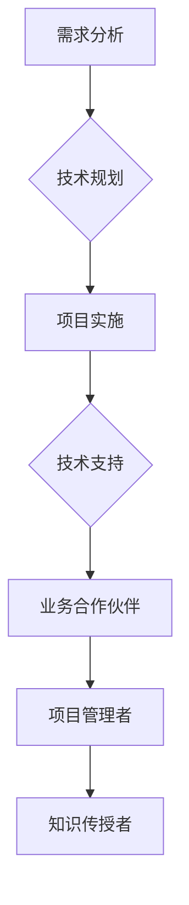

                 

关键词：技术顾问、高薪兼职、IT行业、编程技能、专业发展、远程工作

## 摘要

在信息技术飞速发展的今天，技术顾问作为高薪兼职的选择越来越受到专业人士的青睐。本文将深入探讨技术顾问的定义、角色、市场需求及其在IT行业中的重要性，并提供一系列策略和资源，帮助读者顺利开展这一高薪兼职工作。通过本文，您将了解到成为一名成功技术顾问的必要条件、所需技能、职业发展路径以及如何在现代远程工作环境中脱颖而出。

## 1. 背景介绍

随着全球信息化进程的加快，信息技术（IT）行业已经成为经济增长的重要驱动力。从企业级系统架构到移动应用开发，IT技术的广泛应用已经深入到各行各业。在这个背景下，技术顾问的角色变得尤为关键。技术顾问不仅为企业提供专业的技术咨询服务，还能帮助企业解决复杂的技术难题，优化业务流程，提升竞争力。

近年来，远程工作模式逐渐普及，使得技术顾问可以在全球范围内为客户提供服务。这不仅降低了企业的运营成本，也为技术人才提供了更多的职业发展机会。根据多家市场调研机构的数据显示，技术顾问市场的需求将持续增长，为专业人士带来了广阔的职业前景。

## 2. 核心概念与联系

### 2.1 技术顾问的定义

技术顾问（Technical Consultant）是指拥有深厚技术背景，能够为客户提供专业技术服务的人员。他们的职责通常包括：

- **需求分析**：了解客户的技术需求，制定解决方案。
- **技术规划**：根据客户需求，设计系统架构和技术路线。
- **项目实施**：协助客户实施技术方案，确保项目顺利进行。
- **技术支持**：在项目实施过程中，为客户提供技术支持。

### 2.2 技术顾问的角色

技术顾问在企业中扮演多重角色，主要包括：

- **业务合作伙伴**：与技术团队紧密合作，理解业务需求，提供技术解决方案。
- **项目管理者**：协调项目资源，管理项目进度和质量。
- **知识传授者**：向团队成员传授技术和行业知识，提升团队整体能力。

### 2.3 市场需求

随着数字化转型的发展，企业对技术顾问的需求日益增长。根据市场研究数据，技术顾问市场在未来几年内将保持快速增长，具体体现在以下几个方面：

- **企业数字化转型**：越来越多的企业开始意识到数字化的重要性，需要技术顾问帮助规划转型策略。
- **云计算和大数据**：随着云计算和大数据技术的普及，企业对相关技术顾问的需求持续增加。
- **移动应用开发**：移动应用市场的不断扩张，使得企业对移动开发技术顾问的需求上升。
- **网络安全**：随着网络攻击的增多，企业对网络安全技术顾问的需求不断上升。

### 2.4 Mermaid 流程图



## 3. 核心算法原理 & 具体操作步骤

### 3.1 算法原理概述

技术顾问的工作涉及多种核心算法原理，主要包括需求分析、系统架构设计、项目管理等。以下是这些算法原理的概述：

- **需求分析**：通过访谈、问卷调查等方式，收集和理解客户的需求，并将其转化为具体的业务需求。
- **系统架构设计**：根据业务需求，设计系统的整体架构，包括技术选型、模块划分等。
- **项目管理**：利用项目管理方法，如敏捷开发、看板管理，确保项目按时、按质完成。

### 3.2 算法步骤详解

#### 3.2.1 需求分析

1. **收集需求**：通过访谈、问卷调查等方式，了解客户的需求。
2. **需求整理**：将收集到的需求进行整理，形成需求文档。
3. **需求评审**：与客户进行需求评审，确保需求准确无误。

#### 3.2.2 系统架构设计

1. **技术选型**：根据需求，选择合适的技术栈。
2. **模块划分**：将系统划分为多个模块，确保各模块之间的解耦。
3. **架构设计**：设计系统的整体架构，包括数据库、API接口、服务模块等。

#### 3.2.3 项目管理

1. **项目规划**：制定项目计划，包括任务分配、时间安排等。
2. **进度监控**：利用看板、甘特图等工具，监控项目进度。
3. **风险管理**：识别项目风险，并制定相应的风险应对措施。

### 3.3 算法优缺点

#### 3.3.1 优点

- **灵活性**：技术顾问可以根据客户需求灵活调整方案。
- **专业性**：技术顾问具备深厚的技术背景，能够提供高质量的服务。
- **效率**：技术顾问可以帮助企业快速解决问题，提高工作效率。

#### 3.3.2 缺点

- **成本**：技术顾问的服务费用相对较高，可能增加企业的运营成本。
- **依赖性**：企业对技术顾问的依赖可能导致内部技术能力的不足。

### 3.4 算法应用领域

技术顾问的应用领域广泛，包括但不限于：

- **企业信息化**：帮助企业实现信息化建设，提升业务效率。
- **数字化转型**：协助企业进行数字化转型，提高市场竞争力。
- **云计算与大数据**：提供云计算和大数据解决方案，帮助企业实现数据驱动的决策。
- **移动应用开发**：帮助企业开发移动应用，拓展市场。

## 4. 数学模型和公式 & 详细讲解 & 举例说明

### 4.1 数学模型构建

技术顾问的工作涉及多种数学模型，包括线性规划、决策树、神经网络等。以下是一个简单的线性规划模型：

$$
\begin{aligned}
\min_{x} &\quad c^T x \\
s.t. &\quad Ax \leq b \\
     &\quad x \geq 0
\end{aligned}
$$

其中，$c$ 是目标函数系数向量，$A$ 是约束条件矩阵，$b$ 是约束条件常数向量，$x$ 是决策变量向量。

### 4.2 公式推导过程

线性规划模型的推导过程主要包括以下几个步骤：

1. **目标函数**：确定目标函数，如最小化成本或最大化利润。
2. **约束条件**：根据业务需求，确定约束条件，如资源限制、时间限制等。
3. **目标函数与约束条件的组合**：将目标函数和约束条件组合成一个数学模型。
4. **求解方法**：选择合适的求解方法，如单纯形法、内点法等。

### 4.3 案例分析与讲解

假设一家企业需要生产两种产品A和B，每种产品都有不同的生产成本和利润。企业有100个工人和1000个原材料，每个工人每天可以生产2个产品A或3个产品B，每个原材料可以生产1个产品A或1个产品B。企业的目标是最大化利润。

- **目标函数**：最大化利润 $P = 10A + 12B$
- **约束条件**：
  - $2A + 3B \leq 100$（工人限制）
  - $A + B \leq 1000$（原材料限制）
  - $A, B \geq 0$（非负约束）

通过线性规划模型求解，可以得到最优解为 $A = 300, B = 200$，此时利润最大为 $P = 6600$。

## 5. 项目实践：代码实例和详细解释说明

### 5.1 开发环境搭建

在开始编写代码之前，我们需要搭建一个开发环境。以下是具体的步骤：

1. 安装Python环境：确保Python 3.8或更高版本已安装在您的系统上。
2. 安装依赖库：使用pip命令安装必要的依赖库，如numpy、matplotlib等。
3. 配置编辑器：推荐使用VSCode或PyCharm作为Python开发环境。

### 5.2 源代码详细实现

以下是一个简单的线性规划模型的Python代码实现：

```python
import numpy as np
from scipy.optimize import linprog

# 目标函数系数
c = np.array([-10, -12])

# 约束条件矩阵
A = np.array([[2, 3], [1, 1]])

# 约束条件常数向量
b = np.array([100, 1000])

# 非负约束
x0 = np.array([0, 0])

# 求解线性规划问题
result = linprog(c, A_ub=A, b_ub=b, x0=x0, method='highs')

# 输出最优解
print("最优解：", result.x)
print("最大利润：", -result.fun)
```

### 5.3 代码解读与分析

- **import语句**：导入必要的库，如numpy和scipy.optimize。
- **目标函数系数**：定义目标函数的系数向量c，如上述数学模型所示。
- **约束条件矩阵**：定义约束条件矩阵A，用于表示不等式约束。
- **约束条件常数向量**：定义约束条件常数向量b，用于表示不等式约束。
- **非负约束**：定义非负约束向量x0，确保决策变量非负。
- **求解线性规划问题**：使用linprog函数求解线性规划问题，得到最优解和最大利润。

### 5.4 运行结果展示

运行上述代码，可以得到最优解为 $A = 300, B = 200$，最大利润为 $6600$。这表明，在生产100个工人和1000个原材料的情况下，生产300个产品A和200个产品B可以获得最大利润。

## 6. 实际应用场景

### 6.1 企业信息化建设

技术顾问可以帮助企业进行信息化建设，包括系统架构设计、数据库建设、系统集成等。例如，某制造企业希望通过信息化提升生产效率，技术顾问可以为其设计一个基于云计算的制造执行系统（MES），实现生产过程的实时监控和数据分析。

### 6.2 数字化转型

技术顾问可以协助企业进行数字化转型，利用大数据、人工智能等技术提升业务效率和决策能力。例如，某零售企业希望通过数字化转型提升客户体验和运营效率，技术顾问可以为其设计一个智能推荐系统，根据客户行为数据提供个性化推荐。

### 6.3 云计算和大数据

技术顾问可以为企业提供云计算和大数据解决方案，帮助其降低成本、提高效率。例如，某金融机构希望通过云计算实现业务流程自动化，技术顾问可以为其设计一个基于云计算的业务流程管理系统，实现业务流程的自动化管理和监控。

### 6.4 移动应用开发

技术顾问可以为企业提供移动应用开发服务，拓展其市场影响力。例如，某教育机构希望通过移动应用提供在线课程和学习社区，技术顾问可以为其设计一个基于移动应用的学习平台，实现课程管理和社交互动。

## 7. 工具和资源推荐

### 7.1 学习资源推荐

- **《深度学习》**：周志华著，深入介绍了深度学习的基本原理和最新应用。
- **《计算机程序设计艺术》**：唐纳德·克努特著，经典编程书籍，涵盖算法和数据结构的各个方面。
- **《敏捷软件开发》**：杰夫·萨瑟兰著，介绍了敏捷开发方法，有助于提升项目管理能力。

### 7.2 开发工具推荐

- **Visual Studio Code**：一款免费的跨平台代码编辑器，支持多种编程语言。
- **PyCharm**：一款强大的Python开发环境，提供代码自动补全、调试等功能。
- **Git**：一款分布式版本控制系统，用于代码管理和团队协作。

### 7.3 相关论文推荐

- **“Deep Learning for Computer Vision”**：该论文深入探讨了深度学习在计算机视觉领域的应用。
- **“Scalable Machine Learning: A Distributed Approach”**：该论文介绍了分布式机器学习的方法和技术。
- **“Principles of Distributed Systems”**：该论文涵盖了分布式系统的基本原理和设计方法。

## 8. 总结：未来发展趋势与挑战

### 8.1 研究成果总结

本文详细探讨了技术顾问的定义、角色、市场需求及其在IT行业中的重要性。通过分析核心算法原理、数学模型和实际应用场景，我们了解到技术顾问在帮助企业实现数字化转型、提高业务效率和竞争力方面发挥着关键作用。

### 8.2 未来发展趋势

随着信息技术的发展，技术顾问市场将继续保持快速增长。云计算、大数据、人工智能等新兴技术的广泛应用，将推动技术顾问在各个领域的需求。远程工作模式的普及，也将进一步扩大技术顾问的职业前景。

### 8.3 面临的挑战

技术顾问在未来将面临以下挑战：

- **技术更新迅速**：IT技术更新换代快，技术顾问需要不断学习新技术，以保持竞争力。
- **专业能力要求高**：技术顾问需要具备深厚的技术背景和项目管理能力，以满足企业需求。
- **市场竞争激烈**：随着技术顾问市场的扩大，竞争将更加激烈，技术顾问需要不断提升自身专业能力，以脱颖而出。

### 8.4 研究展望

未来，技术顾问的研究方向将主要集中在以下几个方面：

- **跨领域应用**：探索技术顾问在金融、医疗、教育等领域的应用，提升行业竞争力。
- **人工智能与自动化**：研究人工智能和自动化技术在技术顾问工作中的应用，提高工作效率。
- **职业发展路径**：探讨技术顾问的职业发展路径，为专业人士提供明确的职业规划。

## 9. 附录：常见问题与解答

### 9.1 问题1：如何成为技术顾问？

**解答**：要成为技术顾问，首先需要具备扎实的技术背景，如编程语言、数据结构、算法等。其次，需要具备良好的沟通能力和团队合作精神，能够与客户和团队成员有效沟通。此外，获取相关证书和经验，如PMP认证、ITIL认证等，也有助于提升职业竞争力。

### 9.2 问题2：技术顾问的薪资水平如何？

**解答**：技术顾问的薪资水平因地区、经验、技能水平等因素而异。根据市场调研，技术顾问的平均薪资通常在10000元/月以上，具备丰富经验和高级技能的技术顾问薪资可达到20000元/月以上。

### 9.3 问题3：如何开展远程技术顾问工作？

**解答**：开展远程技术顾问工作，首先需要具备稳定的网络环境和远程协作工具，如Slack、Zoom等。其次，需要与客户建立良好的沟通机制，确保项目顺利进行。此外，合理安排工作时间，保持高效的工作状态，也是远程工作的关键。

### 9.4 问题4：技术顾问的职业发展路径有哪些？

**解答**：技术顾问的职业发展路径主要包括技术专家、项目经理、技术总监等。技术专家专注于技术领域的深入研究和应用，项目经理负责项目管理和团队协调，技术总监则负责公司的技术战略和团队管理。

## 作者署名

作者：禅与计算机程序设计艺术 / Zen and the Art of Computer Programming
----------------------------------------------------------------

以上就是本文《技术顾问：高薪兼职的选择》的完整内容。希望本文能为您提供关于技术顾问职业的深入理解和实用指导。如果您有任何问题或建议，欢迎在评论区留言。感谢您的阅读！

