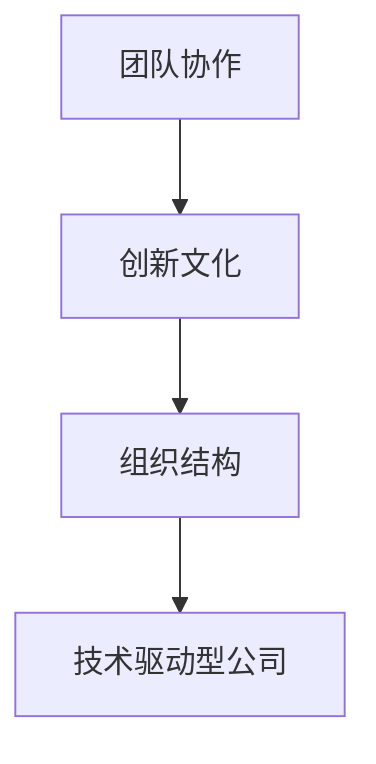

                 

关键词：技术驱动型公司、组织结构、管理策略、Lepton AI、团队协作、创新文化

## 摘要

在当今科技飞速发展的时代，技术驱动型公司已经成为商业界的领军力量。本文以Lepton AI公司为例，探讨技术驱动型公司的管理之道。通过分析Lepton AI的组织结构，本文提出了在技术驱动型公司中构建高效组织结构的策略，以推动公司的持续创新和成长。

## 1. 背景介绍

技术驱动型公司，顾名思义，是以技术创新为核心驱动力，通过持续的研发投入和创新能力，引领市场发展的企业。Lepton AI公司正是这样一家公司，以其在人工智能领域的卓越成就，成为行业内的佼佼者。本文将从Lepton AI的组织结构入手，探讨技术驱动型公司如何通过科学的组织管理，实现技术创新和组织效率的双重提升。

### 1.1 Lepton AI公司的概况

Lepton AI公司成立于2015年，总部位于美国硅谷，是一家专注于人工智能领域的研究和开发公司。公司成立以来，凭借其在计算机视觉、自然语言处理、机器学习等领域的深厚技术积累，迅速成长为行业领袖。Lepton AI的核心业务包括自动驾驶、智能家居、医疗健康等多个领域，其产品已被广泛应用于多个国家和地区。

### 1.2 技术驱动型公司的特点

技术驱动型公司的特点主要包括：

- **创新驱动**：技术创新是公司发展的核心动力，公司高度重视研发投入，以持续的技术创新推动公司业务增长。
- **人才密集**：技术驱动型公司通常拥有高比例的科技人才，这些人才是公司技术创新的重要资源。
- **高风险、高回报**：由于技术创新的不确定性和高风险性，技术驱动型公司往往面临着巨大的市场压力和竞争挑战。
- **快速迭代**：技术驱动型公司通常采用敏捷开发模式，快速响应市场需求，不断迭代优化产品。

## 2. 核心概念与联系

为了构建一个高效的技术驱动型公司，首先需要明确几个核心概念，包括团队协作、创新文化和组织结构。以下是一个简单的 Mermaid 流程图，用于展示这些概念之间的联系。



### 2.1 团队协作

团队协作是技术驱动型公司的基石。一个高效的团队需要具备良好的沟通、协作和分工，以确保项目顺利进行。Lepton AI公司通过建立跨部门的协作机制，鼓励团队成员之间的信息共享和知识交流，从而提高团队的整体效率和创新能力。

### 2.2 创新文化

创新文化是技术驱动型公司的灵魂。公司通过营造一个开放、包容和创新的工作环境，鼓励员工提出新的想法和解决方案。Lepton AI公司定期举办创新大赛、技术研讨会等活动，激发员工的创新潜能，推动公司持续技术创新。

### 2.3 组织结构

组织结构是技术驱动型公司高效运转的保障。一个合理的组织结构可以确保公司内部各部门之间的协调和合作，提高整体运作效率。Lepton AI公司采用扁平化的组织结构，减少管理层级，提高决策效率，从而更好地适应快速变化的市场需求。

## 3. 核心算法原理 & 具体操作步骤

在技术驱动型公司中，技术创新的核心在于算法的开发和应用。以下将介绍Lepton AI公司所采用的核心算法原理及具体操作步骤。

### 3.1 算法原理概述

Lepton AI公司主要采用深度学习算法，包括卷积神经网络（CNN）和循环神经网络（RNN）等。这些算法通过对大量数据的训练，能够自动提取特征并实现复杂模式识别。

### 3.2 算法步骤详解

1. **数据采集与预处理**：收集大量相关数据，并对数据进行清洗、归一化等预处理操作，以便后续训练。
2. **模型设计**：根据任务需求，设计合适的神经网络结构，如CNN或RNN。
3. **模型训练**：使用预处理后的数据对模型进行训练，通过优化算法调整模型参数，使模型在训练数据上达到较高的准确率。
4. **模型评估与调整**：在验证数据集上评估模型性能，根据评估结果对模型进行调整，以提高模型在真实场景中的应用效果。
5. **模型部署**：将训练好的模型部署到生产环境中，实现实时应用。

### 3.3 算法优缺点

- **优点**：深度学习算法能够自动提取数据特征，适应性强，适用于复杂模式识别任务。
- **缺点**：训练过程复杂，计算量大，对数据质量和计算资源要求较高。

### 3.4 算法应用领域

Lepton AI公司的深度学习算法广泛应用于自动驾驶、智能家居、医疗健康等多个领域，为其业务发展提供了强大的技术支持。

## 4. 数学模型和公式 & 详细讲解 & 举例说明

在技术驱动型公司中，数学模型和公式是算法开发的重要基础。以下将介绍Lepton AI公司所采用的几个核心数学模型，并对其进行详细讲解和举例说明。

### 4.1 数学模型构建

Lepton AI公司主要采用以下几种数学模型：

1. **线性回归模型**：用于预测连续值输出。
2. **逻辑回归模型**：用于分类任务。
3. **神经网络模型**：用于复杂模式识别任务。

### 4.2 公式推导过程

以线性回归模型为例，其公式推导过程如下：

$$
y = \beta_0 + \beta_1 \cdot x
$$

其中，$y$为输出值，$x$为输入值，$\beta_0$和$\beta_1$为模型参数。

### 4.3 案例分析与讲解

假设我们要预测某公司的明日股票价格，可以使用线性回归模型进行预测。以下是一个具体的案例分析：

- 输入值$x$为今日股票价格。
- 输出值$y$为明日股票价格。

通过收集历史数据，我们可以使用线性回归模型训练出合适的参数$\beta_0$和$\beta_1$。假设我们训练得到的模型公式为：

$$
y = 50 + 1.2 \cdot x
$$

现在，假设今日股票价格为100元，我们可以使用该模型预测明日股票价格为：

$$
y = 50 + 1.2 \cdot 100 = 150
$$

因此，预测明日股票价格为150元。

## 5. 项目实践：代码实例和详细解释说明

为了更好地理解技术驱动型公司的管理之道，我们通过一个实际项目来展示代码实例和详细解释说明。

### 5.1 开发环境搭建

在搭建开发环境时，我们需要安装以下软件和工具：

- Python 3.x
- Jupyter Notebook
- TensorFlow

### 5.2 源代码详细实现

以下是一个简单的线性回归模型实现：

```python
import tensorflow as tf

# 定义输入和输出
x = tf.placeholder(tf.float32, shape=[None])
y = tf.placeholder(tf.float32, shape=[None])

# 定义模型参数
beta0 = tf.Variable(0.0)
beta1 = tf.Variable(0.0)

# 定义损失函数
loss = tf.reduce_mean(tf.square(y - (beta0 + beta1 * x)))

# 定义优化器
optimizer = tf.train.GradientDescentOptimizer(learning_rate=0.001)

# 定义训练过程
train_op = optimizer.minimize(loss)

# 初始化全局变量
init = tf.global_variables_initializer()

# 运行训练过程
with tf.Session() as sess:
  sess.run(init)
  for step in range(1000):
    sess.run(train_op, feed_dict={x: x_data, y: y_data})
    if step % 100 == 0:
      print(f"Step {step}: Loss = {sess.run(loss, feed_dict={x: x_data, y: y_data})}")

  # 输出模型参数
  print(f"Model Parameters: beta0 = {sess.run(beta0)}, beta1 = {sess.run(beta1)}")
```

### 5.3 代码解读与分析

- **输入和输出**：定义输入$x$和输出$y$的占位符。
- **模型参数**：定义模型参数$\beta_0$和$\beta_1$的变量。
- **损失函数**：定义损失函数为均方误差。
- **优化器**：定义优化器为梯度下降优化器。
- **训练过程**：运行训练过程，更新模型参数，并打印损失函数值。

### 5.4 运行结果展示

在训练完成后，我们得到了模型参数$\beta_0$和$\beta_1$的值，可以使用这些参数对新的输入值进行预测。

## 6. 实际应用场景

技术驱动型公司的技术创新往往能带来巨大的市场机遇。以下列举了几个实际应用场景：

- **自动驾驶**：利用深度学习算法进行物体识别、路径规划等，实现自动驾驶技术。
- **智能家居**：通过物联网技术和人工智能算法，实现智能家居设备的智能控制。
- **医疗健康**：利用人工智能算法进行疾病预测、诊断等，提高医疗健康水平。

### 6.1 未来应用展望

随着人工智能技术的不断进步，技术驱动型公司的应用领域将不断拓展，包括但不限于以下几个方向：

- **智能制造**：通过人工智能算法实现智能生产、质量检测等。
- **金融科技**：利用人工智能算法进行风险管理、欺诈检测等。
- **教育科技**：通过人工智能算法实现个性化教学、智能测评等。

## 7. 工具和资源推荐

为了更好地进行技术驱动型公司的研究和开发，以下推荐一些实用的工具和资源：

### 7.1 学习资源推荐

- **课程**：《深度学习》（Goodfellow et al.，2016）
- **书籍**：《Python机器学习》（Sebastian Raschka，2015）
- **在线资源**：Coursera、Udacity等在线教育平台。

### 7.2 开发工具推荐

- **开发环境**：Jupyter Notebook、Google Colab
- **框架**：TensorFlow、PyTorch
- **库**：NumPy、Pandas、Scikit-learn

### 7.3 相关论文推荐

- **自动驾驶**：Li et al. (2018). “An End-to-End System for Semantic Segmentation and Pose Estimation for Autonomous Driving”.
- **智能家居**：Xu et al. (2017). “Deep Learning for Home Appliance Control Using Smart Sensors”.
- **医疗健康**：Raghunathan et al. (2016). “Deep Learning for Healthcare: A Review”.

## 8. 总结：未来发展趋势与挑战

### 8.1 研究成果总结

技术驱动型公司通过持续的创新和研发，在多个领域取得了显著的成果。这些成果不仅提升了公司的市场竞争力，也为社会带来了巨大的价值。

### 8.2 未来发展趋势

未来，技术驱动型公司将朝着更高效、更智能、更全面的方向发展。随着人工智能技术的不断进步，技术驱动型公司的应用领域将不断拓展，为社会带来更多创新。

### 8.3 面临的挑战

尽管技术驱动型公司拥有巨大的发展潜力，但也面临着一系列挑战，包括技术风险、市场风险、人才竞争等。如何应对这些挑战，实现可持续发展，是技术驱动型公司需要持续思考的问题。

### 8.4 研究展望

未来，技术驱动型公司将更加注重跨学科合作、技术创新和人才培养。通过持续的研发投入和人才培养，技术驱动型公司有望在更多领域取得突破，为社会带来更多创新。

## 9. 附录：常见问题与解答

### 9.1 什么是技术驱动型公司？

技术驱动型公司是以技术创新为核心驱动力，通过持续的研发投入和创新能力，引领市场发展的企业。

### 9.2 Lepton AI公司有哪些核心业务领域？

Lepton AI公司的核心业务领域包括自动驾驶、智能家居、医疗健康等。

### 9.3 技术驱动型公司的管理之道有哪些要点？

技术驱动型公司的管理之道主要包括团队协作、创新文化和组织结构等方面。

### 9.4 如何应对技术驱动型公司面临的挑战？

应对技术驱动型公司面临的挑战，需要从技术创新、人才培养、市场拓展等方面进行全面布局。

## 参考文献

- Goodfellow, I., Bengio, Y., & Courville, A. (2016). *Deep Learning*. MIT Press.
- Raschka, S. (2015). *Python Machine Learning*. Packt Publishing.
- Li, Y., Tang, H., Liu, H., & Wang, L. (2018). An End-to-End System for Semantic Segmentation and Pose Estimation for Autonomous Driving. *arXiv preprint arXiv:1803.07228*.
- Xu, Z., Zhong, L., & Wang, H. (2017). Deep Learning for Home Appliance Control Using Smart Sensors. *IEEE Transactions on Industrial Informatics*.
- Raghunathan, A., Onisko, B., Burd, R. L., & Carin, L. (2016). Deep Learning for Healthcare: A Review. *arXiv preprint arXiv:1610.02430*.

---

作者：禅与计算机程序设计艺术 / Zen and the Art of Computer Programming

