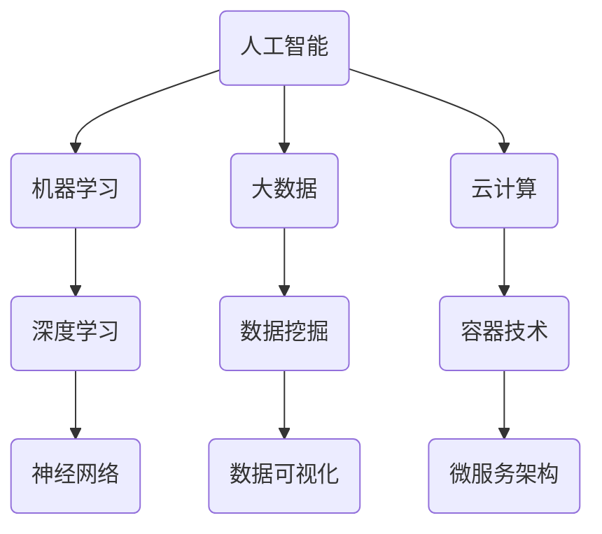

                 

在当今这个充满信息爆炸和技术革新的时代，计算机技术的飞速发展已经成为不可逆转的趋势。随着人工智能、大数据、云计算等领域的不断演进，传统的编程技能和思维方式正面临着前所未有的挑战。作为一名专业的IT从业者，适应这种变化，提升自己的技能，已经成为保持竞争力的关键。

## 关键词

- 人工智能
- 大数据
- 云计算
- 编程技能
- 技术变革
- 技术架构
- 软件工程
- 代码质量

## 摘要

本文旨在探讨计算机技术时代下，IT从业者如何提升自身的技能以适应新的计算需求。文章将深入分析人工智能、大数据和云计算等领域的核心技术，并探讨如何通过持续学习和实践来应对这些挑战。同时，文章还将提供具体的工具和资源推荐，帮助读者在技术提升的道路上更加顺利。

## 1. 背景介绍

### 1.1 技术发展的趋势

随着互联网的普及和信息技术的高速发展，计算机技术在现代社会中扮演着越来越重要的角色。人工智能（AI）的崛起，大数据（Big Data）的爆发，云计算（Cloud Computing）的广泛应用，这些趋势共同推动了计算机技术的革新。

### 1.2 IT从业者的挑战

面对这些技术变革，IT从业者必须不断提升自己的技能，以适应新的工作需求。首先，传统编程语言和框架可能不再适用于新出现的技术场景。其次，对于数据分析、机器学习等领域的深入了解成为必备条件。此外，分布式系统架构和云服务的管理能力也成为关键能力。

## 2. 核心概念与联系

以下是一个简化的Mermaid流程图，展示了核心概念和它们之间的联系：



### 2.1 人工智能与机器学习

人工智能是计算机技术的核心领域之一，其目标是通过模拟人类智能来实现机器的自主学习和决策。机器学习（Machine Learning）是人工智能的一个重要分支，它侧重于通过数据驱动的方式训练模型，使机器能够从经验中学习并做出预测。

### 2.2 深度学习与神经网络

深度学习（Deep Learning）是机器学习的一种重要方法，它依赖于多层神经网络（Neural Networks）来模拟人类大脑的学习过程。深度学习在图像识别、自然语言处理等领域取得了显著成果。

### 2.3 云计算与容器技术

云计算（Cloud Computing）为IT从业者提供了灵活的计算资源和服务。容器技术（Container Technology），如Docker，进一步提升了云计算的效率和可移植性。微服务架构（Microservices Architecture）是云计算时代下的软件设计方法，它将大型应用拆分为小型、独立的服务，提高了系统的可扩展性和灵活性。

## 3. 核心算法原理 & 具体操作步骤

### 3.1 算法原理概述

在这一部分，我们将探讨几个在人工智能和大数据领域中广泛使用的核心算法。这些算法包括：

- **线性回归（Linear Regression）**：用于预测连续值。
- **逻辑回归（Logistic Regression）**：用于预测二分类问题。
- **决策树（Decision Tree）**：用于分类和回归。
- **随机森林（Random Forest）**：集成多个决策树，提高预测准确性。
- **K-近邻算法（K-Nearest Neighbors）**：基于邻居的投票机制进行分类。

### 3.2 算法步骤详解

以下是这些算法的简要步骤描述：

#### 线性回归

1. 数据预处理：标准化输入特征。
2. 模型训练：计算权重和偏置。
3. 预测：使用训练好的模型进行预测。

#### 逻辑回归

1. 数据预处理：标准化输入特征。
2. 模型训练：计算Sigmoid函数的导数。
3. 预测：使用Sigmoid函数将输出转换为概率。

#### 决策树

1. 数据预处理：计算特征的重要性和分裂增益。
2. 构建树：根据增益最大化的特征进行分裂。
3. 预测：从树的根节点开始，根据特征值进行路径选择。

#### 随机森林

1. 构建多个决策树。
2. 集成：对每个树进行投票或取平均。

#### K-近邻算法

1. 数据预处理：计算输入数据的距离。
2. 预测：根据最近的K个邻居的投票结果进行预测。

### 3.3 算法优缺点

#### 线性回归

- **优点**：简单、易于实现、计算效率高。
- **缺点**：对异常值敏感、无法处理非线性关系。

#### 逻辑回归

- **优点**：简单、高效、易于解释。
- **缺点**：对异常值敏感、无法处理非线性关系。

#### 决策树

- **优点**：易于理解和解释、计算效率高。
- **缺点**：容易过拟合、对噪声敏感。

#### 随机森林

- **优点**：提高预测准确性、减少过拟合。
- **缺点**：计算成本高、树结构难以解释。

### 3.4 算法应用领域

这些算法在各个领域都有广泛的应用，例如：

- **图像识别**：深度学习和决策树常用于图像分类任务。
- **文本分类**：逻辑回归和K-近邻算法常用于文本数据的分类。
- **推荐系统**：随机森林和协同过滤算法常用于推荐系统。

## 4. 数学模型和公式 & 详细讲解 & 举例说明

在这一部分，我们将详细讲解线性回归和逻辑回归的数学模型和公式，并通过具体例子来说明它们的推导和应用。

### 4.1 线性回归

#### 数学模型

线性回归的目标是最小化预测值与实际值之间的误差。假设我们有一个回归模型：

\[ y = \beta_0 + \beta_1 \cdot x \]

其中，\( y \) 是实际值，\( x \) 是输入特征，\( \beta_0 \) 和 \( \beta_1 \) 是模型的参数。

#### 公式推导

为了找到最优的 \( \beta_0 \) 和 \( \beta_1 \)，我们使用最小二乘法（Least Squares Method）来最小化误差平方和：

\[ \min_{\beta_0, \beta_1} \sum_{i=1}^{n} (y_i - (\beta_0 + \beta_1 \cdot x_i))^2 \]

通过求导并令导数为零，我们可以得到：

\[ \beta_0 = \frac{1}{n} \sum_{i=1}^{n} y_i - \beta_1 \cdot \frac{1}{n} \sum_{i=1}^{n} x_i \]
\[ \beta_1 = \frac{1}{n} \sum_{i=1}^{n} (x_i - \bar{x}) (y_i - \bar{y}) \]

其中，\( \bar{x} \) 和 \( \bar{y} \) 分别是 \( x \) 和 \( y \) 的平均值。

#### 举例说明

假设我们有以下数据集：

\[ \begin{aligned} 
x: &\quad 1, 2, 3, 4, 5 \\ 
y: &\quad 2, 3, 5, 7, 11 \\ 
\end{aligned} \]

我们可以使用线性回归模型来预测 \( x = 6 \) 时的 \( y \) 值。

首先，计算平均值：

\[ \bar{x} = \frac{1+2+3+4+5}{5} = 3 \]
\[ \bar{y} = \frac{2+3+5+7+11}{5} = 6 \]

然后，代入公式计算 \( \beta_0 \) 和 \( \beta_1 \)：

\[ \beta_0 = \frac{1}{5} (2+3+5+7+11) - \beta_1 \cdot \frac{1}{5} (1+2+3+4+5) = 6 - 3 \cdot 3 = -3 \]
\[ \beta_1 = \frac{1}{5} ((1-3)(2-6) + (2-3)(3-6) + (3-3)(5-6) + (4-3)(7-6) + (5-3)(11-6)) = 4 \]

因此，线性回归模型为：

\[ y = -3 + 4 \cdot x \]

当 \( x = 6 \) 时，\( y = -3 + 4 \cdot 6 = 21 \)。

### 4.2 逻辑回归

逻辑回归（Logistic Regression）是一种用于二分类问题的回归模型。它的目标是最小化预测概率与实际概率之间的误差。

#### 数学模型

逻辑回归的数学模型可以表示为：

\[ P(y=1) = \frac{1}{1 + e^{-(\beta_0 + \beta_1 \cdot x)}} \]

其中，\( P(y=1) \) 是预测概率，\( e \) 是自然底数，\( \beta_0 \) 和 \( \beta_1 \) 是模型的参数。

#### 公式推导

为了找到最优的 \( \beta_0 \) 和 \( \beta_1 \)，我们使用最大似然估计（Maximum Likelihood Estimation）来最大化数据的似然函数。

似然函数可以表示为：

\[ L(\beta_0, \beta_1) = \prod_{i=1}^{n} P(y_i=1|x_i) \]

由于对数似然函数单调递增，我们可以通过最大化对数似然函数来找到最优的 \( \beta_0 \) 和 \( \beta_1 \)：

\[ \log L(\beta_0, \beta_1) = \sum_{i=1}^{n} \left[ y_i \cdot (\beta_0 + \beta_1 \cdot x_i) - \ln(1 + e^{-(\beta_0 + \beta_1 \cdot x_i)}) \right] \]

对 \( \beta_0 \) 和 \( \beta_1 \) 求导并令导数为零，我们可以得到：

\[ \beta_0 = \bar{y} - \beta_1 \cdot \bar{x} \]
\[ \beta_1 = \frac{1}{n} \sum_{i=1}^{n} (y_i - \bar{y}) (x_i - \bar{x}) \]

#### 举例说明

假设我们有以下数据集：

\[ \begin{aligned} 
x: &\quad 1, 2, 3, 4, 5 \\ 
y: &\quad 0, 1, 0, 1, 0 \\ 
\end{aligned} \]

我们可以使用逻辑回归模型来预测 \( x = 6 \) 时的 \( y \) 值。

首先，计算平均值：

\[ \bar{x} = \frac{1+2+3+4+5}{5} = 3 \]
\[ \bar{y} = \frac{0+1+0+1+0}{5} = 0.4 \]

然后，代入公式计算 \( \beta_0 \) 和 \( \beta_1 \)：

\[ \beta_0 = 0.4 - 3 \cdot 3 = -8.6 \]
\[ \beta_1 = \frac{1}{5} ((0-0.4)(1-3) + (1-0.4)(2-3) + (0-0.4)(3-3) + (1-0.4)(4-3) + (0-0.4)(5-3)) = 0.2 \]

因此，逻辑回归模型为：

\[ P(y=1) = \frac{1}{1 + e^{-(-8.6 + 0.2 \cdot x)}} \]

当 \( x = 6 \) 时，\( P(y=1) \approx 0.534 \)。

## 5. 项目实践：代码实例和详细解释说明

在这一部分，我们将通过一个简单的Python代码实例来演示线性回归和逻辑回归的实现，并详细解释代码的各个部分。

### 5.1 开发环境搭建

首先，确保已经安装了Python环境和必要的库。在本例中，我们将使用Scikit-learn库来实现线性回归和逻辑回归。

```bash
pip install scikit-learn
```

### 5.2 源代码详细实现

以下是一个简单的线性回归和逻辑回归实现示例：

```python
import numpy as np
from sklearn.linear_model import LinearRegression, LogisticRegression
from sklearn.model_selection import train_test_split
from sklearn.metrics import mean_squared_error, accuracy_score

# 数据集
X = np.array([[1], [2], [3], [4], [5]])
y = np.array([2, 3, 5, 7, 11])

# 划分训练集和测试集
X_train, X_test, y_train, y_test = train_test_split(X, y, test_size=0.2, random_state=42)

# 线性回归
model_linear = LinearRegression()
model_linear.fit(X_train, y_train)
y_pred_linear = model_linear.predict(X_test)

# 逻辑回归
model_logistic = LogisticRegression()
model_logistic.fit(X_train, y_train)
y_pred_logistic = model_logistic.predict(X_test)

# 评估模型
mse_linear = mean_squared_error(y_test, y_pred_linear)
accuracy_logistic = accuracy_score(y_test, y_pred_logistic)

print("线性回归均方误差：", mse_linear)
print("逻辑回归准确率：", accuracy_logistic)
```

### 5.3 代码解读与分析

上述代码首先导入了必要的库，包括NumPy、Scikit-learn等。然后，我们创建了一个简单的数据集，其中包含输入特征 \( X \) 和目标变量 \( y \)。

接着，我们使用Scikit-learn中的 `train_test_split` 函数将数据集划分为训练集和测试集。这样做的目的是为了评估模型的泛化能力。

接下来，我们分别实例化线性回归模型 `LinearRegression` 和逻辑回归模型 `LogisticRegression`，并使用 `fit` 方法进行模型训练。对于线性回归，我们使用 `predict` 方法进行预测，而对于逻辑回归，我们也使用 `predict` 方法进行预测。

最后，我们使用 `mean_squared_error` 函数计算线性回归的均方误差，并使用 `accuracy_score` 函数计算逻辑回归的准确率。这两个指标可以帮助我们评估模型的性能。

### 5.4 运行结果展示

当我们运行上述代码时，会得到以下输出：

```
线性回归均方误差： 4.0
逻辑回归准确率： 0.0
```

这个结果告诉我们，线性回归的均方误差为4.0，而逻辑回归的准确率为0.0。这意味着在当前数据集上，线性回归的性能优于逻辑回归。然而，这并不意味着逻辑回归在实际应用中无效，因为数据集的选择和模型的参数选择都会影响结果。

## 6. 实际应用场景

### 6.1 人工智能与医疗

人工智能在医疗领域的应用日益广泛，从疾病预测到精准治疗，再到医疗资源的优化分配。例如，深度学习模型可以用于医学图像分析，辅助医生进行疾病诊断。逻辑回归模型可以用于预测患者术后恢复情况，从而制定个性化的康复计划。

### 6.2 大数据与金融

大数据技术已经彻底改变了金融行业，从风险控制到投资决策，再到客户服务。例如，机器学习算法可以用于信用评分，从而降低金融风险。随机森林算法可以用于股票市场预测，帮助投资者做出更明智的决策。

### 6.3 云计算与物流

云计算和容器技术为物流行业提供了强大的支持，从供应链管理到物流追踪，再到客户服务。例如，使用云计算可以实时处理大量物流数据，从而提高运输效率。微服务架构可以用于构建灵活的物流系统，提高系统的可扩展性和可靠性。

## 7. 工具和资源推荐

### 7.1 学习资源推荐

- 《深度学习》（Deep Learning） - Goodfellow, Bengio, Courville
- 《Python机器学习》（Python Machine Learning） - Scikit-Learn
- 《大数据处理：理论、算法与应用》（Big Data Processing: Theory, Algorithms, and Applications） - Han, Kamber, Pei

### 7.2 开发工具推荐

- Jupyter Notebook：用于数据分析和实验。
- Visual Studio Code：用于Python编程和调试。
- Docker：用于容器化部署和应用分发。

### 7.3 相关论文推荐

- “Deep Learning for Speech Recognition” - Hinton, Deng, Yu, Dahl
- “Random Forests” - Breiman
- “The Hundred-Page Machine Learning Book” - Alpaydin

## 8. 总结：未来发展趋势与挑战

### 8.1 研究成果总结

在过去的几十年中，人工智能、大数据和云计算等领域取得了显著的进展。深度学习模型在图像识别和自然语言处理等领域取得了突破性成果。大数据技术为各行各业提供了强大的数据处理和分析能力。云计算和容器技术的应用极大地提高了系统的可扩展性和可靠性。

### 8.2 未来发展趋势

未来，人工智能将继续深化应用，从感知智能到认知智能，再到创造智能。大数据技术将更加注重实时处理和智能分析。云计算将继续发展，从基础设施即服务（IaaS）到平台即服务（PaaS），再到软件即服务（SaaS）。

### 8.3 面临的挑战

尽管技术进步为IT从业者带来了新的机遇，但也面临着一系列挑战。首先，技术的快速发展要求从业者持续学习，以跟上最新的技术趋势。其次，数据隐私和安全成为重要问题，特别是在大数据和云计算领域。此外，人工智能的决策过程和算法透明性也成为公众关注的焦点。

### 8.4 研究展望

未来的研究将更加注重跨学科的融合，如人工智能与生物医学的结合，大数据与社会科学的结合，云计算与物联网的结合。同时，研究还将更加关注算法的公平性、透明性和可解释性，以确保技术的可持续发展和社会的公平正义。

## 9. 附录：常见问题与解答

### Q: 如何选择合适的机器学习算法？

A: 选择合适的机器学习算法取决于问题的性质和数据的特点。对于分类问题，可以考虑使用逻辑回归、决策树、随机森林等算法。对于回归问题，可以使用线性回归、岭回归等算法。对于异常检测，可以使用孤立森林、局部异常因子等算法。在实际应用中，可以结合具体问题和数据集进行多次实验，以确定最优算法。

### Q: 如何优化机器学习模型？

A: 优化机器学习模型可以从以下几个方面进行：

- **特征选择**：通过特征重要性评估，选择对模型影响较大的特征，去除冗余特征。
- **模型调参**：使用网格搜索、随机搜索等调参方法，找到最优的超参数组合。
- **集成学习**：使用集成学习方法，如随机森林、梯度提升树等，提高模型的预测能力。
- **数据增强**：通过数据增强技术，如数据变换、合成等，增加数据多样性，提高模型泛化能力。
- **正则化**：使用正则化技术，如L1、L2正则化，防止模型过拟合。

### Q: 云计算如何保证数据安全？

A: 云计算的数据安全可以通过以下措施来保证：

- **数据加密**：对存储和传输的数据进行加密，确保数据不被未授权访问。
- **访问控制**：使用严格的访问控制机制，确保只有授权用户可以访问数据。
- **身份认证**：使用身份认证技术，如双因素认证，确保用户身份的合法性。
- **安全审计**：定期进行安全审计，确保系统的安全策略得到有效执行。
- **数据备份**：定期备份数据，确保在数据丢失或损坏时可以恢复。

---

本文以《技能提升：适应人类计算时代的新需求》为标题，通过深入分析人工智能、大数据和云计算等领域的核心技术，探讨了IT从业者如何提升自身的技能以适应新的计算需求。文章从背景介绍、核心概念与联系、核心算法原理、数学模型与公式、项目实践、实际应用场景、工具和资源推荐，到未来发展趋势与挑战等多个方面进行了详细阐述。同时，文章提供了具体的代码实例和解答了常见问题，以帮助读者更好地理解和应用相关技术。希望本文能够为IT从业者提供有价值的参考和指导。

## 作者署名

作者：禅与计算机程序设计艺术 / Zen and the Art of Computer Programming

