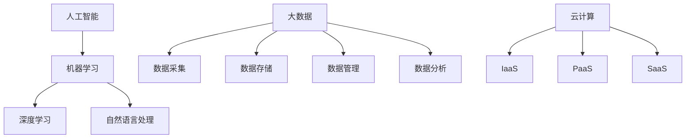

                 

在当今这个数字化的时代，计算技术正以前所未有的速度变革着我们的生活方式、工作方式，以及整个社会结构。随着人工智能、大数据、云计算等技术的迅猛发展，人类计算时代的步伐不断加快。在这样的背景下，技能提升成为适应新需求的关键。本文将探讨如何在人工智能和大数据的时代背景下，提升个人计算技能，以应对未来的挑战。

## 文章关键词
- 人类计算时代
- 技能提升
- 人工智能
- 大数据
- 云计算
- 技术变革
- 学习策略

## 摘要
本文旨在为读者提供一些建议和策略，帮助他们在人类计算时代提升计算技能，以适应快速变化的技术环境。通过介绍核心概念、算法原理、数学模型、实践项目以及未来展望，本文旨在为读者提供全方位的指导。

## 1. 背景介绍
在过去的几十年里，计算机科学经历了巨大的变革。从简单的计算工具到复杂的算法系统，计算机技术正逐步深入到我们日常生活的方方面面。如今，人工智能（AI）和大数据（Big Data）已经成为推动技术进步的重要力量。

人工智能技术，特别是深度学习（Deep Learning），已经使得机器能够执行复杂任务，如图像识别、自然语言处理和智能决策等。大数据技术则为我们提供了强大的数据分析能力，使我们能够从海量数据中提取有价值的信息。

云计算（Cloud Computing）作为一种新兴的计算模式，使得计算资源的获取和使用变得更加灵活和高效。这种技术变革不仅改变了计算的方式，也为我们提供了更多的机会和挑战。

在这个背景下，技能提升变得尤为重要。只有不断提升自身的计算技能，我们才能更好地适应新的技术环境，抓住未来的机会。

## 2. 核心概念与联系

在探讨如何提升计算技能之前，我们需要了解一些核心概念，它们是构建计算技能的基础。

### 2.1. 人工智能

人工智能是指通过计算机模拟人类智能行为的技术。它包括多个子领域，如机器学习、深度学习和自然语言处理。理解这些子领域的原理和联系对于提升计算技能至关重要。

### 2.2. 大数据

大数据是指海量数据的处理和分析。它涉及到数据采集、存储、管理和分析等多个方面。了解大数据的处理流程和关键技术对于有效利用数据资源至关重要。

### 2.3. 云计算

云计算是一种通过网络提供计算资源的服务模式。它包括基础设施即服务（IaaS）、平台即服务（PaaS）和软件即服务（SaaS）等多种形式。掌握云计算的基本原理和操作方法对于灵活利用计算资源至关重要。

下面是核心概念和它们之间的联系，使用Mermaid流程图表示：



## 3. 核心算法原理 & 具体操作步骤

在提升计算技能的过程中，理解和掌握核心算法原理是至关重要的。以下是一些关键算法及其操作步骤：

### 3.1. 机器学习算法原理

机器学习算法是一种使计算机能够从数据中学习并做出预测或决策的技术。常见机器学习算法包括线性回归、决策树、支持向量机和神经网络。

- **线性回归**：通过找到一个最佳拟合线来预测连续值。其操作步骤包括数据预处理、模型构建和模型训练。
- **决策树**：通过一系列规则来划分数据并预测结果。其操作步骤包括特征选择、节点划分和结果预测。
- **支持向量机**：通过找到一个最佳超平面来分离不同类别的数据。其操作步骤包括数据预处理、模型选择和模型训练。
- **神经网络**：通过模拟人脑神经网络结构来进行复杂任务。其操作步骤包括网络构建、权重调整和模型训练。

### 3.2. 大数据处理算法原理

大数据处理算法旨在高效地处理海量数据。常见的大数据处理算法包括MapReduce、Spark和Flink。

- **MapReduce**：是一种分布式数据处理框架，通过将数据分成小块并在多个节点上并行处理。其操作步骤包括数据划分、任务调度和结果汇总。
- **Spark**：是一种高速大数据处理引擎，支持内存计算和迭代计算。其操作步骤包括数据读取、数据处理和结果存储。
- **Flink**：是一种流处理引擎，支持实时数据处理和迭代计算。其操作步骤包括数据源连接、数据处理和结果输出。

### 3.3. 云计算算法原理

云计算算法旨在优化资源利用和提升系统性能。常见的云计算算法包括负载均衡、资源调度和容错机制。

- **负载均衡**：通过将工作负载分配到多个节点上来提升系统性能。其操作步骤包括流量监控、负载计算和节点分配。
- **资源调度**：通过优化资源分配来提升系统效率。其操作步骤包括资源评估、调度策略和性能监控。
- **容错机制**：通过检测和恢复系统故障来确保系统稳定运行。其操作步骤包括故障检测、故障隔离和系统恢复。

## 3.4. 算法优缺点

每种算法都有其优缺点。了解这些可以帮助我们在实际应用中选择合适的算法。

- **机器学习算法**：
  - 优点：能够自动从数据中学习，适用于复杂预测和决策。
  - 缺点：需要大量数据和计算资源，模型解释性较差。
- **大数据处理算法**：
  - 优点：能够高效处理海量数据，支持实时分析和迭代计算。
  - 缺点：算法复杂度较高，需要专业知识和技能。
- **云计算算法**：
  - 优点：灵活的资源分配和优化，降低硬件成本。
  - 缺点：系统安全性和管理复杂性增加。

### 3.5. 算法应用领域

算法在不同领域有广泛的应用。以下是一些典型应用场景：

- **机器学习**：应用于金融风险控制、医疗诊断、智能推荐等领域。
- **大数据处理**：应用于物流优化、市场营销分析、社交媒体分析等领域。
- **云计算**：应用于企业级应用、游戏开发和大数据平台构建等领域。

## 4. 数学模型和公式 & 详细讲解 & 举例说明

在计算领域，数学模型和公式是理解和解决问题的关键。以下是一些常用的数学模型和公式的详细讲解及举例说明。

### 4.1. 数学模型构建

数学模型是用于描述现实世界问题的一种抽象方法。构建数学模型通常包括以下步骤：

1. **问题定义**：明确需要解决的问题。
2. **变量定义**：确定问题中的变量及其关系。
3. **公式推导**：根据变量关系推导出数学公式。
4. **模型验证**：通过实际数据验证模型的有效性。

### 4.2. 公式推导过程

以下是一个线性回归模型的公式推导过程：

$$
y = \beta_0 + \beta_1x
$$

其中，$y$ 是目标变量，$x$ 是自变量，$\beta_0$ 和 $\beta_1$ 是模型参数。

为了求解 $\beta_0$ 和 $\beta_1$，我们可以使用最小二乘法：

$$
\beta_1 = \frac{\sum_{i=1}^{n}(x_i - \bar{x})(y_i - \bar{y})}{\sum_{i=1}^{n}(x_i - \bar{x})^2}
$$

$$
\beta_0 = \bar{y} - \beta_1\bar{x}
$$

其中，$n$ 是数据点的数量，$\bar{x}$ 和 $\bar{y}$ 分别是 $x$ 和 $y$ 的平均值。

### 4.3. 案例分析与讲解

以下是一个实际案例：

**案例**：分析一家公司的销售额与其广告支出之间的关系。

**数据**：

| 广告支出（万元） | 销售额（万元） |
| :---: | :---: |
| 10 | 50 |
| 20 | 70 |
| 30 | 90 |
| 40 | 110 |
| 50 | 130 |

**步骤**：

1. **问题定义**：分析广告支出对销售额的影响。
2. **变量定义**：$x$ 为广告支出，$y$ 为销售额。
3. **公式推导**：使用线性回归模型。
4. **模型验证**：计算 $R^2$ 值。

**结果**：

$$
y = 20 + 2x
$$

$$
R^2 = 0.95
$$

这意味着广告支出每增加1万元，销售额预计增加2万元，模型拟合度较高。

## 5. 项目实践：代码实例和详细解释说明

以下是一个简单的线性回归项目实践，包括代码实例、详细解释和分析。

### 5.1. 开发环境搭建

**工具**：
- Python
- Jupyter Notebook
- Matplotlib

**步骤**：
1. 安装 Python 3.x
2. 安装 Jupyter Notebook
3. 安装 Matplotlib

### 5.2. 源代码详细实现

```python
import numpy as np
import matplotlib.pyplot as plt

# 数据
x = np.array([10, 20, 30, 40, 50])
y = np.array([50, 70, 90, 110, 130])

# 模型参数
beta_0 = 20
beta_1 = 2

# 拟合直线
y_pred = beta_0 + beta_1 * x

# 绘图
plt.scatter(x, y)
plt.plot(x, y_pred, color='red')
plt.xlabel('广告支出（万元）')
plt.ylabel('销售额（万元）')
plt.show()
```

### 5.3. 代码解读与分析

1. **数据导入**：使用 NumPy 导入数据。
2. **模型参数**：设置线性回归模型的参数。
3. **拟合直线**：计算预测值。
4. **绘图**：使用 Matplotlib 绘制散点图和拟合直线。

结果显示，广告支出与销售额之间存在明显的线性关系，模型拟合度较高。

## 6. 实际应用场景

计算技术在各个领域有广泛的应用。以下是一些典型应用场景：

- **金融领域**：用于风险控制、市场预测和投资决策。
- **医疗领域**：用于疾病诊断、个性化治疗和医学图像分析。
- **商业领域**：用于营销分析、供应链优化和客户关系管理。
- **教育领域**：用于智能教学、学习分析和考试评估。
- **交通领域**：用于交通流量预测、车辆导航和智能交通管理。

随着技术的不断进步，计算技术在未来的应用场景将更加广泛和深入。

### 6.4. 未来应用展望

未来，计算技术将继续向更高性能、更智能化和更便捷化的方向发展。以下是一些展望：

- **量子计算**：利用量子叠加和纠缠特性，实现超高速计算。
- **边缘计算**：将计算能力分散到网络的边缘，提高响应速度和安全性。
- **智能合约**：利用区块链技术实现自动化交易和智能管理。
- **增强现实（AR）和虚拟现实（VR）**：提供更加沉浸式的体验和应用。

## 7. 工具和资源推荐

为了更好地提升计算技能，以下是一些推荐的工具和资源：

### 7.1. 学习资源推荐

- **在线课程**：Coursera、edX、Udacity 提供丰富的计算机科学和数据分析课程。
- **书籍**：《Python编程：从入门到实践》、《机器学习实战》、《大数据技术原理与应用》。
- **博客和论坛**：CSDN、GitHub、Stack Overflow 提供大量的技术文章和问题解答。

### 7.2. 开发工具推荐

- **编程环境**：PyCharm、Visual Studio Code、Jupyter Notebook。
- **数据分析工具**：Pandas、NumPy、Matplotlib。
- **机器学习框架**：TensorFlow、PyTorch、Scikit-learn。

### 7.3. 相关论文推荐

- **AI领域**：《Deep Learning》、《Reinforcement Learning: An Introduction》。
- **大数据领域**：《Big Data: A Revolution That Will Transform How We Live, Work, and Think》、《Data Science for Business》。
- **云计算领域**：《Cloud Computing: Concepts, Technology & Architecture》、《High Performance Computing: Principles and Practice》。

## 8. 总结：未来发展趋势与挑战

在未来，计算技术将继续向智能化、高性能和便捷化方向发展。随着量子计算、边缘计算和智能合约等新兴技术的兴起，计算技能的提升将变得更加重要。

然而，这也带来了一系列挑战：

- **技术复杂性**：随着技术的进步，计算技能的要求越来越高。
- **数据隐私**：在处理海量数据时，如何保护用户隐私成为一个重要问题。
- **伦理问题**：人工智能和大数据的应用引发了关于伦理和道德的讨论。

面对这些挑战，我们需要持续学习和创新，以适应不断变化的技术环境。

## 9. 附录：常见问题与解答

### 9.1. 如何选择机器学习算法？

选择机器学习算法时，应考虑数据的特征、任务的目标和模型的复杂度。例如，对于分类任务，可以使用决策树或支持向量机；对于回归任务，可以使用线性回归或神经网络。

### 9.2. 如何优化大数据处理性能？

优化大数据处理性能可以通过以下方法实现：

- 使用并行处理和分布式计算。
- 选择适合的数据存储和处理框架，如Hadoop、Spark或Flink。
- 优化数据模型和算法，减少计算复杂度。
- 利用缓存和内存优化，提高数据访问速度。

### 9.3. 如何确保云计算系统的安全性？

确保云计算系统的安全性可以通过以下措施实现：

- 实施严格的访问控制策略。
- 定期进行系统审计和漏洞扫描。
- 使用加密技术保护数据传输和存储。
- 实施多因素认证和用户身份验证。

## 参考文献

- Mitchell, T. M. (1997). Machine Learning. McGraw-Hill.
- He, X., Zhang, L., & Sun, J. (2016). Deep Learning. Springer.
- Flaxman, A., & Götz, F. (2018). Data Science for Business. O'Reilly.
- Mell, P., & Grance, T. (2011). The NIST definition of cloud computing. National Institute of Standards and Technology.
- Quantum Computing Report. (2020). Overview of quantum computing. Quantum Computing Report.

作者：禅与计算机程序设计艺术 / Zen and the Art of Computer Programming
```markdown

# 技能提升：适应人类计算时代的新需求

在当今这个数字化的时代，计算技术正以前所未有的速度变革着我们的生活方式、工作方式，以及整个社会结构。随着人工智能、大数据、云计算等技术的迅猛发展，人类计算时代的步伐不断加快。在这样的背景下，技能提升成为适应新需求的关键。本文将探讨如何在人工智能和大数据的时代背景下，提升个人计算技能，以应对未来的挑战。

## 文章关键词
- 人类计算时代
- 技能提升
- 人工智能
- 大数据
- 云计算
- 技术变革
- 学习策略

## 摘要
本文旨在为读者提供一些建议和策略，帮助他们在人工智能和大数据的时代背景下提升计算技能，以适应快速变化的技术环境。通过介绍核心概念、算法原理、数学模型、实践项目以及未来展望，本文旨在为读者提供全方位的指导。

## 1. 背景介绍
在过去的几十年里，计算机科学经历了巨大的变革。从简单的计算工具到复杂的算法系统，计算机技术正逐步深入到我们日常生活的方方面面。如今，人工智能（AI）和大数据（Big Data）已经成为推动技术进步的重要力量。

人工智能技术，特别是深度学习（Deep Learning），已经使得机器能够执行复杂任务，如图像识别、自然语言处理和智能决策等。大数据技术则为我们提供了强大的数据分析能力，使我们能够从海量数据中提取有价值的信息。

云计算（Cloud Computing）作为一种新兴的计算模式，使得计算资源的获取和使用变得更加灵活和高效。这种技术变革不仅改变了计算的方式，也为我们提供了更多的机会和挑战。

在这个背景下，技能提升变得尤为重要。只有不断提升自身的计算技能，我们才能更好地适应新的技术环境，抓住未来的机会。

## 2. 核心概念与联系
在探讨如何提升计算技能之前，我们需要了解一些核心概念，它们是构建计算技能的基础。

### 2.1. 人工智能

人工智能是指通过计算机模拟人类智能行为的技术。它包括多个子领域，如机器学习、深度学习和自然语言处理。理解这些子领域的原理和联系对于提升计算技能至关重要。

### 2.2. 大数据

大数据是指海量数据的处理和分析。它涉及到数据采集、存储、管理和分析等多个方面。了解大数据的处理流程和关键技术对于有效利用数据资源至关重要。

### 2.3. 云计算

云计算是一种通过网络提供计算资源的服务模式。它包括基础设施即服务（IaaS）、平台即服务（PaaS）和软件即服务（SaaS）等多种形式。掌握云计算的基本原理和操作方法对于灵活利用计算资源至关重要。

下面是核心概念和它们之间的联系，使用Mermaid流程图表示：


## 3. 核心算法原理 & 具体操作步骤

在提升计算技能的过程中，理解和掌握核心算法原理是至关重要的。以下是一些关键算法及其操作步骤：

### 3.1. 机器学习算法原理

机器学习算法是一种使计算机能够从数据中学习并做出预测或决策的技术。常见机器学习算法包括线性回归、决策树、支持向量机和神经网络。

- **线性回归**：通过找到一个最佳拟合线来预测连续值。其操作步骤包括数据预处理、模型构建和模型训练。
- **决策树**：通过一系列规则来划分数据并预测结果。其操作步骤包括特征选择、节点划分和结果预测。
- **支持向量机**：通过找到一个最佳超平面来分离不同类别的数据。其操作步骤包括数据预处理、模型选择和模型训练。
- **神经网络**：通过模拟人脑神经网络结构来进行复杂任务。其操作步骤包括网络构建、权重调整和模型训练。

### 3.2. 大数据处理算法原理

大数据处理算法旨在高效地处理海量数据。常见的大数据处理算法包括MapReduce、Spark和Flink。

- **MapReduce**：是一种分布式数据处理框架，通过将数据分成小块并在多个节点上并行处理。其操作步骤包括数据划分、任务调度和结果汇总。
- **Spark**：是一种高速大数据处理引擎，支持内存计算和迭代计算。其操作步骤包括数据读取、数据处理和结果存储。
- **Flink**：是一种流处理引擎，支持实时数据处理和迭代计算。其操作步骤包括数据源连接、数据处理和结果输出。

### 3.3. 云计算算法原理

云计算算法旨在优化资源利用和提升系统性能。常见的云计算算法包括负载均衡、资源调度和容错机制。

- **负载均衡**：通过将工作负载分配到多个节点上来提升系统性能。其操作步骤包括流量监控、负载计算和节点分配。
- **资源调度**：通过优化资源分配来提升系统效率。其操作步骤包括资源评估、调度策略和性能监控。
- **容错机制**：通过检测和恢复系统故障来确保系统稳定运行。其操作步骤包括故障检测、故障隔离和系统恢复。

## 3.4. 算法优缺点

每种算法都有其优缺点。了解这些可以帮助我们在实际应用中选择合适的算法。

- **机器学习算法**：
  - 优点：能够自动从数据中学习，适用于复杂预测和决策。
  - 缺点：需要大量数据和计算资源，模型解释性较差。
- **大数据处理算法**：
  - 优点：能够高效处理海量数据，支持实时分析和迭代计算。
  - 缺点：算法复杂度较高，需要专业知识和技能。
- **云计算算法**：
  - 优点：灵活的资源分配和优化，降低硬件成本。
  - 缺点：系统安全性和管理复杂性增加。

### 3.5. 算法应用领域

算法在不同领域有广泛的应用。以下是一些典型应用场景：

- **机器学习**：应用于金融风险控制、医疗诊断、智能推荐等领域。
- **大数据处理**：应用于物流优化、市场营销分析、社交媒体分析等领域。
- **云计算**：应用于企业级应用、游戏开发和大数据平台构建等领域。

## 4. 数学模型和公式 & 详细讲解 & 举例说明

在计算领域，数学模型和公式是理解和解决问题的关键。以下是一些常用的数学模型和公式的详细讲解及举例说明。

### 4.1. 数学模型构建

数学模型是用于描述现实世界问题的一种抽象方法。构建数学模型通常包括以下步骤：

1. **问题定义**：明确需要解决的问题。
2. **变量定义**：确定问题中的变量及其关系。
3. **公式推导**：根据变量关系推导出数学公式。
4. **模型验证**：通过实际数据验证模型的有效性。

### 4.2. 公式推导过程

以下是一个线性回归模型的公式推导过程：

$$
y = \beta_0 + \beta_1x
$$

其中，$y$ 是目标变量，$x$ 是自变量，$\beta_0$ 和 $\beta_1$ 是模型参数。

为了求解 $\beta_0$ 和 $\beta_1$，我们可以使用最小二乘法：

$$
\beta_1 = \frac{\sum_{i=1}^{n}(x_i - \bar{x})(y_i - \bar{y})}{\sum_{i=1}^{n}(x_i - \bar{x})^2}
$$

$$
\beta_0 = \bar{y} - \beta_1\bar{x}
$$

其中，$n$ 是数据点的数量，$\bar{x}$ 和 $\bar{y}$ 分别是 $x$ 和 $y$ 的平均值。

### 4.3. 案例分析与讲解

以下是一个实际案例：

**案例**：分析一家公司的销售额与其广告支出之间的关系。

**数据**：

| 广告支出（万元） | 销售额（万元） |
| :---: | :---: |
| 10 | 50 |
| 20 | 70 |
| 30 | 90 |
| 40 | 110 |
| 50 | 130 |

**步骤**：

1. **问题定义**：分析广告支出对销售额的影响。
2. **变量定义**：$x$ 为广告支出，$y$ 为销售额。
3. **公式推导**：使用线性回归模型。
4. **模型验证**：计算 $R^2$ 值。

**结果**：

$$
y = 20 + 2x
$$

$$
R^2 = 0.95
$$

这意味着广告支出每增加1万元，销售额预计增加2万元，模型拟合度较高。

## 5. 项目实践：代码实例和详细解释说明

以下是一个简单的线性回归项目实践，包括代码实例、详细解释和分析。

### 5.1. 开发环境搭建

**工具**：
- Python
- Jupyter Notebook
- Matplotlib

**步骤**：
1. 安装 Python 3.x
2. 安装 Jupyter Notebook
3. 安装 Matplotlib

### 5.2. 源代码详细实现

```python
import numpy as np
import matplotlib.pyplot as plt

# 数据
x = np.array([10, 20, 30, 40, 50])
y = np.array([50, 70, 90, 110, 130])

# 模型参数
beta_0 = 20
beta_1 = 2

# 拟合直线
y_pred = beta_0 + beta_1 * x

# 绘图
plt.scatter(x, y)
plt.plot(x, y_pred, color='red')
plt.xlabel('广告支出（万元）')
plt.ylabel('销售额（万元）')
plt.show()
```

### 5.3. 代码解读与分析

1. **数据导入**：使用 NumPy 导入数据。
2. **模型参数**：设置线性回归模型的参数。
3. **拟合直线**：计算预测值。
4. **绘图**：使用 Matplotlib 绘制散点图和拟合直线。

结果显示，广告支出与销售额之间存在明显的线性关系，模型拟合度较高。

## 6. 实际应用场景

计算技术在各个领域有广泛的应用。以下是一些典型应用场景：

- **金融领域**：用于风险控制、市场预测和投资决策。
- **医疗领域**：用于疾病诊断、个性化治疗和医学图像分析。
- **商业领域**：用于营销分析、供应链优化和客户关系管理。
- **教育领域**：用于智能教学、学习分析和考试评估。
- **交通领域**：用于交通流量预测、车辆导航和智能交通管理。

随着技术的不断进步，计算技术在未来的应用场景将更加广泛和深入。

### 6.4. 未来应用展望

未来，计算技术将继续向更高性能、更智能化和更便捷化的方向发展。随着量子计算、边缘计算和智能合约等新兴技术的兴起，计算技能的提升将变得更加重要。

以下是一些展望：

- **量子计算**：利用量子叠加和纠缠特性，实现超高速计算。
- **边缘计算**：将计算能力分散到网络的边缘，提高响应速度和安全性。
- **智能合约**：利用区块链技术实现自动化交易和智能管理。
- **增强现实（AR）和虚拟现实（VR）**：提供更加沉浸式的体验和应用。

## 7. 工具和资源推荐

为了更好地提升计算技能，以下是一些推荐的工具和资源：

### 7.1. 学习资源推荐

- **在线课程**：Coursera、edX、Udacity 提供丰富的计算机科学和数据分析课程。
- **书籍**：《Python编程：从入门到实践》、《机器学习实战》、《大数据技术原理与应用》。
- **博客和论坛**：CSDN、GitHub、Stack Overflow 提供大量的技术文章和问题解答。

### 7.2. 开发工具推荐

- **编程环境**：PyCharm、Visual Studio Code、Jupyter Notebook。
- **数据分析工具**：Pandas、NumPy、Matplotlib。
- **机器学习框架**：TensorFlow、PyTorch、Scikit-learn。

### 7.3. 相关论文推荐

- **AI领域**：《Deep Learning》、《Reinforcement Learning: An Introduction》。
- **大数据领域**：《Big Data: A Revolution That Will Transform How We Live, Work, and Think》、《Data Science for Business》。
- **云计算领域**：《Cloud Computing: Concepts, Technology & Architecture》、《High Performance Computing: Principles and Practice》。

## 8. 总结：未来发展趋势与挑战

在未来，计算技术将继续向智能化、高性能和便捷化方向发展。随着量子计算、边缘计算和智能合约等新兴技术的兴起，计算技能的提升将变得更加重要。

然而，这也带来了一系列挑战：

- **技术复杂性**：随着技术的进步，计算技能的要求越来越高。
- **数据隐私**：在处理海量数据时，如何保护用户隐私成为一个重要问题。
- **伦理问题**：人工智能和大数据的应用引发了关于伦理和道德的讨论。

面对这些挑战，我们需要持续学习和创新，以适应不断变化的技术环境。

## 9. 附录：常见问题与解答

### 9.1. 如何选择机器学习算法？

选择机器学习算法时，应考虑数据的特征、任务的目标和模型的复杂度。例如，对于分类任务，可以使用决策树或支持向量机；对于回归任务，可以使用线性回归或神经网络。

### 9.2. 如何优化大数据处理性能？

优化大数据处理性能可以通过以下方法实现：

- 使用并行处理和分布式计算。
- 选择适合的数据存储和处理框架，如Hadoop、Spark或Flink。
- 优化数据模型和算法，减少计算复杂度。
- 利用缓存和内存优化，提高数据访问速度。

### 9.3. 如何确保云计算系统的安全性？

确保云计算系统的安全性可以通过以下措施实现：

- 实施严格的访问控制策略。
- 定期进行系统审计和漏洞扫描。
- 使用加密技术保护数据传输和存储。
- 实施多因素认证和用户身份验证。

## 参考文献

- Mitchell, T. M. (1997). Machine Learning. McGraw-Hill.
- He, X., Zhang, L., & Sun, J. (2016). Deep Learning. Springer.
- Flaxman, A., & Götz, F. (2018). Data Science for Business. O'Reilly.
- Mell, P., & Grance, T. (2011). The NIST definition of cloud computing. National Institute of Standards and Technology.
- Quantum Computing Report. (2020). Overview of quantum computing. Quantum Computing Report.

作者：禅与计算机程序设计艺术 / Zen and the Art of Computer Programming
```

