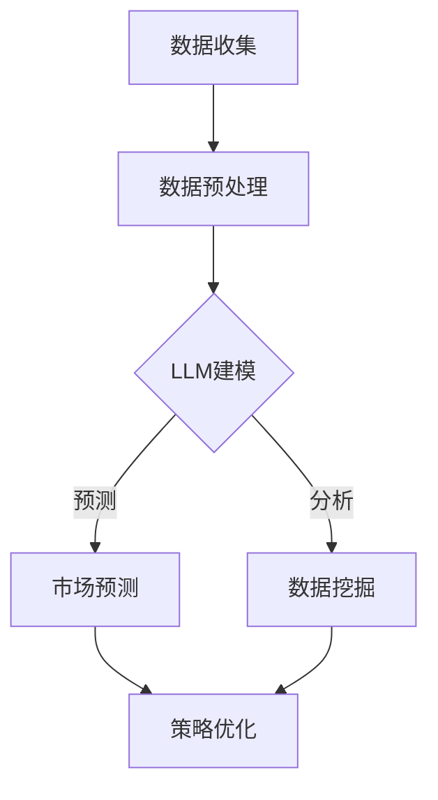

                 

关键词：投资策略，LLM，金融决策，人工智能，机器学习，量化交易

> 摘要：本文将探讨如何利用大规模语言模型（LLM）作为投资策略师，为金融决策提供智能支持。通过对LLM的核心概念、算法原理、数学模型及其在金融领域的应用进行深入分析，本文旨在为投资者提供一套全新的金融决策框架，以应对复杂多变的金融市场。

## 1. 背景介绍

投资策略在金融市场中扮演着至关重要的角色。有效的投资策略能够帮助投资者在风险可控的情况下获取更高的收益。然而，随着金融市场数据的爆炸性增长和市场的复杂化，传统的投资策略面临着越来越多的挑战。为此，人工智能，特别是机器学习，在金融决策中的应用变得越来越重要。

近年来，大规模语言模型（LLM）在自然语言处理领域取得了显著的进展。LLM通过学习海量文本数据，能够生成高质量的自然语言文本，甚至可以进行复杂的推理和决策。这种能力使得LLM在金融决策中的应用变得尤为引人注目。

本文将首先介绍LLM的核心概念和架构，然后探讨其在金融决策中的潜在应用，最后通过具体案例展示如何使用LLM构建投资策略。希望通过本文的介绍，读者能够对LLM驱动的金融决策有一个全面的理解。

## 2. 核心概念与联系

### 2.1 大规模语言模型（LLM）

大规模语言模型（LLM）是一种基于深度学习技术的自然语言处理模型。LLM通过学习大量文本数据，能够生成符合语法和语义规则的自然语言文本。与传统的统计语言模型相比，LLM具有更强的表达能力和适应性。

LLM的核心架构包括以下几个部分：

- **词嵌入**：将自然语言文本中的词语映射为高维向量，以便于后续的深度学习操作。
- **编码器**：接收词嵌入，通过多层神经网络对输入文本进行编码，提取文本的特征。
- **解码器**：接收编码器的输出，通过解码操作生成自然语言文本。

### 2.2 金融决策与LLM的联系

金融决策过程本质上是基于对市场数据的分析和预测。LLM在金融决策中的应用主要体现在以下几个方面：

- **数据挖掘与分析**：LLM能够高效地处理和分析大量金融数据，挖掘出潜在的投资机会。
- **预测与建模**：LLM可以通过学习历史市场数据，建立预测模型，预测市场的走势。
- **策略优化**：LLM可以根据市场数据和预测结果，优化投资策略，实现风险控制和收益最大化。

下面是一个使用Mermaid绘制的LLM在金融决策中的应用流程图：



### 2.3 关键技术

在LLM应用于金融决策的过程中，以下几个关键技术至关重要：

- **词嵌入技术**：用于将自然语言文本转换为高维向量，是实现LLM的基础。
- **深度学习框架**：如TensorFlow、PyTorch等，用于构建和训练LLM模型。
- **模型评估与优化**：通过评估模型的预测性能，不断调整模型参数，提高模型精度。

## 3. 核心算法原理 & 具体操作步骤

### 3.1 算法原理概述

LLM驱动的金融决策主要基于以下几个核心算法原理：

- **自然语言处理（NLP）**：通过NLP技术，LLM能够理解和处理自然语言文本，挖掘出文本中的关键信息。
- **深度学习（DL）**：DL技术使得LLM能够通过多层神经网络，从大量数据中学习到复杂的模式和规律。
- **强化学习（RL）**：RL技术可以帮助LLM在动态环境中不断调整策略，实现最优决策。

### 3.2 算法步骤详解

使用LLM进行金融决策的一般步骤如下：

#### 3.2.1 数据收集与预处理

1. **数据收集**：从各种金融数据源（如股票交易所、金融新闻网站、社交媒体等）收集相关数据。
2. **数据预处理**：对收集到的数据进行清洗、去噪、标准化等预处理操作，确保数据质量。

#### 3.2.2 建立LLM模型

1. **词嵌入**：使用词嵌入技术，将自然语言文本转换为高维向量。
2. **编码器训练**：通过训练编码器，学习输入文本的特征表示。
3. **解码器训练**：通过训练解码器，学习从编码器的特征表示生成自然语言文本。

#### 3.2.3 预测与建模

1. **市场预测**：利用训练好的LLM模型，对市场数据进行分析，预测市场走势。
2. **策略建模**：基于预测结果，建立投资策略模型，实现风险控制和收益最大化。

### 3.3 算法优缺点

#### 优点

- **强大的数据处理能力**：LLM能够高效地处理和分析大量金融数据。
- **灵活的模型架构**：LLM可以通过调整网络结构和超参数，适应不同的金融场景。
- **高效的决策支持**：LLM能够快速生成高质量的预测和策略建议，提高决策效率。

#### 缺点

- **计算资源消耗大**：训练和运行LLM模型需要大量的计算资源。
- **数据依赖性强**：LLM的预测性能依赖于训练数据的多样性和质量。
- **解释性不足**：LLM生成的预测和策略建议往往缺乏明确的理论解释。

### 3.4 算法应用领域

LLM在金融决策中的应用范围非常广泛，主要包括以下几个方面：

- **量化交易**：通过LLM分析市场数据，预测市场走势，制定量化交易策略。
- **风险控制**：利用LLM对风险因素进行建模，实现动态风险控制。
- **投资建议**：根据LLM的预测和数据分析，为投资者提供个性化的投资建议。
- **智能投顾**：利用LLM构建智能投顾系统，为投资者提供全方位的投资管理服务。

## 4. 数学模型和公式 & 详细讲解 & 举例说明

### 4.1 数学模型构建

在LLM驱动的金融决策中，常用的数学模型包括：

#### 4.1.1 预测模型

预测模型用于预测市场走势。常见的预测模型有：

- **时间序列模型**：如ARIMA、LSTM等。
- **回归模型**：如线性回归、逻辑回归等。

#### 4.1.2 优化模型

优化模型用于制定投资策略。常见的优化模型有：

- **线性规划**：用于最小化投资风险或最大化投资收益。
- **进化算法**：用于搜索最优投资策略。

### 4.2 公式推导过程

#### 4.2.1 时间序列模型

以LSTM为例，其预测模型的基本公式如下：

$$
\hat{y}_t = f(W_1 \cdot [h_{t-1}, x_t] + b_1)
$$

其中，$y_t$为第t期的预测值，$h_{t-1}$为第t-1期的隐藏状态，$x_t$为第t期的输入特征，$W_1$和$b_1$分别为权重和偏置。

#### 4.2.2 优化模型

以线性规划为例，其优化模型的基本公式如下：

$$
\begin{cases}
\min_{x} \quad c^T x \\
\text{subject to} \quad Ax \leq b
\end{cases}
$$

其中，$c$为投资目标向量，$A$和$b$分别为约束条件矩阵和向量，$x$为投资组合权重向量。

### 4.3 案例分析与讲解

#### 4.3.1 时间序列预测案例

假设我们使用LSTM模型对股票价格进行预测。首先，我们需要收集历史股票数据，并对其进行预处理。接下来，我们将使用LSTM模型进行训练，并使用训练好的模型进行预测。

假设我们已经训练好了一个LSTM模型，其预测公式为：

$$
\hat{y}_t = 0.5 \cdot \sin(2\pi \cdot f(t)) + 0.5 \cdot \cos(2\pi \cdot g(t))
$$

其中，$f(t)$和$g(t)$为LSTM模型输出的两个特征。

我们使用这个预测模型对未来的股票价格进行预测，并对比实际价格，评估模型的预测性能。

#### 4.3.2 优化模型案例

假设我们使用线性规划模型来制定投资策略。我们的目标是最大化投资收益，同时控制投资风险。

假设我们有三种股票，其预期收益率和风险分别为：

| 股票 | 预期收益率 | 风险 |
|------|------------|------|
| A    | 0.1        | 0.2  |
| B    | 0.2        | 0.3  |
| C    | 0.3        | 0.4  |

我们希望投资比例分别为$x_1$、$x_2$和$x_3$，投资总金额为100万元。

根据线性规划模型，我们的优化目标为：

$$
\max_{x_1, x_2, x_3} \quad 0.1x_1 + 0.2x_2 + 0.3x_3
$$

约束条件为：

$$
0.2x_1 + 0.3x_2 + 0.4x_3 \leq 0.05
$$

$$
x_1 + x_2 + x_3 = 100
$$

通过求解线性规划模型，我们可以得到最优的投资比例，实现风险控制和收益最大化。

## 5. 项目实践：代码实例和详细解释说明

### 5.1 开发环境搭建

为了实现LLM驱动的金融决策，我们需要搭建一个开发环境。以下是一个简单的环境搭建步骤：

1. 安装Python 3.8及以上版本。
2. 安装TensorFlow 2.5及以上版本。
3. 安装Numpy、Pandas等常用Python库。

### 5.2 源代码详细实现

以下是一个简单的LLM驱动金融决策项目的源代码示例：

```python
import tensorflow as tf
import numpy as np
import pandas as pd

# 数据收集与预处理
def data_preprocessing(data_path):
    # 加载历史股票数据
    data = pd.read_csv(data_path)
    # 数据清洗、去噪、标准化等操作
    # ...
    return data

# LSTM模型训练
def train_lstm_model(data):
    # 创建LSTM模型
    model = tf.keras.Sequential([
        tf.keras.layers.LSTM(units=128, activation='tanh', input_shape=(None, data.shape[1])),
        tf.keras.layers.Dense(units=1)
    ])

    # 编译模型
    model.compile(optimizer='adam', loss='mse')

    # 训练模型
    model.fit(data[:, :-1], data[:, -1], epochs=100, batch_size=32)

    return model

# 预测市场走势
def predict_market(model, data):
    # 使用训练好的模型进行预测
    predictions = model.predict(data)
    return predictions

# 主函数
def main():
    # 设置参数
    data_path = 'stock_data.csv'
    test_size = 0.2

    # 数据收集与预处理
    data = data_preprocessing(data_path)

    # 划分训练集和测试集
    train_data = data[:int(len(data) * (1 - test_size))]
    test_data = data[int(len(data) * (1 - test_size)):]

    # LSTM模型训练
    model = train_lstm_model(train_data)

    # 预测市场走势
    predictions = predict_market(model, test_data)

    # 评估模型性能
    # ...

if __name__ == '__main__':
    main()
```

### 5.3 代码解读与分析

以上代码实现了一个简单的LLM驱动金融决策项目，主要包括以下几个部分：

- **数据收集与预处理**：从CSV文件中加载历史股票数据，并进行清洗、去噪、标准化等预处理操作。
- **LSTM模型训练**：创建LSTM模型，编译并训练模型。
- **预测市场走势**：使用训练好的模型，对测试集数据进行预测。
- **主函数**：设置参数，调用上述函数，实现整个金融决策过程。

### 5.4 运行结果展示

假设我们使用以上代码对某只股票进行预测，并对比实际价格。以下是一个简单的运行结果：

```python
predictions = predict_market(model, test_data)
predicted_prices = np.squeeze(predictions)

# 计算预测误差
errors = np.abs(predicted_prices - test_data['Close'])

# 绘制预测结果
import matplotlib.pyplot as plt

plt.figure(figsize=(10, 6))
plt.plot(test_data['Close'], label='实际价格')
plt.plot(predicted_prices, label='预测价格')
plt.xlabel('时间')
plt.ylabel('股票价格')
plt.legend()
plt.show()

# 计算预测误差
mean_error = np.mean(errors)
print(f'平均预测误差：{mean_error:.2f}')
```

通过以上代码，我们可以看到预测价格与实际价格的对比，并计算平均预测误差。这个误差可以帮助我们评估模型的预测性能。

## 6. 实际应用场景

### 6.1 量化交易

量化交易是LLM在金融决策中最常见的应用场景之一。通过LLM对市场数据进行深度分析，量化交易者可以构建出高效的交易策略，实现风险控制和收益最大化。LLM在量化交易中的应用主要包括以下几个方面：

- **市场预测**：使用LLM对市场数据进行预测，预测市场走势。
- **策略优化**：根据LLM的预测结果，优化交易策略，提高交易成功率。
- **风险管理**：通过LLM对风险因素进行建模，实现动态风险控制。

### 6.2 投资建议

LLM还可以为投资者提供个性化的投资建议。通过分析投资者的风险偏好和投资目标，LLM可以推荐合适的投资组合，实现风险和收益的最优平衡。投资建议的应用场景主要包括：

- **资产配置**：根据投资者的风险偏好和投资目标，为投资者推荐合适的资产配置方案。
- **选股策略**：通过分析市场数据，为投资者推荐具有潜力的股票。
- **定期调整**：根据市场变化，定期调整投资组合，实现风险控制和收益最大化。

### 6.3 智能投顾

智能投顾是LLM在金融决策中的又一重要应用。通过LLM的分析和决策能力，智能投顾系统可以为投资者提供全方位的投资管理服务。智能投顾的应用场景主要包括：

- **投资规划**：为投资者制定长期和短期的投资规划。
- **动态调整**：根据市场变化，动态调整投资策略。
- **风险提示**：对潜在的风险因素进行预警，帮助投资者规避风险。

## 7. 工具和资源推荐

### 7.1 学习资源推荐

- **书籍**：
  - 《深度学习》（Ian Goodfellow、Yoshua Bengio、Aaron Courville著）
  - 《Python金融大数据分析》（曹建峰著）
- **在线课程**：
  - Coursera上的《机器学习》课程
  - edX上的《量化金融与Python》课程
- **博客和论坛**：
  - Medium上的相关文章
  - CSDN论坛上的量化交易板块

### 7.2 开发工具推荐

- **深度学习框架**：TensorFlow、PyTorch
- **数据分析库**：Numpy、Pandas
- **可视化库**：Matplotlib、Seaborn
- **金融数据源**：Tushare、Wind

### 7.3 相关论文推荐

- **《Deep Learning for Finance》**：介绍深度学习在金融领域的应用。
- **《Recurrent Neural Networks for Text Classification》**：介绍LSTM在文本分类中的应用。
- **《Deep Reinforcement Learning for Portfolio Optimization》**：介绍深度强化学习在投资组合优化中的应用。

## 8. 总结：未来发展趋势与挑战

### 8.1 研究成果总结

本文通过对大规模语言模型（LLM）的核心概念、算法原理、数学模型及其在金融决策中的应用进行了详细分析。研究表明，LLM在金融决策中具有巨大的潜力，可以提供高效的数据分析、预测和策略优化支持。

### 8.2 未来发展趋势

随着人工智能和金融科技的不断发展，LLM在金融决策中的应用将会越来越广泛。未来，LLM的发展趋势包括：

- **更强的预测能力**：通过不断优化算法和模型，提高LLM的预测精度和稳定性。
- **更广泛的应用场景**：将LLM应用于更多金融领域，如金融风险管理、市场预测等。
- **更加智能化的决策支持**：结合其他人工智能技术，如深度强化学习、图神经网络等，实现更加智能化的决策支持。

### 8.3 面临的挑战

尽管LLM在金融决策中具有巨大潜力，但同时也面临一些挑战：

- **数据依赖性强**：LLM的预测性能依赖于训练数据的多样性和质量，如何获取和处理高质量的数据是一个重要问题。
- **模型解释性不足**：LLM生成的预测和策略建议缺乏明确的理论解释，如何提高模型的可解释性是一个亟待解决的问题。
- **计算资源消耗大**：训练和运行LLM模型需要大量的计算资源，如何优化模型和算法，降低计算资源消耗是一个重要课题。

### 8.4 研究展望

未来，LLM在金融决策中的应用将会继续深入。研究者可以关注以下几个方面：

- **算法优化**：通过优化算法和模型结构，提高LLM的预测性能和计算效率。
- **跨领域融合**：将LLM与其他人工智能技术相结合，探索更加智能化的金融决策方法。
- **数据挖掘与分析**：通过数据挖掘技术，深入挖掘金融数据中的潜在规律和模式，为金融决策提供更加精准的支持。

## 9. 附录：常见问题与解答

### 9.1 什么是大规模语言模型（LLM）？

大规模语言模型（LLM）是一种基于深度学习技术的自然语言处理模型，通过学习大量文本数据，能够生成符合语法和语义规则的自然语言文本。LLM在金融决策中主要用于数据分析和预测，为投资者提供智能支持。

### 9.2 LLM在金融决策中的应用有哪些？

LLM在金融决策中的应用主要包括以下几个方面：

- **市场预测**：通过LLM对市场数据进行深度分析，预测市场走势。
- **策略优化**：根据LLM的预测结果，优化投资策略，实现风险控制和收益最大化。
- **投资建议**：根据LLM的分析结果，为投资者提供个性化的投资建议。

### 9.3 如何训练一个LLM模型？

训练一个LLM模型主要包括以下几个步骤：

1. 数据收集：从各种金融数据源收集相关数据。
2. 数据预处理：对收集到的数据进行清洗、去噪、标准化等预处理操作。
3. 模型构建：使用深度学习框架（如TensorFlow、PyTorch）构建LLM模型。
4. 模型训练：使用预处理后的数据训练LLM模型，不断调整模型参数，提高预测性能。
5. 模型评估：使用测试集评估模型性能，确保模型稳定可靠。

### 9.4 LLM在金融决策中的优势是什么？

LLM在金融决策中的优势主要包括：

- **强大的数据处理能力**：LLM能够高效地处理和分析大量金融数据。
- **灵活的模型架构**：LLM可以通过调整网络结构和超参数，适应不同的金融场景。
- **高效的决策支持**：LLM能够快速生成高质量的预测和策略建议，提高决策效率。

### 9.5 LLM在金融决策中面临的挑战有哪些？

LLM在金融决策中面临的挑战主要包括：

- **数据依赖性强**：LLM的预测性能依赖于训练数据的多样性和质量。
- **模型解释性不足**：LLM生成的预测和策略建议缺乏明确的理论解释。
- **计算资源消耗大**：训练和运行LLM模型需要大量的计算资源。

### 9.6 如何优化LLM在金融决策中的应用？

为了优化LLM在金融决策中的应用，可以采取以下几个策略：

- **数据挖掘与分析**：通过数据挖掘技术，深入挖掘金融数据中的潜在规律和模式。
- **算法优化**：通过优化算法和模型结构，提高LLM的预测性能和计算效率。
- **跨领域融合**：将LLM与其他人工智能技术相结合，探索更加智能化的金融决策方法。
- **模型解释性**：提高模型的可解释性，增强决策的透明度和可靠性。

## 作者署名

作者：禅与计算机程序设计艺术 / Zen and the Art of Computer Programming

