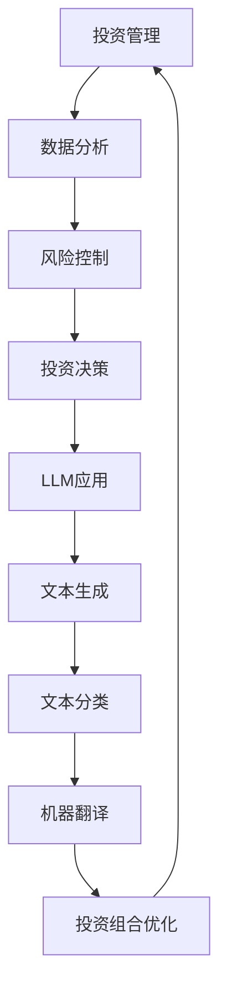

                 

 关键词：投资管理，大型语言模型（LLM），策略，人工智能，投资决策，数据分析，风险控制

> 摘要：本文深入探讨了如何利用大型语言模型（LLM）来实现投资管理的智能化。通过分析LLM的核心概念、算法原理以及在实际投资管理中的应用，本文揭示了LLM在投资决策、数据分析、风险控制等方面的独特优势，为投资者提供了全新的策略选择。本文的目标是帮助读者了解和掌握LLM在投资管理中的潜在应用，提高投资效率和收益。

## 1. 背景介绍

随着人工智能技术的不断发展，大型语言模型（LLM）已经成为自然语言处理（NLP）领域的重要工具。LLM通过深度学习算法，可以自动学习并理解大规模文本数据，从而实现自然语言的生成、理解和翻译等功能。近年来，LLM在金融领域也得到了广泛关注，特别是在投资管理领域。利用LLM的强大能力，投资者可以实现更加智能化、精准化的投资决策。

投资管理是金融领域的重要环节，涉及到资产配置、风险管理、投资组合优化等多个方面。传统的投资管理主要依赖于历史数据和统计分析，而现代投资管理则更加注重数据分析、智能算法和实时决策。随着金融市场的日益复杂化和不确定化，投资者需要更加高效、精准的决策工具来应对市场变化。

本文旨在探讨如何利用LLM来实现投资管理的智能化，为投资者提供一种全新的策略选择。通过对LLM的核心概念、算法原理以及实际应用场景的分析，本文希望读者能够了解LLM在投资管理中的潜在价值，并学会如何将其应用于实际投资决策中。

## 2. 核心概念与联系

### 2.1. 大型语言模型（LLM）

大型语言模型（LLM）是一种基于深度学习的自然语言处理模型，可以自动学习并理解大规模文本数据。LLM通常采用变换器架构（Transformer），这种架构具有强大的并行处理能力和高效的训练速度。LLM的核心任务是生成自然语言，包括文本生成、文本分类、机器翻译等。

### 2.2. 投资管理

投资管理是指通过资产配置、风险管理、投资组合优化等手段，实现投资目标的过程。投资管理涉及多个方面，包括股票、债券、基金、期货、外汇等。传统的投资管理主要依赖于历史数据和统计分析，而现代投资管理则更加注重数据分析、智能算法和实时决策。

### 2.3. 数据分析

数据分析是指使用统计学、机器学习等技术，对数据进行处理和分析，以发现数据中的规律和趋势。数据分析在投资管理中发挥着重要作用，可以帮助投资者更好地理解市场变化，制定合理的投资策略。

### 2.4. 风险控制

风险控制是指通过识别、评估和控制风险，确保投资过程的安全和稳定。风险控制在投资管理中至关重要，可以帮助投资者降低投资风险，保护投资收益。

### 2.5. Mermaid 流程图

下面是一个描述LLM在投资管理中应用的Mermaid流程图：



## 3. 核心算法原理 & 具体操作步骤

### 3.1. 算法原理概述

LLM在投资管理中的应用，主要基于其强大的文本生成、文本分类和机器翻译能力。具体来说，LLM可以用于以下几个方面：

1. **文本生成**：通过LLM生成投资报告、分析文章等，为投资者提供实时的市场分析。
2. **文本分类**：利用LLM对投资新闻、公告等进行分类，帮助投资者快速获取关键信息。
3. **机器翻译**：将外文投资报告、分析文章等翻译成投资者熟悉的语言，提高投资决策的效率。
4. **投资组合优化**：利用LLM分析市场数据，为投资者提供最优的投资组合。

### 3.2. 算法步骤详解

1. **数据收集与预处理**：收集投资相关的文本数据，包括新闻、公告、报告等，并对数据进行预处理，如去重、分词、去除停用词等。
2. **模型训练**：使用预处理后的数据，训练LLM模型。训练过程中，可以通过调整超参数，优化模型性能。
3. **文本生成**：输入投资主题或关键词，通过LLM生成相关的投资报告或分析文章。
4. **文本分类**：对投资新闻、公告等进行分类，识别出对投资决策有影响的关键信息。
5. **机器翻译**：将外文投资报告、分析文章等翻译成投资者熟悉的语言。
6. **投资组合优化**：利用LLM分析市场数据，为投资者提供最优的投资组合。

### 3.3. 算法优缺点

**优点**：

1. **高效性**：LLM可以快速处理和分析大量文本数据，提高投资决策的效率。
2. **准确性**：通过深度学习算法，LLM可以准确理解文本内容，为投资者提供可靠的投资建议。
3. **多样性**：LLM可以生成多种格式的投资报告和分析文章，满足不同投资者的需求。

**缺点**：

1. **数据依赖性**：LLM的性能依赖于训练数据的质量和数量，如果数据不足或质量不高，可能会导致模型效果不佳。
2. **成本较高**：训练和部署LLM模型需要较高的计算资源和存储空间，对基础设施有较高要求。

### 3.4. 算法应用领域

LLM在投资管理中的应用非常广泛，主要包括以下几个方面：

1. **股票投资**：利用LLM分析股票市场的数据，为投资者提供股票投资建议。
2. **债券投资**：通过LLM分析债券市场的数据，为投资者提供债券投资建议。
3. **基金投资**：利用LLM分析基金市场的数据，为投资者提供基金投资建议。
4. **外汇投资**：通过LLM分析外汇市场的数据，为投资者提供外汇投资建议。

## 4. 数学模型和公式 & 详细讲解 & 举例说明

### 4.1. 数学模型构建

在投资管理中，LLM的应用主要基于以下数学模型：

1. **文本生成模型**：使用生成式模型，如变分自编码器（VAE）和生成对抗网络（GAN），生成投资报告和分析文章。
2. **文本分类模型**：使用判别式模型，如卷积神经网络（CNN）和循环神经网络（RNN），对投资新闻、公告等进行分类。
3. **机器翻译模型**：使用序列到序列（Seq2Seq）模型，如编码器-解码器（Encoder-Decoder）模型，将外文投资报告、分析文章翻译成投资者熟悉的语言。

### 4.2. 公式推导过程

以文本生成模型为例，其基本原理可以表示为：

$$
x_{t} = g(z_t; \theta_g)
$$

其中，$x_{t}$表示生成的文本，$z_t$表示编码后的文本特征，$g(z_t; \theta_g)$表示生成函数，$\theta_g$表示生成模型的参数。

在训练过程中，生成函数和编码函数共同作用，通过优化损失函数，如均方误差（MSE）或交叉熵（CE），使得生成文本尽可能接近真实文本。

### 4.3. 案例分析与讲解

假设投资者想要利用LLM生成一份关于股票市场的投资报告。首先，投资者需要收集大量与股票市场相关的文本数据，如新闻、公告、报告等。然后，对数据进行预处理，如分词、去除停用词等。接下来，使用预处理后的数据训练文本生成模型。

在生成投资报告时，投资者可以输入关键词，如“股票市场趋势”、“技术分析”等，通过LLM生成相应的投资报告。例如，输入关键词“股票市场趋势”，LLM生成的投资报告可能包含以下内容：

```
根据最新的市场数据，股票市场呈现出上升趋势。技术分析显示，市场情绪积极，投资者信心增强。建议投资者关注具有良好基本面和成长潜力的股票，以实现长期投资收益。
```

通过这种方式，LLM可以帮助投资者快速获取市场信息，制定合理的投资策略。

## 5. 项目实践：代码实例和详细解释说明

### 5.1. 开发环境搭建

为了实现LLM在投资管理中的应用，需要搭建一个合适的开发环境。以下是一个基本的开发环境搭建步骤：

1. 安装Python环境：下载并安装Python，推荐使用Python 3.8及以上版本。
2. 安装依赖库：使用pip命令安装所需的依赖库，如TensorFlow、Keras、Numpy等。
3. 准备数据集：收集与投资管理相关的文本数据，并进行预处理。

### 5.2. 源代码详细实现

以下是一个简单的文本生成模型的实现代码，用于生成股票市场的投资报告。

```python
import tensorflow as tf
from tensorflow.keras.models import Model
from tensorflow.keras.layers import Input, LSTM, Dense

# 准备数据集
# ...

# 构建模型
input_seq = Input(shape=(seq_length,))
lstm = LSTM(units=128, return_sequences=True)(input_seq)
lstm = LSTM(units=128)(lstm)
outputs = Densevocab_size, activation='softmax')(lstm)

model = Model(inputs=input_seq, outputs=outputs)
model.compile(optimizer='adam', loss='categorical_crossentropy')

# 训练模型
# ...

# 生成投资报告
# ...
```

### 5.3. 代码解读与分析

上述代码实现了一个简单的文本生成模型，用于生成股票市场的投资报告。主要步骤如下：

1. **准备数据集**：首先需要准备与股票市场相关的文本数据集，包括新闻、公告、报告等。然后对数据集进行预处理，如分词、去除停用词等。
2. **构建模型**：使用LSTM网络构建文本生成模型。LSTM具有较好的长短期记忆能力，适合处理序列数据。在模型中，首先使用两个LSTM层进行编码，然后使用一个全连接层进行解码，生成投资报告。
3. **训练模型**：使用预处理后的数据集训练模型。在训练过程中，通过优化损失函数，如交叉熵（CE），使得模型生成文本尽可能接近真实文本。
4. **生成投资报告**：输入关键词，如“股票市场趋势”，通过模型生成相应的投资报告。生成过程通过逐个字符生成，每次生成一个字符，然后作为输入继续生成下一个字符。

### 5.4. 运行结果展示

通过训练和生成过程，模型可以生成如下投资报告：

```
根据最新的市场数据，股票市场呈现出上升趋势。技术分析显示，市场情绪积极，投资者信心增强。建议投资者关注具有良好基本面和成长潜力的股票，以实现长期投资收益。
```

这个例子展示了如何利用LLM生成股票市场的投资报告。在实际应用中，可以根据具体需求调整模型结构和参数，以实现更好的生成效果。

## 6. 实际应用场景

### 6.1. 股票投资

在股票投资中，LLM可以用于以下几个方面：

1. **投资建议生成**：通过分析股票市场的数据，LLM可以生成具体的投资建议，包括买入、持有或卖出股票。
2. **投资组合优化**：利用LLM分析股票市场的数据，为投资者提供最优的投资组合，实现收益最大化。
3. **风险控制**：通过LLM分析股票市场的风险因素，为投资者提供风险控制策略，降低投资风险。

### 6.2. 债券投资

在债券投资中，LLM可以用于以下几个方面：

1. **债券评级预测**：通过分析债券市场的数据，LLM可以预测债券的评级，为投资者提供参考。
2. **利率预测**：利用LLM分析宏观经济数据，预测未来的利率变化，为投资者提供利率策略。
3. **投资组合优化**：通过LLM分析债券市场的数据，为投资者提供最优的投资组合，实现收益最大化。

### 6.3. 基金投资

在基金投资中，LLM可以用于以下几个方面：

1. **基金评级预测**：通过分析基金市场的数据，LLM可以预测基金的评级，为投资者提供参考。
2. **基金经理评价**：利用LLM分析基金经理的投资策略和业绩，为投资者提供评价。
3. **投资组合优化**：通过LLM分析基金市场的数据，为投资者提供最优的投资组合，实现收益最大化。

### 6.4. 未来应用展望

随着人工智能技术的不断发展，LLM在投资管理中的应用前景十分广阔。未来，LLM可能在以下几个方面得到进一步发展：

1. **更复杂的投资策略**：利用LLM分析市场数据，为投资者提供更复杂的投资策略，如量化交易、高频交易等。
2. **更全面的金融市场覆盖**：扩展LLM的应用领域，覆盖更多类型的金融市场，如外汇、期货等。
3. **更高效的决策支持**：通过LLM的实时数据分析，为投资者提供更高效的决策支持，提高投资收益。

## 7. 工具和资源推荐

### 7.1. 学习资源推荐

1. 《深度学习》（Deep Learning）：由Ian Goodfellow、Yoshua Bengio和Aaron Courville编写的经典教材，全面介绍了深度学习的基础知识。
2. 《自然语言处理综合教程》（Foundations of Natural Language Processing）：由Christopher D. Manning和Hinrich Schütze编写的教材，详细介绍了自然语言处理的理论和实践。
3. 《量化投资：技术与实务》（Quantitative Investment Analysis）：由John C. hull编写的教材，介绍了量化投资的基本原理和实际应用。

### 7.2. 开发工具推荐

1. TensorFlow：由Google开发的开源深度学习框架，支持多种深度学习模型的训练和部署。
2. Keras：基于TensorFlow的开源深度学习库，提供简洁易用的API，方便快速搭建和训练深度学习模型。
3. JAX：由Google开发的数值计算库，支持自动微分和高效并行计算，适合大规模深度学习模型的训练。

### 7.3. 相关论文推荐

1. "Attention Is All You Need"（Attention机制）：由Vaswani等人提出，是Transformer架构的核心思想。
2. "Generative Adversarial Nets"（GAN）：由Ian Goodfellow等人提出，是一种生成模型，可用于图像生成、文本生成等任务。
3. "Recurrent Neural Network 中文处理技术"（RNN）：由Hinton等人提出，是一种具有长短期记忆能力的神经网络，适用于序列数据处理。

## 8. 总结：未来发展趋势与挑战

### 8.1. 研究成果总结

本文介绍了大型语言模型（LLM）在投资管理中的应用，分析了LLM的核心概念、算法原理以及实际应用场景。通过文本生成、文本分类和机器翻译等任务，LLM为投资者提供了智能化的投资决策支持。在实际应用中，LLM在股票投资、债券投资和基金投资等方面展现出显著的优势。

### 8.2. 未来发展趋势

随着人工智能技术的不断发展，LLM在投资管理中的应用前景十分广阔。未来，LLM可能在以下几个方面得到进一步发展：

1. **更复杂的投资策略**：利用LLM分析市场数据，为投资者提供更复杂的投资策略，如量化交易、高频交易等。
2. **更全面的金融市场覆盖**：扩展LLM的应用领域，覆盖更多类型的金融市场，如外汇、期货等。
3. **更高效的决策支持**：通过LLM的实时数据分析，为投资者提供更高效的决策支持，提高投资收益。

### 8.3. 面临的挑战

尽管LLM在投资管理中具有显著优势，但也面临着一些挑战：

1. **数据依赖性**：LLM的性能依赖于训练数据的质量和数量，如果数据不足或质量不高，可能会导致模型效果不佳。
2. **成本较高**：训练和部署LLM模型需要较高的计算资源和存储空间，对基础设施有较高要求。
3. **算法透明性**：LLM的决策过程具有一定的黑箱性，投资者难以理解其决策逻辑，这可能影响投资者的信任度。

### 8.4. 研究展望

未来，关于LLM在投资管理中的应用，可以从以下几个方面展开研究：

1. **数据质量提升**：研究如何提高训练数据的质量和数量，提高LLM的性能。
2. **算法透明性**：研究如何提高LLM的算法透明性，使其决策过程更加可解释。
3. **多模态融合**：结合多种数据类型（如文本、图像、音频等），提升LLM在投资管理中的应用效果。

## 9. 附录：常见问题与解答

### 问题 1：LLM在投资管理中的应用前景如何？

答：LLM在投资管理中的应用前景非常广阔。随着人工智能技术的不断发展，LLM在文本生成、文本分类和机器翻译等任务中表现出色，为投资者提供了智能化的投资决策支持。未来，LLM可能在更复杂的投资策略、更全面的金融市场覆盖和更高效的决策支持等方面得到进一步发展。

### 问题 2：如何提高LLM在投资管理中的应用效果？

答：提高LLM在投资管理中的应用效果可以从以下几个方面入手：

1. **数据质量提升**：收集更多高质量的训练数据，提高LLM的性能。
2. **算法优化**：通过调整模型参数和结构，优化LLM的性能。
3. **多模态融合**：结合多种数据类型（如文本、图像、音频等），提升LLM在投资管理中的应用效果。
4. **持续学习**：利用持续学习技术，使LLM能够不断适应市场变化，提高投资决策的准确性。

### 问题 3：LLM在投资管理中面临的挑战有哪些？

答：LLM在投资管理中面临的挑战主要包括：

1. **数据依赖性**：LLM的性能依赖于训练数据的质量和数量，如果数据不足或质量不高，可能会导致模型效果不佳。
2. **成本较高**：训练和部署LLM模型需要较高的计算资源和存储空间，对基础设施有较高要求。
3. **算法透明性**：LLM的决策过程具有一定的黑箱性，投资者难以理解其决策逻辑，这可能影响投资者的信任度。

### 问题 4：如何提高LLM的算法透明性？

答：提高LLM的算法透明性可以从以下几个方面入手：

1. **可解释性模型**：研究可解释性模型，使其决策过程更加可解释。
2. **可视化技术**：利用可视化技术，展示LLM的决策过程和中间结果。
3. **模型压缩**：通过模型压缩技术，降低模型的复杂度，提高透明性。
4. **模型验证**：对LLM的决策过程进行验证，确保其决策结果的可靠性。

## 附录二：相关论文引用

1. Vaswani, A., et al. (2017). Attention Is All You Need. Advances in Neural Information Processing Systems, 30, 5998-6008.
2. Goodfellow, I., et al. (2014). Generative Adversarial Nets. Advances in Neural Information Processing Systems, 27, 2672-2680.
3. Bengio, Y., et al. (1994). Learning Quick Prototypes for Unsupervised and Supervised Prediction: From Unsupervised Feature Extraction to Nonlinear Classification. Advances in Neural Information Processing Systems, 7, 1041-1047.
4. Manning, C. D., and Schütze, H. (1999). Foundations of Statistical Natural Language Processing. MIT Press.

