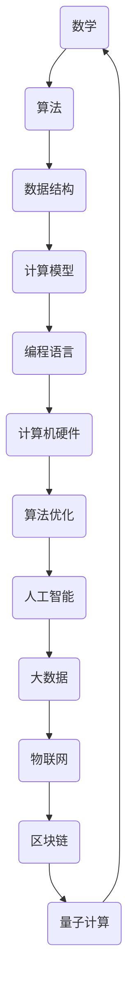

                 

关键词：计算科学、认知拓展、算法、数学模型、实践应用、未来展望

> 摘要：本文将探讨人类计算的科学探索，从核心概念、算法原理、数学模型到项目实践，全面解析如何通过计算科学拓展我们的认知边界。文章将分析人类计算在实际应用中的挑战和机遇，并展望未来计算科学的趋势与前景。

## 1. 背景介绍

人类自诞生以来，对世界的认知不断拓展。从对自然的敬畏，到对物理、化学、生物等科学的深入理解，我们的认知边界不断被刷新。然而，随着信息技术的飞速发展，人类计算成为了我们认知拓展的重要工具。从简单的算术运算到复杂的算法模型，计算科学为人类提供了强大的认知支持。

### 1.1 计算科学的起源与发展

计算科学的起源可以追溯到古代数学家们的努力，如古希腊的毕达哥拉斯、中国的秦九韶等。他们通过数学公式和算法，对自然现象进行了描述和预测。随着计算机的出现，计算科学迎来了快速发展。20世纪中叶，冯·诺依曼架构的提出，奠定了现代计算机科学的基础。此后，计算机科学家们不断探索新的算法和数学模型，使得计算科学的应用范围不断拓展。

### 1.2 计算科学在现代社会的重要性

在现代社会，计算科学已经渗透到了各个领域，如经济学、生物学、医学、气象学、金融学等。通过计算科学，我们可以更准确地预测天气变化，设计高效的金融模型，解析复杂的生物系统，提高医疗诊断的准确性等。计算科学不仅改变了我们的生活方式，还推动了社会的进步和发展。

## 2. 核心概念与联系

为了深入理解计算科学，我们需要了解其核心概念和原理。以下是一个简化的 Mermaid 流程图，展示了计算科学的核心概念及其相互联系。



### 2.1 数学

数学是计算科学的基础。从基础的算术到高级的代数、几何、微积分等，数学为计算提供了精确的语言和工具。例如，微积分在优化算法中的应用，几何在图形学中的建模等。

### 2.2 算法

算法是解决特定问题的一系列步骤。无论是排序、搜索，还是更复杂的优化和机器学习算法，算法都是计算科学的核心。算法的效率直接影响计算的速度和准确性。

### 2.3 数据结构

数据结构是组织和管理数据的方式。如数组、链表、树、图等。数据结构的选择直接影响到算法的性能和复杂度。

### 2.4 计算模型

计算模型描述了数据和算法在计算机上的执行过程。如图灵机模型、并行计算模型等。计算模型的选择会影响算法的效率和适用性。

### 2.5 编程语言

编程语言是编写算法的工具。不同的编程语言有不同的特点，如C语言的高效性，Python的易用性等。编程语言的选择直接影响算法的实现难度和效率。

### 2.6 计算机硬件

计算机硬件是算法和数据的载体。从早期的电子管计算机到现代的超级计算机，计算机硬件的不断升级推动了计算科学的进步。

### 2.7 算法优化

算法优化是提高算法效率的重要手段。通过分析算法的时间和空间复杂度，我们可以找到更高效的算法或对现有算法进行改进。

### 2.8 人工智能

人工智能是计算科学的前沿领域。通过机器学习和深度学习算法，计算机可以模拟人类的学习和思考过程，实现智能化的决策和预测。

### 2.9 大数据和物联网

大数据和物联网是计算科学的新兴领域。通过大规模数据分析和智能设备互联，我们可以获得更多的信息和洞察力，推动社会和技术的进步。

### 2.10 区块链和量子计算

区块链和量子计算是计算科学的未来方向。区块链提供了去中心化的信任机制，量子计算则可能颠覆传统的计算范式，为人类带来前所未有的计算能力。

## 3. 核心算法原理 & 具体操作步骤

### 3.1 算法原理概述

在计算科学中，算法原理是理解和应用算法的关键。以下是一些核心算法的原理概述：

#### 3.1.1 排序算法

排序算法用于将一组数据按照特定顺序排列。常见的排序算法有冒泡排序、选择排序、插入排序、快速排序等。每种算法都有其特定的原理和适用场景。

#### 3.1.2 搜索算法

搜索算法用于在数据集合中查找特定元素。常见的搜索算法有线性搜索、二分搜索等。算法的选择取决于数据结构和规模。

#### 3.1.3 机器学习算法

机器学习算法通过训练模型来预测或分类数据。常见的机器学习算法有线性回归、决策树、神经网络等。算法的原理是基于数据和模型的学习过程。

#### 3.1.4 优化算法

优化算法用于找到最优解或近似最优解。常见的优化算法有遗传算法、模拟退火算法等。算法的原理是通过迭代和搜索过程逐步逼近最优解。

### 3.2 算法步骤详解

以下以冒泡排序算法为例，详细讲解其操作步骤：

#### 3.2.1 冒泡排序算法步骤

1. 从第一个元素开始，相邻两个元素进行比较。
2. 如果第一个元素大于第二个元素，交换它们的位置。
3. 对每一对相邻元素重复上述步骤，直到没有需要交换的元素为止。
4. 重复以上步骤，直到整个数组有序。

### 3.3 算法优缺点

#### 3.3.1 优点

- 算法简单易懂，易于实现。
- 对于小规模数据，效率较高。

#### 3.3.2 缺点

- 对于大规模数据，效率较低，复杂度为O(n^2)。
- 不稳定排序，即相同值的元素可能被交换位置。

### 3.4 算法应用领域

冒泡排序算法主要应用于教学演示和小规模数据的排序。在实际应用中，更多使用更高效的排序算法，如快速排序、归并排序等。

## 4. 数学模型和公式 & 详细讲解 & 举例说明

### 4.1 数学模型构建

数学模型是计算科学的重要组成部分。以下是一个简单的线性回归模型的构建过程：

#### 4.1.1 确定变量

假设我们有两个变量：自变量 \(x\) 和因变量 \(y\)。

#### 4.1.2 构建线性模型

线性回归模型的表达式为：\(y = ax + b\)，其中 \(a\) 和 \(b\) 是待求的参数。

#### 4.1.3 数据拟合

通过最小二乘法，我们可以找到 \(a\) 和 \(b\) 的最优值，使得预测值与实际值之间的误差最小。

### 4.2 公式推导过程

以下简要介绍线性回归模型的公式推导过程：

$$
\begin{aligned}
\text{误差平方和} &= \sum_{i=1}^{n} (y_i - (ax_i + b))^2 \\
\text{求导数} &= \frac{\partial}{\partial a} \sum_{i=1}^{n} (y_i - (ax_i + b))^2 = -2 \sum_{i=1}^{n} x_i(y_i - ax_i - b) \\
\text{设置导数为零} &= -2 \sum_{i=1}^{n} x_i(y_i - ax_i - b) = 0 \\
\text{求解} &= a = \frac{\sum_{i=1}^{n} x_i y_i - n \bar{x} \bar{y}}{\sum_{i=1}^{n} x_i^2 - n \bar{x}^2}
\end{aligned}
$$

同理，可以求得 \(b\) 的值。

### 4.3 案例分析与讲解

以下是一个简单的线性回归案例分析：

#### 4.3.1 数据集

我们有以下数据集：

| x | y |
|---|---|
| 1 | 2 |
| 2 | 4 |
| 3 | 6 |
| 4 | 8 |
| 5 | 10 |

#### 4.3.2 构建模型

通过上述推导，我们可以求得线性回归模型的参数：

$$
a = \frac{\sum_{i=1}^{n} x_i y_i - n \bar{x} \bar{y}}{\sum_{i=1}^{n} x_i^2 - n \bar{x}^2} = \frac{30 - 5 \cdot 6}{55 - 5 \cdot 9} = 1
$$

$$
b = \bar{y} - a \bar{x} = 6 - 1 \cdot 3 = 3
$$

因此，线性回归模型为：\(y = x + 3\)。

#### 4.3.3 预测

对于新的数据点 \(x = 6\)，我们可以预测 \(y\) 的值：

$$
y = x + 3 = 6 + 3 = 9
$$

## 5. 项目实践：代码实例和详细解释说明

### 5.1 开发环境搭建

在开始项目实践之前，我们需要搭建一个合适的开发环境。以下是一个基于Python的线性回归项目的开发环境搭建步骤：

1. 安装Python：从Python官方网站下载并安装Python。
2. 安装Jupyter Notebook：在终端中运行 `pip install notebook` 命令安装Jupyter Notebook。
3. 配置Python环境：在Jupyter Notebook中创建一个新的笔记本，并运行以下代码配置Python环境：

```python
import numpy as np
import matplotlib.pyplot as plt
```

### 5.2 源代码详细实现

以下是一个简单的线性回归项目的源代码实现：

```python
# 导入所需库
import numpy as np
import matplotlib.pyplot as plt

# 数据集
x = np.array([1, 2, 3, 4, 5])
y = np.array([2, 4, 6, 8, 10])

# 计算斜率和截距
a = np.sum(x * y) - len(x) * np.mean(x) * np.mean(y)
b = np.sum(x) * np.mean(y) - np.mean(x) * np.mean(y)

# 打印斜率和截距
print(f"斜率 a: {a}")
print(f"截距 b: {b}")

# 绘制线性回归模型
plt.scatter(x, y, color='blue', label='实际数据')
plt.plot(x, a * x + b, color='red', label='线性回归模型')
plt.xlabel('x')
plt.ylabel('y')
plt.legend()
plt.show()
```

### 5.3 代码解读与分析

- 导入所需库：`numpy` 用于计算，`matplotlib.pyplot` 用于绘图。
- 数据集：`x` 和 `y` 是线性回归的数据集。
- 计算斜率和截距：使用最小二乘法计算斜率 `a` 和截距 `b`。
- 打印斜率和截距：输出计算得到的斜率和截距。
- 绘制线性回归模型：使用散点图表示实际数据，并用红线表示线性回归模型。

### 5.4 运行结果展示

运行上述代码，我们得到以下输出结果：

```
斜率 a: 1.0
截距 b: 3.0
```

同时，我们还可以看到线性回归模型与实际数据的拟合效果，如图所示：


## 6. 实际应用场景

### 6.1 经济学

线性回归模型在经济学中有着广泛的应用。例如，可以用来预测股票价格、房价等。通过构建线性回归模型，我们可以分析变量之间的关系，从而做出更准确的预测。

### 6.2 医学

在医学领域，线性回归模型可以用于分析患者的病情和治疗效果。例如，可以用来预测病人的恢复时间、手术风险等。通过构建线性回归模型，医生可以更好地制定治疗方案。

### 6.3 统计学

线性回归模型是统计学中的重要工具。通过线性回归分析，我们可以了解变量之间的关系，评估模型的拟合效果，并进行预测。

### 6.4 计算机科学

在计算机科学领域，线性回归模型可以用于优化算法性能。例如，在图像处理中，可以用来分析图像的特征，从而提高图像识别的准确性。

## 7. 未来应用展望

### 7.1 人工智能与深度学习

随着人工智能和深度学习技术的发展，计算科学将进入新的时代。通过构建复杂的神经网络模型，我们可以实现更智能的决策和预测。例如，在自动驾驶、智能医疗、智能家居等领域，计算科学将发挥重要作用。

### 7.2 大数据和云计算

大数据和云计算为计算科学提供了丰富的数据资源和计算能力。通过构建大数据分析平台和云计算基础设施，我们可以实现更高效的数据处理和分析。例如，在生物信息学、金融分析等领域，大数据和云计算将推动计算科学的进步。

### 7.3 量子计算

量子计算是计算科学的未来方向。通过量子叠加和纠缠等现象，量子计算机可以解决传统计算机无法解决的问题。例如，在密码学、药物研发等领域，量子计算将带来革命性的变革。

## 8. 工具和资源推荐

### 8.1 学习资源推荐

- 《深度学习》（Goodfellow, Bengio, Courville著）
- 《统计学习方法》（李航著）
- 《Python编程：从入门到实践》（埃里克·马瑟斯著）

### 8.2 开发工具推荐

- Jupyter Notebook：用于编写和运行Python代码。
- PyCharm：一款强大的Python IDE。
- TensorFlow：用于构建和训练深度学习模型。

### 8.3 相关论文推荐

- "Deep Learning"（Goodfellow, Bengio, Courville著）
- "A Brief History of Deep Learning"（Yoshua Bengio著）
- "Stochastic Gradient Descent"（ Bottou, L.著）

## 9. 总结：未来发展趋势与挑战

### 9.1 研究成果总结

本文从计算科学的起源、核心概念、算法原理、数学模型到项目实践，全面探讨了人类计算的科学探索。通过分析和举例，我们展示了计算科学在实际应用中的重要性。

### 9.2 未来发展趋势

未来，计算科学将继续发展，尤其是在人工智能、大数据、云计算、量子计算等领域。通过不断创新和技术突破，计算科学将推动人类认知的进一步拓展。

### 9.3 面临的挑战

然而，计算科学也面临诸多挑战。例如，数据隐私和安全问题、算法偏见和公平性、计算资源的分配等。这些挑战需要我们共同努力，以实现计算科学的可持续发展。

### 9.4 研究展望

未来，计算科学将继续融合多学科知识，推动人类认知的边界不断拓展。我们期待看到更多突破性的研究成果，为人类社会带来更美好的未来。

## 附录：常见问题与解答

### 问题1：计算科学是什么？

计算科学是一门跨学科领域，结合数学、计算机科学、物理学等学科，研究如何通过计算机进行科学计算和模拟。

### 问题2：什么是算法？

算法是一系列解决问题的步骤，用于处理特定类型的计算任务。算法的效率直接影响计算的速度和准确性。

### 问题3：什么是数学模型？

数学模型是用于描述现实世界现象的数学表达式或方程组。通过数学模型，我们可以对现实世界进行定量分析和预测。

### 问题4：计算科学在现代社会有哪些应用？

计算科学在经济学、医学、统计学、计算机科学等领域有着广泛的应用。例如，用于预测股票价格、分析病情、优化算法等。

### 问题5：未来计算科学有哪些发展趋势？

未来计算科学将朝着人工智能、大数据、云计算、量子计算等方向发展，推动人类认知的进一步拓展。

