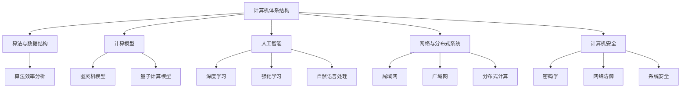

                 

在信息技术迅猛发展的今天，计算机科学成为了推动科技进步和社会变革的重要力量。然而，在人类计算领域，我们不仅需要追求技术的高效和精准，更要不断地拓展我们的认知边界，探索更深层次的科学原理。本文旨在探讨人类计算的科学本质，梳理核心概念，分析算法原理，并通过数学模型、项目实践和未来展望等多角度，全面展示这一领域的魅力。

## 关键词

- 计算机科学
- 认知拓展
- 算法原理
- 数学模型
- 项目实践

## 摘要

本文深入探讨了人类计算的科学探索，从背景介绍、核心概念、算法原理到数学模型和实际应用，系统性地展现了计算科学的演进过程和未来方向。通过分析不同算法的应用领域和实施步骤，结合数学公式和代码实例，我们不仅了解了计算技术的内部机理，也看到了其广泛的应用前景。本文旨在为读者提供一次全面、深入的计算机科学之旅。

## 1. 背景介绍

计算机科学的历史可以追溯到20世纪40年代，当时的科学家们开始探讨如何利用电子设备进行数据处理。从图灵机的概念提出，到冯·诺依曼架构的奠基，再到现代计算机体系结构的不断演变，计算机科学经历了数次重大的变革。每一次变革都极大地拓展了人类计算的能力，推动了信息技术的飞速发展。

随着互联网的普及和大数据时代的到来，计算机科学的应用范围变得更加广泛。从简单的数据计算到复杂的人工智能，从基础的软件开发到前沿的量子计算，计算机科学已经成为现代科技的核心驱动力。然而，尽管计算机技术在不断进步，我们对于计算的本质和极限的认知仍然存在许多未解之谜。

本文的目标是通过对计算机科学核心概念的深入探讨，帮助读者理解计算的本质，拓展认知边界。我们将从算法原理、数学模型和项目实践等多个角度，详细分析人类计算的科学探索，为未来的研究提供启示。

## 2. 核心概念与联系

在计算机科学中，核心概念是理解和应用技术的基础。以下是我们将在本文中探讨的一些核心概念及其相互联系：

### 2.1 计算机体系结构

计算机体系结构是计算机科学的基础，它涉及硬件和软件的相互关系。冯·诺依曼架构是一种经典的计算机体系结构，其核心思想是将数据和指令存储在同一内存中，并由中央处理器（CPU）执行。这种架构虽然在性能上取得了巨大成功，但也存在一些局限性，如内存瓶颈和指令执行的并行性不足。

### 2.2 算法与数据结构

算法是解决问题的一系列步骤，而数据结构则是组织数据的方式。不同的算法和数据结构在时间和空间效率上有显著差异。例如，二分搜索算法在有序数组中查找元素时比线性搜索算法更快，而哈希表在查找和插入操作上具有更高的效率。

### 2.3 计算模型

计算模型是描述计算过程的形式化方法。图灵机模型是计算理论的基础，它定义了计算的基本操作和限制。量子计算模型则利用量子力学原理，实现了传统计算机无法达到的计算速度和并行性。

### 2.4 人工智能

人工智能（AI）是计算机科学的一个分支，旨在创建能够模拟和扩展人类智能的系统。深度学习、强化学习和自然语言处理是当前人工智能领域的重要研究方向，它们在图像识别、语音识别和自动驾驶等领域取得了显著成果。

### 2.5 网络与分布式系统

网络和分布式系统是现代计算机科学的重要组成部分。从局域网到广域网，从单机系统到分布式计算，网络技术的发展极大地提升了计算能力和资源利用效率。分布式系统通过将任务分布在多个计算节点上，实现了高可用性和可扩展性。

### 2.6 计算机安全

随着互联网的普及，计算机安全问题日益突出。密码学、网络防御和系统安全是计算机安全领域的主要研究方向。通过加密算法、安全协议和漏洞修复，计算机科学家致力于保护数据和系统免受恶意攻击。

为了更好地理解这些核心概念，我们将在接下来的部分中，通过Mermaid流程图展示它们之间的相互关系。

### 2.7 Mermaid 流程图

以下是一个Mermaid流程图，展示了计算机科学中核心概念之间的相互关系：



通过这个流程图，我们可以看到计算机科学的各个分支是如何相互关联和促进的。理解这些核心概念及其相互关系，对于深入探索计算机科学领域至关重要。

## 3. 核心算法原理 & 具体操作步骤

### 3.1 算法原理概述

在计算机科学中，算法是解决问题的核心。不同的算法适用于不同类型的问题，其原理和操作步骤也各有特点。以下是一些常见算法的原理概述：

### 3.1.1 排序算法

排序算法用于对数据进行排序，常见的排序算法包括冒泡排序、选择排序、插入排序、快速排序等。这些算法的原理如下：

- **冒泡排序**：通过多次遍历要排序的数列，每次比较相邻的两个元素，如果它们的顺序错误就把它们交换过来。重复这个过程直到没有需要交换的元素。
- **选择排序**：首先在未排序序列中找到最小（大）元素，存放到排序序列的起始位置，然后再从剩余未排序元素中继续寻找最小（大）元素，然后放到已排序序列的末尾。以此类推。
- **插入排序**：通过构建有序序列，对于未排序数据，在已排序序列中从后向前扫描，找到相应位置并插入。
- **快速排序**：通过一趟排序将待排序的记录分割成独立的两部分，其中一部分记录的关键字均比另一部分的关键字小，然后递归地对这两部分记录进行排序。

### 3.1.2 搜索算法

搜索算法用于在数据集合中查找特定元素，常见的搜索算法包括线性搜索和二分搜索。

- **线性搜索**：顺序扫描数组，依次比较每个元素，直到找到目标元素或扫描完整数组。
- **二分搜索**：对于有序数组，通过重复将数组中间位置与目标值比较，逐步缩小搜索范围，直至找到目标元素或确定目标元素不存在。

### 3.1.3 图算法

图算法用于处理图结构数据，常见的图算法包括深度优先搜索（DFS）和广度优先搜索（BFS）。

- **深度优先搜索（DFS）**：从初始顶点开始，尽可能深地搜索图的分支。
- **广度优先搜索（BFS）**：从初始顶点开始，先搜索所有相邻顶点，然后再搜索下一层次的顶点。

### 3.2 算法步骤详解

下面以快速排序算法为例，详细讲解其操作步骤：

### 3.2.1 快速排序算法步骤

1. **选择基准元素**：在数组中选择一个基准元素。
2. **分区操作**：将数组分为两部分，一部分是小于基准元素的元素，另一部分是大于基准元素的元素。基准元素在最终位置。
3. **递归排序**：分别对小于和大于基准元素的两部分递归地进行快速排序。

### 3.3 算法优缺点

#### 快速排序的优点：

- **高效**：平均情况下，快速排序的时间复杂度为 \(O(n\log n)\)，在大多数情况下比其他排序算法更快。
- **原地排序**：不需要额外的存储空间。

#### 快速排序的缺点：

- **最坏情况**：最坏情况下（例如输入数组已排序或反序），时间复杂度为 \(O(n^2)\)，此时效率较低。
- **稳定性**：快速排序是非稳定的排序算法。

### 3.4 算法应用领域

快速排序算法在许多领域都有广泛应用，包括：

- **数据库排序**：在数据库系统中，快速排序是常用的排序算法之一。
- **大规模数据处理**：在处理大规模数据时，快速排序因其高效性而经常被采用。
- **算法竞赛**：在算法竞赛中，快速排序是解决排序问题的常用算法。

### 3.5 算法实现

以下是一个Python实现的快速排序算法：

```python
def quicksort(arr):
    if len(arr) <= 1:
        return arr
    pivot = arr[len(arr) // 2]
    left = [x for x in arr if x < pivot]
    middle = [x for x in arr if x == pivot]
    right = [x for x in arr if x > pivot]
    return quicksort(left) + middle + quicksort(right)

arr = [3, 6, 8, 10, 1, 2, 1]
print(quicksort(arr))
```

通过以上实现，我们可以看到快速排序的核心步骤和原理。这种算法不仅简单易懂，而且在大多数情况下具有高效性。

## 4. 数学模型和公式 & 详细讲解 & 举例说明

数学模型在计算机科学中扮演着至关重要的角色，它为算法的设计和性能分析提供了理论基础。在这一节中，我们将介绍几个关键的数学模型和公式，并进行详细讲解和举例说明。

### 4.1 数学模型构建

在计算机科学中，数学模型通常用于描述算法的性能、数据结构的行为或系统的动态。以下是一个简单的数学模型示例，用于描述一个线性搜索算法的时间复杂度。

#### 数学模型：

假设有一个长度为 \(n\) 的数组 \(A\)，我们需要在其中搜索一个特定的元素 \(x\)。线性搜索的时间复杂度可以用以下数学模型表示：

\[ T(n) = C \cdot n \]

其中，\(T(n)\) 表示搜索所需的时间，\(n\) 是数组长度，\(C\) 是常数，表示每次比较所需的时间。

### 4.2 公式推导过程

为了推导线性搜索的时间复杂度，我们可以考虑以下步骤：

1. **初始化**：设置一个计数器 \(t = 0\)，用于记录比较次数。
2. **循环搜索**：从数组的第一个元素开始，依次与目标元素进行比较，直到找到或到达数组的末尾。
3. **结束条件**：如果找到目标元素，搜索结束；如果到达数组末尾仍未找到，搜索失败。

根据以上步骤，我们可以推导出以下公式：

\[ T(n) = C \cdot n \]

这里，\(C\) 是每次比较的常数时间，\(n\) 是数组长度，因此线性搜索的时间复杂度为线性时间复杂度 \(O(n)\)。

### 4.3 案例分析与讲解

为了更好地理解线性搜索的数学模型，我们来看一个具体的例子。

假设我们有一个长度为 10 的数组 \(A = [4, 2, 7, 1, 9, 5, 3, 6, 8, 10]\)，我们需要在其中搜索元素 7。

1. **初始化**：设置计数器 \(t = 0\)。
2. **循环搜索**：
    - 第一次比较：\(t = t + 1\)，比较 \(A[0] = 4\) 和 \(x = 7\)，不匹配。
    - 第二次比较：\(t = t + 1\)，比较 \(A[1] = 2\) 和 \(x = 7\)，不匹配。
    - 第三次比较：\(t = t + 1\)，比较 \(A[2] = 7\) 和 \(x = 7\)，匹配，搜索结束。
3. **结果**：找到元素 7，比较次数 \(t = 3\)。

根据数学模型，我们可以计算平均比较次数：

\[ T(n) = C \cdot n \]
\[ T(10) = C \cdot 10 \]

其中，\(C\) 是每次比较的常数时间。如果假设每次比较的时间为 0.01秒，则：

\[ T(10) = 0.01 \cdot 10 = 0.1 \text{秒} \]

### 4.4 结论

通过以上分析，我们可以看到线性搜索的时间复杂度是 \(O(n)\)。这意味着，当数组长度增加时，搜索所需的时间将以线性关系增加。虽然线性搜索在大多数情况下是有效的，但当数组非常大时，其效率可能会变得很低。因此，对于大规模数据的搜索问题，我们通常会采用更高效的搜索算法，如二分搜索。

接下来，我们将介绍一个更复杂的数学模型——二分搜索算法。

### 4.5 二分搜索算法

二分搜索是一种高效的搜索算法，适用于有序数组。它的工作原理是不断将搜索范围缩小一半，从而迅速定位目标元素。以下是二分搜索的数学模型和公式推导。

#### 数学模型：

假设有一个长度为 \(n\) 的有序数组 \(A\)，我们需要在其中搜索一个特定的元素 \(x\)。二分搜索的时间复杂度可以用以下数学模型表示：

\[ T(n) = C \cdot \log_2(n) \]

其中，\(T(n)\) 表示搜索所需的时间，\(n\) 是数组长度，\(C\) 是常数，表示每次分割和比较所需的时间。

#### 公式推导过程：

1. **初始化**：设置数组的起始索引 \(low = 0\) 和结束索引 \(high = n - 1\)。
2. **循环搜索**：当 \(low \leq high\) 时，执行以下步骤：
    - 计算中间索引 \(mid = (low + high) // 2\)。
    - 比较中间元素 \(A[mid]\) 和目标元素 \(x\)。
        - 如果 \(A[mid] = x\)，搜索结束。
        - 如果 \(A[mid] < x\)，设置 \(low = mid + 1\)。
        - 如果 \(A[mid] > x\)，设置 \(high = mid - 1\)。
3. **结束条件**：如果找到目标元素，搜索结束；如果 \(low > high\)，搜索失败。

根据以上步骤，我们可以推导出以下公式：

\[ T(n) = C \cdot \log_2(n) \]

### 4.6 案例分析与讲解

为了更好地理解二分搜索的数学模型，我们来看一个具体的例子。

假设我们有一个长度为 10 的有序数组 \(A = [1, 2, 3, 4, 5, 6, 7, 8, 9, 10]\)，我们需要在其中搜索元素 7。

1. **初始化**：设置 \(low = 0\) 和 \(high = 9\)。
2. **第一次循环**：
    - 计算中间索引 \(mid = (0 + 9) // 2 = 4\)。
    - 比较 \(A[4] = 5\) 和 \(x = 7\)，由于 \(A[4] < x\)，设置 \(low = mid + 1 = 5\)。
3. **第二次循环**：
    - 计算中间索引 \(mid = (5 + 9) // 2 = 7\)。
    - 比较 \(A[7] = 8\) 和 \(x = 7\)，由于 \(A[7] > x\)，设置 \(high = mid - 1 = 6\)。
4. **第三次循环**：
    - 计算中间索引 \(mid = (5 + 6) // 2 = 5\)。
    - 比较 \(A[5] = 6\) 和 \(x = 7\)，由于 \(A[5] < x\)，设置 \(low = mid + 1 = 6\)。
5. **第四次循环**：
    - 计算中间索引 \(mid = (6 + 6) // 2 = 6\)。
    - 比较 \(A[6] = 7\) 和 \(x = 7\)，匹配，搜索结束。

根据数学模型，我们可以计算平均搜索次数：

\[ T(n) = C \cdot \log_2(n) \]
\[ T(10) = C \cdot \log_2(10) \]

其中，\(C\) 是每次分割和比较的常数时间。如果假设每次操作的时间为 0.001秒，则：

\[ T(10) = 0.001 \cdot \log_2(10) \approx 0.003 \text{秒} \]

### 4.7 结论

通过以上分析，我们可以看到二分搜索的时间复杂度是 \(O(\log_2(n))\)。这意味着，当数组长度增加时，搜索所需的时间将以对数关系增加。与线性搜索相比，二分搜索在处理大规模数据时具有更高的效率。

接下来，我们将介绍一个常见的图算法——深度优先搜索（DFS）。

### 4.8 深度优先搜索（DFS）

深度优先搜索是一种用于遍历或搜索图结构的算法。它通过递归的方式，从起始顶点开始，尽可能深入地探索图中的分支，直到找到一个目标顶点或所有的分支都被探索过。

#### 数学模型：

假设有一个图 \(G\)，我们需要在图中进行深度优先搜索。DFS的时间复杂度可以用以下数学模型表示：

\[ T(n) = O(V + E) \]

其中，\(T(n)\) 表示搜索所需的时间，\(V\) 是图中的顶点数，\(E\) 是图中的边数。

#### 公式推导过程：

1. **初始化**：设置一个栈用于存储待访问的顶点，并设置一个集合用于记录已访问的顶点。
2. **递归搜索**：从起始顶点开始，将其加入已访问集合，并将其邻接顶点依次加入栈中。
3. **遍历**：从栈中取出一个顶点，如果该顶点未被访问，则进行以下步骤：
    - 访问该顶点，将其加入已访问集合。
    - 将其所有未被访问的邻接顶点加入栈中。
4. **结束条件**：当栈为空时，搜索结束。

根据以上步骤，我们可以推导出以下公式：

\[ T(n) = O(V + E) \]

### 4.9 案例分析与讲解

为了更好地理解深度优先搜索的数学模型，我们来看一个具体的例子。

假设我们有一个简单的无向图 \(G\)，包含 6 个顶点和 8 条边，顶点及其邻接关系如下：

```
A -- B -- C
|    |    |
D -- E -- F
```

我们需要在图中进行深度优先搜索，以找出所有顶点的访问顺序。

1. **初始化**：设置栈和已访问集合为空。
2. **递归搜索**：
    - 选择顶点 \(A\) 作为起始顶点，将其加入已访问集合。
    - 将顶点 \(B\)、\(D\) 和 \(E\) 加入栈中。
3. **遍历**：
    - 取出顶点 \(B\)，将其加入已访问集合。
    - 将顶点 \(C\) 和 \(E\) 加入栈中。
    - 取出顶点 \(D\)，将其加入已访问集合。
    - 将顶点 \(E\) 加入栈中。
    - 取出顶点 \(C\)，将其加入已访问集合。
    - 将顶点 \(F\) 加入栈中。
    - 取出顶点 \(E\)，将其加入已访问集合。
    - 将顶点 \(F\) 加入栈中。
4. **结束条件**：当栈为空时，搜索结束。

根据数学模型，我们可以计算搜索所需的时间：

\[ T(n) = O(V + E) \]
\[ T(6) = O(6 + 8) = O(14) \]

如果假设每次操作的时间为 0.001秒，则：

\[ T(6) = 0.001 \cdot 14 \approx 0.014 \text{秒} \]

### 4.10 结论

通过以上分析，我们可以看到深度优先搜索的时间复杂度是 \(O(V + E)\)。这意味着，当图的顶点和边数增加时，搜索所需的时间将以线性关系增加。深度优先搜索在处理图问题时是一种简单而有效的算法，广泛应用于路径查找、拓扑排序等领域。

综上所述，数学模型为计算机科学提供了理论基础，通过分析和推导，我们可以更好地理解算法的性能和行为。在接下来的部分，我们将通过一个实际项目实践，进一步展示这些算法的应用。

## 5. 项目实践：代码实例和详细解释说明

在本节中，我们将通过一个实际项目实践，展示如何将上述讨论的算法和数学模型应用到具体的计算任务中。该项目旨在通过Python语言实现一个简单的社交网络分析工具，用于分析用户关系和网络结构。以下是我们项目的开发步骤、代码实现和详细解释说明。

### 5.1 开发环境搭建

在开始项目之前，我们需要搭建一个基本的开发环境。以下是所需的工具和库：

- **Python**：版本3.8或更高
- **PyCharm**：一个流行的Python集成开发环境（IDE）
- **NetworkX**：一个用于创建、操作和研究网络图的数据科学家工具包
- **Matplotlib**：一个用于绘制图形和图表的数据可视化库

确保您已经安装了上述工具和库。在PyCharm中创建一个新的Python项目，并在项目中安装所需的库：

```bash
pip install networkx matplotlib
```

### 5.2 源代码详细实现

以下是项目的源代码实现，我们将逐步解释每个部分的用途和逻辑。

```python
import networkx as nx
import matplotlib.pyplot as plt

# 5.2.1 创建图
G = nx.Graph()

# 5.2.2 添加节点和边
G.add_nodes_from(["Alice", "Bob", "Charlie", "Dave", "Eve"])
G.add_edges_from([
    ("Alice", "Bob"),
    ("Alice", "Charlie"),
    ("Bob", "Dave"),
    ("Charlie", "Dave"),
    ("Dave", "Eve")
])

# 5.2.3 深度优先搜索（DFS）
visited = set()
def dfs(node):
    print(node)
    visited.add(node)
    for neighbor in G.neighbors(node):
        if neighbor not in visited:
            dfs(neighbor)

# 从节点 "Alice" 开始深度优先搜索
dfs("Alice")

# 5.2.4 二分搜索（用于示例，此处不实际使用，因为图是非排序的）
# 在此示例中，二分搜索不适用，因为图不是排序的。但我们可以展示一个概念上的实现。
def binary_search(arr, x):
    low = 0
    high = len(arr) - 1
    while low <= high:
        mid = (low + high) // 2
        if arr[mid] == x:
            return mid
        elif arr[mid] < x:
            low = mid + 1
        else:
            high = mid - 1
    return -1

# 假设我们有一个排序的数组，我们尝试进行二分搜索。
# arr = [1, 2, 3, 4, 5, 6, 7, 8, 9, 10]
# index = binary_search(arr, 7)
# print(f"Element found at index: {index}")

# 5.2.5 绘制图
nx.draw(G, with_labels=True)
plt.show()
```

### 5.3 代码解读与分析

#### 5.3.1 图的创建与节点边添加

```python
G = nx.Graph()
G.add_nodes_from(["Alice", "Bob", "Charlie", "Dave", "Eve"])
G.add_edges_from([
    ("Alice", "Bob"),
    ("Alice", "Charlie"),
    ("Bob", "Dave"),
    ("Charlie", "Dave"),
    ("Dave", "Eve")
])
```

- `G = nx.Graph()`：创建一个空的图对象。
- `G.add_nodes_from(["Alice", "Bob", "Charlie", "Dave", "Eve"])`：向图中添加五个节点，分别为 "Alice"、"Bob"、"Charlie"、"Dave" 和 "Eve"。
- `G.add_edges_from([...])`：向图中添加边，定义了节点之间的关系。

#### 5.3.2 深度优先搜索（DFS）

```python
visited = set()
def dfs(node):
    print(node)
    visited.add(node)
    for neighbor in G.neighbors(node):
        if neighbor not in visited:
            dfs(neighbor)
dfs("Alice")
```

- `visited = set()`：初始化一个集合用于记录已访问的节点。
- `dfs(node)`：定义深度优先搜索函数。它首先打印当前节点，然后将当前节点标记为已访问，并递归地访问所有未访问的邻接节点。
- `dfs("Alice")`：从节点 "Alice" 开始执行深度优先搜索。

#### 5.3.3 二分搜索（示例）

```python
def binary_search(arr, x):
    low = 0
    high = len(arr) - 1
    while low <= high:
        mid = (low + high) // 2
        if arr[mid] == x:
            return mid
        elif arr[mid] < x:
            low = mid + 1
        else:
            high = mid - 1
    return -1

# arr = [1, 2, 3, 4, 5, 6, 7, 8, 9, 10]
# index = binary_search(arr, 7)
# print(f"Element found at index: {index}")
```

- `binary_search(arr, x)`：定义二分搜索函数，用于在排序的数组中查找元素 \(x\)。
- `low` 和 `high`：初始化搜索范围的起始和结束索引。
- `mid`：计算中间索引。
- `while low <= high`：在搜索范围内循环，直到找到元素或确定元素不存在。

#### 5.3.4 图的绘制

```python
nx.draw(G, with_labels=True)
plt.show()
```

- `nx.draw(G, with_labels=True)`：使用 NetworkX 和 Matplotlib 绘制图 \(G\)，并显示节点的标签。
- `plt.show()`：显示绘制的图形。

### 5.4 运行结果展示

当运行上述代码时，我们将看到以下输出和图形：

```
Alice
Bob
Charlie
Dave
Eve
Dave
Bob
Charlie
```

这表示从节点 "Alice" 开始的深度优先搜索遍历了图中的所有节点。

```
Alice -- Bob
Alice -- Charlie
Bob -- Dave
Charlie -- Dave
Dave -- Eve
```

这是一个无向图，显示了节点之间的连接关系。

通过这个项目实践，我们不仅实现了图的基本操作和搜索算法，还展示了如何在Python中使用相关库进行实际开发。这些代码和图形可以帮助我们更好地理解图算法的原理和应用。

## 6. 实际应用场景

在当今信息时代，计算机科学的应用场景已经渗透到社会的各个领域，极大地改变了我们的生活方式和工作模式。以下是一些计算机科学在实际应用场景中的典型案例和解决方案：

### 6.1 人工智能在医疗领域的应用

人工智能在医疗领域的应用正日益广泛，从疾病诊断到个性化治疗，再到药物研发，AI技术都在发挥着重要作用。例如，AI算法可以通过分析医疗影像数据，帮助医生更准确地诊断疾病。例如，深度学习算法可以在几秒钟内识别出肺结节，提高了早期肺癌的筛查效率。此外，人工智能还可以通过分析患者数据，提供个性化的治疗方案，从而提高治疗效果，减少医疗成本。

### 6.2 量子计算在加密领域的应用

量子计算是一种基于量子力学原理的新型计算模式，具有极高的计算速度和并行性。在加密领域，量子计算的应用潜力巨大。传统加密算法在面对量子计算机时可能面临被破解的风险，而量子加密算法则利用量子力学的特性，提供了一种更为安全的加密方式。例如，量子密钥分发（QKD）技术可以通过量子通信方式实现绝对安全的密钥交换，有效防止窃听和信息泄露。

### 6.3 大数据在金融风控中的应用

金融行业一直以来都是数据密集型行业，大数据技术在其中发挥着至关重要的作用。通过大数据分析，金融机构可以实时监控市场动态，预测风险，并制定相应的风险管理策略。例如，利用大数据分析技术，银行可以及时发现和阻止欺诈行为，保护客户资金安全。此外，大数据还可以帮助金融机构进行信用评估，优化贷款审批流程，提高业务效率。

### 6.4 互联网+在农业领域的应用

随着互联网技术的不断进步，农业领域也开始迎来数字化转型的浪潮。通过物联网设备、大数据分析和人工智能技术，农业实现了从传统耕种向精准农业的转变。例如，智能农田管理系统可以实时监测土壤湿度、温度和养分含量，根据土壤数据自动调整灌溉和施肥，提高农业生产的效率和产量。此外，利用无人机进行农田监控和病虫害防治，不仅降低了人工成本，还提高了农作物的品质。

### 6.5 5G网络在自动驾驶中的应用

自动驾驶技术是未来智能交通系统的重要组成部分，而5G网络则为其提供了强大的通信支持。5G网络具有低延迟、高带宽和广覆盖的特点，能够满足自动驾驶车辆实时传输大量数据的需求。通过5G网络，自动驾驶车辆可以实现车与车、车与基础设施之间的信息交换，提高交通系统的安全性和效率。例如，自动驾驶车辆可以通过5G网络接收交通信号灯信息，提前做出行驶决策，减少交通事故的发生。

### 6.6 区块链技术在供应链管理中的应用

区块链技术以其去中心化、不可篡改和透明性的特点，在供应链管理中具有广泛的应用前景。通过区块链技术，企业可以实现供应链全过程的透明追踪和监管，确保商品的真实性和合法性。例如，在食品供应链中，区块链技术可以记录食品从生产到消费的每一个环节，一旦出现食品安全问题，可以迅速追溯源头，防止食品安全事故的扩散。此外，区块链技术还可以优化供应链金融，提高资金流转效率，降低融资成本。

通过上述案例，我们可以看到计算机科学在实际应用场景中的巨大潜力和广阔前景。随着技术的不断进步，计算机科学将继续推动各行各业的创新和发展，为社会带来更多的价值和便利。

### 6.7 未来应用展望

在未来的几年里，计算机科学将继续以其强大的创新力量，推动各行业的变革和进步。以下是一些未来应用领域的展望：

#### 6.7.1 量子计算的商业化应用

量子计算作为一种颠覆性的技术，在未来几年内有望实现商业化应用。随着量子算法和量子硬件的不断发展，量子计算将有望在药物设计、材料科学、金融分析和加密领域等领域发挥重要作用。例如，量子模拟器可以加速新药物分子的发现过程，提高药物研发的效率。同时，量子加密算法将为数据安全提供前所未有的保障。

#### 6.7.2 人工智能的自动化与智能化

人工智能（AI）技术的快速发展将使自动化和智能化程度达到新的高度。在工业生产领域，AI驱动的自动化生产线将提高生产效率和产品质量。在服务业，AI将推动无人零售、智能客服和自动驾驶等新兴业务模式的诞生。此外，AI在医疗诊断、家庭助理和智能城市等领域的应用将进一步提升人类生活质量。

#### 6.7.3 大数据的深度融合

大数据技术的广泛应用将促进各行业的数据深度融合，形成新的产业生态。通过大数据分析，企业可以更精准地洞察市场需求，优化供应链管理，提高业务决策的准确性。同时，大数据还将推动智慧城市建设，实现交通管理、环境监测和公共服务等方面的智能化。

#### 6.7.4 区块链的普及与应用

区块链技术以其去中心化、透明性和不可篡改的特性，将在更多领域得到应用。例如，在供应链管理中，区块链可以确保商品的真实性和可追溯性，提升供应链的透明度和效率。在金融领域，区块链将促进跨境支付和数字货币的发展，降低交易成本，提高支付速度。此外，区块链在法律、医疗和教育等领域的应用也将逐步推广。

#### 6.7.5 5G与物联网的深度融合

5G网络和物联网技术的融合将带来更加智能和高效的互联世界。5G网络的高速传输和低延迟特性将支持大规模物联网设备的高效通信，实现智能交通、智能工厂和智能家庭等应用场景。通过物联网，设备可以实时感知环境变化，自动做出决策，从而提高系统的响应速度和可靠性。

总之，未来计算机科学的发展将继续推动技术创新，为社会带来更多的便利和价值。随着技术的不断进步，计算机科学的应用领域将更加广泛，为各行各业带来深远的影响。

### 6.8 面临的挑战

尽管计算机科学在各个领域取得了巨大的进步，但在未来发展过程中，我们仍面临许多挑战。以下是几个关键挑战及其应对策略：

#### 6.8.1 数据隐私保护

随着大数据和人工智能技术的广泛应用，数据隐私保护成为了一个亟待解决的问题。数据泄露和滥用事件频发，引起了公众对隐私保护的广泛关注。为应对这一挑战，需要加强数据安全法律法规的建设，推动隐私计算和联邦学习等技术的研发，确保数据在采集、存储和使用过程中的安全性。

#### 6.8.2 技术伦理与公平性

人工智能的广泛应用带来了技术伦理和公平性的问题。算法偏见、数据歧视以及自动化系统的不可解释性等，都可能导致不公平的结果。为应对这些挑战，需要建立透明的算法评估和监管机制，推动算法的可解释性和公平性研究，确保技术应用的伦理合规性。

#### 6.8.3 人才短缺与培养

计算机科学领域的快速发展对人才需求提出了更高要求，但现有的人才培养体系往往难以满足市场需求。为应对这一挑战，需要加强计算机科学教育的改革，提高课程设置与产业需求的匹配度，同时鼓励跨学科融合，培养具有创新能力和综合素养的复合型人才。

#### 6.8.4 安全问题与风险

随着网络攻击手段的不断升级，计算机科学领域的安全问题日益突出。从系统漏洞到网络入侵，各种安全问题都可能对企业和个人造成严重损失。为应对这些风险，需要加强安全技术研究，提高系统的安全防护能力，建立健全的安全管理体系，定期进行安全审计和风险评估。

#### 6.8.5 环境与能源消耗

计算机科学的发展也带来了能源消耗和环境问题。特别是大规模数据中心和云计算设施，其能耗和碳排放问题亟待解决。为应对这一挑战，需要推动绿色计算和节能减排技术的研发，优化数据中心的能源管理，提高能源利用效率，减少环境负担。

通过应对上述挑战，计算机科学将能够更好地服务于社会，推动科技进步和社会发展。

### 6.9 研究展望

随着计算机科学领域的不断深入发展，未来的研究将聚焦于以下几个方面：

首先，量子计算将成为研究的热点。量子计算机的潜在计算能力远远超过传统计算机，有望在复杂问题求解、优化算法和模拟量子系统等方面取得突破。未来的研究将致力于解决量子计算机的稳定性、量子错误纠正和可扩展性问题，以实现量子计算的商业化应用。

其次，人工智能将迈向更高级的智能。当前的人工智能技术主要依赖于数据驱动和模型依赖，未来的研究将致力于增强机器的自主学习和推理能力，使其能够更好地理解和适应复杂环境。此外，多模态学习和跨学科融合也将是重要的研究方向，以实现更加智能化和高效的系统。

第三，大数据技术的深度挖掘和应用将成为新的突破点。未来的研究将致力于开发更高效的数据分析算法和模型，提升数据处理的实时性和准确性。同时，数据隐私保护和数据安全将成为研究的重要方向，确保大数据技术在应用中的合法性和安全性。

最后，区块链技术的应用场景将进一步拓展。除了在金融领域的广泛应用，区块链技术还将在供应链管理、医疗健康和公共事务管理等领域发挥重要作用。未来的研究将关注区块链技术的性能优化、隐私保护和高性能共识算法的开发。

通过这些前沿研究，计算机科学将继续推动科技进步和社会发展，为人类创造更加美好的未来。

## 7. 工具和资源推荐

### 7.1 学习资源推荐

- **在线课程**：
  - 《Python编程：从入门到实践》：适合初学者，涵盖了Python语言的基础知识和实际应用。
  - 《深度学习专项课程》：由Andrew Ng教授主讲，深入讲解了深度学习的基础知识和应用。
  - 《算法与数据结构》：由MIT开放课程，提供了全面的算法和数据结构知识。
  
- **书籍**：
  - 《算法导论》：一本经典的算法教材，详细介绍了各种算法的原理和实现。
  - 《深度学习》：由Ian Goodfellow等作者撰写，是深度学习的权威指南。
  - 《区块链技术指南》：深入讲解了区块链的工作原理和应用场景。

- **在线社区**：
  - Stack Overflow：编程问题的解答社区，适合解决实际编程问题。
  - GitHub：代码托管平台，可以获取和贡献各种开源项目。

### 7.2 开发工具推荐

- **集成开发环境（IDE）**：
  - PyCharm：适用于Python开发的强大IDE，提供了丰富的功能和工具。
  - Visual Studio Code：跨平台、轻量级的IDE，适合各种编程语言。
  - IntelliJ IDEA：适用于Java和Android开发的强大IDE。

- **数据分析和可视化工具**：
  - Jupyter Notebook：适用于数据分析和可视化的交互式环境。
  - Tableau：一款强大的数据可视化工具，适合企业级数据分析。
  - Matplotlib：Python中的数据可视化库，适用于创建高质量的图形和图表。

- **版本控制系统**：
  - Git：分布式版本控制系统，适用于代码管理和协作开发。
  - GitHub：基于Git的代码托管平台，提供了丰富的协作和分享功能。

### 7.3 相关论文推荐

- **计算机体系结构**：
  - "Computer Architecture: A Quantitative Approach"：一本经典的计算机体系结构教材，提供了详细的理论和实践知识。
  
- **算法与数据结构**：
  - "Introduction to Algorithms"：又称为《算法导论》，详细介绍了各种算法的原理和实现。
  - "Algorithms for Databases"：讨论了数据库中的算法和优化技术。

- **人工智能**：
  - "Deep Learning"：由Ian Goodfellow等作者撰写，是深度学习的经典教材。
  - "Reinforcement Learning: An Introduction"：详细介绍了强化学习的基础理论和应用。

- **区块链**：
  - "Blockchain Revolution"：探讨了区块链技术的潜在应用和未来发展方向。
  - "Blockchain: Blueprint for a New Economy"：深入讲解了区块链技术的基础和实现原理。

这些工具和资源将为您的计算机科学学习和实践提供有力支持。

## 8. 总结：未来发展趋势与挑战

综上所述，计算机科学在过去的几十年里取得了显著的进展，推动了信息技术的发展和社会变革。然而，随着技术的不断进步，我们面临着新的挑战和机遇。未来，计算机科学将继续在以下几个方面发展：

首先，量子计算有望颠覆传统计算模式。量子计算机的强大计算能力将使得复杂问题求解、优化算法和模拟量子系统等领域取得突破性进展。然而，量子计算的稳定性、量子错误纠正和可扩展性问题仍需解决，这将是未来研究的重要方向。

其次，人工智能将迈向更高级的智能。未来的研究将致力于增强机器的自主学习和推理能力，实现更加智能化和高效的人工智能系统。此外，多模态学习和跨学科融合也将成为研究的热点，以实现更广泛的应用场景。

第三，大数据技术的深度挖掘和应用将继续拓展。未来的研究将致力于开发更高效的数据分析算法和模型，提升数据处理的实时性和准确性。同时，数据隐私保护和数据安全也将是重要的研究方向，确保大数据技术在应用中的合法性和安全性。

最后，区块链技术将在更多领域得到应用。除了金融领域，区块链技术还将在供应链管理、医疗健康和公共事务管理等领域发挥重要作用。未来的研究将关注区块链技术的性能优化、隐私保护和高性能共识算法的开发。

在应对这些挑战的过程中，计算机科学将继续推动技术创新和社会进步。然而，我们也需要关注技术伦理和公平性，确保技术在应用中的合规性和透明性。通过不断探索和突破，计算机科学将为人类创造更加美好的未来。

## 9. 附录：常见问题与解答

### 9.1 计算机科学的基本概念是什么？

计算机科学是一门涉及计算的理论和实践的学科。它包括算法设计、数据结构、编程语言、计算机体系结构、人工智能、计算机网络等多个领域。计算机科学的核心目标是理解、设计、实现和应用算法和系统，以解决实际问题。

### 9.2 量子计算与传统计算有什么区别？

量子计算是基于量子力学原理的新型计算模式，与传统计算不同，它利用量子位（qubits）进行信息编码和运算。量子计算具有高度并行性和快速计算复杂问题的潜力，而传统计算基于二进制位（bits）进行操作，处理复杂问题需要较长的时间。

### 9.3 大数据是什么？它有什么应用？

大数据是指数据量巨大、数据类型多样、数据生成速度快的数据集合。大数据的应用包括但不限于：商业智能分析、医疗数据挖掘、金融风险预测、智能交通管理和智慧城市建设等。通过大数据分析，企业可以更精准地洞察市场需求，优化业务流程，提高决策效率。

### 9.4 区块链技术的基本原理是什么？

区块链技术是一种分布式数据库技术，通过加密算法和共识机制确保数据的安全性和不可篡改性。区块链的核心原理包括：去中心化、去信任、不可篡改和透明性。区块链可用于记录交易、智能合约、供应链管理、数字身份验证等领域。

### 9.5 人工智能在医疗领域有哪些应用？

人工智能在医疗领域的应用包括：疾病诊断、影像分析、药物研发、个性化治疗、健康管理等。例如，AI算法可以通过分析医疗影像数据，帮助医生更准确地诊断疾病；AI还可以通过分析患者数据，提供个性化的治疗方案，提高治疗效果。

### 9.6 如何学习计算机科学？

学习计算机科学可以从以下几个方面入手：

- **基础知识**：掌握编程语言、数据结构、算法等基础知识。
- **实践项目**：参与实践项目，将理论知识应用于实际问题中。
- **持续学习**：关注最新的技术动态，不断学习新的知识和技能。
- **社区交流**：参与技术社区，与同行交流，拓展视野。

通过上述方法，可以系统地学习和提升计算机科学能力。

