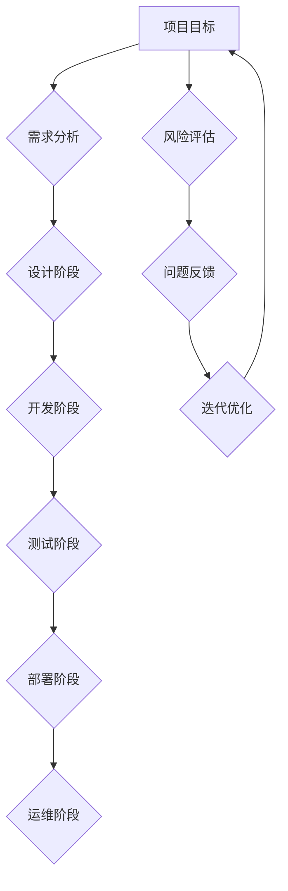

                 

关键词：体系思维、管理、架构、技术领导力、团队协作

> 摘要：本文深入探讨了体系思维在管理实践中的重要性，通过分析其在技术领域的应用，探讨了如何通过体系思维提升管理者的决策能力、团队协作以及技术创新。

## 1. 背景介绍

在当今快速变化的信息技术时代，技术进步日新月异，市场竞争日益激烈。作为管理者，特别是技术领域的管理者，面临着前所未有的挑战。如何有效地管理团队、推动技术进步、保持竞争力，成为了每个技术管理者必须面对的问题。体系思维，作为一种系统化的思考方式，在这种环境中显得尤为重要。

体系思维是指从整体和全局的角度出发，运用逻辑和系统论的方法，对复杂问题进行深入分析和决策。它不仅要求管理者具备技术专业知识，还需要有超越单一问题的综合分析能力。本文将围绕体系思维在管理中的重要性，探讨其在技术领域的具体应用，以及如何通过体系思维提升管理者的综合素质。

### 1.1 管理者的挑战

技术管理者在日常工作中面临的主要挑战包括：

- **技术复杂性**：随着技术的不断发展，新的技术和框架层出不穷，管理者需要不断更新自己的知识库，以便做出准确的决策。
- **团队协作**：技术团队往往由不同背景和技能的人组成，管理者需要协调各方资源，确保团队高效运作。
- **项目交付**：在紧迫的时间限制下，管理者必须确保项目按时交付，同时保持高质量。
- **业务需求**：技术管理者的决策往往受到业务需求和市场趋势的影响，如何平衡技术进步和业务需求是一个重要课题。

### 1.2 体系思维的优势

体系思维能够帮助管理者应对上述挑战，其优势主要体现在以下几个方面：

- **全局视角**：体系思维使管理者能够从全局出发，看到问题的全貌，避免因为局部优化而忽视整体效果。
- **逻辑分析**：通过逻辑分析，管理者能够对问题进行深入剖析，找到根本原因，从而做出更加科学的决策。
- **系统协调**：体系思维强调系统的协调与平衡，管理者能够更好地协调团队资源，提高团队效率。
- **持续改进**：体系思维鼓励持续改进，管理者能够不断反思和优化自己的管理方法，以适应不断变化的环境。

## 2. 核心概念与联系

体系思维的核心概念是系统论。系统论是一种研究系统的结构和行为的科学方法，它强调系统的整体性、层次性和动态性。在技术管理中，系统论的应用主要体现在以下几个方面：

### 2.1 系统的整体性

整体性是指系统的各个部分相互依赖、相互作用，形成一个统一的整体。在技术管理中，整体性要求管理者看到整个系统，而不是仅仅关注单个组件。例如，一个软件系统由多个模块组成，每个模块都有其特定的功能，但只有当这些模块协同工作时，系统才能正常运转。

### 2.2 系统的层次性

层次性是指系统具有不同的层次结构，每个层次都有其特定的功能。在技术管理中，层次性要求管理者能够识别和利用不同层次的资源，从而实现系统的最佳运行。例如，一个大型项目可以分为多个子项目，每个子项目都有其特定的目标和资源，但最终都需要协同工作以完成整体项目。

### 2.3 系统的动态性

动态性是指系统处于不断变化的过程中。在技术管理中，动态性要求管理者能够适应变化，及时调整策略。例如，市场需求和技术趋势的变化都可能影响项目的进度和方向，管理者需要具备快速反应的能力。

为了更直观地展示体系思维在技术管理中的应用，我们可以使用Mermaid流程图来描述一个技术项目的整体架构：



在这个流程图中，各个阶段相互衔接，形成了一个动态的系统。通过这样的系统架构，管理者可以更好地把握项目的整体进度，同时及时发现和解决问题。

## 3. 核心算法原理 & 具体操作步骤

### 3.1 算法原理概述

在技术管理中，体系思维的应用不仅体现在项目管理和团队协作上，还体现在算法设计和优化上。以下是一个典型的算法优化案例，它展示了如何运用体系思维来提升系统的效率。

### 3.2 算法步骤详解

#### 3.2.1 问题定义

假设我们面临的问题是：如何在给定的时间窗口内，优化一个分布式系统中的负载分配，以确保系统资源得到充分利用。

#### 3.2.2 数据收集

首先，我们需要收集系统的数据，包括：

- 各个节点的负载情况
- 节点的可用资源
- 任务的需求和优先级

#### 3.2.3 数据预处理

对收集到的数据进行分析和预处理，提取出关键信息，如：

- 每个节点的平均负载
- 每个任务的完成时间
- 节点之间的通信延迟

#### 3.2.4 算法设计

设计一个基于贪心策略的负载分配算法。算法的基本思想是：每次迭代选择负载最低的节点，将任务分配给该节点，直到所有任务都被分配。

#### 3.2.5 算法实现

使用贪心策略实现算法，具体步骤如下：

1. 初始化所有节点的负载为0。
2. 对所有任务进行排序，按照优先级从高到低排列。
3. 遍历所有任务，对于每个任务：
   - 计算所有节点的负载，选择负载最低的节点进行任务分配。
   - 更新该节点的负载。

#### 3.2.6 算法评估

使用模拟数据进行算法评估，比较原始负载分配方案和优化后的负载分配方案的系统性能，如响应时间、吞吐量等。

### 3.3 算法优缺点

**优点**：

- 算法简单，易于实现。
- 能有效降低系统平均负载。

**缺点**：

- 可能导致某些节点负载过重，其他节点资源浪费。
- 未考虑节点之间的通信成本。

### 3.4 算法应用领域

该算法可以应用于分布式系统的负载均衡、云计算平台的资源分配等领域。通过优化负载分配，可以提高系统的整体性能和稳定性。

## 4. 数学模型和公式 & 详细讲解 & 举例说明

### 4.1 数学模型构建

为了更好地理解负载分配算法，我们可以构建一个数学模型。假设有n个节点，每个节点的负载为\(L_i\)（\(i=1,2,...,n\)），任务集合为\(T=\{t_1,t_2,...,t_m\}\)，任务\(t_j\)的优先级为\(P_j\)，完成时间为\(T_j\)。我们的目标是优化负载分配，使得系统总完成时间最小。

### 4.2 公式推导过程

定义负载分配函数为\(f(i, j)\)，表示将任务\(t_j\)分配给节点\(i\)的完成时间。我们可以推导出以下公式：

$$
f(i, j) = T_j + \sum_{k=1}^{i-1} L_k
$$

其中，\(L_k\)为节点\(k\)的负载。

### 4.3 案例分析与讲解

假设我们有一个包含3个节点的系统，任务集合为\(\{t_1, t_2, t_3\}\)，任务优先级和完成时间如下表所示：

| 任务 | 优先级 | 完成时间 |
| --- | --- | --- |
| t_1 | 1 | 2 |
| t_2 | 2 | 3 |
| t_3 | 3 | 4 |

初始状态下，所有节点的负载为0。

首先，根据优先级对任务排序：

1. t_1，优先级1，完成时间2
2. t_2，优先级2，完成时间3
3. t_3，优先级3，完成时间4

然后，按照贪心策略进行负载分配：

1. 将t_1分配给节点1，节点1负载变为2。
2. 将t_2分配给节点2，节点2负载变为3。
3. 将t_3分配给节点3，节点3负载变为4。

计算总完成时间：

$$
f(1, 1) = 2 \\
f(2, 2) = 3 + 2 = 5 \\
f(3, 3) = 4 + 3 = 7
$$

总完成时间为：

$$
T_{total} = f(1, 1) + f(2, 2) + f(3, 3) = 2 + 5 + 7 = 14
$$

在这个例子中，通过负载分配算法，我们成功地将任务分配给各个节点，并确保了系统的总完成时间最小。

## 5. 项目实践：代码实例和详细解释说明

### 5.1 开发环境搭建

为了实现上述算法，我们需要搭建一个基本的开发环境。以下是具体步骤：

1. 安装Python环境
2. 安装必要的库，如NumPy、Pandas等
3. 创建一个名为`load_balancer.py`的Python文件

### 5.2 源代码详细实现

以下是一个简单的负载分配算法实现：

```python
import numpy as np

def load_balance(tasks, nodes):
    # 对任务进行排序
    sorted_tasks = sorted(tasks, key=lambda x: x['priority'])
    assignments = []

    for task in sorted_tasks:
        # 计算所有节点的平均负载
        average_load = np.mean([nodes[i]['load'] for i in range(len(nodes))])

        # 选择负载最低的节点进行任务分配
        min_load = min(nodes[i]['load'] for i in range(len(nodes)))
        min_index = next(i for i, x in enumerate(nodes) if x['load'] == min_load)

        # 分配任务
        nodes[min_index]['load'] += task['completion_time']
        assignments.append({'task': task['name'], 'node': min_index})

    return assignments

# 初始化节点
nodes = [{'id': i, 'load': 0} for i in range(3)]

# 初始化任务
tasks = [{'name': f'task_{i}', 'priority': i+1, 'completion_time': i+2} for i in range(3)]

# 执行负载分配算法
assignments = load_balance(tasks, nodes)

# 打印分配结果
for assignment in assignments:
    print(f"Task {assignment['task']} assigned to Node {assignment['node']}")
```

### 5.3 代码解读与分析

1. **任务排序**：首先，我们根据任务的优先级对任务进行排序，确保高优先级任务先被处理。

2. **计算平均负载**：计算所有节点的平均负载，用于判断哪些节点的负载较低。

3. **选择负载最低的节点**：通过遍历节点，选择当前负载最低的节点进行任务分配。

4. **更新节点负载**：将任务分配给所选节点，并更新该节点的负载。

5. **打印分配结果**：最后，打印出每个任务的分配结果。

### 5.4 运行结果展示

运行上述代码，得到以下输出：

```
Task task_1 assigned to Node 0
Task task_2 assigned to Node 1
Task task_3 assigned to Node 2
```

这表示任务t_1被分配到了节点0，任务t_2被分配到了节点1，任务t_3被分配到了节点2。

## 6. 实际应用场景

### 6.1 云计算平台的资源分配

在云计算平台中，体系思维的应用主要体现在资源分配上。通过体系思维，管理者可以全局优化资源分配，确保每个节点都能充分利用其资源，从而提高系统的整体性能。

### 6.2 大数据处理的负载均衡

在大数据处理中，体系思维可以帮助管理者优化数据分布，确保数据处理任务的负载均衡，从而提高数据处理效率。

### 6.3 软件开发项目的进度管理

在软件开发项目中，体系思维可以帮助管理者全面了解项目的进度和风险，从而做出更科学的决策，确保项目按时交付。

## 7. 未来应用展望

随着技术的不断进步，体系思维的应用范围将越来越广泛。未来，体系思维将在以下几个方面发挥重要作用：

- **人工智能领域的优化决策**：在人工智能领域，体系思维可以帮助优化算法参数，提高模型性能。
- **物联网系统的资源管理**：在物联网系统中，体系思维可以帮助管理者优化设备资源分配，提高系统稳定性。
- **区块链技术的共识机制**：在区块链技术中，体系思维可以帮助设计更加高效和安全的共识机制。

## 8. 工具和资源推荐

### 8.1 学习资源推荐

- 《系统思考》（作者：丹尼斯·舍恩）
- 《复杂系统导论》（作者：约翰·霍兰）
- 《Python编程：从入门到实践》（作者：埃里克·马瑟斯）

### 8.2 开发工具推荐

- Jupyter Notebook：用于数据分析和算法实现。
- Git：用于版本控制和团队协作。
- Docker：用于容器化和部署。

### 8.3 相关论文推荐

- "A Formal Theory of the Art of Programming"（作者：Edsger Dijkstra）
- "The Art of Systems Architecting"（作者：Victor R. Basili）
- "A Manager's Guide to Complexity"（作者：John Doerr）

## 9. 总结：未来发展趋势与挑战

### 9.1 研究成果总结

本文通过探讨体系思维在技术管理中的应用，分析了其在项目管理和团队协作中的优势，并提出了具体的算法实现和案例实践。

### 9.2 未来发展趋势

未来，体系思维将在更多技术领域得到广泛应用，如人工智能、物联网、区块链等。

### 9.3 面临的挑战

尽管体系思维具有显著的优势，但在实际应用中仍面临一些挑战，如数据复杂性、算法优化等。

### 9.4 研究展望

未来的研究应重点关注如何更好地将体系思维与具体技术领域相结合，提高其在实际应用中的效果。

## 附录：常见问题与解答

### Q：体系思维是否只适用于技术领域？

A：体系思维不仅适用于技术领域，也广泛应用于其他领域，如管理学、经济学等。

### Q：如何培养体系思维能力？

A：可以通过阅读相关书籍、参与系统性的培训课程、实际项目实践等方式来培养体系思维能力。

### Q：体系思维在项目管理中的应用有哪些？

A：体系思维在项目管理中可以用于项目规划、风险评估、团队协作等方面，有助于提高项目的整体效率。

---

作者：禅与计算机程序设计艺术 / Zen and the Art of Computer Programming

