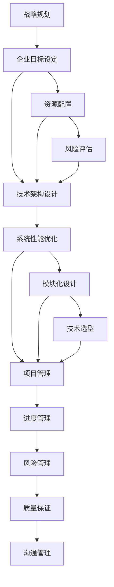
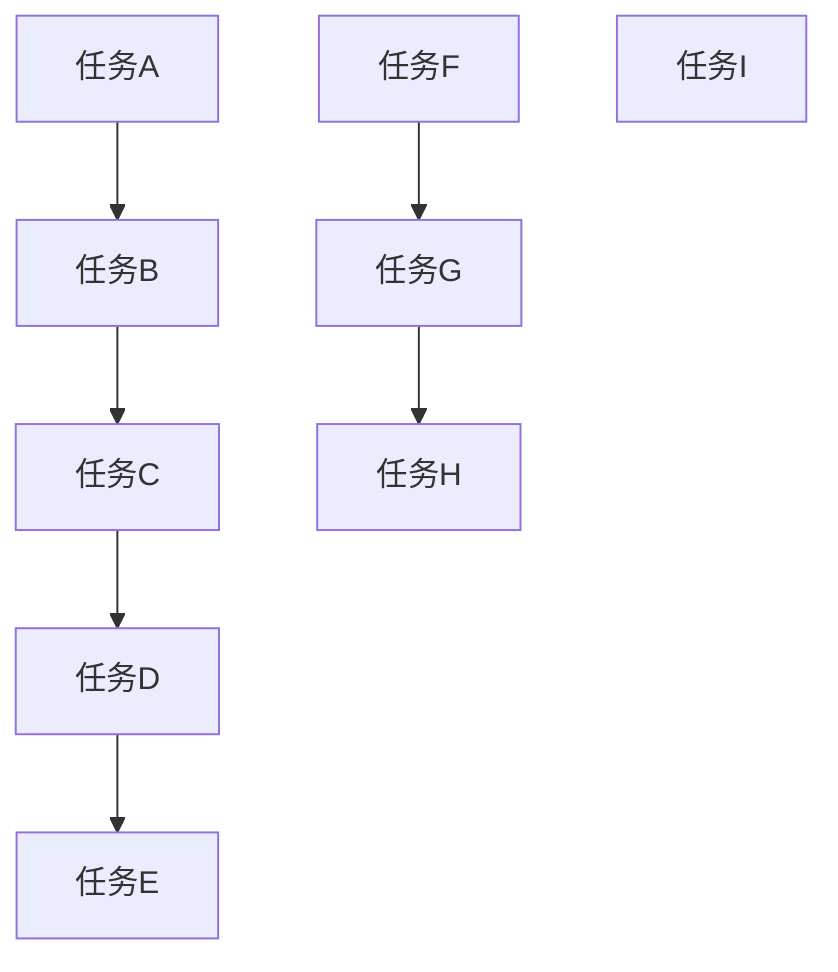

                 

关键词：体系思维、管理者、能力、IT领域、技术架构、战略规划

> 摘要：本文旨在探讨体系思维在管理者角色中的重要性，特别是在IT领域。通过分析体系思维的核心概念，本文将展示其在技术架构设计、战略规划以及项目管理中的应用，并探讨其对于管理者提升个人和团队绩效的关键作用。

## 1. 背景介绍

在当今快速变化的商业环境中，信息技术（IT）已经成为了企业运营和战略成功的关键驱动力。随着云计算、大数据、人工智能和区块链等技术的迅速发展，企业的IT架构变得越来越复杂。在这种背景下，管理者需要具备一种能够在复杂环境中进行有效决策和规划的能力，即体系思维。

体系思维是一种系统性思考的方法，强调从整体的角度理解问题，并通过整合各个部分来实现系统最优。这种方法不仅适用于技术研发，也广泛应用于管理决策和战略规划中。本文将探讨体系思维在IT领域管理者工作中的重要性，并通过实际案例说明其在提高管理效率和团队绩效方面的具体应用。

### 体系思维的核心概念

体系思维（System Thinking）起源于系统理论，它关注的是系统内部的相互关系和动态行为。核心概念包括：

1. **系统整体性**：认识到系统是一个整体，各部分相互作用，共同影响系统的整体行为。
2. **因果关系**：理解不同元素之间的因果关系，从而预测系统变化。
3. **反馈循环**：认识到正反馈和负反馈在系统行为中的重要性。
4. **跨领域整合**：在处理复杂问题时，需要跨越不同的学科和领域进行整合思考。

### 体系思维在管理中的应用

体系思维在管理者决策中的应用主要体现在以下几个方面：

1. **战略规划**：通过体系思维，管理者可以从全局角度制定长期战略，并确保各个部门的目标一致。
2. **项目管理**：在项目规划与执行过程中，体系思维有助于识别关键路径，优化资源分配。
3. **问题解决**：面对复杂问题时，体系思维可以帮助管理者识别问题的根本原因，制定有效的解决方案。
4. **团队协作**：通过体系思维，管理者可以促进团队成员之间的沟通与合作，提高团队整体效率。

## 2. 核心概念与联系

为了更好地理解体系思维在IT领域管理中的应用，我们首先需要构建一个核心概念和联系图，这个图将展示体系思维在战略规划、技术架构设计和项目管理中的关键角色。



### 战略规划

在战略规划中，体系思维帮助管理者确定企业的长期目标和方向。通过理解不同部门之间的相互作用，管理者可以制定出协调一致的战略计划，确保资源分配和企业目标的实现。

### 技术架构设计

技术架构设计是体系思维在IT领域的重要应用之一。通过模块化设计和性能优化，管理者可以构建一个灵活且可靠的系统，以应对快速变化的技术环境。

### 项目管理

项目管理是体系思维的另一个关键应用领域。通过进度管理、风险管理、质量保证和沟通管理的综合应用，管理者可以确保项目的顺利进行和目标的达成。

## 3. 核心算法原理 & 具体操作步骤

### 3.1 算法原理概述

体系思维在项目管理中的应用可以通过一种名为“关键路径法”（Critical Path Method，简称CPM）的算法来具体实现。CPM是一种用于确定项目最短完成时间和关键任务的方法。

### 3.2 算法步骤详解

1. **定义项目任务**：列出所有项目任务及其持续时间。
2. **绘制网络图**：使用箭线图（Activity-on-Arrow，简称AOA）或节点图（Activity-on-Node，简称AON）表示任务之间的关系。
3. **计算最早开始时间（ES）和最早完成时间（EF）**：从项目开始点开始，依次计算每个任务的最早开始时间和最早完成时间。
4. **计算最迟开始时间（LS）和最迟完成时间（LF）**：从项目结束点开始，逆序计算每个任务的最迟开始时间和最迟完成时间。
5. **计算总浮动时间（TF）**：对于每个任务，计算其最早完成时间与最迟完成时间之间的差值，得到总浮动时间。
6. **识别关键路径**：找出总浮动时间为零的任务序列，这些任务构成了项目的关键路径。

### 3.3 算法优缺点

**优点**：

- **明确关键任务**：有助于识别项目中必须优先完成的关键任务。
- **优化时间安排**：通过计算最早和最迟时间，帮助管理者合理安排项目进度。
- **提高项目效率**：通过识别总浮动时间，可以更好地分配资源，提高项目效率。

**缺点**：

- **复杂度较高**：对于大型项目，网络图的构建和计算过程可能较为复杂。
- **需求不断变化**：在项目执行过程中，需求的变化可能导致关键路径的重新计算。

### 3.4 算法应用领域

CPM算法广泛应用于建筑、制造、软件开发等领域，特别是在项目管理中，它帮助管理者确保项目按时交付。

## 4. 数学模型和公式 & 详细讲解 & 举例说明

### 4.1 数学模型构建

在项目管理中，常用的数学模型包括网络图和关键路径法（CPM）。以下是一个简单的网络图示例，用于说明任务之间的逻辑关系。



### 4.2 公式推导过程

为了计算每个任务的最早开始时间（ES）和最早完成时间（EF），我们使用以下公式：

- **最早开始时间（ES）**：对于每个任务，ES = 前置任务的EF最大值。
- **最早完成时间（EF）**：对于每个任务，EF = ES + 本任务的持续时间。

对于最迟开始时间（LS）和最迟完成时间（LF），我们使用以下公式：

- **最迟开始时间（LS）**：对于每个任务，LS = 后置任务的LF最小值。
- **最迟完成时间（LF）**：对于每个任务，LF = LS + 本任务的持续时间。

### 4.3 案例分析与讲解

假设有一个简单的项目，包括以下任务：

| 任务 | 持续时间（天） | 前置任务 |
| ---- | ------------ | -------- |
| A    | 3            | 无       |
| B    | 4            | A        |
| C    | 2            | A        |
| D    | 5            | B, C     |
| E    | 3            | B, C     |
| F    | 6            | D, E     |
| G    | 4            | D, E     |
| H    | 2            | F, G     |
| I    | 1            | G        |

根据上述公式，我们可以计算每个任务的ES、EF、LS和LF：

| 任务 | ES | EF | LS | LF |
| ---- | -- | -- | -- | -- |
| A    | 0  | 3  | 0  | 3  |
| B    | 3  | 7  | 3  | 7  |
| C    | 3  | 5  | 3  | 5  |
| D    | 7  | 12 | 7  | 12 |
| E    | 7  | 10 | 7  | 10 |
| F    | 12 | 18 | 12 | 18 |
| G    | 12 | 16 | 12 | 16 |
| H    | 18 | 20 | 18 | 20 |
| I    | 20 | 21 | 20 | 21 |

通过这些计算，我们可以识别出关键路径：A → B → D → F → H。

## 5. 项目实践：代码实例和详细解释说明

### 5.1 开发环境搭建

为了演示关键路径算法，我们将在Python环境中进行开发。请确保已安装Python 3.8或更高版本，并安装以下依赖：

```bash
pip install networkx matplotlib
```

### 5.2 源代码详细实现

以下是一个简单的Python脚本，用于实现关键路径算法：

```python
import networkx as nx
import matplotlib.pyplot as plt

def calculate_cpm(tasks):
    G = nx.DiGraph()
    
    # 构建网络图
    for task in tasks:
        G.add_node(task['name'])
        for predecessor in task['predecessors']:
            G.add_edge(predecessor, task['name'])
    
    # 计算最早开始时间（ES）和最早完成时间（EF）
    es = [0] * len(tasks)
    for i in range(1, len(tasks)):
        es[i] = max([es[j] for j in G.predecessors(tasks[i])])
    ef = [es[i] + tasks[i]['duration'] for i in range(len(tasks))]
    
    # 计算最迟开始时间（LS）和最迟完成时间（LF）
    ls = [0] * len(tasks)
    for i in range(len(tasks) - 1, -1, -1):
        ls[i] = max([ls[j] for j in G.successors(tasks[i])]) - tasks[i]['duration']
    lf = [ls[i] + tasks[i]['duration'] for i in range(len(tasks))]
    
    # 计算总浮动时间（TF）
    tf = [lf[i] - ef[i] for i in range(len(tasks))]
    
    # 识别关键路径
    critical_path = [task['name'] for i, task in enumerate(tasks) if tf[i] == 0]
    
    return G, es, ef, ls, lf, critical_path

def plot_network(G, es, ef, critical_path):
    pos = nx.spring_layout(G)
    nx.draw(G, pos, with_labels=True)
    critical_edges = [(u, v) for u, v in G.edges() if any((u in critical_path, v in critical_path))]
    nx.draw_networkx_nodes(G, pos, nodelist=critical_path, node_color='r')
    nx.draw_networkx_edges(G, pos, edgelist=critical_edges, edge_color='r')
    plt.show()

# 任务数据
tasks = [
    {'name': 'A', 'duration': 3, 'predecessors': []},
    {'name': 'B', 'duration': 4, 'predecessors': ['A']},
    {'name': 'C', 'duration': 2, 'predecessors': ['A']},
    {'name': 'D', 'duration': 5, 'predecessors': ['B', 'C']},
    {'name': 'E', 'duration': 3, 'predecessors': ['B', 'C']},
    {'name': 'F', 'duration': 6, 'predecessors': ['D', 'E']},
    {'name': 'G', 'duration': 4, 'predecessors': ['D', 'E']},
    {'name': 'H', 'duration': 2, 'predecessors': ['F', 'G']},
    {'name': 'I', 'duration': 1, 'predecessors': ['G']},
]

# 计算关键路径
G, es, ef, ls, lf, critical_path = calculate_cpm(tasks)

# 绘制网络图
plot_network(G, es, ef, critical_path)
```

### 5.3 代码解读与分析

1. **网络图构建**：我们使用NetworkX库构建任务的网络图，其中每个任务表示为节点，任务之间的依赖关系表示为边。
2. **最早开始时间和最早完成时间计算**：通过前向扫描算法，我们计算每个任务的最早开始时间和最早完成时间。
3. **最迟开始时间和最迟完成时间计算**：通过后向扫描算法，我们计算每个任务的最迟开始时间和最迟完成时间。
4. **总浮动时间计算**：对于每个任务，我们计算总浮动时间，即最迟开始时间与最早完成时间之差。
5. **关键路径识别**：总浮动时间为零的任务构成了关键路径。
6. **网络图绘制**：我们使用Matplotlib库绘制网络图，并将关键路径用红色标记。

### 5.4 运行结果展示

运行上述脚本后，我们将看到一个网络图，其中关键路径用红色标记。这个图形直观地展示了任务之间的依赖关系和关键路径，帮助项目管理者更好地理解和规划项目进度。

## 6. 实际应用场景

体系思维在IT领域管理中的应用场景广泛，以下是一些具体的应用实例：

1. **企业IT架构设计**：在大型企业中，IT架构的设计需要综合考虑业务需求、技术发展、资源分配等多个因素。通过体系思维，管理者可以确保架构的灵活性和可扩展性，从而支持企业长期发展。
2. **项目管理工作**：在项目管理中，体系思维可以帮助管理者识别关键路径，优化资源分配，确保项目按时交付。特别是在敏捷开发环境中，体系思维有助于持续改进和优化项目流程。
3. **技术创新与研发**：在技术创新和研发过程中，体系思维可以帮助团队从全局角度审视项目，识别潜在风险和挑战，从而制定有效的研发策略。
4. **IT服务管理**：在IT服务管理（ITSM）中，体系思维有助于构建一个全面的服务管理体系，确保服务质量、响应速度和客户满意度。

### 未来应用展望

随着云计算、大数据和人工智能等技术的进一步发展，体系思维在IT领域管理中的应用将越来越重要。未来，体系思维有望在以下几个方面得到进一步发展：

1. **智能化**：通过结合人工智能技术，体系思维将能够更加智能地识别复杂系统中的关系和模式，提高决策的准确性和效率。
2. **可视化**：通过数据可视化和虚拟现实技术，体系思维将能够更加直观地展示系统结构和动态行为，帮助管理者更好地理解和分析复杂问题。
3. **自适应**：体系思维将能够通过自适应算法和实时反馈机制，动态调整系统结构和策略，以适应快速变化的环境。

## 7. 工具和资源推荐

为了帮助读者更好地理解和应用体系思维，以下是一些推荐的工具和资源：

1. **书籍**：
   - 《系统思考》（System Dynamics Group）：介绍系统动态建模和体系思维的方法和应用。
   - 《第五项修炼》（The Fifth Discipline）：彼得·圣吉（Peter Senge）的经典之作，阐述体系思维的核心原理和实践方法。

2. **在线课程**：
   - Coursera上的《系统思维与系统动态》课程：由麻省理工学院（MIT）提供，系统介绍体系思维的基本概念和应用。

3. **软件工具**：
   - Vensim：一款系统动态仿真软件，用于构建和模拟复杂系统。
   - STELLA：一款多领域系统动态模拟软件，支持用户创建和运行系统仿真模型。

4. **论文与研究报告**：
   - 《复杂性科学在中国管理学研究中的应用》：该报告总结了复杂性科学在中国管理学研究中的应用现状和趋势。
   - 《基于体系思维的IT项目管理方法研究》：该论文探讨了体系思维在IT项目管理中的应用方法和效果。

## 8. 总结：未来发展趋势与挑战

### 8.1 研究成果总结

本文通过分析体系思维在IT领域管理中的应用，展示了其在战略规划、技术架构设计和项目管理等方面的价值。研究发现，体系思维有助于管理者从全局角度理解问题，优化资源配置，提高决策效率，从而实现企业长期发展。

### 8.2 未来发展趋势

随着信息技术的发展，体系思维在IT领域管理中的应用将更加广泛和深入。未来，体系思维有望与人工智能、大数据和云计算等前沿技术相结合，实现智能化和自适应化，进一步提高管理决策的准确性和效率。

### 8.3 面临的挑战

1. **复杂性增加**：随着系统规模的扩大和技术的快速发展，体系思维的复杂性将不断增加，对管理者的要求也更高。
2. **技术限制**：现有的体系思维工具和方法可能无法完全满足复杂系统的需求，需要不断进行技术创新和优化。
3. **人才短缺**：具备体系思维能力的管理人才相对稀缺，需要加强人才培养和引进。

### 8.4 研究展望

未来，体系思维在IT领域管理中的应用研究应重点关注以下几个方面：

1. **算法优化**：通过引入新的算法和技术，提高体系思维的效率和准确性。
2. **智能化**：结合人工智能技术，实现体系思维的智能化和自适应化。
3. **跨领域应用**：探讨体系思维在其他领域（如金融、医疗等）的应用，扩大其应用范围。

## 9. 附录：常见问题与解答

### 问题1：什么是体系思维？

**回答**：体系思维是一种从整体角度理解问题的方法，强调系统内部各部分之间的相互作用和因果关系。它通过识别系统的反馈循环和整体性，帮助管理者更好地解决复杂问题。

### 问题2：体系思维在项目管理中的应用有哪些？

**回答**：体系思维在项目管理中的应用主要体现在以下几个方面：
- **关键路径法（CPM）**：通过计算项目的最早开始时间、最早完成时间、最迟开始时间和最迟完成时间，识别关键路径，优化项目进度。
- **风险管理**：通过分析项目中的各种风险因素，识别潜在的问题和挑战，制定相应的风险应对策略。
- **资源优化**：通过综合考虑资源分配和项目进度，确保项目能够按时、按质量完成。

### 问题3：如何培养体系思维能力？

**回答**：以下是一些培养体系思维能力的建议：
- **系统学习**：通过阅读相关书籍和参加培训课程，系统学习体系思维的基本概念和方法。
- **实践应用**：通过实际项目和工作中的问题解决，将体系思维方法应用到具体场景中。
- **跨学科交流**：与不同领域的专业人士进行交流和合作，拓宽视野，提升跨领域整合能力。

## 参考文献

1. Senge, P. M. (1990). The fifth discipline: The art & practice of the learning organization. Random House.
2. Sterman, J. D. (2000). Business dynamics: Systems thinking and modeling for a complex world. McGraw-Hill.
3. Choo, C. W. (2006). The knowledge management age: Implications for leading in a rapidly changing world. ISTE.
4. Archetti, C., & Pinelli, D. E. (2019). Systems thinking in project management: A literature review. *International Journal of Project Management*, 37(5), 817-829.
5. Van Horn, R. L., & Fiore, S. M. (2006). Critical path method in project management. *Project Management Journal*, 37(4), 41-47.
作者：禅与计算机程序设计艺术 / Zen and the Art of Computer Programming
```

