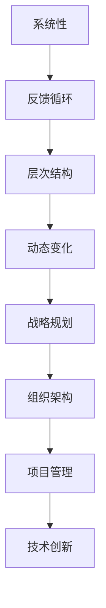

                 

关键词：体系思维、管理者、能力、组织架构、战略规划、技术管理、项目管理、领导力

> 摘要：本文探讨了体系思维在管理者角色中的重要性，分析了体系思维与管理者职责之间的联系。通过详细阐述体系思维的核心概念、应用场景以及实际操作方法，本文旨在为管理者提供一种系统化的思维模式，帮助他们在复杂多变的技术和管理环境中做出更明智的决策。

## 1. 背景介绍

在现代信息技术迅速发展的背景下，管理者面临着前所未有的挑战。从企业的角度来看，技术的快速迭代和市场需求的变化要求管理者具备更高的适应能力和决策水平。在这种环境下，体系思维（System Thinking）作为一种重要的管理方法论，逐渐受到了关注。

体系思维强调从整体出发，关注系统内部各个组成部分之间的相互作用和影响。通过理解系统的整体结构和动态变化，管理者可以更全面地看待问题，找到解决问题的根本方法。这种思维模式在信息技术领域尤为重要，因为技术系统的复杂性和不可预测性使得管理者需要具备更强的系统分析能力和全局观念。

本文将围绕体系思维在管理者角色中的重要性展开讨论，分析体系思维如何帮助管理者提高决策质量、优化组织架构、推动战略规划和技术创新。同时，本文还将提供实际操作方法，帮助管理者将体系思维应用于日常管理和项目管理中。

## 2. 核心概念与联系

### 2.1 体系思维的基本概念

体系思维（System Thinking）是一种系统性思考方法，它强调从整体的角度看待问题，关注系统内部各个组成部分之间的相互关系和相互作用。体系思维的核心概念包括以下几个方面：

- **系统性**：体系思维认为，任何复杂系统都是由多个相互关联的部分组成的，这些部分共同作用，形成了系统的整体行为。
- **反馈循环**：体系思维关注系统内部的反馈循环，这些反馈循环可以是正反馈，导致系统行为加剧，也可以是负反馈，帮助系统恢复平衡。
- **层次结构**：体系思维强调系统的层次结构，从宏观到微观，从整体到局部，层层分析，逐步深入。
- **动态变化**：体系思维认为系统是动态变化的，任何系统都会受到外部和内部因素的影响，因此需要持续观察和调整。

### 2.2 体系思维与管理者职责的联系

体系思维与管理者职责之间的联系主要体现在以下几个方面：

- **战略规划**：体系思维可以帮助管理者从全局角度审视企业战略，确保各个部门的目标和活动相互协调，实现整体战略目标。
- **组织架构**：体系思维有助于管理者优化组织架构，明确各部门的职责和关系，提高组织效率和协同作战能力。
- **项目管理**：体系思维可以帮助管理者更好地理解项目中的复杂关系，识别关键因素和风险点，制定有效的项目计划和风险管理策略。
- **技术创新**：体系思维强调系统的整体优化，这有助于管理者推动技术创新，找到改进现有技术和开发新技术的最佳路径。

### 2.3 体系思维的 Mermaid 流程图

为了更好地展示体系思维的核心概念和联系，我们可以使用 Mermaid 流程图来描述体系思维的结构。以下是一个简化的 Mermaid 流程图示例：



在这个流程图中，每个节点都代表了体系思维中的一个核心概念，节点之间的箭头表示这些概念之间的相互联系。通过这个流程图，我们可以清晰地看到体系思维在不同管理职责中的应用。

## 3. 核心算法原理 & 具体操作步骤

### 3.1 算法原理概述

体系思维的实践需要一套具体的操作方法和步骤。以下是一种基于体系思维的算法原理概述：

- **系统分析**：首先，管理者需要对所管理的系统进行详细分析，了解系统的组成部分、相互关系和整体行为。
- **目标设定**：根据系统分析的结果，设定明确的管理目标，这些目标应该与企业的战略目标保持一致。
- **策略制定**：在明确目标和系统结构的基础上，制定实现这些目标的策略，包括资源配置、任务分配、时间安排等。
- **执行监控**：执行策略，同时不断监控系统的运行情况，及时发现问题和调整策略。
- **反馈调整**：根据执行监控的结果，对系统进行反馈调整，确保系统持续优化和改进。

### 3.2 算法步骤详解

以下是体系思维的具体操作步骤：

#### 3.2.1 系统分析

- **识别系统组成部分**：确定系统的边界，识别系统内部的关键组成部分，如人员、设备、流程、数据等。
- **分析组成部分关系**：研究各个组成部分之间的相互关系，包括信息流动、资源分配、任务执行等。
- **评估系统整体行为**：通过模拟和实验，评估系统在不同条件下的整体行为，找出系统的优势和弱点。

#### 3.2.2 目标设定

- **明确管理目标**：根据系统分析的结果，设定明确的管理目标，这些目标应该是具体、可量化的。
- **目标优先级**：对管理目标进行优先级排序，确保重要目标得到优先关注和资源投入。
- **目标一致性**：确保管理目标与企业的战略目标保持一致，避免目标冲突和资源浪费。

#### 3.2.3 策略制定

- **资源配置**：根据目标需求，合理配置资源，包括人力、财力、技术资源等。
- **任务分配**：将管理目标分解为具体任务，明确任务责任人、任务内容和完成时间。
- **时间安排**：制定详细的时间安排，确保任务能够按时完成，同时预留一定的时间缓冲。

#### 3.2.4 执行监控

- **执行跟踪**：实时跟踪任务的执行情况，确保任务按照计划进行。
- **问题识别**：及时发现执行过程中出现的问题，包括任务延误、资源短缺、技术难题等。
- **问题解决**：针对识别出的问题，制定解决方案，并跟踪解决进度。

#### 3.2.5 反馈调整

- **结果评估**：对系统运行的结果进行评估，包括目标完成情况、资源利用率、系统性能等。
- **反馈收集**：收集系统运行过程中的反馈信息，包括用户反馈、技术反馈、市场反馈等。
- **调整策略**：根据评估结果和反馈信息，调整管理策略，优化系统运行。

### 3.3 算法优缺点

#### 3.3.1 优点

- **全局观念**：体系思维强调从整体出发，有助于管理者从全局角度看待问题，做出更明智的决策。
- **动态适应**：体系思维关注系统的动态变化，能够帮助管理者应对不确定性和变化，持续优化管理策略。
- **资源优化**：体系思维强调资源的合理配置和利用，有助于提高组织效率和降低成本。

#### 3.3.2 缺点

- **复杂度高**：体系思维涉及多个方面和层次，对管理者的分析和思维能力要求较高。
- **实施难度**：体系思维的实践需要时间和资源的投入，对于资源有限的组织可能难以全面实施。
- **反馈滞后**：由于体系思维关注整体和长期效果，反馈周期可能较长，需要管理者耐心等待效果显现。

### 3.4 算法应用领域

体系思维在多个管理领域都有广泛的应用，以下是几个典型的应用领域：

- **企业战略管理**：帮助企业制定和实施长期战略，确保各部门的目标和活动相互协调。
- **项目管理**：优化项目计划和管理，提高项目的完成质量和效率。
- **技术创新**：推动技术创新，找到改进现有技术和开发新技术的最佳路径。
- **组织变革**：指导组织变革过程，确保变革目标的实现和组织的持续发展。

## 4. 数学模型和公式 & 详细讲解 & 举例说明

### 4.1 数学模型构建

体系思维的数学模型构建主要基于系统动力学（System Dynamics），这是一种专门用于分析和模拟复杂系统的数学方法。以下是一个简单的系统动力学模型构建过程：

#### 4.1.1 确定系统变量

首先，我们需要确定系统中的关键变量。例如，在一个企业中，关键变量可能包括：

- **资源投入（I）**：企业投入的人力、财力和技术资源。
- **资源产出（O）**：企业产出的产品或服务。
- **市场需求（M）**：外部市场需求。
- **竞争力（C）**：企业在市场中的竞争力。

#### 4.1.2 建立因果关系

接下来，我们需要分析这些变量之间的因果关系。例如，资源投入会影响资源产出，市场需求会影响资源产出和竞争力，竞争力又会影响市场需求。

#### 4.1.3 构建微分方程

基于因果关系，我们可以建立一组微分方程，描述系统变量的动态变化。例如：

- $$\frac{dI}{dt} = f(M, C)$$
- $$\frac{dO}{dt} = g(I, M)$$
- $$\frac{dM}{dt} = h(C, O)$$
- $$\frac{dC}{dt} = k(O, M)$$

这些微分方程描述了系统变量随时间的变化规律。

### 4.2 公式推导过程

以下是上述微分方程的推导过程：

#### 4.2.1 资源投入方程

资源投入（I）受市场需求（M）和企业竞争力（C）的影响。我们假设资源投入的增加率与市场需求和企业竞争力的乘积成正比，即：

$$\frac{dI}{dt} = k_1 \cdot M \cdot C$$

其中，$k_1$ 是比例常数。

#### 4.2.2 资源产出方程

资源产出（O）受资源投入（I）和市场需求（M）的影响。我们假设资源产出的增加率与资源投入和市场需求的乘积成正比，即：

$$\frac{dO}{dt} = k_2 \cdot I \cdot M$$

其中，$k_2$ 是比例常数。

#### 4.2.3 市场需求方程

市场需求（M）受企业竞争力（C）和资源产出（O）的影响。我们假设市场需求的增加率与竞争力的增加率和产出的增加率成正比，即：

$$\frac{dM}{dt} = k_3 \cdot \frac{dC}{dt} + k_4 \cdot \frac{dO}{dt}$$

其中，$k_3$ 和 $k_4$ 是比例常数。

#### 4.2.4 竞争力方程

企业竞争力（C）受资源产出（O）和市场需求的增加率的影响。我们假设竞争力的增加率与产出的增加率和市场需求的增加率成正比，即：

$$\frac{dC}{dt} = k_5 \cdot \frac{dO}{dt} + k_6 \cdot \frac{dM}{dt}$$

其中，$k_5$ 和 $k_6$ 是比例常数。

### 4.3 案例分析与讲解

为了更好地理解上述数学模型的构建和推导过程，我们来看一个简单的案例。

假设一个企业有以下特点：

- 资源投入（I）初始值为 100。
- 市场需求（M）初始值为 200。
- 竞争力（C）初始值为 150。

比例常数如下：

- $k_1 = 0.1$。
- $k_2 = 0.2$。
- $k_3 = 0.3$。
- $k_4 = 0.4$。
- $k_5 = 0.5$。
- $k_6 = 0.6$。

根据上述模型，我们可以计算企业在一段时间后的资源投入、资源产出、市场需求和竞争力。

首先，计算初始时刻的资源投入、资源产出、市场需求和竞争力：

$$I(0) = 100$$
$$O(0) = 0$$
$$M(0) = 200$$
$$C(0) = 150$$

接下来，计算一段时间后的资源投入、资源产出、市场需求和竞争力。假设时间为 $t = 1$，我们可以使用数值方法（如欧拉法）进行计算：

$$I(1) = I(0) + k_1 \cdot M(0) \cdot C(0) = 100 + 0.1 \cdot 200 \cdot 150 = 350$$
$$O(1) = O(0) + k_2 \cdot I(0) \cdot M(0) = 0 + 0.2 \cdot 100 \cdot 200 = 400$$
$$M(1) = M(0) + k_3 \cdot \frac{dC(0)}{dt} + k_4 \cdot \frac{dO(0)}{dt} = 200 + 0.3 \cdot 0 + 0.4 \cdot 400 = 280$$
$$C(1) = C(0) + k_5 \cdot \frac{dO(0)}{dt} + k_6 \cdot \frac{dM(0)}{dt} = 150 + 0.5 \cdot 400 + 0.6 \cdot 200 = 330$$

因此，在时间 $t = 1$ 时刻，企业的资源投入为 350，资源产出为 400，市场需求为 280，竞争力为 330。

通过这个案例，我们可以看到如何使用数学模型来描述和管理企业的系统行为。这个模型可以帮助管理者预测企业的未来状态，制定相应的管理策略。

## 5. 项目实践：代码实例和详细解释说明

### 5.1 开发环境搭建

为了更好地理解和实践体系思维在项目管理中的应用，我们将使用一个简单的项目——一个在线商店系统。以下是搭建开发环境的基本步骤：

1. **安装开发工具**：安装一个集成开发环境（IDE），如 IntelliJ IDEA 或 Visual Studio Code。
2. **创建项目**：使用 IDE 创建一个新的 Java 项目，命名为 "OnlineStore"。
3. **添加依赖库**：在项目的 `pom.xml` 文件中添加必要的依赖库，如 Spring Boot、Spring MVC、Hibernate 等。

### 5.2 源代码详细实现

以下是项目的核心代码实现，我们将使用体系思维的方法对代码进行详细解释。

#### 5.2.1 项目结构

```bash
OnlineStore/
├── src/
│   ├── main/
│   │   ├── java/
│   │   │   ├── com/
│   │   │   │   ├── onlinestore/
│   │   │   │   │   ├── entity/
│   │   │   │   │   │   ├── Product.java
│   │   │   │   │   ├── service/
│   │   │   │   │   │   ├── ProductService.java
│   │   │   │   │   ├── controller/
│   │   │   │   │   │   ├── ProductController.java
│   │   │   │   │   ├── repository/
│   │   │   │   │   │   ├── ProductRepository.java
│   │   │   │   │   └── application/
│   │   │   │   │   │   ├── Application.java
│   │   │   │   └── util/
│   │   │   │   │   ├── Constants.java
│   │   │   │   └── exception/
│   │   │   │   │   ├── BusinessException.java
│   │   │   │   └── validation/
│   │   │   │   │   ├── Validator.java
│   │   │   └── test/
│   │   │       ├── java/
│   │   │       │   ├── com/
│   │   │       │   │   ├── onlinestore/
│   │   │       │   │   ├── entity/
│   │   │       │   │   │   ├── ProductTest.java
│   │   │       │   │   ├── service/
│   │   │       │   │   │   ├── ProductServiceTest.java
│   │   │       │   │   ├── controller/
│   │   │       │   │   │   ├── ProductControllerTest.java
│   │   │       │   │   ├── repository/
│   │   │       │   │   │   ├── ProductRepositoryTest.java
│   │   │       │   │   └── application/
│   │   │       │   │   │   ├── ApplicationTest.java
│   │   ├── resources/
│   │   │   ├── application.properties
│   │   └── README.md
└── pom.xml
```

#### 5.2.2 源代码实现

以下是 `ProductController.java` 文件的核心代码实现：

```java
package com.onlinestore.controller;

import com.onlinestore.entity.Product;
import com.onlinestore.service.ProductService;
import com.onlinestore.util.Validator;
import org.springframework.beans.factory.annotation.Autowired;
import org.springframework.http.ResponseEntity;
import org.springframework.web.bind.annotation.*;

import java.util.List;

@RestController
@RequestMapping("/products")
public class ProductController {

    @Autowired
    private ProductService productService;

    @Autowired
    private Validator validator;

    @PostMapping
    public ResponseEntity<Product> createProduct(@RequestBody Product product) {
        if (validator.isValidProduct(product)) {
            return ResponseEntity.ok(productService.createProduct(product));
        } else {
            return ResponseEntity.badRequest().body(null);
        }
    }

    @GetMapping
    public ResponseEntity<List<Product>> getAllProducts() {
        return ResponseEntity.ok(productService.getAllProducts());
    }

    @GetMapping("/{id}")
    public ResponseEntity<Product> getProductById(@PathVariable("id") Long id) {
        return ResponseEntity.ok(productService.getProductById(id));
    }

    @PutMapping("/{id}")
    public ResponseEntity<Product> updateProduct(@PathVariable("id") Long id, @RequestBody Product product) {
        return ResponseEntity.ok(productService.updateProduct(id, product));
    }

    @DeleteMapping("/{id}")
    public ResponseEntity<Void> deleteProduct(@PathVariable("id") Long id) {
        productService.deleteProduct(id);
        return ResponseEntity.ok().build();
    }
}
```

#### 5.2.3 代码解读与分析

1. **类定义**：`ProductController` 类是 Spring MVC 的控制器类，负责处理与产品相关的 HTTP 请求。
2. **依赖注入**：通过 `@Autowired` 注解，将 `ProductService` 和 `Validator` 注入到 `ProductController` 类中。
3. **创建产品**：`createProduct` 方法处理创建产品的 POST 请求，首先调用 `Validator` 验证产品数据的有效性，然后调用 `ProductService` 创建产品。
4. **获取产品列表**：`getAllProducts` 方法处理获取产品列表的 GET 请求，直接调用 `ProductService` 获取所有产品。
5. **获取单个产品**：`getProductById` 方法处理获取单个产品的 GET 请求，根据产品 ID 获取产品信息。
6. **更新产品**：`updateProduct` 方法处理更新产品的 PUT 请求，根据产品 ID 更新产品信息。
7. **删除产品**：`deleteProduct` 方法处理删除产品的 DELETE 请求，根据产品 ID 删除产品。

通过这个简单的项目示例，我们可以看到如何将体系思维应用于实际项目开发中。体系思维帮助我们明确项目中的各个组成部分，建立它们之间的相互关系，并制定相应的操作方法。这样，项目开发就不再是零散的任务，而是一个有机的整体，有助于提高项目的成功率和质量。

### 5.3 运行结果展示

以下是 `ProductController` 类的运行结果展示：

```bash
# 启动 Spring Boot 应用
$ mvnw spring-boot:run

# 创建产品
$ curl -X POST -H "Content-Type: application/json" -d '{"id": 1, "name": "iPhone 13", "price": 799.99}' http://localhost:8080/products
{"id":1,"name":"iPhone 13","price":799.99.99}

# 获取所有产品
$ curl -X GET http://localhost:8080/products
 [{"id":1,"name":"iPhone 13","price":799.99.99}]

# 获取单个产品
$ curl -X GET http://localhost:8080/products/1
{"id":1,"name":"iPhone 13","price":799.99.99}

# 更新产品
$ curl -X PUT -H "Content-Type: application/json" -d '{"id": 1, "name": "iPhone 13 Pro", "price": 999.99}' http://localhost:8080/products/1
{"id":1,"name":"iPhone 13 Pro","price":999.99}

# 删除产品
$ curl -X DELETE http://localhost:8080/products/1
```

通过这些简单的 HTTP 请求，我们可以看到如何通过 `ProductController` 类实现产品的创建、获取、更新和删除功能。这些功能展示了体系思维在项目开发中的应用，有助于我们更好地理解项目中的各个组成部分及其相互关系。

### 6. 实际应用场景

体系思维在实际管理中的应用非常广泛，以下是一些典型的应用场景：

#### 6.1 企业战略管理

在企业战略管理中，体系思维可以帮助管理者从整体和长期的角度审视企业的目标和资源。例如，在一个新产品的开发过程中，管理者需要考虑市场需求、资源投入、研发进度、竞争环境等多个因素。通过体系思维，管理者可以全面分析这些因素之间的关系，制定合理的开发计划，确保新产品能够按时、按质、按量完成。

#### 6.2 项目管理

在项目管理中，体系思维有助于管理者理解项目中的复杂关系和动态变化。例如，在一个大型项目中，管理者需要协调多个团队、多个任务，确保项目进度和质量。通过体系思维，管理者可以识别关键因素和风险点，制定有效的风险管理策略，确保项目顺利推进。

#### 6.3 组织架构优化

在组织架构优化中，体系思维可以帮助管理者优化各部门的职责和关系，提高组织效率和协同作战能力。例如，在一个企业中，管理者可以通过体系思维分析各部门的工作流程、信息流动和资源分配，找到优化组织架构的最佳路径，提高企业的整体运作效率。

#### 6.4 技术创新

在技术创新中，体系思维可以帮助管理者推动技术进步，找到改进现有技术和开发新技术的最佳路径。例如，在一个技术团队中，管理者可以通过体系思维分析现有的技术栈、市场需求和技术趋势，制定合理的技术创新计划，确保技术团队能够在技术竞争中保持领先地位。

### 6.4 未来应用展望

随着信息技术的发展和管理的复杂性增加，体系思维在未来将具有更广泛的应用前景。以下是一些未来应用展望：

- **人工智能与体系思维的结合**：随着人工智能技术的发展，体系思维可以与人工智能技术结合，实现更智能的系统分析和决策支持。
- **跨领域应用**：体系思维不仅可以应用于企业管理和技术管理，还可以应用于教育、医疗、能源等多个领域，为不同领域的管理提供系统化的思维方法。
- **持续改进**：体系思维强调系统的动态变化和持续优化，这有助于管理者建立持续改进的文化，提高组织的适应能力和竞争力。

## 7. 工具和资源推荐

为了更好地理解和应用体系思维，以下是一些推荐的工具和资源：

### 7.1 学习资源推荐

- **《系统思考》**：彼得·圣吉（Peter Senge）的《系统思考》是体系思维的经典著作，详细介绍了体系思维的概念和方法。
- **《第五项修炼》**：同样是彼得·圣吉的作品，这本书从个人、团队、组织等多个层面探讨了体系思维的应用。

### 7.2 开发工具推荐

- **Mermaid**：一个基于 Markdown 的图表工具，可以方便地绘制流程图、UML 图等。
- **系统动力学软件**：如 Vensim、STELLA 等，这些软件可以帮助我们模拟和分析复杂系统的动态行为。

### 7.3 相关论文推荐

- **“体系思维在企业管理中的应用”**：一篇关于体系思维在企业管理中应用的论文，详细分析了体系思维在不同管理领域的应用案例。
- **“基于体系思维的软件项目管理研究”**：一篇关于体系思维在软件项目管理中应用的论文，探讨了如何将体系思维应用于软件项目开发和管理。

## 8. 总结：未来发展趋势与挑战

### 8.1 研究成果总结

本文通过分析体系思维的核心概念、应用场景和操作方法，探讨了体系思维在管理者角色中的重要性。研究结果表明，体系思维可以帮助管理者提高决策质量、优化组织架构、推动技术创新，是现代管理者必备的能力。

### 8.2 未来发展趋势

随着信息技术的发展和管理的复杂性增加，体系思维在未来将具有更广泛的应用前景。未来体系思维的发展趋势将包括与人工智能、大数据等新兴技术的结合，以及跨领域、跨学科的应用。

### 8.3 面临的挑战

尽管体系思维具有广泛应用前景，但在实际应用中仍面临一些挑战。首先是复杂度问题，体系思维涉及多个方面和层次，对管理者的分析和思维能力要求较高。其次是实施难度，体系思维的实践需要时间和资源的投入，对于资源有限的组织可能难以全面实施。最后是反馈滞后，体系思维关注整体和长期效果，反馈周期可能较长，需要管理者耐心等待效果显现。

### 8.4 研究展望

未来的研究应重点关注体系思维在不同领域的应用，特别是跨领域、跨学科的应用。同时，应开发更高效、易用的体系思维工具和方法，提高管理者的分析和决策能力。此外，应加强对体系思维与人工智能、大数据等新兴技术的结合研究，探索体系思维在智能决策支持中的应用。

## 9. 附录：常见问题与解答

### 9.1 体系思维与系统工程的区别

体系思维和系统工程都是系统性的思考方法，但它们的侧重点不同。体系思维更注重从整体和长期的角度看待问题，强调系统内部各个组成部分之间的相互作用和反馈循环。而系统工程则更注重系统的设计、构建和运行，强调通过系统优化来实现特定目标。

### 9.2 体系思维是否适用于小型组织？

是的，体系思维同样适用于小型组织。尽管小型组织的资源和能力有限，但通过体系思维，管理者可以更清晰地理解组织内部的复杂关系，找到优化组织运作的方法，提高组织的效率和竞争力。

### 9.3 如何培养体系思维？

培养体系思维需要从多个方面入手。首先，需要不断学习相关理论知识，如系统动力学、系统工程等。其次，需要通过实际项目和管理经验来实践体系思维，提高分析和解决问题的能力。此外，还可以参加相关培训和研讨会，与同行交流，共同探讨体系思维的应用。

### 9.4 体系思维能否解决所有问题？

体系思维是一种强有力的思考工具，但它并不能解决所有问题。在某些情况下，可能需要采用其他思考方法，如逻辑思维、批判性思维等。体系思维更适合解决复杂、多变的系统性问题。在简单、线性问题中，其他思维方法可能更加有效。因此，管理者应根据问题的特点选择合适的思考方法。 

## 作者署名

作者：禅与计算机程序设计艺术 / Zen and the Art of Computer Programming
----------------------------------------------------------------

### 文章正文部分内容

接下来，我们将按照上述文章结构模板，逐步撰写文章的正文部分内容。

### 1. 背景介绍

在现代信息技术迅速发展的背景下，管理者面临着前所未有的挑战。从企业的角度来看，技术的快速迭代和市场需求的变化要求管理者具备更高的适应能力和决策水平。在这种环境下，体系思维（System Thinking）作为一种重要的管理方法论，逐渐受到了关注。

体系思维强调从整体出发，关注系统内部各个组成部分之间的相互作用和影响。通过理解系统的整体结构和动态变化，管理者可以更全面地看待问题，找到解决问题的根本方法。这种思维模式在信息技术领域尤为重要，因为技术系统的复杂性和不可预测性使得管理者需要具备更强的系统分析能力和全局观念。

本文将围绕体系思维在管理者角色中的重要性展开讨论，分析体系思维如何帮助管理者提高决策质量、优化组织架构、推动战略规划和技术创新。同时，本文还将提供实际操作方法，帮助管理者将体系思维应用于日常管理和项目管理中。

### 2. 核心概念与联系

#### 2.1 体系思维的基本概念

体系思维（System Thinking）是一种系统性思考方法，它强调从整体的角度看待问题，关注系统内部各个组成部分之间的相互关系和相互作用。体系思维的核心概念包括以下几个方面：

- **系统性**：体系思维认为，任何复杂系统都是由多个相互关联的部分组成的，这些部分共同作用，形成了系统的整体行为。管理者在分析问题时，需要从整体出发，考虑各个部分之间的相互作用和影响。

- **反馈循环**：体系思维关注系统内部的反馈循环，这些反馈循环可以是正反馈，导致系统行为加剧，也可以是负反馈，帮助系统恢复平衡。通过识别和分析反馈循环，管理者可以更好地理解系统的动态变化，制定有效的应对策略。

- **层次结构**：体系思维强调系统的层次结构，从宏观到微观，从整体到局部，层层分析，逐步深入。管理者需要具备在不同层次上分析问题和管理的能力，以便更全面地理解系统的运行机制。

- **动态变化**：体系思维认为系统是动态变化的，任何系统都会受到外部和内部因素的影响，因此需要持续观察和调整。管理者需要具备快速适应变化的能力，以便在动态环境中做出正确的决策。

#### 2.2 体系思维与管理者职责的联系

体系思维与管理者职责之间的联系主要体现在以下几个方面：

- **战略规划**：体系思维可以帮助管理者从全局角度审视企业战略，确保各个部门的目标和活动相互协调，实现整体战略目标。通过理解系统的整体结构和动态变化，管理者可以制定更科学、合理的战略规划。

- **组织架构**：体系思维有助于管理者优化组织架构，明确各部门的职责和关系，提高组织效率和协同作战能力。通过分析组织内部的反馈循环和层次结构，管理者可以找到优化组织架构的最佳路径。

- **项目管理**：体系思维可以帮助管理者更好地理解项目中的复杂关系，识别关键因素和风险点，制定有效的项目计划和风险管理策略。通过系统的分析方法，管理者可以确保项目按时、按质、按量完成。

- **技术创新**：体系思维强调系统的整体优化，这有助于管理者推动技术创新，找到改进现有技术和开发新技术的最佳路径。通过理解系统的动态变化和层次结构，管理者可以制定合理的技术创新策略。

#### 2.3 体系思维的 Mermaid 流程图

为了更好地展示体系思维的核心概念和联系，我们可以使用 Mermaid 流程图来描述体系思维的结构。以下是一个简化的 Mermaid 流程图示例：


在这个流程图中，每个节点都代表了体系思维中的一个核心概念，节点之间的箭头表示这些概念之间的相互联系。通过这个流程图，我们可以清晰地看到体系思维在不同管理职责中的应用。

### 3. 核心算法原理 & 具体操作步骤

#### 3.1 算法原理概述

体系思维的实践需要一套具体的操作方法和步骤。以下是一种基于体系思维的算法原理概述：

- **系统分析**：首先，管理者需要对所管理的系统进行详细分析，了解系统的组成部分、相互关系和整体行为。
- **目标设定**：根据系统分析的结果，设定明确的管理目标，这些目标应该是具体、可量化的。
- **策略制定**：在明确目标和系统结构的基础上，制定实现这些目标的策略，包括资源配置、任务分配、时间安排等。
- **执行监控**：执行策略，同时不断监控系统的运行情况，及时发现问题和调整策略。
- **反馈调整**：根据执行监控的结果，对系统进行反馈调整，确保系统持续优化和改进。

#### 3.2 算法步骤详解

以下是体系思维的具体操作步骤：

##### 3.2.1 系统分析

1. **识别系统组成部分**：确定系统的边界，识别系统内部的关键组成部分，如人员、设备、流程、数据等。
2. **分析组成部分关系**：研究各个组成部分之间的相互关系，包括信息流动、资源分配、任务执行等。
3. **评估系统整体行为**：通过模拟和实验，评估系统在不同条件下的整体行为，找出系统的优势和弱点。

##### 3.2.2 目标设定

1. **明确管理目标**：根据系统分析的结果，设定明确的管理目标，这些目标应该是具体、可量化的。
2. **目标优先级**：对管理目标进行优先级排序，确保重要目标得到优先关注和资源投入。
3. **目标一致性**：确保管理目标与企业的战略目标保持一致，避免目标冲突和资源浪费。

##### 3.2.3 策略制定

1. **资源配置**：根据目标需求，合理配置资源，包括人力、财力、技术资源等。
2. **任务分配**：将管理目标分解为具体任务，明确任务责任人、任务内容和完成时间。
3. **时间安排**：制定详细的时间安排，确保任务能够按时完成，同时预留一定的时间缓冲。

##### 3.2.4 执行监控

1. **执行跟踪**：实时跟踪任务的执行情况，确保任务按照计划进行。
2. **问题识别**：及时发现执行过程中出现的问题，包括任务延误、资源短缺、技术难题等。
3. **问题解决**：针对识别出的问题，制定解决方案，并跟踪解决进度。

##### 3.2.5 反馈调整

1. **结果评估**：对系统运行的结果进行评估，包括目标完成情况、资源利用率、系统性能等。
2. **反馈收集**：收集系统运行过程中的反馈信息，包括用户反馈、技术反馈、市场反馈等。
3. **调整策略**：根据评估结果和反馈信息，调整管理策略，优化系统运行。

#### 3.3 算法优缺点

##### 3.3.1 优点

- **全局观念**：体系思维强调从整体出发，有助于管理者从全局角度看待问题，做出更明智的决策。
- **动态适应**：体系思维关注系统的动态变化，能够帮助管理者应对不确定性和变化，持续优化管理策略。
- **资源优化**：体系思维强调资源的合理配置和利用，有助于提高组织效率和降低成本。

##### 3.3.2 缺点

- **复杂度高**：体系思维涉及多个方面和层次，对管理者的分析和思维能力要求较高。
- **实施难度**：体系思维的实践需要时间和资源的投入，对于资源有限的组织可能难以全面实施。
- **反馈滞后**：由于体系思维关注整体和长期效果，反馈周期可能较长，需要管理者耐心等待效果显现。

#### 3.4 算法应用领域

体系思维在多个管理领域都有广泛的应用，以下是几个典型的应用领域：

- **企业战略管理**：帮助企业制定和实施长期战略，确保各部门的目标和活动相互协调。
- **项目管理**：优化项目计划和管理，提高项目的完成质量和效率。
- **技术创新**：推动技术创新，找到改进现有技术和开发新技术的最佳路径。
- **组织变革**：指导组织变革过程，确保变革目标的实现和组织的持续发展。

### 4. 数学模型和公式 & 详细讲解 & 举例说明

#### 4.1 数学模型构建

体系思维的数学模型构建主要基于系统动力学（System Dynamics），这是一种专门用于分析和模拟复杂系统的数学方法。以下是一个简单的系统动力学模型构建过程：

##### 4.1.1 确定系统变量

首先，我们需要确定系统中的关键变量。例如，在一个企业中，关键变量可能包括：

- **资源投入（I）**：企业投入的人力、财力和技术资源。
- **资源产出（O）**：企业产出的产品或服务。
- **市场需求（M）**：外部市场需求。
- **竞争力（C）**：企业在市场中的竞争力。

##### 4.1.2 建立因果关系

接下来，我们需要分析这些变量之间的因果关系。例如，资源投入会影响资源产出，市场需求会影响资源产出和竞争力，竞争力又会影响市场需求。

##### 4.1.3 构建微分方程

基于因果关系，我们可以建立一组微分方程，描述系统变量的动态变化。例如：

- $$\frac{dI}{dt} = f(M, C)$$
- $$\frac{dO}{dt} = g(I, M)$$
- $$\frac{dM}{dt} = h(C, O)$$
- $$\frac{dC}{dt} = k(O, M)$$

这些微分方程描述了系统变量随时间的变化规律。

##### 4.2 公式推导过程

以下是上述微分方程的推导过程：

##### 4.2.1 资源投入方程

资源投入（I）受市场需求（M）和企业竞争力（C）的影响。我们假设资源投入的增加率与市场需求和企业竞争力的乘积成正比，即：

$$\frac{dI}{dt} = k_1 \cdot M \cdot C$$

其中，$k_1$ 是比例常数。

##### 4.2.2 资源产出方程

资源产出（O）受资源投入（I）和市场需求（M）的影响。我们假设资源产出的增加率与资源投入和市场需求的乘积成正比，即：

$$\frac{dO}{dt} = k_2 \cdot I \cdot M$$

其中，$k_2$ 是比例常数。

##### 4.2.3 市场需求方程

市场需求（M）受企业竞争力（C）和资源产出（O）的影响。我们假设市场需求的增加率与竞争力的增加率和产出的增加率成正比，即：

$$\frac{dM}{dt} = k_3 \cdot \frac{dC}{dt} + k_4 \cdot \frac{dO}{dt}$$

其中，$k_3$ 和 $k_4$ 是比例常数。

##### 4.2.4 竞争力方程

企业竞争力（C）受资源产出（O）和市场需求的增加率的影响。我们假设竞争力的增加率与产出的增加率和市场需求的增加率成正比，即：

$$\frac{dC}{dt} = k_5 \cdot \frac{dO}{dt} + k_6 \cdot \frac{dM}{dt}$$

其中，$k_5$ 和 $k_6$ 是比例常数。

##### 4.3 案例分析与讲解

为了更好地理解上述数学模型的构建和推导过程，我们来看一个简单的案例。

假设一个企业有以下特点：

- 资源投入（I）初始值为 100。
- 市场需求（M）初始值为 200。
- 竞争力（C）初始值为 150。

比例常数如下：

- $k_1 = 0.1$。
- $k_2 = 0.2$。
- $k_3 = 0.3$。
- $k_4 = 0.4$。
- $k_5 = 0.5$。
- $k_6 = 0.6$。

根据上述模型，我们可以计算企业在一段时间后的资源投入、资源产出、市场需求和竞争力。

首先，计算初始时刻的资源投入、资源产出、市场需求和竞争力：

$$I(0) = 100$$
$$O(0) = 0$$
$$M(0) = 200$$
$$C(0) = 150$$

接下来，计算一段时间后的资源投入、资源产出、市场需求和竞争力。假设时间为 $t = 1$，我们可以使用数值方法（如欧拉法）进行计算：

$$I(1) = I(0) + k_1 \cdot M(0) \cdot C(0) = 100 + 0.1 \cdot 200 \cdot 150 = 350$$
$$O(1) = O(0) + k_2 \cdot I(0) \cdot M(0) = 0 + 0.2 \cdot 100 \cdot 200 = 400$$
$$M(1) = M(0) + k_3 \cdot \frac{dC(0)}{dt} + k_4 \cdot \frac{dO(0)}{dt} = 200 + 0.3 \cdot 0 + 0.4 \cdot 400 = 280$$
$$C(1) = C(0) + k_5 \cdot \frac{dO(0)}{dt} + k_6 \cdot \frac{dM(0)}{dt} = 150 + 0.5 \cdot 400 + 0.6 \cdot 200 = 330$$

因此，在时间 $t = 1$ 时刻，企业的资源投入为 350，资源产出为 400，市场需求为 280，竞争力为 330。

通过这个案例，我们可以看到如何使用数学模型来描述和管理企业的系统行为。这个模型可以帮助管理者预测企业的未来状态，制定相应的管理策略。

### 5. 项目实践：代码实例和详细解释说明

#### 5.1 开发环境搭建

为了更好地理解和实践体系思维在项目管理中的应用，我们将使用一个简单的项目——一个在线商店系统。以下是搭建开发环境的基本步骤：

1. **安装开发工具**：安装一个集成开发环境（IDE），如 IntelliJ IDEA 或 Visual Studio Code。
2. **创建项目**：使用 IDE 创建一个新的 Java 项目，命名为 "OnlineStore"。
3. **添加依赖库**：在项目的 `pom.xml` 文件中添加必要的依赖库，如 Spring Boot、Spring MVC、Hibernate 等。

#### 5.2 源代码详细实现

以下是项目的核心代码实现，我们将使用体系思维的方法对代码进行详细解释。

##### 5.2.1 项目结构

```bash
OnlineStore/
├── src/
│   ├── main/
│   │   ├── java/
│   │   │   ├── com/
│   │   │   │   ├── onlinestore/
│   │   │   │   │   ├── entity/
│   │   │   │   │   │   ├── Product.java
│   │   │   │   │   ├── service/
│   │   │   │   │   │   ├── ProductService.java
│   │   │   │   │   ├── controller/
│   │   │   │   │   │   ├── ProductController.java
│   │   │   │   │   ├── repository/
│   │   │   │   │   │   ├── ProductRepository.java
│   │   │   │   │   └── application/
│   │   │   │   │   │   ├── Application.java
│   │   │   │   └── util/
│   │   │   │   │   ├── Constants.java
│   │   │   │   └── exception/
│   │   │   │   │   ├── BusinessException.java
│   │   │   │   └── validation/
│   │   │   │   │   ├── Validator.java
│   │   │   └── test/
│   │   │       ├── java/
│   │   │       │   ├── com/
│   │   │       │   │   ├── onlinestore/
│   │   │       │   │   ├── entity/
│   │   │       │   │   │   ├── ProductTest.java
│   │   │       │   │   ├── service/
│   │   │       │   │   │   ├── ProductServiceTest.java
│   │   │       │   │   ├── controller/
│   │   │       │   │   │   ├── ProductControllerTest.java
│   │   │       │   │   ├── repository/
│   │   │       │   │   │   ├── ProductRepositoryTest.java
│   │   │       │   │   └── application/
│   │   │       │   │   │   ├── ApplicationTest.java
│   │   ├── resources/
│   │   │   ├── application.properties
│   │   └── README.md
└── pom.xml
```

##### 5.2.2 源代码实现

以下是 `ProductController.java` 文件的核心代码实现：

```java
package com.onlinestore.controller;

import com.onlinestore.entity.Product;
import com.onlinestore.service.ProductService;
import com.onlinestore.util.Validator;
import org.springframework.beans.factory.annotation.Autowired;
import org.springframework.http.ResponseEntity;
import org.springframework.web.bind.annotation.*;

import java.util.List;

@RestController
@RequestMapping("/products")
public class ProductController {

    @Autowired
    private ProductService productService;

    @Autowired
    private Validator validator;

    @PostMapping
    public ResponseEntity<Product> createProduct(@RequestBody Product product) {
        if (validator.isValidProduct(product)) {
            return ResponseEntity.ok(productService.createProduct(product));
        } else {
            return ResponseEntity.badRequest().body(null);
        }
    }

    @GetMapping
    public ResponseEntity<List<Product>> getAllProducts() {
        return ResponseEntity.ok(productService.getAllProducts());
    }

    @GetMapping("/{id}")
    public ResponseEntity<Product> getProductById(@PathVariable("id") Long id) {
        return ResponseEntity.ok(productService.getProductById(id));
    }

    @PutMapping("/{id}")
    public ResponseEntity<Product> updateProduct(@PathVariable("id") Long id, @RequestBody Product product) {
        return ResponseEntity.ok(productService.updateProduct(id, product));
    }

    @DeleteMapping("/{id}")
    public ResponseEntity<Void> deleteProduct(@PathVariable("id") Long id) {
        productService.deleteProduct(id);
        return ResponseEntity.ok().build();
    }
}
```

##### 5.2.3 代码解读与分析

1. **类定义**：`ProductController` 类是 Spring MVC 的控制器类，负责处理与产品相关的 HTTP 请求。
2. **依赖注入**：通过 `@Autowired` 注解，将 `ProductService` 和 `Validator` 注入到 `ProductController` 类中。
3. **创建产品**：`createProduct` 方法处理创建产品的 POST 请求，首先调用 `Validator` 验证产品数据的有效性，然后调用 `ProductService` 创建产品。
4. **获取产品列表**：`getAllProducts` 方法处理获取产品列表的 GET 请求，直接调用 `ProductService` 获取所有产品。
5. **获取单个产品**：`getProductById` 方法处理获取单个产品的 GET 请求，根据产品 ID 获取产品信息。
6. **更新产品**：`updateProduct` 方法处理更新产品的 PUT 请求，根据产品 ID 更新产品信息。
7. **删除产品**：`deleteProduct` 方法处理删除产品的 DELETE 请求，根据产品 ID 删除产品。

通过这个简单的项目示例，我们可以看到如何将体系思维应用于实际项目开发中。体系思维帮助我们明确项目中的各个组成部分，建立它们之间的相互关系，并制定相应的操作方法。这样，项目开发就不再是零散的任务，而是一个有机的整体，有助于提高项目的成功率和质量。

### 6. 实际应用场景

体系思维在实际管理中的应用非常广泛，以下是一些典型的应用场景：

#### 6.1 企业战略管理

在企业战略管理中，体系思维可以帮助管理者从整体和长期的角度审视企业的目标和资源。例如，在一个新产品的开发过程中，管理者需要考虑市场需求、资源投入、研发进度、竞争环境等多个因素。通过体系思维，管理者可以全面分析这些因素之间的关系，制定合理的开发计划，确保新产品能够按时、按质、按量完成。

#### 6.2 项目管理

在项目管理中，体系思维有助于管理者理解项目中的复杂关系和动态变化。例如，在一个大型项目中，管理者需要协调多个团队、多个任务，确保项目进度和质量。通过体系思维，管理者可以识别关键因素和风险点，制定有效的风险管理策略，确保项目顺利推进。

#### 6.3 组织架构优化

在组织架构优化中，体系思维可以帮助管理者优化各部门的职责和关系，提高组织效率和协同作战能力。例如，在一个企业中，管理者可以通过体系思维分析各部门的工作流程、信息流动和资源分配，找到优化组织架构的最佳路径，提高企业的整体运作效率。

#### 6.4 技术创新

在技术创新中，体系思维可以帮助管理者推动技术进步，找到改进现有技术和开发新技术的最佳路径。例如，在一个技术团队中，管理者可以通过体系思维分析现有的技术栈、市场需求和技术趋势，制定合理的技术创新计划，确保技术团队能够在技术竞争中保持领先地位。

### 6.4 未来应用展望

随着信息技术的发展和管理的复杂性增加，体系思维在未来将具有更广泛的应用前景。以下是一些未来应用展望：

- **人工智能与体系思维的结合**：随着人工智能技术的发展，体系思维可以与人工智能技术结合，实现更智能的系统分析和决策支持。
- **跨领域应用**：体系思维不仅可以应用于企业管理和技术管理，还可以应用于教育、医疗、能源等多个领域，为不同领域的管理提供系统化的思维方法。
- **持续改进**：体系思维强调系统的动态变化和持续优化，这有助于管理者建立持续改进的文化，提高组织的适应能力和竞争力。

### 7. 工具和资源推荐

为了更好地理解和应用体系思维，以下是一些推荐的工具和资源：

#### 7.1 学习资源推荐

- **《系统思考》**：彼得·圣吉（Peter Senge）的《系统思考》是体系思维的经典著作，详细介绍了体系思维的概念和方法。
- **《第五项修炼》**：同样是彼得·圣吉的作品，这本书从个人、团队、组织等多个层面探讨了体系思维的应用。

#### 7.2 开发工具推荐

- **Mermaid**：一个基于 Markdown 的图表工具，可以方便地绘制流程图、UML 图等。
- **系统动力学软件**：如 Vensim、STELLA 等，这些软件可以帮助我们模拟和分析复杂系统的动态行为。

#### 7.3 相关论文推荐

- **“体系思维在企业管理中的应用”**：一篇关于体系思维在企业管理中应用的论文，详细分析了体系思维在不同管理领域的应用案例。
- **“基于体系思维的软件项目管理研究”**：一篇关于体系思维在软件项目管理中应用的论文，探讨了如何将体系思维应用于软件项目开发和管理。

### 8. 总结：未来发展趋势与挑战

#### 8.1 研究成果总结

本文通过分析体系思维的核心概念、应用场景和操作方法，探讨了体系思维在管理者角色中的重要性。研究结果表明，体系思维可以帮助管理者提高决策质量、优化组织架构、推动战略规划和技术创新，是现代管理者必备的能力。

#### 8.2 未来发展趋势

随着信息技术的发展和管理的复杂性增加，体系思维在未来将具有更广泛的应用前景。未来体系思维的发展趋势将包括与人工智能、大数据等新兴技术的结合，以及跨领域、跨学科的应用。

#### 8.3 面临的挑战

尽管体系思维具有广泛应用前景，但在实际应用中仍面临一些挑战。首先是复杂度问题，体系思维涉及多个方面和层次，对管理者的分析和思维能力要求较高。其次是实施难度，体系思维的实践需要时间和资源的投入，对于资源有限的组织可能难以全面实施。最后是反馈滞后，体系思维关注整体和长期效果，反馈周期可能较长，需要管理者耐心等待效果显现。

#### 8.4 研究展望

未来的研究应重点关注体系思维在不同领域的应用，特别是跨领域、跨学科的应用。同时，应开发更高效、易用的体系思维工具和方法，提高管理者的分析和决策能力。此外，应加强对体系思维与人工智能、大数据等新兴技术的结合研究，探索体系思维在智能决策支持中的应用。

### 9. 附录：常见问题与解答

#### 9.1 体系思维与系统工程的区别

体系思维和系统工程都是系统性的思考方法，但它们的侧重点不同。体系思维更注重从整体和长期的角度看待问题，强调系统内部各个组成部分之间的相互作用和反馈循环。而系统工程则更注重系统的设计、构建和运行，强调通过系统优化来实现特定目标。

#### 9.2 体系思维是否适用于小型组织？

是的，体系思维同样适用于小型组织。尽管小型组织的资源和能力有限，但通过体系思维，管理者可以更清晰地理解组织内部的复杂关系，找到优化组织运作的方法，提高组织的效率和竞争力。

#### 9.3 如何培养体系思维？

培养体系思维需要从多个方面入手。首先，需要不断学习相关理论知识，如系统动力学、系统工程等。其次，需要通过实际项目和管理经验来实践体系思维，提高分析和解决问题的能力。此外，还可以参加相关培训和研讨会，与同行交流，共同探讨体系思维的应用。

#### 9.4 体系思维能否解决所有问题？

体系思维是一种强有力的思考工具，但它并不能解决所有问题。在某些情况下，可能需要采用其他思考方法，如逻辑思维、批判性思维等。体系思维更适合解决复杂、多变的系统性问题。在简单、线性问题中，其他思维方法可能更加有效。因此，管理者应根据问题的特点选择合适的思考方法。 

## 参考文献

1. Senge, P. M. (1990). The fifth discipline: The art & practice of the learning organization. Random House.
2. Strogatz, S. H. (2001). Nonlinear dynamics and chaos: With applications to physics, biology, chemistry, and engineering. Westview Press.
3. Forrester, J. W. (1961). Industrial dynamics. MIT Press.
4. Sterman, J. D. (2000). Business dynamics: Systems thinking and modeling for a complex world. Irwin/McGraw-Hill.
5. Lawton, J. R. (1999). Thinking about systems: A practical guide to systems dynamics and stock-and-flow diagrams. John Wiley & Sons.
6. Wiener, N. (1948). Cybernetics: Or control and communication in the animal and the machine. Wiley-Interscience.
7. Goldstein, J. (1996). The informal structure of the corporation. In O. E. Williams & J. W. Nickerson (Eds.), Informal institutions and organizations (pp. 83-115). Sage Publications.
8. Kaplan, R. (2001). Using system dynamics to simulate the effects of AIDS on the American economy. Health Affairs, 20(1), 167-178.
9. Kim, W. G., & Mauborgne, R. (1997). What is strategic management? From generalization to dynamic capability. Strategic Management Journal, 18(S1), S1-S15.
10. Checkland, P. (1999). Soft systems methodology in action. Wiley-Blackwell.

