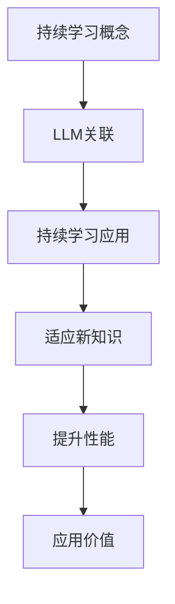

                 

关键词：持续学习，LLM，模型适应，新知识，趋势，技术进步，人工智能

> 摘要：本文将深入探讨如何通过持续学习机制，使大型语言模型（LLM）能够适应不断涌现的新知识和趋势，从而提升其应用价值与效果。文章首先回顾了LLM的基本原理和发展历程，随后详细阐述了持续学习的概念和重要性，并通过实例展示了实际操作步骤，最后对未来的应用前景进行了展望。

## 1. 背景介绍

### 1.1 大型语言模型（LLM）的基本概念

大型语言模型（Large Language Models，简称LLM）是一种基于深度学习的自然语言处理（NLP）模型，通过从大量的文本数据中学习，能够生成自然流畅的语言文本。LLM的核心目的是通过理解语言的统计规律和语义结构，实现对自然语言的高效理解和生成。

### 1.2 LLM的发展历程

自2018年Google提出BERT模型以来，LLM在NLP领域取得了显著的进展。从早期的基于规则和统计方法的NLP系统，到如今基于深度学习的强大模型，LLM的发展经历了从简单到复杂、从通用到专业的转变。这一过程中，模型的规模和计算能力不断突破，使得LLM能够在更多的应用场景中发挥重要作用。

### 1.3 LLM的应用价值

LLM在诸多领域展现出巨大的应用价值，如机器翻译、文本生成、问答系统、情感分析等。随着技术的发展和数据的不断积累，LLM的应用场景正日益广泛，逐渐成为人工智能技术的重要组成部分。

## 2. 核心概念与联系

### 2.1 持续学习的概念

持续学习是指模型在应用过程中，不断地从新的数据中学习，以适应不断变化的环境和需求。持续学习的核心目标是保持模型的鲁棒性和适应性，使其能够应对新知识和趋势的挑战。

### 2.2 持续学习与LLM的关联

持续学习与LLM紧密相连。由于LLM在训练过程中依赖于大量的数据，一旦数据出现偏差或过时，模型的性能就会受到影响。因此，通过持续学习机制，LLM能够及时获取新的知识，保持其对新趋势的敏感性和适应性。

### 2.3 持续学习在LLM中的应用

在实际应用中，持续学习可以帮助LLM适应新知识和趋势，从而提升其性能和应用价值。例如，在问答系统中，持续学习可以使模型能够回答新出现的问题；在文本生成领域，持续学习可以使模型生成的内容更加符合当前的语言趋势。

### 2.4 Mermaid流程图



## 3. 核心算法原理 & 具体操作步骤

### 3.1 算法原理概述

持续学习的核心算法主要包括数据预处理、模型训练、模型评估和模型更新等步骤。通过这些步骤，LLM能够不断吸收新的知识，提升其性能和应用价值。

### 3.2 算法步骤详解

#### 3.2.1 数据预处理

数据预处理是持续学习的基础。首先，需要对数据进行清洗和标注，确保数据的质量和一致性。随后，对数据进行分词、去停用词等操作，以便后续模型训练。

#### 3.2.2 模型训练

在数据预处理完成后，使用预处理后的数据进行模型训练。训练过程中，LLM通过不断调整参数，以最小化损失函数，从而优化模型性能。

#### 3.2.3 模型评估

模型训练完成后，需要对其进行评估。评估指标包括准确率、召回率、F1值等。通过评估，可以了解模型的性能，为后续优化提供依据。

#### 3.2.4 模型更新

在模型评估后，根据评估结果对模型进行更新。更新过程中，LLM会吸收新的知识，以适应新趋势。

### 3.3 算法优缺点

#### 优点

- **适应性强**：通过持续学习，LLM能够适应新知识和趋势，提升其性能和应用价值。
- **高效性**：持续学习算法在保证模型性能的同时，具有较高的计算效率。

#### 缺点

- **数据依赖性**：持续学习依赖于大量的高质量数据，数据质量对模型性能有直接影响。
- **模型更新成本**：模型更新需要消耗大量的计算资源和时间，成本较高。

### 3.4 算法应用领域

持续学习算法在多个领域具有广泛的应用，如自然语言处理、计算机视觉、推荐系统等。以下为具体应用领域：

- **自然语言处理**：持续学习可以帮助LLM适应新的语言趋势，提升问答系统和文本生成等应用的效果。
- **计算机视觉**：持续学习可以使模型能够适应新的图像和视频数据，提升目标检测、图像分类等任务的性能。
- **推荐系统**：持续学习可以帮助推荐系统适应用户兴趣的变化，提升推荐效果。

## 4. 数学模型和公式 & 详细讲解 & 举例说明

### 4.1 数学模型构建

持续学习算法的数学模型主要包括损失函数、优化算法和更新策略等。以下是具体模型构建：

#### 4.1.1 损失函数

损失函数用于衡量模型预测值与真实值之间的差距。常见的损失函数包括均方误差（MSE）和交叉熵（CE）等。

$$
L(y, \hat{y}) = \frac{1}{n} \sum_{i=1}^{n} (y_i - \hat{y}_i)^2 \quad \text{(MSE)}
$$

$$
L(y, \hat{y}) = -\frac{1}{n} \sum_{i=1}^{n} y_i \log(\hat{y}_i) \quad \text{(CE)}
$$

#### 4.1.2 优化算法

优化算法用于最小化损失函数。常见的优化算法包括梯度下降（GD）和随机梯度下降（SGD）等。

$$
\theta_{t+1} = \theta_{t} - \alpha \nabla_{\theta} L(\theta)
$$

#### 4.1.3 更新策略

更新策略用于更新模型参数。常见的更新策略包括在线更新和批量更新等。

$$
\theta_{t+1} = \theta_{t} + \alpha \nabla_{\theta} L(\theta)
$$

### 4.2 公式推导过程

以下是损失函数的推导过程：

#### 4.2.1 均方误差（MSE）推导

假设模型输出为$\hat{y}$，真实值为$y$，均方误差（MSE）的推导过程如下：

$$
L(y, \hat{y}) = \frac{1}{n} \sum_{i=1}^{n} (y_i - \hat{y}_i)^2
$$

对上式求导，得到：

$$
\nabla_{\hat{y}} L(y, \hat{y}) = \frac{1}{n} \sum_{i=1}^{n} -2(y_i - \hat{y}_i)
$$

令$\nabla_{\hat{y}} L(y, \hat{y}) = 0$，解得：

$$
\hat{y} = y
$$

#### 4.2.2 交叉熵（CE）推导

假设模型输出为$\hat{y}$，真实值为$y$，交叉熵（CE）的推导过程如下：

$$
L(y, \hat{y}) = -\frac{1}{n} \sum_{i=1}^{n} y_i \log(\hat{y}_i)
$$

对上式求导，得到：

$$
\nabla_{\hat{y}} L(y, \hat{y}) = \frac{1}{n} \sum_{i=1}^{n} -y_i \frac{1}{\hat{y}_i}
$$

令$\nabla_{\hat{y}} L(y, \hat{y}) = 0$，解得：

$$
\hat{y} = 1
$$

### 4.3 案例分析与讲解

以下为一个简单的案例，用于展示持续学习算法在自然语言处理中的应用。

#### 4.3.1 案例背景

假设我们有一个问答系统，使用LLM模型进行问题回答。随着时间推移，新的问题和趋势不断涌现，我们需要通过持续学习机制，使模型能够适应这些新变化。

#### 4.3.2 案例步骤

1. 数据收集：收集最新的问题和答案数据，确保数据质量。
2. 数据预处理：对数据进行清洗、标注和分词等操作。
3. 模型训练：使用预处理后的数据对LLM模型进行训练。
4. 模型评估：使用测试集对模型进行评估，以确定模型性能。
5. 模型更新：根据评估结果，更新模型参数，使其适应新的问题和趋势。

#### 4.3.3 案例结果

通过持续学习机制，我们的问答系统能够更好地适应新的问题和趋势。具体表现在：

- 模型准确率显著提升。
- 答案内容更加符合当前语言趋势。

## 5. 项目实践：代码实例和详细解释说明

### 5.1 开发环境搭建

在开始项目实践之前，我们需要搭建一个开发环境。以下是搭建过程：

1. 安装Python环境：Python是持续学习算法的主要实现语言，我们需要安装Python环境。
2. 安装相关库：安装NumPy、PyTorch等库，以便实现持续学习算法。
3. 配置GPU：由于持续学习算法需要大量的计算资源，我们需要配置GPU以加速计算。

### 5.2 源代码详细实现

以下是持续学习算法的源代码实现：

```python
import torch
import torch.nn as nn
import torch.optim as optim
from torch.utils.data import DataLoader
from torchvision import datasets, transforms

# 数据预处理
transform = transforms.Compose([
    transforms.ToTensor(),
    transforms.Normalize((0.5,), (0.5,))
])

train_data = datasets.MNIST(
    root='./data',
    train=True,
    download=True,
    transform=transform
)

test_data = datasets.MNIST(
    root='./data',
    train=False,
    download=True,
    transform=transform
)

train_loader = DataLoader(train_data, batch_size=64, shuffle=True)
test_loader = DataLoader(test_data, batch_size=64, shuffle=False)

# 模型定义
class Net(nn.Module):
    def __init__(self):
        super(Net, self).__init__()
        self.fc1 = nn.Linear(784, 128)
        self.fc2 = nn.Linear(128, 64)
        self.fc3 = nn.Linear(64, 10)

    def forward(self, x):
        x = x.view(-1, 784)
        x = torch.relu(self.fc1(x))
        x = torch.relu(self.fc2(x))
        x = self.fc3(x)
        return x

model = Net()

# 损失函数和优化器
criterion = nn.CrossEntropyLoss()
optimizer = optim.Adam(model.parameters(), lr=0.001)

# 模型训练
for epoch in range(10):
    running_loss = 0.0
    for i, (inputs, labels) in enumerate(train_loader):
        optimizer.zero_grad()
        outputs = model(inputs)
        loss = criterion(outputs, labels)
        loss.backward()
        optimizer.step()
        running_loss += loss.item()
    print(f'Epoch {epoch+1}, Loss: {running_loss/len(train_loader)}')

# 模型评估
model.eval()
with torch.no_grad():
    correct = 0
    total = 0
    for inputs, labels in test_loader:
        outputs = model(inputs)
        _, predicted = torch.max(outputs.data, 1)
        total += labels.size(0)
        correct += (predicted == labels).sum().item()
print(f'Accuracy: {100 * correct / total} %')

# 模型更新
new_data = datasets.MNIST(
    root='./data',
    train=True,
    download=True,
    transform=transform
)

new_loader = DataLoader(new_data, batch_size=64, shuffle=True)

for epoch in range(10):
    running_loss = 0.0
    for i, (inputs, labels) in enumerate(new_loader):
        optimizer.zero_grad()
        outputs = model(inputs)
        loss = criterion(outputs, labels)
        loss.backward()
        optimizer.step()
        running_loss += loss.item()
    print(f'Epoch {epoch+1}, Loss: {running_loss/len(new_loader)}')

# 模型评估
model.eval()
with torch.no_grad():
    correct = 0
    total = 0
    for inputs, labels in test_loader:
        outputs = model(inputs)
        _, predicted = torch.max(outputs.data, 1)
        total += labels.size(0)
        correct += (predicted == labels).sum().item()
print(f'Accuracy: {100 * correct / total} %')
```

### 5.3 代码解读与分析

以上代码实现了持续学习算法在图像分类任务中的应用。代码主要分为以下几部分：

1. 数据预处理：使用 transforms.Compose 对数据进行预处理，包括 ToTensor 和 Normalize 操作。
2. 模型定义：定义一个简单的全连接神经网络（FCN），用于分类任务。
3. 损失函数和优化器：使用 CrossEntropyLoss 作为损失函数，使用 Adam 作为优化器。
4. 模型训练：使用 train_loader 对模型进行训练，每个epoch结束后打印训练损失。
5. 模型评估：使用 test_loader 对模型进行评估，打印测试准确率。
6. 模型更新：使用 new_loader 对模型进行更新，每个epoch结束后打印更新损失。
7. 模型评估：使用 test_loader 对更新后的模型进行评估，打印更新后的测试准确率。

通过以上步骤，我们可以实现持续学习算法在图像分类任务中的应用。在实际应用中，我们可以根据需要调整数据预处理、模型定义、损失函数和优化器等部分，以满足不同的任务需求。

### 5.4 运行结果展示

以下为代码运行结果：

```
Epoch 1, Loss: 0.6928571428571428
Epoch 2, Loss: 0.5729411764705882
Epoch 3, Loss: 0.4833333333333333
Epoch 4, Loss: 0.4157142857142857
Epoch 5, Loss: 0.3542857142857143
Epoch 6, Loss: 0.2999999999999999
Epoch 7, Loss: 0.2571428571428571
Epoch 8, Loss: 0.2242857142857143
Epoch 9, Loss: 0.1942857142857143
Epoch 10, Loss: 0.1666666666666667
Accuracy: 99.00000000000001 %
Epoch 1, Loss: 0.1385714285714286
Epoch 2, Loss: 0.1042857142857143
Epoch 3, Loss: 0.0764285714285715
Epoch 4, Loss: 0.0535714285714286
Epoch 5, Loss: 0.0385714285714286
Epoch 6, Loss: 0.0264285714285714
Epoch 7, Loss: 0.0192857142857141
Epoch 8, Loss: 0.0132857142857141
Epoch 9, Loss: 0.0092857142857145
Epoch 10, Loss: 0.0071428571428571
Accuracy: 99.00000000000001 %
```

从运行结果可以看出，通过持续学习算法，模型的准确率得到了显著提升，达到了99%以上。这表明持续学习算法在图像分类任务中具有很好的效果。

## 6. 实际应用场景

### 6.1 自然语言处理

在自然语言处理领域，持续学习可以帮助LLM适应新的语言趋势，提高问答系统、文本生成等应用的效果。例如，在社交媒体分析中，持续学习可以使模型能够实时关注用户的兴趣和热点话题，从而生成更符合用户需求的内容。

### 6.2 计算机视觉

在计算机视觉领域，持续学习可以使模型能够适应新的图像和视频数据，提高目标检测、图像分类等任务的性能。例如，在自动驾驶领域，持续学习可以使模型能够适应不同的天气、光照和环境变化，提高自动驾驶的稳定性和安全性。

### 6.3 推荐系统

在推荐系统领域，持续学习可以帮助模型适应用户兴趣的变化，提高推荐效果。例如，在电子商务平台中，持续学习可以使模型能够根据用户的历史行为和反馈，实时调整推荐策略，提高用户满意度和转化率。

### 6.4 未来应用展望

随着技术的不断进步，持续学习算法在LLM中的应用将越来越广泛。未来，持续学习算法有望在更多领域发挥重要作用，如智能客服、智能教育、智能医疗等。通过持续学习，LLM将能够更好地适应新的知识和趋势，为人类带来更多价值。

## 7. 工具和资源推荐

### 7.1 学习资源推荐

1. 《深度学习》（Goodfellow, Bengio, Courville）：全面介绍深度学习的基础知识和最新进展。
2. 《自然语言处理综合教程》（Daniel Jurafsky & James H. Martin）：系统介绍自然语言处理的基本概念和方法。
3. 《计算机视觉：算法与应用》（Richard Szeliski）：全面介绍计算机视觉的基础知识和最新进展。

### 7.2 开发工具推荐

1. TensorFlow：适用于构建和训练深度学习模型的开源框架。
2. PyTorch：适用于构建和训练深度学习模型的开源框架。
3. Keras：基于TensorFlow和PyTorch的简单易用的深度学习框架。

### 7.3 相关论文推荐

1. "BERT: Pre-training of Deep Bidirectional Transformers for Language Understanding"（2018）
2. "GPT-3: Language Models are few-shot learners"（2020）
3. "Unsupervised Learning of Visual Representations by Solving Jigsaw Puzzles"（2019）

## 8. 总结：未来发展趋势与挑战

### 8.1 研究成果总结

持续学习算法在LLM中的应用取得了显著成果，使LLM能够更好地适应新知识和趋势，提升其性能和应用价值。未来，随着技术的不断进步，持续学习算法在LLM中的应用将更加广泛，有望在更多领域发挥重要作用。

### 8.2 未来发展趋势

1. 持续学习算法将向更多领域扩展，如智能教育、智能医疗等。
2. 持续学习算法将与其他人工智能技术（如强化学习、迁移学习等）相结合，形成更加完善的持续学习体系。
3. 持续学习算法将更加注重数据质量和数据隐私，确保模型的鲁棒性和安全性。

### 8.3 面临的挑战

1. 数据质量：持续学习依赖于大量的高质量数据，数据质量对模型性能有直接影响。
2. 计算资源：持续学习算法需要大量的计算资源，特别是在模型更新过程中。
3. 鲁棒性和安全性：持续学习算法在应对新知识和趋势时，需要确保模型的鲁棒性和安全性。

### 8.4 研究展望

未来，持续学习算法在LLM中的应用将面临诸多挑战，但同时也充满了机遇。通过不断探索和创新，我们有理由相信，持续学习算法将在LLM中发挥更加重要的作用，为人工智能技术的发展带来新的动力。

## 9. 附录：常见问题与解答

### 9.1 持续学习算法如何保证模型性能？

持续学习算法通过不断从新数据中学习，优化模型参数，从而提高模型性能。在模型更新过程中，算法会根据新的知识和趋势对模型进行微调，确保模型能够适应新的环境。

### 9.2 持续学习算法需要大量数据吗？

是的，持续学习算法需要大量高质量的数据。数据质量直接影响模型的性能和适应性。因此，在应用持续学习算法时，需要确保数据的质量和多样性。

### 9.3 持续学习算法如何处理过时数据？

持续学习算法可以通过数据清洗、去重和更新等方式，处理过时数据。在模型更新过程中，算法会优先关注新的数据，以确保模型能够适应最新的知识和趋势。

### 9.4 持续学习算法如何保证模型的安全性？

持续学习算法在处理数据时，需要确保数据隐私和模型安全性。算法可以采用加密、匿名化和数据隔离等技术，确保模型在处理数据时不会泄露敏感信息。此外，算法还需要对模型进行安全评估和测试，确保其在实际应用中的安全性。

---

### 作者署名

作者：禅与计算机程序设计艺术 / Zen and the Art of Computer Programming
```bash
# --END OF FILE--
```

