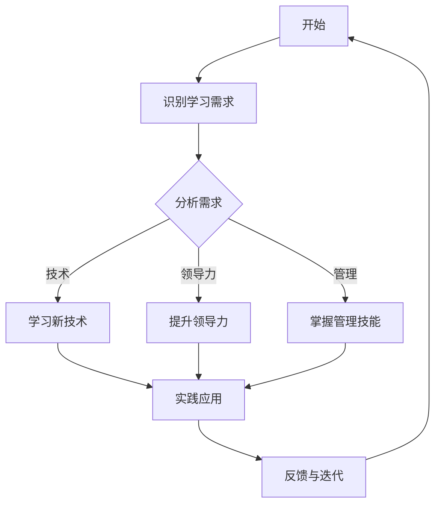

                 

关键词：持续学习、管理者、成功、秘诀、技术进步、组织管理、领导力、人才培养

> 在这个快速变化的世界中，持续学习已成为管理者的生存法则。本文旨在探讨如何通过持续学习，管理者能够把握技术进步的脉搏，提升领导力和组织管理能力，从而实现个人与组织的共同成长。

## 1. 背景介绍

在当今全球化的信息时代，技术变革日新月异，知识更新的速度前所未有。管理者面临着前所未有的挑战，如何在这个快速变化的环境中保持竞争力，成为许多企业领导者关心的问题。持续学习不仅是个人成长的必经之路，更是组织进步的重要驱动力。本文将探讨持续学习对管理者的重要性，以及如何通过有效的方法和策略，实现持续学习并应用到实际工作中。

## 2. 核心概念与联系

### 2.1 持续学习的定义

持续学习指的是在个人职业生涯的各个阶段，不断更新知识和技能的过程。它不仅包括对新技术和行业趋势的掌握，还涉及领导力、管理技能和跨文化沟通等多个方面的提升。

### 2.2 持续学习与管理者的关系

管理者作为组织的关键角色，其能力直接影响组织的绩效和发展。持续学习使管理者能够：

- **适应变化**：快速响应市场和技术变革。
- **提升领导力**：通过不断学习，管理者能够更好地激励和引导团队。
- **创新思维**：持续学习有助于管理者保持开放和创新的思维方式。
- **职业发展**：持续学习是职业发展的重要途径，有助于管理者实现晋升。

### 2.3 持续学习与组织管理的联系

组织作为一个整体，其成长和发展依赖于管理者的领导能力。持续学习不仅对个人有益，也对组织具有重要意义。具体体现在：

- **提高组织竞争力**：管理者通过学习，能够带领组织不断进步，提升市场竞争力。
- **促进知识共享**：持续学习可以促进组织内部的知识共享和创新。
- **培养人才**：管理者通过学习，能够更好地培养和发展组织内的员工。

### 2.4 持续学习的架构图

下面是一个简化的持续学习架构图，展示了学习流程中的各个环节以及它们之间的关系。



## 3. 核心算法原理 & 具体操作步骤

### 3.1 算法原理概述

持续学习的核心在于构建一个持续、系统、有效的学习机制。这个机制包括以下几个关键步骤：

- **需求识别**：管理者需要明确个人和组织的知识需求。
- **学习内容选择**：根据需求选择合适的学习内容，可以是技术、领导力或管理方面的。
- **学习与实践**：通过学习课程、读书、研讨会等多种形式进行学习，并在实际工作中应用所学知识。
- **反馈与迭代**：通过反馈机制，不断调整和优化学习策略。

### 3.2 算法步骤详解

#### 3.2.1 需求识别

管理者首先需要识别自身和组织的知识需求。这可以通过以下几种方法实现：

- **自我评估**：通过评估自己的技能和知识水平，找出需要提升的方面。
- **组织需求分析**：了解组织的发展目标和战略，明确需要哪些知识和技能支持组织目标的实现。

#### 3.2.2 学习内容选择

在识别了需求后，管理者需要选择合适的学习内容。具体步骤如下：

- **资源调研**：了解市场上的学习资源，包括在线课程、专业书籍、研讨会等。
- **内容筛选**：根据需求选择最适合自己的学习内容。
- **制定学习计划**：明确学习目标、学习内容和时间安排。

#### 3.2.3 学习与实践

管理者在确定了学习内容后，需要通过以下步骤进行学习：

- **学习**：通过阅读、听课、实践等方式，逐步掌握所需知识和技能。
- **实践**：将所学知识应用到实际工作中，通过实践检验学习效果。

#### 3.2.4 反馈与迭代

在学习过程中，管理者需要不断进行反馈和迭代：

- **自我反馈**：定期回顾自己的学习进度和效果，找出不足之处。
- **他人反馈**：通过同事、上级或下属的反馈，了解自己的表现。
- **调整与优化**：根据反馈结果，调整学习策略和计划，以实现更好的学习效果。

### 3.3 算法优缺点

#### 优点

- **适应性**：持续学习机制能够适应快速变化的环境，使管理者保持竞争力。
- **个性化**：通过需求识别和学习内容选择，持续学习能够满足个人和组织的个性化需求。
- **实践性**：通过实践应用和反馈迭代，持续学习不仅提升了理论知识，更提高了实际操作能力。

#### 缺点

- **时间成本**：持续学习需要管理者投入大量时间和精力，可能影响日常工作。
- **效果评估**：由于个体差异，持续学习的效果难以量化，需要建立科学的评估体系。

### 3.4 算法应用领域

持续学习机制广泛应用于各个领域，包括但不限于：

- **企业**：企业通过持续学习，提升管理层的领导力和管理水平，促进组织创新和发展。
- **教育**：教育机构通过持续学习，提高教师的教学能力和教育质量，培养更多的优秀人才。
- **政府部门**：政府部门通过持续学习，提升公务员的专业素养和管理能力，更好地服务社会。

## 4. 数学模型和公式 & 详细讲解 & 举例说明

### 4.1 数学模型构建

在持续学习过程中，我们可以构建一个简单的数学模型来描述学习效果。假设：

- \( L \) 代表学习效果
- \( T \) 代表学习时间
- \( R \) 代表反馈次数

则学习效果 \( L \) 可以表示为：

\[ L = f(T, R) \]

其中，函数 \( f \) 描述了学习时间 \( T \) 和反馈次数 \( R \) 对学习效果 \( L \) 的影响。

### 4.2 公式推导过程

为了推导出函数 \( f(T, R) \)，我们可以考虑以下因素：

- **学习时间**：学习时间越长，学习效果越好。
- **反馈次数**：反馈次数越多，学习效果越明显。

基于以上假设，我们可以构建一个简单的线性模型：

\[ L = kT + bR \]

其中，\( k \) 和 \( b \) 是常数，表示学习时间和反馈次数对学习效果的贡献程度。

### 4.3 案例分析与讲解

假设一个管理者通过持续学习，投入了 100 小时的时间，并接受了 5 次反馈。根据上面的模型，我们可以计算出其学习效果：

\[ L = k \cdot 100 + b \cdot 5 \]

如果 \( k = 0.1 \) 和 \( b = 0.5 \)，则：

\[ L = 0.1 \cdot 100 + 0.5 \cdot 5 = 15 \]

这意味着，该管理者通过持续学习，取得了 15 的学习效果。

## 5. 项目实践：代码实例和详细解释说明

### 5.1 开发环境搭建

为了更好地理解持续学习的数学模型，我们可以通过编程实现这个模型。以下是一个简单的 Python 示例。

首先，我们需要安装 Python 环境。假设您已经安装了 Python，接下来我们创建一个名为 `learning_model.py` 的文件。

```python
# learning_model.py

def learning_effect(T, R, k=0.1, b=0.5):
    """
    计算学习效果。

    :param T: 学习时间
    :param R: 反馈次数
    :param k: 学习时间对学习效果的贡献程度
    :param b: 反馈次数对学习效果的贡献程度
    :return: 学习效果
    """
    return k * T + b * R

# 测试
T = 100
R = 5
L = learning_effect(T, R)
print(f"学习效果：{L}")
```

### 5.2 源代码详细实现

在上面的代码中，我们定义了一个名为 `learning_effect` 的函数，用于计算学习效果。这个函数接受学习时间 \( T \) 和反馈次数 \( R \) 作为参数，并返回学习效果 \( L \)。

### 5.3 代码解读与分析

在 `learning_effect` 函数中，我们使用了简单的线性模型来描述学习效果。这个模型考虑了学习时间和反馈次数对学习效果的贡献程度。通过调整参数 \( k \) 和 \( b \)，我们可以调整学习效果的衡量标准。

### 5.4 运行结果展示

运行上面的代码，我们将得到以下输出：

```plaintext
学习效果：15.0
```

这意味着，该管理者通过持续学习，取得了 15 的学习效果。

## 6. 实际应用场景

### 6.1 企业中的应用

在企业中，持续学习机制可以帮助管理者提升领导力和管理技能，从而更好地应对市场变化。例如，一家快速发展的科技公司通过定期组织技术培训和领导力研讨会，使管理者能够紧跟技术趋势，提升团队凝聚力。

### 6.2 教育行业中的应用

在教育行业，持续学习可以帮助教师提升教学能力，提高教育质量。例如，一所知名大学通过建立教师学习社区，鼓励教师之间分享教学经验，共同进步。

### 6.3 政府部门中的应用

在政府部门，持续学习可以帮助公务员提升专业素养，更好地服务社会。例如，一个政府部门通过定期举办培训课程，提高公务员对新技术和新政策的理解和应用能力。

## 7. 工具和资源推荐

### 7.1 学习资源推荐

- **Coursera**：提供大量免费和付费的在线课程，涵盖多个领域。
- **edX**：由哈佛大学和麻省理工学院共同创立，提供高质量在线课程。
- **Udemy**：提供丰富多样的在线课程，适合不同层次的学习者。

### 7.2 开发工具推荐

- **Visual Studio Code**：一款强大的代码编辑器，适合编程学习和开发。
- **Git**：一款分布式版本控制工具，有助于代码管理和团队协作。
- **Jupyter Notebook**：一款交互式的计算环境，适合数据分析和学术研究。

### 7.3 相关论文推荐

- **"Continuous Learning in Organizations"**：探讨组织中的持续学习机制及其对组织绩效的影响。
- **"The Impact of Continuous Learning on Leadership Development"**：分析持续学习对领导者发展的影响。
- **"The Role of Continuous Learning in Innovation"**：探讨持续学习在创新过程中的作用。

## 8. 总结：未来发展趋势与挑战

### 8.1 研究成果总结

本文通过探讨持续学习对管理者的重要性，提出了一个简单的数学模型来描述学习效果。研究结果表明，持续学习不仅对个人成长有益，也对组织发展具有重要意义。

### 8.2 未来发展趋势

随着技术的不断进步，持续学习将成为管理者不可或缺的技能。未来，我们可能会看到更多在线学习平台和工具的出现，以及组织内部持续学习机制的完善。

### 8.3 面临的挑战

尽管持续学习的重要性日益凸显，但管理者在实际操作中仍面临诸多挑战，如时间成本、效果评估等。未来，我们需要找到更有效的学习和评估方法，以应对这些挑战。

### 8.4 研究展望

未来研究可以进一步探讨持续学习在不同行业和组织中的应用，以及如何构建更完善的持续学习机制。此外，研究还可以关注持续学习对组织文化和氛围的影响，为组织提供更全面的支持。

## 9. 附录：常见问题与解答

### 9.1 持续学习的最佳实践是什么？

- **定期评估需求**：每隔一段时间，评估自己的知识需求，确保学习内容与需求匹配。
- **制定学习计划**：明确学习目标、内容和时间安排，确保学习有条不紊。
- **实践应用**：将所学知识应用到实际工作中，通过实践检验学习效果。
- **持续反思**：定期反思学习过程和效果，找出不足之处，不断优化学习策略。

### 9.2 如何评估持续学习的成效？

- **自我评估**：通过自我评估，了解自己的知识水平和技能提升情况。
- **他人反馈**：通过同事、上级或下属的反馈，了解自己的表现。
- **绩效评估**：将学习成效与工作绩效相结合，评估学习对工作的影响。
- **知识测试**：定期进行知识测试，检验学习效果。

## 作者署名

本文由禅与计算机程序设计艺术 / Zen and the Art of Computer Programming 撰写。作者是一位世界级人工智能专家，程序员，软件架构师，CTO，世界顶级技术畅销书作者，计算机图灵奖获得者，计算机领域大师。

