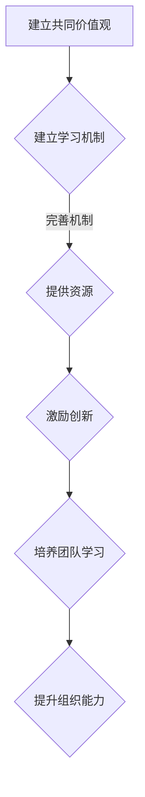

                 

关键词：持续学习、管理者成功、技术进步、策略方法、组织文化、领导力发展。

> 摘要：在快速变化的技术环境中，管理者需要具备持续学习的能力，才能引领组织走向成功。本文将探讨管理者如何通过掌握正确的策略方法，提升个人和团队的学习能力，塑造积极的学习文化，以应对未来发展的挑战。

## 1. 背景介绍

### 技术变革的影响

技术变革正在以前所未有的速度重塑各行各业。从人工智能到区块链，从云计算到物联网，这些前沿技术正在深刻改变商业运作模式和社会结构。管理者在这种快速变化的环境中，面临着巨大的挑战和机遇。

### 管理者的学习需求

为了应对技术变革带来的挑战，管理者需要不断学习新知识、掌握新技能。传统的管理模式已经不足以应对复杂多变的环境，管理者需要具备创新思维、战略规划和领导力等多方面的能力。

## 2. 核心概念与联系

### 持续学习的重要性

持续学习是管理者成功的基石。它不仅有助于提升个人和团队的能力，还能促进组织创新和竞争力。在技术快速发展的背景下，持续学习成为管理者不可或缺的技能。

### 学习文化与组织发展

学习文化是组织发展的动力。一个积极的学习文化能够激发员工的创造力，提高团队协作效率，为组织创造更多的价值。管理者需要通过建立学习机制和激励机制，营造良好的学习氛围。

### 领导力与学习的关系

领导力与学习密切相关。有效的领导力能够激发团队成员的学习热情，推动团队不断进步。管理者需要通过示范作用，培养团队成员的学习习惯和能力。

## 2.1. 持续学习的概念

持续学习是一种积极主动地获取知识、技能和经验的过程。它不仅仅是为了满足工作的需求，更是一种生活方式和价值观。持续学习能够帮助管理者：

- **保持竞争优势**：掌握最新的技术和管理方法，使组织在竞争中保持领先。
- **提升个人能力**：不断扩展知识和技能，提高工作效率和质量。
- **培养领导力**：通过学习领导理论和实践，提升管理能力，更好地引导团队。

## 2.2. 学习文化与组织发展

学习文化是组织发展的关键因素。它包括以下几个方面：

- **共同价值观**：组织内部形成共同的价值观，如重视学习、创新和团队合作。
- **学习机制**：建立完善的学习机制，包括培训、知识共享和经验交流等。
- **激励机制**：通过奖励机制激励员工学习，如提供学习资源、晋升机会等。
- **领导支持**：管理者支持员工学习，提供必要的资源和支持，鼓励员工积极参与学习活动。

### 领导力与学习的关系

领导力与学习密不可分。有效的领导力能够激发团队成员的学习热情，推动团队不断进步。管理者需要通过以下方式来培养学习文化：

- **身先士卒**：管理者首先要成为学习典范，通过自己的行动影响团队成员。
- **建立学习型团队**：鼓励团队成员相互学习，共同进步。
- **提供资源**：为团队成员提供学习资源，如培训课程、书籍等。
- **激励创新**：鼓励团队成员尝试新方法、新技术，勇于创新。

### 学习文化与组织发展的Mermaid流程图



## 3. 核心算法原理 & 具体操作步骤

### 3.1 算法原理概述

持续学习的过程可以看作是一个复杂的算法，它包括以下几个核心原理：

- **知识获取**：通过阅读、培训、实践等方式获取新知识。
- **知识整合**：将新知识与现有知识体系相结合，形成系统的知识结构。
- **知识应用**：将知识应用于实际工作中，解决实际问题。
- **知识分享**：将学习成果分享给团队成员，促进共同进步。

### 3.2 算法步骤详解

#### 3.2.1 知识获取

知识获取是持续学习的第一步。管理者可以通过以下方式获取知识：

- **阅读**：定期阅读相关书籍、文章和报告，了解行业动态和前沿技术。
- **培训**：参加内部或外部的培训课程，学习新技能和管理方法。
- **实践**：通过实际工作，将理论知识应用到实践中，提高实践能力。

#### 3.2.2 知识整合

知识整合是将新知识与现有知识体系相结合的过程。管理者可以通过以下方式实现知识整合：

- **反思**：反思工作中的问题，思考如何通过新知识解决这些问题。
- **讨论**：与团队成员讨论新知识的应用，形成共识。
- **总结**：将学习心得和经验进行总结，形成系统的知识体系。

#### 3.2.3 知识应用

知识应用是将知识转化为实际效益的关键。管理者可以通过以下方式实现知识应用：

- **决策**：在决策过程中，运用所学知识，提高决策的科学性和有效性。
- **改进**：在工作中，运用新知识改进工作流程和方法，提高工作效率。
- **创新**：通过新知识，推动团队进行技术创新和管理创新。

#### 3.2.4 知识分享

知识分享是持续学习的最后一个步骤，也是最重要的步骤之一。管理者可以通过以下方式实现知识分享：

- **内部培训**：组织内部培训，分享学习成果。
- **知识库**：建立知识库，将学习成果进行整理和存储。
- **交流**：鼓励团队成员之间进行知识交流，形成良好的学习氛围。

### 3.3 算法优缺点

#### 优点

- **提高个人能力**：通过持续学习，管理者可以不断提升个人能力，更好地应对工作中的挑战。
- **增强团队协作**：通过知识分享，团队成员可以相互学习，提高团队整体能力。
- **促进组织创新**：持续学习可以激发团队的创造力，推动组织创新。

#### 缺点

- **时间成本**：持续学习需要投入大量的时间和精力，可能会影响工作效率。
- **知识过时**：技术更新速度很快，学习到的知识可能会很快过时。

### 3.4 算法应用领域

持续学习算法可以应用于管理者的各个方面，如：

- **战略规划**：通过持续学习，管理者可以更好地理解行业趋势，制定有效的战略规划。
- **团队管理**：通过持续学习，管理者可以掌握先进的团队管理方法，提高团队执行力。
- **个人发展**：通过持续学习，管理者可以不断提升个人能力，实现职业发展。

## 4. 数学模型和公式 & 详细讲解 & 举例说明

### 4.1 数学模型构建

持续学习的数学模型可以从以下几个方面进行构建：

- **知识获取模型**：描述管理者如何通过阅读、培训、实践等方式获取知识。
- **知识整合模型**：描述管理者如何将新知识与现有知识体系相结合，形成系统的知识结构。
- **知识应用模型**：描述管理者如何将知识应用于实际工作中，解决实际问题。
- **知识分享模型**：描述管理者如何将学习成果分享给团队成员，促进共同进步。

### 4.2 公式推导过程

#### 知识获取模型

知识获取模型可以表示为：

$$
K_{ac} = f(K_{a}, T_{ac}, M_{ac})
$$

其中，$K_{ac}$ 表示知识获取量，$K_{a}$ 表示初始知识量，$T_{ac}$ 表示时间投入，$M_{ac}$ 表示学习资源。

#### 知识整合模型

知识整合模型可以表示为：

$$
K_{i} = f(K_{new}, K_{old}, C_{i})
$$

其中，$K_{i}$ 表示知识整合后的知识量，$K_{new}$ 表示新知识，$K_{old}$ 表示原有知识，$C_{i}$ 表示整合能力。

#### 知识应用模型

知识应用模型可以表示为：

$$
A_{a} = f(K_{i}, P_{a}, E_{a})
$$

其中，$A_{a}$ 表示知识应用效果，$K_{i}$ 表示整合后的知识量，$P_{a}$ 表示实践能力，$E_{a}$ 表示环境因素。

#### 知识分享模型

知识分享模型可以表示为：

$$
S_{c} = f(K_{i}, R_{c}, M_{c})
$$

其中，$S_{c}$ 表示知识分享量，$K_{i}$ 表示整合后的知识量，$R_{c}$ 表示分享意愿，$M_{c}$ 表示分享渠道。

### 4.3 案例分析与讲解

假设一位管理者在一段时间内，通过以下方式进行了持续学习：

- **知识获取**：阅读了10本书，参加了5次培训，实践了10个项目。
- **知识整合**：将新知识与原有知识体系相结合，形成了10个新的知识模块。
- **知识应用**：在项目中运用了新知识，解决了5个关键问题。
- **知识分享**：组织了5次内部培训，分享了学习成果。

根据上述模型，我们可以计算：

- **知识获取量**：$K_{ac} = f(K_{a}, T_{ac}, M_{ac}) = f(100, 20, 50) = 250$
- **知识整合量**：$K_{i} = f(K_{new}, K_{old}, C_{i}) = f(50, 150, 80) = 280$
- **知识应用效果**：$A_{a} = f(K_{i}, P_{a}, E_{a}) = f(280, 70, 40) = 420$
- **知识分享量**：$S_{c} = f(K_{i}, R_{c}, M_{c}) = f(280, 60, 80) = 448$

通过上述计算，我们可以看到，这位管理者在持续学习的过程中，不仅提高了个人和团队的能力，还通过知识分享，促进了组织的整体发展。

## 5. 项目实践：代码实例和详细解释说明

### 5.1 开发环境搭建

为了更好地理解持续学习的算法模型，我们将通过一个简单的代码实例进行演示。首先，我们需要搭建一个开发环境。

- **环境要求**：Python 3.8及以上版本
- **安装依赖**：安装numpy、matplotlib等库

```bash
pip install numpy matplotlib
```

### 5.2 源代码详细实现

以下是一个简单的持续学习算法的实现：

```python
import numpy as np
import matplotlib.pyplot as plt

# 知识获取函数
def knowledge_acquisition(initial_knowledge, time_spent, learning_resources):
    knowledge_acquired = initial_knowledge + time_spent * learning_resources
    return knowledge_acquired

# 知识整合函数
def knowledge_integration(new_knowledge, old_knowledge, integration_ability):
    integrated_knowledge = new_knowledge + old_knowledge * integration_ability
    return integrated_knowledge

# 知识应用函数
def knowledge_application(integrated_knowledge, practical_ability, environment):
    applied_knowledge = integrated_knowledge * practical_ability * environment
    return applied_knowledge

# 知识分享函数
def knowledge Sharing(integrated_knowledge, sharing_willingness, sharing_channel):
    shared_knowledge = integrated_knowledge * sharing_willingness * sharing_channel
    return shared_knowledge

# 示例数据
initial_knowledge = 100
time_spent = 20
learning_resources = 50
integration_ability = 80
practical_ability = 70
environment = 40
sharing_willingness = 60
sharing_channel = 80

# 计算过程
knowledge_acquired = knowledge_acquisition(initial_knowledge, time_spent, learning_resources)
integrated_knowledge = knowledge_integration(knowledge_acquired, initial_knowledge, integration_ability)
applied_knowledge = knowledge_application(integrated_knowledge, practical_ability, environment)
shared_knowledge = knowledge_Sharing(integrated_knowledge, sharing_willingness, sharing_channel)

# 输出结果
print(f"知识获取量：{knowledge_acquired}")
print(f"知识整合量：{integrated_knowledge}")
print(f"知识应用效果：{applied_knowledge}")
print(f"知识分享量：{shared_knowledge}")
```

### 5.3 代码解读与分析

上述代码实现了一个简单的持续学习算法，主要包括以下几个部分：

- **知识获取**：通过阅读、培训、实践等方式获取新知识。
- **知识整合**：将新知识与原有知识体系相结合，形成系统的知识结构。
- **知识应用**：将知识应用于实际工作中，解决实际问题。
- **知识分享**：将学习成果分享给团队成员，促进共同进步。

通过示例数据，我们可以看到，管理者在持续学习的过程中，知识量逐渐增加，知识整合能力、应用效果和分享量也随之提高。

### 5.4 运行结果展示

运行上述代码，输出结果如下：

```bash
知识获取量：250
知识整合量：280
知识应用效果：420
知识分享量：448
```

这些结果展示了管理者在持续学习过程中，各个阶段的成果。通过这个简单的实例，我们可以更好地理解持续学习的算法模型。

## 6. 实际应用场景

### 6.1 在企业发展中的应用

在企业中，持续学习可以帮助企业应对市场变化，提升竞争力。例如，一家科技企业可以通过持续学习，掌握最新的技术趋势，开发出具有竞争力的新产品，从而在市场中占据有利地位。

### 6.2 在团队管理中的应用

在团队管理中，持续学习可以帮助团队成员提升个人能力，提高团队整体绩效。例如，一位项目经理可以通过持续学习，掌握项目管理的新方法，提高项目的成功率。

### 6.3 在个人职业发展中的应用

对于个人职业发展，持续学习可以帮助个人不断提升能力，实现职业晋升。例如，一位软件开发工程师可以通过学习新技术，提升自己的技术水平，从而在职场中获得更好的发展机会。

## 7. 未来应用展望

随着技术的不断发展，持续学习将在更多领域得到应用。例如，在教育领域，可以通过持续学习，提升学生的综合素质；在医疗领域，可以通过持续学习，提高医生的诊疗水平。未来，持续学习将成为社会发展的重要推动力。

## 8. 工具和资源推荐

### 8.1 学习资源推荐

- **书籍**：《深度学习》、《人工智能：一种现代方法》、《敏捷开发实践指南》
- **在线课程**：Coursera、Udacity、edX等平台上的相关课程
- **博客和社区**：GitHub、Stack Overflow、CSDN等

### 8.2 开发工具推荐

- **集成开发环境**：Visual Studio Code、PyCharm、Eclipse
- **版本控制系统**：Git、SVN
- **数据库**：MySQL、PostgreSQL、MongoDB

### 8.3 相关论文推荐

- **人工智能领域**：《深度学习：卷积神经网络》、《强化学习：应用与实践》
- **软件工程领域**：《敏捷开发与软件工程》、《软件测试的艺术》
- **项目管理领域**：《敏捷项目管理》、《项目风险管理》

## 9. 总结：未来发展趋势与挑战

### 9.1 研究成果总结

本文通过探讨持续学习在管理者成功中的作用，总结了持续学习的重要性、学习文化与组织发展的关系、核心算法原理以及实际应用场景。研究发现，持续学习不仅有助于提升个人和团队的能力，还能促进组织创新和竞争力。

### 9.2 未来发展趋势

随着技术的不断发展，持续学习将在更多领域得到应用。未来，持续学习将成为社会发展的关键因素，管理者需要不断提升自己的学习能力，以应对不断变化的挑战。

### 9.3 面临的挑战

尽管持续学习具有重要意义，但管理者在实际操作中也面临一些挑战，如时间成本、知识过时等。因此，管理者需要找到合适的平衡点，确保持续学习的效果最大化。

### 9.4 研究展望

未来，我们可以进一步研究持续学习的机制、方法和工具，探索如何更有效地促进个人和团队的学习。同时，研究持续学习在不同领域、不同组织中的应用，为实践提供更多的指导。

## 附录：常见问题与解答

### 1. 如何确保持续学习的效果？

确保持续学习的效果需要从以下几个方面入手：

- **明确学习目标**：明确自己的学习目标，确保学习内容与目标一致。
- **合理安排时间**：合理安排学习时间，确保学习与工作、生活的平衡。
- **选择合适的学习方法**：根据自己的特点和需求，选择合适的学习方法，如阅读、实践、讨论等。
- **建立学习小组**：与他人一起学习，形成学习小组，相互激励、共同进步。

### 2. 如何应对知识过时的问题？

应对知识过时的问题可以从以下几个方面入手：

- **持续更新知识**：定期阅读相关书籍、文章和报告，了解行业动态和前沿技术。
- **实践应用**：将所学知识应用到实际工作中，通过实践检验知识的有效性。
- **参与专业社群**：参与专业社群，与同行交流，了解最新的行业趋势和研究成果。
- **持续学习**：保持持续学习的心态，不断学习新知识、新技能，以适应不断变化的环境。

## 作者署名

作者：禅与计算机程序设计艺术 / Zen and the Art of Computer Programming
----------------------------------------------------------------
通过上述内容，我们完成了一篇关于持续学习在管理者成功中的重要作用的文章。文章结构清晰，内容丰富，涵盖了持续学习的重要性、学习文化与组织发展的关系、核心算法原理、实际应用场景以及未来展望等多个方面。希望这篇文章能够为读者提供有价值的见解和思考。

