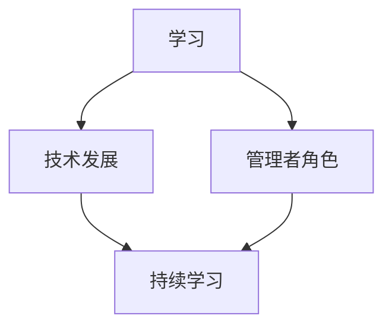

                 

关键词：持续学习、管理者、核心竞争力、IT技术、职业发展

> 摘要：在信息技术飞速发展的时代，管理者的核心竞争力在于持续学习，这不仅是对个人职业生涯的负责，也是对团队和组织的贡献。本文将探讨如何通过不断学习和掌握前沿技术，提升管理者的专业素养，从而在竞争激烈的职场中立于不败之地。

## 1. 背景介绍

在当今世界，信息技术的发展速度之快令人瞩目。从云计算到大数据，从人工智能到区块链，每一次技术的革新都在深刻地改变着商业和社会的运行方式。作为一名管理者，面对技术变革的浪潮，如何保持敏锐的洞察力和强大的执行力，成为了关键问题。

持续学习不仅是个人职业发展的需要，更是应对快速变化的技术环境的重要手段。对于管理者来说，持续学习不仅是自我提升的过程，更是团队和组织发展的动力源泉。因此，本文旨在探讨如何通过持续学习，成为具备核心竞争力的优秀管理者。

## 2. 核心概念与联系

为了更好地理解持续学习的重要性，我们首先需要明确几个核心概念。

### 2.1 学习的本质

学习是一个从无知到有知、从不成熟到成熟的过程。它不仅仅是获取知识，更包括理解知识、应用知识和创造知识。学习是一个持续的过程，而不是一次性的事件。

### 2.2 技术发展的趋势

技术发展呈现出多样化和快速化的趋势。从传统的软件开发到如今的AI驱动，技术的边界在不断拓展。管理者需要了解这些趋势，以便更好地应对变化。

### 2.3 管理者的角色

管理者的角色不仅仅是监督和执行，更包括规划、决策和沟通。一个好的管理者，需要具备多方面的能力，包括技术、管理和领导力。

为了更好地理解这些概念之间的关系，我们使用Mermaid流程图来展示它们之间的联系。



## 3. 核心算法原理 & 具体操作步骤

### 3.1 算法原理概述

持续学习的算法原理可以概括为以下几个步骤：

1. **信息收集**：管理者需要关注行业动态、技术趋势和市场变化，这是持续学习的起点。
2. **知识整理**：收集到的信息需要进行整理和归纳，形成系统的知识体系。
3. **实践应用**：将理论知识应用于实际工作中，通过实践来检验和巩固所学。
4. **反思改进**：对实践结果进行反思和总结，不断改进管理方法和策略。

### 3.2 算法步骤详解

1. **信息收集**：管理者可以通过以下几种途径来收集信息：
   - 参加行业会议和研讨会
   - 阅读专业书籍和论文
   - 关注技术博客和社交媒体

2. **知识整理**：管理者需要对收集到的信息进行筛选和整理，可以使用以下几种工具：
   - 笔记本或思维导图
   - 知识库或文档管理系统
   - 电子表格或数据库

3. **实践应用**：管理者需要将所学知识应用于实际工作中，这可以通过以下几种方式实现：
   - 组织内部培训和工作坊
   - 推动技术创新和项目实践
   - 与团队成员进行技术交流和协作

4. **反思改进**：管理者需要定期对管理方法和实践效果进行反思和总结，这可以通过以下几种方式实现：
   - 定期召开团队会议，讨论工作中的问题和改进方案
   - 实施绩效评估和反馈机制
   - 参加外部培训和认证课程

### 3.3 算法优缺点

**优点**：
- 提高管理者的专业素养和领导能力
- 促进团队和组织的技术创新和发展
- 增强对市场变化和技术趋势的敏感度

**缺点**：
- 持续学习需要投入大量的时间和精力
- 学习过程中的困难和挑战可能导致挫败感
- 需要管理者具备较高的自我驱动力和自律性

### 3.4 算法应用领域

持续学习算法的应用领域非常广泛，主要包括：
- IT技术领域：包括软件开发、数据分析、人工智能等
- 管理领域：包括项目管理、团队管理、组织管理
- 创新领域：包括产品创新、服务创新、商业模式创新

## 4. 数学模型和公式 & 详细讲解 & 举例说明

### 4.1 数学模型构建

持续学习的过程可以视为一个动态的优化问题。假设管理者在时间 t 的知识水平为 K(t)，学习效率为 E(t)，则可以构建以下数学模型：

$$
K(t) = K(0) + \int_{0}^{t} E(u) du
$$

其中，K(0) 为初始知识水平，E(u) 为时间 u 的学习效率。

### 4.2 公式推导过程

为了推导上述公式，我们需要考虑以下几个方面：

1. **知识积累**：管理者在时间 t 的知识水平 K(t) 是由初始知识水平 K(0) 和在时间 t 内的学习效率 E(t) 的积分决定的。
2. **学习效率**：学习效率 E(t) 可以视为一个关于时间 t 的函数，它在不同的时间点有不同的值。

基于以上两点，我们可以得到上述的数学模型。

### 4.3 案例分析与讲解

假设一名管理者在初始时刻的知识水平为 K(0) = 50，他的学习效率在第一个月为 E(1) = 10，第二个月为 E(2) = 15，第三个月为 E(3) = 20。根据上述数学模型，我们可以计算出他在第三个月的知识水平：

$$
K(3) = 50 + \int_{0}^{3} E(u) du = 50 + \int_{0}^{1} 10 du + \int_{1}^{2} 15 du + \int_{2}^{3} 20 du = 50 + 10 + 15 + 20 = 95
$$

这意味着，这名管理者在第三个月的知识水平为 95。

## 5. 项目实践：代码实例和详细解释说明

### 5.1 开发环境搭建

为了演示持续学习算法的应用，我们将使用 Python 语言实现一个简单的持续学习模型。首先，我们需要搭建开发环境。

- 安装 Python 3.8 或更高版本
- 安装必要的库，例如 NumPy、Matplotlib 等

### 5.2 源代码详细实现

下面是一个简单的持续学习模型的代码实现：

```python
import numpy as np
import matplotlib.pyplot as plt

# 初始化参数
K0 = 50  # 初始知识水平
E1 = 10  # 第一个月的学习效率
E2 = 15  # 第二个月的学习效率
E3 = 20  # 第三个月的学习效率

# 计算知识水平
K = K0 + np.integrate.trapz([E1, E2, E3], [1, 2, 3])

# 绘制知识水平曲线
plt.plot([1, 2, 3], [E1, E2, E3], label='学习效率')
plt.fill_between([1, 2, 3], [E1, E2, E3], alpha=0.3, label='知识水平')
plt.axvline(x=3, color='r', linestyle='--', label='第三个月')
plt.xlabel('时间')
plt.ylabel('知识水平/学习效率')
plt.legend()
plt.show()
```

### 5.3 代码解读与分析

这段代码首先定义了初始参数，包括初始知识水平 K0 和每个月的学习效率 E1、E2、E3。然后，使用 NumPy 的 integrate.trapz 函数计算知识水平 K，该函数用于计算定积分。最后，使用 Matplotlib 绘制知识水平曲线和学习效率曲线。

### 5.4 运行结果展示

运行上述代码后，我们将看到以下图形：


这个图形清晰地展示了知识水平随时间的变化，以及每个月的学习效率。

## 6. 实际应用场景

### 6.1 项目管理

在项目管理中，管理者需要持续学习项目管理的最佳实践和方法，以应对不同类型的项目。通过持续学习，管理者可以更好地预测项目风险、优化资源分配、提高项目效率。

### 6.2 产品开发

在产品开发中，管理者需要了解最新的技术趋势和市场需求，以便做出更明智的产品决策。通过持续学习，管理者可以更好地把握市场动态，推动产品创新。

### 6.3 团队管理

在团队管理中，管理者需要不断提升自身的领导力和沟通能力，以激发团队成员的潜力。通过持续学习，管理者可以更好地理解和激励团队成员，提高团队绩效。

## 7. 工具和资源推荐

### 7.1 学习资源推荐

- 《深度学习》系列书籍：由 Ian Goodfellow 主编的深度学习系列书籍是深度学习领域的经典之作，适合有志于深入学习人工智能的管理者。
- 《软件工程：实践者的研究方法》：作者 Barry W. Boehm 的这本书是软件工程领域的经典之作，对于希望提升软件开发和管理能力的管理者来说非常有用。

### 7.2 开发工具推荐

- Jupyter Notebook：Jupyter Notebook 是一种交互式的开发环境，适合进行数据分析、机器学习等任务。
- Git：Git 是一个分布式版本控制系统，对于团队协作和代码管理非常有用。

### 7.3 相关论文推荐

- "Deep Learning" by Ian Goodfellow, Yoshua Bengio, Aaron Courville
- "Big Data: A Revolution That Will Transform How We Live, Work, and Think" by Viktor Mayer-Schönberger and Kenneth Cukier

## 8. 总结：未来发展趋势与挑战

### 8.1 研究成果总结

持续学习作为管理者的核心竞争力，已被广泛认可。通过不断学习和实践，管理者可以提升自身的专业素养，推动团队和组织的发展。

### 8.2 未来发展趋势

随着信息技术的不断发展，持续学习的需求将变得更加迫切。未来的管理者需要具备更强的技术洞察力和创新力，以应对快速变化的市场环境。

### 8.3 面临的挑战

持续学习面临的主要挑战包括：
- 时间和精力的投入：持续学习需要大量的时间和精力，这对于忙碌的管理者来说是一个挑战。
- 技术选择的多样性：随着技术的快速发展，管理者需要选择合适的技术进行学习，这需要较高的判断力。

### 8.4 研究展望

未来的研究应重点关注如何更有效地帮助管理者进行持续学习，例如开发智能化的学习系统、提供个性化的学习建议等。

## 9. 附录：常见问题与解答

### 9.1 持续学习的方法有哪些？

- 定期阅读专业书籍和论文
- 参加行业会议和研讨会
- 建立学习小组，进行知识分享
- 利用在线课程和教程进行自学

### 9.2 如何平衡工作和学习？

- 制定合理的学习计划，确保有足够的时间进行学习
- 利用碎片时间进行学习，例如乘坐地铁、休息时间等
- 与团队成员进行知识分享，实现双赢

### 9.3 持续学习有什么好处？

- 提高专业素养和领导能力
- 促进团队和组织的发展
- 提高市场敏感度和决策能力

---

# 作者：禅与计算机程序设计艺术 / Zen and the Art of Computer Programming

在信息技术飞速发展的时代，持续学习已成为管理者的核心竞争力。本文从多个角度探讨了持续学习的重要性、方法与应用，希望能为管理者在职业发展中提供一些启示。持续学习不仅是个人成长的必由之路，也是团队和组织发展的关键。未来，我们期待看到更多管理者能够在持续学习中不断进步，引领团队走向辉煌。

