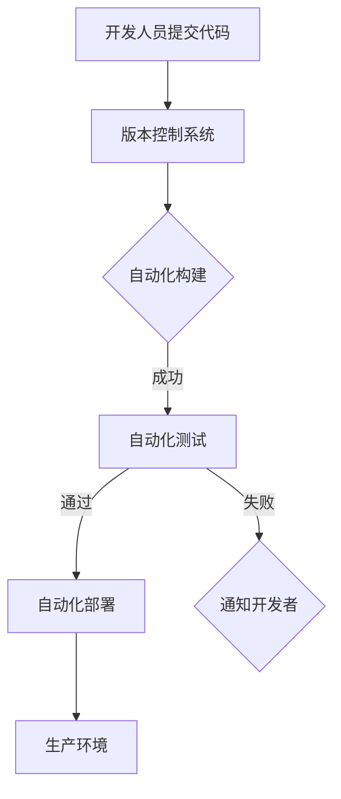

                 

关键词：持续集成、持续交付、DevOps、自动化测试、持续部署、代码质量、持续反馈、敏捷开发

摘要：本文旨在探讨持续集成（CI）和持续交付（CD）的最佳实践，详细解析其在现代软件开发过程中的重要性和实施策略。通过核心概念的联系、算法原理、数学模型、项目实践以及未来展望，全面阐述持续集成与持续交付的实际应用及其对软件开发效率和质量的提升。

## 1. 背景介绍

在过去的几十年里，软件开发经历了从传统的瀑布模型到敏捷开发、DevOps的演变。这一系列的变化都是为了提高软件交付的效率和质量。持续集成（Continuous Integration，CI）和持续交付（Continuous Delivery，CD）作为DevOps文化中的核心组成部分，已成为现代软件开发不可或缺的实践。

持续集成是一种软件开发方法，它强调频繁地将代码更改合并到一个共享的代码库中，并通过自动化的构建和测试来确保新代码的质量。持续交付则是在持续集成的基础上，进一步自动化部署流程，确保软件可以随时发布。

### 持续集成

持续集成的主要目标是减少集成过程中的问题，提高代码质量，加快开发速度。其核心思想是通过自动化测试来确保每次代码合并都是可用的。以下是一些关键概念：

- **频繁提交**：开发者频繁地将代码提交到共享仓库。
- **自动化构建**：每次提交后，自动化构建系统都会编译和构建代码。
- **自动化测试**：构建完成后，自动化测试系统会运行一系列测试，包括单元测试、集成测试和功能测试。

### 持续交付

持续交付则关注于确保软件可以快速、可靠地交付给用户。其关键概念包括：

- **自动化部署**：软件构建和测试成功后，自动化部署系统会将软件部署到测试环境或生产环境。
- **环境一致性**：确保在不同环境中运行的软件版本一致，避免环境差异导致的问题。
- **快速反馈**：通过自动化测试和部署，用户可以更快地获得反馈，从而更快地响应市场需求。

## 2. 核心概念与联系

为了更好地理解持续集成与持续交付，我们首先需要了解一些核心概念和它们之间的联系。以下是一个简化的 Mermaid 流程图，用于展示这些概念之间的关系：



在这个流程中：

- 开发人员提交代码到版本控制系统。
- 版本控制系统触发自动化构建过程。
- 构建成功后，自动化测试开始运行。
- 测试通过，软件被部署到生产环境。
- 测试失败，系统通知开发者并暂停部署流程。

### 3. 核心算法原理 & 具体操作步骤

#### 3.1 算法原理概述

持续集成和持续交付的核心算法原理在于自动化。通过自动化构建、测试和部署，可以显著提高开发效率和软件质量。以下是这些算法的概述：

- **自动化构建**：使用构建工具（如 Jenkins、GitLab CI）来编译和打包代码。
- **自动化测试**：使用测试框架（如 Selenium、JUnit）来运行各种测试。
- **自动化部署**：使用部署工具（如 Docker、Kubernetes）来部署软件到不同环境。

#### 3.2 算法步骤详解

以下是持续集成与持续交付的具体操作步骤：

1. **初始化**：配置版本控制系统（如 Git）和自动化构建/部署工具（如 Jenkins）。
2. **代码提交**：开发人员将代码提交到版本控制系统。
3. **触发构建**：版本控制系统检测到代码提交，触发自动化构建过程。
4. **构建成功**：构建工具编译和打包代码，生成可执行文件或容器镜像。
5. **运行测试**：测试框架运行一系列测试，确保代码质量。
6. **部署**：部署工具将成功构建的代码部署到测试或生产环境。
7. **监控**：监控系统监控部署后的软件运行状态，确保系统稳定性。

#### 3.3 算法优缺点

- **优点**：
  - 提高开发效率：自动化构建、测试和部署可以显著减少手动操作，提高开发效率。
  - 提高软件质量：通过频繁的测试和反馈，可以及早发现和修复问题，提高软件质量。
  - 降低风险：自动化部署可以确保环境一致性，降低部署过程中的风险。

- **缺点**：
  - 初始配置复杂：需要配置多个工具和环境，对开发人员有一定的技术要求。
  - 维护成本高：持续集成和持续交付系统需要定期维护和更新，以适应不断变化的开发需求。

#### 3.4 算法应用领域

持续集成和持续交付在各个领域的应用都非常广泛。以下是一些典型应用场景：

- **Web 应用开发**：通过持续集成和持续交付，可以快速部署和更新 Web 应用，提高用户体验。
- **移动应用开发**：持续集成和持续交付可以帮助移动应用开发团队快速发布新版本，及时响应用户反馈。
- **大数据处理**：在数据处理项目中，持续集成和持续交付可以确保数据处理的稳定性和准确性。
- **云服务和物联网**：持续集成和持续交付可以帮助云服务和物联网项目快速迭代和更新，满足不断变化的市场需求。

## 4. 数学模型和公式 & 详细讲解 & 举例说明

### 4.1 数学模型构建

在持续集成和持续交付过程中，我们可以构建一些数学模型来评估系统的性能和效率。以下是一个简单的模型：

- **构建成功率**（P）：表示构建成功的概率，可以通过历史数据计算得出。
- **测试通过率**（Q）：表示测试通过的概率。
- **部署成功率**（R）：表示部署成功的概率。

根据这些参数，我们可以计算总体成功率（S）：

\[ S = P \times Q \times R \]

### 4.2 公式推导过程

- **构建成功率 P**：假设在过去的 N 次构建中，有 M 次成功，则：

\[ P = \frac{M}{N} \]

- **测试通过率 Q**：假设在过去的 N 次构建中，有 M 次测试通过，则：

\[ Q = \frac{M}{N} \]

- **部署成功率 R**：假设在过去的 N 次构建中，有 M 次部署成功，则：

\[ R = \frac{M}{N} \]

将上述公式代入总体成功率公式，得到：

\[ S = \frac{M}{N} \times \frac{M}{N} \times \frac{M}{N} = \left(\frac{M}{N}\right)^3 \]

### 4.3 案例分析与讲解

假设在过去 100 次构建中，有 80 次成功，测试通过率是 90%，部署成功率为 95%，则：

- **构建成功率 P**：\[ P = \frac{80}{100} = 0.8 \]
- **测试通过率 Q**：\[ Q = \frac{90}{100} = 0.9 \]
- **部署成功率 R**：\[ R = \frac{95}{100} = 0.95 \]

总体成功率 S：

\[ S = 0.8 \times 0.9 \times 0.95 = 0.684 \]

即总体成功率为 68.4%。

通过这个例子，我们可以看到，即使每个环节的成功率都很高，但总体成功率仍然受到每个环节影响。因此，我们需要在各个环节中不断优化，提高整体成功率。

## 5. 项目实践：代码实例和详细解释说明

### 5.1 开发环境搭建

在这个项目中，我们将使用以下工具和技术：

- 版本控制系统：Git
- 自动化构建工具：Jenkins
- 自动化测试框架：JUnit
- 部署工具：Docker

首先，我们需要在服务器上安装这些工具。以下是一个简单的步骤：

1. 安装 Git：
   ```bash
   sudo apt-get update
   sudo apt-get install git
   ```

2. 安装 Jenkins：
   ```bash
   sudo apt-get install jenkins
   ```

3. 安装 Docker：
   ```bash
   sudo apt-get install docker.io
   ```

4. 安装 JUnit：
   ```bash
   sudo apt-get install ant
   ```

### 5.2 源代码详细实现

在这个例子中，我们假设有一个简单的 Web 应用程序，其功能是计算两个数的和。以下是应用程序的源代码：

```java
// Calculator.java
public class Calculator {
    public int add(int a, int b) {
        return a + b;
    }
}
```

```java
// CalculatorTest.java
import org.junit.jupiter.api.Test;
import static org.junit.jupiter.api.Assertions.assertEquals;

public class CalculatorTest {
    @Test
    public void testAdd() {
        Calculator calculator = new Calculator();
        assertEquals(5, calculator.add(2, 3));
    }
}
```

### 5.3 代码解读与分析

在这个例子中，我们首先定义了一个名为 `Calculator` 的类，该类有一个名为 `add` 的方法，用于计算两个数的和。

接下来，我们编写了一个名为 `CalculatorTest` 的类，用于测试 `Calculator` 类的 `add` 方法。我们使用 JUnit 的 `assertEquals` 方法来验证预期结果。

### 5.4 运行结果展示

1. **提交代码**：

   ```bash
   git init
   git add .
   git commit -m "initial commit"
   git push -u origin main
   ```

2. **触发 Jenkins 构建过程**：

   Jenkins 会自动下载代码、编译、打包和运行测试。如果测试通过，Jenkins 会将构建结果推送到 Docker 镜像仓库。

3. **部署 Docker 镜像**：

   使用以下命令部署 Docker 镜像：

   ```bash
   docker pull myapp:latest
   docker run -d -p 8080:8080 myapp:latest
   ```

   这将在容器中运行我们的 Web 应用程序，并将其暴露在 8080 端口上。

### 5.5 代码解读与分析

通过这个简单的例子，我们可以看到持续集成和持续交付的基本流程。首先，开发者将代码提交到版本控制系统。然后，Jenkins 会自动触发构建过程，编译和打包代码，并运行测试。如果测试通过，Jenkins 会将构建结果推送到 Docker 镜像仓库。最后，我们使用 Docker 部署应用程序。

这个流程展示了持续集成和持续交付的核心价值：自动化和快速反馈。通过自动化构建、测试和部署，我们可以显著提高开发效率，并确保软件质量。

## 6. 实际应用场景

### 6.1 Web 应用开发

持续集成和持续交付在 Web 应用开发中具有广泛应用。通过自动化构建和部署，开发团队能够快速迭代和发布新功能，提高用户体验。以下是一些实际应用场景：

- **持续集成**：每次提交代码后，Jenkins 会自动编译和测试代码，确保新功能不会破坏现有功能。
- **持续交付**：构建成功后，Docker 镜像会被推送到容器仓库，然后使用 Kubernetes 部署到生产环境。

### 6.2 移动应用开发

在移动应用开发中，持续集成和持续交付可以帮助开发团队快速发布新版本，并及时响应用户反馈。以下是一些实际应用场景：

- **持续集成**：每次提交代码后，自动化测试会运行，确保新功能通过所有测试。
- **持续交付**：构建成功后，使用分发平台（如 Firebase、Jenkins）将应用程序发布到测试或生产环境。

### 6.3 大数据处理

在大数据处理项目中，持续集成和持续交付可以帮助确保数据处理过程的稳定性和准确性。以下是一些实际应用场景：

- **持续集成**：每次提交代码后，Jenkins 会自动编译和测试数据处理程序，确保代码质量。
- **持续交付**：构建成功后，使用 Kubernetes 部署数据处理程序到集群中，确保系统运行稳定。

### 6.4 未来应用展望

随着云计算和容器技术的不断发展，持续集成和持续交付的应用前景将更加广阔。以下是一些未来展望：

- **云原生应用**：持续集成和持续交付将更好地支持云原生应用的开发和部署。
- **微服务架构**：持续集成和持续交付将有助于微服务架构的快速迭代和部署。
- **AI 和机器学习**：持续集成和持续交付将应用于 AI 和机器学习模型的训练和部署。

## 7. 工具和资源推荐

### 7.1 学习资源推荐

- **书籍**：
  - 《持续集成：从理论到实践》（作者：Jez Humble、David Farley）
  - 《持续交付：发布可靠软件的系统方法》（作者：Jez Humble、Dave Farley）
- **在线课程**：
  - Coursera 上的《DevOps：持续交付与基础设施即代码》
  - Udemy 上的《持续集成与持续交付实战》

### 7.2 开发工具推荐

- **持续集成工具**：Jenkins、GitLab CI、CircleCI
- **自动化测试工具**：JUnit、Selenium、TestNG
- **部署工具**：Docker、Kubernetes、Ansible

### 7.3 相关论文推荐

- **Jez Humble、Dave Farley 的论文**：《持续交付：发布可靠软件的系统方法》
- **Gene Kim、Jez Humble、John Willis、Patrick Debois 的论文**：《DevOps：拥抱变革的文化、流程和技术的融合》

## 8. 总结：未来发展趋势与挑战

### 8.1 研究成果总结

持续集成和持续交付在现代软件开发中已得到广泛应用，提高了开发效率和软件质量。随着云计算、容器化和 DevOps 的不断发展，持续集成和持续交付将变得更加普及。

### 8.2 未来发展趋势

- **云原生持续集成与持续交付**：云原生应用将推动持续集成和持续交付的发展。
- **自动化程度提升**：持续集成和持续交付将更加自动化，减少人工干预。
- **AI 与机器学习的结合**：持续集成和持续交付将应用于 AI 和机器学习模型的训练和部署。

### 8.3 面临的挑战

- **技术栈复杂度**：随着技术的发展，持续集成和持续交付的复杂度也在增加。
- **安全与合规性**：确保持续集成和持续交付过程中的安全性是一个重要挑战。
- **团队协作**：持续集成和持续交付需要跨部门的协作，这可能是一个挑战。

### 8.4 研究展望

未来，持续集成和持续交付将更多地应用于新兴领域，如边缘计算、物联网等。同时，研究将集中在提高自动化程度、优化流程和增强安全性等方面。

## 9. 附录：常见问题与解答

### 9.1 什么是持续集成？

持续集成是一种软件开发方法，它强调频繁地将代码更改合并到一个共享的代码库中，并通过自动化的构建和测试来确保新代码的质量。

### 9.2 什么是持续交付？

持续交付是在持续集成的基础上，进一步自动化部署流程，确保软件可以随时发布。

### 9.3 持续集成与持续交付的区别是什么？

持续集成关注于代码合并和测试，持续交付关注于自动化部署和发布。

### 9.4 如何在项目中实施持续集成和持续交付？

实施持续集成和持续交付需要配置版本控制系统、自动化构建工具、自动化测试框架和部署工具。具体步骤包括初始化环境、配置工具、编写自动化脚本等。

### 9.5 持续集成和持续交付对开发效率有何影响？

持续集成和持续交付通过自动化构建、测试和部署，可以显著减少手动操作，提高开发效率，加快软件交付速度。

### 9.6 持续集成和持续交付如何提高软件质量？

持续集成和持续交付通过频繁的测试和反馈，可以及早发现和修复问题，提高软件质量。

### 9.7 持续集成和持续交付的安全性与合规性如何保障？

确保持续集成和持续交付过程中的安全性需要采取一系列措施，如使用安全的代码仓库、加密通信、定期安全审计等。同时，遵守相关法律法规和合规要求也是保障安全性的重要手段。 

----------------------------------------------------------------

**作者：禅与计算机程序设计艺术 / Zen and the Art of Computer Programming**

