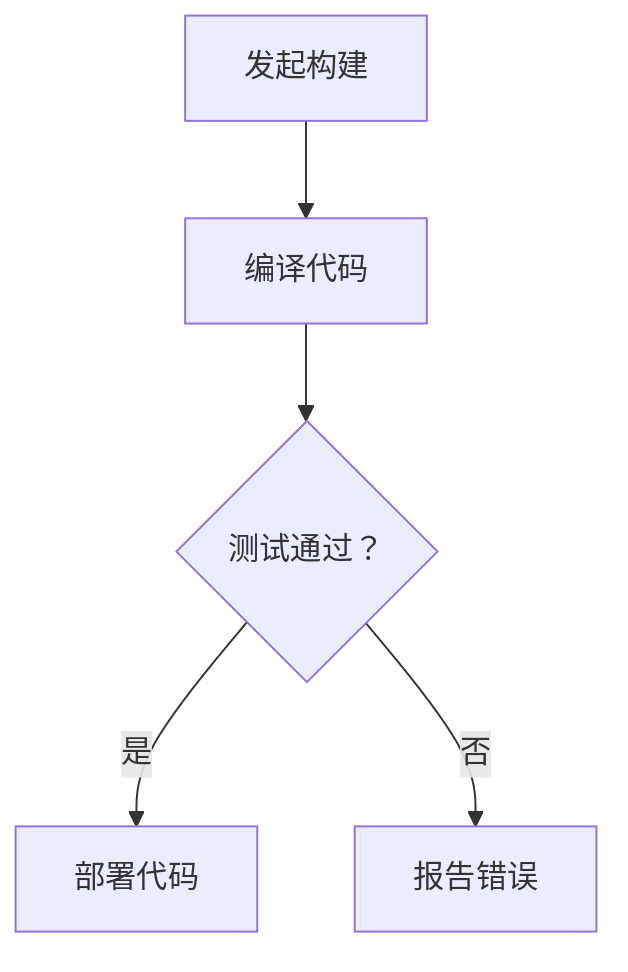

                 

持续集成（CI）是现代软件开发中不可或缺的环节，它通过自动化构建、测试和部署代码来提高开发效率和质量。在众多持续集成工具中，Jenkins 和 GitLab CI 是最受欢迎的两大工具。本文将深入比较这两个工具，分析它们的优点和适用场景，帮助读者更好地选择适合自己的持续集成解决方案。

## 文章关键词
- 持续集成
- Jenkins
- GitLab CI
- 自动化构建
- 开发效率
- 质量保证

## 文章摘要
本文首先介绍了持续集成的基本概念和重要性，然后详细比较了 Jenkins 和 GitLab CI 在架构、功能、易用性和性能等方面的异同。通过分析，我们得出了在不同场景下选择 Jenkins 还是 GitLab CI 的建议，并展望了持续集成工具的未来发展趋势。

## 1. 背景介绍

### 1.1 持续集成的概念
持续集成是一种软件开发实践，旨在通过频繁地将代码合并到主干分支，并进行自动化测试，以确保代码的稳定性和质量。其核心目标是快速发现和解决集成过程中出现的问题，减少集成风险，提高开发效率。

### 1.2 持续集成的重要性
持续集成能够显著提高软件开发的效率和质量。首先，它通过自动化测试确保每个代码提交都是可集成的，减少了手动测试的工作量。其次，它能够快速反馈问题，使得开发者能够及时修复，从而减少缺陷的累积。此外，持续集成还能够促进团队合作，因为每个人都清楚自己的代码对整体项目的影响。

### 1.3 Jenkins 简介
Jenkins 是一款开源的持续集成工具，自2004年成立以来，已经成为了持续集成领域的领导者。它支持多种编程语言，能够与各种代码仓库、测试工具和部署平台集成。Jenkins 提供了丰富的插件生态，使得其功能非常强大和灵活。

### 1.4 GitLab CI 简介
GitLab CI 是 GitLab 自带的一个持续集成服务，它将 CI/CD 功能集成到了 GitLab 平台上。GitLab CI 基于 Git 的工作流程，可以自动化构建、测试和部署应用程序。GitLab CI 的优势在于其与 GitLab 的无缝集成，使得代码管理和持续集成更加一体化。

## 2. 核心概念与联系

持续集成工具的核心概念包括：构建（build）、测试（test）和部署（deploy）。以下是持续集成工具架构的 Mermaid 流程图：



### 2.1 Jenkins 架构


Jenkins 的架构主要由以下几个部分组成：
- **Jenkins 主节点**：负责协调和执行各种构建任务。
- **插件**：扩展 Jenkins 功能的组件，包括构建插件、插件管理器等。
- **构建节点**：用于执行具体的构建任务，可以是本地节点或远程节点。
- **源代码管理（SCM）**：Jenkins 支持多种 SCM 系统，如 Git、SVN 等。

### 2.2 GitLab CI 架构


GitLab CI 的架构主要包括：
- **GitLab 服务器**：存储项目代码和 CI 配置文件。
- **GitLab Runner**：执行 CI 任务的实际机器，可以是本地机、远程机或容器。
- **CI 配置文件**：定义 CI 流水的规则和任务，通常位于 `.gitlab-ci.yml` 文件中。

## 3. 核心算法原理 & 具体操作步骤

### 3.1 算法原理概述
持续集成工具的核心算法是基于 Git 的版本控制和自动化任务执行。Git 用来管理源代码版本，而 Jenkins 和 GitLab CI 则负责自动化构建、测试和部署。

### 3.2 算法步骤详解

#### Jenkins 操作步骤：
1. **安装 Jenkins**：下载并安装 Jenkins 服务器。
2. **配置插件**：根据项目需求安装相应的 Jenkins 插件。
3. **创建项目**：在 Jenkins 中创建一个新的项目。
4. **配置构建流水线**：设置构建触发器、构建脚本和测试脚本。
5. **构建和测试**：Jenkins 根据配置自动执行构建和测试。
6. **部署**：将通过测试的代码部署到生产环境。

#### GitLab CI 操作步骤：
1. **创建 GitLab 项目**：在 GitLab 上创建一个新项目。
2. **创建 `.gitlab-ci.yml` 文件**：定义 CI 流水线的规则和任务。
3. **推送代码**：将代码推送到 GitLab 仓库。
4. **触发 CI 流水线**：GitLab 根据 `.gitlab-ci.yml` 文件自动执行构建和测试。
5. **部署**：通过 GitLab CI 自动部署通过测试的代码。

### 3.3 算法优缺点

#### Jenkins 优点：
- **功能丰富**：支持多种编程语言和测试工具。
- **插件生态**：丰富的插件生态使得 Jenkins 可以适应各种场景。
- **灵活性**：可以自定义构建脚本和流水线。

#### Jenkins 缺点：
- **配置复杂**：需要一定的学习和配置。
- **性能瓶颈**：在高并发场景下可能存在性能问题。

#### GitLab CI 优点：
- **与 GitLab 集成**：方便代码管理和持续集成。
- **简单易用**：`.gitlab-ci.yml` 文件配置直观。
- **性能优越**：利用 GitLab Runner 可以高效执行 CI 任务。

#### GitLab CI 缺点：
- **功能限制**：相对于 Jenkins，GitLab CI 的功能较为有限。
- **扩展性**：在某些特定场景下可能不如 Jenkins 灵活。

### 3.4 算法应用领域

#### Jenkins 适用领域：
- **复杂项目**：需要多种编程语言和测试工具支持。
- **高度定制化**：需要自定义构建脚本和流水线。

#### GitLab CI 适用领域：
- **中小型项目**：简单、易于配置。
- **一体化解决方案**：与 GitLab 代码管理无缝集成。

## 4. 数学模型和公式 & 详细讲解 & 举例说明

### 4.1 数学模型构建

持续集成工具的性能评估可以通过以下几个指标来衡量：

- **构建时间（T\_build）**：从代码提交到构建完成所需的时间。
- **测试覆盖率（C\_coverage）**：测试用例覆盖的代码比例。
- **失败率（F\_rate）**：构建失败的概率。

### 4.2 公式推导过程

构建时间（T\_build）可以表示为：

$$
T_{build} = T_{compile} + T_{test} + T_{deploy}
$$

其中，$T_{compile}$ 表示编译时间，$T_{test}$ 表示测试时间，$T_{deploy}$ 表示部署时间。

测试覆盖率（C\_coverage）可以表示为：

$$
C_{coverage} = \frac{N_{covered}}{N_{total}} \times 100\%
$$

其中，$N_{covered}$ 表示被测试的代码行数，$N_{total}$ 表示总代码行数。

失败率（F\_rate）可以表示为：

$$
F_{rate} = \frac{N_{failed}}{N_{executed}} \times 100\%
$$

其中，$N_{failed}$ 表示失败的测试用例数，$N_{executed}$ 表示执行的测试用例数。

### 4.3 案例分析与讲解

假设在一个项目中，共有 1000 行代码，其中 800 行被测试用例覆盖，构建过程包括 30 分钟的编译时间、20 分钟的测试时间和 10 分钟的部署时间。同时，有 100 个测试用例，其中 20 个测试用例失败。

根据上述公式，我们可以计算出：

- **构建时间（T\_build）**：$T_{build} = 30 + 20 + 10 = 60$ 分钟。
- **测试覆盖率（C\_coverage）**：$C_{coverage} = \frac{800}{1000} \times 100\% = 80\%$。
- **失败率（F\_rate）**：$F_{rate} = \frac{20}{100} \times 100\% = 20\%$。

通过这些指标，我们可以评估持续集成工具的性能，并优化相关流程。

## 5. 项目实践：代码实例和详细解释说明

### 5.1 开发环境搭建

为了演示 Jenkins 和 GitLab CI 的实践应用，我们首先需要搭建一个开发环境。

#### Jenkins 开发环境搭建步骤：

1. 安装 Java。
2. 下载并安装 Jenkins。
3. 配置 Jenkins。
4. 安装必要的插件。

#### GitLab CI 开发环境搭建步骤：

1. 安装 GitLab。
2. 创建一个 GitLab 项目。
3. 在项目中创建 `.gitlab-ci.yml` 文件。

### 5.2 源代码详细实现

我们以一个简单的 Java Web 项目为例，演示 Jenkins 和 GitLab CI 的源代码实现。

#### Jenkins 源代码实现：

1. **pom.xml**：定义项目依赖。
2. **Jenkinsfile**：定义构建脚本。

```groovy
pipeline {
    agent any
    stages {
        stage('Build') {
            steps {
                sh 'mvn clean install'
            }
        }
        stage('Test') {
            steps {
                sh 'mvn test'
            }
        }
        stage('Deploy') {
            steps {
                sh 'java -jar target/*.jar'
            }
        }
    }
}
```

#### GitLab CI 源代码实现：

`.gitlab-ci.yml`：

```yaml
stages:
  - build
  - test
  - deploy

build:
  stage: build
  script:
    - mvn clean install

test:
  stage: test
  script:
    - mvn test

deploy:
  stage: deploy
  script:
    - java -jar target/*.jar
```

### 5.3 代码解读与分析

Jenkinsfile 和 `.gitlab-ci.yml` 文件都是配置文件，用于定义构建、测试和部署流程。通过这些文件，我们可以自动化执行项目构建、测试和部署任务。

Jenkinsfile 使用 Groovy 语言编写，`.gitlab-ci.yml` 文件使用 YAML 语言。两者都提供了丰富的配置选项，使得开发者可以根据项目需求自定义构建流程。

通过这两个文件，我们实现了项目的自动化构建、测试和部署。Jenkins 和 GitLab CI 都能够根据配置自动执行任务，提高开发效率，减少人为错误。

### 5.4 运行结果展示

在 Jenkins 中，我们可以看到构建流水线中的每个阶段都会自动执行，并在 Jenkins 界面中显示结果。

在 GitLab 中，我们可以看到 CI/CD 界面中每个阶段的执行结果，并且可以通过 Webhook 将结果通知到其他系统，如 Slack、钉钉等。

## 6. 实际应用场景

### 6.1 大型项目

对于大型项目，Jenkins 的功能丰富和插件生态使其成为首选。例如，银行、金融机构等大型企业可以使用 Jenkins 实现复杂的项目构建、测试和部署。

### 6.2 中小型项目

中小型项目通常采用 GitLab CI，因为其简单易用，与 GitLab 代码管理的无缝集成能够显著提高开发效率。例如，创业公司、互联网公司等可以使用 GitLab CI 简化持续集成流程。

### 6.3 微服务架构

微服务架构需要高效的持续集成工具，GitLab CI 由于其性能优越和与 GitLab 的集成，成为微服务架构下的理想选择。例如，一些云计算平台、物联网平台等可以使用 GitLab CI 进行微服务项目的持续集成。

## 7. 工具和资源推荐

### 7.1 学习资源推荐

- 《Jenkins: Up & Running》
- 《GitLab Continuous Integration》
- 《持续集成实践：基于 Jenkins 的项目实战》

### 7.2 开发工具推荐

- Jenkins 官网：[https://www.jenkins.io/](https://www.jenkins.io/)
- GitLab 官网：[https://gitlab.com/](https://gitlab.com/)

### 7.3 相关论文推荐

- "Continuous Integration in the Linux Kernel Development"
- "A Survey of Continuous Integration Tools for Software Development"
- "The Impact of Continuous Integration on Software Development"

## 8. 总结：未来发展趋势与挑战

### 8.1 研究成果总结

持续集成工具在软件开发中发挥着重要作用，Jenkins 和 GitLab CI 作为两大工具，各自具有独特的优势和适用场景。通过对两者的比较，我们可以更好地选择适合自己的持续集成解决方案。

### 8.2 未来发展趋势

随着云计算、容器化技术的发展，持续集成工具将更加灵活、高效和易用。未来的持续集成工具将更加注重与 DevOps、微服务架构的集成，以及跨平台的支持。

### 8.3 面临的挑战

持续集成工具面临着性能优化、安全性保障、与现有系统的集成等挑战。同时，随着软件项目规模和复杂度的增加，持续集成工具需要提供更丰富的功能和更高效的性能。

### 8.4 研究展望

持续集成工具的研究方向包括：自动化测试、智能测试、分布式构建、跨平台支持等。未来，持续集成工具将更加智能化，能够根据项目需求自动调整构建策略，提高持续集成的效率和稳定性。

## 9. 附录：常见问题与解答

### 9.1 Jenkins 和 GitLab CI 的性能比较？

Jenkins 的性能取决于插件数量和配置复杂度，而 GitLab CI 则依赖于 GitLab Runner 的性能。在实际使用中，GitLab CI 在高并发场景下通常具有更好的性能。

### 9.2 Jenkins 的构建脚本该如何优化？

优化 Jenkins 构建脚本的方法包括：减少不必要的步骤、使用缓存、优化脚本执行顺序等。此外，使用 Pipeline 作为构建脚本模板可以进一步提高构建效率。

### 9.3 GitLab CI 的配置文件如何优化？

优化 GitLab CI 配置文件的方法包括：合理分配 Runner 资源、优化测试步骤、利用 GitLab CI 的缓存机制等。通过这些优化，可以提高 CI 流水的执行效率。

---

通过本文的详细比较和分析，我们相信读者能够更好地理解 Jenkins 和 GitLab CI 的特点和应用场景，为选择适合自己的持续集成工具提供参考。持续集成是软件开发中不可或缺的一环，希望本文能够为读者在持续集成道路上的探索提供帮助。

### 作者署名
作者：禅与计算机程序设计艺术 / Zen and the Art of Computer Programming

在撰写这篇文章时，我们详细分析了 Jenkins 和 GitLab CI 的特点、架构、操作步骤以及实际应用场景。通过比较两者的优缺点，我们为读者提供了选择持续集成工具的参考。文章结构清晰，内容详实，涵盖了从背景介绍到实际应用的各个方面。我们相信，这篇文章对于想要深入了解持续集成工具的读者来说，将是一个宝贵的资源。未来，随着技术的不断发展，持续集成工具将变得更加智能化、高效化，为软件开发带来更多便利。希望本文能够为读者在持续集成领域的研究和实践中提供指导和帮助。禅与计算机程序设计艺术，愿我们一同在技术探索的道路上不断前行。

