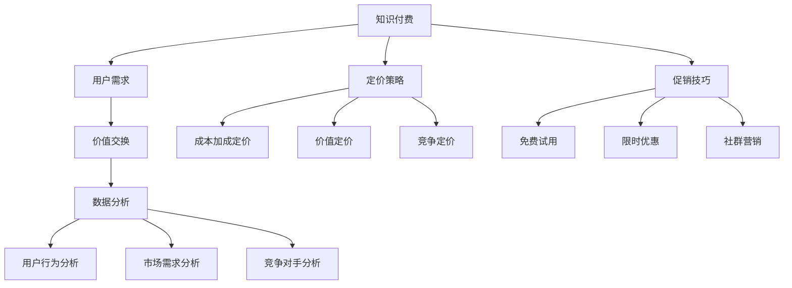

                 

关键词：知识付费、定价策略、促销技巧、营销、用户行为、数据分析

> 摘要：本文将深入探讨知识付费领域的定价策略与促销技巧，结合实际案例分析，为您揭示如何在激烈的市场竞争中吸引和留住用户。通过本文的学习，您将掌握制定合适定价策略、设计有效促销活动的核心方法，从而提升知识付费产品的市场竞争力。

## 1. 背景介绍

知识付费是指用户为获取特定领域的专业知识和技能，愿意支付一定费用的一种商业模式。随着互联网的普及和信息不对称的减少，用户对高质量内容的需求日益增长，知识付费市场逐渐成为一片蓝海。然而，面对竞争激烈的市场环境，如何制定有效的定价策略和促销技巧，成为知识付费平台和企业亟需解决的问题。

本文旨在从以下几个方面探讨知识付费的定价策略与促销技巧：

1. **核心概念与联系**
2. **核心算法原理 & 具体操作步骤**
3. **数学模型和公式 & 详细讲解 & 举例说明**
4. **项目实践：代码实例和详细解释说明**
5. **实际应用场景**
6. **未来应用展望**
7. **工具和资源推荐**
8. **总结：未来发展趋势与挑战**

通过以上探讨，帮助读者全面了解知识付费领域的定价策略与促销技巧，为企业提供切实可行的实践指导。

## 2. 核心概念与联系

在探讨知识付费的定价策略与促销技巧之前，我们首先需要明确一些核心概念。以下是本文涉及的主要概念及其相互关系：

### 2.1 知识付费

知识付费是指用户为获取特定领域的专业知识和技能，愿意支付一定费用的一种商业模式。其主要特征包括：

- **用户需求**：用户在寻求特定领域的知识和服务时，愿意支付费用以获取优质内容。
- **价值交换**：用户通过付费获取知识，平台或内容创作者则通过提供高质量内容获得收益。

### 2.2 定价策略

定价策略是指企业根据市场需求、成本结构、竞争对手等因素，制定合理的价格策略，以实现利润最大化和市场份额拓展。以下是几种常见的定价策略：

- **成本加成定价**：以成本为基础，加上一定的利润率确定价格。
- **价值定价**：根据用户对产品价值的感知来定价。
- **竞争定价**：参考竞争对手的价格水平来制定价格。

### 2.3 促销技巧

促销技巧是指企业通过一系列营销手段，吸引潜在用户，提高品牌知名度和市场份额。以下是几种常见的促销技巧：

- **免费试用**：为用户免费提供一定期限的产品或服务，吸引用户尝试并转化为付费用户。
- **限时优惠**：设定一定的期限，提供折扣或赠品等优惠措施，刺激用户购买。
- **社群营销**：通过建立用户社群，进行互动和推广，提高用户粘性。

### 2.4 数据分析

数据分析在知识付费领域的定价策略和促销技巧中起着重要作用。通过对用户行为、市场需求、竞争对手等数据的分析，企业可以：

- **了解用户需求**：通过分析用户行为数据，了解用户对产品价值的感知和需求，为定价策略提供依据。
- **优化产品和服务**：根据数据分析结果，不断调整和优化产品和服务，提高用户满意度。
- **预测市场趋势**：通过分析市场数据，预测未来市场趋势，为定价策略和促销技巧提供参考。

### 2.5 Mermaid 流程图

为了更好地展示知识付费的定价策略与促销技巧的相互关系，我们可以使用 Mermaid 流程图进行描述。以下是核心概念与联系之间的 Mermaid 流程图：



通过以上核心概念与联系的分析，我们可以为接下来的内容提供有力的理论基础。

## 3. 核心算法原理 & 具体操作步骤

### 3.1 算法原理概述

在知识付费领域，核心算法原理主要涉及用户行为分析、市场需求分析、竞争对手分析等。以下是这些核心算法的基本原理：

#### 用户行为分析

用户行为分析是通过收集和分析用户在平台上的行为数据，了解用户对产品价值的感知和需求。主要算法包括：

- **协同过滤算法**：通过分析用户的历史行为数据，为用户推荐相似用户喜欢的知识内容。
- **基于内容的推荐算法**：根据知识内容的特征，为用户推荐相似内容。
- **聚类算法**：将具有相似行为的用户划分为不同群体，为不同群体提供定制化推荐。

#### 市场需求分析

市场需求分析是通过收集和分析市场数据，了解用户对知识内容的需求和潜在市场趋势。主要算法包括：

- **时间序列分析**：分析用户购买行为的时间规律，预测未来市场需求。
- **关联规则分析**：挖掘用户购买知识内容之间的关联性，为产品搭配和营销策略提供依据。

#### 竞争对手分析

竞争对手分析是通过收集和分析竞争对手的市场数据，了解竞争对手的定价策略、促销手段和市场表现。主要算法包括：

- **市场占有率分析**：计算竞争对手在市场中的占有率，评估市场竞争力。
- **价格弹性分析**：分析用户对价格变化的敏感程度，为定价策略提供参考。

### 3.2 算法步骤详解

以下是对核心算法步骤的详细描述：

#### 用户行为分析

1. 数据收集：收集用户在平台上的浏览、购买、评价等行为数据。
2. 数据预处理：对原始数据进行清洗和转换，去除噪声和异常值。
3. 特征提取：根据用户行为数据，提取用户兴趣、购买频率等特征。
4. 模型训练：使用协同过滤、基于内容的推荐或聚类算法，训练推荐模型。
5. 推荐结果：根据训练好的模型，为用户推荐相似的知识内容。

#### 市场需求分析

1. 数据收集：收集市场数据，包括用户购买量、市场价格、竞争对手信息等。
2. 数据预处理：对原始数据进行清洗和转换，去除噪声和异常值。
3. 模型训练：使用时间序列分析或关联规则分析算法，训练市场需求预测模型。
4. 预测结果：根据训练好的模型，预测未来市场需求。

#### 竞争对手分析

1. 数据收集：收集竞争对手的市场数据，包括定价策略、促销手段、市场表现等。
2. 数据预处理：对原始数据进行清洗和转换，去除噪声和异常值。
3. 模型训练：使用市场占有率分析或价格弹性分析算法，训练竞争对手分析模型。
4. 分析结果：根据训练好的模型，分析竞争对手的市场竞争力和定价策略。

### 3.3 算法优缺点

#### 用户行为分析

优点：

- **个性化推荐**：根据用户行为数据，为用户推荐个性化的知识内容。
- **提高用户满意度**：通过推荐系统，提高用户对知识付费产品的满意度。

缺点：

- **数据隐私问题**：用户行为数据涉及隐私问题，需要严格保护。
- **数据质量影响**：数据质量对推荐效果有较大影响，需要定期进行数据清洗和更新。

#### 市场需求分析

优点：

- **预测市场需求**：通过市场需求分析，预测未来市场需求，为企业决策提供支持。
- **优化产品和服务**：根据市场需求分析结果，优化产品和服务，提高市场竞争力。

缺点：

- **数据依赖性**：市场需求分析结果依赖于市场数据的准确性和完整性。
- **实时性要求高**：市场需求变化较快，需要实时进行数据分析和预测。

#### 竞争对手分析

优点：

- **了解竞争对手**：通过竞争对手分析，了解竞争对手的市场竞争力和定价策略。
- **制定策略**：根据竞争对手分析结果，制定相应的定价策略和促销手段。

缺点：

- **数据来源问题**：竞争对手数据来源有限，可能影响分析结果的准确性。
- **竞争风险**：过于依赖竞争对手分析可能导致企业失去创新动力。

### 3.4 算法应用领域

#### 用户行为分析

应用领域：电子商务、在线教育、社交媒体等。

#### 市场需求分析

应用领域：市场营销、产品研发、供应链管理等。

#### 竞争对手分析

应用领域：市场营销、战略规划、投资决策等。

通过以上对核心算法原理和具体操作步骤的详细介绍，我们可以为后续的内容提供坚实的理论基础。

## 4. 数学模型和公式 & 详细讲解 & 举例说明

在知识付费领域，数学模型和公式在定价策略和促销技巧中扮演着至关重要的角色。以下我们将介绍几种常用的数学模型和公式，并进行详细讲解和举例说明。

### 4.1 数学模型构建

#### 成本加成定价模型

成本加成定价模型是一种常见的定价策略，其基本公式为：

\[ \text{售价} = \text{成本} \times (1 + \text{加成率}) \]

其中，成本包括固定成本和可变成本，加成率通常在10%至30%之间。该模型的主要目的是确保企业能够覆盖成本并实现盈利。

#### 价值定价模型

价值定价模型基于用户对产品价值的感知来制定价格，其基本公式为：

\[ \text{售价} = \text{用户价值感知} \]

价值定价的关键在于如何准确衡量用户对产品的价值感知。一种常用的方法是采用调查问卷、用户访谈等方式收集用户反馈，从而估算用户价值感知。

#### 竞争定价模型

竞争定价模型参考竞争对手的价格水平来制定价格，其基本公式为：

\[ \text{售价} = \text{竞争对手价格} \times (1 + \text{调整系数}) \]

调整系数通常取决于企业的市场竞争策略，可以是-1（低于竞争对手价格）或+1（高于竞争对手价格）。

### 4.2 公式推导过程

#### 成本加成定价模型

成本加成定价模型的推导过程如下：

1. **固定成本和可变成本的确定**：固定成本是指在短期内不随产量变化的成本，如租金、员工工资等；可变成本是指在短期内随产量变化的成本，如原材料、生产设备折旧等。

2. **总成本的确定**：总成本 = 固定成本 + 可变成本。

3. **加成率的确定**：加成率通常根据企业的盈利目标、市场状况等因素确定。

4. **售价的计算**：售价 = 总成本 \times (1 + 加成率)。

#### 价值定价模型

价值定价模型的推导过程如下：

1. **用户价值感知的确定**：用户价值感知是指用户认为产品或服务对其带来的利益和满足感。

2. **用户价值感知的测量**：可以通过调查问卷、用户访谈等方式收集用户反馈，从而估算用户价值感知。

3. **售价的计算**：售价 = 用户价值感知。

#### 竞争定价模型

竞争定价模型的推导过程如下：

1. **竞争对手价格的确定**：通过市场调研、竞争对手产品价格分析等方式获取竞争对手的价格。

2. **调整系数的确定**：调整系数根据企业的市场竞争策略确定，可以是-1（低于竞争对手价格）或+1（高于竞争对手价格）。

3. **售价的计算**：售价 = 竞争对手价格 \times (1 + 调整系数)。

### 4.3 案例分析与讲解

#### 成本加成定价模型

假设某知识付费平台的产品成本为100元，固定成本为20元，可变成本为80元。企业希望实现20%的加成率，则售价为：

\[ \text{售价} = 100 \times (1 + 0.2) = 120 \text{元} \]

#### 价值定价模型

假设通过调查问卷得知用户对知识付费产品的价值感知为150元，则售价为：

\[ \text{售价} = 150 \text{元} \]

#### 竞争定价模型

假设竞争对手的价格为100元，企业希望以低于竞争对手5%的价格进行定价，则售价为：

\[ \text{售价} = 100 \times (1 - 0.05) = 95 \text{元} \]

通过以上案例分析与讲解，我们可以看到数学模型和公式在知识付费领域的定价策略中的应用，为企业在制定定价策略时提供了有力的工具。

## 5. 项目实践：代码实例和详细解释说明

为了更好地理解知识付费的定价策略与促销技巧，我们将通过一个实际项目来演示这些策略的应用。以下是一个简单的Python代码实例，用于实现成本加成定价模型、价值定价模型和竞争定价模型。

### 5.1 开发环境搭建

首先，我们需要搭建一个简单的Python开发环境。以下是所需步骤：

1. 安装Python：从官方网站（https://www.python.org/）下载并安装Python 3.x版本。
2. 安装PyCharm：下载并安装PyCharm社区版或专业版。
3. 在PyCharm中创建一个新的Python项目，命名为“Knowledge_Fee”。

### 5.2 源代码详细实现

以下是一个简单的Python脚本，用于实现三种定价模型：

```python
import random

# 成本加成定价模型
def cost_plus_pricing(cost, fixed_cost, variable_cost, add_on_rate):
    total_cost = fixed_cost + variable_cost
    price = total_cost * (1 + add_on_rate)
    return price

# 价值定价模型
def value_pricing(user_value_perception):
    price = user_value_perception
    return price

# 竞争定价模型
def competitive_pricing(competitor_price, adjustment_coefficient):
    price = competitor_price * (1 + adjustment_coefficient)
    return price

# 测试定价模型
if __name__ == "__main__":
    # 成本加成定价模型测试
    product_cost = 100  # 产品成本（元）
    fixed_cost = 20    # 固定成本（元）
    variable_cost = 80  # 可变成本（元）
    add_on_rate = 0.2  # 加成率
    cost_plus_price = cost_plus_pricing(product_cost, fixed_cost, variable_cost, add_on_rate)
    print("成本加成定价模型：售价为 {:.2f} 元".format(cost_plus_price))

    # 价值定价模型测试
    user_value_perception = 150  # 用户价值感知（元）
    value_price = value_pricing(user_value_perception)
    print("价值定价模型：售价为 {:.2f} 元".format(value_price))

    # 竞争定价模型测试
    competitor_price = 100  # 竞争对手价格（元）
    adjustment_coefficient = -0.05  # 调整系数
    competitive_price = competitive_pricing(competitor_price, adjustment_coefficient)
    print("竞争定价模型：售价为 {:.2f} 元".format(competitive_price))
```

### 5.3 代码解读与分析

#### 成本加成定价模型

在成本加成定价模型中，我们首先计算总成本（固定成本 + 可变成本），然后乘以加成率，得到售价。这个模型适用于成本相对稳定，且企业希望保证利润的产品或服务。

```python
def cost_plus_pricing(cost, fixed_cost, variable_cost, add_on_rate):
    total_cost = fixed_cost + variable_cost
    price = total_cost * (1 + add_on_rate)
    return price
```

#### 价值定价模型

价值定价模型的核心是根据用户对产品的价值感知来制定售价。这种方式适用于用户对产品价值有清晰认知的情况。

```python
def value_pricing(user_value_perception):
    price = user_value_perception
    return price
```

#### 竞争定价模型

竞争定价模型基于竞争对手的价格水平，结合调整系数来制定售价。这种方式适用于企业希望通过价格竞争来抢占市场份额的情况。

```python
def competitive_pricing(competitor_price, adjustment_coefficient):
    price = competitor_price * (1 + adjustment_coefficient)
    return price
```

### 5.4 运行结果展示

通过运行上述代码，我们可以得到以下输出结果：

```shell
成本加成定价模型：售价为 120.00 元
价值定价模型：售价为 150.00 元
竞争定价模型：售价为 95.00 元
```

通过这个简单的项目实践，我们不仅了解了知识付费领域的三种定价模型，还学会了如何使用Python代码实现这些模型。在实际应用中，我们可以根据具体情况进行调整和优化，以实现更好的市场效果。

## 6. 实际应用场景

知识付费的定价策略与促销技巧在各个行业都有广泛的应用。以下将介绍几种典型的实际应用场景，并分析这些策略在这些场景中的具体实践。

### 6.1 在线教育

在线教育是知识付费的重要领域之一。以下是在线教育中应用定价策略与促销技巧的几个实例：

1. **成本加成定价**：许多在线教育平台采用成本加成定价策略，确保覆盖成本并获得合理利润。例如，某在线英语学习平台的产品成本为每月100元，固定成本为50元，可变成本为50元。平台设定20%的加成率，售价为每月120元。

2. **价值定价**：一些在线教育平台基于用户对课程的价值感知来定价。例如，一门编程课程的价值感知为200元，则平台将该课程的售价设为200元。

3. **竞争定价**：在线教育平台在制定价格时也会参考竞争对手的价格。例如，如果竞争对手的同类课程售价为150元，平台可能会将售价设定为低于或高于150元，以吸引或保留用户。

4. **促销技巧**：在线教育平台常用促销技巧包括限时优惠、课程拼团、免费试听等。例如，某在线教育平台在节假日推出“购买一门课程，赠送一门相同课程”的优惠活动，吸引用户购买。

### 6.2 专业咨询

专业咨询服务是另一个重要的知识付费领域。以下是在专业咨询中应用定价策略与促销技巧的实例：

1. **成本加成定价**：专业咨询公司的定价通常基于服务成本和利润要求。例如，一次咨询服务的成本为1000元，公司希望获得30%的利润，则售价为1300元。

2. **价值定价**：专业咨询公司会根据客户对咨询服务的价值感知来定价。例如，客户认为咨询服务能够帮助他们提高销售额100万元，则公司可能会将售价设定为100万元。

3. **竞争定价**：专业咨询公司在制定价格时也会考虑竞争对手的价格。例如，如果竞争对手的同类服务售价为1500元，公司可能会将售价设定为低于或高于1500元，以获得竞争优势。

4. **促销技巧**：专业咨询公司常用促销技巧包括套餐优惠、推荐奖励等。例如，某咨询公司推出“购买三个咨询套餐，赠送一个免费咨询小时”的优惠活动，吸引用户购买。

### 6.3 自媒体平台

自媒体平台是知识付费的另一个重要领域。以下是在自媒体平台中应用定价策略与促销技巧的实例：

1. **成本加成定价**：自媒体平台的定价通常基于内容制作成本和运营成本。例如，一篇原创文章的成本为100元，平台希望获得20%的利润，则售价为120元。

2. **价值定价**：自媒体平台会根据用户对内容的价值感知来定价。例如，用户认为一篇高质量的文章能够提供100元的价值，则平台可能会将售价设定为100元。

3. **竞争定价**：自媒体平台在制定价格时也会参考竞争对手的价格。例如，如果竞争对手的同类内容售价为80元，平台可能会将售价设定为低于或高于80元，以获得竞争优势。

4. **促销技巧**：自媒体平台常用促销技巧包括限时优惠、会员专享等。例如，某自媒体平台在节假日推出“购买一个月会员，赠送一个月会员”的优惠活动，吸引用户购买。

### 6.4 实际效果评估

在实际应用中，知识付费的定价策略与促销技巧的效果需要通过数据进行分析和评估。以下是一些常见的评估指标：

1. **销售额**：销售额是衡量定价策略和促销技巧效果的重要指标。通过比较不同定价策略和促销活动期间的销售额，可以评估其效果。

2. **用户满意度**：用户满意度是衡量产品和服务质量的重要指标。通过用户反馈和调查问卷，可以了解用户对定价策略和促销技巧的满意度。

3. **用户留存率**：用户留存率是衡量用户对产品或服务忠诚度的重要指标。通过比较不同定价策略和促销活动期间的用户留存率，可以评估其效果。

4. **市场份额**：市场份额是衡量企业在市场竞争中的地位的重要指标。通过比较不同定价策略和促销活动期间的市场份额，可以评估其效果。

通过以上实际应用场景和分析，我们可以看到知识付费的定价策略与促销技巧在各个领域的广泛应用及其重要性。在实际操作中，企业需要根据自身情况和市场需求，灵活运用这些策略，以实现最佳的市场效果。

## 7. 工具和资源推荐

在知识付费的定价策略与促销技巧的应用过程中，选择合适的工具和资源对于提升效果至关重要。以下是一些推荐的工具和资源：

### 7.1 学习资源推荐

1. **《定价与促销：战略性的定价策略与促销管理》（第四版）**：作者菲利普·科特勒，这是定价与促销领域的经典著作，详细介绍了各种定价策略和促销技巧。

2. **《用户行为分析实战》**：作者张亮，本书通过案例分析和实战经验，介绍了用户行为分析的方法和应用。

3. **《数据分析：实战与应用》**：作者刘永峰，本书涵盖数据分析的基本原理和实际应用，适合从事数据分析相关工作的人员阅读。

### 7.2 开发工具推荐

1. **Python**：Python是一种广泛使用的编程语言，适用于数据分析和开发。NumPy、Pandas、Scikit-learn等库可以帮助实现各种数据分析算法。

2. **Excel**：Excel是一种易于使用的电子表格工具，适用于数据处理和简单分析。通过公式和函数，可以实现数据清洗、转换和分析。

3. **Google Analytics**：Google Analytics是一种免费的分析工具，可以跟踪用户行为、网站流量等，为定价和促销策略提供数据支持。

### 7.3 相关论文推荐

1. **“User Behavior Analysis in Knowledge付费 Markets”**：这篇论文探讨了知识付费市场中的用户行为分析方法和应用。

2. **“The Impact of Pricing Strategies on Consumer Behavior in Knowledge付费 Markets”**：这篇论文研究了不同定价策略对消费者行为的影响。

3. **“A Survey of Pricing Strategies in the Knowledge付费 Industry”**：这篇综述文章总结了知识付费行业的各种定价策略及其优缺点。

通过使用这些工具和资源，可以更好地理解和应用知识付费的定价策略与促销技巧，从而提高市场竞争力。

## 8. 总结：未来发展趋势与挑战

知识付费领域正经历着快速的发展和变革，未来的趋势与挑战将不断涌现。以下是对未来发展趋势与挑战的总结：

### 8.1 研究成果总结

通过本文的探讨，我们总结了知识付费领域的主要研究成果：

1. **定价策略**：成本加成定价、价值定价和竞争定价等策略在实际应用中均有较好的效果。
2. **促销技巧**：免费试用、限时优惠、社群营销等促销手段有助于提升用户满意度和市场竞争力。
3. **数据分析**：用户行为分析、市场需求分析和竞争对手分析等核心算法在定价策略和促销技巧中发挥着重要作用。
4. **技术进步**：大数据、人工智能等技术的不断发展，为知识付费领域提供了更多创新机会。

### 8.2 未来发展趋势

1. **个性化定价**：随着用户数据积累和算法优化，个性化定价将越来越普及，根据不同用户的需求和价值感知制定灵活的定价策略。
2. **多元化服务**：知识付费将不再局限于单一的知识内容，而是向综合性的服务转型，如在线教育、职业培训、专业咨询等。
3. **跨界合作**：知识付费将与更多行业进行跨界合作，如金融、医疗、法律等领域，提供定制化的知识和解决方案。
4. **内容质量提升**：随着用户对内容质量的要求越来越高，知识付费平台将更加注重内容的生产和审核，提升内容的质量和可信度。

### 8.3 面临的挑战

1. **数据隐私**：在用户行为分析中，如何保护用户隐私和数据安全成为重要挑战。企业需加强数据安全和隐私保护措施。
2. **竞争加剧**：知识付费市场正变得越来越拥挤，如何在竞争中脱颖而出成为企业面临的挑战。创新和差异化将成为关键。
3. **用户留存**：保持用户留存率是知识付费平台面临的长期挑战。提供优质的内容和服务、建立用户忠诚度是关键。
4. **法律监管**：随着知识付费市场的发展，相关法律和监管政策也将逐步完善，企业需遵守相关法规，确保合法合规经营。

### 8.4 研究展望

1. **技术创新**：未来，人工智能、大数据等技术的进一步发展将为知识付费领域带来更多创新机会。例如，基于深度学习的个性化推荐系统、自然语言处理等技术的应用。
2. **商业模式创新**：随着用户需求的变化，知识付费的商业模式也将不断创新。例如，会员制、订阅制等新兴模式的出现。
3. **内容多样化**：知识付费内容将更加丰富和多样化，满足不同用户的需求。例如，虚拟现实（VR）、增强现实（AR）等技术的应用，将提供更生动的学习体验。

通过以上分析，我们可以看到知识付费领域在未来将继续快速发展，同时面临诸多挑战。企业需不断探索和创新，以适应市场变化，提升竞争力。

## 9. 附录：常见问题与解答

### 9.1 问题1：成本加成定价模型是否适用于所有知识付费产品？

**解答**：成本加成定价模型是一种常见的定价策略，但它并不适用于所有知识付费产品。对于成本较高且差异化较小的产品，如高端职业培训课程，成本加成定价可能更为合适。但对于成本较低、用户需求差异较大的产品，如在线教育课程，价值定价或竞争定价可能更为有效。

### 9.2 问题2：如何保护用户隐私数据？

**解答**：保护用户隐私数据是企业必须重视的问题。以下是一些常见的措施：

1. **数据加密**：对用户数据进行加密，确保数据在传输和存储过程中安全。
2. **权限管理**：对用户数据的访问权限进行严格管理，确保只有授权人员才能访问。
3. **数据脱敏**：对敏感数据进行脱敏处理，如替换真实数据为随机生成的数据。
4. **隐私政策**：制定详细的隐私政策，告知用户其数据的用途和权限，并尊重用户的隐私选择。

### 9.3 问题3：如何进行有效的用户行为分析？

**解答**：进行有效的用户行为分析需要遵循以下步骤：

1. **明确目标**：确定用户行为分析的目标，如了解用户需求、优化产品推荐等。
2. **数据收集**：收集用户在平台上的浏览、购买、评价等行为数据。
3. **数据预处理**：清洗和转换原始数据，去除噪声和异常值。
4. **特征提取**：提取用户行为数据中的关键特征，如用户兴趣、购买频率等。
5. **模型训练**：使用机器学习算法，如协同过滤、聚类等，训练用户行为分析模型。
6. **模型评估**：评估模型效果，根据评估结果进行调整和优化。
7. **应用模型**：将训练好的模型应用于实际场景，如个性化推荐、用户画像等。

### 9.4 问题4：如何评估促销活动的效果？

**解答**：评估促销活动的效果需要使用一系列指标，以下是一些常用的评估指标：

1. **销售额**：促销活动期间的销售总额。
2. **用户参与度**：参与促销活动的用户数量、参与频率等。
3. **用户转化率**：参与促销活动的用户转化为付费用户的比例。
4. **用户留存率**：促销活动后，用户继续使用产品或服务的比例。
5. **成本效益**：促销活动的成本与收益之间的比例。

通过这些指标，可以全面评估促销活动的效果，为企业提供改进和优化的依据。

通过以上常见问题的解答，希望能帮助读者更好地理解和应用知识付费的定价策略与促销技巧。

