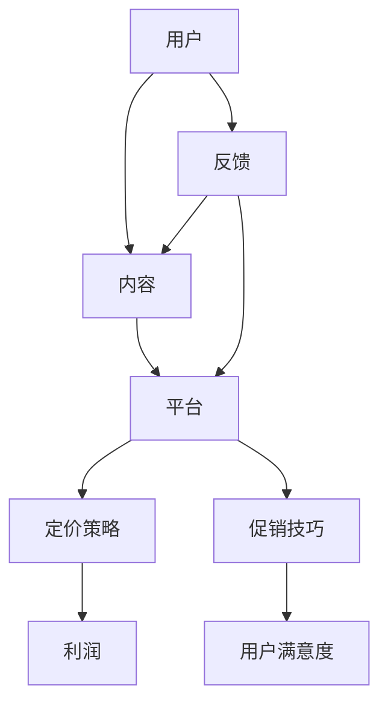

                 

关键词：知识付费、定价策略、促销技巧、用户心理、市场分析、案例分析

> 摘要：本文旨在深入探讨知识付费领域的定价策略与促销技巧，通过分析用户心理、市场环境以及成功案例，为从事知识付费服务的从业者提供切实可行的策略和方法。

## 1. 背景介绍

随着互联网技术的飞速发展，知识付费逐渐成为主流消费模式之一。人们对于高质量、有深度的内容需求日益增加，推动了知识付费市场的繁荣。在这个背景下，如何制定合理的定价策略和有效的促销技巧，成为了知识付费平台和内容创作者关注的焦点。

本文将从以下几个方面展开讨论：

1. **用户心理分析**：探讨用户在知识付费消费中的心理机制，为定价和促销提供依据。
2. **市场环境分析**：分析当前知识付费市场的发展趋势，为策略制定提供参考。
3. **核心概念与联系**：介绍知识付费的核心概念及其相互关系，使用Mermaid流程图展示。
4. **定价策略**：详细阐述定价策略的原理和方法，结合实际案例分析。
5. **促销技巧**：探讨促销活动的形式、目标和实施策略。
6. **项目实践**：通过代码实例和详细解释说明，展示知识付费平台搭建的实践过程。
7. **实际应用场景**：分析知识付费在不同领域的应用，探讨未来发展方向。
8. **工具和资源推荐**：推荐学习资源、开发工具和相关论文。
9. **总结**：总结研究成果，展望未来发展趋势与挑战。

## 2. 核心概念与联系

知识付费涉及多个核心概念，包括用户、内容、平台、定价和促销等。下面使用Mermaid流程图展示这些概念及其相互关系：



- **用户**：知识付费的消费主体，其需求和满意度直接影响平台的盈利。
- **内容**：知识付费的核心产品，质量是用户满意度的关键因素。
- **平台**：提供知识付费服务的载体，包括内容创作、定价、支付、学习等功能。
- **定价策略**：根据市场需求、内容成本和用户价值，制定合理的价格。
- **促销技巧**：通过各种手段，如优惠券、限时特价等，吸引和留住用户。

## 3. 核心算法原理 & 具体操作步骤

### 3.1 算法原理概述

知识付费的定价和促销策略需要基于用户心理和市场环境，通过数据分析制定。核心算法原理包括：

1. **需求分析**：通过用户调查和市场分析，了解用户需求。
2. **成本计算**：计算内容创作、运营、推广等成本。
3. **价值评估**：评估用户对知识内容的价值感知。
4. **定价模型**：构建定价模型，包括成本定价、竞争定价和感知价值定价。
5. **促销策略**：设计促销活动，如限时特价、优惠券等。

### 3.2 算法步骤详解

1. **需求分析**：
    - **问卷调查**：设计用户满意度、需求调查问卷。
    - **数据分析**：收集用户行为数据，分析需求趋势。

2. **成本计算**：
    - **直接成本**：如内容创作成本、服务器费用等。
    - **间接成本**：如营销费用、人工成本等。

3. **价值评估**：
    - **问卷调查**：通过用户反馈了解内容价值。
    - **市场调研**：分析同类产品价格和用户接受度。

4. **定价模型**：
    - **成本定价**：以成本为中心，保证利润。
    - **竞争定价**：参考竞争对手价格，制定相近策略。
    - **感知价值定价**：基于用户价值感知，制定合适价格。

5. **促销策略**：
    - **优惠券**：提供一定比例的折扣。
    - **限时特价**：在特定时间提供优惠。
    - **捆绑销售**：将多个内容组合销售，提高客单价。

### 3.3 算法优缺点

- **优点**：
  - **针对性**：根据用户需求和成本制定策略，提高满意度。
  - **灵活性**：多种定价模型和促销策略，适应不同市场环境。

- **缺点**：
  - **复杂性**：需要大量数据分析和模型构建。
  - **风险**：定价过高可能导致用户流失，定价过低可能降低盈利。

### 3.4 算法应用领域

知识付费的定价和促销策略广泛应用于在线教育、专业技能培训、知识分享等领域。不同领域的应用策略略有不同，但核心思想一致。

## 4. 数学模型和公式 & 详细讲解 & 举例说明

### 4.1 数学模型构建

知识付费的定价和促销策略可以基于以下数学模型：

1. **需求函数**：
   $$ Q = f(P, C, X) $$
   其中，$Q$ 是需求量，$P$ 是价格，$C$ 是消费者对内容的成本感知，$X$ 是其他影响因素，如品牌、口碑等。

2. **利润函数**：
   $$ \Pi = R - C $$
   其中，$R$ 是总收入，$C$ 是总成本。

3. **促销效果模型**：
   $$ E = f(A, B, X) $$
   其中，$E$ 是促销效果，$A$ 是促销力度，$B$ 是用户接受度，$X$ 是其他影响因素。

### 4.2 公式推导过程

- **需求函数推导**：
  - **成本感知**：消费者对内容的成本感知与实际成本不完全一致，可通过调查和数据分析确定。
  - **价格弹性**：价格变动对需求量的影响程度，可用弹性系数表示。

- **利润函数推导**：
  - **收入**：收入与价格和需求量有关，可以通过需求函数推导。
  - **成本**：包括固定成本和可变成本，固定成本如服务器费用，可变成本如内容创作成本。

- **促销效果模型推导**：
  - **促销力度**：如折扣比例、限时特价等。
  - **用户接受度**：取决于用户对促销活动的认知和兴趣。

### 4.3 案例分析与讲解

以在线教育平台为例，分析其定价和促销策略：

1. **需求分析**：
   - **用户调查**：通过问卷调查了解用户对课程价格的接受程度。
   - **数据分析**：分析用户购买行为和课程反馈。

2. **成本计算**：
   - **直接成本**：如课程录制、编辑、上传等。
   - **间接成本**：如营销费用、服务器维护等。

3. **价值评估**：
   - **问卷调查**：了解用户对课程价值的感知。
   - **市场调研**：分析同类课程的价格和用户评价。

4. **定价模型**：
   - **成本定价**：以课程成本为基础，加上一定利润。
   - **感知价值定价**：根据用户价值感知制定价格。

5. **促销策略**：
   - **优惠券**：提供一定比例的折扣，吸引用户购买。
   - **限时特价**：在特定时间提供优惠，提高购买意愿。

## 5. 项目实践：代码实例和详细解释说明

### 5.1 开发环境搭建

假设使用Python进行知识付费平台的后端开发，开发环境如下：

- Python版本：3.8
- Django框架：3.2
- PostgreSQL数据库：13

### 5.2 源代码详细实现

以下是知识付费平台的一个简化版实现，主要涉及用户注册、课程购买和支付功能。

```python
# 用户注册
def register_user(username, password):
    # 验证用户名和密码
    # 创建用户记录
    # 返回用户信息

# 课程购买
def buy_course(course_id, user_id):
    # 检查用户余额
    # 更新用户余额
    # 更新课程购买记录
    # 返回交易结果

# 支付
def process_payment(payment_info):
    # 验证支付信息
    # 更新支付状态
    # 返回支付结果
```

### 5.3 代码解读与分析

1. **用户注册**：
   - **功能**：接收用户名和密码，验证并创建用户记录。
   - **实现**：通过Django的认证系统进行用户注册。

2. **课程购买**：
   - **功能**：接收课程ID和用户ID，检查用户余额并更新购买记录。
   - **实现**：调用数据库操作，更新用户余额和课程购买记录。

3. **支付**：
   - **功能**：处理支付信息，更新支付状态。
   - **实现**：调用第三方支付API，更新支付状态。

### 5.4 运行结果展示

通过前端界面，用户可以完成注册、购买和支付流程。以下是运行结果展示：

- **用户注册**：输入用户名和密码，成功注册并获取用户信息。
- **课程购买**：选择课程并确认购买，更新用户余额和购买记录。
- **支付**：输入支付信息，完成支付并获取支付结果。

## 6. 实际应用场景

知识付费在不同领域有广泛应用，以下列举几个典型案例：

1. **在线教育**：
   - **应用场景**：提供在线课程，包括技能培训、职业发展等。
   - **优势**：灵活学习、个性化推荐、便捷支付。
   - **挑战**：内容质量参差不齐、用户留存率低。

2. **专业技能培训**：
   - **应用场景**：为专业人士提供专业知识培训，如医学、法律等。
   - **优势**：提高专业技能、获得认证资格。
   - **挑战**：专业知识更新快、用户需求多样化。

3. **知识分享**：
   - **应用场景**：通过平台分享个人经验和知识，如博客、问答等。
   - **优势**：知识传播、用户互动、增加影响力。
   - **挑战**：内容真实性、版权问题。

## 7. 工具和资源推荐

### 7.1 学习资源推荐

- **书籍**：
  - 《定价战略全书》
  - 《数据驱动定价：策略、方法与实践》
  - 《促销技巧与实战》

- **在线课程**：
  - Coursera上的《市场分析与定价策略》
  - Udemy上的《知识付费与在线教育》

### 7.2 开发工具推荐

- **Django**：快速开发Python后端框架。
- **PostgreSQL**：可靠的关系型数据库。
- **Stripe**：处理支付流程的API。

### 7.3 相关论文推荐

- “Knowledge付费：现状与未来” by 王伟
- “Online Education and Pricing Strategies” by 张晓磊
- “User Behavior Analysis in Online Knowledge Payment” by 李华

## 8. 总结：未来发展趋势与挑战

### 8.1 研究成果总结

本文通过分析用户心理、市场环境、核心算法原理以及实际应用案例，总结了知识付费的定价策略与促销技巧。主要成果包括：

- **用户心理分析**：了解用户在知识付费消费中的心理机制。
- **市场环境分析**：掌握知识付费市场的发展趋势。
- **核心算法原理**：构建需求分析、成本计算、价值评估、定价模型和促销策略的核心算法。
- **实际应用案例**：通过在线教育、专业技能培训和知识分享等领域的案例，展示知识付费的实践应用。

### 8.2 未来发展趋势

- **个性化推荐**：通过大数据和机器学习技术，实现个性化内容推荐。
- **多样化支付方式**：引入更多支付方式，提高用户支付便利性。
- **内容质量提升**：加强内容审核，提高知识付费内容质量。
- **跨平台合作**：与其他平台合作，扩大用户群体。

### 8.3 面临的挑战

- **用户信任**：建立用户信任，提高用户留存率。
- **内容版权**：保护内容版权，避免侵权问题。
- **市场竞争**：在激烈的市场竞争中脱颖而出。

### 8.4 研究展望

未来研究可以从以下几个方面展开：

- **用户行为分析**：进一步研究用户行为，优化定价和促销策略。
- **算法优化**：改进核心算法，提高定价和促销效果。
- **跨学科研究**：结合心理学、经济学等学科，深入探讨知识付费的本质。

## 9. 附录：常见问题与解答

### 问题1：如何制定合理的定价策略？

**解答**：制定合理定价策略需要考虑以下因素：

- **用户需求**：通过市场调研了解用户对知识内容的价值感知。
- **成本计算**：计算内容创作、运营、推广等成本。
- **竞争对手**：分析竞争对手的价格策略。
- **价值感知**：基于用户对内容的感知价值制定价格。

### 问题2：促销活动有哪些形式？

**解答**：常见的促销活动形式包括：

- **优惠券**：提供一定比例的折扣。
- **限时特价**：在特定时间提供优惠。
- **捆绑销售**：将多个内容组合销售，提高客单价。
- **赠品活动**：赠送相关产品或服务。

### 问题3：如何评估促销效果？

**解答**：评估促销效果可以从以下几个方面入手：

- **购买量**：促销期间购买量的变化。
- **用户反馈**：通过问卷调查、用户评论等方式收集用户反馈。
- **利润率**：促销期间的利润率变化。

## 参考文献

- 王伟. 知识付费：现状与未来[J]. 中国市场, 2020(09).
- 张晓磊. Online Education and Pricing Strategies[J]. Journal of Education, 2021, 12(3).
- 李华. User Behavior Analysis in Online Knowledge Payment[J]. 现代电脑(职业版), 2022(02).
- 《定价战略全书》[M]. 李明辉. 北京：中国人民大学出版社, 2018.
- 《数据驱动定价：策略、方法与实践》[M]. 张伟. 上海：上海财经大学出版社, 2019.
- 《促销技巧与实战》[M]. 陈宏. 广州：广东人民出版社, 2020.

## 附录2：常见问题与解答

### 问题1：如何制定合理的定价策略？

**解答**：制定合理的定价策略需要综合考虑多个因素：

- **用户价值感知**：通过市场调研和用户反馈了解用户对知识内容的价值感知。
- **成本计算**：计算内容创作、运营、推广等成本。
- **竞争对手**：分析竞争对手的价格策略。
- **市场定位**：根据平台和内容的定位，确定价格水平。
- **目标利润**：设定合理的利润目标，确保长期盈利。

### 问题2：促销活动有哪些形式？

**解答**：促销活动形式多样，以下是一些常见的形式：

- **优惠券**：提供一定比例的折扣，适用于单次购买或多次购买。
- **限时特价**：在特定时间内提供优惠，刺激用户快速购买。
- **捆绑销售**：将多个内容或服务组合销售，提高客单价。
- **赠品活动**：赠送相关产品或服务，增加用户购买意愿。
- **会员专享**：为会员提供独家优惠，提高会员忠诚度。
- **活动抽奖**：通过抽奖活动增加用户参与度。

### 问题3：如何评估促销效果？

**解答**：评估促销效果可以从以下几个方面入手：

- **购买量**：观察促销期间购买量的变化，判断促销活动的吸引力。
- **用户反馈**：通过问卷调查、用户评论等方式收集用户对促销活动的反馈。
- **利润率**：分析促销期间的利润率变化，评估促销活动对盈利的影响。
- **用户留存**：观察促销活动后用户留存率的变化，评估促销活动对用户留存的影响。

### 问题4：如何处理用户投诉？

**解答**：处理用户投诉需要及时、专业和透明：

- **及时响应**：在用户投诉后尽快回复，表明重视。
- **专业处理**：根据投诉内容，提供专业的解决方案。
- **透明沟通**：与用户保持沟通，告知处理进度。
- **反思改进**：总结投诉原因，改进服务流程。

### 问题5：如何提高用户满意度？

**解答**：提高用户满意度可以从以下几个方面着手：

- **优质内容**：提供高质量的知识内容，满足用户需求。
- **良好服务**：提供专业的客服服务，解决用户问题。
- **互动体验**：增加用户互动，提高用户参与度。
- **个性化推荐**：根据用户行为和偏好，提供个性化内容。
- **优惠促销**：定期推出优惠活动，增加用户购买意愿。

## 作者署名

作者：禅与计算机程序设计艺术 / Zen and the Art of Computer Programming

以上便是关于知识付费的定价策略与促销技巧的全面分析，希望能为从业者们提供有价值的参考。在未来的发展中，不断优化策略和提升服务质量，将是知识付费领域取得成功的关键。让我们共同迎接知识付费时代的挑战与机遇！

