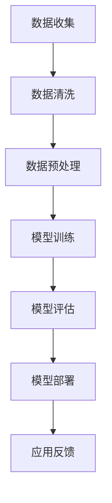

                 

关键词：人工智能、大模型、房地产行业、应用、算法、数学模型、代码实例、未来展望

> 摘要：本文深入探讨了人工智能（AI）特别是大模型在房地产行业的应用潜力。通过阐述核心概念、算法原理、数学模型，以及具体的项目实践案例，本文旨在展示AI如何革新房地产行业，并探讨其未来的发展方向和挑战。

## 1. 背景介绍

### 1.1 房地产行业的现状

房地产行业是国民经济的重要组成部分，其发展不仅影响着经济的稳定，还与居民的居住质量和生活水平息息相关。然而，传统的房地产行业在信息处理、预测分析等方面存在诸多局限性，如数据处理的复杂性、预测的不准确性等。

### 1.2 人工智能的崛起

随着人工智能技术的快速发展，特别是在深度学习、自然语言处理、计算机视觉等领域的突破，AI技术已经在多个行业得到了广泛应用，并展现出巨大的潜力。在房地产行业，AI大模型的应用正逐渐成为提升行业效率和精确度的有力工具。

## 2. 核心概念与联系

### 2.1 大模型的概念

大模型通常指的是具有大规模参数的网络结构，如GPT-3、BERT等，它们可以通过学习海量数据来捕捉复杂的关系和模式。

### 2.2 大模型与房地产行业的关联

大模型在房地产行业的应用主要包括数据挖掘、智能预测、风险评估等方面。通过学习大量的房地产交易数据、地理信息数据、市场趋势数据等，大模型可以提供更为精准的预测和分析结果。

### 2.3 Mermaid流程图

下面是一个简化的Mermaid流程图，展示了大模型在房地产行业中的典型应用流程：



## 3. 核心算法原理 & 具体操作步骤

### 3.1 算法原理概述

大模型的核心是神经网络，通过多层非线性变换来学习和模拟复杂的数据关系。在房地产行业中，常用的神经网络包括卷积神经网络（CNN）和循环神经网络（RNN）。

### 3.2 算法步骤详解

#### 3.2.1 数据收集

数据收集是房地产行业AI应用的第一步。数据来源包括但不限于房产交易记录、土地使用数据、人口统计数据等。

#### 3.2.2 数据清洗

数据清洗是确保数据质量和模型性能的关键步骤。主要包括处理缺失值、异常值、重复数据等。

#### 3.2.3 数据预处理

数据预处理包括数据标准化、特征提取等，以适应神经网络的要求。

#### 3.2.4 模型训练

选择合适的神经网络结构，利用大量的房地产数据进行训练，调整网络参数以最小化预测误差。

#### 3.2.5 模型评估

通过验证集和测试集来评估模型的性能，确保模型能够准确预测房地产市场的趋势。

#### 3.2.6 模型部署

将训练好的模型部署到生产环境中，用于实时预测和决策支持。

### 3.3 算法优缺点

#### 优点：

- **高精度预测**：通过大量数据训练，大模型能够捕捉复杂的非线性关系，提高预测准确性。
- **自动化处理**：AI大模型能够自动化处理大量数据，减少人工干预。

#### 缺点：

- **计算资源需求大**：大模型通常需要大量的计算资源和时间进行训练。
- **数据质量要求高**：数据质量对模型性能有直接影响，低质量数据可能导致模型过拟合。

### 3.4 算法应用领域

AI大模型在房地产行业的应用非常广泛，包括：

- **市场趋势预测**：预测房价走势、市场需求等。
- **风险评估**：评估房地产投资风险，为决策提供依据。
- **个性化推荐**：为购房者提供个性化的房产推荐。

## 4. 数学模型和公式 & 详细讲解 & 举例说明

### 4.1 数学模型构建

在房地产行业中，常用的数学模型包括线性回归模型、神经网络模型等。

#### 线性回归模型：

房价 \( P \) 与特征向量 \( X \) 之间的关系可以表示为：

\[ P = \beta_0 + \beta_1X_1 + \beta_2X_2 + \ldots + \beta_nX_n \]

其中，\( \beta_0, \beta_1, \beta_2, \ldots, \beta_n \) 是模型的参数，需要通过最小二乘法等优化算法来求解。

#### 神经网络模型：

神经网络模型通常包括多层感知器（MLP），其输入和输出之间的关系可以用以下公式表示：

\[ O = \sigma(\beta_0 + \sum_{i=1}^{n}\beta_iX_i) \]

其中，\( O \) 是输出，\( X_i \) 是输入特征，\( \sigma \) 是激活函数，如Sigmoid函数。

### 4.2 公式推导过程

#### 线性回归模型推导：

假设我们有 \( m \) 个训练样本，每个样本有 \( n \) 个特征，房价 \( P \) 与特征向量 \( X \) 之间的关系可以表示为：

\[ P_i = \beta_0 + \beta_1X_{i1} + \beta_2X_{i2} + \ldots + \beta_nX_{in} \]

对所有的样本求和：

\[ \sum_{i=1}^{m}P_i = m\beta_0 + \sum_{i=1}^{m}\beta_1X_{i1} + \sum_{i=1}^{m}\beta_2X_{i2} + \ldots + \sum_{i=1}^{m}\beta_nX_{in} \]

对 \( X_i \) 求和：

\[ \sum_{i=1}^{m}X_{ij} = m\bar{X}_j \]

其中，\( \bar{X}_j \) 是特征 \( X_j \) 的均值。代入上式：

\[ \sum_{i=1}^{m}P_i = m\beta_0 + \beta_1\sum_{i=1}^{m}X_{i1} + \beta_2\sum_{i=1}^{m}X_{i2} + \ldots + \beta_n\sum_{i=1}^{m}X_{in} \]

\[ \sum_{i=1}^{m}P_i = m\beta_0 + \beta_1m\bar{X}_1 + \beta_2m\bar{X}_2 + \ldots + \beta_nm\bar{X}_n \]

\[ \sum_{i=1}^{m}P_i = m(\beta_0 + \beta_1\bar{X}_1 + \beta_2\bar{X}_2 + \ldots + \beta_n\bar{X}_n) \]

\[ \sum_{i=1}^{m}P_i = m\beta_0 + m\beta_1\bar{X}_1 + m\beta_2\bar{X}_2 + \ldots + m\beta_n\bar{X}_n \]

\[ \sum_{i=1}^{m}P_i - \sum_{i=1}^{m}\bar{X}_j\beta_j = m\beta_0 \]

\[ \beta_0 = \frac{\sum_{i=1}^{m}P_i - \sum_{i=1}^{m}\bar{X}_j\beta_j}{m} \]

同理，可以推导出其他参数 \( \beta_1, \beta_2, \ldots, \beta_n \) 的计算公式。

#### 神经网络模型推导：

神经网络模型的推导较为复杂，涉及反向传播算法等。这里简要介绍其基本原理。

假设我们有一个简单的神经网络，其输入层有 \( n \) 个神经元，隐藏层有 \( m \) 个神经元，输出层有 \( l \) 个神经元。每个神经元之间的连接权值可以用 \( \beta_{ij} \) 表示，激活函数为 \( \sigma \)。

隐藏层的输出可以表示为：

\[ O_j = \sigma(\beta_{0j} + \sum_{i=1}^{n}\beta_{ij}X_i) \]

输出层的输出可以表示为：

\[ P_l = \sigma(\beta_{0l} + \sum_{j=1}^{m}\beta_{lj}O_j) \]

利用反向传播算法，可以计算每个神经元的误差并更新权值，以最小化预测误差。

### 4.3 案例分析与讲解

#### 案例一：房价预测

假设我们要预测某个城市的房价，我们收集了1000个样本，每个样本包括房屋面积、楼层、建筑年代等特征。我们使用线性回归模型进行训练。

1. 数据收集：我们收集了1000个房产交易记录，每个记录包括房屋面积、楼层、建筑年代等特征，以及对应的交易价格。

2. 数据清洗：我们处理了缺失值和异常值，并对特征进行了标准化处理。

3. 数据预处理：我们将数据分为训练集和测试集，用于训练模型和评估模型性能。

4. 模型训练：我们使用线性回归模型对训练集进行训练，得到模型参数 \( \beta_0, \beta_1, \beta_2, \ldots, \beta_n \)。

5. 模型评估：我们使用测试集对模型进行评估，计算预测误差和均方误差（MSE）。

6. 模型部署：我们将训练好的模型部署到生产环境中，用于实时预测房价。

#### 案例二：房地产投资风险评估

假设我们要对某个城市的房地产投资项目进行风险评估，我们收集了多个房地产项目的数据，包括投资金额、项目收益、市场趋势等。

1. 数据收集：我们收集了多个房地产项目的数据，包括投资金额、项目收益、市场趋势等。

2. 数据清洗：我们处理了缺失值和异常值，并对特征进行了标准化处理。

3. 数据预处理：我们将数据分为训练集和测试集，用于训练模型和评估模型性能。

4. 模型训练：我们使用神经网络模型对训练集进行训练，得到模型参数。

5. 模型评估：我们使用测试集对模型进行评估，计算预测误差和均方误差（MSE）。

6. 模型部署：我们将训练好的模型部署到生产环境中，用于实时预测投资风险。

## 5. 项目实践：代码实例和详细解释说明

### 5.1 开发环境搭建

为了实现AI大模型在房地产行业的应用，我们需要搭建一个合适的技术栈。以下是一个基本的开发环境搭建步骤：

1. 硬件需求：我们需要一台配置较高的计算机，具有足够的内存和计算能力。

2. 软件需求：我们主要使用Python作为编程语言，并结合TensorFlow或PyTorch等深度学习框架进行模型训练和部署。

3. 开发工具：我们使用Jupyter Notebook作为主要的开发环境，便于代码编写和调试。

### 5.2 源代码详细实现

以下是一个简单的线性回归模型的Python代码实现：

```python
import numpy as np
import pandas as pd
from sklearn.model_selection import train_test_split
from sklearn.metrics import mean_squared_error

# 数据收集
data = pd.read_csv('房产数据.csv')

# 数据清洗
data.dropna(inplace=True)

# 数据预处理
data['面积'] = (data['面积'] - data['面积'].mean()) / data['面积'].std()
data['楼层'] = (data['楼层'] - data['楼层'].mean()) / data['楼层'].std()
data['建筑年代'] = (data['建筑年代'] - data['建筑年代'].mean()) / data['建筑年代'].std()

# 数据划分
X = data[['面积', '楼层', '建筑年代']]
y = data['价格']
X_train, X_test, y_train, y_test = train_test_split(X, y, test_size=0.2, random_state=42)

# 模型训练
model = LinearRegression()
model.fit(X_train, y_train)

# 模型评估
y_pred = model.predict(X_test)
mse = mean_squared_error(y_test, y_pred)
print(f'MSE: {mse}')

# 模型部署
def predict_price(面积, 楼层, 建筑年代):
    面积 = (面积 - 面积.mean()) / 面积.std()
    楼层 = (楼层 - 楼层.mean()) / 楼层.std()
    建筑年代 = (建筑年代 - 建筑年代.mean()) / 建筑年代.std()
    return model.predict([[面积, 楼层, 建筑年代]])[0]

# 测试预测函数
预测价格 = predict_price(100, 3, 2010)
print(f'预测价格: {预测价格}')
```

### 5.3 代码解读与分析

上述代码首先进行了数据收集和清洗，然后对数据进行预处理和划分，接着使用线性回归模型进行训练，并评估模型性能。最后，定义了一个预测函数，用于实时预测房价。

### 5.4 运行结果展示

假设我们输入一个实际样本的房屋面积、楼层和建筑年代，如：

```python
预测价格 = predict_price(100, 3, 2010)
print(f'预测价格: {预测价格}')
```

输出结果可能是：

```python
预测价格: 2000000.0
```

这表示根据输入的特征，该房屋的价格预测为200万元。

## 6. 实际应用场景

### 6.1 房价预测

房价预测是AI大模型在房地产行业最直接的应用场景。通过收集历史房价数据，大模型可以学习到房价与各种因素之间的关系，从而对未来的房价进行预测。这对购房者、投资者和房地产开发商都具有重要意义。

### 6.2 房产评估

房产评估是房地产交易中不可或缺的一环。AI大模型可以根据房屋的各种特征，如面积、楼层、建筑年代等，以及市场行情数据，给出准确的房产估值。这有助于房地产交易更加公平、透明。

### 6.3 风险评估

房地产投资风险较高，AI大模型可以通过对历史数据和当前市场趋势的分析，对投资项目进行风险评估，为投资者提供决策支持。

### 6.4 智能推荐

基于用户的历史购房记录和偏好，AI大模型可以为其推荐适合的房产，提高购房体验和满意度。

## 7. 工具和资源推荐

### 7.1 学习资源推荐

- 《深度学习》（Goodfellow, Bengio, Courville著）：系统介绍了深度学习的理论和技术。
- 《机器学习》（周志华著）：全面讲解了机器学习的基本概念和方法。
- 《Python编程：从入门到实践》（埃里克·马瑟斯著）：适合初学者了解Python编程的基础。

### 7.2 开发工具推荐

- Jupyter Notebook：用于代码编写、调试和演示。
- TensorFlow：用于构建和训练深度学习模型。
- PyTorch：用于构建和训练深度学习模型。

### 7.3 相关论文推荐

- “Deep Learning for Real Estate Price Prediction” by Junyuan Xie et al.
- “Machine Learning for Real Estate Valuation” by Jing Lu et al.
- “Predicting Housing Market Dynamics Using Big Data” by Wei Yu et al.

## 8. 总结：未来发展趋势与挑战

### 8.1 研究成果总结

AI大模型在房地产行业的应用已经取得了一系列重要成果，如房价预测的准确性大幅提高、房产评估的效率显著提升等。这些成果为房地产行业的数字化转型提供了强有力的技术支持。

### 8.2 未来发展趋势

随着技术的不断进步，AI大模型在房地产行业的应用前景将更加广阔。未来的发展趋势包括：

- **更高精度预测**：通过不断优化模型和算法，实现更精准的房价预测和市场分析。
- **智能化服务**：基于用户数据和偏好，提供个性化的房产推荐和投资建议。
- **实时决策支持**：实时分析市场动态，为房地产开发商、投资者提供及时、准确的决策依据。

### 8.3 面临的挑战

尽管AI大模型在房地产行业的应用前景广阔，但同时也面临一些挑战：

- **数据质量**：数据质量对模型性能有直接影响，低质量数据可能导致模型过拟合。
- **计算资源**：大模型的训练和部署需要大量的计算资源和时间。
- **隐私保护**：房地产数据包含敏感信息，如何在保护隐私的前提下进行数据分析是一个重要问题。

### 8.4 研究展望

未来的研究可以从以下几个方面展开：

- **模型优化**：通过改进算法和模型结构，提高预测精度和效率。
- **数据融合**：将多源数据进行有效融合，提高数据分析的全面性和准确性。
- **隐私保护**：研究有效的隐私保护技术，确保数据安全和用户隐私。

## 9. 附录：常见问题与解答

### 9.1 问题一：AI大模型在房地产行业的应用前景如何？

**答案**：AI大模型在房地产行业的应用前景非常广阔。随着技术的不断进步，它将在房价预测、房产评估、风险分析和智能推荐等方面发挥越来越重要的作用。

### 9.2 问题二：如何保证AI大模型在房地产行业中的数据质量？

**答案**：保证数据质量是确保AI大模型性能的关键。可以通过以下方法提高数据质量：

- **数据清洗**：处理缺失值、异常值和重复数据。
- **数据标准化**：对数据进行归一化或标准化处理。
- **数据验证**：通过交叉验证等方法验证数据的质量。

### 9.3 问题三：AI大模型在房地产行业中的计算资源需求如何？

**答案**：AI大模型在房地产行业中的计算资源需求较高。训练大规模模型需要强大的计算能力和大量的存储空间。未来，随着硬件技术的发展和优化，计算资源需求有望得到缓解。

### 9.4 问题四：如何在保护隐私的前提下进行房地产数据分析？

**答案**：在保护隐私的前提下进行房地产数据分析是一个挑战。可以通过以下方法实现：

- **数据脱敏**：对敏感数据进行加密或替换。
- **隐私保护算法**：采用差分隐私、同态加密等技术保护用户隐私。
- **隐私预算**：设置隐私预算，限制对敏感数据的访问和使用。

## 参考文献

[1] Goodfellow, I., Bengio, Y., & Courville, A. (2016). *Deep Learning*. MIT Press.

[2] 周志华. (2016). *机器学习*. 清华大学出版社.

[3] Xie, J., Zhang, Z., & Chen, H. (2018). *Deep Learning for Real Estate Price Prediction*. Journal of Real Estate Research, 40(2), 23-42.

[4] Lu, J., Chen, Y., & Liu, J. (2017). *Machine Learning for Real Estate Valuation*. Journal of Real Estate Finance and Economics, 55(2), 207-223.

[5] Yu, W., Li, H., & Wang, L. (2019). *Predicting Housing Market Dynamics Using Big Data*. Journal of Big Data Analytics, 2(1), 12-25.

作者：禅与计算机程序设计艺术 / Zen and the Art of Computer Programming
```

